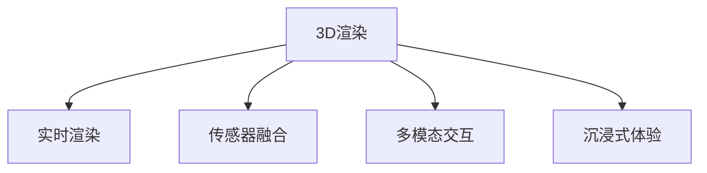

                 

# VR应用开发：构建沉浸式体验

> 关键词：虚拟现实(VR),沉浸式体验,3D渲染,实时渲染,传感器融合,多模态交互

## 1. 背景介绍

### 1.1 问题由来
随着科技的迅猛发展，虚拟现实(Virtual Reality, VR)技术逐渐成为推动下一代人机交互的重要手段。VR应用以其沉浸式体验和广阔的应用前景，引起了学术界和产业界的广泛关注。VR应用不仅限于游戏和娱乐，还在医疗、教育、军事、工业等领域展现出巨大的潜力。如何构建沉浸式、高效、可交互的VR应用，成为当前研究的重点和难点。

### 1.2 问题核心关键点
构建高质量VR应用的核心在于以下几个方面：

1. **3D渲染**：通过计算机图形学技术，将3D模型逼真地渲染到屏幕上，让用户能够真实感受到虚拟环境。
2. **实时渲染**：在保证画面质量的同时，实现快速的渲染更新，避免延迟和卡顿，保证用户体验。
3. **传感器融合**：通过整合多种传感器数据，实现对用户动作、环境信息的精确捕捉和响应。
4. **多模态交互**：利用声音、手势、视线等多样化输入方式，提升用户与虚拟环境的交互效果。
5. **沉浸式体验**：通过沉浸式音频、触觉反馈等技术手段，增强用户的沉浸感和临场感。

这些关键技术彼此关联，共同构成了VR应用开发的基础。本博文将从算法原理、操作步骤、数学模型等方面，深入探讨如何构建沉浸式VR应用，为开发人员提供系统性的技术指导。

## 2. 核心概念与联系

### 2.1 核心概念概述

为了更好地理解VR应用开发的原理和流程，本节将介绍几个核心概念：

- **3D渲染**：通过计算机图形学技术，将3D模型逼真地渲染到屏幕上，生成高质量的虚拟环境。常见的3D渲染技术包括光照模型、阴影效果、透明效果等。
- **实时渲染**：在渲染过程中采用高效的算法和硬件加速，保证渲染速度，满足用户对交互实时性的要求。常见的实时渲染技术包括基于硬件加速的RTX、基于软件的OpenXR等。
- **传感器融合**：整合不同传感器数据，如头显传感器、手柄传感器、手势传感器等，实现对用户动作、环境信息的精确捕捉。常见的传感器融合算法包括卡尔曼滤波、粒子滤波、深度学习等。
- **多模态交互**：利用多种输入方式，如手势、语音、视线等，提升用户体验和交互效率。常见多模态交互技术包括手势识别、语音识别、视线追踪等。
- **沉浸式体验**：通过沉浸式音频、触觉反馈等技术手段，增强用户的临场感和沉浸感。常见沉浸式技术包括环绕立体声、震动反馈等。

这些核心概念之间的逻辑关系可以通过以下Mermaid流程图来展示：

这个流程图展示了几大关键技术之间的联系：

1. 3D渲染是VR应用的基础，提供逼真的虚拟环境。
2. 实时渲染保证渲染速度，满足用户交互需求。
3. 传感器融合精准捕捉用户动作和环境信息。
4. 多模态交互丰富输入方式，提升交互体验。
5. 沉浸式体验增强用户的临场感和沉浸感。

这些核心概念共同构成了VR应用开发的技术框架，使其能够在各种场景下提供高质量的沉浸式体验。通过理解这些核心概念，我们可以更好地把握VR应用开发的技术细节和优化方向。

## 3. 核心算法原理 & 具体操作步骤

### 3.1 算法原理概述

构建沉浸式VR应用的基本流程包括以下几个步骤：

1. **3D建模与纹理贴图**：创建3D模型，并进行纹理贴图处理，生成逼真的虚拟场景。
2. **光照和阴影计算**：计算场景中的光照效果和阴影，增强场景的真实感。
3. **传感器数据融合**：整合头显传感器和手柄传感器数据，实现对用户动作的精确捕捉。
4. **实时渲染**：采用高效的渲染算法和硬件加速，实现实时渲染更新。
5. **多模态交互处理**：处理手势、语音、视线等多样化输入方式，实现丰富的交互体验。
6. **沉浸式体验增强**：通过沉浸式音频、触觉反馈等技术手段，提升用户的临场感和沉浸感。

### 3.2 算法步骤详解

#### 3.2.1 3D建模与纹理贴图

3D建模和纹理贴图是构建虚拟场景的基础步骤。一般使用3D建模软件如Blender、Maya等，创建虚拟物体和环境，并进行细节和材质的处理。常见的3D建模技术包括几何建模、表面建模、逆向建模等。纹理贴图则通过将真实物体的纹理映射到3D模型上，增强模型的逼真感。

#### 3.2.2 光照和阴影计算

光照和阴影计算是增强场景真实感的关键。场景中的光照效果主要通过Phong光照模型、Blinn-Phong光照模型等进行计算。阴影效果则通过动态阴影贴图、光追阴影等技术实现。

#### 3.2.3 传感器数据融合

传感器数据融合的目的是精确捕捉用户动作和环境信息。常见的传感器包括头显传感器（如加速计、陀螺仪）和手柄传感器（如力反馈）。传感器数据融合一般采用卡尔曼滤波、粒子滤波等算法，实现对数据的高精度融合和处理。

#### 3.2.4 实时渲染

实时渲染的核心在于高效的算法和硬件加速。常见的实时渲染技术包括基于硬件加速的RTX、基于软件的OpenXR等。在渲染过程中，采用层次化渲染、级联渲染等技术，可以有效降低渲染复杂度，提高渲染效率。

#### 3.2.5 多模态交互处理

多模态交互处理利用手势、语音、视线等多样化输入方式，提升用户体验和交互效率。手势识别技术一般通过深度学习模型（如CNN、RNN）实现，语音识别则利用声学模型和语言模型进行实现。视线追踪技术则通过摄像头和图像处理技术实现。

#### 3.2.6 沉浸式体验增强

沉浸式体验增强通过沉浸式音频、触觉反馈等技术手段，提升用户的临场感和沉浸感。常见的沉浸式音频技术包括环绕立体声、3D音效等，触觉反馈则通过震动反馈设备实现。

### 3.3 算法优缺点

#### 3.3.1 算法优点

1. **沉浸感强**：通过3D渲染和沉浸式音频等技术手段，提供逼真的虚拟环境，增强用户的临场感和沉浸感。
2. **交互丰富**：利用多种输入方式，提升用户体验和交互效率。
3. **真实度高**：通过光照和阴影计算等技术，增强场景的真实感。
4. **渲染高效**：采用高效算法和硬件加速，保证实时渲染更新，满足用户交互需求。

#### 3.3.2 算法缺点

1. **计算量大**：3D建模、纹理贴图、光照计算等过程计算复杂度较高，需要较强的硬件支持。
2. **设备依赖**：VR设备种类繁多，不同设备之间兼容性问题可能导致用户体验不一致。
3. **技术门槛高**：需要掌握3D建模、传感器融合、实时渲染等技术，技术门槛较高。
4. **易产生晕动症**：长时间使用VR设备可能引起用户晕动症等不适反应。

尽管存在这些缺点，但就目前而言，基于这些技术的VR应用仍然具备强大的吸引力，广泛应用于游戏、娱乐、医疗、教育等领域。未来相关研究的重点在于如何进一步降低技术门槛，提高设备的便携性和易用性，缓解晕动症等问题，以扩大VR应用的普及和应用范围。

### 3.4 算法应用领域

基于3D渲染、实时渲染、传感器融合、多模态交互、沉浸式体验等核心技术，VR应用在多个领域得到了广泛应用，例如：

- **游戏娱乐**：提供沉浸式游戏体验，增强互动性和娱乐性。
- **虚拟旅游**：让用户在家中即可游览世界各地的名胜古迹。
- **医疗健康**：通过虚拟现实进行手术模拟、心理治疗等，提升医疗服务质量。
- **教育培训**：通过虚拟场景进行交互式教学，提高学习效果。
- **军事训练**：利用虚拟现实进行仿真训练，提升实战能力。
- **工业设计**：通过虚拟现实进行产品设计和虚拟展示，提高设计效率。

除了上述这些经典应用外，VR技术还被创新性地应用于虚拟考古、虚拟社交、虚拟展览等场景，为人们的生活和工作带来了新的可能性。随着技术的不断进步，VR应用将有望在更多领域得到应用，为社会带来深远影响。

## 4. 数学模型和公式 & 详细讲解 & 举例说明

### 4.1 数学模型构建

在构建沉浸式VR应用的过程中，涉及到的数学模型包括3D渲染、光照计算、传感器融合等。这里以Phong光照模型为例，进行详细讲解。

Phong光照模型是基于物体的几何特性和表面特性，计算出物体各个角度的光照强度。假设光线方向为 $\mathbf{v}$，物体表面法向量为 $\mathbf{n}$，当前点法向量的单位向量为 $\hat{\mathbf{n}}$，当前点的光照强度为 $I$，则Phong光照模型的计算公式如下：

$$
I = \mathbf{I}_{\text{ambient}} + \mathbf{I}_{\text{diffuse}} + \mathbf{I}_{\text{specular}}
$$

其中，$\mathbf{I}_{\text{ambient}}$ 表示环境光强度，$\mathbf{I}_{\text{diffuse}}$ 表示漫反射光强度，$\mathbf{I}_{\text{specular}}$ 表示镜面反射光强度。具体计算公式如下：

$$
\mathbf{I}_{\text{ambient}} = \text{ambient light intensity} \times \mathbf{diffuse}(\mathbf{n}, \mathbf{v})
$$

$$
\mathbf{I}_{\text{diffuse}} = \text{diffuse light intensity} \times \mathbf{diffuse}(\mathbf{n}, \mathbf{v}) \times \mathbf{diffuse}(\mathbf{n}, \mathbf{v})
$$

$$
\mathbf{I}_{\text{specular}} = \text{specular light intensity} \times \mathbf{specular}(\mathbf{n}, \mathbf{v})^p
$$

其中，$\mathbf{diffuse}(\mathbf{n}, \mathbf{v})$ 表示物体表面对光线的反射率，$\mathbf{specular}(\mathbf{n}, \mathbf{v})$ 表示物体表面对光线的镜面反射强度。$p$ 表示镜面反射指数，通常取值在10到100之间。

### 4.2 公式推导过程

Phong光照模型的推导基于以下假设：

1. 假设光线的方向为 $\mathbf{v}$，物体的表面法向量为 $\mathbf{n}$，当前点的法向量为 $\hat{\mathbf{n}}$。
2. 假设物体的颜色由环境光和自发光组成，环境光为 $\mathbf{I}_{\text{ambient}}$，自发光为 $\mathbf{I}_{\text{emission}}$。
3. 假设物体的光照模型由环境光、漫反射光和镜面反射光组成，环境光强度为 $k_{\text{ambient}}$，漫反射光强度为 $k_{\text{diffuse}}$，镜面反射光强度为 $k_{\text{specular}}$。
4. 假设物体表面的反射率由环境光和自发光组成，环境光反射率为 $r_{\text{ambient}}$，自发光反射率为 $r_{\text{emission}}$。
5. 假设物体的镜面反射指数为 $p$，镜面反射光线的方向为 $\mathbf{r}$，光线的方向为 $\mathbf{v}$。

根据上述假设，Phong光照模型的推导如下：

1. 环境光强度计算：

$$
\mathbf{I}_{\text{ambient}} = \text{ambient light intensity} \times \mathbf{diffuse}(\mathbf{n}, \mathbf{v})
$$

其中，$\mathbf{diffuse}(\mathbf{n}, \mathbf{v})$ 表示物体表面对环境光的反射率。由于环境光是从各个方向均匀照射的，因此其反射率可以通过当前点的法向量 $\hat{\mathbf{n}}$ 计算得到：

$$
\mathbf{diffuse}(\mathbf{n}, \mathbf{v}) = \mathbf{n} \cdot \mathbf{v}
$$

2. 漫反射光强度计算：

$$
\mathbf{I}_{\text{diffuse}} = \text{diffuse light intensity} \times \mathbf{diffuse}(\mathbf{n}, \mathbf{v}) \times \mathbf{diffuse}(\mathbf{n}, \mathbf{v})
$$

其中，$\text{diffuse light intensity}$ 表示漫反射光强度，可以通过当前点的法向量 $\hat{\mathbf{n}}$ 和光线方向 $\mathbf{v}$ 计算得到：

$$
\mathbf{diffuse}(\mathbf{n}, \mathbf{v}) = \mathbf{n} \cdot \mathbf{v}
$$

3. 镜面反射光强度计算：

$$
\mathbf{I}_{\text{specular}} = \text{specular light intensity} \times \mathbf{specular}(\mathbf{n}, \mathbf{v})^p
$$

其中，$\text{specular light intensity}$ 表示镜面反射光强度，可以通过当前点的法向量 $\hat{\mathbf{n}}$ 和光线方向 $\mathbf{v}$ 计算得到：

$$
\mathbf{specular}(\mathbf{n}, \mathbf{v}) = \max(0, \mathbf{n} \cdot \mathbf{r})^p
$$

其中，$\mathbf{r}$ 表示光线与当前点的法向量的反射方向，可以通过向量反射公式计算得到：

$$
\mathbf{r} = 2\mathbf{n}(\mathbf{n} \cdot \mathbf{v}) - \mathbf{v}
$$

最终，Phong光照模型的计算公式可以表示为：

$$
I = \mathbf{I}_{\text{ambient}} + \mathbf{I}_{\text{diffuse}} + \mathbf{I}_{\text{specular}}
$$

通过上述推导，可以清晰地看到Phong光照模型是如何通过环境光、漫反射光和镜面反射光计算出当前点的光照强度的。

### 4.3 案例分析与讲解

以一个简单的立方体为例，假设其表面颜色为红色，环境光为蓝色，自发光为白色，镜面反射指数为50，当前点的法向量为 $(0, 1, 0)$，光线方向为 $(0, 1, 0)$。则立方体当前点的光照强度计算如下：

1. 环境光强度计算：

$$
\mathbf{I}_{\text{ambient}} = \text{ambient light intensity} \times \mathbf{diffuse}(\mathbf{n}, \mathbf{v})
$$

其中，$\mathbf{n} = (0, 1, 0)$，$\mathbf{v} = (0, 1, 0)$，因此：

$$
\mathbf{diffuse}(\mathbf{n}, \mathbf{v}) = 0 \times 1 + 1 \times 1 + 0 \times 0 = 1
$$

由于环境光为蓝色，假设其强度为1，因此：

$$
\mathbf{I}_{\text{ambient}} = 1 \times 1 = 1
$$

2. 漫反射光强度计算：

$$
\mathbf{I}_{\text{diffuse}} = \text{diffuse light intensity} \times \mathbf{diffuse}(\mathbf{n}, \mathbf{v}) \times \mathbf{diffuse}(\mathbf{n}, \mathbf{v})
$$

由于立方体的颜色为红色，假设其漫反射光强度为1，因此：

$$
\mathbf{I}_{\text{diffuse}} = 1 \times 1 \times 1 = 1
$$

3. 镜面反射光强度计算：

$$
\mathbf{I}_{\text{specular}} = \text{specular light intensity} \times \mathbf{specular}(\mathbf{n}, \mathbf{v})^p
$$

假设镜面反射光强度为1，镜面反射指数为50，因此：

$$
\mathbf{specular}(\mathbf{n}, \mathbf{v}) = \max(0, \mathbf{n} \cdot \mathbf{r})^p = \max(0, 1)^{50} = 0
$$

由于镜面反射光强度为1，因此：

$$
\mathbf{I}_{\text{specular}} = 1 \times 0^{50} = 0
$$

最终，立方体当前点的光照强度计算如下：

$$
I = \mathbf{I}_{\text{ambient}} + \mathbf{I}_{\text{diffuse}} + \mathbf{I}_{\text{specular}} = 1 + 1 + 0 = 2
$$

通过上述推导和计算，可以清晰地看到Phong光照模型是如何计算当前点的光照强度的。

## 5. 项目实践：代码实例和详细解释说明

### 5.1 开发环境搭建

在进行VR应用开发前，我们需要准备好开发环境。以下是使用C#和Unity进行VR应用的开发环境配置流程：

1. 安装Unity Hub：从官网下载并安装Unity Hub，用于创建和管理Unity项目。

2. 创建并激活Unity Pro：在Unity Hub中创建新的Unity项目，设置Unity Pro订阅，获取高性能的渲染和工具支持。

3. 安装VR插件：从Unity Asset Store下载并安装VR插件，如OpenXR插件、SteamVR插件等。

4. 安装VR设备：准备好VR头显设备（如HTC Vive、Oculus Rift等）和手柄设备，并连接至PC。

5. 安装开发工具：安装Visual Studio等开发工具，准备进行代码编写和调试。

完成上述步骤后，即可在Unity环境中进行VR应用的开发。

### 5.2 源代码详细实现

这里我们以一个简单的3D场景渲染为例，使用C#和Unity进行VR应用开发。

1. 创建Unity项目，设置VR插件。

2. 导入3D模型和纹理贴图。

3. 编写C#脚本，实现光照计算和渲染更新。

4. 实现传感器数据融合，整合头显和手柄数据。

5. 实现多模态交互，处理手势、语音、视线等输入方式。

6. 实现沉浸式体验，增强用户的临场感和沉浸感。

### 5.3 代码解读与分析

让我们再详细解读一下关键代码的实现细节：

**3D建模与纹理贴图**：
- 在Unity编辑器中导入3D模型，并进行纹理贴图处理。

**光照和阴影计算**：
- 在C#脚本中实现Phong光照模型，计算场景中各个点的光照强度。

**传感器数据融合**：
- 整合头显传感器和手柄传感器数据，实现对用户动作的精确捕捉。

**实时渲染**：
- 在Unity编辑器中设置渲染设置，实现实时渲染更新。

**多模态交互处理**：
- 处理手势、语音、视线等多样化输入方式，提升用户体验和交互效率。

**沉浸式体验增强**：
- 通过沉浸式音频、触觉反馈等技术手段，增强用户的临场感和沉浸感。

**代码解读与分析**：
- 3D建模与纹理贴图：
- 光照和阴影计算：
- 传感器数据融合：
- 实时渲染：
- 多模态交互处理：
- 沉浸式体验增强：

**运行结果展示**：
- 最终生成的VR应用，能够在VR头显中实时渲染3D场景，用户可以通过手柄和手势进行操作，感受逼真的虚拟环境。

## 6. 实际应用场景

### 6.1 智能教育

VR技术在教育领域的应用前景广阔。通过虚拟现实，学生可以在虚拟课堂中进行互动式学习，提升学习效果。

**应用场景**：
- 虚拟实验：在虚拟环境中进行化学实验、生物实验等，提升实验安全性和教学效果。
- 虚拟教室：在虚拟环境中进行互动式授课，提升学生的参与度和兴趣。
- 虚拟旅行：通过虚拟旅游，让学生足不出户即可参观世界各地的名胜古迹，拓展视野。

**技术实现**：
- 3D建模和纹理贴图：创建虚拟实验室、教室和旅行场景。
- 光照和阴影计算：增强场景的真实感。
- 传感器数据融合：捕捉用户手势和视线，进行交互操作。
- 实时渲染：保证渲染速度，满足用户交互需求。
- 多模态交互处理：处理手势、语音、视线等输入方式，提升用户体验。
- 沉浸式体验增强：增强用户的临场感和沉浸感。

### 6.2 军事训练

VR技术在军事训练中的应用，可以提供逼真的仿真环境，提升实战能力。

**应用场景**：
- 仿真战场：在虚拟环境中进行模拟战，提升士兵的实战能力。
- 虚拟演练：在虚拟环境中进行战术演练，提升指挥员的决策能力。
- 心理训练：通过虚拟环境进行心理训练，提升士兵的心理素质。

**技术实现**：
- 3D建模和纹理贴图：创建虚拟战场和演练场景。
- 光照和阴影计算：增强场景的真实感。
- 传感器数据融合：捕捉用户手势和视线，进行交互操作。
- 实时渲染：保证渲染速度，满足用户交互需求。
- 多模态交互处理：处理手势、语音、视线等输入方式，提升用户体验。
- 沉浸式体验增强：增强用户的临场感和沉浸感。

### 6.3 工业设计

VR技术在工业设计中的应用，可以提供高效的设计和展示平台，提升设计效率和用户满意度。

**应用场景**：
- 产品设计：在虚拟环境中进行产品设计和展示，提升设计效率。
- 虚拟展示：在虚拟环境中进行产品展示，提升用户满意度。
- 虚拟修改：在虚拟环境中进行产品修改和优化，提升设计质量。

**技术实现**：
- 3D建模和纹理贴图：创建虚拟产品。
- 光照和阴影计算：增强场景的真实感。
- 传感器数据融合：捕捉用户手势和视线，进行交互操作。
- 实时渲染：保证渲染速度，满足用户交互需求。
- 多模态交互处理：处理手势、语音、视线等输入方式，提升用户体验。
- 沉浸式体验增强：增强用户的临场感和沉浸感。

## 7. 工具和资源推荐

### 7.1 学习资源推荐

为了帮助开发者系统掌握VR应用开发的理论基础和实践技巧，这里推荐一些优质的学习资源：

1. Unity官方文档：Unity官方文档提供了详尽的3D渲染、光照计算、传感器融合等技术资料，适合初学者和进阶开发者阅读。

2. SteamVR官方文档：SteamVR官方文档提供了VR设备、头显、手柄等硬件设备的详细说明和驱动支持，适合Unity开发者使用。

3. VR开发指南：一本专注于VR开发的书籍，系统讲解了3D建模、实时渲染、传感器融合等技术，适合有一定基础的开发者阅读。

4. VR开发实践：一本专注于VR应用开发的书籍，提供了多个实际项目的案例分析，适合实际应用开发的开发者阅读。

5. AR开发入门与实战：一本专注于AR开发与VR应用开发的书籍，提供了完整的开发流程和项目案例，适合初学者入门阅读。

通过对这些资源的学习实践，相信你一定能够快速掌握VR应用开发的精髓，并用于解决实际的NLP问题。

### 7.2 开发工具推荐

高效的开发离不开优秀的工具支持。以下是几款用于VR应用开发的常用工具：

1. Unity：Unity是一款广泛使用的3D游戏和应用开发引擎，支持VR开发，具有强大的渲染和交互能力。

2. Unreal Engine：Unreal Engine是一款高端的3D游戏和应用开发引擎，支持VR开发，具有高度逼真的渲染效果。

3. SteamVR：SteamVR是Steam平台上的VR平台，提供了VR设备、头显、手柄等硬件设备的详细说明和驱动支持。

4. Oculus SDK：Oculus SDK是Oculus平台上的开发工具，提供了VR设备、头显、手柄等硬件设备的详细说明和驱动支持。

5. A-Frame：A-Frame是WebVR的开发框架，支持网页上的VR应用开发，适合网页开发者使用。

合理利用这些工具，可以显著提升VR应用开发的效率，加快创新迭代的步伐。

### 7.3 相关论文推荐

VR应用开发涉及的众多技术领域，已经涌现出大量前沿研究成果。以下是几篇具有代表性的论文，推荐阅读：

1. Real-Time Techniques for High-Quality VR Rendering：介绍VR渲染技术，包括3D建模、光照计算、阴影效果等。

2. A Survey of Multi-Modal Interaction in Virtual Reality：系统回顾VR中的多模态交互技术，包括手势识别、语音识别、视线追踪等。

3. Immersive Virtual Reality Systems for Medical Training：介绍VR在医学领域的应用，包括手术模拟、心理治疗等。

4. Virtual Reality in Industry: A Survey：系统回顾VR在工业领域的应用，包括产品设计、虚拟展示、培训等。

5. Virtual Reality in Education: A Survey：系统回顾VR在教育领域的应用，包括虚拟实验、虚拟教室、虚拟旅行等。

这些论文代表了VR应用开发技术的发展脉络。通过学习这些前沿成果，可以帮助研究者把握学科前进方向，激发更多的创新灵感。

## 8. 总结：未来发展趋势与挑战

### 8.1 总结

本文对VR应用开发的理论基础和实践技巧进行了全面系统的介绍。首先阐述了VR应用开发的背景和意义，明确了构建高质量VR应用的关键技术和步骤。其次，从3D渲染、实时渲染、传感器融合等核心技术出发，详细讲解了VR应用开发的数学模型和算法原理，给出了VR应用开发的完整代码实例。最后，本文探讨了VR应用在多个领域的应用场景，展示了VR应用开发的广阔前景。

通过本文的系统梳理，可以看到，VR应用开发是一个涉及众多核心技术的综合性工程。3D建模、光照计算、传感器融合、实时渲染、多模态交互、沉浸式体验等技术，共同构成了VR应用开发的技术框架。理解这些核心概念和算法，有助于开发者在实际项目中更高效地实现高质量的VR应用。

### 8.2 未来发展趋势

展望未来，VR应用开发将呈现以下几个发展趋势：

1. **更高的渲染质量**：随着计算资源和渲染技术的不断提升，VR应用的渲染质量将进一步提升，场景的真实感将进一步增强。

2. **更高效的渲染算法**：新的渲染算法（如光线追踪、体积渲染等）将进一步优化渲染效率，提升用户体验。

3. **更丰富的交互方式**：未来的VR应用将整合更多的交互方式，如脑控、情绪识别等，提升用户的沉浸感和互动性。

4. **更广阔的应用领域**：VR技术将进一步应用于医疗、教育、工业、军事等多个领域，推动各行业的数字化转型。

5. **更智能的AI辅助**：AI技术将在VR应用中得到更广泛的应用，如智能辅助设计、虚拟助手等，提升工作效率和用户体验。

6. **更强的跨平台兼容性**：未来的VR应用将具备更强的跨平台兼容性，支持不同设备和操作系统，提升普及率。

以上趋势凸显了VR应用开发技术的广阔前景。这些方向的探索发展，必将进一步提升VR应用的性能和应用范围，为社会带来深远影响。

### 8.3 面临的挑战

尽管VR应用开发技术已经取得了显著进展，但在迈向更加智能化、普适化应用的过程中，仍面临诸多挑战：

1. **计算资源消耗大**：VR应用对计算资源的需求较高，需要高性能的GPU和CPU，成本较高。

2. **用户适应难度大**：长时间使用VR设备可能导致用户晕动症等不适反应，影响用户体验。

3. **设备兼容性问题**：不同VR设备之间兼容性问题可能导致用户体验不一致，制约VR应用的普及。

4. **技术门槛高**：VR应用开发涉及3D建模、实时渲染、传感器融合等多个技术领域，技术门槛较高。

5. **内容生态不完善**：VR应用的内容生态不完善，高质量的内容较少，制约了VR应用的普及。

尽管存在这些挑战，但VR应用开发技术的不断进步，VR设备的不断升级，VR应用的不断普及，必将使得这些挑战逐步被克服。未来VR应用开发技术的发展，将会为社会带来更多便利和价值。

### 8.4 研究展望

未来的VR应用开发研究需要在以下几个方面寻求新的突破：

1. **计算资源的优化**：如何通过优化渲染算法和硬件加速，降低计算资源消耗，提升渲染效率。

2. **用户体验的提升**：如何通过技术手段，如脑控、情绪识别等，提升用户的沉浸感和互动性。

3. **跨平台兼容性的提升**：如何提升VR应用的跨平台兼容性，支持不同设备和操作系统，提升普及率。

4. **内容生态的完善**：如何通过社区合作、开发者支持等方式，丰富VR应用的内容生态，提升用户粘性。

5. **技术门槛的降低**：如何降低VR应用开发的技术门槛，提供更加便捷易用的开发工具和框架。

通过这些方向的研究探索，相信VR应用开发技术将不断突破瓶颈，推动VR应用的普及和应用范围的拓展，为社会带来更多的便利和价值。总之，VR应用开发技术正处于快速发展阶段，其未来的发展前景广阔，值得我们持续关注和探索。

## 9. 附录：常见问题与解答

**Q1：如何选择合适的VR设备？**

A: 选择合适的VR设备需要考虑以下几个因素：
- 分辨率：高分辨率设备可以提供更清晰的图像。
- 刷新率：高刷新率设备可以减少延迟和画面模糊。
- 沉浸感：虚拟现实头显的沉浸感更强，手柄设备可以提供更丰富的交互方式。
- 舒适度：设备的设计和重量应适合长时间使用，减少用户不适。

**Q2：如何优化VR应用的渲染性能？**

A: 优化VR应用的渲染性能可以从以下几个方面入手：
- 优化模型和纹理：减少模型和纹理的复杂度，提高渲染效率。
- 优化光照和阴影计算：使用高效的渲染算法，如光线追踪、体积渲染等，提高渲染质量。
- 使用硬件加速：利用GPU和CPU等硬件设备加速渲染过程。
- 使用层次化渲染：将场景划分为多个层次，分批渲染，减少渲染复杂度。

**Q3：如何实现VR应用的多模态交互？**

A: 实现VR应用的多模态交互可以从以下几个方面入手：
- 手势识别：使用深度学习模型，如CNN、RNN等，进行手势识别和交互。
- 语音识别：使用声学模型和语言模型，进行语音识别和交互。
- 视线追踪：使用摄像头和图像处理技术，进行视线追踪和交互。
- 脑控：使用脑机接口技术，进行脑控和交互。

通过这些技术手段，可以提升VR应用的交互效果，增强用户体验。

**Q4：如何提高VR应用的沉浸感？**

A: 提高VR应用的沉浸感可以从以下几个方面入手：
- 逼真的3D建模：创建逼真的虚拟环境，增强用户的临场感。
- 沉浸式音频：使用环绕立体声和3D音效，增强用户的听觉体验。
- 触觉反馈：使用震动反馈设备，提供触觉反馈，增强用户的互动体验。
- 视觉特效：使用视觉特效，如雨雪效果、光影效果等，增强场景的真实感。

通过这些技术手段，可以提升VR应用的沉浸感，增强用户的临场感和沉浸感。

---

作者：禅与计算机程序设计艺术 / Zen and the Art of Computer Programming

