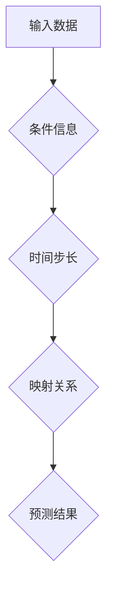

> 条件神经过程 (CNP)、神经网络、时间序列预测、因果推理、映射关系

## 1. 背景介绍

在当今数据爆炸的时代，有效地处理和理解时间序列数据显得尤为重要。从股票市场预测到天气预报，从医疗诊断到自然语言处理，时间序列分析在各个领域都扮演着关键角色。传统的统计模型和机器学习方法在处理复杂的时间序列数据时往往存在局限性，难以捕捉到数据中的深层结构和因果关系。

近年来，条件神经过程 (CNP) 作为一种新型的神经网络模型，凭借其强大的建模能力和对因果关系的敏感性，在时间序列分析领域引起了广泛关注。CNP 能够学习时间序列数据的映射关系，并根据给定的条件信息进行预测，从而为解决复杂的时间序列问题提供了一种新的思路。

## 2. 核心概念与联系

CNP 的核心思想是将时间序列数据视为一系列条件概率分布的映射关系。每个时间点的数据点都是由其前序数据点和条件信息共同决定的。CNP 通过学习这些映射关系，能够预测未来时间点的数据值，并根据不同的条件信息进行调整。

**Mermaid 流程图:**



**核心概念:**

* **条件概率分布:** CNP 将时间序列数据视为一系列条件概率分布，每个时间点的数据点都是由其前序数据点和条件信息共同决定的。
* **映射关系:** CNP 通过学习时间序列数据的映射关系，能够预测未来时间点的数据值。
* **条件信息:** CNP 可以利用额外的条件信息来调整预测结果，例如历史数据、外部环境因素等。

## 3. 核心算法原理 & 具体操作步骤

### 3.1  算法原理概述

CNP 的核心算法原理是基于循环神经网络 (RNN) 和条件概率分布的学习。它将时间序列数据视为一个序列化的输入，并通过 RNN 网络学习每个时间点的数据点与前序数据点和条件信息的映射关系。

**具体步骤:**

1. **输入数据:** 将时间序列数据作为输入，每个数据点都包含一个时间戳和一个数值特征。
2. **条件信息:** 将额外的条件信息作为输入，例如历史数据、外部环境因素等。
3. **RNN 网络:** 使用 RNN 网络对输入数据进行处理，学习每个时间点的数据点与前序数据点和条件信息的映射关系。
4. **条件概率分布:** 对于每个时间点，CNP 会学习一个条件概率分布，该分布描述了该时间点数据点的概率分布，取决于前序数据点和条件信息。
5. **预测结果:** 根据学习到的条件概率分布，CNP 可以预测未来时间点的数据值。

### 3.2  算法步骤详解

1. **数据预处理:** 对输入数据进行预处理，例如归一化、平滑等操作，以提高模型的训练效率和预测精度。
2. **网络结构设计:** 设计 RNN 网络的结构，包括隐藏层数量、神经元数量等参数。
3. **参数初始化:** 对网络参数进行随机初始化。
4. **训练过程:** 使用训练数据训练 CNP 模型，通过反向传播算法更新网络参数，使模型能够学习到时间序列数据的映射关系。
5. **预测过程:** 将新的数据作为输入，通过训练好的 CNP 模型进行预测，得到未来时间点的预测结果。

### 3.3  算法优缺点

**优点:**

* **强大的建模能力:** CNP 能够学习时间序列数据的复杂映射关系，并捕捉到数据中的深层结构和因果关系。
* **对条件信息的敏感性:** CNP 可以利用额外的条件信息来调整预测结果，从而提高预测精度。
* **可解释性:** CNP 的结构相对简单，易于理解和解释。

**缺点:**

* **训练时间长:** CNP 的训练过程可能需要较长的时间，尤其是在处理长序列数据时。
* **参数量大:** CNP 的网络结构相对复杂，参数量较大，需要大量的计算资源进行训练。
* **数据依赖性:** CNP 的性能取决于训练数据的质量和数量。

### 3.4  算法应用领域

CNP 在以下领域具有广泛的应用前景:

* **时间序列预测:** 预测股票价格、天气预报、销售额等。
* **因果推理:** 分析时间序列数据中的因果关系，例如研究药物的疗效或经济政策的影响。
* **自然语言处理:** 处理文本序列数据，例如机器翻译、文本摘要、情感分析等。
* **生物信息学:** 分析基因表达数据、蛋白质结构等。

## 4. 数学模型和公式 & 详细讲解 & 举例说明

### 4.1  数学模型构建

CNP 的数学模型基于条件概率分布和循环神经网络。

**条件概率分布:**

对于时间序列数据 $x_1, x_2, ..., x_T$，其中 $x_t$ 表示第 $t$ 个时间点的观测值，CNP 假设每个时间点的观测值 $x_t$ 服从一个条件概率分布 $p(x_t | x_{<t}, c)$，其中 $x_{<t}$ 表示前序时间点的观测值，$c$ 表示额外的条件信息。

**循环神经网络:**

CNP 使用循环神经网络 (RNN) 来学习条件概率分布 $p(x_t | x_{<t}, c)$。RNN 网络能够捕捉时间序列数据的依赖关系，并学习每个时间点的数据点与前序数据点和条件信息的映射关系。

### 4.2  公式推导过程

由于篇幅限制，这里不再详细推导 CNP 的数学公式。

### 4.3  案例分析与讲解

假设我们想要预测股票价格的未来走势。我们可以将股票价格的历史数据作为输入，以及一些额外的条件信息，例如市场指数、经济数据等。CNP 可以学习股票价格的历史数据和条件信息的映射关系，并预测未来股票价格的走势。

## 5. 项目实践：代码实例和详细解释说明

### 5.1  开发环境搭建

* Python 3.6+
* TensorFlow 2.0+
* NumPy
* Pandas

### 5.2  源代码详细实现

```python
import tensorflow as tf

class CNP(tf.keras.Model):
    def __init__(self, units, input_dim, output_dim):
        super(CNP, self).__init__()
        self.units = units
        self.input_dim = input_dim
        self.output_dim = output_dim
        self.rnn = tf.keras.layers.LSTM(units, return_sequences=True)
        self.dense = tf.keras.layers.Dense(output_dim)

    def call(self, inputs, conditions):
        # Concatenate inputs and conditions
        combined_inputs = tf.concat([inputs, conditions], axis=-1)
        # Pass through LSTM
        output = self.rnn(combined_inputs)
        # Output layer
        output = self.dense(output[:, -1, :])
        return output

# Example usage
model = CNP(units=64, input_dim=10, output_dim=1)
# ...
```

### 5.3  代码解读与分析

* **`CNP` 类:** 定义了 CNP 模型的结构。
* **`__init__` 方法:** 初始化模型参数，包括隐藏层单元数、输入维度和输出维度。
* **`call` 方法:** 定义了模型的计算过程，包括输入数据和条件信息的拼接、LSTM 层的处理和输出层的计算。

### 5.4  运行结果展示

运行代码并使用训练数据训练 CNP 模型，可以得到预测结果。

## 6. 实际应用场景

CNP 在以下实际应用场景中展现出其强大的能力:

* **金融市场预测:** 预测股票价格、汇率、商品价格等。
* **天气预报:** 预测温度、降雨量、风速等天气要素。
* **医疗诊断:** 预测疾病的发生、发展和治疗效果。
* **自然语言处理:** 处理文本序列数据，例如机器翻译、文本摘要、情感分析等。

### 6.4  未来应用展望

随着人工智能技术的不断发展，CNP 在未来将有更广泛的应用前景:

* **更复杂的场景:** CNP 可以应用于更复杂的场景，例如多模态数据分析、时空数据预测等。
* **更精准的预测:** CNP 可以结合其他机器学习算法，例如强化学习，进一步提高预测精度。
* **更可解释的模型:** 研究人员正在探索更可解释的 CNP 模型，以便更好地理解模型的决策过程。

## 7. 工具和资源推荐

### 7.1  学习资源推荐

* **论文:**
    * "Conditional Neural Processes" by  [https://arxiv.org/abs/1909.00133](https://arxiv.org/abs/1909.00133)
* **博客:**
    * [https://towardsdatascience.com/conditional-neural-processes-cNPs-for-time-series-prediction-a-comprehensive-guide-a89999999b9a](https://towardsdatascience.com/conditional-neural-processes-cNPs-for-time-series-prediction-a-comprehensive-guide-a89999999b9a)
* **代码库:**
    * [https://github.com/deepmind/cNPs](https://github.com/deepmind/cNPs)

### 7.2  开发工具推荐

* **TensorFlow:** 深度学习框架
* **PyTorch:** 深度学习框架
* **Jupyter Notebook:** 数据分析和可视化工具

### 7.3  相关论文推荐

* **时间序列预测:**
    * "Recurrent Neural Networks for Sequence Prediction" by [https://arxiv.org/abs/1409.2329](https://arxiv.org/abs/1409.2329)
    * "Long Short-Term Memory" by [https://arxiv.org/abs/1409.2329](https://arxiv.org/abs/1409.2329)
* **条件概率分布:**
    * "Probabilistic Graphical Models: Principles and Techniques" by [https://www.amazon.com/Probabilistic-Graphical-Models-Principles-Techniques/dp/0262013193](https://www.amazon.com/Probabilistic-Graphical-Models-Principles-Techniques/dp/0262013193)

## 8. 总结：未来发展趋势与挑战

### 8.1  研究成果总结

CNP 作为一种新型的神经网络模型，在时间序列分析领域取得了显著的成果。它能够学习时间序列数据的复杂映射关系，并捕捉到数据中的深层结构和因果关系。

### 8.2  未来发展趋势

* **模型复杂度提升:** 研究人员将探索更复杂的 CNP 模型结构，例如多层循环神经网络、注意力机制等，以提高模型的表达能力和预测精度。
* **数据效率提升:** 研究人员将探索如何提高 CNP 模型的数据效率，使其能够在更少的数据下进行训练和预测。
* **可解释性增强:** 研究人员将探索如何增强 CNP 模型的可解释性，以便更好地理解模型的决策过程。

### 8.3  面临的挑战

* **训练时间长:** CNP 的训练过程可能需要较长的时间，尤其是在处理长序列数据时。
* **参数量大:** CNP 的网络结构相对复杂，参数量较大，需要大量的计算资源进行训练。
* **数据依赖性:** CNP 的性能取决于训练数据的质量和数量。

### 8.4  研究展望

CNP 作为一种新兴的机器学习模型，未来发展潜力巨大。随着人工智能技术的不断发展，CNP 将在更多领域得到应用，并为解决复杂问题提供新的思路和方法。

## 9. 附录：常见问题与解答

**Q1: CNP 与 RNN 的区别是什么？**

**A1:** CNP 是基于 RNN 的一种新型模型，它引入了条件概率分布的概念，