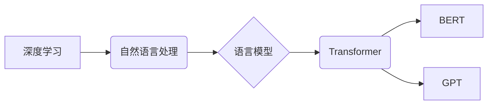

> 深度学习，自然语言处理，语言模型，Transformer，BERT，GPT，文本理解，文本生成

## 1. 背景介绍

人类语言是表达思想、传递信息、构建社会关系的复杂系统。理解和生成人类语言一直是人工智能领域的核心挑战之一。传统基于规则的方法由于其局限性，难以有效地处理语言的复杂性和语义歧义。近年来，深度学习的兴起为自然语言处理（NLP）带来了革命性的变革。深度学习模型能够从海量文本数据中学习语言的模式和规律，从而实现更准确、更自然的语言理解和生成。

## 2. 核心概念与联系

**2.1 深度学习与自然语言处理**

深度学习是一种机器学习的子领域，它利用多层神经网络来模拟人类大脑的学习过程。深度学习模型能够从数据中自动提取特征，并学习复杂的非线性关系。在NLP领域，深度学习模型被广泛应用于各种任务，例如文本分类、情感分析、机器翻译、文本摘要等。

**2.2 语言模型**

语言模型是NLP的核心组件之一，它试图学习语言的统计规律，并预测下一个词出现的概率。传统的语言模型通常基于统计方法，例如n-gram模型。深度学习的出现使得语言模型能够学习更复杂的语言结构和语义关系。

**2.3 Transformer**

Transformer是一种新型的深度学习架构，它专门设计用于处理序列数据，例如文本。Transformer的核心创新在于使用注意力机制，能够有效地捕捉文本中的长距离依赖关系。

**2.4 BERT、GPT**

BERT（Bidirectional Encoder Representations from Transformers）和GPT（Generative Pre-trained Transformer）是基于Transformer架构的著名语言模型。BERT采用双向编码方式，能够更好地理解上下文信息，在许多NLP任务上取得了优异的性能。GPT则采用自回归解码方式，能够生成流畅自然的文本，在文本生成任务上表现出色。

**2.5 核心概念关系图**



## 3. 核心算法原理 & 具体操作步骤

### 3.1 算法原理概述

Transformer模型的核心思想是利用注意力机制来捕捉文本中的长距离依赖关系。注意力机制允许模型在处理每个词时，关注与其相关性较高的词，从而更好地理解上下文信息。

### 3.2 算法步骤详解

1. **输入嵌入:** 将输入文本中的每个词转换为向量表示，称为词嵌入。
2. **多头注意力:** 使用多头注意力机制对输入序列进行处理，每个头关注不同的方面，并将其结果融合在一起。
3. **前馈神经网络:** 对每个词的注意力输出进行进一步处理，使用多层前馈神经网络进行非线性变换。
4. **位置编码:** 添加位置信息到词嵌入中，因为Transformer模型没有循环结构，无法直接捕捉词序信息。
5. **输出层:** 将最终的隐藏状态转换为输出向量，用于预测下一个词或完成其他NLP任务。

### 3.3 算法优缺点

**优点:**

* 能够有效地捕捉长距离依赖关系。
* 并行计算能力强，训练速度快。
* 在许多NLP任务上取得了优异的性能。

**缺点:**

* 参数量较大，需要大量的计算资源进行训练。
* 对训练数据质量要求较高。

### 3.4 算法应用领域

Transformer模型在NLP领域有着广泛的应用，例如：

* 文本分类
* 情感分析
* 机器翻译
* 文本摘要
* 问答系统
* 代码生成

## 4. 数学模型和公式 & 详细讲解 & 举例说明

### 4.1 数学模型构建

Transformer模型的数学模型主要包括以下几个部分：

* **词嵌入层:** 将每个词转换为向量表示。
* **多头注意力层:** 计算每个词与其他词之间的注意力权重。
* **前馈神经网络层:** 对每个词的注意力输出进行非线性变换。
* **位置编码层:** 添加位置信息到词嵌入中。
* **输出层:** 将最终的隐藏状态转换为输出向量。

### 4.2 公式推导过程

**注意力机制公式:**

$$
Attention(Q, K, V) = softmax(\frac{QK^T}{\sqrt{d_k}})V
$$

其中：

* $Q$：查询矩阵
* $K$：键矩阵
* $V$：值矩阵
* $d_k$：键向量的维度
* $softmax$：softmax函数

**多头注意力机制公式:**

$$
MultiHead(Q, K, V) = Concat(head_1, head_2, ..., head_h)W_O
$$

其中：

* $head_i$：第 $i$ 个注意力头的输出
* $h$：注意力头的数量
* $W_O$：输出权重矩阵

### 4.3 案例分析与讲解

假设我们有一个句子：“The cat sat on the mat”。

使用Transformer模型进行处理，首先将每个词转换为词嵌入向量。然后，使用多头注意力机制计算每个词与其他词之间的注意力权重。例如，对于词“cat”，注意力机制会赋予它与“the”和“sat”更高的权重，因为它们与“cat”在语义上更相关。

经过注意力机制和前馈神经网络的处理，每个词的隐藏状态都会被更新，从而更好地理解上下文信息。最终，输出层将隐藏状态转换为预测下一个词的概率分布。

## 5. 项目实践：代码实例和详细解释说明

### 5.1 开发环境搭建

* Python 3.6+
* TensorFlow/PyTorch
* CUDA/cuDNN

### 5.2 源代码详细实现

```python
import tensorflow as tf

# 定义Transformer模型
class Transformer(tf.keras.Model):
    def __init__(self, vocab_size, embedding_dim, num_heads, num_layers):
        super(Transformer, self).__init__()
        self.embedding = tf.keras.layers.Embedding(vocab_size, embedding_dim)
        self.transformer_layers = [
            tf.keras.layers.MultiHeadAttention(num_heads=num_heads, key_dim=embedding_dim)
            for _ in range(num_layers)
        ]
        self.ffn = tf.keras.layers.Dense(embedding_dim * 4, activation="relu")
        self.output_layer = tf.keras.layers.Dense(vocab_size)

    def call(self, inputs):
        # 词嵌入
        x = self.embedding(inputs)
        # 多头注意力层
        for layer in self.transformer_layers:
            x = layer(x, x, x)
        # 前馈神经网络
        x = self.ffn(x)
        # 输出层
        x = self.output_layer(x)
        return x

# 实例化模型
model = Transformer(vocab_size=10000, embedding_dim=128, num_heads=8, num_layers=6)
```

### 5.3 代码解读与分析

* **词嵌入层:** 将每个词转换为向量表示，用于模型的输入。
* **多头注意力层:** 捕捉文本中的长距离依赖关系，每个头关注不同的方面。
* **前馈神经网络:** 对每个词的注意力输出进行非线性变换，提取更深层的特征。
* **输出层:** 将最终的隐藏状态转换为预测下一个词的概率分布。

### 5.4 运行结果展示

训练模型后，可以将其用于文本生成、机器翻译等任务。

## 6. 实际应用场景

### 6.1 文本分类

Transformer模型可以用于分类文本，例如判断邮件是否为垃圾邮件、识别新闻文章的主题等。

### 6.2 情感分析

Transformer模型可以用于分析文本的情感倾向，例如判断用户评论的正面、负面或中性。

### 6.3 机器翻译

Transformer模型可以用于机器翻译，例如将英文文本翻译成中文。

### 6.4 文本摘要

Transformer模型可以用于生成文本摘要，例如提取文章的主要内容。

### 6.5 未来应用展望

Transformer模型在NLP领域有着巨大的潜力，未来可能应用于更多领域，例如：

* 代码生成
* 聊天机器人
* 自动写作
* 知识图谱构建

## 7. 工具和资源推荐

### 7.1 学习资源推荐

* **书籍:**
    * 《深度学习》
    * 《自然语言处理》
* **在线课程:**
    * Coursera: 自然语言处理
    * Udacity: 深度学习

### 7.2 开发工具推荐

* **TensorFlow:** 开源深度学习框架
* **PyTorch:** 开源深度学习框架
* **HuggingFace:** 提供预训练模型和工具

### 7.3 相关论文推荐

* 《Attention Is All You Need》
* 《BERT: Pre-training of Deep Bidirectional Transformers for Language Understanding》
* 《GPT-3: Language Models are Few-Shot Learners》

## 8. 总结：未来发展趋势与挑战

### 8.1 研究成果总结

近年来，深度学习在NLP领域取得了显著的进展，Transformer模型成为NLP领域的主流架构。

### 8.2 未来发展趋势

* **模型规模的进一步扩大:** 更大的模型能够学习更复杂的语言规律。
* **多模态学习:** 将文本与其他模态数据（例如图像、音频）进行融合，实现更全面的理解。
* **可解释性研究:** 提高模型的透明度和可解释性，帮助人们更好地理解模型的决策过程。

### 8.3 面临的挑战

* **数据获取和标注:** 训练高质量的深度学习模型需要大量的标注数据，这仍然是一个挑战。
* **计算资源:** 训练大型深度学习模型需要大量的计算资源，这对于个人开发者来说是一个障碍。
* **伦理问题:** 深度学习模型可能存在偏见和歧视，需要关注模型的伦理问题。

### 8.4 研究展望

未来，深度学习将在NLP领域继续发挥重要作用，推动语言理解和生成技术的进步。


## 9. 附录：常见问题与解答

**Q1: Transformer模型为什么比传统的RNN模型更适合处理长距离依赖关系？**

**A1:** RNN模型在处理长距离依赖关系时会存在梯度消失或梯度爆炸的问题，而Transformer模型通过注意力机制能够有效地捕捉长距离依赖关系。

**Q2: 如何训练Transformer模型？**

**A2:** 训练Transformer模型需要大量的文本数据和计算资源。可以使用预训练模型进行微调，也可以从头开始训练。

**Q3: Transformer模型有哪些应用场景？**

**A3:** Transformer模型在NLP领域有着广泛的应用，例如文本分类、情感分析、机器翻译、文本摘要等。


作者：禅与计算机程序设计艺术 / Zen and the Art of Computer Programming 
<end_of_turn>