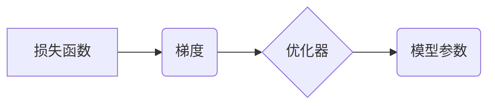

> 深度学习，优化算法，梯度下降，动量法，学习率，正则化，神经网络，机器学习

## 1. 背景介绍

深度学习作为机器学习领域最前沿的技术之一，在图像识别、自然语言处理、语音识别等领域取得了突破性的进展。然而，深度学习模型的训练过程往往需要大量的计算资源和时间，而优化算法是深度学习训练的核心环节。

优化算法的作用是通过不断调整模型参数，使得模型在训练数据上达到最小损失。选择合适的优化算法和参数设置对于模型的训练效果至关重要。

## 2. 核心概念与联系

深度学习优化算法的核心概念包括：

* **损失函数 (Loss Function):** 用于衡量模型预测结果与真实值的差距。
* **梯度 (Gradient):** 损失函数对模型参数的偏导数，表示参数变化对损失函数的影响方向和大小。
* **优化器 (Optimizer):** 根据梯度信息，更新模型参数以最小化损失函数。

**Mermaid 流程图:**



## 3. 核心算法原理 & 具体操作步骤

### 3.1  算法原理概述

梯度下降法是深度学习中最常用的优化算法，其原理是通过不断迭代地更新模型参数，使得损失函数逐渐减小。

**具体步骤:**

1. 初始化模型参数。
2. 计算损失函数对每个参数的梯度。
3. 根据梯度方向和学习率更新每个参数。
4. 重复步骤2和3，直到损失函数达到最小值或满足其他停止条件。

### 3.2  算法步骤详解

**梯度下降法**

1. **初始化参数:** 为模型参数赋予初始值，通常随机初始化。
2. **计算梯度:** 使用反向传播算法计算损失函数对每个参数的梯度。
3. **更新参数:** 使用学习率乘以梯度更新每个参数的值。

**公式:**

$$
\theta_{t+1} = \theta_t - \eta \nabla L(\theta_t)
$$

其中:

* $\theta_t$ 是第t次迭代的参数值。
* $\eta$ 是学习率。
* $\nabla L(\theta_t)$ 是损失函数在当前参数值处的梯度。

### 3.3  算法优缺点

**优点:**

* 算法简单易懂，易于实现。
* 能够找到局部最优解。

**缺点:**

* 容易陷入局部最优解。
* 学习率的选择对收敛速度和最终结果影响较大。

### 3.4  算法应用领域

梯度下降法广泛应用于各种深度学习模型的训练，例如卷积神经网络、循环神经网络等。

## 4. 数学模型和公式 & 详细讲解 & 举例说明

### 4.1  数学模型构建

深度学习优化算法的数学模型通常基于微积分的梯度下降原理。

**损失函数:**

$$
L(\theta) = \frac{1}{N} \sum_{i=1}^{N} loss(y_i, \hat{y}_i)
$$

其中:

* $L(\theta)$ 是损失函数。
* $N$ 是训练样本的数量。
* $loss(y_i, \hat{y}_i)$ 是第i个样本的损失值。
* $y_i$ 是真实值。
* $\hat{y}_i$ 是模型预测值。

**梯度:**

$$
\nabla L(\theta) = \left[ \frac{\partial L(\theta)}{\partial \theta_1}, \frac{\partial L(\theta)}{\partial \theta_2}, ..., \frac{\partial L(\theta)}{\partial \theta_m} \right]
$$

其中:

* $\nabla L(\theta)$ 是损失函数对所有参数的梯度向量。
* $\theta_1, \theta_2, ..., \theta_m$ 是模型参数。

### 4.2  公式推导过程

优化算法的目标是找到使损失函数最小化的参数值。

**梯度下降法:**

$$
\theta_{t+1} = \theta_t - \eta \nabla L(\theta_t)
$$

其中:

* $\theta_{t+1}$ 是第t+1次迭代的参数值。
* $\theta_t$ 是第t次迭代的参数值。
* $\eta$ 是学习率。
* $\nabla L(\theta_t)$ 是损失函数在当前参数值处的梯度。

### 4.3  案例分析与讲解

**举例说明:**

假设我们有一个简单的线性回归模型，其损失函数为均方误差。

$$
L(\theta) = \frac{1}{N} \sum_{i=1}^{N} (y_i - \hat{y}_i)^2
$$

其中:

* $y_i$ 是真实值。
* $\hat{y}_i$ 是模型预测值。

我们可以使用梯度下降法来优化模型参数。

**步骤:**

1. 初始化参数 $\theta$.
2. 计算损失函数对参数 $\theta$ 的梯度。
3. 更新参数 $\theta$：

$$
\theta_{t+1} = \theta_t - \eta \nabla L(\theta_t)
$$

4. 重复步骤2和3，直到损失函数达到最小值。

## 5. 项目实践：代码实例和详细解释说明

### 5.1  开发环境搭建

* Python 3.x
* TensorFlow 或 PyTorch

### 5.2  源代码详细实现

```python
import tensorflow as tf

# 定义模型
model = tf.keras.models.Sequential([
    tf.keras.layers.Dense(10, activation='relu', input_shape=(10,)),
    tf.keras.layers.Dense(1)
])

# 定义损失函数和优化器
loss_fn = tf.keras.losses.MeanSquaredError()
optimizer = tf.keras.optimizers.Adam(learning_rate=0.001)

# 训练模型
for epoch in range(100):
    # 计算梯度
    with tf.GradientTape() as tape:
        predictions = model(x_train)
        loss = loss_fn(y_train, predictions)

    # 更新参数
    gradients = tape.gradient(loss, model.trainable_variables)
    optimizer.apply_gradients(zip(gradients, model.trainable_variables))

    # 打印损失值
    print(f'Epoch {epoch+1}, Loss: {loss.numpy()}')
```

### 5.3  代码解读与分析

* **模型定义:** 使用 TensorFlow 的 Keras API 定义了一个简单的多层感知机模型。
* **损失函数和优化器:** 使用均方误差作为损失函数，使用 Adam 优化器进行训练。
* **训练循环:** 训练模型 100 个 epoch，每次 epoch 遍历整个训练数据集。
* **梯度计算:** 使用 `tf.GradientTape` 记录梯度信息。
* **参数更新:** 使用优化器更新模型参数。

### 5.4  运行结果展示

训练完成后，可以将模型应用于测试数据，评估模型的性能。

## 6. 实际应用场景

深度学习优化算法广泛应用于各种实际场景，例如:

* **图像识别:** 使用卷积神经网络进行图像分类、目标检测等任务。
* **自然语言处理:** 使用循环神经网络进行文本分类、机器翻译等任务。
* **语音识别:** 使用循环神经网络进行语音识别、语音合成等任务。

### 6.4  未来应用展望

随着深度学习技术的不断发展，优化算法将继续发挥重要作用。未来，优化算法的研究方向包括:

* **自适应学习率:** 根据训练过程中的梯度信息动态调整学习率。
* **分布式优化:** 在分布式计算环境下进行模型训练。
* **强化学习:** 使用强化学习算法优化模型参数。

## 7. 工具和资源推荐

### 7.1  学习资源推荐

* **书籍:**
    * Deep Learning by Ian Goodfellow, Yoshua Bengio, and Aaron Courville
    * Optimization for Machine Learning by Stephen Boyd and Lieven Vandenberghe
* **在线课程:**
    * Deep Learning Specialization by Andrew Ng (Coursera)
    * Fast.ai

### 7.2  开发工具推荐

* **TensorFlow:** https://www.tensorflow.org/
* **PyTorch:** https://pytorch.org/

### 7.3  相关论文推荐

* **Adam: A Method for Stochastic Optimization** by Diederik P. Kingma and Jimmy Ba
* **Momentum** by  Paul S. R.

## 8. 总结：未来发展趋势与挑战

### 8.1  研究成果总结

深度学习优化算法取得了显著的进展，为深度学习模型的训练提供了高效的工具。

### 8.2  未来发展趋势

未来，深度学习优化算法将朝着更加智能、高效、鲁棒的方向发展。

### 8.3  面临的挑战

* 如何设计更有效的优化算法，能够更快地收敛到全局最优解。
* 如何在分布式计算环境下进行高效的模型训练。
* 如何解决深度学习模型的过拟合问题。

### 8.4  研究展望

未来，我们将继续致力于深度学习优化算法的研究，探索新的优化策略，提高模型训练效率，推动深度学习技术的进步。

## 9. 附录：常见问题与解答

**常见问题:**

* **学习率如何选择？**

学习率是优化算法中的一个重要参数，它控制着参数更新的步长。学习率的选择对模型的训练效果有很大影响。一般来说，可以先选择一个较小的学习率，然后根据训练过程中的损失函数变化情况进行调整。

* **如何避免梯度消失或爆炸？**

梯度消失和梯度爆炸是深度学习训练中常见的现象。梯度消失是指随着网络层数的增加，梯度逐渐减小，导致模型难以训练。梯度爆炸是指梯度逐渐增大，导致模型训练不稳定。

**解答:**

* 可以使用ReLU等激活函数来缓解梯度消失问题。
* 可以使用梯度裁剪等技术来缓解梯度爆炸问题。

**作者：禅与计算机程序设计艺术 / Zen and the Art of Computer Programming**


<end_of_turn>