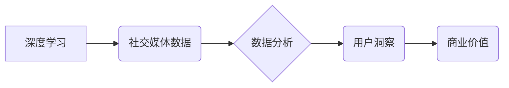

> 深度学习，社交媒体，数据分析，自然语言处理，情感分析，用户画像，推荐系统

## 1. 背景介绍

社交媒体平台如Facebook、Twitter、Instagram等已经成为人们日常生活不可或缺的一部分，每天产生海量的用户数据，蕴藏着丰富的社会、文化和商业价值。如何有效地挖掘这些数据，洞察用户行为、趋势和偏好，已成为各大企业和研究机构关注的焦点。深度学习作为一种强大的机器学习方法，凭借其强大的学习能力和对复杂模式的建模能力，在社交媒体数据分析领域展现出巨大的潜力。

## 2. 核心概念与联系

**2.1 深度学习**

深度学习是一种基于人工神经网络的机器学习方法，通过多层神经网络结构，学习数据中的复杂特征和模式。与传统机器学习方法相比，深度学习无需人工特征工程，能够自动学习数据中的抽象特征，从而提高模型的准确性和泛化能力。

**2.2 社交媒体数据**

社交媒体数据是指用户在社交媒体平台上产生的各种信息，包括文本、图片、视频、音频等多种形式。这些数据包含了用户的个人信息、兴趣爱好、行为习惯、社交关系等丰富的信息，是进行社交媒体数据分析的重要素材。

**2.3 数据分析**

数据分析是指通过收集、清洗、整理、分析和挖掘数据，以发现数据中的规律、趋势和价值。在社交媒体数据分析中，通过深度学习模型，可以对用户行为、情感、兴趣等进行分析，从而洞察用户需求、预测用户行为、优化营销策略等。

**2.4 核心概念关系图**



## 3. 核心算法原理 & 具体操作步骤

**3.1 算法原理概述**

深度学习在社交媒体数据分析中常用的算法包括：

* **自然语言处理 (NLP)**：用于处理文本数据，例如情感分析、主题提取、文本分类等。
* **计算机视觉 (CV)**：用于处理图像数据，例如图像识别、物体检测、人脸识别等。
* **图神经网络 (GNN)**：用于处理社交关系网络数据，例如用户关系分析、社区发现、推荐系统等。

**3.2 算法步骤详解**

以情感分析为例，其具体操作步骤如下：

1. **数据收集**: 收集社交媒体平台上的文本数据，例如用户评论、帖子、微博等。
2. **数据预处理**: 对文本数据进行清洗、去噪、分词、词性标注等预处理操作，以提高模型的训练效率和准确性。
3. **模型训练**: 选择合适的深度学习模型，例如循环神经网络 (RNN)、长短期记忆网络 (LSTM) 或 transformers，并使用预处理后的文本数据进行模型训练。
4. **模型评估**: 使用测试数据对模型进行评估，并根据评估结果调整模型参数，以提高模型的性能。
5. **模型部署**: 将训练好的模型部署到生产环境中，用于实时分析用户情感。

**3.3 算法优缺点**

**优点:**

* 能够自动学习数据中的复杂特征，提高模型的准确性和泛化能力。
* 对大规模数据处理能力强。
* 能够处理多种形式的数据，例如文本、图像、音频等。

**缺点:**

* 训练数据量大，需要大量的计算资源和时间。
* 模型解释性较差，难以理解模型的决策过程。
* 对数据质量要求高，数据噪声和偏差会影响模型的性能。

**3.4 算法应用领域**

* **情感分析**: 分析用户对产品、服务、事件等的情绪态度，用于市场调研、品牌管理、舆情监测等。
* **用户画像**: 建立用户画像，了解用户的兴趣爱好、行为习惯、消费偏好等，用于精准营销、个性化推荐等。
* **内容推荐**: 根据用户的兴趣和行为，推荐相关的内容，例如新闻、视频、商品等。
* **欺诈检测**: 检测用户行为中的异常和欺诈行为，例如虚假账户、恶意评论等。

## 4. 数学模型和公式 & 详细讲解 & 举例说明

**4.1 数学模型构建**

深度学习模型通常由多层神经网络组成，每层神经网络包含多个神经元。每个神经元接收来自上一层的输入信号，并通过激活函数进行处理，输出到下一层。

**4.2 公式推导过程**

深度学习模型的训练过程是通过反向传播算法来进行的。反向传播算法通过计算模型输出与真实值的误差，并根据误差反向传播到各层神经元，调整神经元的权重和偏置，以最小化误差。

**4.3 案例分析与讲解**

以循环神经网络 (RNN) 为例，其核心公式包括：

* **隐藏状态更新公式**: $h_t = f(W_{hh}h_{t-1} + W_{xh}x_t + b_h)$
* **输出公式**: $y_t = g(W_{hy}h_t + b_y)$

其中，$h_t$ 表示时间步 $t$ 的隐藏状态，$x_t$ 表示时间步 $t$ 的输入，$W_{hh}$、$W_{xh}$、$W_{hy}$ 为权重矩阵，$b_h$、$b_y$ 为偏置项，$f$ 和 $g$ 为激活函数。

## 5. 项目实践：代码实例和详细解释说明

**5.1 开发环境搭建**

使用 Python 语言和深度学习框架 TensorFlow 或 PyTorch 进行开发。

**5.2 源代码详细实现**

```python
import tensorflow as tf

# 定义模型结构
model = tf.keras.Sequential([
    tf.keras.layers.Embedding(input_dim=vocab_size, output_dim=embedding_dim),
    tf.keras.layers.LSTM(units=128),
    tf.keras.layers.Dense(units=num_classes, activation='softmax')
])

# 编译模型
model.compile(optimizer='adam',
              loss='sparse_categorical_crossentropy',
              metrics=['accuracy'])

# 训练模型
model.fit(x_train, y_train, epochs=10, batch_size=32)

# 评估模型
loss, accuracy = model.evaluate(x_test, y_test)
print('Test Loss:', loss)
print('Test Accuracy:', accuracy)
```

**5.3 代码解读与分析**

* 使用 Embedding 层将词向量化，将每个词映射到一个低维向量空间。
* 使用 LSTM 层学习文本序列中的上下文信息。
* 使用 Dense 层进行分类，输出情感类别。

**5.4 运行结果展示**

训练完成后，可以将模型应用于新的文本数据进行情感分析，并输出情感类别和置信度。

## 6. 实际应用场景

**6.1 情感分析**

* **市场调研**: 分析用户对产品、服务、广告的评价，了解用户需求和痛点。
* **品牌管理**: 监控品牌形象，及时发现负面舆情，进行危机公关。
* **客户服务**: 自动识别客户情绪，提供个性化服务。

**6.2 用户画像**

* **精准营销**: 根据用户兴趣和行为，推送个性化广告和推荐。
* **用户分层**: 将用户分为不同的群体，制定针对性的营销策略。
* **产品开发**: 了解用户需求，开发符合用户偏好的产品。

**6.3 内容推荐**

* **新闻推荐**: 根据用户兴趣，推荐相关新闻和资讯。
* **视频推荐**: 根据用户观看历史，推荐感兴趣的视频。
* **商品推荐**: 根据用户购买历史，推荐相关商品。

**6.4 未来应用展望**

* **更精准的用户画像**: 利用更丰富的社交媒体数据，构建更精准的用户画像，实现更细粒度的个性化服务。
* **更智能的对话系统**: 利用深度学习技术，开发更智能的对话系统，能够理解用户的自然语言，并提供更自然、更人性化的交互体验。
* **更有效的营销策略**: 利用深度学习技术，分析用户行为和情感，制定更有效的营销策略，提高营销效果。

## 7. 工具和资源推荐

**7.1 学习资源推荐**

* **书籍**:
    * 深度学习 (Deep Learning) - Ian Goodfellow, Yoshua Bengio, Aaron Courville
    * 自然语言处理 (Natural Language Processing) - Jurafsky & Martin
* **在线课程**:
    * Coursera: 深度学习 Specialization
    * Udacity: 自然语言处理 Nanodegree
* **博客**:
    * The Gradient
    * Towards Data Science

**7.2 开发工具推荐**

* **深度学习框架**: TensorFlow, PyTorch, Keras
* **数据处理工具**: Pandas, NumPy
* **可视化工具**: Matplotlib, Seaborn

**7.3 相关论文推荐**

* Attention Is All You Need (Vaswani et al., 2017)
* BERT: Pre-training of Deep Bidirectional Transformers for Language Understanding (Devlin et al., 2018)
* Graph Convolutional Networks for Web-Scale Recommender Systems (Wang et al., 2019)

## 8. 总结：未来发展趋势与挑战

**8.1 研究成果总结**

深度学习在社交媒体数据分析领域取得了显著的成果，例如情感分析、用户画像、内容推荐等应用取得了很好的效果。

**8.2 未来发展趋势**

* **更强大的模型**: 研究更强大的深度学习模型，例如 Transformer、Graph Neural Networks 等，以提高模型的准确性和泛化能力。
* **更丰富的特征**: 利用更丰富的社交媒体数据，例如用户画像、社交关系网络等，构建更全面的用户特征。
* **更个性化的服务**: 利用深度学习技术，提供更个性化的服务，例如个性化推荐、个性化营销等。

**8.3 面临的挑战**

* **数据隐私**: 社交媒体数据包含了用户的个人信息，如何保护用户隐私是需要认真考虑的问题。
* **数据质量**: 社交媒体数据往往存在噪声和偏差，如何提高数据质量是需要解决的关键问题。
* **模型解释性**: 深度学习模型的决策过程难以理解，如何提高模型的解释性是需要进一步研究的问题。

**8.4 研究展望**

未来，深度学习在社交媒体数据分析领域将继续发挥重要作用，并推动社交媒体平台的进一步发展。


## 9. 附录：常见问题与解答

**9.1 如何选择合适的深度学习模型？**

选择合适的深度学习模型需要根据具体任务和数据特点进行选择。例如，对于文本分类任务，可以使用 RNN 或 Transformer 模型；对于图像识别任务，可以使用 CNN 模型。

**9.2 如何处理社交媒体数据中的噪声和偏差？**

可以采用数据清洗、去噪、特征工程等方法来处理社交媒体数据中的噪声和偏差。

**9.3 如何评估深度学习模型的性能？**

可以使用准确率、召回率、F1-score 等指标来评估深度学习模型的性能。

**9.4 如何保护用户隐私？**

在处理社交媒体数据时，需要严格遵守隐私保护政策，例如匿名化处理、数据加密等。


作者：禅与计算机程序设计艺术 / Zen and the Art of Computer Programming 
<end_of_turn>