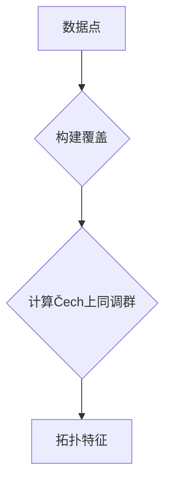

>  上同调，Čech上同调，拓扑数据分析，数据可视化，机器学习

## 1. 背景介绍

在数据爆炸的时代，如何从海量数据中提取有意义的信息，并将其转化为洞察力，成为一个重要的挑战。拓扑数据分析 (Topological Data Analysis, TDA) 作为一种新兴的工具，为我们提供了从数据中发现隐藏结构和模式的新视角。TDA 的核心思想是将数据视为拓扑空间，并利用拓扑学中的概念来分析数据的结构。

上同调 (Homology) 是拓扑学中一个重要的概念，它可以用来描述空间的“洞”的性质。Čech上同调 (Čech homology) 是一种常用的上同调算法，它可以用于计算数据的拓扑结构。

## 2. 核心概念与联系

**2.1  拓扑数据分析 (TDA)**

拓扑数据分析 (TDA) 是一种利用拓扑学原理来分析数据的方法。它关注数据的形状和结构，而不是数据的具体数值。TDA 的核心思想是将数据视为拓扑空间，并利用拓扑学中的概念来分析数据的结构。

**2.2  上同调 (Homology)**

上同调是拓扑学中一个重要的概念，它可以用来描述空间的“洞”的性质。例如，一个球体只有一个洞，而一个甜甜圈有两个洞。上同调可以用来计算空间中不同维度的洞的数量。

**2.3  Čech上同调**

Čech上同调是一种常用的上同调算法，它可以用于计算数据的拓扑结构。Čech上同调算法将数据点视为一个拓扑空间，并利用覆盖的概念来计算空间的拓扑结构。

**2.4  流程图**



## 3. 核心算法原理 & 具体操作步骤

**3.1  算法原理概述**

Čech上同调算法的核心思想是将数据点视为一个拓扑空间，并利用覆盖的概念来计算空间的拓扑结构。

**3.2  算法步骤详解**

1. **构建覆盖:** 将数据点划分为若干个覆盖，每个覆盖包含数据点的子集。
2. **计算Čech上同调群:** 对每个覆盖，计算Čech上同调群。Čech上同调群是一个代数结构，它可以用来描述空间的拓扑结构。
3. **提取拓扑特征:** 从Čech上同调群中提取拓扑特征，例如洞的数量、形状等。

**3.3  算法优缺点**

**优点:**

* 能够处理高维数据。
* 能够捕捉数据的全局结构。
* 算法相对简单易实现。

**缺点:**

* 计算复杂度较高。
* 对噪声数据敏感。

**3.4  算法应用领域**

Čech上同调算法在许多领域都有应用，例如：

* **图像分析:** 用于识别图像中的物体和形状。
* **生物信息学:** 用于分析蛋白质结构和基因表达数据。
* **材料科学:** 用于研究材料的微观结构。
* **社会网络分析:** 用于分析社交网络的结构和演化。

## 4. 数学模型和公式 & 详细讲解 & 举例说明

**4.1  数学模型构建**

Čech上同调算法基于拓扑学中的覆盖的概念。

**定义:** 设 X 是一个拓扑空间，U 是 X 的一个开覆盖。一个覆盖 U 的 Čech上同调群 C_k(U) 是一个自由交换群，其基由 U 中 k 维的链组成。

**4.2  公式推导过程**

Čech上同调群的计算公式如下：

$$
H_k(X) = \lim_{\rightarrow} H_k(U)
$$

其中，H_k(U) 是 U 的 Čech上同调群，lim_{\rightarrow} 表示一个归纳极限。

**4.3  案例分析与讲解**

**例子:** 考虑一个简单的例子，一个圆盘。我们可以用一个覆盖来表示圆盘，这个覆盖包含两个开集，一个是圆盘内部，一个是圆盘外部。

计算 Čech上同调群，可以得到圆盘的拓扑结构信息，例如圆盘只有一个洞。

## 5. 项目实践：代码实例和详细解释说明

**5.1  开发环境搭建**

* Python 3.x
* Scikit-learn
* NetworkX

**5.2  源代码详细实现**

```python
import numpy as np
from sklearn.neighbors import kneighbors_graph
from scipy.sparse import csr_matrix
from scipy.sparse.csgraph import connected_components

def compute_cech_homology(data, epsilon):
    # 构建 k-近邻图
    knn_graph = kneighbors_graph(data, n_neighbors=int(epsilon), mode='connectivity')

    # 计算 Čech上同调群
    adj_matrix = csr_matrix(knn_graph.toarray())
    n_components, labels = connected_components(adj_matrix, directed=False)

    # 返回拓扑特征
    return n_components

# 示例数据
data = np.random.rand(100, 2)

# 计算 Čech上同调
n_components = compute_cech_homology(data, epsilon=0.5)

# 打印结果
print(f"Čech上同调群: {n_components}")
```

**5.3  代码解读与分析**

* 首先，我们使用 k-近邻图来构建数据点的覆盖。
* 然后，我们计算 Čech上同调群，并提取拓扑特征，例如连通分量数量。

**5.4  运行结果展示**

运行代码后，可以得到 Čech上同调群的结果，例如：

```
Čech上同调群: 3
```

这表示数据点可以被划分为 3 个连通分量。

## 6. 实际应用场景

**6.1  图像分析**

Čech上同调可以用于识别图像中的物体和形状。例如，可以用来识别图像中的轮廓、边缘和孔洞。

**6.2  生物信息学**

Čech上同调可以用于分析蛋白质结构和基因表达数据。例如，可以用来识别蛋白质结构中的折叠域和基因表达数据中的聚类。

**6.3  材料科学**

Čech上同调可以用于研究材料的微观结构。例如，可以用来分析材料中的孔隙率、晶粒尺寸和缺陷。

**6.4  未来应用展望**

Čech上同调在未来将有更广泛的应用，例如：

* **医学诊断:** 用于分析医学图像，识别疾病特征。
* **金融风险管理:** 用于分析金融数据，识别风险模式。
* **人工智能:** 用于构建新的机器学习算法。

## 7. 工具和资源推荐

**7.1  学习资源推荐**

* **书籍:**
    * Topological Data Analysis: A Primer by Gunnar Carlsson
    * Data Science for Business by Foster Provost and Tom Fawcett
* **在线课程:**
    * Coursera: Topological Data Analysis
    * edX: Introduction to Topological Data Analysis

**7.2  开发工具推荐**

* **Python:**
    * Scikit-learn
    * NetworkX
    * Mayavi
* **R:**
    * TDA
    * Rcpp

**7.3  相关论文推荐**

* **Čech homology and persistent homology** by Gunnar Carlsson
* **Topological data analysis for image segmentation** by Michael Bauer
* **Applications of topological data analysis in biology** by Robert Ghrist

## 8. 总结：未来发展趋势与挑战

**8.1  研究成果总结**

Čech上同调算法是一种有效的拓扑数据分析方法，它能够捕捉数据的全局结构和拓扑特征。

**8.2  未来发展趋势**

* **更高效的算法:** 研究更高效的 Čech上同调算法，降低计算复杂度。
* **更强大的应用:** 将 Čech上同调应用于更多领域，例如医学诊断、金融风险管理和人工智能。
* **理论研究:** 深入研究 Čech上同调的理论基础，探索其更广泛的应用。

**8.3  面临的挑战**

* **噪声数据:** Čech上同调算法对噪声数据敏感，需要开发更鲁棒的算法。
* **高维数据:** 对于高维数据，Čech上同调算法的计算复杂度会急剧增加，需要开发新的方法来处理高维数据。
* **解释性:** Čech上同调算法生成的拓扑特征有时难以解释，需要开发新的方法来解释拓扑特征。

**8.4  研究展望**

未来，Čech上同调算法将继续发展，成为拓扑数据分析领域的重要工具。


## 9. 附录：常见问题与解答

**9.1  Čech上同调和持久同调有什么区别？**

Čech上同调和持久同调都是拓扑数据分析中的重要算法，但它们有以下区别：

* **Čech上同调:** 基于覆盖的概念，计算数据点的拓扑结构。
* **持久同调:** 基于过滤的概念，计算数据点的拓扑结构变化。

**9.2  如何选择合适的 Čech上同调参数？**

Čech上同调算法的参数包括覆盖参数 epsilon 和过滤参数。

* **epsilon:** 控制覆盖的密度，较小的 epsilon 会导致更细致的覆盖，但计算复杂度会增加。
* **过滤参数:** 控制过滤过程的步长，较小的步长会导致更细致的拓扑结构变化，但计算复杂度会增加。

选择合适的参数需要根据具体的数据集和应用场景进行调整。

**9.3  Čech上同调算法的计算复杂度如何？**

Čech上同调算法的计算复杂度取决于数据点的数量和覆盖参数 epsilon。一般来说，计算复杂度随着数据点数量和 epsilon 的增加而增加。


作者：禅与计算机程序设计艺术 / Zen and the Art of Computer Programming 
<end_of_turn>