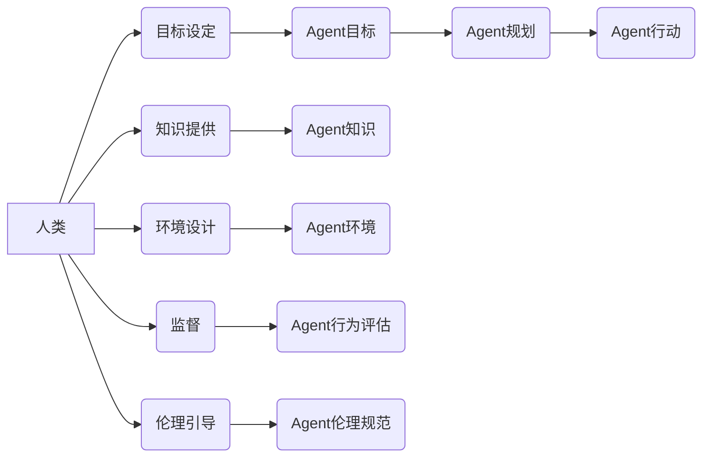

> Agent, 规划, 人类角色, 决策, 目标, 价值观, 伦理, 协作, 未来趋势

## 1. 背景介绍

在人工智能领域蓬勃发展的今天，Agent（智能体）的概念逐渐成为研究的焦点。Agent 是一种能够感知环境、做出决策并采取行动的智能系统。从自动驾驶汽车到智能家居助手，Agent 正在改变着我们的生活。然而，在Agent 规划的过程中，人类扮演着至关重要的角色。

传统的规划方法往往依赖于明确的规则和目标，而Agent 规划则更加复杂，需要考虑环境的动态变化、不确定性以及多目标冲突等因素。在这种情况下，人类的智慧和经验就显得尤为重要。

## 2. 核心概念与联系

**2.1 Agent 规划概述**

Agent 规划是指Agent 在目标驱动的环境中，根据感知到的信息和自身的知识，制定并执行一系列行动以实现目标的过程。

**2.2 人类在 Agent 规划中的角色**

人类在 Agent 规划中扮演着多重角色：

* **目标设定者:** 人类定义 Agent 的目标，并根据自身的价值观和需求，设定 Agent 的优先级和约束条件。
* **知识提供者:** 人类提供 Agent 需要的知识和经验，例如世界模型、规则、策略等。
* **环境设计者:** 人类设计 Agent 运行的环境，包括物理环境、社会环境以及数据环境。
* **监督者:** 人类监督 Agent 的行为，评估其性能，并根据需要进行调整和改进。
* **伦理引导者:** 人类为 Agent 的行为设定伦理规范，确保其行为符合人类的道德价值观。

**2.3 核心概念关系图**



## 3. 核心算法原理 & 具体操作步骤

**3.1 算法原理概述**

Agent 规划算法通常基于搜索、优化或机器学习等方法。常见的算法包括：

* **状态空间搜索:** 将问题转化为状态空间搜索问题，通过探索状态空间找到目标状态。
* **规划图搜索:** 使用规划图表示问题，通过搜索规划图找到目标状态。
* **强化学习:** 通过与环境交互，学习最优的策略。

**3.2 算法步骤详解**

以状态空间搜索为例，其基本步骤如下：

1. **定义状态空间:** 将问题分解成一系列状态，每个状态代表系统的一种可能的配置。
2. **定义动作空间:** 定义Agent可以执行的动作，每个动作可以将系统从一个状态转移到另一个状态。
3. **定义目标状态:** 定义Agent想要达成的目标状态。
4. **搜索算法:** 使用搜索算法，例如广度优先搜索或深度优先搜索，从初始状态出发，探索状态空间，找到目标状态。

**3.3 算法优缺点**

* **优点:** 能够解决许多复杂的问题，并找到最优解。
* **缺点:** 对于大型问题，搜索空间可能非常庞大，导致搜索效率低下。

**3.4 算法应用领域**

* **机器人规划:** 规划机器人运动路径。
* **游戏人工智能:** 规划游戏角色的行为。
* **自动驾驶:** 规划车辆行驶路线。

## 4. 数学模型和公式 & 详细讲解 & 举例说明

**4.1 数学模型构建**

Agent 规划问题可以建模为一个马尔可夫决策过程 (MDP)。

* **状态空间:** S = {s1, s2, ..., sn}
* **动作空间:** A = {a1, a2, ..., am}
* **状态转移概率:** P(s' | s, a) 表示从状态 s 执行动作 a 后转移到状态 s' 的概率。
* **奖励函数:** R(s, a) 表示在状态 s 执行动作 a 后获得的奖励。
* **折扣因子:** γ (0 ≤ γ ≤ 1) 表示未来奖励的折扣率。

**4.2 公式推导过程**

目标是找到一个策略 π(s) ，使得在策略 π 下，Agent 的累积奖励最大化。

Bellman 方程：

$$
V^{\pi}(s) = \max_{a \in A} \left[ R(s, a) + \gamma \sum_{s' \in S} P(s' | s, a) V^{\pi}(s') \right]
$$

其中，Vπ(s) 表示在策略 π 下，从状态 s 开始的累积奖励。

**4.3 案例分析与讲解**

例如，一个简单的迷宫问题，Agent 的目标是找到迷宫出口。

* 状态空间：迷宫中的每个格子。
* 动作空间：向上、向下、向左、向右。
* 状态转移概率：取决于迷宫的结构。
* 奖励函数：到达出口获得最大奖励，其他状态获得较小的奖励。

通过 Bellman 方程，可以迭代地计算出每个状态的价值函数，从而找到最优策略。

## 5. 项目实践：代码实例和详细解释说明

**5.1 开发环境搭建**

使用 Python 语言和相关库，例如 OpenAI Gym、PyTorch 或 TensorFlow 等。

**5.2 源代码详细实现**

```python
import gym

# 创建环境
env = gym.make('CartPole-v1')

# 定义策略
def policy(state):
    # 根据状态选择动作
    return 0 if state[0] < 0 else 1

# 训练循环
for episode in range(100):
    state = env.reset()
    done = False
    while not done:
        action = policy(state)
        next_state, reward, done, _ = env.step(action)
        env.render()
        state = next_state

env.close()
```

**5.3 代码解读与分析**

* 使用 OpenAI Gym 创建 CartPole 环境。
* 定义一个简单的策略，根据状态选择动作。
* 训练循环中，Agent 与环境交互，执行动作，获得奖励和状态更新。
* 使用 `env.render()` 显示环境状态。

**5.4 运行结果展示**

运行代码后，会看到 CartPole 环境的动画，Agent 会尝试平衡杆，并根据策略选择动作。

## 6. 实际应用场景

**6.1 自动驾驶**

Agent 规划用于规划车辆行驶路线，避开障碍物，并与其他车辆安全行驶。

**6.2 机器人控制**

Agent 规划用于规划机器人运动路径，完成任务，例如搬运物体、清洁地面等。

**6.3 游戏人工智能**

Agent 规划用于规划游戏角色的行为，使角色能够做出智能决策，例如攻击敌人、躲避攻击等。

**6.4 未来应用展望**

随着人工智能技术的不断发展，Agent 规划将在更多领域得到应用，例如医疗保健、金融、教育等。

## 7. 工具和资源推荐

**7.1 学习资源推荐**

* **书籍:**
    * Artificial Intelligence: A Modern Approach
    * Reinforcement Learning: An Introduction
* **在线课程:**
    * Coursera: Reinforcement Learning Specialization
    * Udacity: Intro to Artificial Intelligence

**7.2 开发工具推荐**

* **OpenAI Gym:** 用于开发和测试强化学习算法的开源库。
* **PyTorch:** 深度学习框架，支持强化学习算法的开发。
* **TensorFlow:** 深度学习框架，支持强化学习算法的开发。

**7.3 相关论文推荐**

* **Deep Reinforcement Learning: An Overview**
* **Playing Atari with Deep Reinforcement Learning**
* **AlphaGo: Mastering the Game of Go with Deep Neural Networks and Tree Search**

## 8. 总结：未来发展趋势与挑战

**8.1 研究成果总结**

近年来，Agent 规划领域取得了显著进展，例如深度强化学习算法的出现，使得 Agent 能够解决更复杂的问题。

**8.2 未来发展趋势**

* **更强大的算法:** 开发更强大的 Agent 规划算法，例如基于迁移学习、进化算法等。
* **更复杂的场景:** 将 Agent 规划应用于更复杂的场景，例如多智能体系统、动态环境等。
* **更安全的 Agent:** 开发更安全的 Agent，确保其行为符合人类的道德价值观。

**8.3 面临的挑战**

* **数据获取:** 训练 Agent 规划算法需要大量的训练数据，获取高质量数据仍然是一个挑战。
* **算法解释性:** 许多深度学习算法缺乏解释性，难以理解 Agent 的决策过程。
* **伦理问题:** Agent 规划的应用可能引发伦理问题，例如责任归属、隐私保护等。

**8.4 研究展望**

未来，Agent 规划领域将继续朝着更智能、更安全、更可解释的方向发展。


## 9. 附录：常见问题与解答

**9.1 什么是 Agent？**

Agent 是能够感知环境、做出决策并采取行动的智能系统。

**9.2 什么是 Agent 规划？**

Agent 规划是指 Agent 在目标驱动的环境中，根据感知到的信息和自身的知识，制定并执行一系列行动以实现目标的过程。

**9.3 人类在 Agent 规划中的角色是什么？**

人类在 Agent 规划中扮演着多重角色，例如目标设定者、知识提供者、环境设计者、监督者和伦理引导者。

**9.4 常见的 Agent 规划算法有哪些？**

常见的 Agent 规划算法包括状态空间搜索、规划图搜索和强化学习等。

**9.5 Agent 规划的未来发展趋势是什么？**

未来，Agent 规划领域将朝着更智能、更安全、更可解释的方向发展。


作者：禅与计算机程序设计艺术 / Zen and the Art of Computer Programming 
<end_of_turn>