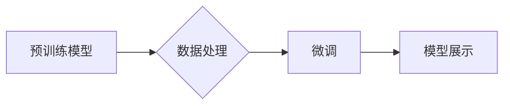

> 大模型开发, 微调, PyTorch, 数据处理, 模型展示, 可视化, 计算机视觉, 自然语言处理

## 1. 背景介绍

近年来，深度学习在各个领域取得了突破性的进展，其中大模型的出现更是推动了人工智能的快速发展。大模型是指参数规模庞大、训练数据海量的人工智能模型，其强大的学习能力和泛化能力使其在自然语言处理、计算机视觉、语音识别等领域展现出巨大的潜力。

然而，大模型的开发和部署也面临着诸多挑战：

* **高昂的训练成本:** 大模型的训练需要大量的计算资源和时间，这对于个人开发者和小型团队来说是一个巨大的负担。
* **模型规模庞大:** 大模型的参数数量巨大，其存储和传输也需要大量的空间和带宽。
* **缺乏可解释性:** 大模型的决策过程往往难以理解，这使得其应用在一些需要透明度和可解释性的领域受到限制。

为了降低大模型开发的门槛，提高模型的可解释性和应用效率，本文将介绍一种基于PyTorch的端到端大模型开发与微调方法，并通过可视化技术展示模型的训练过程和预测结果。

## 2. 核心概念与联系

大模型开发与微调的核心概念包括：

* **预训练模型:** 预训练模型是指在大量公共数据集上进行训练的通用模型，其已经具备一定的语义理解和特征提取能力。
* **微调:** 微调是指在预训练模型的基础上，针对特定任务进行进一步的训练，以提高模型在该任务上的性能。
* **数据处理:** 数据处理是指将原始数据转换为模型可以理解的格式，包括数据清洗、预处理、特征工程等步骤。
* **模型展示:** 模型展示是指通过可视化技术展示模型的训练过程、结构和预测结果，以提高模型的可解释性和用户体验。

**核心概念架构图:**



## 3. 核心算法原理 & 具体操作步骤

### 3.1  算法原理概述

大模型开发与微调主要基于深度学习算法，其中包括卷积神经网络（CNN）、循环神经网络（RNN）和Transformer等。

* **CNN:** 擅长处理图像数据，通过卷积操作提取图像特征。
* **RNN:** 擅长处理序列数据，例如文本和语音，通过循环结构捕捉序列中的依赖关系。
* **Transformer:** 是一种新型的序列模型，通过注意力机制学习序列中的长距离依赖关系，在自然语言处理领域取得了突破性进展。

### 3.2  算法步骤详解

大模型开发与微调的具体步骤如下：

1. **选择预训练模型:** 根据任务需求选择合适的预训练模型，例如BERT、GPT-3、ResNet等。
2. **数据处理:** 对原始数据进行清洗、预处理、特征工程等操作，使其符合模型的输入格式。
3. **微调模型:** 在预训练模型的基础上，使用特定任务的数据进行微调，调整模型参数以提高模型在该任务上的性能。
4. **模型评估:** 使用测试数据评估模型的性能，并根据评估结果进行模型调优。
5. **模型部署:** 将训练好的模型部署到实际应用场景中。

### 3.3  算法优缺点

**优点:**

* **提高效率:** 利用预训练模型可以节省大量训练时间和资源。
* **提升性能:** 微调可以使模型在特定任务上取得更好的性能。
* **降低门槛:** 基于预训练模型的开发方法降低了大模型开发的门槛。

**缺点:**

* **数据依赖:** 微调效果依赖于训练数据的质量和数量。
* **过拟合风险:** 如果微调数据量不足，模型容易过拟合。
* **解释性问题:** 大模型的决策过程仍然难以完全理解。

### 3.4  算法应用领域

大模型的应用领域非常广泛，包括：

* **自然语言处理:** 文本分类、情感分析、机器翻译、对话系统等。
* **计算机视觉:** 图像识别、物体检测、图像分割、视频分析等。
* **语音识别:** 语音转文本、语音合成、语音助手等。
* **推荐系统:** 商品推荐、内容推荐、用户画像等。

## 4. 数学模型和公式 & 详细讲解 & 举例说明

### 4.1  数学模型构建

大模型的数学模型通常基于神经网络，其结构由多个层组成，每一层包含多个神经元。神经元之间通过权重连接，并使用激活函数进行非线性变换。

**神经网络模型结构:**


### 4.2  公式推导过程

神经网络的训练过程基于梯度下降算法，其目标是通过调整模型参数，使模型的预测结果与真实值之间的误差最小化。

**损失函数:**

$$
L = \frac{1}{N} \sum_{i=1}^{N} (y_i - \hat{y}_i)^2
$$

其中：

* $L$ 为损失函数
* $N$ 为样本数量
* $y_i$ 为真实值
* $\hat{y}_i$ 为预测值

**梯度下降算法:**

$$
\theta = \theta - \alpha \nabla L(\theta)
$$

其中：

* $\theta$ 为模型参数
* $\alpha$ 为学习率
* $\nabla L(\theta)$ 为损失函数对参数的梯度

### 4.3  案例分析与讲解

以图像分类为例，假设我们使用CNN模型进行图像分类，模型的输出层包含多个神经元，每个神经元对应一个类别。

训练过程中，模型会根据输入图像的特征，预测图像所属的类别。如果预测结果与真实类别不一致，损失函数会计算出误差，并根据梯度下降算法更新模型参数。

通过反复训练，模型的参数会逐渐调整，最终能够准确地预测图像的类别。

## 5. 项目实践：代码实例和详细解释说明

### 5.1  开发环境搭建

本项目使用PyTorch框架进行开发，需要安装PyTorch库和相关的依赖包。

```bash
pip install torch torchvision torchaudio
```

### 5.2  源代码详细实现

```python
import torch
import torch.nn as nn

class CNN(nn.Module):
    def __init__(self):
        super(CNN, self).__init__()
        self.conv1 = nn.Conv2d(3, 16, kernel_size=3, padding=1)
        self.relu1 = nn.ReLU()
        self.pool1 = nn.MaxPool2d(kernel_size=2, stride=2)
        self.conv2 = nn.Conv2d(16, 32, kernel_size=3, padding=1)
        self.relu2 = nn.ReLU()
        self.pool2 = nn.MaxPool2d(kernel_size=2, stride=2)
        self.fc1 = nn.Linear(32 * 7 * 7, 128)
        self.relu3 = nn.ReLU()
        self.fc2 = nn.Linear(128, 10)

    def forward(self, x):
        x = self.pool1(self.relu1(self.conv1(x)))
        x = self.pool2(self.relu2(self.conv2(x)))
        x = x.view(-1, 32 * 7 * 7)
        x = self.relu3(self.fc1(x))
        x = self.fc2(x)
        return x

# 实例化模型
model = CNN()

# 定义损失函数和优化器
criterion = nn.CrossEntropyLoss()
optimizer = torch.optim.Adam(model.parameters(), lr=0.001)

# 训练模型
for epoch in range(10):
    # 训练数据
    # ...

    # 计算损失
    outputs = model(inputs)
    loss = criterion(outputs, labels)

    # 反向传播
    optimizer.zero_grad()
    loss.backward()

    # 更新参数
    optimizer.step()

    # 打印损失
    print(f'Epoch [{epoch+1}/{10}], Loss: {loss.item():.4f}')
```

### 5.3  代码解读与分析

* **模型定义:** 代码定义了一个名为CNN的卷积神经网络模型，包含卷积层、激活函数、池化层和全连接层。
* **损失函数和优化器:** 使用交叉熵损失函数和Adam优化器进行模型训练。
* **训练循环:** 训练模型需要迭代多个epoch，在每个epoch中，模型会遍历训练数据，计算损失，并根据梯度下降算法更新模型参数。
* **模型评估:** 训练完成后，可以使用测试数据评估模型的性能。

### 5.4  运行结果展示

训练完成后，可以将模型部署到实际应用场景中，例如图像分类、物体检测等。

## 6. 实际应用场景

### 6.1  自然语言处理

大模型在自然语言处理领域有广泛的应用，例如：

* **机器翻译:** 使用大模型进行机器翻译，可以提高翻译质量和效率。
* **文本摘要:** 使用大模型对长文本进行摘要，可以节省时间和精力。
* **对话系统:** 使用大模型构建对话系统，可以提供更自然和流畅的交互体验。

### 6.2  计算机视觉

大模型在计算机视觉领域也有广泛的应用，例如：

* **图像识别:** 使用大模型进行图像识别，可以识别图像中的物体、场景和人物。
* **物体检测:** 使用大模型进行物体检测，可以定位图像中的物体并识别其类别。
* **图像分割:** 使用大模型进行图像分割，可以将图像分割成不同的区域。

### 6.3  语音识别

大模型在语音识别领域也有广泛的应用，例如：

* **语音转文本:** 使用大模型将语音转换为文本，可以提高语音识别准确率和效率。
* **语音合成:** 使用大模型进行语音合成，可以生成更加自然和逼真的语音。
* **语音助手:** 使用大模型构建语音助手，可以提供更加智能和便捷的语音交互体验。

### 6.4  未来应用展望

随着大模型技术的不断发展，其应用场景将会更加广泛，例如：

* **个性化推荐:** 使用大模型进行个性化推荐，可以提供更加精准和符合用户需求的推荐结果。
* **医疗诊断:** 使用大模型辅助医生进行医疗诊断，可以提高诊断准确率和效率。
* **科学研究:** 使用大模型进行科学研究，可以加速科学发现和技术创新。

## 7. 工具和资源推荐

### 7.1  学习资源推荐

* **书籍:**
    * 深度学习
    * 自然语言处理
    * 计算机视觉
* **在线课程:**
    * Coursera
    * edX
    * Udacity
* **博客和论坛:**
    * PyTorch官方博客
    * TensorFlow官方博客
    * Kaggle论坛

### 7.2  开发工具推荐

* **PyTorch:** 深度学习框架
* **TensorFlow:** 深度学习框架
* **Jupyter Notebook:** 交互式编程环境
* **Git:** 版本控制系统

### 7.3  相关论文推荐

* Attention Is All You Need
* BERT: Pre-training of Deep Bidirectional Transformers for Language Understanding
* ImageNet Classification with Deep Convolutional Neural Networks

## 8. 总结：未来发展趋势与挑战

### 8.1  研究成果总结

近年来，大模型开发取得了显著进展，其在自然语言处理、计算机视觉、语音识别等领域取得了突破性成果。

### 8.2  未来发展趋势

* **模型规模进一步扩大