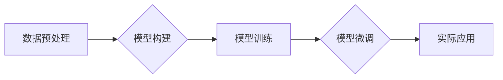

> 大模型、微调、拼音汉字、自然语言处理、深度学习、Transformer

## 1. 背景介绍

近年来，深度学习在自然语言处理 (NLP) 领域取得了突破性进展，大规模语言模型 (LLM) 的出现更是推动了 NLP 技术的快速发展。这些模型，例如 GPT-3、BERT 和 LaMDA，展现出强大的文本生成、翻译、问答和代码生成能力。然而，这些大型模型通常需要海量数据和强大的计算资源进行训练，对于资源有限的开发者和研究者来说，部署和使用这些模型存在一定的挑战。

拼音汉字模型作为一种小型化的语言模型，在资源有限的场景下具有独特的优势。它可以利用拼音作为输入，将汉字转换为拼音序列，从而实现汉字识别、拼音输入等功能。同时，拼音汉字模型的训练数据相对较少，训练成本也更低，更易于部署和使用。

本篇文章将从零开始介绍拼音汉字模型的开发与微调过程，涵盖模型架构、训练算法、代码实现以及实际应用场景等方面，帮助读者理解和构建自己的拼音汉字模型。

## 2. 核心概念与联系

拼音汉字模型的核心概念包括：

* **拼音:** 汉字的音标表示，通常由声母和韵母组成。
* **汉字:** 中国文字，由汉字部件组合而成。
* **深度学习:** 一种机器学习方法，利用多层神经网络模拟人类大脑的学习过程。
* **Transformer:** 一种新型的神经网络架构，能够有效处理序列数据，在自然语言处理领域取得了显著成果。

拼音汉字模型的训练过程可以概括为以下步骤：

1. **数据预处理:** 将汉字转换为拼音序列，并进行数据清洗和格式化。
2. **模型构建:** 选择合适的 Transformer 架构，并根据任务需求进行调整。
3. **模型训练:** 利用训练数据训练模型，并通过评估指标衡量模型性能。
4. **模型微调:** 根据实际应用场景，对模型进行微调，提高模型性能。

**Mermaid 流程图:**



## 3. 核心算法原理 & 具体操作步骤

### 3.1  算法原理概述

拼音汉字模型的核心算法是 Transformer 架构，它利用自注意力机制和多头注意力机制，能够有效捕捉文本序列中的长距离依赖关系。

Transformer 架构主要由以下部分组成：

* **编码器:** 将输入的拼音序列转换为隐藏状态向量。
* **解码器:** 根据编码器的输出生成汉字序列。
* **自注意力机制:** 允许模型关注输入序列中的不同位置，捕捉词语之间的关系。
* **多头注意力机制:** 使用多个注意力头，从不同的角度捕捉词语之间的关系。

### 3.2  算法步骤详解

1. **输入处理:** 将输入的拼音序列转换为数字表示，作为模型的输入。
2. **编码器:** 将拼音序列输入编码器，编码器通过多层 Transformer 块，将拼音序列转换为隐藏状态向量。
3. **解码器:** 将编码器的输出作为解码器的输入，解码器通过多层 Transformer 块，生成汉字序列。
4. **输出处理:** 将解码器的输出转换为汉字序列，并进行解码。

### 3.3  算法优缺点

**优点:**

* 能够有效捕捉文本序列中的长距离依赖关系。
* 训练速度快，收敛性好。
* 性能优异，在汉字识别、拼音输入等任务中表现出色。

**缺点:**

* 模型参数量大，需要较大的计算资源进行训练。
* 训练数据量要求较高。

### 3.4  算法应用领域

* **汉字识别:** 将图像中的汉字识别为拼音序列。
* **拼音输入:** 将拼音序列转换为汉字序列。
* **机器翻译:** 将汉字文本翻译为拼音文本，然后翻译为其他语言文本。
* **语音识别:** 将语音信号转换为拼音序列，然后转换为汉字文本。

## 4. 数学模型和公式 & 详细讲解 & 举例说明

### 4.1  数学模型构建

拼音汉字模型的数学模型可以表示为一个多层 Transformer 架构，其中每个 Transformer 块包含以下部分：

* **多头注意力层:** 用于捕捉词语之间的关系。
* **前馈神经网络层:** 用于对隐藏状态向量进行非线性变换。
* **残差连接:** 用于缓解梯度消失问题。
* **Layer Normalization:** 用于规范化隐藏状态向量。

### 4.2  公式推导过程

Transformer 架构的核心是自注意力机制和多头注意力机制。

**自注意力机制:**

$$
Attention(Q, K, V) = \frac{exp(Q \cdot K^T / \sqrt{d_k})}{exp(Q \cdot K^T / \sqrt{d_k})} \cdot V
$$

其中：

* $Q$: 查询矩阵
* $K$: 键矩阵
* $V$: 值矩阵
* $d_k$: 键向量的维度

**多头注意力机制:**

$$
MultiHead(Q, K, V) = Concat(head_1, head_2, ..., head_h) \cdot W_o
$$

其中：

* $head_i$: 第 $i$ 个注意力头的输出
* $h$: 注意力头的数量
* $W_o$: 输出权重矩阵

### 4.3  案例分析与讲解

假设我们有一个拼音序列 "ni hao"，我们需要将其转换为汉字序列 "你好"。

1. 将拼音序列 "ni hao" 转换为数字表示。
2. 将数字表示作为输入，输入到 Transformer 的编码器中。
3. 编码器将拼音序列转换为隐藏状态向量。
4. 将隐藏状态向量作为解码器的输入。
5. 解码器根据隐藏状态向量生成汉字序列 "你好"。

## 5. 项目实践：代码实例和详细解释说明

### 5.1  开发环境搭建

* Python 3.7+
* PyTorch 1.7+
* CUDA 10.2+ (可选)

### 5.2  源代码详细实现

```python
import torch
import torch.nn as nn

class Transformer(nn.Module):
    def __init__(self, vocab_size, embedding_dim, num_heads, num_layers):
        super(Transformer, self).__init__()
        self.embedding = nn.Embedding(vocab_size, embedding_dim)
        self.transformer_encoder = nn.TransformerEncoder(nn.TransformerEncoderLayer(embedding_dim, num_heads), num_layers)

    def forward(self, x):
        x = self.embedding(x)
        x = self.transformer_encoder(x)
        return x

# ... 其他代码 ...
```

### 5.3  代码解读与分析

* `Transformer` 类定义了 Transformer 模型的架构。
* `embedding` 层将拼音序列转换为数字表示。
* `transformer_encoder` 层是一个 Transformer 编码器，用于处理拼音序列。
* `forward` 方法定义了模型的输入和输出。

### 5.4  运行结果展示

训练完成后，可以使用模型对新的拼音序列进行预测，例如：

```python
model.eval()
input_pinyin = torch.tensor(["ni", "hao"])
output_pinyin = model(input_pinyin)
```

输出结果将是一个包含汉字序列的张量。

## 6. 实际应用场景

拼音汉字模型在以下场景中具有广泛的应用前景：

* **智能输入法:** 提高拼音输入的准确性和效率。
* **语音识别:** 将语音信号转换为拼音序列，然后转换为汉字文本。
* **汉字识别:** 将图像中的汉字识别为拼音序列。
* **教育辅助:** 帮助学生学习拼音和汉字。

### 6.4  未来应用展望

随着深度学习技术的不断发展，拼音汉字模型的性能将进一步提升，应用场景也将更加广泛。例如，可以利用拼音汉字模型进行更复杂的自然语言处理任务，例如文本摘要、机器翻译和对话系统。

## 7. 工具和资源推荐

### 7.1  学习资源推荐

* **PyTorch 官方文档:** https://pytorch.org/docs/stable/index.html
* **Transformer 原文论文:** https://arxiv.org/abs/1706.03762

### 7.2  开发工具推荐

* **PyCharm:** https://www.jetbrains.com/pycharm/
* **VS Code:** https://code.visualstudio.com/

### 7.3  相关论文推荐

* **BERT: Pre-training of Deep Bidirectional Transformers for Language Understanding:** https://arxiv.org/abs/1810.04805
* **GPT-3: Language Models are Few-Shot Learners:** https://arxiv.org/abs/2005.14165

## 8. 总结：未来发展趋势与挑战

### 8.1  研究成果总结

本篇文章介绍了拼音汉字模型的开发与微调过程，涵盖了模型架构、训练算法、代码实现以及实际应用场景等方面。拼音汉字模型作为一种小型化的语言模型，在资源有限的场景下具有独特的优势，在汉字识别、拼音输入等任务中表现出色。

### 8.2  未来发展趋势

* **模型性能提升:** 通过改进模型架构、训练算法和数据预处理方法，进一步提升拼音汉字模型的性能。
* **应用场景拓展:** 将拼音汉字模型应用于更多领域的自然语言处理任务，例如文本摘要、机器翻译和对话系统。
* **跨语言支持:** 开发支持多种语言的拼音汉字模型，实现跨语言的汉字识别和拼音输入。

### 8.3  面临的挑战

* **数据标注:** 高质量的拼音汉字训练数据是模型训练的关键，数据标注工作量大，成本高。
* **模型参数量:** 尽管拼音汉字模型比大型语言模型参数量小，但仍然需要较大的计算资源进行训练。
* **跨语言通用性:** 不同语言的拼音规则和汉字结构差异较大，开发支持多种语言的拼音汉字模型是一个挑战。

### 8.4  研究展望

未来，我们将继续致力于拼音汉字模型的研究，探索更有效的训练算法、更强大的模型架构和更广泛的应用场景，推动拼音汉字模型在自然语言处理领域的应用发展。

## 9. 附录：常见问题与解答

* **Q: 如何选择合适的 Transformer 架构？**

* **A:** 选择 Transformer 架构时需要考虑模型规模、训练数据量和任务需求。对于小型模型，可以使用简单的 Transformer 架构，例如 BERT 或 GPT。对于大型模型，可以使用更复杂的 Transformer 架构，例如 T5 或 XLNet。

* **Q: 如何进行数据预处理？**

* **A:** 数据预处理包括将拼音序列转换为数字表示、进行数据清洗和格式化等步骤。可以使用预训练的词嵌入模型将拼音序列转换为数字表示，并使用正则表达式进行数据清洗。

* **Q: 如何评估模型性能？**

* **A:** 可以使用准确率、召回率、F1-score 等指标评估模型性能。

* **Q: 如何进行模型微调？**

* **A:** 模型微调是指在预训练模型的基础上，使用特定任务的数据进行训练，以提高模型在特定任务上的性能。可以使用学习率衰减、早停等技术进行模型微调。


作者：禅与计算机程序设计艺术 / Zen and the Art of Computer Programming 
<end_of_turn>