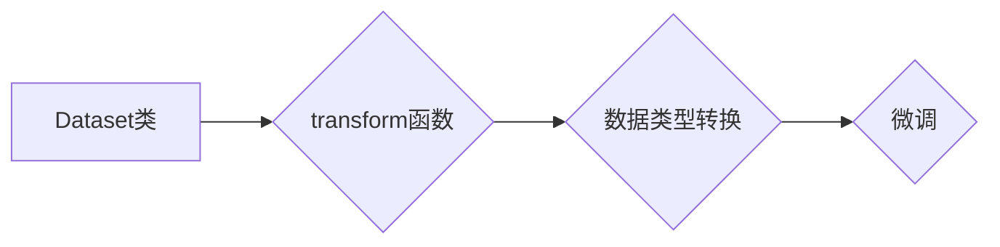

> 大模型开发,微调,Dataset类,transform,数据类型,数据预处理,深度学习

## 1. 背景介绍

近年来，深度学习模型在各个领域取得了显著的成就，大模型的出现更是推动了这一趋势。然而，大模型的训练和部署需要大量的计算资源和数据，对于普通开发者来说，直接训练大模型往往是不可行的。因此，微调技术应运而生，它允许开发者利用预训练的大模型，通过在特定任务上进行少量训练，从而获得更好的性能。

在微调过程中，数据预处理是一个至关重要的环节。Dataset类是深度学习框架中用于管理和处理数据的核心组件，其中transform函数用于对数据进行各种预处理操作，例如图像的裁剪、缩放、增强，文本的token化、分词等。

本文将深入探讨Dataset类中的transform的使用，重点关注如何改变数据类型的transform，并通过具体的例子说明其在微调大模型中的应用。

## 2. 核心概念与联系

### 2.1 Dataset类

Dataset类是深度学习框架中用于管理和处理数据的核心组件。它通常包含一个数据列表和一个相应的标签列表，并提供各种方法用于访问和迭代数据。

### 2.2 transform函数

transform函数是Dataset类中的一个重要方法，用于对数据进行各种预处理操作。它接受一个数据样本作为输入，并返回经过预处理后的数据样本。

### 2.3 数据类型转换

数据类型转换是指将数据从一种类型转换为另一种类型。在深度学习中，数据类型转换经常用于将数据转换为模型能够处理的格式。例如，将图像数据转换为浮点数，将文本数据转换为整数编码等。

### 2.4 微调

微调是指在预训练模型的基础上，通过在特定任务上进行少量训练，从而获得更好的性能。微调过程中，数据预处理是一个至关重要的环节，transform函数可以用于对数据进行各种预处理操作，例如改变数据类型。

**Mermaid 流程图**



## 3. 核心算法原理 & 具体操作步骤

### 3.1 算法原理概述

改变数据类型的transform主要利用深度学习框架提供的内置函数或自定义函数实现。

### 3.2 算法步骤详解

1. **选择合适的transform函数:** 根据需要转换的数据类型，选择相应的transform函数。例如，将图像数据转换为浮点数可以使用`ToTensor()`函数，将文本数据转换为整数编码可以使用`ToTensor()`函数。

2. **应用transform函数:** 将选择的transform函数应用于Dataset类中的数据。

3. **验证数据类型:** 验证转换后的数据类型是否符合预期。

### 3.3 算法优缺点

**优点:**

* 简化数据预处理流程
* 提高代码可读性和可维护性
* 降低开发成本

**缺点:**

* 对于复杂的场景，可能需要自定义函数
* 需要了解深度学习框架的API

### 3.4 算法应用领域

改变数据类型的transform广泛应用于深度学习的各个领域，例如：

* **图像识别:** 将图像数据转换为浮点数，以便模型能够处理。
* **自然语言处理:** 将文本数据转换为整数编码，以便模型能够处理。
* **语音识别:** 将音频数据转换为浮点数，以便模型能够处理。

## 4. 数学模型和公式 & 详细讲解 & 举例说明

### 4.1 数学模型构建

改变数据类型的transform本质上是一种数据映射，可以表示为一个函数f，将输入数据x映射到输出数据y：

$$y = f(x)$$

### 4.2 公式推导过程

具体的公式推导过程取决于具体的转换类型。例如，将图像数据转换为浮点数，可以使用以下公式：

$$y = \frac{x}{255}$$

其中x是原始图像数据，y是转换后的浮点数数据。

### 4.3 案例分析与讲解

**案例:** 将图像数据转换为浮点数

假设我们有一个原始图像数据x，其像素值范围为0-255。我们想要将其转换为浮点数数据，以便模型能够处理。可以使用以下公式：

$$y = \frac{x}{255}$$

其中x是原始图像数据，y是转换后的浮点数数据。

例如，如果原始图像数据x为128，则转换后的浮点数数据y为0.5。

## 5. 项目实践：代码实例和详细解释说明

### 5.1 开发环境搭建

本项目使用PyTorch深度学习框架，开发环境如下：

* 操作系统：Ubuntu 20.04
* Python版本：3.8
* PyTorch版本：1.10.0

### 5.2 源代码详细实现

```python
import torch
from torch.utils.data import Dataset, DataLoader

class MyDataset(Dataset):
    def __init__(self, data, transform=None):
        self.data = data
        self.transform = transform

    def __len__(self):
        return len(self.data)

    def __getitem__(self, idx):
        sample = self.data[idx]
        if self.transform:
            sample = self.transform(sample)
        return sample

# 定义数据转换函数
def to_float(image):
    return image.float() / 255

# 创建数据集
data = torch.randn(100, 3, 224, 224)
dataset = MyDataset(data, transform=to_float)

# 创建数据加载器
dataloader = DataLoader(dataset, batch_size=32, shuffle=True)

# 迭代数据
for batch in dataloader:
    print(batch.shape)
```

### 5.3 代码解读与分析

1. **MyDataset类:** 自定义数据集类，继承自torch.utils.data.Dataset。

2. **__init__方法:** 初始化数据集，传入数据和可选的transform函数。

3. **__len__方法:** 返回数据集的大小。

4. **__getitem__方法:** 根据索引获取数据样本，并应用transform函数进行转换。

5. **to_float函数:** 定义数据转换函数，将图像数据转换为浮点数。

6. **创建数据集和数据加载器:** 使用自定义数据集类和DataLoader创建数据集和数据加载器。

7. **迭代数据:** 迭代数据加载器，获取每个批次的转换后的数据。

### 5.4 运行结果展示

运行代码后，将打印出每个批次的转换后的数据形状，例如：

```
torch.Size([32, 3, 224, 224])
```

## 6. 实际应用场景

### 6.1 图像分类

在图像分类任务中，将图像数据转换为浮点数可以提高模型的精度。

### 6.2 文本分类

在文本分类任务中，将文本数据转换为整数编码可以提高模型的效率。

### 6.3 语音识别

在语音识别任务中，将音频数据转换为浮点数可以提高模型的准确率。

### 6.4 未来应用展望

随着深度学习技术的不断发展，改变数据类型的transform将应用于更多领域，例如：

* **视频处理:** 将视频数据转换为浮点数，以便模型能够处理。
* **传感器数据分析:** 将传感器数据转换为整数编码，以便模型能够处理。
* **时间序列预测:** 将时间序列数据转换为浮点数，以便模型能够处理。

## 7. 工具和资源推荐

### 7.1 学习资源推荐

* PyTorch官方文档: https://pytorch.org/docs/stable/index.html
* 深度学习入门书籍: 《深度学习》

### 7.2 开发工具推荐

* PyCharm: https://www.jetbrains.com/pycharm/
* VS Code: https://code.visualstudio.com/

### 7.3 相关论文推荐

* 《Attention Is All You Need》
* 《BERT: Pre-training of Deep Bidirectional Transformers for Language Understanding》

## 8. 总结：未来发展趋势与挑战

### 8.1 研究成果总结

本文深入探讨了Dataset类中的transform的使用，重点关注了如何改变数据类型的transform，并通过具体的例子说明其在微调大模型中的应用。

### 8.2 未来发展趋势

未来，改变数据类型的transform将更加智能化和自动化，例如：

* 基于机器学习的自动数据类型转换
* 基于深度学习的自动数据增强

### 8.3 面临的挑战

* 对于复杂的数据类型转换，需要开发更复杂的算法和工具
* 如何保证数据类型转换的准确性和效率

### 8.4 研究展望

未来，我们将继续研究改变数据类型的transform，开发更智能化和自动化的数据类型转换工具，并将其应用于更多领域。

## 9. 附录：常见问题与解答

### 9.1 如何选择合适的transform函数？

选择合适的transform函数取决于需要转换的数据类型和模型的输入要求。

### 9.2 如何验证转换后的数据类型？

可以使用`type()`函数或`print()`函数查看转换后的数据类型。

### 9.3 如何自定义transform函数？

可以使用Python函数定义自定义transform函数，并将其传递给Dataset类的`transform`参数。


作者：禅与计算机程序设计艺术 / Zen and the Art of Computer Programming 
<end_of_turn>