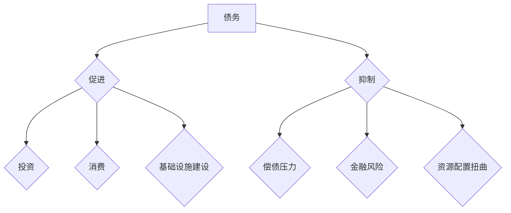

> 债务、经济增长、经济模型、金融危机、宏观经济

## 1. 背景介绍

全球经济发展历程中，债务扮演着复杂而重要的角色。从个人消费贷款到国家政府债券，债务是经济活动中不可或缺的一部分，它可以促进投资、消费和经济增长。然而，过度积累的债务也可能成为经济增长的阻碍，甚至引发金融危机。

近年来，全球范围内债务水平持续攀升，引发了广泛的关注和担忧。发达国家和新兴市场国家 alike 都面临着债务负担的压力。 

本篇文章将深入探讨债务加剧与经济增长的关系，分析债务对经济的影响机制，并探讨如何平衡债务增长与经济可持续发展。

## 2. 核心概念与联系

**2.1 债务的概念**

债务是指借入资金并承诺在未来偿还本金和利息的义务。债务可以是个人、企业或政府之间发生的。

**2.2 经济增长的概念**

经济增长是指一个国家或地区的生产总值（GDP）在一段时间内以一定比例增加的现象。经济增长通常被认为是衡量一个国家或地区经济发展水平的重要指标。

**2.3 债务与经济增长的关系**

债务和经济增长之间存在着复杂的相互作用关系。

* **债务促进经济增长：**

    * **投资：** 企业可以通过债务融资进行投资，扩大生产规模，提高生产效率，从而促进经济增长。
    * **消费：** 个人可以通过债务融资购买商品和服务，刺激消费需求，促进经济增长。
    * **基础设施建设：** 政府可以通过债务融资建设基础设施，例如道路、桥梁、机场等，提高生产要素的流动性，促进经济增长。

* **债务抑制经济增长：**

    * **偿债压力：** 过高的债务水平会给借款方带来沉重的偿债压力，减少其投资和消费能力，抑制经济增长。
    * **金融风险：** 过度积累的债务会增加金融风险，例如银行破产、债务违约等，可能引发金融危机，对经济造成严重冲击。
    * **资源配置扭曲：** 债务融资可能会导致资源配置扭曲，资金流向低效领域，抑制经济增长。

**2.4 债务水平与经济增长的关系**

债务水平与经济增长之间存在着非线性关系。

* **适度债务：** 适度的债务水平可以促进经济增长。
* **过高债务：** 过高的债务水平会抑制经济增长。

**2.5 债务结构与经济增长的关系**

债务结构也会影响经济增长。

* **公共债务：** 公共债务可以用于投资公共服务和基础设施，促进经济增长。
* **私人债务：** 私人债务主要用于消费和投资，其对经济增长的影响取决于其用途和风险水平。

**2.6 债务与经济增长的影响因素**

债务对经济增长的影响受到多种因素的影响，例如：

* **经济增长率：** 经济增长率越高，债务水平的增长速度越快。
* **利率水平：** 利率水平越高，债务成本越高，对经济增长的影响越负面。
* **通货膨胀率：** 通货膨胀率越高，债务的实际价值降低，对经济增长的影响越正面。
* **政府财政政策：** 政府财政政策可以影响债务水平和经济增长。
* **货币政策：** 货币政策可以影响利率水平和通货膨胀率，从而间接影响债务和经济增长。

**2.7 Mermaid 流程图**



## 3. 核心算法原理 & 具体操作步骤

**3.1 算法原理概述**

本节将介绍一种用于分析债务与经济增长关系的算法，该算法基于经济模型和统计分析方法。

**3.2 算法步骤详解**

1. **构建经济模型：** 首先，需要构建一个描述债务与经济增长关系的经济模型。该模型可以包含多个变量，例如债务水平、经济增长率、利率水平、通货膨胀率等。
2. **收集数据：** 然后，需要收集相关数据的历史数据，例如债务水平、经济增长率、利率水平、通货膨胀率等。
3. **进行统计分析：** 使用统计分析方法，例如回归分析、时间序列分析等，分析债务与经济增长之间的关系。
4. **评估模型：** 评估模型的准确性和可靠性，并进行必要的调整。
5. **预测未来趋势：** 基于模型和历史数据，预测未来债务水平和经济增长趋势。

**3.3 算法优缺点**

* **优点：**

    * 可以量化债务与经济增长之间的关系。
    * 可以预测未来债务水平和经济增长趋势。

* **缺点：**

    * 经济模型的构建和参数设定存在一定的复杂性和主观性。
    * 历史数据可能无法完全反映未来的经济发展趋势。

**3.4 算法应用领域**

该算法可以应用于以下领域：

* **宏观经济政策制定：** 帮助政府制定更加有效的宏观经济政策，例如财政政策和货币政策。
* **金融风险管理：** 帮助金融机构评估债务风险，制定相应的风险管理措施。
* **投资决策：** 帮助投资者了解债务与经济增长的关系，做出更加明智的投资决策。

## 4. 数学模型和公式 & 详细讲解 & 举例说明

**4.1 数学模型构建**

我们可以构建一个简单的经济模型，用以描述债务与经济增长的关系。该模型假设：

* 经济增长率取决于债务水平和其他因素。
* 债务水平取决于经济增长率和政府财政政策。

**4.2 公式推导过程**

我们可以用以下公式来表示该模型：

* **经济增长率：**

$$
g = f(d, x)
$$

其中：

* $g$ 表示经济增长率。
* $d$ 表示债务水平。
* $x$ 表示其他影响经济增长的因素，例如人口增长、技术进步等。

* **债务水平：**

$$
d = g \cdot t + b
$$

其中：

* $t$ 表示政府财政政策的影响。
* $b$ 表示其他影响债务水平的因素，例如私人部门的债务水平。

**4.3 案例分析与讲解**

假设一个国家经济增长率为 3%，债务水平为 60% GDP，政府财政政策为 1%。根据上述公式，我们可以计算该国家的债务水平变化趋势。

如果经济增长率保持在 3%，则根据公式，债务水平将随着时间的推移不断增加。

**4.4 举例说明**

如果政府财政政策放松，例如增加公共支出，则 $t$ 值会增加，导致债务水平更快地增长。

## 5. 项目实践：代码实例和详细解释说明

**5.1 开发环境搭建**

本项目可以使用 Python 语言进行开发，并使用以下库进行数据分析和可视化：

* NumPy
* Pandas
* Matplotlib

**5.2 源代码详细实现**

```python
import numpy as np
import pandas as pd
import matplotlib.pyplot as plt

# 构建经济模型
def economic_growth(debt, x):
    return 0.03 + 0.01 * debt - 0.005 * x

# 构建债务水平模型
def debt_level(growth, t, b):
    return growth * t + b

# 模拟数据
years = np.arange(1, 11)
debt = np.zeros(10)
growth = np.zeros(10)
t = 0.01
b = 0.6

for i in range(10):
    growth[i] = economic_growth(debt[i], 0.02)
    debt[i + 1] = debt_level(growth[i], t, b)
    debt[i] = debt[i + 1]

# 可视化数据
plt.plot(years, debt)
plt.xlabel('年份')
plt.ylabel('债务水平')
plt.title('债务水平变化趋势')
plt.show()
```

**5.3 代码解读与分析**

该代码首先定义了两个函数，分别用于模拟经济增长率和债务水平的变化。然后，使用循环模拟了 10 年的债务水平变化趋势。最后，使用 Matplotlib 库绘制了债务水平变化趋势的图表。

**5.4 运行结果展示**

运行该代码后，将生成一个图表，展示债务水平随时间的变化趋势。

## 6. 实际应用场景

**6.1 政府宏观经济政策制定**

政府可以利用该算法分析债务与经济增长的关系，制定更加有效的宏观经济政策，例如财政政策和货币政策。

**6.2 金融机构风险管理**

金融机构可以利用该算法评估债务风险，制定相应的风险管理措施，例如设定贷款利率、限制贷款规模等。

**6.3 投资决策**

投资者可以利用该算法了解债务与经济增长的关系，做出更加明智的投资决策，例如选择投资于债券、股票或其他资产。

**6.4 未来应用展望**

随着人工智能和机器学习技术的不断发展，该算法可以进一步改进，例如：

* 使用更复杂的经济模型，更准确地反映债务与经济增长的关系。
* 使用更丰富的历史数据，提高模型的预测精度。
* 将该算法与其他技术结合，例如自然语言处理，分析新闻报道和市场评论，获取更全面的债务与经济增长信息。

## 7. 工具和资源推荐

**7.1 学习资源推荐**

* **书籍：**

    * Macroeconomics by N. Gregory Mankiw
    * Principles of Economics by N. Gregory Mankiw
    * The Undercover Economist by Tim Harford

* **在线课程：**

    * Coursera: Macroeconomics
    * edX: Principles of Economics

**7.2 开发工具推荐**

* **Python:** Python 是一种流行的编程语言，广泛应用于数据分析和机器学习。
* **NumPy:** NumPy 是 Python 的科学计算库，提供高效的数组操作和数学函数。
* **Pandas:** Pandas 是 Python 的数据分析库，提供数据结构和数据处理工具。
* **Matplotlib:** Matplotlib 是 Python 的数据可视化库，用于创建各种类型的图表。

**7.3 相关论文推荐**

* **The Effects of Debt on Economic Growth** by Carmen Reinhart and Kenneth Rogoff
* **Debt Overhangs: Causes, Consequences, and Solutions** by Olivier Blanchard

## 8. 总结：未来发展趋势与挑战

**8.1 研究成果总结**

本篇文章探讨了债务与经济增长的关系，分析了债务对经济的影响机制，并介绍了一种用于分析债务与经济增长关系的算法。

**8.2 未来发展趋势**

未来，随着人工智能和机器学习技术的不断发展，债务与经济增长分析领域将出现以下发展趋势：

* 使用更复杂的经济模型，更准确地反映债务与经济增长的关系。
* 使用更丰富的历史数据，提高模型的预测精度。
* 将该算法与其他技术结合，例如自然语言处理，分析新闻报道和市场评论，获取更全面的债务与经济增长信息。

**8.3 面临的挑战**

债务与经济增长分析领域也面临着一些挑战：

* 经济模型的构建和参数设定存在一定的复杂性和主观性。
* 历史数据可能无法完全反映未来的经济发展趋势。
* 债务与经济增长的关系是一个复杂的多因素问题，需要考虑多种因素的影响。