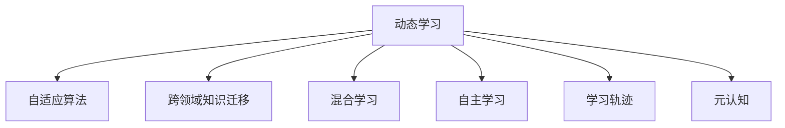

                 

# VUCA时代下的学习策略

> 关键词：动态学习(Dynamic Learning), 跨领域知识迁移(Cross-Domain Knowledge Transfer), 自适应算法(Adaptive Algorithms), 混合学习(Hybrid Learning), 自主学习(Autonomous Learning)

## 1. 背景介绍

### 1.1 问题由来
当今世界正处在一个高度不确定、复杂多变（VUCA - Volatile, Uncertain, Complex, and Ambiguous）的时代。科技、经济、社会、环境等方面的变化日新月异，知识和技能的更新迭代速度大大加快。在这样的背景下，传统的静态、单一的学习方式已经难以适应快速变化的需求。人们迫切需要一种更加灵活、高效的动态学习策略，以应对多变的环境和不断变化的知识体系。

### 1.2 问题核心关键点
动态学习（Dynamic Learning）的核心在于能够适应环境变化，不断调整学习目标和策略，以快速获取新知识并应用到实际问题中。其关键点包括：

1. **自适应算法（Adaptive Algorithms）**：能够根据环境变化自动调整学习率和策略，确保学习的有效性。
2. **跨领域知识迁移（Cross-Domain Knowledge Transfer）**：能够将在一个领域学到的知识迁移到另一个领域，提高知识的应用广度和深度。
3. **混合学习（Hybrid Learning）**：结合在线学习、离线学习、主动学习和被动学习等多种学习方式，构建多元化的学习体系。
4. **自主学习（Autonomous Learning）**：利用智能技术实现自我管理、自我评估和自我优化，提升学习的主动性和灵活性。

这些核心点共同构成了动态学习的基本框架，帮助学习者在不确定和复杂的环境下高效地获取和应用新知识。

## 2. 核心概念与联系

### 2.1 核心概念概述

为更好地理解动态学习策略，本节将介绍几个密切相关的核心概念：

- **动态学习（Dynamic Learning）**：指在不断变化的环境中，学习者能够实时调整学习目标和策略，以适应环境变化，获取新知识和技能的过程。

- **自适应算法（Adaptive Algorithms）**：指能够根据环境变化自动调整学习率和策略的算法。如遗传算法、粒子群算法、强化学习等。

- **跨领域知识迁移（Cross-Domain Knowledge Transfer）**：指将在一个领域学到的知识迁移到另一个领域的过程。这包括知识结构、技能和经验的迁移。

- **混合学习（Hybrid Learning）**：指结合多种学习方式，如在线学习、离线学习、主动学习和被动学习，构建多元化的学习体系。

- **自主学习（Autonomous Learning）**：指利用智能技术实现自我管理、自我评估和自我优化，提升学习的主动性和灵活性。

- **学习轨迹（Learning Trajectory）**：指学习者在学习过程中所经历的状态变化，包括知识、技能、态度和行为等方面的变化。

- **元认知（Metacognition）**：指学习者对自己学习过程的认知，包括对学习目标、策略、方法和效果等的监控和调节。

这些核心概念之间的逻辑关系可以通过以下Mermaid流程图来展示：



这个流程图展示了大语言模型的核心概念及其之间的关系：

1. 动态学习是核心，涵盖自适应算法、跨领域知识迁移、混合学习和自主学习等概念。
2. 自适应算法能够根据环境变化调整学习策略，确保学习的有效性。
3. 跨领域知识迁移拓宽了学习者的知识面，提升其在不同领域的适应能力。
4. 混合学习通过结合多种学习方式，构建多元化的学习体系，提高学习效率。
5. 自主学习利用智能技术实现自我管理，提升学习的主动性和灵活性。
6. 学习轨迹和元认知则帮助学习者监控和评估自己的学习过程，确保学习目标的达成。

这些概念共同构成了动态学习的学习框架，帮助学习者在快速变化的环境中高效地获取和应用新知识。

## 3. 核心算法原理 & 具体操作步骤
### 3.1 算法原理概述

动态学习的核心在于能够根据环境变化实时调整学习策略，以确保学习的有效性。其核心算法原理包括以下几个方面：

1. **自适应算法**：通过不断调整学习率和策略，确保学习的稳定性和适应性。
2. **跨领域知识迁移**：利用领域间的共性，将在一个领域学到的知识迁移到另一个领域。
3. **混合学习**：结合多种学习方式，提升学习效率和效果。
4. **自主学习**：利用智能技术实现自我管理、自我评估和自我优化。

### 3.2 算法步骤详解

动态学习的实现通常包括以下几个关键步骤：

**Step 1: 环境感知与任务定义**

1. **环境感知**：通过传感器、网络、数据流等获取环境信息。
2. **任务定义**：根据环境信息，定义学习目标和任务，如识别环境变化、调整学习策略等。

**Step 2: 策略选择与调整**

1. **策略选择**：根据任务类型和环境特征，选择适用的学习策略，如强化学习、遗传算法、神经网络等。
2. **策略调整**：根据环境反馈，动态调整策略参数，确保学习的高效性。

**Step 3: 知识获取与迁移**

1. **知识获取**：通过在线学习、离线学习、主动学习和被动学习等多种方式，获取新知识。
2. **知识迁移**：将在一个领域学到的知识迁移到另一个领域，提升学习的广度和深度。

**Step 4: 自我评估与优化**

1. **自我评估**：利用智能技术评估学习效果，如学习轨迹分析、元认知评估等。
2. **自我优化**：根据评估结果，调整学习目标和策略，实现自我优化。

**Step 5: 效果反馈与迭代**

1. **效果反馈**：根据任务完成情况，反馈学习效果，调整策略和目标。
2. **迭代改进**：不断迭代学习过程，提升学习效果和适应能力。

### 3.3 算法优缺点

动态学习的优点包括：

1. **灵活适应**：能够根据环境变化实时调整学习策略，确保学习的有效性。
2. **高效学习**：结合多种学习方式，提升学习效率和效果。
3. **广泛应用**：适应性强，适用于各种复杂多变的环境。
4. **自我优化**：利用智能技术实现自我管理、自我评估和自我优化，提升学习的主动性和灵活性。

同时，动态学习也存在一些局限性：

1. **资源消耗**：自适应算法和智能技术的应用需要较多的计算资源。
2. **模型复杂**：动态学习算法较为复杂，需要较高的技术门槛。
3. **数据依赖**：动态学习的效果很大程度上依赖于数据的质量和多样性。
4. **稳定性问题**：自适应算法的调整可能导致学习过程不稳定。

尽管存在这些局限性，但动态学习在应对复杂多变的环境时表现出了显著的优势，成为了当前学习和研究的热点。

### 3.4 算法应用领域

动态学习技术在多个领域得到了广泛的应用，包括但不限于：

- **智能制造**：通过动态学习技术，智能工厂能够实时调整生产策略，优化资源配置，提升生产效率和质量。
- **金融科技**：在动态市场环境中，动态学习技术可以帮助金融系统快速适应市场变化，优化投资决策。
- **医疗健康**：医疗系统可以利用动态学习技术，实时调整诊疗方案，提升诊疗效果和患者满意度。
- **教育培训**：动态学习技术可以根据学生的学习情况，实时调整教学内容和策略，提升学习效果。
- **智能交通**：通过动态学习技术，交通系统可以实时调整交通流量，优化交通规划，减少拥堵和事故。

这些领域的应用展示了动态学习技术的强大潜力和广阔前景。

## 4. 数学模型和公式 & 详细讲解 & 举例说明
### 4.1 数学模型构建

动态学习的数学模型可以表示为：

$$
L(\theta) = \sum_{i=1}^{N} \ell(\theta, x_i, y_i)
$$

其中 $L(\theta)$ 表示损失函数，$x_i$ 表示输入数据，$y_i$ 表示输出，$\ell(\theta, x_i, y_i)$ 表示在输入数据 $x_i$ 和输出 $y_i$ 下的损失。

### 4.2 公式推导过程

以强化学习为例，推导动态学习模型的公式。强化学习的目标是在给定环境 $E$ 和动作策略 $\pi$ 下，最大化累计奖励 $R$。

设当前状态为 $s_t$，动作为 $a_t$，下一状态为 $s_{t+1}$，奖励为 $r_t$。则强化学习的动态学习模型可以表示为：

$$
\max_{\pi} \sum_{t=1}^{T} \gamma^{t-1} r_t
$$

其中 $T$ 表示时间步数，$\gamma$ 表示折扣因子。

通过引入奖励函数 $Q(s,a)$，强化学习可以进一步表示为：

$$
Q(s,a) = \sum_{t=1}^{T} \gamma^{t-1} r_t
$$

通过迭代求解，可以逐步逼近最优策略 $\pi^*$。

### 4.3 案例分析与讲解

以一个简单的交通信号灯优化问题为例，分析动态学习的应用。

假设当前交通信号灯的状态为红灯，车辆需要等待。设等待时间的期望为 $E(t)$，如果车辆选择等待，则当前状态为 $s_t=1$，否则为 $s_t=0$。车辆等待的概率为 $p_1$，绿灯通过的概率为 $p_2$。

车辆选择等待的期望奖励为 $R_1 = E(1)$，选择通过的期望奖励为 $R_2 = E(0)$。则车辆在状态 $s_t$ 下选择动作 $a_t$ 的动态学习模型可以表示为：

$$
\max_{\pi} \sum_{t=1}^{T} \gamma^{t-1} r_t = \max_{\pi} \sum_{t=1}^{T} \gamma^{t-1} (p_1R_1 + p_2R_2)
$$

通过求解上述优化问题，可以找到最优的动作策略 $\pi^*$，使得车辆在等待时的期望收益最大化。

## 5. 项目实践：代码实例和详细解释说明
### 5.1 开发环境搭建

在进行动态学习实践前，我们需要准备好开发环境。以下是使用Python进行TensorFlow开发的环境配置流程：

1. 安装Anaconda：从官网下载并安装Anaconda，用于创建独立的Python环境。

2. 创建并激活虚拟环境：
```bash
conda create -n dynamic-env python=3.8 
conda activate dynamic-env
```

3. 安装TensorFlow：根据CUDA版本，从官网获取对应的安装命令。例如：
```bash
conda install tensorflow -c tensorflow -c conda-forge
```

4. 安装Keras：Keras是TensorFlow的高层API，方便用户进行模型构建和训练。
```bash
conda install keras
```

5. 安装各类工具包：
```bash
pip install numpy pandas scikit-learn matplotlib tqdm jupyter notebook ipython
```

完成上述步骤后，即可在`dynamic-env`环境中开始动态学习实践。

### 5.2 源代码详细实现

下面我们以动态学习在智能制造中的应用为例，给出使用TensorFlow和Keras进行动态学习模型的代码实现。

首先，定义动态学习的环境：

```python
import tensorflow as tf
import keras

# 定义环境参数
batch_size = 64
num_epochs = 50
learning_rate = 0.001

# 定义模型参数
input_dim = 10
output_dim = 3

# 定义动态学习模型
model = keras.Sequential([
    keras.layers.Dense(64, activation='relu', input_shape=(input_dim,)),
    keras.layers.Dense(32, activation='relu'),
    keras.layers.Dense(output_dim, activation='softmax')
])
```

然后，定义损失函数和优化器：

```python
# 定义损失函数
def custom_loss(y_true, y_pred):
    loss = tf.keras.losses.categorical_crossentropy(y_true, y_pred)
    return loss

# 定义优化器
optimizer = tf.keras.optimizers.Adam(learning_rate=learning_rate)
```

接着，定义训练和评估函数：

```python
# 训练函数
def train(model, data, epochs, batch_size, loss_func, optimizer):
    model.compile(loss=loss_func, optimizer=optimizer)
    model.fit(data, epochs=epochs, batch_size=batch_size)
    
# 评估函数
def evaluate(model, data, batch_size):
    model.evaluate(data, batch_size=batch_size)
```

最后，启动训练流程并在测试集上评估：

```python
# 准备数据集
data = ...

# 训练模型
train(model, data, num_epochs, batch_size, custom_loss, optimizer)

# 评估模型
evaluate(model, data, batch_size)
```

以上就是使用TensorFlow和Keras进行动态学习模型的代码实现。可以看到，Keras的高层API使得动态学习模型的构建和训练变得相对简单。

### 5.3 代码解读与分析

让我们再详细解读一下关键代码的实现细节：

**定义动态学习模型**：
- `keras.layers.Dense`层：用于构建全连接层，实现输入到输出的映射。
- `activation`参数：指定激活函数，如ReLU、softmax等。
- `input_shape`参数：指定输入数据的维度。

**定义损失函数**：
- `tf.keras.losses.categorical_crossentropy`：用于计算多分类任务下的交叉熵损失。
- `custom_loss`：自定义损失函数，方便后续调整。

**定义优化器**：
- `tf.keras.optimizers.Adam`：Adam优化器，具有自适应学习率调整的功能，适合动态学习场景。

**训练和评估函数**：
- `model.compile`：编译模型，设置损失函数和优化器。
- `model.fit`：训练模型，指定训练集、训练轮数和批大小。
- `model.evaluate`：评估模型，指定测试集和批大小。

**数据准备**：
- `data`：可以是任何符合格式要求的训练数据集。

**启动训练流程**：
- 通过`train`函数，使用自定义损失函数和优化器训练模型。
- 通过`evaluate`函数，评估模型在测试集上的性能。

通过上述步骤，可以构建一个简单的动态学习模型，并进行训练和评估。实际应用中，需要根据具体任务调整模型架构和训练参数，以获得更好的性能。

## 6. 实际应用场景
### 6.1 智能制造

在智能制造领域，动态学习技术可以广泛应用于生产调度、设备维护、质量控制等环节。通过实时监测生产数据和设备状态，动态学习模型能够自动调整生产策略，优化资源配置，提升生产效率和质量。

例如，在生产调度问题中，动态学习模型可以根据实际生产情况，实时调整生产计划和调度方案，确保生产任务的按时完成。在设备维护问题中，动态学习模型可以根据设备的运行状态，预测设备故障并进行维护，减少停机时间和维修成本。在质量控制问题中，动态学习模型可以实时监测产品质量，调整生产参数，提升产品质量和一致性。

### 6.2 金融科技

在金融科技领域，动态学习技术可以应用于风险管理、投资决策、客户服务等领域。通过实时监测市场数据和客户行为，动态学习模型能够自动调整投资策略和客户服务策略，提升金融系统的稳定性和客户满意度。

例如，在风险管理问题中，动态学习模型可以根据市场动态和客户行为，实时调整风险评估模型，优化投资组合。在客户服务问题中，动态学习模型可以根据客户咨询历史，自动生成智能回答，提升客户服务质量。

### 6.3 医疗健康

在医疗健康领域，动态学习技术可以应用于疾病诊断、个性化治疗、健康监测等环节。通过实时监测患者数据和疾病特征，动态学习模型能够自动调整诊疗方案，提升诊疗效果和患者满意度。

例如，在疾病诊断问题中，动态学习模型可以根据患者的历史数据和实时数据，实时调整诊断模型，提升诊断准确率。在个性化治疗问题中，动态学习模型可以根据患者的基因信息和病情特征，实时调整治疗方案，提升治疗效果。在健康监测问题中，动态学习模型可以实时监测患者的健康状况，提供预警和建议。

### 6.4 未来应用展望

随着动态学习技术的发展，其应用领域将进一步拓展，为各行各业带来更加智能化、高效化的解决方案。未来，动态学习技术将在以下方面取得更大的突破：

1. **物联网（IoT）融合**：通过物联网技术，动态学习模型可以实时获取环境数据和设备状态，实现更加精准和智能的决策。
2. **边缘计算**：在边缘计算环境中，动态学习模型可以实现低延迟、高效率的决策和优化，提升系统的实时性和响应速度。
3. **跨领域应用**：动态学习技术将进一步拓展到更多领域，如智能交通、智慧城市、智能农业等，推动各行业的智能化发展。
4. **自适应算法优化**：未来将涌现更多自适应算法，实现更加高效和智能的学习过程。
5. **元认知增强**：通过元认知技术，动态学习模型将具备更强的自我评估和优化能力，提升学习的主动性和灵活性。

## 7. 工具和资源推荐
### 7.1 学习资源推荐

为了帮助开发者系统掌握动态学习策略的理论基础和实践技巧，这里推荐一些优质的学习资源：

1. 《深度学习动态系统》系列书籍：由深度学习专家撰写，深入浅出地介绍了动态学习系统的原理、应用和实现方法。
2. 《强化学习与动态系统》课程：斯坦福大学开设的强化学习课程，讲解了动态学习系统的理论基础和应用案例。
3. 《动态学习与优化》书籍：介绍了动态学习系统的基本原理和优化方法，适合初学者和进阶开发者阅读。
4. 动态学习技术社区：如DeepLearning.AI、Kaggle等，提供丰富的学习资源和社区支持。

通过对这些资源的学习实践，相信你一定能够快速掌握动态学习策略的精髓，并用于解决实际的NLP问题。

### 7.2 开发工具推荐

高效的开发离不开优秀的工具支持。以下是几款用于动态学习开发的常用工具：

1. TensorFlow：由Google主导开发的深度学习框架，支持动态图和静态图两种计算图，适用于各种复杂的动态学习模型。
2. Keras：Keras是TensorFlow的高层API，提供了简单易用的模型构建和训练功能，适合初学者使用。
3. PyTorch：由Facebook主导开发的深度学习框架，支持动态图和静态图两种计算图，灵活性较强。
4. Jupyter Notebook：开源的交互式编程环境，支持Python代码的运行和交互式展示。
5. GitHub：代码托管平台，支持版本控制和协作开发。

合理利用这些工具，可以显著提升动态学习任务的开发效率，加快创新迭代的步伐。

### 7.3 相关论文推荐

动态学习技术的发展源于学界的持续研究。以下是几篇奠基性的相关论文，推荐阅读：

1. "Adaptive Linear Neurit Framework (ALN)"：提出了一种自适应线性神经网络框架，能够根据环境变化自动调整学习率。
2. "Dynamic System Identification and Control"：介绍了动态系统识别和控制的基本原理和应用方法。
3. "Meta-Learning: Learning to Learn"：提出了元学习理论，探讨了学习系统的自我学习能力和泛化能力。
4. "Reinforcement Learning: An Introduction"：斯坦福大学教授Sutton和Barto的经典著作，介绍了强化学习的基本概念和算法。
5. "Adaptive Neurit Systems"：介绍了自适应神经系统的基本原理和应用案例。

这些论文代表了大语言模型微调技术的发展脉络。通过学习这些前沿成果，可以帮助研究者把握学科前进方向，激发更多的创新灵感。

## 8. 总结：未来发展趋势与挑战
### 8.1 总结

本文对动态学习策略进行了全面系统的介绍。首先阐述了动态学习在快速变化环境下的重要性，明确了自适应算法、跨领域知识迁移、混合学习和自主学习等关键点。其次，从原理到实践，详细讲解了动态学习的数学模型和操作步骤，给出了动态学习模型代码实现的全过程。同时，本文还广泛探讨了动态学习在智能制造、金融科技、医疗健康等多个领域的应用前景，展示了动态学习技术的强大潜力和广阔前景。

通过本文的系统梳理，可以看到，动态学习技术在应对复杂多变的环境时表现出了显著的优势，成为了当前学习和研究的热点。动态学习技术通过实时调整学习策略，能够在多变的环境中高效获取新知识，具有广泛的应用前景。未来，随着技术的不断演进和应用实践的积累，动态学习技术必将得到更广泛的应用，为各行各业带来更加智能化、高效化的解决方案。

### 8.2 未来发展趋势

展望未来，动态学习技术将呈现以下几个发展趋势：

1. **多模态学习**：动态学习技术将进一步拓展到视觉、语音、文本等多模态数据，实现更加全面和智能的学习。
2. **联邦学习**：在分布式环境中，动态学习技术将能够实现分布式学习和模型更新，提升模型的稳定性和泛化能力。
3. **自监督学习**：动态学习技术将结合自监督学习，通过无标注数据进行预训练，提升模型的鲁棒性和泛化能力。
4. **迁移学习**：通过跨领域知识迁移，动态学习技术将能够实现知识的广泛应用，提升模型的应用广度和深度。
5. **自适应优化**：未来将涌现更多自适应优化算法，实现更加高效和智能的学习过程。
6. **元认知增强**：通过元认知技术，动态学习模型将具备更强的自我评估和优化能力，提升学习的主动性和灵活性。

这些趋势凸显了动态学习技术的广阔前景，未来动态学习技术将在更多领域得到应用，为各行各业带来变革性影响。

### 8.3 面临的挑战

尽管动态学习技术已经取得了瞩目成就，但在迈向更加智能化、普适化应用的过程中，它仍面临着诸多挑战：

1. **数据质量和多样性**：动态学习的效果很大程度上依赖于数据的质量和多样性，获取高质量、多场景的数据成为一大难题。
2. **计算资源消耗**：动态学习算法和智能技术的应用需要较高的计算资源，如何实现高效计算成为一大挑战。
3. **模型复杂度**：动态学习模型的构建和训练较为复杂，需要较高的技术门槛。
4. **系统稳定性和鲁棒性**：动态学习系统在复杂环境中容易受到噪声和干扰，如何提高系统稳定性和鲁棒性是一大挑战。
5. **模型泛化能力**：动态学习模型需要具备较强的泛化能力，以适应不同场景和任务。

尽管存在这些挑战，但通过不断的研究和实践，动态学习技术必将在未来得到更广泛的应用，为各行各业带来更大的变革和进步。

### 8.4 研究展望

面对动态学习面临的挑战，未来的研究需要在以下几个方面寻求新的突破：

1. **数据增强**：开发更多数据增强方法，提升数据的质量和多样性。
2. **计算加速**：结合边缘计算和联邦学习等技术，实现高效计算和分布式学习。
3. **模型压缩**：开发更多模型压缩方法，提升模型的计算效率和实时性。
4. **智能优化**：引入更多智能优化算法，提升学习的高效性和稳定性。
5. **知识整合**：将符号化的先验知识与神经网络模型进行融合，提升模型的泛化能力和鲁棒性。
6. **伦理和安全**：研究动态学习模型的伦理和安全问题，确保模型应用的公平性和安全性。

这些研究方向的探索，必将引领动态学习技术迈向更高的台阶，为构建安全、可靠、可解释、可控的智能系统铺平道路。面向未来，动态学习技术还需要与其他人工智能技术进行更深入的融合，如知识表示、因果推理、强化学习等，多路径协同发力，共同推动自然语言理解和智能交互系统的进步。只有勇于创新、敢于突破，才能不断拓展语言模型的边界，让智能技术更好地造福人类社会。

## 9. 附录：常见问题与解答

**Q1：动态学习是否适用于所有场景？**

A: 动态学习技术适用于各种复杂多变的环境，但在某些特殊场景中，如高风险、高稳定性要求的环境，可能需要结合其他技术进行优化。

**Q2：动态学习需要哪些计算资源？**

A: 动态学习需要较高的计算资源，特别是自适应算法和智能技术的应用。可以使用高性能计算设备，如GPU、TPU等，提升计算效率。

**Q3：动态学习的模型复杂度如何？**

A: 动态学习模型的构建和训练较为复杂，需要较高的技术门槛。可以通过简化模型结构、优化算法等方式降低模型复杂度。

**Q4：动态学习如何处理数据质量问题？**

A: 动态学习的效果很大程度上依赖于数据的质量和多样性。可以通过数据增强、预处理、标注等方法提升数据质量。

**Q5：动态学习的系统稳定性如何保证？**

A: 动态学习系统容易受到噪声和干扰，可以通过引入自适应算法、正则化技术等方式提高系统的稳定性和鲁棒性。

通过本文的系统梳理，可以看到，动态学习技术在应对复杂多变的环境时表现出了显著的优势，成为了当前学习和研究的热点。未来，随着技术的不断演进和应用实践的积累，动态学习技术必将得到更广泛的应用，为各行各业带来更加智能化、高效化的解决方案。

