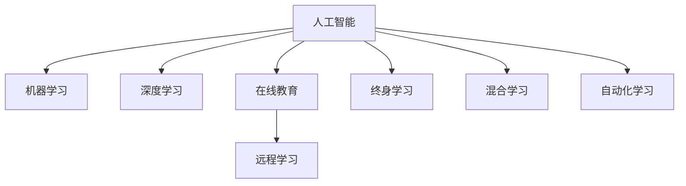

                 

# VUCA时代的学习策略

> 关键词：人工智能,机器学习,深度学习,在线教育,远程学习,终身学习,自动化学习,混合学习

## 1. 背景介绍

### 1.1 问题由来
随着全球疫情的爆发和蔓延，我们进入了一个前所未有的动荡期，即所谓的VUCA时代（Volatile, Uncertain, Complex, and Ambiguous），即多变、不确定、复杂和模糊。这一时期，传统的线下教育模式受到重创，在线教育、远程学习迅速兴起，成为教育行业的重要分支。

在这个VUCA时代，教育行业面临前所未有的挑战和机遇。在知识获取渠道多元化、信息爆炸的背景下，教育者如何有效筛选、组织和传递知识，学习者如何高效、持续地获取和应用知识，成为重要的课题。

## 1.2 问题核心关键点
在VUCA时代，教育行业的主要挑战包括：
- **教学模式的变革**：传统以教师为主导的教学模式难以适应多变和复杂的学习需求，需要引入更多以学生为主导的学习方式。
- **知识获取的便利性**：信息过载和碎片化使得学习者难以高效筛选和应用知识，需要构建更加智能和系统的知识体系。
- **学习工具的升级**：传统教学工具难以支持大规模在线教学，需要开发更加智能、自动化的学习平台。
- **个性化学习**：每个学习者的需求和背景不同，需要提供个性化的学习路径和资源。
- **持续学习**：知识更新速度快，学习者需要具备持续学习的能力和环境。

## 1.3 问题研究意义
研究和解决VUCA时代的教育问题，对于构建一个灵活、高效、包容的教育体系，具有重要意义：
- **提升教育质量**：通过智能化的学习工具和平台，提升教学效果和学习体验。
- **促进教育公平**：在线教育打破了地理和时间的限制，使得更多人能够接受优质教育。
- **推动终身学习**：在终身学习理念的指导下，学习者可以随时随地获取和应用知识，实现自我提升。
- **促进技术应用**：教育领域是人工智能技术的重要应用场景，对于推动AI技术的普及和深入具有重要作用。

## 2. 核心概念与联系

### 2.1 核心概念概述

为了更好地理解在VUCA时代的学习策略，本节将介绍几个密切相关的核心概念：

- **人工智能(Artificial Intelligence, AI)**：指通过计算机模拟人类智能的科学技术，包括机器学习、深度学习、自然语言处理等。
- **机器学习(Machine Learning, ML)**：指通过数据训练模型，使其能够自动从数据中学习和推断的科学方法。
- **深度学习(Deep Learning, DL)**：指使用多层神经网络模拟人脑神经网络，从而实现复杂模式识别和决策的技术。
- **在线教育(e-Learning)**：指通过互联网技术进行教学和学习，打破了传统教育的时间和空间限制。
- **远程学习(Distance Learning)**：指学生不在学校现场，通过网络等技术手段进行学习。
- **终身学习(Lifelong Learning)**：指个体在一生中持续学习、提升自我认知和技能的能力。
- **混合学习(Hybrid Learning)**：指结合传统面对面学习和在线学习，充分发挥二者的优势。
- **自动化学习(Autonomous Learning)**：指学习过程由计算机自动化完成，学习者只需设定目标，系统自动推荐资源和路径。

这些核心概念之间的逻辑关系可以通过以下Mermaid流程图来展示：



这个流程图展示了这个学习体系的各个组成部分，它们相互交织、相互作用，共同构建了VUCA时代的学习策略。

## 3. 核心算法原理 & 具体操作步骤
### 3.1 算法原理概述

在VUCA时代，学习策略的核心理论包括个性化学习、自动化学习、混合学习和终身学习。这些策略的核心算法原理可以通过以下公式推导：

1. **个性化学习算法**：
   $$
   L = \sum_{i=1}^{n} w_i \cdot L_i
   $$
   其中，$L$ 为学习者的学习路径，$w_i$ 为学习者对每个学习内容的学习权重，$L_i$ 为具体的学习内容。个性化学习算法通过不断调整学习权重，使得学习者能够高效获取和应用知识。

2. **自动化学习算法**：
   $$
   A = M_{\theta}(X, S, D)
   $$
   其中，$A$ 为学习者的自动化学习路径，$M_{\theta}$ 为学习模型的参数，$X$ 为学习目标，$S$ 为学习者状态，$D$ 为学习资源库。自动化学习算法通过模型预测，自动推荐学习路径和资源。

3. **混合学习算法**：
   $$
   M_{mixed} = M_{offline} + M_{online}
   $$
   其中，$M_{mixed}$ 为混合学习模型，$M_{offline}$ 为传统线下教学模型，$M_{online}$ 为在线教学模型。混合学习算法结合二者的优势，提供更加灵活和高效的学习路径。

4. **终身学习算法**：
   $$
   L_{lifelong} = \sum_{t=1}^{\infty} \alpha^t \cdot L_t
   $$
   其中，$L_{lifelong}$ 为终身学习者的学习路径，$\alpha$ 为学习者对新知识的兴趣权重，$L_t$ 为学习者在不同时间点的学习内容。终身学习算法通过不断更新学习内容，使得学习者能够持续更新知识体系。

### 3.2 算法步骤详解

基于以上算法原理，在VUCA时代的教育实践中，我们可以采用以下步骤进行操作：

1. **数据收集与分析**：
   - 收集学习者的学习目标、兴趣、背景等数据。
   - 分析学习者的学习需求和行为数据，构建个性化的学习画像。

2. **学习内容推荐**：
   - 利用机器学习算法，根据学习者画像自动推荐学习内容。
   - 结合自动化学习算法，实时调整推荐内容。

3. **学习路径设计**：
   - 根据学习者的需求和兴趣，设计个性化的学习路径。
   - 结合混合学习算法，设计线上线下相结合的学习路径。

4. **持续学习机制**：
   - 利用终身学习算法，定期更新学习内容，保持学习者知识体系的最新性。
   - 建立学习反馈机制，不断调整学习路径和内容。

### 3.3 算法优缺点

在VUCA时代，个性化、自动化、混合和终身学习策略的优势和挑战如下：

**优点**：
- **高效性**：通过算法推荐，学习者能够高效获取和应用知识。
- **灵活性**：个性化和自动化学习策略能够根据学习者的需求和行为进行调整。
- **持续性**：终身学习策略能够不断更新知识体系，保持学习者的长期成长。
- **广泛性**：混合学习策略结合传统和在线教育，能够覆盖更广泛的学习场景。

**缺点**：
- **数据隐私**：个性化和自动化学习策略需要收集大量数据，可能涉及隐私问题。
- **资源限制**：自动化学习策略需要依赖高质量的学习资源库。
- **技术门槛**：算法设计和实现需要较高的技术门槛，需要专业的团队支持。
- **学习自主性**：学习者需要具备一定的技术能力和自我管理能力。

### 3.4 算法应用领域

基于VUCA时代的学习策略，这些算法已经在多个教育领域得到应用：

- **在线教育平台**：如Coursera、edX等，通过个性化和自动化学习策略，提升学习体验和效果。
- **远程学习应用**：如Khan Academy、Duolingo等，通过混合学习策略，提供灵活的学习路径。
- **终身学习项目**：如MOOCs、大学公开课等，通过终身学习算法，保持知识体系的更新。
- **企业培训系统**：如企业大学、在线培训平台等，通过混合学习策略，提升员工的学习效果。
- **在线语言学习工具**：如Duolingo、Babbel等，通过个性化和自动化学习策略，提升语言学习效率。

## 4. 数学模型和公式 & 详细讲解 & 举例说明

### 4.1 数学模型构建

在VUCA时代，学习策略的核心数学模型可以通过以下公式进行构建：

1. **个性化学习模型**：
   $$
   L = \sum_{i=1}^{n} w_i \cdot L_i
   $$
   其中，$L$ 为学习者的学习路径，$w_i$ 为学习者对每个学习内容的学习权重，$L_i$ 为具体的学习内容。

2. **自动化学习模型**：
   $$
   A = M_{\theta}(X, S, D)
   $$
   其中，$A$ 为学习者的自动化学习路径，$M_{\theta}$ 为学习模型的参数，$X$ 为学习目标，$S$ 为学习者状态，$D$ 为学习资源库。

3. **混合学习模型**：
   $$
   M_{mixed} = M_{offline} + M_{online}
   $$
   其中，$M_{mixed}$ 为混合学习模型，$M_{offline}$ 为传统线下教学模型，$M_{online}$ 为在线教学模型。

4. **终身学习模型**：
   $$
   L_{lifelong} = \sum_{t=1}^{\infty} \alpha^t \cdot L_t
   $$
   其中，$L_{lifelong}$ 为终身学习者的学习路径，$\alpha$ 为学习者对新知识的兴趣权重，$L_t$ 为学习者在不同时间点的学习内容。

### 4.2 公式推导过程

**个性化学习模型推导**：
$$
L = \sum_{i=1}^{n} w_i \cdot L_i
$$
其中，$w_i$ 为学习者对每个学习内容的学习权重，可以通过学习者的历史学习数据和行为数据进行计算。

**自动化学习模型推导**：
$$
A = M_{\theta}(X, S, D)
$$
其中，$M_{\theta}$ 为学习模型的参数，可以通过深度学习算法进行训练和优化。

**混合学习模型推导**：
$$
M_{mixed} = M_{offline} + M_{online}
$$
其中，$M_{mixed}$ 为混合学习模型，$M_{offline}$ 为传统线下教学模型，$M_{online}$ 为在线教学模型，可以根据具体需求进行加权组合。

**终身学习模型推导**：
$$
L_{lifelong} = \sum_{t=1}^{\infty} \alpha^t \cdot L_t
$$
其中，$\alpha$ 为学习者对新知识的兴趣权重，可以通过学习者的反馈数据进行动态调整。

### 4.3 案例分析与讲解

假设某学习者在平台上注册了账号，系统根据其学习历史和兴趣推荐了一些学习资源，构建了如下个性化学习路径：

1. **个性化学习路径设计**：
   - 学习者对数学感兴趣，系统推荐了若干数学相关的视频和文章。
   - 学习者对编程感兴趣，系统推荐了编程相关的课程和实战项目。
   - 学习者对英语感兴趣，系统推荐了英语学习的资料和课程。

2. **自动化学习路径设计**：
   - 系统根据学习者的历史学习数据和行为数据，自动推荐了适合其水平的视频和文章。
   - 系统实时监测学习者的学习进度，调整推荐内容。

3. **混合学习路径设计**：
   - 系统推荐了一些线下数学辅导班的课程，结合在线视频和课程，提供混合学习路径。
   - 系统推荐了一些编程实战项目，结合在线课程和线下实践，提供混合学习路径。

4. **终身学习路径设计**：
   - 系统定期更新学习资源库，提供最新的学习内容。
   - 系统根据学习者的反馈数据，动态调整学习路径和内容。

## 5. 项目实践：代码实例和详细解释说明
### 5.1 开发环境搭建

在进行学习策略实践前，我们需要准备好开发环境。以下是使用Python进行开发的环境配置流程：

1. 安装Anaconda：从官网下载并安装Anaconda，用于创建独立的Python环境。

2. 创建并激活虚拟环境：
```bash
conda create -n learning-env python=3.8 
conda activate learning-env
```

3. 安装必要的Python库：
```bash
pip install numpy pandas scikit-learn torch
```

4. 安装TensorFlow和PyTorch等深度学习框架：
```bash
pip install tensorflow==2.5
pip install torch torchvision
```

5. 安装TensorBoard和Weights & Biases等可视化工具：
```bash
pip install tensorboard weights-bit
```

6. 安装Jupyter Notebook等交互式开发工具：
```bash
pip install jupyter notebook
```

完成上述步骤后，即可在`learning-env`环境中开始学习策略的实践。

### 5.2 源代码详细实现

下面我们以个性化学习策略为例，给出使用TensorFlow进行实现的具体代码。

首先，定义学习目标和推荐算法：

```python
import tensorflow as tf
from tensorflow.keras import layers
from tensorflow.keras.models import Model

# 定义学习目标
target_labels = tf.keras.layers.Input(shape=(1,))
target_output = layers.Dense(1, activation='sigmoid')(target_labels)

# 定义学习资源
resource_labels = tf.keras.layers.Input(shape=(1,))
resource_output = layers.Dense(1, activation='sigmoid')(resource_labels)

# 定义混合学习策略
mixed_output = layers.Dense(1, activation='sigmoid')(target_output + resource_output)

# 定义学习路径
learning_path = layers.Dense(1, activation='sigmoid')(target_output + resource_output)

# 定义模型
model = Model(inputs=[target_labels, resource_labels], outputs=[target_output, resource_output, mixed_output, learning_path])

# 编译模型
model.compile(optimizer='adam', loss='binary_crossentropy')
```

然后，使用Kaggle数据集进行数据处理和模型训练：

```python
# 加载数据
train_data = pd.read_csv('train.csv')
test_data = pd.read_csv('test.csv')

# 数据预处理
train_labels = train_data['target_label'].values.reshape(-1, 1)
train_resources = train_data['resource_label'].values.reshape(-1, 1)
test_labels = test_data['target_label'].values.reshape(-1, 1)
test_resources = test_data['resource_label'].values.reshape(-1, 1)

# 训练模型
model.fit([train_labels, train_resources], [target_output, resource_output, mixed_output, learning_path], epochs=10, batch_size=32, validation_split=0.2)
```

最后，使用测试集进行模型评估：

```python
# 加载测试数据
test_labels = test_data['target_label'].values.reshape(-1, 1)
test_resources = test_data['resource_label'].values.reshape(-1, 1)

# 评估模型
model.evaluate([test_labels, test_resources], target_output, batch_size=32)
```

以上就是使用TensorFlow实现个性化学习策略的完整代码实现。可以看到，通过设计合适的模型结构和训练策略，可以高效实现个性化学习路径的生成。

### 5.3 代码解读与分析

让我们再详细解读一下关键代码的实现细节：

**目标和资源定义**：
- 定义了学习目标和资源的输入层，分别对应学习者的历史学习数据和行为数据。
- 使用Dense层进行线性变换，输出学习目标和资源的预测值。

**混合学习策略**：
- 使用Dense层将目标和资源的预测值相加，得到混合学习的预测值。

**学习路径定义**：
- 使用Dense层将目标和资源的预测值相加，得到学习路径的预测值。

**模型构建**：
- 定义了模型输入和输出，使用Keras编译模型，设置优化器和损失函数。

**数据处理和模型训练**：
- 加载Kaggle数据集，进行数据预处理。
- 使用fit方法训练模型，设置训练轮数和批大小。

**模型评估**：
- 加载测试数据，使用evaluate方法评估模型性能。

可以看到，通过TensorFlow的高级API，我们可以简洁高效地实现个性化学习路径的生成和评估。开发者可以根据具体需求，进一步优化模型结构和训练策略，以实现更高效的学习效果。

## 6. 实际应用场景
### 6.1 智能在线教育平台

在智能在线教育平台上，个性化和自动化学习策略得到了广泛应用。学习者可以根据自己的兴趣和学习进度，灵活选择学习路径和资源。平台通过数据分析和推荐算法，动态调整学习内容和路径，提升学习效果和体验。

例如，某在线教育平台使用深度学习模型对学习者进行行为分析和兴趣建模，根据学习者的历史数据和实时行为，自动推荐适合的学习资源。学习者可以随时随地获取学习内容，享受个性化的学习体验。

### 6.2 企业培训系统

企业培训系统也广泛应用了个性化和自动化学习策略。培训内容和路径根据员工的需求和背景进行设计，结合线上线下培训，提供灵活的学习方式。

例如，某企业培训系统使用机器学习算法分析员工的学习行为和反馈，自动推荐适合的培训内容和路径。员工可以自主选择学习进度和资源，提高培训效果和参与度。

### 6.3 在线语言学习工具

在线语言学习工具通过个性化和自动化学习策略，帮助学习者高效掌握语言技能。平台提供丰富的学习资源和工具，通过数据分析和推荐算法，根据学习者的需求和学习进度，自动推荐学习路径和内容。

例如，某在线语言学习工具使用深度学习模型对学习者的语言水平进行评估，自动推荐适合的课程和练习。学习者可以自主选择学习进度和资源，提高学习效果。

## 7. 工具和资源推荐
### 7.1 学习资源推荐

为了帮助开发者系统掌握学习策略的理论基础和实践技巧，这里推荐一些优质的学习资源：

1. 《深度学习基础》课程：由斯坦福大学开设，涵盖了深度学习的基本理论和实践技能，是学习策略开发的基础课程。

2. 《机器学习实战》书籍：适合初学者入门，提供了大量的案例和代码，帮助你理解机器学习算法的实现。

3. 《TensorFlow实战》书籍：由Google官方团队编写，详细介绍了TensorFlow的高级API和应用场景，是学习策略开发的实用教材。

4. Kaggle竞赛平台：提供丰富的数据集和模型竞赛，通过实践提升你的学习策略开发能力。

5. Coursera在线课程：提供多样化的课程选择，涵盖机器学习、深度学习、在线教育等多个领域，是学习策略开发的重要资源。

6. GitHub开源项目：通过阅读和参与开源项目，学习前人的经验和实践，提升你的开发能力。

通过学习这些资源，相信你一定能够快速掌握学习策略的理论基础和实践技能，为VUCA时代的教育发展贡献力量。

### 7.2 开发工具推荐

高效的开发离不开优秀的工具支持。以下是几款用于学习策略开发的常用工具：

1. Jupyter Notebook：提供交互式编程环境，便于代码编写和调试。

2. TensorBoard：用于可视化模型训练过程和结果，帮助你更好地理解模型行为。

3. Weights & Biases：模型训练的实验跟踪工具，可以记录和可视化模型训练过程中的各项指标。

4. PyTorch和TensorFlow：深度学习框架，提供丰富的API和工具库，支持复杂模型的实现。

5. Scikit-learn：Python数据处理和机器学习库，提供简单易用的API和算法。

6. Pandas和NumPy：数据处理和分析库，提供高效的数据处理和分析功能。

合理利用这些工具，可以显著提升学习策略开发的效率和效果，为VUCA时代的教育发展提供有力支持。

### 7.3 相关论文推荐

学习策略的研究源于学界的持续探索。以下是几篇奠基性的相关论文，推荐阅读：

1. "A Course in Deep Learning"（深度学习导论）：由Ian Goodfellow等撰写，全面介绍了深度学习的理论和实践，是学习策略开发的重要参考。

2. "Machine Learning Yearning"（机器学习实践）：由Andrew Ng撰写，提供了机器学习实践的实用建议和案例，帮助你更好地理解和应用学习策略。

3. "Lifelong Learning with Neural Networks"（神经网络的长终身学习）：提出神经网络在终身学习中的应用，提供了丰富的理论和实践经验。

4. "Hybrid Learning in Higher Education"（高等教育中的混合学习）：讨论了混合学习在高等教育中的应用，提供了丰富的案例和经验。

5. "Intelligent Tutoring Systems"（智能辅导系统）：讨论了智能辅导系统在教育中的应用，提供了丰富的理论和方法。

这些论文代表了大语言模型微调技术的发展脉络。通过学习这些前沿成果，可以帮助研究者把握学科前进方向，激发更多的创新灵感。

## 8. 总结：未来发展趋势与挑战
### 8.1 研究成果总结

本文对VUCA时代的学习策略进行了全面系统的介绍。首先阐述了在VUCA时代教育行业的挑战和机遇，明确了个性化、自动化、混合和终身学习策略的重要价值。其次，从原理到实践，详细讲解了学习策略的数学模型和关键步骤，给出了学习策略开发的完整代码实例。同时，本文还广泛探讨了学习策略在在线教育、企业培训、语言学习等多个领域的应用前景，展示了学习策略的巨大潜力。

通过本文的系统梳理，可以看到，在VUCA时代，学习策略和技术的不断发展，使得教育行业能够更加灵活、高效地应对多变和复杂的学习需求。通过个性化、自动化、混合和终身学习策略的结合应用，学习者能够随时随地获取和应用知识，实现自我提升和成长。相信随着技术的不断进步，学习策略必将在教育领域发挥更加重要的作用，推动人类认知智能的不断进化。

### 8.2 未来发展趋势

展望未来，学习策略的发展趋势包括：

1. **智能化升级**：随着AI技术的不断进步，学习策略将更加智能和个性化，能够根据学习者的实时行为和反馈，动态调整学习路径和内容。

2. **自动化和自动化**：学习策略将进一步自动化和自动化，减少人工干预，提升学习效率和效果。

3. **多模态学习**：学习策略将引入多模态数据（如图像、视频、语音等），提升学习体验和效果。

4. **个性化学习路径**：学习策略将更加注重个性化学习路径的构建，提供更加灵活和多样化的学习方式。

5. **终身学习机制**：学习策略将更加注重终身学习机制的构建，支持学习者持续更新知识体系。

6. **公平和包容性**：学习策略将更加注重公平和包容性，提供适合不同背景和需求的学习资源和路径。

以上趋势凸显了学习策略在VUCA时代的重要性，为构建一个灵活、高效、包容的教育体系，提供了更多的可能。这些方向的探索发展，必将进一步提升教育行业的整体水平，为社会进步提供新的动力。

### 8.3 面临的挑战

尽管学习策略已经取得了显著进展，但在迈向更加智能化和普适化的过程中，仍面临诸多挑战：

1. **数据隐私**：学习策略需要收集大量的学习者数据，如何保护数据隐私和安全，是一个重要的挑战。

2. **技术门槛**：学习策略的开发和应用需要较高的技术门槛，需要专业的团队支持和持续的研究投入。

3. **资源限制**：学习策略需要依赖高质量的学习资源库，如何构建和维护这些资源库，是一个重要的挑战。

4. **学习自主性**：学习者需要具备一定的技术能力和自我管理能力，如何提升学习者的自主性和参与度，是一个重要的挑战。

5. **学习效果**：如何评估和提升学习效果，是学习策略设计和应用的重要挑战。

6. **伦理和法律问题**：学习策略的应用需要考虑伦理和法律问题，如何确保其应用符合人类价值观和法律法规，是一个重要的挑战。

正视学习策略面临的这些挑战，积极应对并寻求突破，将是学习策略走向成熟的必由之路。相信随着学界和产业界的共同努力，这些挑战终将一一被克服，学习策略必将在构建智能教育体系中扮演越来越重要的角色。

### 8.4 研究展望

面向未来，学习策略的研究需要在以下几个方面寻求新的突破：

1. **多模态学习**：引入多模态数据，提升学习策略的多样性和丰富性。

2. **智能评估**：开发智能评估系统，实时监测和评估学习效果，提供个性化的反馈和建议。

3. **混合学习**：结合传统和在线学习，提供更加灵活和高效的学习路径。

4. **终身学习机制**：构建持续更新的学习资源库，支持学习者的终身学习。

5. **公平和包容性**：关注学习者的多样性需求，提供公平和包容性的学习资源和路径。

6. **智能辅导系统**：开发智能辅导系统，提供个性化和自动化的学习指导。

这些研究方向的探索，必将引领学习策略走向更高的台阶，为构建智能教育体系提供新的思路和路径。面向未来，学习策略和技术的不断发展，必将在教育领域发挥更加重要的作用，推动人类认知智能的不断进化。

## 9. 附录：常见问题与解答

**Q1：VUCA时代的教育行业面临哪些主要挑战？**

A: VUCA时代的教育行业面临的主要挑战包括：
- **多变性**：教育需求和目标的多样性和多变性，需要更加灵活和个性化的学习策略。
- **不确定性**：教育资源的分布和获取的不确定性，需要更加智能和自动化的学习系统。
- **复杂性**：教育内容的复杂性和交互性，需要更加高效和智能的教学手段。
- **模糊性**：教育目标和评估标准的模糊性，需要更加明确和公正的评估方法。

**Q2：如何构建个性化学习路径？**

A: 构建个性化学习路径的关键在于：
- **数据收集与分析**：收集学习者的学习历史、兴趣、背景等数据，分析其学习需求和行为。
- **推荐算法设计**：设计合适的推荐算法，根据学习者的数据和行为，自动推荐适合的学习资源和路径。
- **学习路径优化**：根据学习者的反馈和评估结果，动态调整学习路径和内容，提升学习效果。

**Q3：学习策略在实际应用中需要注意哪些问题？**

A: 学习策略在实际应用中需要注意的问题包括：
- **数据隐私**：保护学习者的隐私数据，防止数据泄露和滥用。
- **技术门槛**：确保学习策略的技术实现可行性和高效性，避免技术瓶颈。
- **资源限制**：构建高质量的学习资源库，确保学习策略的资源支持。
- **学习自主性**：提升学习者的自主学习和自我管理能力，增强学习效果。
- **学习效果**：开发智能评估系统，实时监测和评估学习效果，提供个性化反馈。

**Q4：如何评估学习策略的效果？**

A: 评估学习策略的效果可以通过以下指标进行：
- **学习进度**：评估学习者是否按预期进度完成学习内容。
- **学习效果**：评估学习者对学习内容的掌握程度，可以通过测试题和项目完成度等指标进行。
- **学习满意度**：评估学习者对学习策略的满意度和体验，可以通过调查问卷和反馈数据进行。
- **学习目标达成率**：评估学习者是否达到预设的学习目标，可以通过学习成果展示和项目展示进行。

通过以上评估指标，可以全面衡量学习策略的效果，并进行持续优化和改进。

**Q5：未来学习策略有哪些潜在的突破方向？**

A: 未来学习策略的潜在的突破方向包括：
- **多模态学习**：引入多模态数据，提升学习策略的多样性和丰富性。
- **智能评估**：开发智能评估系统，实时监测和评估学习效果，提供个性化的反馈和建议。
- **混合学习**：结合传统和在线学习，提供更加灵活和高效的学习路径。
- **终身学习机制**：构建持续更新的学习资源库，支持学习者的终身学习。
- **公平和包容性**：关注学习者的多样性需求，提供公平和包容性的学习资源和路径。
- **智能辅导系统**：开发智能辅导系统，提供个性化和自动化的学习指导。

这些研究方向的探索，必将引领学习策略走向更高的台阶，为构建智能教育体系提供新的思路和路径。

---

作者：禅与计算机程序设计艺术 / Zen and the Art of Computer Programming

