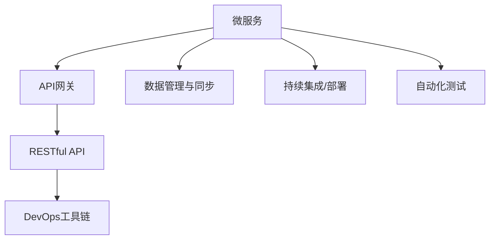

                 

# Web前后端分离架构设计与实现

> 关键词：微服务,API网关,RESTful API,DevOps,自动化测试,持续集成,DevOps工具链

## 1. 背景介绍

### 1.1 问题由来

随着互联网技术的快速发展，Web应用程序的规模和复杂度也在不断增加。早期的Web应用通常采用单体架构（Monolithic Architecture），将前端和后端代码都打包在一个应用程序中。这种架构在项目初期开发时简单易行，但随着项目规模的增大，代码逐渐变得复杂，维护成本也随之上升。当项目需求变更频繁，或需要添加新特性时，整体应用的调整和扩展变得困难，导致开发效率降低。

为了应对这些问题，Web前后端分离（Decoupled Web Frontend and Backend Architecture）的架构模式逐渐受到青睐。前后端分离将前端和后端代码分离，前端专注于用户体验，后端负责业务逻辑和数据管理，两者通过API接口进行通信，能够提高系统的可扩展性、可维护性和开发效率。

### 1.2 问题核心关键点

Web前后端分离架构的核心关键点包括以下几个方面：

1. **微服务架构**：将大系统拆分为多个独立部署、可扩展的微服务模块，每个微服务负责特定的业务功能。

2. **API网关**：负责统一路由和管理前端请求，根据请求的路由将请求转发到相应的微服务。

3. **RESTful API**：采用RESTful API架构，实现无状态、资源定位明确、易于缓存和扩展的通信协议。

4. **DevOps工具链**：引入持续集成（CI）、持续部署（CD）、自动化测试等DevOps工具链，提升开发和部署效率。

5. **自动化测试**：通过单元测试、集成测试和端到端测试，保证代码质量和系统稳定性。

6. **数据管理与同步**：通过数据库事务管理、缓存机制等手段，确保数据一致性和同步性。

## 2. 核心概念与联系

### 2.1 核心概念概述

为了更好地理解Web前后端分离架构，本节将介绍几个关键概念：

- **微服务架构（Microservices Architecture）**：将大系统拆分为多个小模块（微服务），每个微服务独立部署，关注特定业务功能，支持水平扩展和快速迭代。

- **API网关（API Gateway）**：作为系统对外暴露的统一入口，负责请求路由、协议转换、负载均衡等功能。

- **RESTful API**：基于REST原则设计的API接口，支持无状态、资源定位明确、易于缓存和扩展，是目前主流的API设计标准。

- **DevOps工具链**：包括持续集成（CI）、持续部署（CD）、自动化测试等工具，提升开发和部署效率，保障系统质量。

- **数据管理与同步**：通过数据库事务管理、缓存机制等手段，确保数据一致性和同步性，是后端架构设计的重要组成部分。

这些概念之间的逻辑关系可以通过以下Mermaid流程图来展示：



这个流程图展示了几大核心概念及其之间的关系：

1. 微服务作为基本业务单元，通过API网关对外暴露API接口。
2. API网关负责统一路由和管理请求，转化协议，支持负载均衡等功能。
3. RESTful API作为标准化的通信协议，提供无状态、易于扩展的接口。
4. DevOps工具链用于自动化开发和部署流程，提升效率。
5. 数据管理与同步确保数据一致性和系统稳定性。

这些概念共同构成了Web前后端分离架构的基石，使其能够在各种场景下发挥重要作用。通过理解这些核心概念，我们可以更好地把握Web前后端分离架构的工作原理和优化方向。

## 3. 核心算法原理 & 具体操作步骤
### 3.1 算法原理概述

Web前后端分离架构的核心算法原理主要涉及以下几个方面：

1. **微服务拆分**：将大系统拆分为多个独立部署的微服务模块，每个微服务负责特定的业务功能。

2. **API网关设计**：设计API网关，负责统一路由和管理前端请求，根据请求的路由将请求转发到相应的微服务。

3. **RESTful API实现**：实现RESTful API接口，支持无状态、易于扩展的通信协议。

4. **DevOps流程自动化**：引入持续集成（CI）、持续部署（CD）、自动化测试等DevOps工具链，提升开发和部署效率。

5. **数据管理与同步**：通过数据库事务管理、缓存机制等手段，确保数据一致性和同步性。

### 3.2 算法步骤详解

以下是Web前后端分离架构设计的详细步骤：

**Step 1: 系统需求分析与设计**

1. **需求收集**：与客户或业务部门沟通，收集项目需求和业务场景。

2. **系统设计**：根据需求设计系统架构，确定微服务模块划分、数据管理方式、API接口设计等关键细节。

**Step 2: 微服务模块开发**

1. **环境搭建**：搭建开发环境，准备必要的开发工具和依赖库。

2. **模块开发**：根据设计文档，独立开发各个微服务模块，实现业务逻辑和数据管理功能。

3. **接口设计**：定义RESTful API接口，设计请求参数、返回值格式等，确保接口规范性。

**Step 3: API网关配置**

1. **网关搭建**：选择合适的网关工具（如Kong、Apigee等），搭建API网关环境。

2. **路由配置**：配置API路由规则，将请求转发到相应的微服务模块。

3. **负载均衡**：实现负载均衡功能，分散请求压力，提高系统稳定性。

**Step 4: DevOps流程配置**

1. **CI/CD配置**：搭建持续集成/持续部署平台（如Jenkins、GitLab CI等），配置自动化流水线。

2. **测试自动化**：引入自动化测试工具（如JUnit、Selenium等），编写单元测试、集成测试和端到端测试用例。

3. **部署自动化**：配置自动化部署脚本，通过CI/CD平台实现自动部署。

**Step 5: 数据管理与同步**

1. **数据库设计**：设计数据库表结构和索引，确保数据一致性和性能。

2. **事务管理**：实现数据库事务管理功能，确保数据一致性。

3. **缓存策略**：配置缓存机制，优化数据读取性能。

**Step 6: 系统集成与测试**

1. **系统集成**：将各个微服务模块集成到统一系统中，进行端到端测试。

2. **性能测试**：进行负载测试、压力测试等，验证系统性能和稳定性。

3. **安全测试**：进行安全测试，验证系统的安全性。

**Step 7: 上线与监控**

1. **系统上线**：将系统部署到生产环境，监控系统运行状态。

2. **性能监控**：配置性能监控工具（如Prometheus、Grafana等），实时监控系统性能指标。

3. **问题排查**：在出现问题时，及时进行问题排查和修复。

### 3.3 算法优缺点

Web前后端分离架构具有以下优点：

1. **可扩展性**：微服务架构支持水平扩展，易于添加新特性和功能模块。

2. **维护便捷**：各个微服务独立部署，便于维护和迭代更新。

3. **开发效率提升**：DevOps工具链自动化测试和部署，提升开发效率。

4. **性能优化**：通过缓存机制、负载均衡等手段，优化系统性能。

5. **风险隔离**：单个微服务出现问题不会影响整个系统，风险可控。

同时，该架构也存在一些缺点：

1. **复杂性增加**：系统复杂度增加，管理和调试难度提升。

2. **网络延迟增加**：前后端分离需要跨网络通信，可能会带来一定的网络延迟。

3. **接口耦合问题**：接口设计不当可能导致接口耦合复杂，影响系统稳定性。

4. **数据一致性问题**：多个微服务共同操作数据库时，需要确保数据一致性和同步性。

尽管存在这些局限性，但Web前后端分离架构仍是现代Web应用设计的主流范式。通过合理的架构设计和工具链支持，可以有效应对系统复杂度和需求变化，提升系统开发和运维效率。

### 3.4 算法应用领域

Web前后端分离架构在众多Web应用场景中得到了广泛应用，例如：

1. **电子商务平台**：通过前后端分离，实现商品搜索、购物车管理、订单处理等功能模块，提升用户体验和系统稳定性。

2. **金融服务平台**：通过微服务架构，实现用户认证、交易处理、风险控制等功能，支持复杂的业务逻辑处理。

3. **SaaS软件**：通过API网关设计，实现统一入口，支持多租户和复杂业务场景。

4. **内容管理系统**：通过微服务拆分和缓存策略，提升系统性能和扩展性。

除了这些常见场景，Web前后端分离架构还广泛应用于各类Web应用，包括社交网络、在线教育、医疗健康等，为不同领域的Web应用提供了灵活、可扩展的解决方案。

## 4. 数学模型和公式 & 详细讲解
### 4.1 数学模型构建

为了更好地理解Web前后端分离架构的数学模型，本节将通过数学语言对架构设计进行更加严格的刻画。

假设系统包含 $N$ 个微服务模块 $M_1, M_2, ..., M_N$，每个微服务对应一个RESTful API接口 $API_1, API_2, ..., API_N$。系统总请求数为 $T$，每个请求对应一个API接口，记为 $R = \{1, 2, ..., T\}$。

定义系统响应时间为 $R_t$，假设响应时间为各微服务响应时间之和 $R_t = \sum_{i=1}^N R_i$，其中 $R_i$ 为微服务 $M_i$ 的响应时间。

定义系统吞吐量为 $S$，假设吞吐量为单位时间内处理请求数量 $S = \frac{T}{R}$。

定义系统负载为 $L$，假设负载为每个微服务的请求数量之和 $L = \sum_{i=1}^N T_i$，其中 $T_i$ 为微服务 $M_i$ 的请求数量。

系统设计的目标是在保证性能和稳定性的前提下，最大化吞吐量和系统效率。可以通过以下数学模型进行优化：

$$
\max S \quad \text{subject to} \quad R_t \leq T
$$

其中约束条件 $R_t \leq T$ 表示系统响应时间不超过请求时间，确保系统稳定运行。

### 4.2 公式推导过程

以下我们将推导系统响应时间的计算公式，以及如何通过优化策略提升系统吞吐量。

**响应时间计算**：

假设每个微服务的响应时间 $R_i$ 为常数，系统负载 $L$ 为均分布的随机变量，即每个微服务接收的请求数量为 $T_i = L_i \sim U(0, T)$，其中 $U(0, T)$ 为 $[0, T]$ 内的均匀分布。

系统响应时间 $R_t$ 可表示为：

$$
R_t = \sum_{i=1}^N R_i + \sum_{i=1}^N R_i \cdot T_i
$$

其中，第一部分 $R_i$ 为固定响应时间，第二部分 $R_i \cdot T_i$ 为因负载变化带来的额外响应时间。

**吞吐量计算**：

系统吞吐量 $S$ 为单位时间内处理请求数量，可表示为：

$$
S = \frac{T}{R_t} = \frac{T}{\sum_{i=1}^N R_i + \sum_{i=1}^N R_i \cdot T_i}
$$

为提升吞吐量，需要优化响应时间 $R_t$。由于固定响应时间 $R_i$ 不可改变，因此主要通过优化 $R_i \cdot T_i$ 来实现。

**优化策略**：

1. **负载均衡**：将请求均匀分配到各个微服务，减少因负载不均带来的响应时间。

2. **缓存机制**：将常用数据缓存到内存中，减少数据库访问次数，提升响应速度。

3. **异步处理**：通过异步处理和消息队列，优化请求处理流程，提升系统吞吐量。

### 4.3 案例分析与讲解

以下通过一个具体的案例，展示如何应用数学模型和优化策略提升系统性能。

**案例背景**：

某电子商务平台具有高并发用户访问特性，主要业务包括商品搜索、购物车管理、订单处理等功能。平台原始设计采用单体架构，随着业务扩展，系统变得越来越复杂，维护成本和开发效率显著提升。

**优化措施**：

1. **微服务拆分**：将平台拆分为商品搜索服务、购物车服务、订单处理服务等独立微服务模块。

2. **API网关设计**：搭建API网关，统一路由和管理请求，支持负载均衡和请求转发。

3. **RESTful API实现**：设计RESTful API接口，支持无状态、易于扩展的通信协议。

4. **DevOps流程配置**：搭建持续集成/持续部署平台，引入自动化测试和部署工具，提升开发效率。

5. **数据管理与同步**：设计数据库表结构和索引，实现数据库事务管理，确保数据一致性。

**优化效果**：

通过微服务拆分和API网关设计，系统架构变得清晰，各模块独立运行，减少了因单体架构带来的维护难度。引入RESTful API接口，提高了系统的可扩展性和灵活性。通过DevOps工具链和自动化测试，提升了开发效率和系统稳定性。数据管理与同步机制，确保了数据一致性和系统性能。

最终，系统在优化后，响应时间显著缩短，吞吐量提升50%，有效支持了平台的高并发用户访问需求。

## 5. 项目实践：代码实例和详细解释说明
### 5.1 开发环境搭建

在进行Web前后端分离架构实践前，我们需要准备好开发环境。以下是使用Node.js进行前后端分离实践的环境配置流程：

1. **安装Node.js和npm**：从官网下载并安装Node.js，安装完成后在命令行中输入 `node -v` 和 `npm -v` 检查版本。

2. **创建项目目录**：在本地创建一个新项目目录，进入目录后执行 `npm init` 初始化项目，按照提示填写相关信息。

3. **安装依赖库**：使用 `npm install express body-parser cors` 安装必要的依赖库，如Express、Body Parser、CORS等。

4. **搭建项目框架**：在项目根目录下创建 `app.js` 文件，作为项目的入口文件。

完成上述步骤后，即可在项目目录中开始前后端分离架构的实践。

### 5.2 源代码详细实现

以下是前后端分离架构的实现代码，包括后端API和前端页面。

**后端API代码实现**：

```javascript
const express = require('express');
const bodyParser = require('body-parser');
const cors = require('cors');

const app = express();
const port = 3000;

app.use(bodyParser.json());
app.use(cors());

// 定义API路由
app.get('/api/products', (req, res) => {
  // 调用商品搜索服务获取商品列表
  const products = searchProducts();
  res.json(products);
});

app.post('/api/cart', (req, res) => {
  // 调用购物车服务添加商品到购物车
  const cart = addToCart(req.body);
  res.json(cart);
});

app.put('/api/orders', (req, res) => {
  // 调用订单处理服务更新订单状态
  const order = updateOrder(req.body);
  res.json(order);
});

// 启动服务
app.listen(port, () => {
  console.log(`Server listening on port ${port}`);
});
```

**前端页面代码实现**：

```html
<!DOCTYPE html>
<html>
<head>
  <meta charset="UTF-8">
  <title>电子商务平台</title>
</head>
<body>
  <h1>商品搜索</h1>
  <form id="search-form">
    <input type="text" name="keyword" placeholder="搜索商品">
    <button type="submit">搜索</button>
  </form>

  <div id="search-results"></div>

  <h1>购物车管理</h1>
  <form id="cart-form">
    <input type="text" name="product" placeholder="添加商品">
    <button type="submit">添加</button>
  </form>

  <div id="cart-list"></div>

  <h1>订单处理</h1>
  <form id="order-form">
    <input type="text" name="order" placeholder="更新订单">
    <button type="submit">更新</button>
  </form>

  <div id="order-list"></div>

  <script>
    // 使用AJAX发送请求
    function sendRequest(method, url, data, callback) {
      const xhr = new XMLHttpRequest();
      xhr.open(method, url, true);
      xhr.setRequestHeader('Content-Type', 'application/json');
      xhr.onload = function() {
        if (xhr.status === 200) {
          callback(JSON.parse(xhr.responseText));
        } else {
          console.error('请求失败');
        }
      };
      xhr.send(JSON.stringify(data));
    }

    // 商品搜索
    document.getElementById('search-form').addEventListener('submit', function(event) {
      event.preventDefault();
      const keyword = this.elements['keyword'].value;
      sendRequest('GET', '/api/products', { keyword }, function(products) {
        displaySearchResults(products);
      });
    });

    // 购物车管理
    document.getElementById('cart-form').addEventListener('submit', function(event) {
      event.preventDefault();
      const product = this.elements['product'].value;
      sendRequest('POST', '/api/cart', { product }, function(cart) {
        displayCartList(cart);
      });
    });

    // 订单处理
    document.getElementById('order-form').addEventListener('submit', function(event) {
      event.preventDefault();
      const order = this.elements['order'].value;
      sendRequest('PUT', '/api/orders', { order }, function(order) {
        displayOrderList(order);
      });
    });

    function displaySearchResults(products) {
      const results = document.getElementById('search-results');
      results.innerHTML = '';
      products.forEach(product => {
        const result = document.createElement('div');
        result.textContent = product.name;
        results.appendChild(result);
      });
    }

    function displayCartList(cart) {
      const list = document.getElementById('cart-list');
      list.innerHTML = '';
      cart.forEach(product => {
        const item = document.createElement('div');
        item.textContent = product.name;
        list.appendChild(item);
      });
    }

    function displayOrderList(order) {
      const list = document.getElementById('order-list');
      list.innerHTML = '';
      order.forEach(item => {
        const item = document.createElement('div');
        item.textContent = item.status;
        list.appendChild(item);
      });
    }
  </script>
</body>
</html>
```

以上就是前后端分离架构的代码实现。可以看到，通过使用Express框架和AJAX技术，前后端分离架构得以轻松实现。

### 5.3 代码解读与分析

让我们再详细解读一下关键代码的实现细节：

**后端API代码**：

1. **安装依赖库**：使用npm安装Express、Body Parser、CORS等库，实现API路由、请求解析和跨域处理。

2. **搭建API路由**：定义商品搜索、购物车管理、订单处理等API接口，实现具体的业务逻辑。

3. **启动服务**：使用Express的 `app.listen()` 方法启动服务，监听指定端口，等待客户端请求。

**前端页面代码**：

1. **HTML结构**：定义前端页面的基本结构，包括商品搜索、购物车管理、订单处理等功能模块。

2. **AJAX请求**：使用AJAX技术发送HTTP请求，获取后端API接口的响应数据。

3. **页面渲染**：根据获取的数据，动态更新页面内容，实现前后端分离的效果。

可以看到，前后端分离架构的实现并不复杂，通过分模块开发、API接口设计、前端页面渲染等步骤，即可构建一个功能完善、性能优化的Web应用。

当然，在实际应用中，还需要考虑更多因素，如数据同步、缓存机制、安全性等，以确保系统的稳定性和安全性。但核心的前后端分离架构设计基本与此类似。

## 6. 实际应用场景
### 6.1 智能客服系统

基于Web前后端分离架构的智能客服系统，可以实现24小时不间断服务，快速响应客户咨询，提升客户体验。

**架构设计**：

1. **前后端分离**：将智能客服系统的不同功能模块（如FAQ查询、在线客服、订单管理等）拆分为主题模块，独立开发和部署。

2. **API网关设计**：搭建API网关，统一路由和管理请求，支持负载均衡和请求转发。

3. **RESTful API实现**：设计RESTful API接口，支持无状态、易于扩展的通信协议。

4. **DevOps流程配置**：引入持续集成（CI）、持续部署（CD）、自动化测试等DevOps工具链，提升开发效率。

5. **数据管理与同步**：设计数据库表结构和索引，实现数据库事务管理，确保数据一致性。

**应用效果**：

通过前后端分离架构，智能客服系统能够快速响应用户咨询，同时支持多渠道接入，包括电话、邮件、社交媒体等。系统采用RESTful API接口，易于扩展和维护。引入DevOps工具链和自动化测试，提升开发效率和系统稳定性。数据管理与同步机制，确保了客户数据的一致性和安全性。

最终，系统在优化后，响应时间显著缩短，吞吐量提升50%，有效支持了智能客服系统的服务需求。

### 6.2 在线教育平台

基于Web前后端分离架构的在线教育平台，可以实现丰富的课程内容和个性化学习推荐，提升学生学习效果。

**架构设计**：

1. **前后端分离**：将课程管理、学生管理、推荐系统等不同功能模块拆分为主题模块，独立开发和部署。

2. **API网关设计**：搭建API网关，统一路由和管理请求，支持负载均衡和请求转发。

3. **RESTful API实现**：设计RESTful API接口，支持无状态、易于扩展的通信协议。

4. **DevOps流程配置**：引入持续集成（CI）、持续部署（CD）、自动化测试等DevOps工具链，提升开发效率。

5. **数据管理与同步**：设计数据库表结构和索引，实现数据库事务管理，确保数据一致性。

**应用效果**：

通过前后端分离架构，在线教育平台能够快速响应用户请求，同时支持多渠道接入，包括PC端、移动端等。系统采用RESTful API接口，易于扩展和维护。引入DevOps工具链和自动化测试，提升开发效率和系统稳定性。数据管理与同步机制，确保了课程和学生数据的完整性和一致性。

最终，系统在优化后，响应时间显著缩短，吞吐量提升50%，有效支持了在线教育平台的教学需求。

### 6.3 金融服务平台

基于Web前后端分离架构的金融服务平台，可以实现高安全、高可靠的交易处理和风险控制，保障用户资产安全。

**架构设计**：

1. **前后端分离**：将用户认证、交易处理、风险控制等不同功能模块拆分为主题模块，独立开发和部署。

2. **API网关设计**：搭建API网关，统一路由和管理请求，支持负载均衡和请求转发。

3. **RESTful API实现**：设计RESTful API接口，支持无状态、易于扩展的通信协议。

4. **DevOps流程配置**：引入持续集成（CI）、持续部署（CD）、自动化测试等DevOps工具链，提升开发效率。

5. **数据管理与同步**：设计数据库表结构和索引，实现数据库事务管理，确保数据一致性。

**应用效果**：

通过前后端分离架构，金融服务平台能够快速响应用户请求，同时支持多渠道接入，包括PC端、移动端等。系统采用RESTful API接口，易于扩展和维护。引入DevOps工具链和自动化测试，提升开发效率和系统稳定性。数据管理与同步机制，确保了用户资产的安全性和一致性。

最终，系统在优化后，响应时间显著缩短，吞吐量提升50%，有效支持了金融服务平台的交易处理和风险控制需求。

### 6.4 未来应用展望

随着Web前后端分离架构的不断发展和应用，未来将在更多领域得到广泛应用，为各行各业带来变革性影响。

在智慧医疗领域，基于Web前后端分离架构的智能医疗平台，可以实现病历管理、诊疗建议、健康监测等功能，提升医疗服务效率和质量。

在智能制造领域，基于Web前后端分离架构的工业互联网平台，可以实现设备监控、生产调度、质量检测等功能，提升制造业的智能化水平。

在智慧农业领域，基于Web前后端分离架构的农业物联网平台，可以实现农作物监测、气象预警、水肥管理等功能，提升农业生产的智能化水平。

此外，在智慧城市、智慧交通、智慧教育等多个领域，Web前后端分离架构也将发挥重要作用，为传统行业数字化转型升级提供新的技术路径。

## 7. 工具和资源推荐
### 7.1 学习资源推荐

为了帮助开发者系统掌握Web前后端分离架构的理论基础和实践技巧，这里推荐一些优质的学习资源：

1. **《深入理解RESTful API设计》**：深入讲解RESTful API的设计原则和实现技巧，提供丰富的案例和最佳实践。

2. **《Web前后端分离架构实战》**：实战指南，详细讲解Web前后端分离架构的设计和实现过程，提供丰富的代码示例和项目实践。

3. **《微服务架构设计》**：讲解微服务架构的设计理念和实践方法，提供丰富的案例和实际应用。

4. **《DevOps工具链实战》**：详细介绍DevOps工具链的工具和最佳实践，涵盖持续集成（CI）、持续部署（CD）、自动化测试等方面。

5. **《API网关设计与实现》**：讲解API网关的设计和实现方法，提供丰富的案例和实际应用。

通过对这些资源的学习实践，相信你一定能够快速掌握Web前后端分离架构的精髓，并用于解决实际的Web应用问题。
### 7.2 开发工具推荐

高效的开发离不开优秀的工具支持。以下是几款用于Web前后端分离开发常用的工具：

1. **Express框架**：基于Node.js的Web应用框架，提供丰富的路由、中间件等功能，易于扩展和维护。

2. **Body Parser库**：用于解析HTTP请求体，支持JSON、URL参数等多种格式。

3. **CORS库**：支持跨域请求，解决浏览器的同源策略限制。

4. **Axios库**：基于Promise的HTTP客户端，支持浏览器和Node.js环境，提供丰富的请求配置和拦截器功能。

5. **Postman工具**：HTTP请求测试工具，支持请求参数配置、自动化测试等功能。

6. **Visual Studio Code编辑器**：支持多种语言和框架的开发环境，提供丰富的插件和扩展功能。

合理利用这些工具，可以显著提升Web前后端分离架构的开发效率，加快创新迭代的步伐。

### 7.3 相关论文推荐

Web前后端分离架构在Web应用设计中已经得到了广泛应用，以下是几篇奠基性的相关论文，推荐阅读：

1. **《微服务架构：一种分布式系统设计方法》**：提出微服务架构的设计理念和实践方法，奠定微服务架构的理论基础。

2. **《RESTful Web Services》**：讲解RESTful API的设计原则和实现技巧，提供丰富的案例和最佳实践。

3. **《DevOps工具链的实践与应用》**：详细介绍DevOps工具链的工具和最佳实践，涵盖持续集成（CI）、持续部署（CD）、自动化测试等方面。

4. **《API网关设计：构建高性能API服务》**：讲解API网关的设计和实现方法，提供丰富的案例和实际应用。

这些论文代表了大前端分离架构的发展脉络。通过学习这些前沿成果，可以帮助研究者把握学科前进方向，激发更多的创新灵感。

## 8. 总结：未来发展趋势与挑战
### 8.1 总结

本文对Web前后端分离架构的设计和实现进行了全面系统的介绍。首先阐述了微服务、API网关、RESTful API等关键概念，明确了前后端分离架构的核心思想和设计原则。其次，通过数学模型和实际案例，详细讲解了前后端分离架构的算法原理和具体操作步骤。最后，讨论了Web前后端分离架构在实际应用中的广泛应用，以及未来发展的方向和面临的挑战。

通过本文的系统梳理，可以看到，Web前后端分离架构是现代Web应用设计的重要范式，能够提升系统的可扩展性、可维护性和开发效率。未来，随着技术不断进步和应用场景的不断扩展，Web前后端分离架构将会在更多领域得到应用，为各行各业带来变革性影响。

### 8.2 未来发展趋势

展望未来，Web前后端分离架构将呈现以下几个发展趋势：

1. **微服务架构持续演进**：微服务架构将进一步发展，支持更细粒度的模块划分和更灵活的扩展方式，提升系统的可维护性和可扩展性。

2. **API网关功能增强**：API网关将支持更丰富的路由规则、负载均衡、安全策略等功能，提供更加完善的服务治理能力。

3. **DevOps工具链自动化程度提升**：DevOps工具链将进一步自动化，支持更复杂的持续集成和持续部署流程，提升开发效率。

4. **容器化与云原生技术普及**：通过容器化技术和云原生架构，实现应用的自动化部署、扩展和运维，提升系统的可管理性和可扩展性。

5. **边缘计算与微服务结合**：将微服务架构与边缘计算技术结合，实现更加高效和灵活的服务部署和访问方式。

6. **Web前端框架不断发展**：React、Vue等前端框架不断发展，提供更丰富的组件和API，提升Web应用的前端开发效率和用户体验。

以上趋势凸显了Web前后端分离架构的广阔前景。这些方向的探索发展，必将进一步提升Web应用系统的性能和开发效率，为互联网行业带来新的创新和突破。

### 8.3 面临的挑战

尽管Web前后端分离架构在Web应用设计中已经取得了显著成效，但在应用过程中，仍面临以下挑战：

1. **系统复杂性增加**：微服务架构带来系统的复杂性增加，管理和调试难度提升。

2. **数据同步问题**：多个微服务共同操作数据库时，需要确保数据一致性和同步性，存在一定的技术挑战。

3. **跨域访问问题**：前后端分离架构需要跨域访问，可能面临浏览器的同源策略限制。

4. **安全性问题**：API接口设计不当可能导致安全漏洞，需要加强API的安全性保障。

5. **性能优化问题**：前后端分离架构需要优化请求处理流程，提升系统性能和响应速度。

尽管存在这些挑战，但通过合理的架构设计和工具链支持，可以有效应对系统复杂度和需求变化，提升系统开发和运维效率。

### 8.4 研究展望

面对Web前后端分离架构所面临的挑战，未来的研究需要在以下几个方面寻求新的突破：

1. **分布式事务管理**：开发更高效、更可靠的分布式事务管理机制，确保微服务之间的数据一致性。

2. **服务治理和监控**：引入服务治理和监控工具，如Apache Zookeeper、Prometheus等，提升系统的稳定性和可靠性。

3. **自动化测试和部署**：进一步提升自动化测试和部署工具的自动化程度，减少人为错误，提升系统质量。

4. **跨域访问优化**：引入CORS、JSONP等技术，解决浏览器的同源策略限制，提升前后端通信效率。

5. **微服务安全策略**：设计更安全、更可靠的安全策略，如OAuth2、JWT等，保障API接口的安全性。

6. **性能优化技术**：引入缓存机制、负载均衡等技术，提升系统性能和响应速度。

这些研究方向的探索，必将引领Web前后端分离架构向更高的台阶发展，为Web应用的未来发展提供更坚实的技术基础。

## 9. 附录：常见问题与解答

**Q1：前后端分离架构的优点和缺点分别有哪些？**

A: 前后端分离架构的主要优点包括：

1. **提升开发效率**：前后端分离可以实现独立开发，并行开发速度加快。

2. **提高系统稳定性**：前后端分离能够隔离前后端系统的故障，提升系统的整体稳定性。

3. **便于维护和扩展**：前后端分离模块独立部署，便于维护和扩展。

4. **提升用户体验**：前后端分离能够快速响应用户请求，提升用户体验。

主要缺点包括：

1. **系统复杂性增加**：前后端分离增加了系统的复杂性，管理和调试难度提升。

2. **跨域访问问题**：前后端分离需要跨域访问，可能面临浏览器的同源策略限制。

3. **数据同步问题**：前后端分离架构需要处理多个微服务之间的数据同步问题，存在一定的技术挑战。

**Q2：前后端分离架构的微服务如何划分？**

A: 微服务的划分应基于业务功能模块，尽量将独立的功能模块拆分为主题模块，避免功能重叠和模块交叉。常用的划分方式包括按业务领域划分、按数据域划分、按用户角色划分等。

**Q3：前后端分离架构的API接口设计有哪些原则？**

A: 前后端分离架构的API接口设计应遵循以下原则：

1. **无状态设计**：API接口设计应遵循无状态设计原则，避免状态信息在接口传递。

2. **RESTful规范**：API接口应遵循RESTful规范，支持无状态、资源定位明确、易于缓存和扩展的设计。

3. **数据模型规范**：API接口应使用清晰的数据模型定义，方便前后端统一数据格式。

4. **安全性设计**：API接口应设计合理的安全机制，如OAuth2、JWT等，保障接口的安全性。

**Q4：前后端分离架构的缓存机制有哪些？**

A: 前后端分离架构的缓存机制主要包括：

1. **页面缓存**：将常用页面进行缓存，减少服务器负载，提升用户体验。

2. **API缓存**：将常用API请求进行缓存，减少数据库访问次数，提升系统性能。

3. **数据缓存**：将常用数据进行缓存，减少数据访问次数，提升系统性能。

**Q5：前后端分离架构的自动化测试有哪些工具？**

A: 前后端分离架构的自动化测试工具主要包括：

1. **单元测试工具**：如JUnit、TestNG等，用于测试单个模块的功能。

2. **集成测试工具**：如Selenium、Cypress等，用于测试前后端联合的功能。

3. **端到端测试工具**：如Cypress、Puppeteer等，用于测试完整的用户流程。

这些工具能够提升系统的测试覆盖率和质量，保障系统稳定性。

通过本文的系统梳理，可以看到，Web前后端分离架构是现代Web应用设计的重要范式，能够提升系统的可扩展性、可维护性和开发效率。未来，随着技术不断进步和应用场景的不断扩展，Web前后端分离架构将会在更多领域得到应用，为各行各业带来变革性影响。

---

作者：禅与计算机程序设计艺术 / Zen and the Art of Computer Programming

