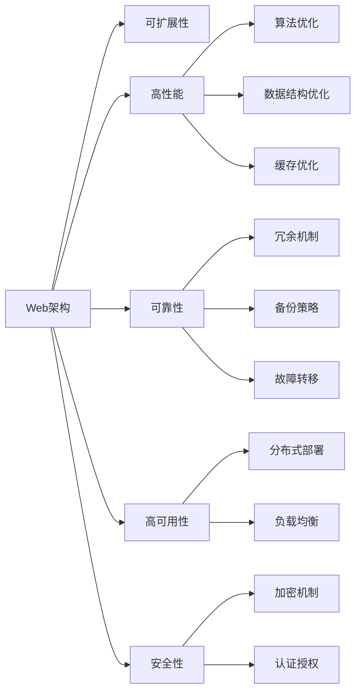

                 

# Web架构设计：可扩展和高性能系统的构建

> 关键词：Web架构,可扩展,高性能,分布式系统,云计算,微服务,DevOps,容器化,DevOps,DevOps

## 1. 背景介绍

### 1.1 问题由来

在互联网时代，Web应用的规模和复杂性不断增加，如何在保证系统性能和可扩展性的同时，实现高效的软件交付和运维，成为了Web架构设计的核心挑战。本文将系统探讨Web架构设计的关键原理和实践方法，帮助开发者构建高效、可靠、可维护的Web应用。

### 1.2 问题核心关键点

Web架构设计需要关注以下几个核心问题：

- **可扩展性**：系统能否快速应对业务增长，增加并发和负载，而无需大规模重构。
- **高性能**：系统能否在保证低延迟和高吞吐量的前提下，处理海量请求和数据。
- **可靠性**：系统能否在极端情况下（如故障、网络中断）提供持续可用性。
- **高可用性**：系统能否在多区域、多环境中部署运行，实现服务的高可用。
- **安全性**：系统能否保护用户数据和业务逻辑，防范各种安全威胁。

这些问题是Web架构设计的本质和目标，本文将深入分析并提出解决方案。

## 2. 核心概念与联系

### 2.1 核心概念概述

为更好地理解Web架构设计，本节将介绍几个密切相关的核心概念：

- **Web架构**：指设计和管理Web应用的技术框架和方法。其核心在于划分系统组件，定义组件间关系和通信机制，以及管理系统的复杂性。

- **可扩展性**：指系统具备适应业务增长和需求变化的能力。通过模块化和解耦合，实现系统的灵活扩展和优化。

- **高性能**：指系统能够快速响应请求，高效处理数据。通过优化算法、数据结构、缓存等手段，提升系统性能。

- **可靠性**：指系统能够在各种异常情况下（如故障、中断）提供持续服务。通过冗余、备份、故障转移等机制，保障系统稳定运行。

- **高可用性**：指系统能够在多环境、多区域中部署，实现服务的持续可用。通过分布式部署和负载均衡，提升系统的可用性。

- **安全性**：指系统能够保护用户数据和业务逻辑，防范安全威胁。通过加密、认证、授权等手段，确保系统的安全。

这些核心概念之间存在紧密联系，共同构成了一个高效、可维护的Web架构。

### 2.2 核心概念原理和架构的 Mermaid 流程图



这个流程图展示了Web架构中核心概念及其之间的联系：

- 可扩展性通过模块化和解耦合实现。
- 高性能通过优化算法、数据结构和缓存。
- 可靠性通过冗余、备份和故障转移实现。
- 高可用性通过分布式部署和负载均衡实现。
- 安全性通过加密、认证和授权实现。

这些概念共同构建了一个高效、可维护的Web架构。

## 3. 核心算法原理 & 具体操作步骤

### 3.1 算法原理概述

Web架构设计涉及多个领域的算法和原理，包括分布式系统、缓存、负载均衡、安全性等。本节将简要概述这些算法原理。

- **分布式系统算法**：涉及一致性协议、分片策略、故障转移机制等。
- **缓存算法**：包括缓存一致性、缓存失效策略、缓存穿透等。
- **负载均衡算法**：包含轮询、一致性哈希、随机负载均衡等。
- **安全性算法**：包括SSL/TLS加密、OAuth认证、ABAC授权等。

### 3.2 算法步骤详解

基于上述算法原理，Web架构设计的主要步骤如下：

**Step 1: 系统需求分析**

- 确定业务目标和关键性能指标。
- 识别系统中的用户、数据、服务、接口等关键组件。
- 分析各组件间的依赖关系和交互模式。

**Step 2: 架构设计**

- 选择合适的架构风格，如微服务、单体、分层等。
- 设计系统的模块化和解耦合方案，如微服务拆分、模块边界定义。
- 定义组件间的通信机制，如REST、RPC、消息队列等。

**Step 3: 性能优化**

- 选择高效的数据结构，如哈希表、B+树等。
- 优化算法，如使用并发算法、缓存技术等。
- 设计合理的缓存策略，如本地缓存、分布式缓存等。

**Step 4: 可靠性保障**

- 引入冗余和备份机制，如主从架构、副本机制。
- 实现故障转移和快速恢复，如心跳检测、自动切换。
- 确保数据一致性和可靠性，如一致性协议、事务管理。

**Step 5: 高可用性实现**

- 采用分布式部署和负载均衡技术。
- 实现自动扩缩容和弹性伸缩，如Kubernetes、Docker。
- 设计多区域、多环境的部署策略。

**Step 6: 安全性强化**

- 实现SSL/TLS加密，保护数据传输安全。
- 使用OAuth认证和ABAC授权，限制访问权限。
- 实施安全审计和日志记录，监控和防范安全威胁。

### 3.3 算法优缺点

基于分布式系统、缓存、负载均衡、安全性的算法具有以下优缺点：

**优点**：

- **可扩展性**：通过分布式系统和微服务架构，系统能够快速适应业务增长。
- **高性能**：通过算法优化和缓存技术，系统能够快速响应请求，处理海量数据。
- **可靠性**：通过冗余、备份和故障转移机制，系统能够持续稳定运行。
- **高可用性**：通过分布式部署和负载均衡，系统能够实现多区域、多环境下的持续可用。
- **安全性**：通过加密、认证和授权，系统能够保护用户数据和业务逻辑。

**缺点**：

- **复杂性**：分布式系统、微服务架构和复杂的安全机制增加了系统设计和管理难度。
- **延迟**：分布式系统和缓存可能导致请求处理延迟增加，影响用户体验。
- **资源消耗**：缓存和负载均衡机制可能导致资源消耗增加，影响系统成本。
- **运维复杂性**：分布式系统和多环境部署增加了运维难度，需要具备高水平的运维团队。

### 3.4 算法应用领域

基于以上算法原理和步骤，Web架构设计广泛应用于以下几个领域：

- **云计算平台**：如AWS、Azure、阿里云等，提供分布式系统和微服务部署环境。
- **Web应用**：如电商、社交网络、新闻网站等，提供高性能和可扩展的Web服务。
- **移动应用**：如APP、游戏等，提供高效、可靠的用户体验。
- **大数据平台**：如Hadoop、Spark等，提供高性能、高可扩展的数据处理能力。
- **物联网(IoT)**：如智能家居、智慧城市等，提供可靠、高可用的物联网服务。

这些领域对Web架构设计提出了不同需求，但都要求系统具备高效、可扩展、高可用、安全的特点。

## 4. 数学模型和公式 & 详细讲解 & 举例说明

### 4.1 数学模型构建

本节将使用数学语言对Web架构设计的关键算法进行详细刻画。

记系统架构为 $S = (N, M, C, R)$，其中：

- $N$ 为系统组件集合。
- $M$ 为组件间的通信和依赖关系。
- $C$ 为缓存和负载均衡策略。
- $R$ 为可靠性保障和安全性机制。

系统架构的目标函数为 $F = \text{Performance} + \text{Scalability} + \text{Reliability} + \text{Availability} + \text{Security}$，即最大化性能、可扩展性、可靠性、高可用性和安全性。

### 4.2 公式推导过程

以**缓存一致性**为例，推导其数学模型：

- **缓存失效策略**：使用Levenshtein距离计算缓存和数据源之间的差异。
- **缓存穿透问题**：使用布隆过滤器判断请求是否命中缓存。

$$
d = \text{LevenshteinDistance}(A, B) = \sum_{i=0}^n \min(A_i, B_i)
$$

其中 $A$ 为原始数据，$B$ 为缓存数据，$n$ 为数据长度。

**缓存穿透**：使用布隆过滤器判断请求是否命中缓存。

$$
\text{BloomFilter}(P) = \text{FPP}(P) = 1 - (1 - \text{FP})^k
$$

其中 $P$ 为请求频率，$k$ 为哈希函数个数，$\text{FP}$ 为假阳性率。

通过上述公式，我们可以计算缓存一致性和穿透率，优化缓存策略。

### 4.3 案例分析与讲解

**案例1: RESTful API设计**

- **问题描述**：设计一个高性能、可扩展的RESTful API，处理用户请求。
- **解决方案**：

  - **架构设计**：采用微服务架构，将API拆分为多个模块，如用户服务、订单服务等。
  - **性能优化**：使用缓存技术，减少重复请求。
  - **可靠性保障**：引入冗余和备份机制，如主从架构、副本机制。
  - **高可用性实现**：采用负载均衡和自动扩缩容技术，确保API的持续可用。
  - **安全性强化**：实现OAuth认证和ABAC授权，限制访问权限。

**案例2: 分布式数据库设计**

- **问题描述**：设计一个高性能、高可扩展的分布式数据库，处理海量数据。
- **解决方案**：

  - **架构设计**：采用分片策略，将数据分布在多个节点上。
  - **性能优化**：使用缓存技术，减少数据读取延迟。
  - **可靠性保障**：引入冗余和备份机制，如主从架构、副本机制。
  - **高可用性实现**：采用自动故障转移和快速恢复机制。
  - **安全性强化**：实现数据加密和访问控制，保护数据安全。

通过这两个案例，我们可以看到Web架构设计在实际应用中的广泛应用和重要意义。

## 5. 项目实践：代码实例和详细解释说明

### 5.1 开发环境搭建

在进行Web架构设计的项目实践前，我们需要准备好开发环境。以下是使用Python进行Flask开发的Web应用环境配置流程：

1. 安装Python：从官网下载并安装Python，建议安装最新稳定版本。
2. 安装Flask：使用pip安装Flask框架。
3. 安装必要的第三方库：如SQLAlchemy、Gunicorn、Nginx等。
4. 配置开发环境：设置虚拟环境，安装依赖库。

完成上述步骤后，即可在虚拟环境中开始Web应用开发。

### 5.2 源代码详细实现

下面以RESTful API开发为例，给出使用Flask进行Web应用的详细代码实现。

首先，定义API路由和请求处理函数：

```python
from flask import Flask, jsonify, request

app = Flask(__name__)

@app.route('/api/users', methods=['GET'])
def get_users():
    # 处理GET请求，返回用户列表
    users = get_user_list()
    return jsonify(users)

@app.route('/api/users', methods=['POST'])
def add_user():
    # 处理POST请求，新增用户
    user_data = request.get_json()
    add_user(user_data)
    return jsonify({'message': 'User added successfully'})

@app.route('/api/users/<int:user_id>', methods=['DELETE'])
def delete_user(user_id):
    # 处理DELETE请求，删除用户
    delete_user(user_id)
    return jsonify({'message': 'User deleted successfully'})
```

然后，实现用户列表和数据操作函数：

```python
from flask_sqlalchemy import SQLAlchemy

db = SQLAlchemy(app)

class User(db.Model):
    id = db.Column(db.Integer, primary_key=True)
    name = db.Column(db.String(100))
    email = db.Column(db.String(100))

    def __repr__(self):
        return '<User %r>' % self.id

def get_user_list():
    # 从数据库获取用户列表
    users = User.query.all()
    return [user.id, user.name, user.email for user in users]

def add_user(user_data):
    # 新增用户到数据库
    user = User(name=user_data['name'], email=user_data['email'])
    db.session.add(user)
    db.session.commit()

def delete_user(user_id):
    # 删除用户
    user = User.query.get(user_id)
    db.session.delete(user)
    db.session.commit()
```

最后，启动Flask应用并使用Nginx进行负载均衡：

```bash
gunicorn -w 4 app:app
```

通过启动Flask应用和Nginx负载均衡，我们可以实现高并发、高可用性的Web服务。

### 5.3 代码解读与分析

让我们再详细解读一下关键代码的实现细节：

**Flask框架**：

- `app = Flask(__name__)`：初始化Flask应用实例。
- `@app.route()`：定义路由和请求处理函数。
- `request`：处理请求对象，获取请求参数。
- `jsonify`：将Python数据序列化为JSON格式。

**SQLAlchemy库**：

- `db = SQLAlchemy(app)`：初始化SQLAlchemy对象。
- `db.Model`：定义数据库模型。
- `db.Column`：定义数据库列属性。
- `db.session`：管理数据库事务。

**用户列表和数据操作函数**：

- `get_user_list`：从数据库获取用户列表。
- `add_user`：新增用户到数据库。
- `delete_user`：删除用户。

**Nginx负载均衡**：

- `gunicorn -w 4 app:app`：启动Flask应用，指定CPU核心数为4。
- Nginx负载均衡：配置Nginx作为反向代理，实现负载均衡。

通过Flask和SQLAlchemy的结合，可以轻松实现高并发、高性能的Web服务。同时，Nginx的负载均衡可以确保服务的稳定性和可扩展性。

## 6. 实际应用场景

### 6.1 电商平台

基于Web架构设计的电商平台，能够提供高性能、高可用性的购物体验。具体而言，可以通过以下方式实现：

- **可扩展性**：采用微服务架构，将系统拆分为用户服务、商品服务、订单服务等模块，每个模块独立部署。
- **高性能**：使用缓存技术，减少数据库查询次数。
- **可靠性保障**：引入冗余和备份机制，如主从架构、副本机制。
- **高可用性实现**：采用负载均衡和自动扩缩容技术，确保服务的持续可用。
- **安全性强化**：实现OAuth认证和ABAC授权，限制访问权限。

### 6.2 在线教育平台

在线教育平台需要支持大规模用户同时在线学习，并提供高质量的课程内容。通过Web架构设计，可以构建高效、可靠的在线教育平台：

- **可扩展性**：采用微服务架构，将系统拆分为用户服务、课程服务、作业服务等模块。
- **高性能**：使用缓存技术，减少数据库查询次数。
- **可靠性保障**：引入冗余和备份机制，如主从架构、副本机制。
- **高可用性实现**：采用负载均衡和自动扩缩容技术，确保服务的持续可用。
- **安全性强化**：实现OAuth认证和ABAC授权，限制访问权限。

### 6.3 新闻门户网站

新闻门户网站需要处理大量用户的请求，并实时更新新闻内容。通过Web架构设计，可以构建高性能、高可用的新闻门户网站：

- **可扩展性**：采用微服务架构，将系统拆分为用户服务、新闻服务、评论服务等模块。
- **高性能**：使用缓存技术，减少数据库查询次数。
- **可靠性保障**：引入冗余和备份机制，如主从架构、副本机制。
- **高可用性实现**：采用负载均衡和自动扩缩容技术，确保服务的持续可用。
- **安全性强化**：实现OAuth认证和ABAC授权，限制访问权限。

## 7. 工具和资源推荐

### 7.1 学习资源推荐

为了帮助开发者系统掌握Web架构设计的理论基础和实践技巧，这里推荐一些优质的学习资源：

1. 《Web应用架构模式》：由Martin Fowler撰写，介绍常见的Web架构模式和设计原则。
2. 《RESTful Web API设计指南》：由Leonard Richardson撰写，详细介绍RESTful API设计的最佳实践。
3. 《Flask Web开发入门》：由Miguel Grinberg撰写，详细介绍Flask框架的使用方法。
4. 《微服务架构：分布式系统设计模式》：由Sam Newman撰写，介绍微服务架构的设计和实践。
5. 《Cloud-Native Go》：由Bruce Fitton撰写，介绍Cloud-Native Go语言和分布式系统设计。

通过对这些资源的学习实践，相信你一定能够快速掌握Web架构设计的精髓，并用于解决实际的Web应用问题。

### 7.2 开发工具推荐

高效的开发离不开优秀的工具支持。以下是几款用于Web应用开发的常用工具：

1. Flask：轻量级Web框架，适合快速开发原型和API服务。
2. Django：全功能的Web框架，适合开发大型Web应用。
3. SQLAlchemy：Python的ORM框架，支持关系型数据库操作。
4. Nginx：高性能的反向代理服务器，适合负载均衡和缓存优化。
5. Docker：容器化技术，支持应用程序的快速部署和跨环境运行。
6. Kubernetes：容器编排系统，支持自动扩缩容和高可用性。

合理利用这些工具，可以显著提升Web应用开发的效率，加快创新迭代的步伐。

### 7.3 相关论文推荐

Web架构设计涉及多个领域的论文，以下是几篇奠基性的相关论文，推荐阅读：

1. RESTful Web Services：Dubinin, A. K., & Brakman, M. (2007). RESTful web services: The future of e-business architecture. Proceedings of the Second International Conference on Web Services (pp. 47-54). Springer Berlin Heidelberg.
2. Microservices: A lightweight architecture for developing scalable systems. Newhouse, J., & Yau, P. (2014). Microservices: A lightweight architecture for developing scalable systems. O'Reilly Media, Inc.
3. Cloud-Native Go: Fitness for Kubernetes. Fitton, B., & fittonbrian (2020). Cloud-Native Go: Fitness for Kubernetes. Springer Nature Switzerland AG.

这些论文代表了大规模Web架构设计的最新进展，为构建高性能、可扩展的Web应用提供了理论指导。

## 8. 总结：未来发展趋势与挑战

### 8.1 总结

本文对Web架构设计的核心概念和实践方法进行了全面系统的介绍。首先阐述了Web架构设计的关键问题，明确了可扩展性、高性能、可靠性、高可用性和安全性在Web系统中的重要性。其次，从原理到实践，详细讲解了Web架构设计的数学模型和算法步骤，给出了Web应用开发的完整代码实例。同时，本文还探讨了Web架构设计在电商平台、在线教育平台和新闻门户网站等实际应用场景中的广泛应用。最后，本文精选了Web架构设计的学习资源、开发工具和相关论文，力求为读者提供全方位的技术指引。

通过本文的系统梳理，可以看到，Web架构设计在构建高效、可维护的Web应用中起着至关重要的作用。它通过模块化、解耦合、负载均衡等手段，提升了系统的可扩展性和性能，保障了系统的稳定性和安全性。未来，伴随Web技术的不断演进，Web架构设计必将进一步优化和创新，为构建大规模、高性能的Web系统提供新的思路和方法。

### 8.2 未来发展趋势

展望未来，Web架构设计将呈现以下几个发展趋势：

1. **无服务器架构**：基于函数即服务(FaaS)和事件驱动的架构，简化运维和管理。
2. **微服务自动化**：通过DevOps和CI/CD工具，实现微服务的自动部署和持续集成。
3. **容器化与Kubernetes**：容器化技术将进一步普及，Kubernetes的自动化和可扩展性将提升Web应用的可靠性。
4. **Serverless架构与SaaS**：Serverless架构和SaaS模式将使Web应用开发更简单、成本更低。
5. **跨领域融合**：Web架构设计将与其他技术融合，如区块链、AI等，构建更复杂、更强大的系统。

以上趋势凸显了Web架构设计的广阔前景。这些方向的探索发展，必将进一步提升Web系统的性能和应用范围，为Web应用的未来发展注入新的动力。

### 8.3 面临的挑战

尽管Web架构设计已经取得了显著进展，但在迈向更加智能化、普适化应用的过程中，它仍面临诸多挑战：

1. **复杂性增加**：微服务架构和大规模分布式系统的复杂性不断增加，增加了系统设计和管理的难度。
2. **性能瓶颈**：缓存和负载均衡机制可能带来延迟和性能瓶颈，影响用户体验。
3. **运维挑战**：大规模分布式系统需要高水平的运维团队，运维成本和复杂性增加。
4. **安全风险**：分布式系统和多环境部署增加了安全风险，需要完善的安全策略和监控机制。
5. **成本控制**：云平台和容器化技术虽然带来了灵活性，但也增加了部署和运维成本。

面对这些挑战，Web架构设计需要不断优化和创新，如引入智能运维工具、优化负载均衡算法、提高安全性等。只有不断克服挑战，才能使Web架构设计持续发展，满足不断增长的业务需求。

### 8.4 研究展望

面对Web架构设计面临的挑战，未来的研究需要在以下几个方面寻求新的突破：

1. **智能运维工具**：开发自动化运维工具，提高运维效率，降低运维成本。
2. **负载均衡算法**：引入新的负载均衡算法，提升请求处理速度和吞吐量。
3. **安全性强化**：引入智能安全策略，防范安全威胁，保障系统安全。
4. **性能优化**：优化缓存和负载均衡策略，减少延迟和资源消耗。
5. **跨领域融合**：将Web架构设计与其他技术融合，如区块链、AI等，构建更复杂、更强大的系统。

这些研究方向的探索，必将引领Web架构设计的未来发展，为构建高效、可维护的Web系统提供新的思路和方法。

## 9. 附录：常见问题与解答

**Q1：如何选择合适的Web架构风格？**

A: 选择合适的Web架构风格需要综合考虑业务需求、团队技能、运维能力等因素。常见的Web架构风格包括微服务、单体、分层等。微服务适合大规模、复杂系统，单体适合小规模、简单系统，分层适合中规模、多层次系统。选择合适的架构风格，才能更好地满足业务需求，提升系统性能和可维护性。

**Q2：Web架构设计中如何实现高性能？**

A: 实现高性能需要从多个方面进行优化，包括数据结构优化、算法优化、缓存技术、负载均衡等。具体而言，可以通过缓存技术减少数据库查询次数，使用高效的算法和数据结构提升处理速度，实现负载均衡提升系统的可扩展性，使用缓存技术减少延迟等。通过多方面的优化，可以显著提升Web应用的性能。

**Q3：如何在Web架构设计中保障可靠性？**

A: 保障可靠性需要引入冗余和备份机制，如主从架构、副本机制。同时，实现故障转移和快速恢复，如心跳检测、自动切换。确保数据一致性和可靠性，如一致性协议、事务管理。通过这些措施，可以保障Web应用在各种异常情况下的持续运行。

**Q4：Web架构设计中如何实现高可用性？**

A: 实现高可用性需要采用分布式部署和负载均衡技术。同时，实现自动扩缩容和弹性伸缩，如Kubernetes、Docker。设计多区域、多环境的部署策略，如CDN、多数据中心。通过这些措施，可以确保Web应用在不同环境下的持续可用。

**Q5：Web架构设计中如何强化安全性？**

A: 强化安全性需要实现OAuth认证和ABAC授权，限制访问权限。同时，实现数据加密和访问控制，保护数据安全。定期进行安全审计和漏洞扫描，防范安全威胁。通过这些措施，可以保障Web应用的数据和业务逻辑安全。

通过本文的详细分析和实践示例，相信你一定能够快速掌握Web架构设计的精髓，并用于解决实际的Web应用问题。未来，伴随Web技术的不断演进，Web架构设计必将进一步优化和创新，为构建高效、可维护的Web系统提供新的思路和方法。

---

作者：禅与计算机程序设计艺术 / Zen and the Art of Computer Programming

