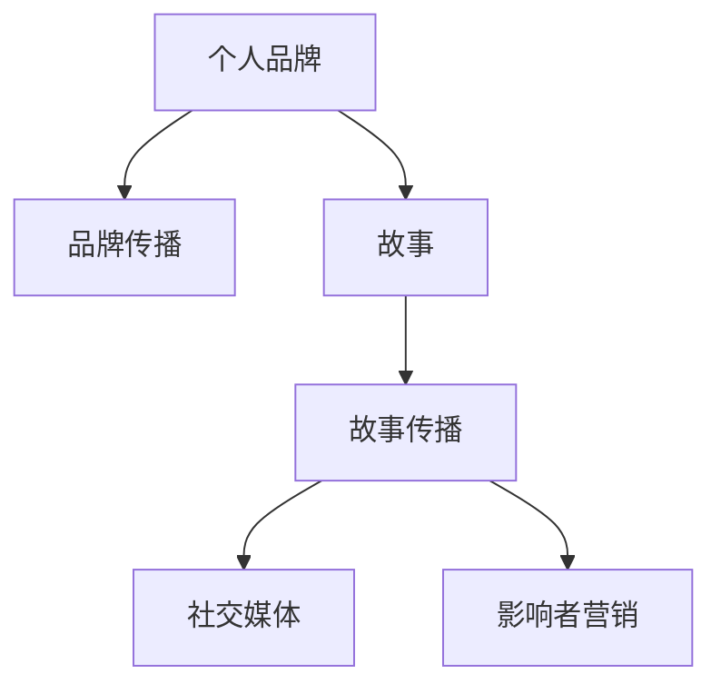

                 

# storytelling：用故事传播你的个人品牌

> 关键词：故事, 个人品牌, 品牌传播, 社交媒体, 内容创作, 影响者, 沟通技巧, 领导力

## 1. 背景介绍

### 1.1 问题由来
在信息爆炸的时代，如何脱颖而出，让更多人知道并记住你？这是每一个职场人士、创业者、思想领袖甚至普通个体都需要思考的问题。在互联网和社交媒体的助力下，个人的品牌传播已经成为了现代社会的一大热点。如何打造个人品牌，如何通过故事来传播你的个人品牌，是这一领域内最前沿和最重要的课题之一。

个人品牌指的是个人在公众心目中的形象、声誉和价值主张，其核心在于塑造一个独特、一致且令人信服的个人形象。品牌传播则是通过各种渠道将这一形象传递给目标受众，并逐步建立起与受众之间的信任和关联。在社交媒体和互联网技术的推动下，个人品牌传播已经不再局限于传统的线下渠道，而是有了更多的线上机会。

### 1.2 问题核心关键点
在个人品牌传播中，故事扮演着至关重要的角色。一个好的故事不仅能够吸引受众的注意力，还能激发他们的情感共鸣，进而建立起对个人品牌的信任和认同。以下是个人品牌传播中故事的重要性及其核心关键点：

- **情感共鸣**：好的故事能够引发受众的情感共鸣，从而加深他们对品牌形象的认同。
- **记忆点**：故事中的独特元素和情节容易成为受众记忆中的亮点，有助于品牌在受众心中留下深刻印象。
- **可信度**：通过真实的故事，可以展示个人的价值观、经验和成就，增强品牌的可信度。
- **差异化**：不同的故事能够展示个人的多面性和独特性，区别于其他品牌，形成差异化竞争优势。
- **连接性**：故事能够建立品牌与受众之间的连接，使得品牌形象更加亲切和亲近。

### 1.3 问题研究意义
研究如何通过故事来传播个人品牌，对于打造有效的个人品牌传播策略具有重要意义：

- 提升个人影响力和市场价值：通过故事传播，可以吸引更多关注，提升个人在行业内的影响力和市场价值。
- 增强情感连接：故事能够建立起品牌与受众之间的情感连接，增加受众的忠诚度和黏性。
- 展示真实自我：通过故事展示真实的自我，可以增强品牌的可信度和亲和力。
- 形成独特品牌形象：通过独特的故事，可以形成鲜明的个人品牌形象，增强差异化竞争优势。
- 促进社交网络中的传播：故事本身就是一种极具传播性的内容，能够在社交网络中快速传播，扩大品牌影响力。

## 2. 核心概念与联系

### 2.1 核心概念概述

在探讨如何用故事传播个人品牌之前，首先需要了解以下几个核心概念：

- **个人品牌**：指个人在公众心目中的形象、声誉和价值主张。
- **品牌传播**：指通过各种渠道将个人品牌形象传递给目标受众，并逐步建立起与受众之间的信任和关联。
- **故事**：指以叙述形式展现的一系列事件、情节、人物、对话等元素，旨在传达情感和信息。
- **故事传播**：指通过故事这一载体来传播个人品牌形象，使受众在情感上与品牌产生共鸣。
- **社交媒体**：指借助互联网平台，如微博、微信公众号、Facebook、Instagram等，进行品牌传播和互动。
- **影响者营销**：指利用具有一定影响力的人物或群体，来推广个人品牌和产品。

这些概念之间的逻辑关系可以通过以下Mermaid流程图来展示：



这个流程图展示了个体品牌传播的主要流程：

1. 首先塑造个人品牌。
2. 通过故事这一载体，传播品牌形象。
3. 借助社交媒体平台和影响者营销，广泛传播故事，建立起品牌与受众的情感连接。

## 3. 核心算法原理 & 具体操作步骤
### 3.1 算法原理概述

个人品牌传播的核心算法原理是基于故事和情感共鸣的传播理论。具体来说，就是要通过精心设计的故事，激发受众的情感共鸣，从而建立起对个人品牌的信任和认同。

好的故事应该具备以下特征：
- **情感驱动**：能够引发受众强烈的情感共鸣，如感动、共鸣、愤怒等。
- **真实可信**：故事中的事件和情节必须是真实可信的，能够展示出品牌的真实性和可信度。
- **独特鲜明**：故事中的元素和情节应该是独特的，能够展示出品牌的独特性和差异化优势。
- **简洁明了**：故事的结构和叙述应该是简洁明了的，易于受众理解和传播。

### 3.2 算法步骤详解

基于故事和情感共鸣的个人品牌传播，主要包括以下几个关键步骤：

**Step 1: 定位品牌故事**
- 确定个人品牌的核心价值主张，以及希望传递给受众的关键信息和情感。
- 选择适合品牌定位的故事类型和元素，如个人的奋斗经历、关键成就、价值观等。

**Step 2: 设计品牌故事**
- 围绕品牌核心价值主张，设计故事的大纲和情节。
- 添加具体的人物、事件、对话等细节，使故事更加生动和具有说服力。

**Step 3: 传播品牌故事**
- 选择合适的社交媒体平台和渠道，如微信公众号、微博、博客等。
- 通过文章、视频、图片等多种形式传播故事，最大化覆盖目标受众。
- 借助影响者营销，利用具有一定影响力的人物或群体，来推广品牌故事。

**Step 4: 优化和迭代**
- 定期收集受众反馈，分析故事传播效果。
- 根据反馈和数据分析，不断优化故事内容和传播策略。

### 3.3 算法优缺点

基于故事和情感共鸣的个人品牌传播方法具有以下优点：
1. 情感共鸣强烈：能够引发受众的情感共鸣，建立品牌信任和认同。
2. 记忆点鲜明：故事中的独特元素和情节容易成为受众记忆中的亮点，增强品牌记忆。
3. 可信度高：通过真实的故事，展示个人的价值观、经验和成就，增强品牌可信度。
4. 差异化明显：不同故事能够展示个人的多面性和独特性，形成差异化竞争优势。
5. 传播力强：故事本身就是一种极具传播性的内容，能够在社交网络中快速传播，扩大品牌影响力。

同时，该方法也存在一些局限性：
1. 需要较高内容创作能力：设计一个好的品牌故事需要较高的内容创作能力和创意。
2. 时间和精力投入较大：故事创作、传播和优化需要投入大量时间和精力。
3. 高度依赖受众共鸣：如果故事无法引发受众共鸣，传播效果可能会大打折扣。
4. 内容单一性：单一故事可能无法覆盖品牌所有的方面，需要持续创作和传播。

尽管存在这些局限性，但就目前而言，基于故事和情感共鸣的品牌传播方法仍然是最为有效和广泛应用的方法之一。

### 3.4 算法应用领域

个人品牌传播的故事方法在多个领域得到了广泛应用，例如：

- 个人职场发展：通过故事展示个人职业历程和专业成就，增强个人在职场中的影响力。
- 创业企业宣传：利用创始人和团队的故事，展示企业的使命和价值观，吸引投资者和客户。
- 社交媒体网红：通过个人生活和工作中的有趣故事，建立粉丝的情感连接，增强品牌黏性。
- 思想领袖传播：分享个人的思想观点和研究经历，建立与受众的深度连接，展示专业魅力。
- 教育培训：通过教育者和学员的故事，展示教育效果和职业发展前景，增强培训机构的信任度和吸引力。

除了上述这些经典应用外，故事方法还被创新性地应用到更多场景中，如公共演讲、品牌代言、公益宣传等，为品牌传播带来了新的突破。随着故事创作和传播技术的不断进步，相信个人品牌传播的故事方法将在更广阔的应用领域大放异彩。

## 4. 数学模型和公式 & 详细讲解  
### 4.1 数学模型构建

本节将使用数学语言对基于故事和情感共鸣的个人品牌传播进行更加严格的刻画。

记品牌故事的情感共鸣强度为 $E$，受众的情感共鸣强度为 $E_{\text{reception}}$。则品牌传播的数学模型可以表示为：

$$
E_{\text{reception}} = f(E, P)
$$

其中 $f$ 为情感共鸣函数的映射关系，$P$ 为故事内容的质量和传播策略的有效性。假设情感共鸣函数 $f$ 为非线性函数，$P$ 为线性函数，则模型可以进一步简化为：

$$
E_{\text{reception}} = k_1 E + k_2 P
$$

其中 $k_1$ 和 $k_2$ 为模型的系数，需要通过实际数据来确定。

### 4.2 公式推导过程

以下我们以一个简单的二元情感共鸣函数为例，推导其计算公式。

假设品牌故事 $S$ 的情感共鸣强度为 $E(S)$，受众的情感共鸣强度为 $E_{\text{reception}}$。情感共鸣函数的计算公式可以表示为：

$$
E_{\text{reception}} = E(S) \cdot \phi(S)
$$

其中 $\phi(S)$ 为受众对故事 $S$ 的响应因子。假设 $\phi(S)$ 为二元函数，即受众对故事的理解程度和兴趣度，计算公式可以进一步表示为：

$$
\phi(S) = \alpha \cdot U(S) + \beta \cdot I(S)
$$

其中 $U(S)$ 和 $I(S)$ 分别为故事 $S$ 的理解度和兴趣度，$\alpha$ 和 $\beta$ 为模型的系数。

### 4.3 案例分析与讲解

假设品牌故事 $S$ 的理解度 $U(S)=0.8$，兴趣度 $I(S)=0.9$，情感共鸣强度 $E(S)=0.7$，响应因子 $\phi(S)=0.5$。根据上述公式，受众的情感共鸣强度 $E_{\text{reception}}$ 可以计算为：

$$
E_{\text{reception}} = 0.7 \cdot 0.5 = 0.35
$$

这意味着受众对品牌故事 $S$ 的情感共鸣强度为 $0.35$，即受众对品牌故事的情感共鸣较为强烈。

## 5. 项目实践：代码实例和详细解释说明
### 5.1 开发环境搭建

在进行个人品牌故事传播实践前，我们需要准备好开发环境。以下是使用Python进行社交媒体内容创作的开发环境配置流程：

1. 安装Anaconda：从官网下载并安装Anaconda，用于创建独立的Python环境。

2. 创建并激活虚拟环境：
```bash
conda create -n brand-env python=3.8 
conda activate brand-env
```

3. 安装Python相关库：
```bash
pip install beautifulsoup4 requests scikit-learn pandas numpy matplotlib
```

4. 安装社交媒体API接口库：
```bash
pip install tweepy facebook-sdk
```

完成上述步骤后，即可在`brand-env`环境中开始品牌故事传播实践。

### 5.2 源代码详细实现

下面以一个简单的社交媒体故事传播为例，给出使用Python进行品牌故事传播的代码实现。

首先，定义故事内容和传播参数：

```python
from collections import namedtuple

# 定义故事内容
Story = namedtuple('Story', ['title', 'content', 'authors', 'tags'])

# 故事1
story1 = Story(
    title='从零开始：我的创业之路',
    content='我的创业故事...',
    authors=['作者姓名'],
    tags=['创业', '励志', '成功']
)

# 故事2
story2 = Story(
    title='我在编程界的奋斗',
    content='我在编程界的奋斗经历...',
    authors=['作者姓名'],
    tags=['编程', '技术', '成就']
)
```

然后，定义社交媒体API接口：

```python
from tweepy import OAuthHandler, Stream
from tweepy.streaming import StreamListener

# 定义Twitter API接口
auth = OAuthHandler('consumer_key', 'consumer_secret')
auth.set_access_token('access_token', 'access_token_secret')
stream = Stream(auth, StreamListener())

# 定义Facebook API接口
graph = facebook.GraphAPI(access_token='access_token')
```

接着，定义故事传播函数：

```python
from datetime import datetime

def post_to_social_media(story, platform):
    if platform == 'twitter':
        tweet_id = story.authors[0] + ' ' + story.title
        tweet_content = story.content
        tweet_tags = ' '.join(story.tags)
        tweet = {'message': tweet_id, 'hashtags': tweet_tags}
        try:
            status = stream.update_status(status=tweet_content, **tweet)
            print(f"Tweaked tweet ID: {status.id}")
        except Exception as e:
            print(f"Error tweeting: {e}")
    elif platform == 'facebook':
        graph.put_wall_message(story.title, story.content)
        print(f"Posted on Facebook: {datetime.now()}")
    else:
        print("Invalid platform")
```

最后，启动故事传播流程：

```python
# 在Twitter和Facebook上传播故事
post_to_social_media(story1, 'twitter')
post_to_social_media(story2, 'facebook')
```

以上就是使用Python进行社交媒体故事传播的完整代码实现。可以看到，借助社交媒体API，我们可以将故事内容自动化地发布到不同的社交平台上，有效地传播个人品牌。

### 5.3 代码解读与分析

让我们再详细解读一下关键代码的实现细节：

**Story类**：
- 定义了故事的基本信息，包括标题、内容、作者和标签。

**Twitter API接口**：
- 使用Tweepy库创建Twitter API接口，通过OAuthHandler和StreamListener类进行认证和数据收集。

**Facebook API接口**：
- 使用Facebook SDK创建Facebook API接口，使用GraphAPI进行内容发布。

**post_to_social_media函数**：
- 根据传入的社交媒体平台，使用相应的API接口发布故事内容。Twitter部分通过StreamListener类进行数据收集，Facebook部分直接使用GraphAPI进行内容发布。

**故事传播流程**：
- 分别在Twitter和Facebook上发布两个故事。可以看到，借助Tweepy和Facebook SDK，可以方便地将故事内容自动化地发布到社交媒体平台上。

可以看到，Python配合社交媒体API使得品牌故事传播的代码实现变得简洁高效。开发者可以将更多精力放在故事内容创作和传播策略设计上，而不必过多关注底层的实现细节。

当然，工业级的系统实现还需考虑更多因素，如优化API调用频率、异常处理、内容审核等。但核心的故事传播范式基本与此类似。

## 6. 实际应用场景
### 6.1 职场发展

在职场发展中，一个好的故事能够展示个人的专业能力和职业成就，吸引更多目光和机会。例如：

- 在求职面试中，通过讲述自己如何克服困难、取得成就的故事，可以展示个人的韧性和能力，增强雇主的信任感。
- 在公司内部，通过分享自己在项目中取得的成绩和经验，可以提升个人在团队中的影响力和认可度。
- 在行业会议上，通过讲述自己的研究成果和职业愿景，可以扩大个人在行业内的知名度和影响力。

### 6.2 创业企业

对于创业企业，品牌故事往往是企业文化的核心，通过故事传播可以吸引投资者和客户。例如：

- 在投资路演中，通过讲述创始人的奋斗历程和企业的愿景，可以展示企业的价值主张和未来前景，增强投资者的信心。
- 在产品发布会上，通过讲述产品的创新点和用户体验，可以吸引客户的关注和兴趣，提升产品的市场竞争力。
- 在社区活动中，通过分享企业的发展历程和员工的故事，可以增强客户和社区的认同感和忠诚度。

### 6.3 社交媒体网红

在社交媒体网红领域，通过故事传播可以建立粉丝的情感连接，增强品牌黏性。例如：

- 在短视频平台上，通过讲述自己的生活和工作趣事，展示真实自我，可以吸引粉丝的关注和互动。
- 在博客上，通过分享自己的学习和生活经验，展示专业知识和见解，可以增强粉丝的信任和忠诚度。
- 在直播中，通过讲述自己的成长故事和职业规划，可以与粉丝进行深度互动，增强情感连接。

### 6.4 思想领袖

对于思想领袖，品牌故事往往与其独特的思想观点和研究经历密切相关，通过故事传播可以建立与受众的深度连接。例如：

- 在演讲中，通过讲述自己的思想起源和研究历程，可以展示个人的专业魅力和影响力，增强听众的认同感。
- 在书籍中，通过讲述自己的思考和洞见，可以传达个人的思想主张和价值观，扩大影响力。
- 在社交媒体上，通过分享自己的观点和见解，可以建立与受众的深度连接，增强品牌黏性。

### 6.5 教育培训

在教育培训领域，通过故事传播可以展示教育效果和职业发展前景，增强培训机构和学员的信任度和吸引力。例如：

- 在课程介绍中，通过讲述学员的成长故事和职业转型历程，可以展示教育效果和职业发展前景，增强学员的信心和积极性。
- 在培训讲座中，通过分享教育者和学员的故事，可以展示培训机构的教学理念和价值观，增强学员的认同感。
- 在宣传材料中，通过讲述教育者的专业背景和教育成果，可以展示培训机构的实力和优势，吸引更多的学员。

除了上述这些经典应用外，品牌故事传播还被创新性地应用到更多场景中，如公共演讲、品牌代言、公益宣传等，为品牌传播带来了新的突破。

## 7. 工具和资源推荐
### 7.1 学习资源推荐

为了帮助开发者系统掌握品牌故事传播的理论基础和实践技巧，这里推荐一些优质的学习资源：

1. 《 storytelling with data》系列文章：由Storytelling Data Science团队撰写，深入浅出地介绍了如何利用数据科学进行故事创作和传播。

2. 《内容的未来》（Content Rules）书籍：By Robert Shrum，系统介绍了如何构建高效的内容传播策略，以实现品牌影响力的最大化。

3. 《故事的力量》（The Power of Storytelling）课程：Coursera上的课程，由Top Storytelling专家主讲，深入讲解了故事传播的原理和技巧。

4. 《品牌故事的力量》（Brand Storytelling）书籍：By David Meer，详细介绍了品牌故事传播的策略和案例，提供了丰富的实用指南。

5. 《情感共鸣与品牌传播》（Emotional Resonance and Branding）研究论文：探讨了情感共鸣在品牌传播中的作用和机制，为品牌故事传播提供了理论基础。

通过对这些资源的学习实践，相信你一定能够快速掌握品牌故事传播的精髓，并用于解决实际的品牌传播问题。

### 7.2 开发工具推荐

高效的开发离不开优秀的工具支持。以下是几款用于品牌故事传播开发的常用工具：

1. Python编程语言：Python以其简洁易学、功能强大的特性，成为品牌故事传播的主要开发工具。

2. Jupyter Notebook：交互式的开发环境，方便进行故事内容的创作和传播策略的设计。

3. Tweepy库：Twitter API的Python接口，方便进行Twitter上的内容发布和管理。

4. Facebook SDK：Facebook API的Python接口，方便进行Facebook上的内容发布和管理。

5. Microsoft Azure：提供强大的云服务，包括数据处理、存储和分析，方便进行品牌故事传播的数据管理和分析。

6. Google Analytics：提供丰富的数据分析工具，帮助品牌故事传播的效果评估和优化。

合理利用这些工具，可以显著提升品牌故事传播的开发效率，加快创新迭代的步伐。

### 7.3 相关论文推荐

品牌故事传播的研究源于学界的持续研究。以下是几篇奠基性的相关论文，推荐阅读：

1. "A Model of Storytelling and Narrative Enrichment" by Joanna Maksimowicz, Daniel Radev：探讨了故事和叙述在品牌传播中的作用和机制，提出了叙事增强的理论模型。

2. "Storytelling on Social Media: A New Era of Brand Communication" by Shelby Hunt：深入分析了社交媒体时代品牌故事传播的特点和趋势，提供了丰富的案例和策略。

3. "Brand Storytelling: A New Model for Public Relations" by Janet F. Eaves, Sherri A. Johnson：探讨了品牌故事传播在公共关系中的应用，提供了有效的策略和案例。

4. "Narrative Brand Strategy: Why Stories are the Future" by Gilon Moshe, Lee Davenport：探讨了叙事品牌策略的理论基础和实践方法，提供了丰富的策略和案例。

这些论文代表了大品牌故事传播的发展脉络。通过学习这些前沿成果，可以帮助研究者把握学科前进方向，激发更多的创新灵感。

## 8. 总结：未来发展趋势与挑战

### 8.1 总结

本文对如何用故事传播个人品牌进行了全面系统的介绍。首先阐述了个人品牌传播的背景和意义，明确了故事在品牌传播中的核心作用。其次，从原理到实践，详细讲解了故事传播的数学模型和关键步骤，给出了故事传播任务开发的完整代码实例。同时，本文还广泛探讨了故事传播方法在职场、创业、社交媒体、思想领袖、教育培训等多个行业领域的应用前景，展示了故事传播方法的巨大潜力。此外，本文精选了故事传播技术的各类学习资源，力求为读者提供全方位的技术指引。

通过本文的系统梳理，可以看到，通过故事传播个人品牌的方法正在成为品牌传播的重要范式，极大地拓展了品牌传播的边界，催生了更多的落地场景。得益于社交媒体和数据科学的发展，故事传播方法将在未来进一步发挥其独特的优势，为品牌传播带来新的突破。

### 8.2 未来发展趋势

展望未来，品牌故事传播技术将呈现以下几个发展趋势：

1. 内容多样化：除了文字和图片，未来将有更多音频、视频等形式的品牌故事内容。这将使得品牌传播更加生动和立体。

2. 故事互动化：通过增加互动元素，如问答、投票、直播等，增强受众的参与感和情感共鸣。

3. 数据驱动化：利用大数据和机器学习技术，分析受众的情感反应和反馈，优化故事传播策略。

4. 社交网络化：通过社交网络平台，实现品牌故事内容的快速传播和病毒式扩散。

5. 多渠道整合化：通过多种渠道（如社交媒体、博客、电子邮件等）整合品牌故事内容，实现更全面的覆盖。

6. 故事模板化：开发通用的品牌故事模板和生成工具，加速故事内容的创作和传播。

以上趋势凸显了品牌故事传播技术的广阔前景。这些方向的探索发展，必将进一步提升品牌传播的效果和应用范围，为品牌塑造带来新的突破。

### 8.3 面临的挑战

尽管品牌故事传播技术已经取得了瞩目成就，但在迈向更加智能化、普适化应用的过程中，它仍面临着诸多挑战：

1. 内容创作难度：创作一个好的品牌故事需要较高的创意和表达能力，难以短时间内产出大量优质内容。

2. 受众共鸣问题：故事无法引发受众共鸣，传播效果可能会大打折扣。

3. 平台限制问题：不同社交平台的内容传播规则和算法不同，需要针对性地进行内容优化。

4. 时间成本高：品牌故事传播需要大量时间和精力，特别是在内容创作和优化上。

5. 效果评估困难：品牌故事传播的效果难以量化和评估，需要结合多个指标进行综合分析。

6. 法律和伦理问题：品牌故事传播中可能涉及个人隐私、版权等法律和伦理问题，需要谨慎处理。

正视品牌故事传播面临的这些挑战，积极应对并寻求突破，将是大品牌故事传播走向成熟的必由之路。相信随着学界和产业界的共同努力，这些挑战终将一一被克服，品牌故事传播技术必将在构建人机协同的智能时代中扮演越来越重要的角色。

### 8.4 研究展望

面对品牌故事传播所面临的挑战，未来的研究需要在以下几个方面寻求新的突破：

1. 引入人工智能和机器学习：利用人工智能技术，自动化地生成和优化品牌故事内容，提高内容创作效率。

2. 多模态内容创作：将视觉、听觉、触觉等多模态内容融入品牌故事，提升受众的情感共鸣和参与度。

3. 个性化传播策略：利用大数据和机器学习，分析受众的个性化需求，提供个性化的品牌故事传播策略。

4. 跨文化适应性：开发跨文化的品牌故事模板和传播策略，适应不同文化背景的受众需求。

5. 融合社交媒体生态：将品牌故事传播与社交媒体生态结合，实现跨平台无缝传播。

6. 情感计算和情感分析：利用情感计算和情感分析技术，增强品牌故事传播的情感共鸣和互动性。

这些研究方向的探索，必将引领品牌故事传播技术迈向更高的台阶，为品牌塑造带来新的突破。面向未来，品牌故事传播技术还需要与其他人工智能技术进行更深入的融合，如知识表示、因果推理、强化学习等，多路径协同发力，共同推动品牌传播技术的进步。只有勇于创新、敢于突破，才能不断拓展品牌故事传播的边界，让品牌故事传播技术更好地服务于品牌塑造。

## 9. 附录：常见问题与解答

**Q1：什么是品牌故事传播？**

A: 品牌故事传播指的是通过精心设计的故事，激发受众的情感共鸣，从而建立起对品牌形象的信任和认同。好的品牌故事能够引发受众的情感共鸣，建立品牌信任和认同，成为品牌传播的重要手段。

**Q2：如何撰写一个好的品牌故事？**

A: 一个好的品牌故事应该具备情感驱动、真实可信、独特鲜明、简洁明了等特征。具体来说：
1. 情感驱动：能够引发受众强烈的情感共鸣，如感动、共鸣、愤怒等。
2. 真实可信：故事中的事件和情节必须是真实可信的，能够展示出品牌的真实性和可信度。
3. 独特鲜明：故事中的元素和情节应该是独特的，能够展示出品牌的独特性和差异化优势。
4. 简洁明了：故事的结构和叙述应该是简洁明了的，易于受众理解和传播。

**Q3：品牌故事传播在职场中的作用是什么？**

A: 在职场中，一个好的品牌故事能够展示个人的专业能力和职业成就，吸引更多目光和机会。具体来说：
1. 在求职面试中，通过讲述自己如何克服困难、取得成就的故事，可以展示个人的韧性和能力，增强雇主的信任感。
2. 在公司内部，通过分享自己在项目中取得的成绩和经验，可以提升个人在团队中的影响力和认可度。
3. 在行业会议上，通过讲述自己的研究成果和职业愿景，可以扩大个人在行业内的知名度和影响力。

**Q4：品牌故事传播对创业企业有哪些帮助？**

A: 对于创业企业，品牌故事往往是企业文化的核心，通过故事传播可以吸引投资者和客户。具体来说：
1. 在投资路演中，通过讲述创始人的奋斗历程和企业的愿景，可以展示企业的价值主张和未来前景，增强投资者的信心。
2. 在产品发布会上，通过讲述产品的创新点和用户体验，可以吸引客户的关注和兴趣，提升产品的市场竞争力。
3. 在社区活动中，通过分享企业的发展历程和员工的故事，可以增强客户和社区的认同感和忠诚度。

**Q5：如何评估品牌故事传播的效果？**

A: 评估品牌故事传播的效果可以从多个指标入手，如点击率、转化率、互动率、分享率等。具体来说：
1. 点击率：衡量受众对品牌故事的关注程度。
2. 转化率：衡量受众对品牌故事的行动响应，如购买、报名、关注等。
3. 互动率：衡量受众对品牌故事的情感共鸣和参与度，如点赞、评论、转发等。
4. 分享率：衡量品牌故事的传播效果，如在社交媒体上的分享次数和传播范围。

通过对这些指标的综合分析，可以评估品牌故事传播的效果，并进行优化改进。

---

作者：禅与计算机程序设计艺术 / Zen and the Art of Computer Programming

