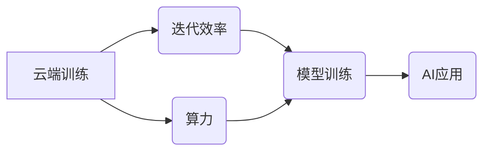

> 华为云、云端训练、算力、迭代效率、人工智能、深度学习、模型训练、分布式训练、优化算法

## 1. 背景介绍

人工智能（AI）技术近年来发展迅速，深度学习作为其核心驱动力，在图像识别、自然语言处理、语音识别等领域取得了突破性进展。然而，深度学习模型的训练需要海量数据和强大的计算资源，这成为AI技术发展面临的瓶颈之一。

云计算作为一种新型的计算模式，为深度学习提供了强大的算力支持。华为云作为国内领先的云计算平台，在AI领域投入巨大，构建了完善的云端训练生态系统，为开发者提供了一站式AI解决方案。

## 2. 核心概念与联系

**2.1 云端训练**

云端训练是指将深度学习模型的训练任务迁移到云计算平台进行执行。相比于本地训练，云端训练具有以下优势：

* **强大的算力:** 云计算平台拥有海量计算资源，可以支持大规模模型的训练。
* **灵活弹性:** 用户可以根据实际需求动态调整算力资源，避免资源浪费。
* **成本效益:** 云计算平台的按需付费模式可以降低用户的硬件成本。
* **便捷易用:** 云平台提供丰富的AI工具和服务，简化了模型训练流程。

**2.2 迭代效率**

迭代效率是指模型训练过程中，从数据输入到模型输出，完成一次训练循环所需要的时间。提高迭代效率可以显著缩短模型训练时间，加速AI应用的开发和部署。

**2.3 华为云端训练解决方案**

华为云为深度学习模型训练提供了多种解决方案，包括：

* **模型训练服务:** 提供预训练模型、训练框架和工具，简化模型训练流程。
* **分布式训练:** 支持模型在多个节点上并行训练，大幅提升训练速度。
* **算力调度:** 智能调度算力资源，优化训练效率。
* **数据管理:** 提供数据存储、处理和传输服务，保障数据安全和可用性。

**2.4 核心概念关系图**



## 3. 核心算法原理 & 具体操作步骤

**3.1 算法原理概述**

云端训练的核心算法原理主要包括：

* **分布式训练:** 将模型参数和数据分布到多个节点上，并行训练模型。
* **梯度同步:** 使用异步或同步的方式，将各节点计算出的梯度汇总到主节点，更新模型参数。
* **模型并行:** 将模型拆分成多个子模型，分别在不同的节点上训练，最后将子模型融合成完整模型。
* **数据并行:** 将训练数据分割到不同的节点上，每个节点训练一个子模型，最后将子模型融合成完整模型。

**3.2 算法步骤详解**

1. **数据预处理:** 将原始数据进行清洗、转换和特征工程，使其适合模型训练。
2. **模型初始化:** 初始化模型参数，通常使用随机初始化或预训练模型。
3. **数据分片:** 将训练数据分割到不同的节点上，每个节点负责训练一个子模型。
4. **模型并行训练:** 各节点分别训练自己的子模型，并计算梯度。
5. **梯度同步:** 使用异步或同步的方式，将各节点计算出的梯度汇总到主节点。
6. **参数更新:** 主节点根据汇总的梯度更新模型参数，并将更新后的参数广播到各个节点。
7. **模型评估:** 定期评估模型性能，并根据评估结果调整训练参数。
8. **模型融合:** 训练完成后，将各个节点训练的子模型融合成完整模型。

**3.3 算法优缺点**

**优点:**

* 训练速度更快，可以大幅缩短模型训练时间。
* 可以训练更大规模的模型，提升模型性能。
* 更加灵活和弹性，可以根据实际需求动态调整算力资源。

**缺点:**

* 算法实现复杂，需要专业的技术人员进行开发和维护。
* 需要考虑数据同步和模型融合的复杂性。
* 可能会出现数据不一致和模型训练不稳定等问题。

**3.4 算法应用领域**

分布式训练算法广泛应用于以下领域：

* **图像识别:** 训练大型图像识别模型，例如物体检测、图像分类和图像分割。
* **自然语言处理:** 训练大型语言模型，例如机器翻译、文本摘要和对话系统。
* **语音识别:** 训练大型语音识别模型，例如语音转文本和语音合成。
* **推荐系统:** 训练大型推荐模型，例如商品推荐和个性化内容推荐。

## 4. 数学模型和公式 & 详细讲解 & 举例说明

**4.1 数学模型构建**

假设我们有一个深度学习模型，其参数为θ，训练数据为{(x_i, y_i)}，其中x_i为输入数据，y_i为目标值。模型的损失函数为L(θ, {(x_i, y_i)}), 其目标是找到最优参数θ，使得损失函数最小化。

**4.2 公式推导过程**

使用梯度下降算法优化模型参数，其更新公式为：

$$
\theta = \theta - \eta \nabla_{\theta} L(\theta, {(x_i, y_i)})
$$

其中：

* η为学习率，控制参数更新的步长。
* ∇θL(θ, {(x_i, y_i)})为损失函数对参数θ的梯度。

**4.3 案例分析与讲解**

假设我们训练一个简单的线性回归模型，其损失函数为均方误差：

$$
L(\theta, {(x_i, y_i)}) = \frac{1}{n} \sum_{i=1}^{n} (y_i - \theta x_i)^2
$$

其中n为训练样本数量。

根据梯度下降算法，模型参数θ的更新公式为：

$$
\theta = \theta - \eta \frac{1}{n} \sum_{i=1}^{n} 2(y_i - \theta x_i) x_i
$$

通过迭代更新参数θ，模型可以逐渐逼近最优解，使得预测结果与真实值之间的误差最小化。

## 5. 项目实践：代码实例和详细解释说明

**5.1 开发环境搭建**

* 操作系统：Ubuntu 20.04
* 编程语言：Python 3.7
* 深度学习框架：TensorFlow 2.0
* 云计算平台：华为云

**5.2 源代码详细实现**

```python
import tensorflow as tf

# 定义模型
model = tf.keras.models.Sequential([
    tf.keras.layers.Dense(units=1, input_shape=[1])
])

# 定义损失函数和优化器
loss_fn = tf.keras.losses.MeanSquaredError()
optimizer = tf.keras.optimizers.Adam(learning_rate=0.01)

# 训练模型
for epoch in range(100):
    for x, y in train_data:
        with tf.GradientTape() as tape:
            predictions = model(x)
            loss = loss_fn(y, predictions)
        gradients = tape.gradient(loss, model.trainable_variables)
        optimizer.apply_gradients(zip(gradients, model.trainable_variables))
    print(f"Epoch {epoch+1}, Loss: {loss.numpy()}")

# 保存模型
model.save("linear_regression_model.h5")
```

**5.3 代码解读与分析**

* 代码首先定义了一个简单的线性回归模型，包含一个全连接层。
* 然后定义了均方误差损失函数和Adam优化器。
* 训练模型时，使用梯度下降算法迭代更新模型参数，直到损失函数收敛。
* 最后，将训练好的模型保存为文件。

**5.4 运行结果展示**

训练完成后，模型的损失函数值会逐渐降低，表明模型的预测性能逐渐提升。

## 6. 实际应用场景

**6.1 预测房价**

使用云端训练的深度学习模型，可以根据房屋的面积、位置、设施等特征，预测房价。

**6.2 股票预测**

使用云端训练的深度学习模型，可以分析股票市场数据，预测股票价格走势。

**6.3 医疗诊断**

使用云端训练的深度学习模型，可以分析医学影像数据，辅助医生进行疾病诊断。

**6.4 未来应用展望**

随着云计算技术的不断发展，云端训练将成为深度学习发展的主流模式。未来，云端训练将应用于更多领域，例如自动驾驶、机器人、个性化教育等，推动人工智能技术向更广泛的应用场景扩展。

## 7. 工具和资源推荐

**7.1 学习资源推荐**

* TensorFlow 官方文档：https://www.tensorflow.org/
* PyTorch 官方文档：https://pytorch.org/
* 深度学习课程：https://www.coursera.org/specializations/deep-learning

**7.2 开发工具推荐**

* Jupyter Notebook：https://jupyter.org/
* VS Code：https://code.visualstudio.com/

**7.3 相关论文推荐**

* Alex Krizhevsky, Ilya Sutskever, Geoffrey E. Hinton. ImageNet Classification with Deep Convolutional Neural Networks. NIPS, 2012.
* Ilya Sutskever, Oriol Vinyals, Quoc V. Le. Sequence to Sequence Learning with Neural Networks. NIPS, 2014.

## 8. 总结：未来发展趋势与挑战

**8.1 研究成果总结**

云端训练技术在近年来取得了显著进展，为深度学习模型的训练提供了强大的算力支持和灵活的部署方式。

**8.2 未来发展趋势**

* **模型规模的进一步扩大:** 未来，云端训练将支持训练更大规模的模型，提升模型性能。
* **训练效率的持续提升:** 研究人员将继续探索新的算法和技术，提高模型训练效率。
* **边缘计算与云端训练的融合:** 将边缘计算与云端训练相结合，实现模型在边缘设备上的部署和训练。

**8.3 面临的挑战**

* **数据安全和隐私保护:** 云端训练需要处理大量敏感数据，数据安全和隐私保护是一个重要的挑战。
* **模型可解释性和信任度:** 深度学习模型的决策过程往往难以解释，如何提高模型的可解释性和信任度是一个重要的研究方向。
* **算力成本控制:** 云端训练需要消耗大量的算力资源，如何控制算力成本是一个重要的挑战。

**8.4 研究展望**

未来，云端训练技术将继续发展，为人工智能技术的发展提供强大的支持。研究人员将继续探索新的算法、技术和应用场景，推动人工智能技术向更广泛的领域扩展。

## 9. 附录：常见问题与解答

**9.1 如何选择合适的云计算平台？**

选择云计算平台需要考虑以下因素：

* 算力资源：平台提供的算力资源是否满足您的需求。
* 价格：平台的收费模式和价格是否合理。
* 服务质量：平台的服务质量和可靠性如何。
* 安全性：平台的数据安全和隐私保护措施是否完善。

**9.2 如何进行云端训练模型的部署？**

云端训练模型的部署通常包括以下步骤：

* 将模型文件上传到云平台。
* 配置模型的运行环境。
* 部署模型服务，以便用户可以调用模型进行预测。

**9.3 如何优化云端训练模型的效率？**

优化云端训练模型的效率可以从以下几个方面入手：

* 使用分布式训练技术。
* 选择合适的优化算法和学习率。
* 优化模型结构和参数。
* 利用云平台提供的加速服务。


作者：禅与计算机程序设计艺术 / Zen and the Art of Computer Programming 
<end_of_turn>