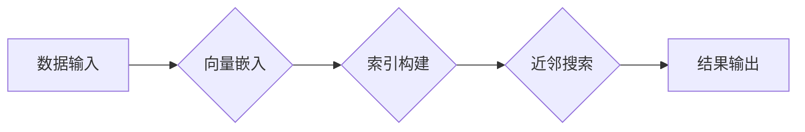

> 向量数据库、向量嵌入、相似性搜索、近邻搜索、机器学习、人工智能、知识图谱

## 1. 背景介绍

在人工智能（AI）的蓬勃发展中，数据成为了至关重要的资源。传统的数据库结构难以有效地处理海量文本、图像、音频等复杂数据，而向量数据库（Vector Stores）应运而生，为处理这些高维数据提供了全新的解决方案。

向量数据库的核心思想是将数据映射到高维向量空间中，并利用向量之间的相似性进行查询和检索。这种方法能够有效地捕捉数据的语义信息和结构特征，从而实现更精准、更智能的数据分析和应用。

近年来，随着深度学习技术的快速发展，向量嵌入技术取得了显著的进步。各种各样的预训练模型，例如BERT、GPT-3、DALL-E等，能够将文本、图像、音频等数据映射到高质量的向量空间中。这些向量嵌入为向量数据库的应用提供了强大的基础。

## 2. 核心概念与联系

**2.1 向量嵌入**

向量嵌入是指将数据映射到一个低维向量空间中的过程。每个数据点都对应一个唯一的向量，向量之间的距离或相似度反映了数据之间的语义关系。

**2.2 近邻搜索**

近邻搜索是指在高维向量空间中找到与给定向量最相似的向量。向量数据库的核心功能之一就是高效地进行近邻搜索。

**2.3 向量数据库架构**

向量数据库通常由以下几个主要部分组成：

* **索引结构:** 用于高效地存储和检索向量数据。常见的索引结构包括KD树、球树、HNSW等。
* **向量存储:** 用于存储向量数据。
* **查询引擎:** 用于处理用户查询并返回最相似的向量。

**2.4  Mermaid 流程图**



## 3. 核心算法原理 & 具体操作步骤

**3.1 算法原理概述**

向量数据库的核心算法原理是利用向量之间的相似性进行查询和检索。常用的相似性度量方法包括余弦相似度、欧氏距离等。

**3.2 算法步骤详解**

1. **数据预处理:** 将原始数据转换为向量嵌入。
2. **索引构建:** 将向量数据存储到索引结构中，以便高效地进行搜索。
3. **查询:** 用户输入查询向量，数据库根据索引结构快速找到与查询向量最相似的向量。
4. **结果返回:** 返回与查询向量最相似的向量及其相关信息。

**3.3 算法优缺点**

**优点:**

* 能够有效地处理海量数据。
* 能够捕捉数据的语义信息和结构特征。
* 能够实现精准、智能的数据分析和应用。

**缺点:**

* 向量嵌入的质量会影响搜索结果的准确性。
* 索引构建和查询过程可能需要消耗较多的计算资源。

**3.4 算法应用领域**

* **搜索引擎:** 提供更精准、更相关的搜索结果。
* **推荐系统:** 基于用户行为和兴趣推荐相关商品或内容。
* **知识图谱:** 建立和维护知识图谱，实现知识推理和问答。
* **图像识别:** 基于图像特征进行相似图像检索。
* **自然语言处理:** 基于文本语义进行文本相似度计算和分类。

## 4. 数学模型和公式 & 详细讲解 & 举例说明

**4.1 数学模型构建**

假设我们有一个数据集 D，包含 n 个数据点，每个数据点都对应一个向量 x_i ∈ R^d，其中 d 是向量的维度。

**4.2 公式推导过程**

常用的相似性度量方法之一是余弦相似度，定义如下：

$$
\text{cosine similarity}(x_i, x_j) = \frac{x_i \cdot x_j}{||x_i|| ||x_j||}
$$

其中：

* $x_i \cdot x_j$ 是向量 $x_i$ 和 $x_j$ 的点积。
* $||x_i||$ 和 $||x_j||$ 分别是向量 $x_i$ 和 $x_j$ 的 L2 范数。

余弦相似度表示两个向量的夹角余弦值，值域在 [-1, 1] 之间。

**4.3 案例分析与讲解**

假设我们有两个向量：

* $x_1 = [1, 2, 3]$
* $x_2 = [4, 5, 6]$

它们的点积为：

$$
x_1 \cdot x_2 = 1 \cdot 4 + 2 \cdot 5 + 3 \cdot 6 = 4 + 10 + 18 = 32
$$

它们的 L2 范数分别为：

$$
||x_1|| = \sqrt{1^2 + 2^2 + 3^2} = \sqrt{14}
$$

$$
||x_2|| = \sqrt{4^2 + 5^2 + 6^2} = \sqrt{77}
$$

因此，它们的余弦相似度为：

$$
\text{cosine similarity}(x_1, x_2) = \frac{32}{\sqrt{14} \cdot \sqrt{77}} \approx 0.92
$$

## 5. 项目实践：代码实例和详细解释说明

**5.1 开发环境搭建**

* Python 3.7+
* PyTorch 1.7+
* Faiss 1.7+

**5.2 源代码详细实现**

```python
import torch
from faiss import IndexFlatL2

# 数据预处理
data = torch.randn(100, 128)

# 构建索引结构
index = IndexFlatL2(128)
index.add(data.numpy())

# 查询
query = torch.randn(1, 128)
D, I = index.search(query.numpy(), k=10)

# 结果输出
print(I)
```

**5.3 代码解读与分析**

* 数据预处理：将原始数据转换为向量嵌入。
* 构建索引结构：使用 Faiss 库构建一个基于 L2 范数的索引结构。
* 查询：输入查询向量，使用索引结构进行近邻搜索，返回与查询向量最相似的 10 个向量及其距离。
* 结果输出：打印搜索结果，包括每个向量在索引中的索引号和与查询向量的距离。

**5.4 运行结果展示**

运行代码后，将输出一个包含 10 个索引号的数组，表示与查询向量最相似的 10 个向量在索引中的位置。

## 6. 实际应用场景

**6.1 搜索引擎**

向量数据库可以用于构建更精准、更智能的搜索引擎。例如，可以将网页内容转换为向量嵌入，并使用向量数据库进行相似性搜索，从而返回与用户查询最相关的网页结果。

**6.2 推荐系统**

向量数据库可以用于构建基于内容的推荐系统。例如，可以将商品描述转换为向量嵌入，并使用向量数据库进行相似性搜索，从而推荐与用户过去购买商品相似的商品。

**6.3 知识图谱**

向量数据库可以用于构建和维护知识图谱。例如，可以将实体和关系转换为向量嵌入，并使用向量数据库进行相似性搜索，从而发现知识图谱中的潜在关系和模式。

**6.4 未来应用展望**

随着人工智能技术的不断发展，向量数据库的应用场景将更加广泛。例如，可以用于个性化教育、医疗诊断、金融风险管理等领域。

## 7. 工具和资源推荐

**7.1 学习资源推荐**

* **书籍:**
    * 《Deep Learning》 by Ian Goodfellow, Yoshua Bengio, and Aaron Courville
    * 《The Hundred-Page Machine Learning Book》 by Andriy Burkov
* **在线课程:**
    * Coursera: Machine Learning by Andrew Ng
    * Udacity: Deep Learning Nanodegree

**7.2 开发工具推荐**

* **Faiss:** Facebook AI Similarity Search
* **Annoy:** Approximate Nearest Neighbors Oh Yeah
* **Milvus:** Open-Source Vector Database

**7.3 相关论文推荐**

* **Efficient Similarity Search with k-Nearest Neighbors** by Arya et al.
* **Approximate Nearest Neighbors Search with Hierarchical Navigable Small World Graphs** by Muja et al.
* **Milvus: A Vector Database for AI Applications** by Wang et al.

## 8. 总结：未来发展趋势与挑战

**8.1 研究成果总结**

向量数据库技术近年来取得了显著的进展，在处理海量数据、捕捉语义信息和实现精准搜索方面展现出强大的潜力。

**8.2 未来发展趋势**

* **更高效的索引结构:** 研究更有效的索引结构，以降低索引构建和查询的时间复杂度。
* **更强大的向量嵌入:** 开发更强大的预训练模型，生成更高质量的向量嵌入。
* **更丰富的应用场景:** 将向量数据库应用于更多领域，例如个性化教育、医疗诊断、金融风险管理等。

**8.3 面临的挑战**

* **数据规模和复杂性:** 海量数据的存储和处理仍然是一个挑战。
* **计算资源消耗:** 索引构建和查询过程可能需要消耗大量的计算资源。
* **模型可解释性:** 向量嵌入的生成过程通常是不可解释的，这可能会影响用户的信任度。

**8.4 研究展望**

未来，向量数据库技术将继续朝着更高效、更智能、更可解释的方向发展。


## 9. 附录：常见问题与解答

**9.1 如何选择合适的向量数据库？**

选择合适的向量数据库需要考虑以下因素：

* 数据规模
* 数据类型
* 查询频率
* 计算资源

**9.2 如何评估向量数据库的性能？**

常用的性能指标包括：

* 查询速度
* 准确率
* 召回率

**9.3 如何进行向量数据库的优化？**

可以从以下几个方面进行优化：

* 优化索引结构
* 优化向量嵌入
* 优化查询策略


作者：禅与计算机程序设计艺术 / Zen and the Art of Computer Programming 
<end_of_turn>