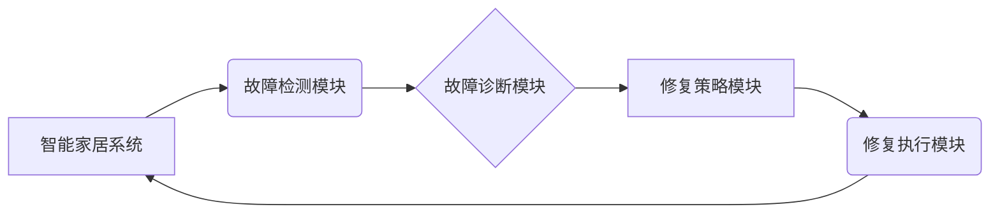

> 智能家居, 自我修复, Java, 软件架构, 算法, 数学模型, 项目实践

## 1. 背景介绍

智能家居已成为现代生活的重要组成部分，它通过网络连接各种智能设备，实现对家居环境的自动化控制和智能化管理。然而，智能家居系统也面临着复杂性和脆弱性的挑战。设备故障、网络中断、软件漏洞等问题可能会导致系统瘫痪，影响用户体验。因此，如何提高智能家居系统的可靠性和自愈能力成为一个重要的研究课题。

自我修复系统能够自动检测和修复系统故障，提高系统的稳定性和可用性。在智能家居领域，自我修复系统可以帮助用户解决设备故障、网络中断等问题，无需人工干预，从而提升用户体验和生活质量。

## 2. 核心概念与联系

### 2.1 智能家居系统架构

智能家居系统通常由以下几个主要部分组成：

* **智能设备:** 包括各种传感器、执行器、控制单元等，负责感知环境信息、执行控制指令和提供用户交互界面。
* **网络通信:** 用于连接智能设备，实现数据传输和控制指令的传递。
* **云平台:** 提供数据存储、分析、控制和管理服务，支持远程控制和智能化功能。
* **用户界面:** 用于用户与智能家居系统进行交互，例如手机APP、语音助手等。

### 2.2 自我修复系统架构

自我修复系统通常由以下几个主要部分组成：

* **故障检测模块:** 负责监控系统运行状态，检测设备故障、网络中断、软件漏洞等问题。
* **故障诊断模块:** 分析故障信息，确定故障原因和影响范围。
* **修复策略模块:** 根据故障类型和诊断结果，选择合适的修复策略。
* **修复执行模块:** 执行修复策略，例如重启设备、修复软件漏洞、重新连接网络等。

### 2.3  核心概念关系图



## 3. 核心算法原理 & 具体操作步骤

### 3.1  算法原理概述

自我修复系统的核心算法是基于机器学习和人工智能技术的故障检测、诊断和修复策略选择。

* **故障检测:** 利用传感器数据、设备日志和网络流量等信息，训练机器学习模型，识别异常行为和潜在故障。
* **故障诊断:** 基于故障检测结果，利用知识库和规则引擎，分析故障原因和影响范围。
* **修复策略选择:** 根据故障类型和诊断结果，选择最合适的修复策略，例如重启设备、修复软件漏洞、重新连接网络等。

### 3.2  算法步骤详解

1. **数据采集:** 收集智能家居系统运行数据，包括传感器数据、设备日志、网络流量等。
2. **数据预处理:** 对采集到的数据进行清洗、转换和特征提取，以便于机器学习模型的训练。
3. **模型训练:** 利用机器学习算法，训练故障检测、故障诊断和修复策略选择模型。
4. **故障检测:** 将实时运行数据输入到故障检测模型，识别潜在故障。
5. **故障诊断:** 将故障检测结果输入到故障诊断模型，分析故障原因和影响范围。
6. **修复策略选择:** 将故障类型和诊断结果输入到修复策略选择模型，选择最合适的修复策略。
7. **修复执行:** 执行选择的修复策略，例如重启设备、修复软件漏洞、重新连接网络等。
8. **结果评估:** 评估修复效果，并反馈到模型训练中，不断优化模型性能。

### 3.3  算法优缺点

**优点:**

* 自动化修复，提高系统可靠性和可用性。
* 减少人工干预，降低维护成本。
* 适应性强，能够应对各种类型的故障。

**缺点:**

* 需要大量的训练数据和计算资源。
* 模型训练和部署成本较高。
* 复杂性高，需要专业的技术人员进行开发和维护。

### 3.4  算法应用领域

自我修复算法在智能家居、工业控制、医疗设备等领域都有广泛的应用前景。

## 4. 数学模型和公式 & 详细讲解 & 举例说明

### 4.1  数学模型构建

为了描述智能家居系统中的自我修复过程，我们可以构建一个状态转移模型。

* **状态:** 智能家居系统可以处于不同的状态，例如正常运行、故障状态、修复中等。
* **转移概率:** 状态之间的转移概率取决于系统运行环境、设备故障率、网络稳定性等因素。

我们可以用一个状态转移矩阵来表示系统状态的转移概率。例如，一个简单的状态转移矩阵如下：

```
状态转移矩阵:
[ 0.9  0.05  0.05 ]
[ 0.1  0.8  0.1 ]
[ 0.05 0.1  0.85 ]
```

其中，第一行表示正常运行状态的转移概率，第二行表示故障状态的转移概率，第三行表示修复中的转移概率。

### 4.2  公式推导过程

我们可以利用状态转移矩阵和马尔可夫链理论，推导智能家居系统在不同时间段内处于不同状态的概率分布。

例如，我们可以计算智能家居系统在t时刻处于故障状态的概率，公式如下：

$$P(故障状态, t) = \sum_{i=1}^{n} P(故障状态, t|状态i, t-1) * P(状态i, t-1)$$

其中，n表示系统可能的初始状态数。

### 4.3  案例分析与讲解

假设智能家居系统初始状态为正常运行，故障状态的转移概率为0.05，修复状态的转移概率为0.1。我们可以利用上述公式，计算智能家居系统在不同时间段内处于不同状态的概率分布。

例如，我们可以计算智能家居系统在1小时、2小时、3小时后处于故障状态的概率。

## 5. 项目实践：代码实例和详细解释说明

### 5.1  开发环境搭建

* 操作系统: Ubuntu 20.04 LTS
* JDK: OpenJDK 17
* IDE: Eclipse IDE for Java Developers

### 5.2  源代码详细实现

```java
// 故障检测模块
public class FaultDetectionModule {

    public boolean detectFault(SensorData sensorData) {
        // 利用机器学习模型检测故障
        // ...
    }
}

// 故障诊断模块
public class FaultDiagnosisModule {

    public String diagnoseFault(FaultDetectionResult faultDetectionResult) {
        // 利用知识库和规则引擎诊断故障
        // ...
    }
}

// 修复策略模块
public class RepairStrategyModule {

    public RepairStrategy selectRepairStrategy(String faultType) {
        // 根据故障类型选择修复策略
        // ...
    }
}

// 修复执行模块
public class RepairExecutionModule {

    public void executeRepairStrategy(RepairStrategy repairStrategy) {
        // 执行修复策略
        // ...
    }
}
```

### 5.3  代码解读与分析

* 故障检测模块利用机器学习模型分析传感器数据，识别潜在故障。
* 故障诊断模块利用知识库和规则引擎分析故障信息，确定故障原因和影响范围。
* 修复策略模块根据故障类型选择合适的修复策略。
* 修复执行模块执行选择的修复策略，例如重启设备、修复软件漏洞、重新连接网络等。

### 5.4  运行结果展示

通过运行上述代码，我们可以模拟智能家居系统中的自我修复过程。例如，当传感器检测到设备故障时，系统会自动触发故障检测、故障诊断和修复策略选择过程，最终执行相应的修复策略，恢复系统正常运行。

## 6. 实际应用场景

### 6.1 智能家居设备故障修复

当智能家居设备出现故障时，例如灯光无法正常工作、空调无法启动等，自我修复系统可以自动检测故障原因，并执行相应的修复策略，例如重启设备、更新固件、修复软件漏洞等，从而避免用户手动操作，提高用户体验。

### 6.2 网络中断自动恢复

当智能家居系统网络中断时，自我修复系统可以自动检测网络状态，并尝试重新连接网络，例如重启路由器、重新配置网络参数等，从而恢复系统正常运行。

### 6.3 软件漏洞自动修复

当智能家居系统发现软件漏洞时，自我修复系统可以自动下载并安装补丁，修复漏洞，从而提高系统安全性。

### 6.4 未来应用展望

随着人工智能技术的不断发展，自我修复系统将能够更加智能化、自动化和可靠化。未来，自我修复系统将能够应用于更广泛的领域，例如工业控制、医疗设备、交通系统等，提高系统的可靠性和安全性。

## 7. 工具和资源推荐

### 7.1 学习资源推荐

* **书籍:**
    * 《人工智能：一种现代方法》
    * 《机器学习》
    * 《深度学习》
* **在线课程:**
    * Coursera: 人工智能课程
    * edX: 机器学习课程
    * Udacity: 深度学习课程

### 7.2 开发工具推荐

* **IDE:** Eclipse IDE for Java Developers, IntelliJ IDEA
* **机器学习框架:** TensorFlow, PyTorch, scikit-learn
* **云平台:** AWS, Azure, Google Cloud Platform

### 7.3 相关论文推荐

* **论文:**
    * Self-Healing Systems: A Survey
    * Towards Self-Healing Software Systems
    * Self-Healing in Cloud Computing

## 8. 总结：未来发展趋势与挑战

### 8.1 研究成果总结

本文介绍了基于Java的智能家居设计，重点阐述了自我修复系统的核心概念、算法原理、代码实现以及实际应用场景。

### 8.2 未来发展趋势

* **更智能化的自我修复算法:** 利用更先进的人工智能技术，例如深度学习、强化学习等，开发更智能化的自我修复算法，提高系统的自适应性和故障修复能力。
* **更完善的故障诊断机制:** 建立更完善的故障诊断机制，能够更准确地识别故障原因和影响范围，从而选择更有效的修复策略。
* **更安全的自我修复系统:** 加强自我修复系统的安全性，防止恶意攻击和数据泄露。

### 8.3 面临的挑战

* **数据获取和标注:** 训练自我修复算法需要大量的真实数据，获取和标注这些数据是一个挑战。
* **模型复杂性和部署成本:** 自我修复算法通常比较复杂，部署成本较高。
* **伦理和安全问题:** 自我修复系统可能会涉及到隐私和安全问题，需要进行伦理和安全方面的研究和规范。

### 8.4 研究展望

未来，我们将继续研究和开发更智能、更可靠、更安全的自我修复系统，为智能家居和其他领域提供更优质的服务。

## 9. 附录：常见问题与解答

### 9.1  Q1: 自我修复系统是否会完全取代人工维护？

**A1:** 自我修复系统可以大大减少人工维护的 workload，但并不会完全取代人工维护。一些复杂的问题仍然需要人工干预。

### 9.2  Q2: 自我修复系统是否会带来新的安全风险？

**A2:** 自我修复系统可能会带来新的安全风险，例如恶意攻击和数据泄露。因此，需要加强自我修复系统的安全性，防止这些风险。

### 9.3  Q3: 自我修复系统如何保证数据的隐私和安全？

**A3:** 自我修复系统需要采用相应的技术措施，例如数据加密、访问控制等，保证数据的隐私和安全。

作者：禅与计算机程序设计艺术 / Zen and the Art of Computer Programming


<end_of_turn>