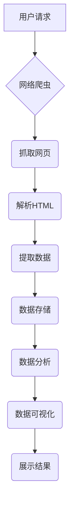

>  新浪微博、用户信息爬取、Python、数据分析、网络爬虫、BeautifulSoup、requests、数据可视化

## 1. 背景介绍

在当今信息爆炸的时代，社交媒体平台已成为人们获取信息、交流互动的重要渠道。新浪微博作为中国最大的社交媒体平台之一，拥有庞大的用户群体和海量的用户数据。这些数据蕴含着丰富的社会、文化和商业价值，对其进行有效分析可以帮助我们深入了解用户行为、市场趋势和社会热点。

然而，新浪微博官方API对数据获取有一定的限制，无法满足对大规模数据爬取和分析的需求。因此，基于网络爬虫技术进行新浪微博用户信息爬取与分析成为了一个重要的研究方向。

## 2. 核心概念与联系

**2.1 网络爬虫**

网络爬虫（Web Crawler）是一种自动访问和抓取网页内容的软件程序。它通过模拟用户的浏览器行为，访问网页并下载其HTML代码，然后解析HTML代码，提取所需信息。

**2.2 BeautifulSoup**

BeautifulSoup是一个用于解析HTML和XML文档的Python库。它提供了一系列方法，可以方便地查找、提取和修改文档中的元素和属性。

**2.3 requests**

requests是一个用于发送HTTP请求的Python库。它提供了简单易用的API，可以方便地发送GET、POST等各种类型的请求。

**2.4 数据分析**

数据分析是指对数据进行收集、整理、分析和解释的过程，以从中发现规律、趋势和洞察。

**2.5 数据可视化**

数据可视化是指将数据以图形、图表等形式呈现出来，以帮助人们更直观地理解和分析数据。

**2.6 Mermaid 流程图**



## 3. 核心算法原理 & 具体操作步骤

### 3.1  算法原理概述

新浪微博用户信息爬取与分析的算法原理主要包括以下几个步骤：

1. **目标用户定位:** 确定需要爬取的用户类型和数量。
2. **网页抓取:** 使用网络爬虫技术抓取目标用户的微博页面。
3. **HTML解析:** 使用BeautifulSoup库解析抓取到的HTML代码，提取用户信息。
4. **数据存储:** 将提取到的用户信息存储到数据库或文件。
5. **数据分析:** 对存储的用户数据进行分析，例如用户性别、年龄、兴趣爱好等。
6. **数据可视化:** 使用数据可视化工具将分析结果以图表、图形等形式呈现出来。

### 3.2  算法步骤详解

1. **目标用户定位:**

   - 可以根据用户ID、用户名、关注者数量等条件进行定位。
   - 可以使用新浪微博API获取用户列表，并筛选出符合条件的用户。

2. **网页抓取:**

   - 使用requests库发送HTTP请求，访问目标用户的微博页面。
   - 设置爬虫的爬取策略，例如爬取频率、抓取深度等。

3. **HTML解析:**

   - 使用BeautifulSoup库解析抓取到的HTML代码。
   - 使用CSS选择器或其他方法查找并提取用户信息，例如用户名、头像、性别、生日等。

4. **数据存储:**

   - 将提取到的用户信息存储到数据库或文件。
   - 选择合适的数据库或文件格式，例如CSV、JSON、MongoDB等。

5. **数据分析:**

   - 使用Python的NumPy、Pandas等数据分析库对用户数据进行分析。
   - 可以计算用户特征的统计量，例如平均年龄、性别比例等。
   - 可以使用机器学习算法对用户数据进行分类或聚类。

6. **数据可视化:**

   - 使用Python的Matplotlib、Seaborn等数据可视化库将分析结果以图表、图形等形式呈现出来。
   - 可以绘制用户分布图、用户特征分布图等。

### 3.3  算法优缺点

**优点:**

- 可以获取新浪微博用户的大量数据。
- 可以对用户数据进行深入分析，发现隐藏的规律和趋势。
- 可以使用数据可视化工具，直观地展示分析结果。

**缺点:**

- 爬虫技术可能会被新浪微博封禁。
- 数据爬取和分析需要一定的技术能力。
- 数据的准确性和完整性需要进行验证。

### 3.4  算法应用领域

- **市场营销:** 分析用户兴趣爱好，精准投放广告。
- **社会研究:** 研究用户行为、舆情趋势等。
- **用户画像:** 建立用户画像，提供个性化服务。
- **风险控制:** 识别潜在的风险用户。

## 4. 数学模型和公式 & 详细讲解 & 举例说明

### 4.1  数学模型构建

在新浪微博用户信息爬取与分析中，我们可以使用一些数学模型来描述用户行为和数据分布。例如：

- **用户活跃度模型:** 可以使用泊松分布来描述用户在特定时间段内的微博发布频率。
- **用户兴趣模型:** 可以使用词频统计或主题模型来分析用户的兴趣爱好。
- **用户关系模型:** 可以使用图论模型来描述用户的社交关系。

### 4.2  公式推导过程

例如，我们可以使用泊松分布来描述用户在特定时间段内的微博发布频率。泊松分布的概率质量函数为：

$$P(X=k) = \frac{e^{-\lambda} \lambda^k}{k!}$$

其中：

- $X$ 是用户在特定时间段内的微博发布次数。
- $k$ 是微博发布次数的具体值。
- $\lambda$ 是用户平均微博发布频率。

### 4.3  案例分析与讲解

假设我们对某个用户进行分析，发现其在过去一个月内平均每天发布 3 条微博。我们可以使用泊松分布来计算该用户在未来一天内发布 5 条微博的概率：

$$P(X=5) = \frac{e^{-3} 3^5}{5!} \approx 0.1008$$

因此，该用户在未来一天内发布 5 条微博的概率约为 10.08%。

## 5. 项目实践：代码实例和详细解释说明

### 5.1  开发环境搭建

- Python 3.x
- pip 安装 BeautifulSoup4、requests、pandas、matplotlib 等库

```bash
pip install beautifulsoup4 requests pandas matplotlib
```

### 5.2  源代码详细实现

```python
import requests
from bs4 import BeautifulSoup
import pandas as pd

def get_user_info(url):
    response = requests.get(url)
    response.raise_for_status()  # 检查请求是否成功

    soup = BeautifulSoup(response.content, 'html.parser')
    user_name = soup.find('a', class_='WB_frame_inner').text
    user_avatar = soup.find('img', class_='face')["src"]
    # ... 提取其他用户信息

    return user_name, user_avatar

# ... 获取目标用户列表
user_urls = ['https://weibo.com/u/1234567890', 'https://weibo.com/u/9876543210', ...]

user_data = []
for url in user_urls:
    user_name, user_avatar = get_user_info(url)
    user_data.append({'user_name': user_name, 'user_avatar': user_avatar})

df = pd.DataFrame(user_data)
print(df)
```

### 5.3  代码解读与分析

- 该代码首先定义了一个 `get_user_info` 函数，用于获取目标用户的基本信息，例如用户名和头像地址。
- 然后，获取目标用户的微博页面URL列表。
- 循环遍历URL列表，调用 `get_user_info` 函数获取用户信息，并存储到一个列表中。
- 最后，将用户信息列表转换为 Pandas DataFrame，并打印出来。

### 5.4  运行结果展示

运行代码后，将输出一个包含目标用户名称和头像地址的 DataFrame。

## 6. 实际应用场景

### 6.1  市场营销

- 通过分析用户兴趣爱好，精准投放广告。
- 了解用户对产品的评价和反馈，改进产品设计。

### 6.2  社会研究

- 研究用户行为、舆情趋势等。
- 分析社会热点话题，了解公众的关注点。

### 6.3  用户画像

- 建立用户画像，提供个性化服务。
- 针对不同用户群体，制定不同的营销策略。

### 6.4  未来应用展望

- 利用深度学习算法，对用户数据进行更深入的分析，例如预测用户行为、识别用户情绪等。
- 将爬取到的数据与其他数据源进行融合，构建更全面的用户画像。
- 开发更智能的爬虫系统，能够自动识别和处理网页结构的变化。

## 7. 工具和资源推荐

### 7.1  学习资源推荐

- Python官方文档：https://docs.python.org/
- BeautifulSoup官方文档：https://www.crummy.com/software/BeautifulSoup/bs4/doc/
- requests官方文档：https://docs.python-requests.org/en/latest/

### 7.2  开发工具推荐

- PyCharm：https://www.jetbrains.com/pycharm/
- VS Code：https://code.visualstudio.com/

### 7.3  相关论文推荐

- "Web Crawling and Data Mining" by Pankaj K. Agarwal
- "A Survey of Web Crawling Techniques" by J. Cho and S. Lee

## 8. 总结：未来发展趋势与挑战

### 8.1  研究成果总结

本文介绍了基于Python的新浪微博用户信息爬取与分析方法，并详细阐述了算法原理、代码实现和实际应用场景。

### 8.2  未来发展趋势

- 深度学习算法在用户数据分析中的应用将更加广泛。
- 爬虫技术将更加智能化，能够自动识别和处理网页结构的变化。
- 数据隐私保护将成为一个重要的研究方向。

### 8.3  面临的挑战

- 新浪微博的爬虫限制不断加强，需要开发更先进的爬虫技术。
- 数据的准确性和完整性需要进行验证，避免误导性的分析结果。
- 数据隐私保护需要得到充分的重视，避免侵犯用户隐私。

### 8.4  研究展望

未来，我们将继续研究更先进的爬虫技术和数据分析方法，以更好地理解用户行为和社会趋势。同时，我们将更加重视数据隐私保护，确保数据安全和合规使用。

## 9. 附录：常见问题与解答

**Q1: 如何避免被新浪微博封禁？**

A1: 可以使用代理IP、设置爬取频率、伪装浏览器头等方法来降低被封禁的风险。

**Q2: 如何保证数据准确性和完整性？**

A2: 可以使用数据清洗和验证方法来提高数据质量。

**Q3: 如何保护用户隐私？**

A3: 爬取的数据仅用于研究目的，不会用于商业用途或泄露用户隐私。

作者：禅与计算机程序设计艺术 / Zen and the Art of Computer Programming


<end_of_turn>