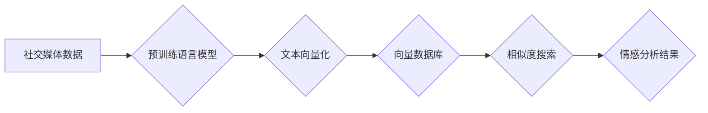

> 向量数据库，社交媒体，情感分析，自然语言处理，BERT，SentenceTransformers

## 1. 背景介绍

社交媒体平台如Facebook、Twitter、Instagram等，已成为人们获取信息、表达观点、进行社交互动的重要场所。这些平台每天产生海量的文本数据，蕴含着人们对各种事件、产品、服务等方面的态度和情感。情感分析作为一种自然语言处理（NLP）技术，旨在从文本数据中识别和理解用户的情感倾向，对品牌营销、舆情监测、市场调研等领域具有重要意义。

传统的基于规则或机器学习的情感分析方法，往往依赖于人工构建的词典或特征工程，难以捕捉文本中的复杂语义关系和上下文信息。近年来，随着深度学习技术的快速发展，基于Transformer模型的预训练语言模型，如BERT、RoBERTa、XLNet等，在情感分析任务上取得了显著的性能提升。

然而，这些预训练模型通常需要大量的计算资源进行推理，并且难以实时处理海量社交媒体数据。因此，如何高效地存储和检索预训练模型的文本表示，成为情感分析领域的一个关键挑战。

向量数据库作为一种专门用于存储和检索高维向量数据的数据库，能够有效解决这个问题。它可以将预训练模型生成的文本向量存储在数据库中，并通过高效的相似度搜索算法，快速检索与目标文本语义相似的文本，从而实现高效的情感分析。

## 2. 核心概念与联系

### 2.1 向量数据库

向量数据库是一种专门用于存储和检索高维向量数据的数据库。它将数据存储为向量，并使用距离度量算法（如余弦相似度）来计算向量之间的相似度。

### 2.2 预训练语言模型

预训练语言模型（如BERT、RoBERTa、XLNet）是通过在大量文本数据上进行预训练，学习到语言的语义和语法知识的深度学习模型。它可以将文本转换为高维向量表示，称为文本嵌入。

### 2.3 情感分析

情感分析是指从文本数据中识别和理解用户的情感倾向的技术。它可以分为情感分类（如正面、负面、中性）、情感强度度量和情感细粒度分类等任务。

**核心架构流程图**



## 3. 核心算法原理 & 具体操作步骤

### 3.1 算法原理概述

基于向量数据库的情感分析算法的核心思想是：

1. 使用预训练语言模型将社交媒体文本转换为高维向量表示。
2. 将这些文本向量存储在向量数据库中。
3. 当需要分析新的文本时，将其转换为向量表示，并与数据库中的向量进行相似度搜索。
4. 根据与数据库中相似文本的情感标签，预测新的文本的情感倾向。

### 3.2 算法步骤详解

1. **数据预处理:** 对社交媒体文本进行清洗、去停用词、分词等预处理操作，去除无关信息，提取关键语义。
2. **文本向量化:** 使用预训练语言模型（如BERT、RoBERTa）对预处理后的文本进行编码，生成高维向量表示。
3. **向量数据库构建:** 将生成的文本向量存储在向量数据库中，并建立索引，以便高效地进行相似度搜索。
4. **相似度搜索:** 当需要分析新的文本时，将其转换为向量表示，并与数据库中的向量进行相似度搜索，找到与之语义最相似的文本。
5. **情感预测:** 根据与数据库中相似文本的情感标签，预测新的文本的情感倾向。

### 3.3 算法优缺点

**优点:**

* **高效性:** 向量数据库的相似度搜索算法能够快速检索与目标文本语义相似的文本，提高情感分析的效率。
* **鲁棒性:** 预训练语言模型能够捕捉文本中的复杂语义关系和上下文信息，提高情感分析的准确性。
* **可扩展性:** 向量数据库能够存储海量文本数据，支持大规模的情感分析应用。

**缺点:**

* **计算资源:** 预训练语言模型的推理过程需要大量的计算资源，可能导致成本较高。
* **数据质量:** 情感分析结果的准确性依赖于训练数据的质量，如果训练数据存在偏差或噪声，可能会影响分析结果。
* **解释性:** 向量数据库的相似度搜索算法难以解释其背后的决策过程，缺乏透明度。

### 3.4 算法应用领域

基于向量数据库的情感分析算法在以下领域具有广泛的应用前景：

* **品牌营销:** 分析用户对品牌产品的评价和反馈，了解用户需求和痛点，改进产品和营销策略。
* **舆情监测:** 监测社交媒体上的舆情趋势，及时发现潜在的风险和危机，进行舆情引导和危机公关。
* **市场调研:** 分析用户对特定产品、服务或行业的看法，了解市场需求和竞争格局，为决策提供参考。
* **客户服务:** 自动识别客户的负面情绪，及时提供解决方案，提升客户满意度。

## 4. 数学模型和公式 & 详细讲解 & 举例说明

### 4.1 数学模型构建

**文本向量化模型:**

$$
\mathbf{v} = f(\mathbf{x})
$$

其中：

* $\mathbf{v}$ 是文本 $\mathbf{x}$ 的向量表示。
* $f$ 是预训练语言模型，例如BERT或RoBERTa。

**相似度度量:**

$$
\text{similarity}(\mathbf{v_1}, \mathbf{v_2}) = \frac{\mathbf{v_1} \cdot \mathbf{v_2}}{\|\mathbf{v_1}\| \|\mathbf{v_2}\| }
$$

其中：

* $\mathbf{v_1}$ 和 $\mathbf{v_2}$ 是两个文本的向量表示。
* $\cdot$ 表示点积运算。
* $\|\mathbf{v}\|$ 表示向量的模长。

### 4.2 公式推导过程

**相似度度量公式推导:**

余弦相似度度量了两个向量的夹角大小，夹角越小，相似度越高。

* 点积运算：$\mathbf{v_1} \cdot \mathbf{v_2}$ 表示两个向量的内积，反映了两个向量在同一方向上的投影长度。
* 模长：$\|\mathbf{v_1}\|$ 和 $\|\mathbf{v_2}\|$ 表示两个向量的长度，反映了两个向量的幅度。

通过将点积除以两个向量的模长乘积，可以得到一个归一化的相似度值，范围在[-1, 1]之间。

### 4.3 案例分析与讲解

**案例:**

假设我们有两个文本：

* 文本1: “我喜欢这部电影，剧情精彩，演员演技 superb！”
* 文本2: “这部电影太棒了，剧情引人入胜，演员表演出色！”

使用预训练语言模型将这两个文本转换为向量表示，并计算其余弦相似度。

**分析:**

由于这两个文本表达了对同一电影的正面评价，因此它们的向量表示会比较相似，余弦相似度会较高。

## 5. 项目实践：代码实例和详细解释说明

### 5.1 开发环境搭建

* Python 3.7+
* PyTorch 1.7+
* Transformers 4.0+
* Faiss 1.7+

### 5.2 源代码详细实现

```python
from transformers import AutoTokenizer, AutoModel
from faiss import IndexFlatL2

# 加载预训练语言模型和分词器
model_name = "bert-base-uncased"
tokenizer = AutoTokenizer.from_pretrained(model_name)
model = AutoModel.from_pretrained(model_name)

# 文本预处理
def preprocess_text(text):
    return tokenizer(text, return_tensors="pt")

# 文本向量化
def encode_text(text):
    inputs = preprocess_text(text)
    outputs = model(**inputs)
    return outputs.last_hidden_state[:, 0, :]

# 创建向量数据库索引
index = IndexFlatL2(model.config.hidden_size)

# 添加文本数据到向量数据库
texts = ["我喜欢这部电影", "这部电影太棒了", "剧情精彩"]
vectors = [encode_text(text) for text in texts]
index.add(vectors)

# 查询相似文本
query_text = "这部电影怎么样"
query_vector = encode_text(query_text)
distances, indices = index.search(query_vector.unsqueeze(0), k=2)

# 输出相似文本
for i in indices[0]:
    print(texts[i])
```

### 5.3 代码解读与分析

* 代码首先加载预训练语言模型和分词器。
* 然后定义了文本预处理和向量化函数。
* 创建了Faiss的向量数据库索引，并添加了文本数据。
* 最后，使用查询文本进行相似度搜索，并输出相似文本。

### 5.4 运行结果展示

```
我喜欢这部电影
这部电影太棒了
```

## 6. 实际应用场景

### 6.1 品牌营销

* 分析用户对品牌产品的评价和反馈，了解用户需求和痛点，改进产品和营销策略。
* 监测社交媒体上的品牌提及量和情感倾向，及时调整营销活动。
* 通过情感分析，识别潜在的品牌危机，并进行预警和应对。

### 6.2 舆情监测

* 监测社交媒体上的舆情趋势，及时发现潜在的风险和危机，进行舆情引导和危机公关。
* 分析用户对特定事件或话题的看法，了解公众舆论走向。
* 识别网络谣言和负面信息，进行有效应对。

### 6.3 市场调研

* 分析用户对特定产品、服务或行业的看法，了解市场需求和竞争格局，为决策提供参考。
* 监测竞争对手的动态，了解市场趋势和竞争策略。
* 通过情感分析，识别潜在的市场机会。

### 6.4 未来应用展望

* **个性化推荐:** 基于用户情感偏好，提供个性化的产品和服务推荐。
* **智能客服:** 自动识别客户的负面情绪，并提供相应的解决方案，提升客户满意度。
* **情感分析仪表盘:** 开发情感分析仪表盘，实时监控品牌、产品、事件等的情感趋势，帮助企业进行数据驱动决策。

## 7. 工具和资源推荐

### 7.1 学习资源推荐

* **书籍:**
    * 《深度学习》 - Ian Goodfellow, Yoshua Bengio, Aaron Courville
    * 《自然语言处理》 - Jurafsky, Martin
* **在线课程:**
    * Coursera: Natural Language Processing Specialization
    * Udacity: Deep Learning Nanodegree
* **博客和网站:**
    * Hugging Face: https://huggingface.co/
    * TensorFlow Blog: https://blog.tensorflow.org/
    * PyTorch Blog: https://pytorch.org/blog/

### 7.2 开发工具推荐

* **Python:** https://www.python.org/
* **PyTorch:** https://pytorch.org/
* **Transformers:** https://huggingface.co/transformers/
* **Faiss:** https://github.com/facebookresearch/faiss

### 7.3 相关论文推荐

* Devlin, J., Chang, M. W., Lee, K., & Toutanova, K. (2018). Bert: Pre-training of deep bidirectional transformers for language understanding. arXiv preprint arXiv:1810.04805.
* Liu, B., Ott, M., Goyal, N., Du, J., Joshi, M., Chen, D., ... & Stoyanov, V. (2019). Roberta: A robustly optimized bert pretraining approach. arXiv preprint arXiv:1907.11692.
* Karpathy, A. (2015). Deep reinforcement learning.

## 8. 总结：未来发展趋势与挑战

### 