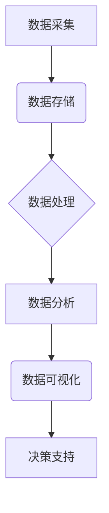

> 大数据分析,政企客户,业务分析,机器学习,数据挖掘,数据可视化,云计算

## 1. 背景介绍

在当今数据爆炸的时代，政企客户的业务数据日益庞大，如何有效地分析这些数据，挖掘其中的价值，已成为政企客户提升运营效率、优化决策的重要课题。传统的业务分析方法往往依赖于人工经验和有限的数据样本，难以应对海量数据的处理和复杂业务模式的分析。基于大数据的业务分析系统应运而生，它利用大数据技术和机器学习算法，对海量政企客户数据进行深度挖掘，提供更精准、更全面的业务洞察，帮助政企客户做出更明智的决策。

## 2. 核心概念与联系

### 2.1  大数据

大数据是指规模庞大、结构复杂、更新速度快、类型多样化的数据。其特点是：

* **海量**: 数据量巨大，难以用传统数据库技术进行存储和处理。
* **高速**: 数据更新速度快，需要实时或近实时处理。
* **多样化**: 数据类型多样，包括结构化数据、半结构化数据和非结构化数据。
* **复杂性**: 数据结构复杂，包含大量噪声和异常值。

### 2.2  政企客户

政企客户是指政府机构和企业客户，它们在业务运营中产生大量的业务数据，例如：

* **政府机构**: 政策法规、公共服务数据、民生信息等。
* **企业**: 销售数据、市场调研数据、客户关系管理数据等。

### 2.3  业务分析

业务分析是指通过收集、整理、分析和解释业务数据，以发现业务规律、识别问题和机遇，并为决策提供支持的过程。

### 2.4  系统架构

基于大数据的政企客户业务分析系统通常采用分布式架构，以应对海量数据的处理需求。系统主要包括以下几个模块：

* **数据采集模块**: 从各种数据源收集政企客户业务数据。
* **数据存储模块**: 使用分布式文件系统或NoSQL数据库存储海量数据。
* **数据处理模块**: 使用大数据处理框架，例如Hadoop或Spark，对数据进行清洗、转换和聚合。
* **数据分析模块**: 使用机器学习算法和数据挖掘技术，对数据进行分析和挖掘，发现业务规律和潜在价值。
* **数据可视化模块**: 将分析结果以图表、报表等形式展示，方便用户理解和决策。



## 3. 核心算法原理 & 具体操作步骤

### 3.1  算法原理概述

基于大数据的政企客户业务分析系统通常采用以下几种核心算法：

* **机器学习**: 利用算法从数据中学习，发现模式和规律，用于预测、分类和聚类等任务。
* **数据挖掘**: 从海量数据中发现隐藏的知识和模式，例如关联规则、分类规则和聚类分析。
* **统计分析**: 使用统计方法对数据进行分析，例如描述性统计、假设检验和回归分析。

### 3.2  算法步骤详解

以机器学习算法为例，其基本步骤如下：

1. **数据收集和预处理**: 收集相关数据，并进行清洗、转换和特征工程等预处理操作。
2. **模型选择**: 根据业务需求选择合适的机器学习算法，例如线性回归、逻辑回归、决策树、支持向量机等。
3. **模型训练**: 使用训练数据对模型进行训练，调整模型参数，使其能够准确地预测或分类数据。
4. **模型评估**: 使用测试数据对模型进行评估，评估模型的准确率、召回率、F1-score等指标。
5. **模型部署**: 将训练好的模型部署到生产环境中，用于对实时数据进行预测或分类。

### 3.3  算法优缺点

不同的算法具有不同的优缺点，需要根据具体业务需求选择合适的算法。

* **机器学习**: 优点是能够自动学习数据模式，并进行预测和分类；缺点是需要大量的训练数据，并且模型解释性较差。
* **数据挖掘**: 优点是能够发现隐藏的知识和模式；缺点是需要专业的知识和技能，并且结果的解释性较差。
* **统计分析**: 优点是方法成熟，结果易于解释；缺点是需要假设数据的分布，并且难以处理复杂的数据模式。

### 3.4  算法应用领域

基于大数据的政企客户业务分析系统可以应用于以下领域：

* **客户关系管理**: 分析客户行为，预测客户流失，提供个性化服务。
* **市场营销**: 分析市场趋势，精准定位目标客户，优化营销策略。
* **风险管理**: 分析风险因素，预测潜在风险，制定风险控制措施。
* **运营优化**: 分析业务流程，识别瓶颈，优化运营效率。

## 4. 数学模型和公式 & 详细讲解 & 举例说明

### 4.1  数学模型构建

在基于大数据的政企客户业务分析系统中，可以使用数学模型来描述业务现象和关系，例如：

* **客户价值模型**: 使用数学公式计算客户的价值，例如客户生命周期价值 (CLTV) 或客户获取成本 (CAC)。
* **市场预测模型**: 使用回归分析或时间序列分析预测市场需求。
* **风险评估模型**: 使用概率论和统计学方法评估风险。

### 4.2  公式推导过程

例如，客户生命周期价值 (CLTV) 的计算公式如下：

$$CLTV = \sum_{t=1}^{T} \frac{R_t}{(1+r)^t}$$

其中：

* $R_t$ 是第 $t$ 个时间段的客户净收入。
* $r$ 是客户流失率。
* $T$ 是客户生命周期长度。

### 4.3  案例分析与讲解

假设一个电商平台的客户生命周期长度为 3 年，客户在每个时间段的净收入分别为 100 元、200 元和 300 元，客户流失率为 10%。则该客户的 CLTV 为：

$$CLTV = \frac{100}{(1+0.1)^1} + \frac{200}{(1+0.1)^2} + \frac{300}{(1+0.1)^3} \approx 488.77$$

## 5. 项目实践：代码实例和详细解释说明

### 5.1  开发环境搭建

基于大数据的政企客户业务分析系统通常使用以下开发环境：

* **操作系统**: Linux 或 Windows
* **编程语言**: Python 或 Java
* **大数据处理框架**: Hadoop 或 Spark
* **数据库**: MySQL 或 MongoDB

### 5.2  源代码详细实现

以下是一个使用 Python 和 Spark 实现客户价值预测的代码示例：

```python
from pyspark.sql import SparkSession
from pyspark.sql.functions import col, avg

# 创建 SparkSession
spark = SparkSession.builder.appName("CustomerValuePrediction").getOrCreate()

# 读取客户数据
df = spark.read.csv("customer_data.csv", header=True, inferSchema=True)

# 计算客户生命周期价值
df = df.withColumn("CLTV", avg("purchase_amount") * 3)

# 显示结果
df.show()

# 关闭 SparkSession
spark.stop()
```

### 5.3  代码解读与分析

* **创建 SparkSession**: 创建一个 SparkSession 对象，用于连接到 Spark 集群。
* **读取客户数据**: 使用 `spark.read.csv()` 方法读取客户数据文件。
* **计算客户生命周期价值**: 使用 `withColumn()` 方法添加一个新的列 "CLTV"，并使用 `avg("purchase_amount") * 3` 计算客户生命周期价值。
* **显示结果**: 使用 `df.show()` 方法显示计算结果。
* **关闭 SparkSession**: 关闭 SparkSession 对象，释放资源。

### 5.4  运行结果展示

运行上述代码后，将显示每个客户的 CLTV 值。

## 6. 实际应用场景

基于大数据的政企客户业务分析系统已在多个领域得到实际应用，例如：

* **政府**: 利用大数据分析，预测人口流动趋势，优化公共服务资源配置。
* **金融**: 利用大数据分析，识别欺诈行为，降低风险。
* **制造**: 利用大数据分析，优化生产流程，提高生产效率。

### 6.4  未来应用展望

随着大数据技术的不断发展，基于大数据的政企客户业务分析系统将有更广泛的应用场景，例如：

* **个性化服务**: 利用大数据分析，为客户提供个性化的产品和服务。
* **智能决策**: 利用大数据分析，辅助决策者做出更明智的决策。
* **预测分析**: 利用大数据分析，预测未来趋势，提前应对风险。

## 7. 工具和资源推荐

### 7.1  学习资源推荐

* **书籍**:
    * 《大数据技术》
    * 《机器学习实战》
    * 《数据挖掘：概念与技术》
* **在线课程**:
    * Coursera: 数据科学
    * edX: 大数据分析
    * Udemy: 机器学习

### 7.2  开发工具推荐

* **大数据处理框架**: Hadoop, Spark
* **数据库**: MySQL, MongoDB
* **编程语言**: Python, Java
* **数据可视化工具**: Tableau, Power BI

### 7.3  相关论文推荐

* 《基于大数据的政企客户业务分析系统研究》
* 《大数据分析在政企客户关系管理中的应用》
* 《机器学习在政企客户预测分析中的应用》

## 8. 总结：未来发展趋势与挑战

### 8.1  研究成果总结

基于大数据的政企客户业务分析系统已取得了一定的研究成果，例如：

* 提出了一些新的算法和模型，提高了分析效率和准确性。
* 开发了一些实用的工具和平台，方便用户进行数据分析和可视化。
* 在多个领域取得了实际应用，为政企客户提供了决策支持。

### 8.2  未来发展趋势

未来，基于大数据的政企客户业务分析系统将朝着以下方向发展：

* **更智能化**: 利用人工智能技术，实现更智能的分析和预测。
* **更个性化**: 为不同客户提供个性化的分析和服务。
* **更实时化**: 实现实时数据分析和决策支持。

### 8.3  面临的挑战

基于大数据的政企客户业务分析系统也面临一些挑战：

* **数据质量**: 大数据往往包含大量噪声和异常值，需要进行有效的数据清洗和预处理。
* **数据安全**: 大数据涉及到大量敏感信息，需要采取有效的安全措施保护数据安全。
* **人才缺口**: 大数据分析需要专业的技术人才，目前人才缺口较大。

### 8.4  研究展望

未来，我们将继续深入研究基于大数据的政企客户业务分析系统，探索更智能、更个性化、更实时的分析方法，为政企客户提供更精准、更全面的决策支持。

## 9. 附录：常见问题与解答

### 9.1  常见问题

* **如何选择合适的算法？**

选择合适的算法需要根据具体业务需求和数据特点进行分析。

* **如何保证数据安全？**

需要采取有效的安全措施，例如数据加密、访问控制和审计日志。

* **如何解决数据质量问题？**

需要进行数据清洗、预处理和异常值处理等操作。

### 9.2  解答

* **如何选择合适的算法？**

选择合适的算法需要根据具体业务需求和数据特点进行分析。例如，如果需要预测客户流失，可以选择逻辑回归或决策树算法；如果需要发现客户行为模式，可以选择聚类算法。

* **如何保证数据安全？**

需要采取有效的安全措施，例如数据加密、访问控制和审计日志。

* **如何解决数据质量问题？**

需要进行数据清洗、预处理