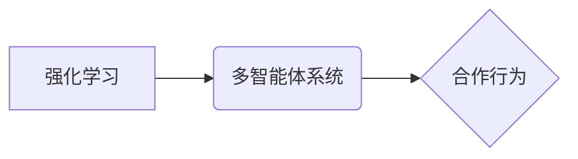

> 强化学习，多智能体系统，合作行为，算法原理，数学模型，项目实践，应用场景

## 1. 背景介绍

在当今人工智能领域，多智能体系统（Multi-Agent Systems，MAS）因其在解决复杂、动态环境问题中的优势而备受关注。MAS由多个智能体组成，每个智能体都具有自主决策能力，并通过相互交互来实现共同目标。然而，在多智能体系统中，智能体之间的合作行为是实现高效协作的关键，也是一个具有挑战性的研究课题。

传统的多智能体系统设计通常依赖于预先定义的规则和协议，这使得系统难以适应变化的环境和灵活应对复杂任务。而基于强化学习（Reinforcement Learning，RL）的多智能体系统则能够通过学习和迭代的方式，发现最优的合作策略，从而实现更智能、更灵活的协作行为。

## 2. 核心概念与联系

**2.1 强化学习**

强化学习是一种机器学习方法，它通过智能体与环境的交互来学习最优的行为策略。在RL中，智能体会根据环境的反馈（奖励或惩罚）调整其行为，最终目标是最大化累积的奖励。

**2.2 多智能体系统**

多智能体系统由多个独立的智能体组成，每个智能体都具有感知环境、做出决策和执行动作的能力。智能体之间可以通过通信或共享信息来进行合作或竞争。

**2.3 合作行为**

在多智能体系统中，合作行为是指多个智能体共同努力，实现共同目标的行为。合作行为需要智能体之间进行协调和协作，并根据环境变化动态调整策略。

**2.4 核心概念关系图**



## 3. 核心算法原理 & 具体操作步骤

**3.1 算法原理概述**

基于强化学习的多智能体系统合作行为分析通常采用以下算法：

* **深度强化学习（Deep Reinforcement Learning，DRL）:** 将深度神经网络与强化学习算法结合，能够学习更复杂的策略。
* **代理学习（Agent Learning）:** 每个智能体都作为一个独立的代理，通过强化学习算法学习自己的策略。
* **联合学习（Joint Learning）:** 智能体之间共享信息和学习成果，共同学习最优的合作策略。

**3.2 算法步骤详解**

1. **环境建模:** 建立多智能体系统的环境模型，包括智能体、环境状态、动作空间和奖励函数。
2. **智能体设计:** 设计每个智能体的架构，包括感知模块、决策模块和执行模块。
3. **策略学习:** 使用强化学习算法，例如Q学习、SARSA或深度强化学习算法，训练每个智能体的策略。
4. **合作策略优化:** 通过联合学习或其他合作策略优化算法，优化智能体之间的合作策略。
5. **性能评估:** 使用评估指标，例如成功率、奖励总和或任务完成时间，评估系统的性能。

**3.3 算法优缺点**

* **优点:**
    * 能够学习更复杂的合作策略。
    * 适应性强，能够应对变化的环境。
    * 能够发现人类难以发现的最佳策略。
* **缺点:**
    * 训练时间长，计算资源消耗大。
    * 算法参数设置复杂，需要经验积累。
    * 难以解释智能体的决策过程。

**3.4 算法应用领域**

* **机器人协作:** 多机器人协同完成任务，例如搜索和救援、物流配送等。
* **自动驾驶:** 多车协同行驶，提高交通效率和安全性。
* **游戏人工智能:** 多智能体游戏中的AI对手，例如围棋、Go等。
* **金融市场:** 多智能体交易策略，例如股票投资、风险管理等。

## 4. 数学模型和公式 & 详细讲解 & 举例说明

**4.1 数学模型构建**

在强化学习中，多智能体系统可以建模为马尔可夫决策过程（Markov Decision Process，MDP）。

* **状态空间:** 环境的当前状态，例如机器人位置、目标位置等。
* **动作空间:** 智能体可以执行的动作，例如移动、抓取、释放等。
* **转移概率:** 从一个状态到另一个状态的概率，取决于智能体的动作和环境的随机性。
* **奖励函数:** 智能体在某个状态执行某个动作后获得的奖励，可以是正数、负数或零。

**4.2 公式推导过程**

强化学习的目标是找到一个策略π，使得智能体在与环境交互的过程中获得最大的累积奖励。

* **价值函数:** 价值函数V(s)表示从状态s开始执行策略π获得的期望累积奖励。
* **Bellman方程:** Bellman方程描述了价值函数的更新规则。

$$
V(s) = \max_{\pi} \sum_{s'} P(s' | s, a) [r(s, a, s') + \gamma V(s')]
$$

其中：

* s: 当前状态
* a: 智能体执行的动作
* s': 下一个状态
* r(s, a, s'): 状态s执行动作a后到达状态s'的奖励
* γ: 折扣因子，控制未来奖励的权重

**4.3 案例分析与讲解**

例如，在一个机器人协作任务中，多个机器人需要共同完成搬运物品的任务。

* 状态空间: 机器人的位置、物品的位置、任务进度等。
* 动作空间: 机器人移动、抓取、释放物品等。
* 奖励函数: 完成任务获得高奖励，碰撞或失败获得低奖励。

通过强化学习算法，机器人可以学习最优的合作策略，例如协同移动、分工合作、避开障碍等。

## 5. 项目实践：代码实例和详细解释说明

**5.1 开发环境搭建**

* Python 3.x
* TensorFlow 或 PyTorch
* OpenAI Gym 或其他强化学习库

**5.2 源代码详细实现**

```python
# 导入必要的库
import gym
import tensorflow as tf

# 定义智能体类
class Agent:
    def __init__(self, state_size, action_size):
        # 初始化神经网络模型
        self.model = tf.keras.models.Sequential([
            tf.keras.layers.Dense(64, activation='relu', input_shape=(state_size,)),
            tf.keras.layers.Dense(action_size)
        ])

    # 选择动作
    def choose_action(self, state):
        # 使用神经网络预测动作概率
        probs = self.model(state)
        # 根据概率选择动作
        action = tf.random.categorical(probs, num_samples=1)[0, 0]
        return action

# 创建环境
env = gym.make('CartPole-v1')

# 创建智能体
agent = Agent(state_size=env.observation_space.shape[0], action_size=env.action_space.n)

# 训练智能体
for episode in range(1000):
    state = env.reset()
    done = False
    while not done:
        # 选择动作
        action = agent.choose_action(state)
        # 执行动作
        next_state, reward, done, _ = env.step(action)
        # 更新神经网络模型
        # ...
        state = next_state

# 测试智能体
state = env.reset()
while True:
    # 选择动作
    action = agent.choose_action(state)
    # 执行动作
    next_state, reward, done, _ = env.step(action)
    # 显示环境状态
    env.render()
    if done:
        break
    state = next_state
```

**5.3 代码解读与分析**

* 代码首先定义了智能体类，包含神经网络模型和选择动作的方法。
* 然后创建了环境和智能体实例。
* 训练过程使用强化学习算法更新神经网络模型，直到智能体能够完成任务。
* 测试过程使用训练好的智能体与环境交互，并显示环境状态。

**5.4 运行结果展示**

运行代码后，可以观察到智能体在环境中学习并完成任务的过程。

## 6. 实际应用场景

**6.1 机器人协作**

* **物流配送:** 多个机器人协同完成仓库内的货物搬运和配送任务。
* **制造业:** 多个机器人协同完成生产线上的装配、焊接、喷涂等任务。
* **搜索和救援:** 多个机器人协同在灾难现场搜索和救援人员。

**6.2 自动驾驶**

* **自动驾驶汽车:** 多车协同行驶，提高交通效率和安全性。
* **无人机编队:** 多架无人机协同完成巡逻、监控、拍摄等任务。

**6.3 其他应用场景**

* **金融市场:** 多智能体交易策略，例如股票投资、风险管理等。
* **游戏人工智能:** 多智能体游戏中的AI对手，例如围棋、Go等。

**6.4 未来应用展望**

随着强化学习技术的不断发展，基于强化学习的多智能体系统合作行为分析将在更多领域得到应用，例如：

* **医疗保健:** 多个机器人协同完成手术、护理等任务。
* **教育:** 多个智能体协同完成个性化教学、学生评估等任务。
* **科学研究:** 多个智能体协同完成数据分析、模型训练等任务。

## 7. 工具和资源推荐

**7.1 学习资源推荐**

* **书籍:**
    * Reinforcement Learning: An Introduction by Richard S. Sutton and Andrew G. Barto
    * Deep Reinforcement Learning Hands-On by Maxim Lapan
* **在线课程:**
    * Deep Reinforcement Learning Specialization by DeepLearning.AI
    * Reinforcement Learning by David Silver (University of DeepMind)

**7.2 开发工具推荐**

* **TensorFlow:** 开源深度学习框架
* **PyTorch:** 开源深度学习框架
* **OpenAI Gym:** 强化学习环境库

**7.3 相关论文推荐**

* **Deep Reinforcement Learning with Double Q-Learning**
* **Proximal Policy Optimization Algorithms**
* **Asynchronous Methods for Deep Reinforcement Learning**

## 8. 总结：未来发展趋势与挑战

**8.1 研究成果总结**

基于强化学习的多智能体系统合作行为分析取得了显著进展，能够学习更复杂的合作策略，并应用于多个领域。

**8.2 未来发展趋势**

* **更复杂的合作场景:** 研究更复杂的多智能体系统，例如具有不同能力、目标和动机的智能体。
* **更鲁棒的算法:** 开发更鲁棒的强化学习算法，能够应对更复杂的环境和更不确定性的情况。
* **可解释性:** 研究强化学习算法的决策过程，提高算法的可解释性和透明度。

**8.3 面临的挑战**

* **训练效率:** 强化学习算法的训练时间长，计算资源消耗大。
* **数据需求:** 强化学习算法需要大量的训练数据。
* **安全性和可靠性:** 多智能体系统需要保证安全性和可靠性，避免出现意外情况。

**8.4 研究展望**

未来，基于强化学习的多智能体系统合作行为分析将继续是一个重要的研究方向，需要进一步探索更复杂的合作场景、更鲁棒的算法和更可解释的模型，以推动人工智能技术的发展和应用。

## 9. 附录：常见问题与解答

**9.1 如何选择合适的强化学习算法？**

选择合适的强化学习算法取决于具体的应用场景和任务需求。例如，对于离散动作空间的任务，可以使用Q学习或SARSA算法；对于连续动作空间的任务，可以使用深度强化学习算法，例如DQN或PPO算法。

**9.2 如何解决强化学习算法的训练效率问题？**

可以采用以下方法提高强化学习算法的训练效率：

* 使用经验回放技术，重复使用训练数据。
* 使用异步更新策略，并行更新多个智能体的模型。
* 使用分布式训练技术，在多个机器上并行训练模型。