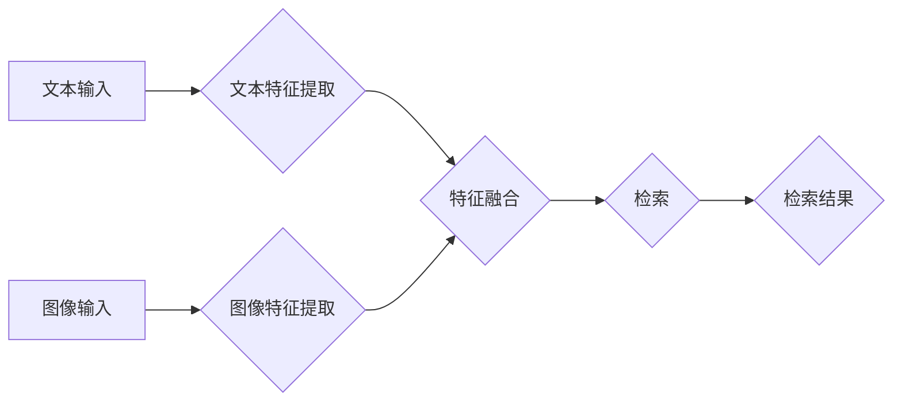

> 深度学习、多模态检索、图像检索、文本检索、视觉语言理解、BERT、CNN、Transformer

## 1. 背景介绍

随着互联网信息爆炸式增长，海量数据以多模态形式存在，例如文本、图像、音频、视频等。传统的单模态检索方法难以有效地处理这种复杂的多模态数据，因此，基于深度学习的多模态检索技术应运而生。

多模态检索是指从多个模态数据中检索相关信息的过程。例如，用户可以通过输入文本关键词检索与之相关的图像，或者通过上传图像检索与之相关的文本描述。多模态检索在许多领域都有广泛的应用，例如：

* **图像搜索引擎:** 用户可以通过输入文本关键词检索与之相关的图像。
* **视频检索:** 用户可以通过输入文本关键词或图像检索与之相关的视频片段。
* **跨模态问答:** 用户可以通过输入文本问题，检索与之相关的图像或视频作为答案。
* **商品推荐:** 根据用户的浏览历史和购买记录，推荐与之相关的商品图像和描述。

## 2. 核心概念与联系

多模态检索的核心是将不同模态的数据映射到一个共同的语义空间，使得不同模态的数据能够进行有效的比较和检索。

**2.1  核心概念**

* **模态:** 指数据呈现的形式，例如文本、图像、音频、视频等。
* **语义空间:** 一个抽象的空间，其中每个数据点都代表一个概念或实体，并且相似的概念或实体在语义空间中距离较近。
* **特征提取:** 将不同模态的数据转换为特征向量，这些特征向量能够反映数据的语义信息。
* **融合:** 将不同模态的特征向量融合在一起，形成一个综合的特征向量，用于检索。

**2.2  架构图**



## 3. 核心算法原理 & 具体操作步骤

### 3.1  算法原理概述

基于深度学习的多模态检索算法通常采用以下步骤：

1. **特征提取:** 使用深度学习模型提取不同模态数据的特征向量。
2. **特征融合:** 将不同模态的特征向量融合在一起，形成一个综合的特征向量。
3. **检索:** 使用检索模型根据查询特征向量检索与之相关的目标特征向量。

### 3.2  算法步骤详解

1. **文本特征提取:** 使用预训练的语言模型，例如BERT，将文本输入转换为文本特征向量。
2. **图像特征提取:** 使用卷积神经网络（CNN），例如ResNet，将图像输入转换为图像特征向量。
3. **特征融合:** 使用多种融合方法将文本特征向量和图像特征向量融合在一起，例如：
    * **拼接:** 将文本特征向量和图像特征向量直接拼接在一起。
    * **注意力机制:** 使用注意力机制学习不同模态特征之间的权重，并融合这些特征。
    * **多模态自编码器:** 使用多模态自编码器学习不同模态数据的共同表示。
4. **检索:** 使用检索模型，例如余弦相似度或支持向量机（SVM），根据查询特征向量检索与之相关的目标特征向量。

### 3.3  算法优缺点

**优点:**

* 能够处理多模态数据，提高检索的准确性和效率。
* 深度学习模型能够自动学习数据的语义信息，无需人工特征工程。

**缺点:**

* 训练数据量大，需要大量的标注数据。
* 计算复杂度高，需要强大的计算资源。

### 3.4  算法应用领域

* **图像搜索引擎:** 用户可以通过输入文本关键词检索与之相关的图像。
* **视频检索:** 用户可以通过输入文本关键词或图像检索与之相关的视频片段。
* **跨模态问答:** 用户可以通过输入文本问题，检索与之相关的图像或视频作为答案。
* **商品推荐:** 根据用户的浏览历史和购买记录，推荐与之相关的商品图像和描述。

## 4. 数学模型和公式 & 详细讲解 & 举例说明

### 4.1  数学模型构建

多模态检索的数学模型通常基于以下假设：

* 不同模态的数据在语义空间中具有相似的表示。
* 查询特征向量和目标特征向量之间的相似度可以用来衡量检索结果的 relevance。

### 4.2  公式推导过程

**4.2.1  特征提取:**

假设文本特征向量为 $x_t$，图像特征向量为 $x_v$，则可以使用以下公式表示特征提取过程：

$$
x_t = f_t(text)
$$

$$
x_v = f_v(image)
$$

其中，$f_t$ 和 $f_v$ 分别是文本特征提取模型和图像特征提取模型。

**4.2.2  特征融合:**

可以使用多种方法将文本特征向量和图像特征向量融合在一起，例如：

* **拼接:**

$$
x = [x_t, x_v]
$$

* **注意力机制:**

$$
x = \sum_{i=1}^{n} \alpha_i x_i
$$

其中，$x_i$ 是每个模态的特征向量，$\alpha_i$ 是注意力权重。

**4.2.3  检索:**

可以使用余弦相似度来衡量查询特征向量和目标特征向量之间的相似度：

$$
sim(x_q, x) = \frac{x_q \cdot x}{||x_q|| ||x||}
$$

其中，$x_q$ 是查询特征向量，$x$ 是目标特征向量。

### 4.3  案例分析与讲解

假设用户输入一个文本查询 "猫"，并上传了一张猫的图像。

1. **特征提取:** 使用BERT模型提取文本特征向量 $x_t$，使用ResNet模型提取图像特征向量 $x_v$。
2. **特征融合:** 使用注意力机制将 $x_t$ 和 $x_v$ 融合在一起，得到综合特征向量 $x$。
3. **检索:** 使用余弦相似度计算 $x_q$ 和数据库中所有目标特征向量之间的相似度，并返回相似度最高的 $k$ 个结果。

## 5. 项目实践：代码实例和详细解释说明

### 5.1  开发环境搭建

* Python 3.7+
* TensorFlow 2.0+
* PyTorch 1.0+
* CUDA 10.0+

### 5.2  源代码详细实现

```python
# 导入必要的库
import tensorflow as tf
from tensorflow.keras.applications import ResNet50
from tensorflow.keras.preprocessing import image
from tensorflow.keras.applications.resnet50 import preprocess_input, decode_predictions

# 定义文本特征提取模型
def extract_text_features(text):
    # 使用BERT模型提取文本特征
    # ...

# 定义图像特征提取模型
def extract_image_features(image_path):
    # 使用ResNet模型提取图像特征
    img = image.load_img(image_path, target_size=(224, 224))
    x = image.img_to_array(img)
    x = np.expand_dims(x, axis=0)
    x = preprocess_input(x)
    features = model.predict(x)
    return features

# 定义特征融合方法
def fuse_features(text_features, image_features):
    # 使用注意力机制融合特征
    # ...

# 定义检索模型
def retrieve_results(query_features, database_features):
    # 使用余弦相似度计算相似度
    # ...

# 示例代码
text_query = "猫"
image_path = "cat.jpg"

text_features = extract_text_features(text_query)
image_features = extract_image_features(image_path)

fused_features = fuse_features(text_features, image_features)

results = retrieve_results(fused_features, database_features)

print(results)
```

### 5.3  代码解读与分析

* 代码首先定义了文本特征提取、图像特征提取、特征融合和检索模型的函数。
* 然后，使用示例代码演示了如何使用这些函数进行多模态检索。
* 代码中使用了BERT模型和ResNet模型进行特征提取，并使用注意力机制进行特征融合。
* 检索模型使用余弦相似度计算查询特征向量和目标特征向量之间的相似度。

### 5.4  运行结果展示

运行代码后，将返回与查询相关联的图像和文本结果。

## 6. 实际应用场景

### 6.1  图像搜索引擎

用户可以通过输入文本关键词检索与之相关的图像。例如，用户输入 "猫"，搜索引擎将返回与 "猫" 相关的图像。

### 6.2  视频检索

用户可以通过输入文本关键词或图像检索与之相关的视频片段。例如，用户输入 "跳舞"，搜索引擎将返回与 "跳舞" 相关的视频片段。

### 6.3  跨模态问答

用户可以通过输入文本问题，检索与之相关的图像或视频作为答案。例如，用户输入 "什么是太阳系？"，搜索引擎将返回与 "太阳系" 相关的图像或视频。

### 6.4  未来应用展望

多模态检索技术在未来将有更广泛的应用，例如：

* **智能家居:** 用户可以通过语音或图像控制智能家居设备。
* **医疗诊断:** 医生可以通过图像和文本数据进行疾病诊断。
* **教育:** 学生可以通过图像和视频学习知识。

## 7. 工具和资源推荐

### 7.1  学习资源推荐

* **书籍:**
    * Deep Learning with Python by Francois Chollet
    * Computer Vision: Algorithms and Applications by Richard Szeliski
* **在线课程:**
    * Stanford CS231n: Convolutional Neural Networks for Visual Recognition
    * Deep Learning Specialization by Andrew Ng

### 7.2  开发工具推荐

* **TensorFlow:** 开源深度学习框架
* **PyTorch:** 开源深度学习框架
* **OpenCV:** 图像处理库

### 7.3  相关论文推荐

* **Show, Attend and Tell: Neural Image Captioning with Visual Attention**
* **Multimodal Deep Learning: A Survey**
* **BERT: Pre-training of Deep Bidirectional Transformers for Language Understanding**

## 8. 总结：未来发展趋势与挑战

### 8.1  研究成果总结

基于深度学习的多模态检索技术取得了显著的进展，能够有效地处理多模态数据，提高检索的准确性和效率。

### 8.2  未来发展趋势

* **跨模态理解:** 进一步提升模型对不同模态数据的理解能力，实现更精准的跨模态检索。
* **个性化检索:** 根据用户的兴趣和偏好，提供个性化的检索结果。
* **实时检索:** 实现实时多模态检索，满足用户对快速信息获取的需求。

### 8.3  面临的挑战

* **数据标注:** 多模态数据的标注成本高，难以获取大量高质量的标注数据。
* **模型复杂度:** 多模态检索模型通常非常复杂，训练和部署成本高。
* **跨模态对齐:** 不同模态的数据表示方式不同，如何进行有效的跨模态对齐仍然是一个挑战。

### 8.4  研究展望

未来，多模态检索技术将继续朝着更智能、更精准、更个性化的方向发展，为人们提供更便捷、更丰富的体验。

## 9. 附录：常见问题与解答

**Q1: 多模态检索和单模态检索有什么区别？**

**A1:** 单模态检索只处理一种模态的数据，例如文本检索或图像检索。而多模态检索则处理多种模态的数据，例如文本和图像的结合。

**Q2: 多模态检索的应用场景有哪些？**

**A2:** 多模态检索的应用场景非常广泛，例如图像搜索引擎、视频检索、跨模态问答、