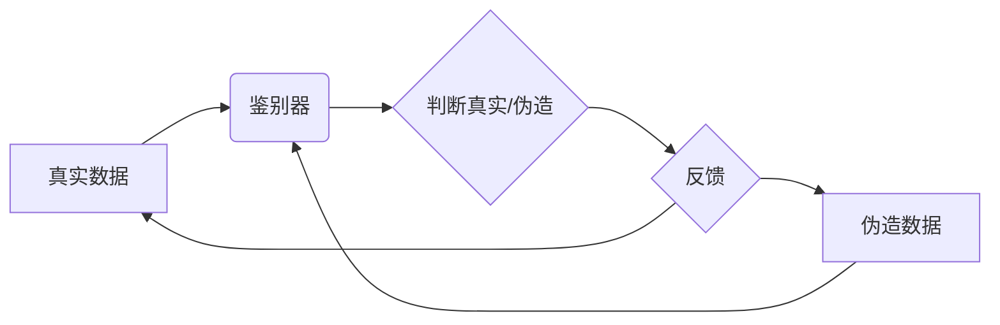

> 生成对抗网络(GAN)，视频风格迁移，实时处理，深度学习，图像处理

## 1. 背景介绍

视频风格迁移技术近年来备受关注，它能够将一种视频的风格转换为另一种视频的风格，例如将黑白视频转换为彩色视频，将卡通风格转换为现实风格，或者将一幅油画风格的图像转换为素描风格的图像。这种技术在电影制作、艺术创作、游戏开发等领域具有广泛的应用前景。

传统的视频风格迁移方法通常依赖于手工设计的特征提取和图像处理算法，这些方法往往难以捕捉视频中的复杂细节和运动信息，并且处理速度较慢。随着深度学习技术的快速发展，基于生成对抗网络(GAN)的视频风格迁移方法逐渐成为主流，这些方法能够学习到更丰富的视频特征，并实现更逼真的风格迁移效果。

## 2. 核心概念与联系

### 2.1 生成对抗网络 (GAN)

生成对抗网络 (GAN) 是一种由两个神经网络组成的对抗性学习框架，由 Ian Goodfellow 等人于 2014 年提出。GAN 由一个生成器 (Generator) 和一个鉴别器 (Discriminator) 组成。

* **生成器 (Generator):** 负责生成新的数据样本，例如图像、视频等。
* **鉴别器 (Discriminator):** 负责判断数据样本是真实数据还是由生成器生成的伪造数据。

生成器和鉴别器在对抗性的学习过程中不断迭代，生成器试图生成越来越逼真的数据样本，而鉴别器试图识别越来越多的伪造数据。最终，生成器能够生成与真实数据几乎 indistinguishable 的数据样本。



### 2.2 视频风格迁移

视频风格迁移是指将一个视频的风格转换为另一个视频的风格。例如，将一幅黑白视频转换为彩色视频，将一幅卡通风格的视频转换为现实风格的视频，或者将一幅油画风格的视频转换为素描风格的视频。

## 3. 核心算法原理 & 具体操作步骤

### 3.1 算法原理概述

基于生成对抗网络的视频风格迁移算法通常采用以下步骤：

1. **特征提取:** 使用卷积神经网络 (CNN) 从源视频和目标视频中提取特征。
2. **风格转换:** 将源视频的风格信息提取出来，并将其应用于目标视频的特征上，从而实现风格迁移。
3. **图像重建:** 将转换后的特征重建成新的视频帧。
4. **视频拼接:** 将所有转换后的视频帧拼接在一起，形成最终的风格迁移视频。

### 3.2 算法步骤详解

1. **特征提取:** 使用预训练的 CNN 模型，例如 VGGNet 或 ResNet，从源视频和目标视频中提取特征。这些特征通常是不同层级的特征图，包含了视频中不同层次的细节信息。

2. **风格转换:** 将源视频的风格信息提取出来，并将其应用于目标视频的特征上。常用的方法包括：
    * **Gram矩阵:** 计算特征图的 Gram矩阵，该矩阵描述了特征图中不同通道之间的相关性。将源视频的 Gram矩阵与目标视频的特征图相结合，可以实现风格迁移。
    * **风格损失函数:** 定义一个风格损失函数，该函数衡量源视频和目标视频风格之间的差异。通过最小化风格损失函数，可以实现风格迁移。

3. **图像重建:** 将转换后的特征重建成新的视频帧。可以使用反卷积网络 (Deconvolutional Network) 或其他图像重建方法。

4. **视频拼接:** 将所有转换后的视频帧拼接在一起，形成最终的风格迁移视频。

### 3.3 算法优缺点

**优点:**

* **效果逼真:** 基于 GAN 的视频风格迁移算法能够生成逼真的风格迁移效果。
* **灵活多样:** 可以迁移多种风格，例如黑白到彩色、卡通到现实、油画到素描等。
* **实时处理:** 一些算法能够实现实时视频风格迁移。

**缺点:**

* **训练复杂:** GAN 的训练过程比较复杂，需要大量的训练数据和计算资源。
* **模式崩溃:** GAN 容易出现模式崩溃问题，即生成器生成的数据样本过于单一，缺乏多样性。
* **模糊边缘:** 某些算法生成的视频边缘可能存在模糊现象。

### 3.4 算法应用领域

* **电影制作:** 将黑白电影转换为彩色电影，或者将电影中的场景风格进行转换。
* **艺术创作:** 将照片或绘画转换为不同的艺术风格。
* **游戏开发:** 为游戏角色和场景添加不同的风格效果。
* **虚拟现实 (VR) 和增强现实 (AR):** 为 VR 和 AR 应用场景添加风格化的视觉效果。

## 4. 数学模型和公式 & 详细讲解 & 举例说明

### 4.1 数学模型构建

**生成器 (G):**

生成器是一个神经网络，其输入是随机噪声向量，输出是生成的新视频帧。

**鉴别器 (D):**

鉴别器也是一个神经网络，其输入是视频帧，输出是判断该视频帧是真实数据还是伪造数据的概率。

**损失函数:**

生成器和鉴别器的损失函数分别为：

* **生成器损失函数 (G_loss):** 

$$G\_loss = -log(D(G(z)))$$

其中，z 是随机噪声向量，D(G(z)) 是鉴别器对生成视频帧的判断概率。

* **鉴别器损失函数 (D_loss):**

$$D\_loss = -log(D(x)) - log(1 - D(G(z)))$$

其中，x 是真实视频帧。

### 4.2 公式推导过程

生成器损失函数的目的是让生成器生成能够欺骗鉴别器的视频帧。因此，生成器希望最大化鉴别器对生成视频帧的判断概率。

鉴别器损失函数的目的是让鉴别器能够准确地判断真实视频帧和伪造视频帧。因此，鉴别器希望最大化对真实视频帧的判断概率，同时最小化对伪造视频帧的判断概率。

### 4.3 案例分析与讲解

假设我们想要将一幅黑白照片转换为彩色照片。我们可以使用基于 GAN 的视频风格迁移算法，将黑白照片作为源视频，彩色照片作为目标视频。

在训练过程中，生成器会尝试生成彩色照片，而鉴别器会尝试判断生成的彩色照片是真实照片还是伪造照片。通过不断迭代，生成器能够生成越来越逼真的彩色照片。

## 5. 项目实践：代码实例和详细解释说明

### 5.1 开发环境搭建

* **操作系统:** Ubuntu 18.04 或更高版本
* **编程语言:** Python 3.6 或更高版本
* **深度学习框架:** TensorFlow 或 PyTorch
* **其他依赖:** OpenCV、NumPy、Matplotlib 等

### 5.2 源代码详细实现

```python
# 导入必要的库
import tensorflow as tf
from tensorflow.keras.layers import Input, Conv2D, BatchNormalization, LeakyReLU, UpSampling2D
from tensorflow.keras.models import Model

# 定义生成器模型
def build_generator(input_shape):
    # 输入层
    input_layer = Input(shape=input_shape)
    # ...
    # 其他卷积层、批归一化层、LeakyReLU 激活函数等
    # ...
    # 输出层
    output_layer = Conv2D(3, kernel_size=3, activation='tanh')(output_layer)
    return Model(inputs=input_layer, outputs=output_layer)

# 定义鉴别器模型
def build_discriminator(input_shape):
    # 输入层
    input_layer = Input(shape=input_shape)
    # ...
    # 其他卷积层、批归一化层、LeakyReLU 激活函数等
    # ...
    # 输出层
    output_layer = Conv2D(1, kernel_size=1, activation='sigmoid')(output_layer)
    return Model(inputs=input_layer, outputs=output_layer)

# ...
# 训练模型
# ...

```

### 5.3 代码解读与分析

* **生成器模型:** 生成器模型负责生成新的视频帧，其输入是随机噪声向量，输出是生成的新视频帧。
* **鉴别器模型:** 鉴别器模型负责判断视频帧是真实数据还是伪造数据，其输入是视频帧，输出是判断该视频帧是真实数据还是伪造数据的概率。
* **训练过程:** 生成器和鉴别器在对抗性的学习过程中不断迭代，生成器试图生成越来越逼真的数据样本，而鉴别器试图识别越来越多的伪造数据。

### 5.4 运行结果展示

运行代码后，可以生成风格迁移后的视频。

## 6. 实际应用场景

### 6.1 电影制作

* 将黑白电影转换为彩色电影，例如将经典电影《公民凯恩》转换为彩色版本。
* 为电影场景添加不同的风格效果，例如将一部科幻电影的场景转换为卡通风格。

### 6.2 艺术创作

* 将照片或绘画转换为不同的艺术风格，例如将一幅照片转换为梵高的风格。
* 创建新的艺术作品，例如将多个不同风格的图像融合在一起，生成一个新的艺术作品。

### 6.3 游戏开发

* 为游戏角色和场景添加不同的风格效果，例如将一个角色从卡通风格转换为现实风格。
* 创建不同的游戏场景，例如将一个游戏场景从白天转换为夜晚。

### 6.4 未来应用展望

* **更逼真的风格迁移效果:** 未来，随着深度学习技术的不断发展，基于 GAN 的视频风格迁移算法能够生成更加逼真的风格迁移效果。
* **更灵活的风格转换:** 未来，可以实现更灵活的风格转换，例如将视频风格转换为特定艺术家的风格。
* **实时视频风格迁移:** 未来，可以实现实时视频风格迁移，例如在直播中实时转换视频风格。

## 7. 工具和资源推荐

### 7.1 学习资源推荐

* **书籍:**
    * 《深度学习》 by Ian Goodfellow, Yoshua Bengio, and Aaron Courville
    * 《Generative Adversarial Networks》 by Ian Goodfellow
* **在线课程:**
    * Coursera: Deep Learning Specialization
    * Udacity: Deep Learning Nanodegree

### 7.2 开发工具推荐

* **深度学习框架:** TensorFlow, PyTorch
* **图像处理库:** OpenCV
* **数据可视化库:** Matplotlib

### 7.3 相关论文推荐

* **Generative Adversarial Networks** by Ian Goodfellow et al. (2014)
* **Deep Learning for Video Style Transfer** by Huang et al. (2018)
* **Real-Time Video Style Transfer with Deep Neural Networks** by Liu et al. (2019)

## 8. 总结：未来发展趋势与挑战

### 8.1 研究成果总结

基于生成对抗网络的视频风格迁移技术取得了显著的进展，能够生成逼真的风格迁移效果，并应用于多个领域。

### 8.2 未来发展趋势

* **更高质量的风格迁移效果:** 未来，随着深度学习技术的不断发展，基于 GAN 的视频风格迁移算法能够生成更加逼真的风格迁移效果。
* **更灵活的风格转换:** 未来，可以实现更灵活的风格转换，例如将视频风格转换为特定艺术家的风格。
* **实时视频风格迁移:** 未来，可以实现实时视频风格迁移，例如在直播中实时转换视频风格。

### 8.3 面临的挑战

* **训练复杂度:** GAN 的训练过程比较复杂，需要大量的训练数据和计算资源。
* **模式崩溃:** GAN 容易出现模式崩溃问题，即生成器生成的数据样本过于单一，缺乏多样性。
* **模糊边缘:** 某些算法生成的视频边缘可能存在模糊现象。

### 8.4 研究展望

未来，研究者将继续探索新的 GAN 架构和训练方法，以提高视频风格迁移算法的质量、灵活性