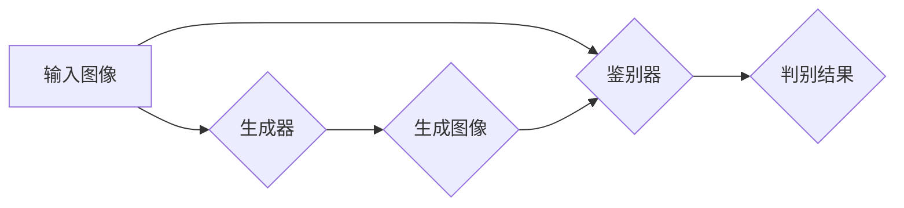

> 生成对抗网络 (GAN)，图像编辑，风格迁移，内容感知，图像生成，深度学习

## 1. 背景介绍

图像编辑和风格迁移是计算机视觉领域的重要研究方向，近年来取得了显著进展。传统的图像编辑方法通常依赖于手工设计的特征和规则，难以实现精细化的编辑效果。而深度学习技术的兴起，特别是生成对抗网络 (GAN) 的出现，为图像编辑和风格迁移带来了新的机遇。

GANs 由生成器 (Generator) 和鉴别器 (Discriminator) 组成，通过对抗训练的方式，生成器学习生成逼真的图像，鉴别器则学习区分真实图像和生成图像。这种对抗机制使得 GANs 在图像生成、图像编辑和风格迁移等任务中表现出强大的能力。

## 2. 核心概念与联系

### 2.1 生成对抗网络 (GAN)

GANs 是由 Ian Goodfellow 等人在 2014 年提出的生成模型。它由两个神经网络组成：

* **生成器 (Generator):** 负责生成新的数据样本，例如图像。
* **鉴别器 (Discriminator):** 负责判断数据样本是真实数据还是生成数据。

GANs 通过对抗训练的方式进行学习。生成器试图生成逼真的数据样本，而鉴别器试图区分真实数据和生成数据。两者在不断对抗中相互提升，最终生成器能够生成逼真的数据样本，而鉴别器能够准确区分真实数据和生成数据。

### 2.2 图像编辑与风格迁移

**图像编辑**是指对图像进行修改，例如添加、删除或修改图像内容。

**风格迁移**是指将一种图像的风格迁移到另一种图像上，例如将一幅油画风格的图像迁移到一幅照片上。

GANs 可以用于实现精细化的图像编辑和风格迁移。

### 2.3 核心架构



## 3. 核心算法原理 & 具体操作步骤

### 3.1 算法原理概述

基于 GANs 的图像编辑和风格迁移算法通常包括以下步骤：

1. **预处理:** 对输入图像进行预处理，例如调整大小、归一化等。
2. **特征提取:** 使用卷积神经网络 (CNN) 从输入图像中提取特征。
3. **生成器训练:** 使用 GANs 的对抗训练机制，训练生成器生成目标图像。
4. **鉴别器训练:** 使用 GANs 的对抗训练机制，训练鉴别器区分真实图像和生成图像。
5. **图像编辑/风格迁移:** 使用训练好的生成器生成目标图像。

### 3.2 算法步骤详解

1. **预处理:** 对输入图像进行预处理，例如调整大小、归一化等。这可以帮助生成器和鉴别器更好地学习图像特征。
2. **特征提取:** 使用 CNN 从输入图像中提取特征。CNN 可以学习到图像的语义信息和纹理信息。
3. **生成器训练:** 生成器接收输入图像的特征作为输入，并生成目标图像的特征。鉴别器判断生成图像的特征是否真实。生成器根据鉴别器的反馈调整参数，生成更逼真的图像特征。
4. **鉴别器训练:** 鉴别器接收真实图像和生成图像的特征作为输入，并判断它们是否真实。鉴别器根据判断结果调整参数，提高区分真实图像和生成图像的能力。
5. **图像编辑/风格迁移:** 使用训练好的生成器生成目标图像。

### 3.3 算法优缺点

**优点:**

* 精细化的图像编辑效果
* 能够迁移多种风格
* 能够生成高质量的图像

**缺点:**

* 训练过程复杂，需要大量的计算资源
* 容易出现模式崩溃问题
* 难以控制生成图像的细节

### 3.4 算法应用领域

* **图像编辑:** 修复图像缺陷、添加或删除图像内容、改变图像风格等。
* **图像生成:** 生成逼真的图像，例如人脸、风景、物体等。
* **风格迁移:** 将一种图像的风格迁移到另一种图像上。
* **艺术创作:** 使用 GANs 生成艺术作品。

## 4. 数学模型和公式 & 详细讲解 & 举例说明

### 4.1 数学模型构建

GANs 的数学模型主要包括生成器 G 和鉴别器 D 的损失函数。

* **生成器损失函数:**

$$
L_G(G, D) = E_{x \sim p_{data}(x)}[log(1 - D(G(z)))]
$$

其中，$x$ 是真实图像，$z$ 是随机噪声，$p_{data}(x)$ 是真实图像的分布，$D(G(z))$ 是鉴别器对生成图像的判别结果。

* **鉴别器损失函数:**

$$
L_D(D, G) = E_{x \sim p_{data}(x)}[log(D(x))] + E_{z \sim p_z(z)}[log(1 - D(G(z)))]
$$

其中，$p_z(z)$ 是随机噪声的分布。

### 4.2 公式推导过程

生成器损失函数的目标是最大化鉴别器对生成图像的判别结果，即让鉴别器认为生成图像是真实图像。鉴别器损失函数的目标是最大化对真实图像的判别结果，同时最小化对生成图像的判别结果。

### 4.3 案例分析与讲解

例如，在图像风格迁移任务中，可以使用 GANs 将一幅照片的风格迁移到一幅油画风格的图像上。

* **生成器:** 接收照片和油画风格特征作为输入，生成风格迁移后的图像。
* **鉴别器:** 接收真实油画图像和生成图像作为输入，判断它们是否真实。

通过对抗训练，生成器能够学习到将照片风格迁移到油画风格的技巧，最终生成逼真的油画风格图像。

## 5. 项目实践：代码实例和详细解释说明

### 5.1 开发环境搭建

* Python 3.6+
* TensorFlow/PyTorch
* CUDA/cuDNN

### 5.2 源代码详细实现

```python
# 生成器网络结构
class Generator(nn.Module):
    def __init__(self):
        super(Generator, self).__init__()
        # ...

    def forward(self, z):
        # ...

# 鉴别器网络结构
class Discriminator(nn.Module):
    def __init__(self):
        super(Discriminator, self).__init__()
        # ...

    def forward(self, x):
        # ...

# 训练循环
for epoch in range(num_epochs):
    for batch_idx, (real_images, _) in enumerate(dataloader):
        # ...
```

### 5.3 代码解读与分析

* **生成器网络结构:** 生成器网络通常是一个解码器，接收随机噪声作为输入，并生成图像。
* **鉴别器网络结构:** 鉴别器网络通常是一个编码器，接收图像作为输入，并判断其是否真实。
* **训练循环:** 训练循环中，生成器和鉴别器交替训练，直到生成器能够生成逼真的图像。

### 5.4 运行结果展示

* 可视化生成图像，并与真实图像进行比较。
* 使用指标评估生成图像的质量，例如 PSNR、SSIM 等。

## 6. 实际应用场景

### 6.1 图像修复

* 修复图像中的缺陷，例如 scratches、noise、missing parts 等。
* 恢复老照片的清晰度和细节。

### 6.2 图像增强

* 提高图像的清晰度、对比度和色彩饱和度。
* 增强图像的细节和纹理。

### 6.3 图像风格迁移

* 将一幅图像的风格迁移到另一种图像上，例如将照片风格迁移到油画风格。
* 创建具有独特风格的艺术作品。

### 6.4 未来应用展望

* 更精细化的图像编辑和风格迁移
* 更逼真的图像生成
* 更广泛的应用场景，例如虚拟现实、增强现实等。

## 7. 工具和资源推荐

### 7.1 学习资源推荐

* **书籍:**
    * Deep Learning by Ian Goodfellow, Yoshua Bengio, and Aaron Courville
    * Generative Adversarial Networks by David Foster
* **论文:**
    * Generative Adversarial Networks by Ian Goodfellow et al.
    * Cycle-Consistent Adversarial Networks by Jun-Yan Zhu et al.
* **在线课程:**
    * Coursera: Deep Learning Specialization
    * Udacity: Deep Learning Nanodegree

### 7.2 开发工具推荐

* **TensorFlow:** https://www.tensorflow.org/
* **PyTorch:** https://pytorch.org/
* **Keras:** https://keras.io/

### 7.3 相关论文推荐

* **Style Transfer Using Convolutional Neural Networks** by Leon A. Gatys et al.
* **Image Inpainting with Deep Convolutional Neural Networks** by  Yi-Hsuan Tsai et al.
* **High-Resolution Image Synthesis with Latent Diffusion Models** by  Ramesh R. et al.

## 8. 总结：未来发展趋势与挑战

### 8.1 研究成果总结

基于 GANs 的图像编辑和风格迁移技术取得了显著进展，能够生成逼真的图像，并实现精细化的图像编辑效果。

### 8.2 未来发展趋势

* **更高质量的图像生成:** 研究更强大的 GANs 模型，生成更高质量、更逼真的图像。
* **更精细化的图像编辑:** 研究更精确的图像编辑方法，例如局部编辑、语义编辑等。
* **更广泛的应用场景:** 将 GANs 应用于更多领域，例如虚拟现实、增强现实、医疗影像等。

### 8.3 面临的挑战

* **模式崩溃问题:** GANs 容易出现模式崩溃问题，生成图像缺乏多样性。
* **训练复杂度:** 训练 GANs 模型需要大量的计算资源和时间。
* **伦理问题:** GANs 可以生成逼真的假图像，可能被用于恶意目的，例如造假、欺骗等。

### 8.4 研究展望

未来研究将集中在解决 GANs 的挑战，提高其生成图像的质量、多样性和安全性，并将其应用于更多领域。

## 9. 附录：常见问题与解答

* **Q: GANs 为什么容易出现模式崩溃问题？**
* **A:** 模式崩溃问题是由于生成器和鉴别器之间的博弈机制导致的。当生成器生成图像过于相似时，鉴别器会难以区分真实图像和生成图像，从而导致生成器陷入局部最优解，生成图像缺乏多样性。

* **Q: 如何解决 GANs 的模式崩溃问题？**
* **A:** 有一些方法可以解决 GANs 的模式崩溃问题，例如：
    * 使用更复杂的生成器和鉴别器网络结构。
    * 使用不同的损失函数，例如 Wasserstein GAN (WGAN)。
    * 使用正则化技术，例如 dropout、batch normalization 等。

* **Q: 如何评估 GANs 生成的图像质量？**
* **A:** 可以使用一些指标评估 GANs 生成的图像质量，例如：
    * PSNR (Peak Signal-to-Noise Ratio)
    * SSIM (Structural Similarity Index)
    * Inception Score
    * Fréchet Inception Distance (FID)


作者：禅与计算机程序设计艺术 / Zen and the Art of Computer Programming 
<end_of_turn>