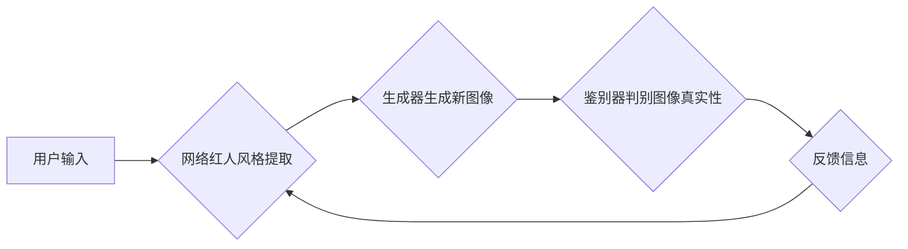

> 生成对抗网络(GAN)，风格迁移，网络红人，个性化生成，深度学习

## 1. 背景介绍

网络红人作为互联网时代的新兴文化现象，凭借其独特的个性魅力和内容创作能力，在社交媒体平台上积累了庞大的粉丝群体。他们的风格和个性成为了许多人模仿的对象，也为内容创作和营销提供了新的思路。然而，网络红人的风格迁移和个性化生成一直是一个技术难题。传统的图像处理方法难以准确地捕捉和迁移网络红人的独特风格，而深度学习技术的发展为解决这一问题提供了新的可能性。

生成对抗网络（Generative Adversarial Networks，GAN）作为一种强大的生成模型，能够学习数据分布并生成逼真的样本。近年来，GAN在图像生成、风格迁移、超分辨率等领域取得了显著的成果。基于GAN的网络红人风格迁移和个性化生成技术，能够实现将一个人的图像风格迁移到另一个网络红人的风格，或者生成具有特定网络红人风格的新图像，为内容创作、营销推广等领域提供了新的应用场景。

## 2. 核心概念与联系

### 2.1 生成对抗网络 (GAN)

GAN由两个神经网络组成：生成器 (Generator) 和鉴别器 (Discriminator)。生成器负责生成新的数据样本，而鉴别器负责判断样本是真实数据还是生成数据。两者在对抗博弈中相互竞争，生成器不断改进生成样本的质量，而鉴别器不断提高识别真实样本和生成样本的能力。最终，生成器能够生成与真实数据分布相似的样本。

### 2.2 风格迁移

风格迁移是指将一种图像的风格迁移到另一种图像上，保留原始图像的内容。常见的风格迁移方法包括神经风格迁移和基于对抗网络的风格迁移。

### 2.3 个性化生成

个性化生成是指根据特定用户的需求或偏好，生成符合其个性的内容。例如，根据用户的喜好生成个性化的视频、音乐或图像。

**Mermaid 流程图**



## 3. 核心算法原理 & 具体操作步骤

### 3.1 算法原理概述

基于GAN的网络红人风格迁移和个性化生成算法，主要包括以下步骤：

1. **网络红人风格提取:** 从网络红人的图像数据中提取其独特的风格特征。
2. **生成器训练:** 使用提取的风格特征和用户输入的图像数据，训练生成器生成具有网络红人风格的新图像。
3. **鉴别器训练:** 使用真实图像和生成图像数据，训练鉴别器判断图像的真实性。
4. **对抗训练:** 生成器和鉴别器在对抗博弈中相互竞争，最终生成器能够生成逼真的具有网络红人风格的新图像。

### 3.2 算法步骤详解

1. **数据预处理:** 收集网络红人的图像数据，并进行预处理，例如裁剪、缩放、归一化等。
2. **风格特征提取:** 使用卷积神经网络 (CNN) 从网络红人的图像数据中提取风格特征。常用的CNN模型包括VGG、ResNet等。
3. **生成器网络设计:** 设计生成器网络结构，例如使用全卷积网络 (FCN) 或生成对抗网络 (GAN) 的变体。
4. **鉴别器网络设计:** 设计鉴别器网络结构，例如使用CNN或判别器网络 (Discriminator) 的变体。
5. **对抗训练:** 使用随机梯度下降 (SGD) 算法训练生成器和鉴别器。
6. **风格迁移:** 将用户输入的图像与提取的网络红人风格特征结合，输入到生成器中，生成具有网络红人风格的新图像。

### 3.3 算法优缺点

**优点:**

* 能够生成逼真的具有网络红人风格的新图像。
* 可以迁移多种网络红人的风格。
* 可以根据用户的需求进行个性化生成。

**缺点:**

* 训练过程复杂，需要大量的计算资源。
* 生成图像可能存在模糊、失真等问题。
* 难以控制生成图像的细节。

### 3.4 算法应用领域

* **内容创作:** 生成具有网络红人风格的视频、音乐、图像等内容。
* **营销推广:** 利用网络红人的影响力进行产品推广和品牌营销。
* **娱乐互动:** 开发基于网络红人风格的虚拟角色和游戏。
* **个性化服务:** 根据用户的喜好生成个性化的内容。

## 4. 数学模型和公式 & 详细讲解 & 举例说明

### 4.1 数学模型构建

**生成器网络 (G):**

$$
G(z) = \phi_G(z)
$$

其中，$z$ 是随机噪声向量，$\phi_G$ 是生成器网络的参数。

**鉴别器网络 (D):**

$$
D(x) = \psi_D(x)
$$

其中，$x$ 是输入图像，$\psi_D$ 是鉴别器网络的参数。

**损失函数:**

生成器损失函数:

$$
L_G = -E_{z \sim p_z(z)}[log(D(G(z)))]
$$

鉴别器损失函数:

$$
L_D = -E_{x \sim p_{data}(x)}[log(D(x))] - E_{z \sim p_z(z)}[log(1 - D(G(z)))]
$$

其中，$p_z(z)$ 是随机噪声向量的分布，$p_{data}(x)$ 是真实图像的分布。

### 4.2 公式推导过程

生成器损失函数旨在最大化鉴别器对生成图像的判别概率。鉴别器损失函数旨在最小化对真实图像的判别概率和对生成图像的判别概率。

### 4.3 案例分析与讲解

假设我们想要将一张普通人的照片风格迁移到某个网络红人的风格。

1. 首先，我们需要收集网络红人的图像数据，并使用CNN提取其风格特征。
2. 然后，我们将普通人的照片作为输入，与提取的网络红人风格特征结合，输入到生成器网络中。
3. 生成器网络会根据输入的特征和随机噪声生成具有网络红人风格的新图像。
4. 我们将生成的图像输入到鉴别器网络中，鉴别器网络会判断图像的真实性。
5. 根据鉴别器的判别结果，生成器网络会更新其参数，并再次生成新的图像。
6. 经过多次迭代训练，生成器网络最终能够生成逼真的具有网络红人风格的新图像。

## 5. 项目实践：代码实例和详细解释说明

### 5.1 开发环境搭建

* 操作系统: Ubuntu 18.04
* Python 版本: 3.7
* 深度学习框架: TensorFlow 2.0

### 5.2 源代码详细实现

```python
# 生成器网络
class Generator(tf.keras.Model):
    def __init__(self):
        super(Generator, self).__init__()
        # ...

    def call(self, z):
        # ...

# 鉴别器网络
class Discriminator(tf.keras.Model):
    def __init__(self):
        super(Discriminator, self).__init__()
        # ...

    def call(self, x):
        # ...

# 训练循环
def train_step(images, style_features):
    with tf.GradientTape() as gen_tape, tf.GradientTape() as disc_tape:
        generated_images = generator(noise)
        disc_real_output = discriminator(images)
        disc_fake_output = discriminator(generated_images)
        gen_loss = -tf.reduce_mean(tf.log(disc_fake_output))
        disc_real_loss = -tf.reduce_mean(tf.log(disc_real_output))
        disc_fake_loss = -tf.reduce_mean(tf.log(1 - disc_fake_output))
        disc_loss = disc_real_loss + disc_fake_loss

    gradients_of_generator = gen_tape.gradient(gen_loss, generator.trainable_variables)
    gradients_of_discriminator = disc_tape.gradient(disc_loss, discriminator.trainable_variables)
    optimizer_generator.apply_gradients(zip(gradients_of_generator, generator.trainable_variables))
    optimizer_discriminator.apply_gradients(zip(gradients_of_discriminator, discriminator.trainable_variables))

    return gen_loss, disc_loss

# ...

```

### 5.3 代码解读与分析

* 生成器网络和鉴别器网络的结构设计
* 损失函数的定义和计算
* 训练循环的实现
* 参数更新和优化

### 5.4 运行结果展示

* 生成图像的质量评估
* 不同网络红人风格的迁移效果

## 6. 实际应用场景

### 6.1 内容创作

* 生成具有网络红人风格的视频、音乐、图像等内容，用于娱乐、营销等目的。
* 为游戏、动画等领域提供个性化的角色设计。

### 6.2 营销推广

* 利用网络红人的影响力进行产品推广和品牌营销。
* 创建具有网络红人风格的广告和宣传片。

### 6.3 娱乐互动

* 开发基于网络红人风格的虚拟角色和游戏。
* 为社交媒体平台提供个性化的滤镜和特效。

### 6.4 未来应用展望

* 更逼真的图像生成和风格迁移效果。
* 更个性化的内容生成，满足用户的特定需求。
* 更广泛的应用场景，例如教育、医疗等领域。

## 7. 工具和资源推荐

### 7.1 学习资源推荐

* **书籍:**
    * 《深度学习》
    * 《生成对抗网络》
* **在线课程:**
    * Coursera: 深度学习
    * Udacity: 生成对抗网络
* **博客和论坛:**
    * TensorFlow Blog
    * PyTorch Forum

### 7.2 开发工具推荐

* **深度学习框架:** TensorFlow, PyTorch
* **图像处理库:** OpenCV, Pillow
* **可视化工具:** Matplotlib, Seaborn

### 7.3 相关论文推荐

* Goodfellow, I., Pouget-Abadie, J., Mirza, M., Xu, B., Warde-Farley, D., Ozair, S., ... & Bengio, Y. (2014). Generative adversarial nets. In Advances in neural information processing systems (pp. 2672-2680).
* Isola, P., Zhu, J. Y., Zhou, T., & Efros, A. A. (2017). Image-to-image translation with conditional adversarial networks. In Proceedings of the IEEE conference on computer vision and pattern recognition (pp. 1125-1134).

## 8. 总结：未来发展趋势与挑战

### 8.1 研究成果总结

基于GAN的网络红人风格迁移和个性化生成技术取得了显著的成果，能够生成逼真的具有网络红人风格的新图像，并应用于内容创作、营销推广等领域。

### 8.2 未来发展趋势

* 更高分辨率和更逼真的图像生成。
* 更细粒度的风格控制，能够精确地控制生成图像的风格特征。
* 更广泛的应用场景，例如教育、医疗等领域。

### 8.3 面临的挑战

* 训练过程复杂，需要大量的计算资源。
* 生成图像可能存在模糊、失真等问题。
* 难以控制生成图像的细节。
* 伦理问题，例如网络红人形象的过度使用和滥用。

### 8.4 研究展望

未来，我们将继续研究基于GAN的网络红人风格迁移和个性化生成技术，探索更先进的算法和模型，解决现有技术面临的挑战，并将其应用于更多领域。

## 9. 附录：