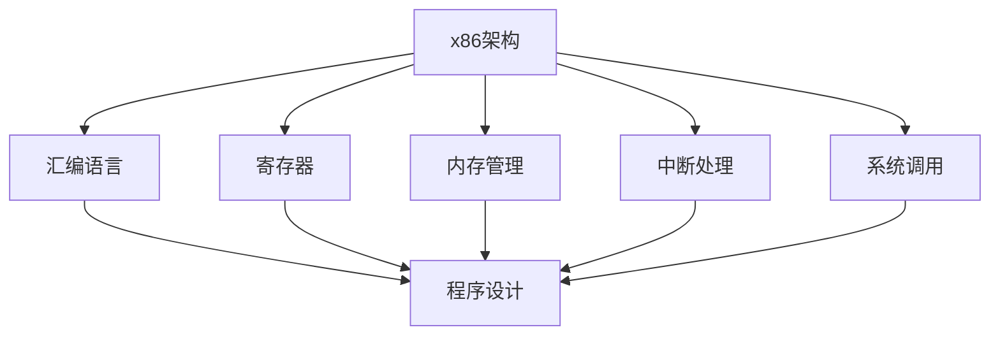

                 

# x86汇编语言程序设计

> 关键词：汇编语言, x86架构, 程序设计, 内存管理, 寄存器, 中断处理, 系统调用, 优化技术

## 1. 背景介绍

### 1.1 问题由来

在计算机科学中，汇编语言（Assembly Language）作为低级编程语言，直接与机器硬件交互。它为程序员提供了对计算机底层架构的深入理解，是开发操作系统、驱动程序、嵌入式系统等关键应用程序的基石。随着计算机体系结构的不断发展，x86架构的指令集从最初的8086演变为今天的x86-64，汇编语言也在不断进化，以适应新的硬件特性和编程需求。

### 1.2 问题核心关键点

x86汇编语言程序设计的核心关键点包括：

- 理解x86架构的硬件特性和指令集。
- 掌握汇编语言的语法和编程技巧。
- 熟悉内存管理、寄存器操作、中断处理等底层编程技术。
- 精通系统调用的实现和应用。
- 掌握优化的基本方法和技巧。

这些关键点构成了x86汇编语言程序设计的核心，是程序员必备的知识体系。

## 2. 核心概念与联系

### 2.1 核心概念概述

为更好地理解x86汇编语言程序设计，本节将介绍几个密切相关的核心概念：

- x86架构：指英特尔开发的x86系列微处理器架构，包括x86、x86-32、x86-64等不同版本。x86架构的处理器被广泛应用于个人电脑、服务器、嵌入式系统等。
- 汇编语言：是一种低级编程语言，它直接与计算机的机器代码对应。汇编语言使用助记符来表示指令，是高级语言和机器代码之间的桥梁。
- 寄存器：x86架构的寄存器包括通用寄存器、控制寄存器和状态寄存器，用于存储程序运行中的数据和控制信息。
- 内存管理：包括内存分配、访问、保护等技术，是程序设计和运行中的重要组成部分。
- 中断处理：x86架构提供中断机制，用于响应硬件事件和软件请求。
- 系统调用：操作系统提供的一组接口函数，用于访问硬件资源和操作系统服务。

这些核心概念之间的逻辑关系可以通过以下Mermaid流程图来展示：



这个流程图展示了许多x86汇编语言程序设计的关键概念及其之间的关系：

1. x86架构提供了硬件支持和指令集，汇编语言作为其程序设计的语言。
2. 寄存器、内存管理、中断处理、系统调用等技术，都是汇编语言设计中需要掌握的核心。
3. 汇编语言的设计和实现，直接依赖于这些底层技术，是连接硬件和软件的桥梁。

## 3. 核心算法原理 & 具体操作步骤
### 3.1 算法原理概述

x86汇编语言程序设计的核心算法原理基于计算机硬件的特性和指令集的规范。其主要步骤如下：

1. 理解x86架构的指令集和硬件特性。
2. 设计程序逻辑，选择合适的寄存器和内存地址。
3. 编写汇编代码，实现程序功能和性能优化。
4. 编译和链接程序，生成可执行文件。
5. 运行程序，验证其正确性和效率。

### 3.2 算法步骤详解

以下将详细介绍x86汇编语言程序设计的具体步骤：

**Step 1: 理解x86架构**

x86架构包括多种版本的处理器，从最早的8086到现代的x86-64。不同版本的指令集和寄存器特性有所不同。初学者需要了解CPU的内部结构和主要功能，包括寄存器、内存、IO接口等。同时需要掌握x86指令集的规范，如INTR、MOV、ADD等基本指令。

**Step 2: 设计程序逻辑**

根据应用程序的需求，设计程序逻辑。包括确定程序的入口点、程序的结构、变量的存储位置、函数的调用关系等。在汇编语言中，通常使用伪指令来定义程序结构和变量。

**Step 3: 编写汇编代码**

根据程序逻辑，使用汇编语言编写代码。汇编代码主要由指令和伪指令组成，指令用于实现程序的功能，伪指令用于定义程序的组成部分。

**Step 4: 编译和链接程序**

将汇编代码编译成目标代码，然后使用链接器将目标代码链接成可执行文件。编译器和链接器负责将汇编语言翻译成机器语言，并进行必要的优化。

**Step 5: 运行程序**

将可执行文件加载到内存中，启动程序运行。程序运行过程中，需要动态管理内存、调度寄存器、处理中断等，以保证程序的稳定性和性能。

### 3.3 算法优缺点

x86汇编语言程序设计的优点包括：

- 直接与硬件交互，优化空间大。
- 可以实现复杂的数据结构和高性能计算。
- 支持低级操作和系统调用，灵活性高。

缺点包括：

- 编程难度高，容易出错。
- 可读性和可维护性差。
- 依赖硬件特性，移植性差。

### 3.4 算法应用领域

x86汇编语言程序设计在多个领域中得到广泛应用，包括：

- 操作系统开发：操作系统内核、驱动程序、内存管理等。
- 嵌入式系统：芯片设计、固件编写等。
- 系统优化：程序性能调优、编译器优化等。
- 安全防护：反病毒软件、防火墙、加密算法等。

## 4. 数学模型和公式 & 详细讲解 & 举例说明

### 4.1 数学模型构建

x86汇编语言程序设计中的数学模型主要涉及数据结构、算法优化等。以数组操作为例，我们定义一个数组a，其长度为n，每个元素占用4字节，初始化为0。

数学模型为：

$$
a_i = \sum_{j=0}^{n-1} b_j
$$

其中，$b_j$ 为第j个元素的值。

### 4.2 公式推导过程

假设数组a和数组b的内存地址分别为aPtr和bPtr，则数组a的每个元素可以通过以下公式计算：

$$
a_i = \sum_{j=0}^{n-1} b_j
$$

其中，$i$ 为数组下标，$n$ 为数组长度。

### 4.3 案例分析与讲解

在实际的汇编语言程序中，可以使用MOV指令将b数组的值加载到寄存器中，然后使用LOOP指令进行累加计算。

```assembly
mov esi, bPtr
mov ecx, n
mov eax, 0

loop:
    mov ebx, [esi]
    add eax, ebx
    add esi, 4
    dec ecx
    cmp ecx, 0
    jnz loop
```

上述代码中，esi和ecx分别用于存储b数组的指针和长度，eax用于存储累加结果。使用loop指令循环累加b数组的值，每次循环将数组下标加4，长度减1，直到长度为0时退出循环。

## 5. 项目实践：代码实例和详细解释说明

### 5.1 开发环境搭建

在开始汇编语言程序设计之前，需要配置好开发环境。以下是一个基本的开发环境搭建流程：

1. 安装Microsoft Visual Studio：这是一个集成开发环境，支持x86汇编语言编译和调试。
2. 配置调试环境：在Visual Studio中设置断点、单步执行等调试选项。
3. 创建新的汇编程序项目：选择文件 -> 新建 -> 汇编程序项目。
4. 编写和调试代码：在Visual Studio中编写汇编代码，并使用调试工具检查程序执行情况。

### 5.2 源代码详细实现

以下是一个简单的x86汇编语言程序示例，用于计算数组的和：

```assembly
section .data
    array db 1, 2, 3, 4, 5
    length equ 5

section .text
    global _start

_start:
    mov esi, array
    mov ecx, length
    mov eax, 0

loop:
    mov ebx, [esi]
    add eax, ebx
    add esi, 2
    dec ecx
    cmp ecx, 0
    jnz loop

    ; 输出结果
    mov ebx, eax
    mov eax, 4
    mov edx, 1
    int 0x80

    ; 退出程序
    mov eax, 1
    xor ebx, ebx
    int 0x80
```

上述代码中，array数组的元素长度为5，每个元素占用1字节。程序使用MOV指令将数组元素加载到寄存器中，使用ADD指令进行累加计算。最后使用INT指令调用系统调用，输出计算结果并退出程序。

### 5.3 代码解读与分析

- 代码中使用了数据段和代码段，分别存储数组和程序逻辑。
- 使用MOV指令将数组元素加载到寄存器中，使用ADD指令进行累加计算。
- 使用INT指令调用系统调用，输出计算结果。
- 使用JMP、JZ等指令进行流程控制，保证程序正确执行。

### 5.4 运行结果展示

在Visual Studio中编译和运行上述代码，输出结果为数组的和15。

## 6. 实际应用场景

### 6.1 操作系统开发

x86汇编语言程序设计在操作系统开发中扮演重要角色。操作系统内核、驱动程序、内存管理等关键组件，都需要使用汇编语言进行实现。例如，Linux内核的内存管理模块，使用汇编语言实现了页表和虚拟内存的映射和管理。

### 6.2 嵌入式系统

x86汇编语言程序设计在嵌入式系统中也有广泛应用。嵌入式设备通常资源有限，需要高效利用内存和计算资源。使用汇编语言可以实现复杂的数据结构和算法优化，提高程序的性能和稳定性。

### 6.3 系统优化

x86汇编语言程序设计还用于系统优化，如编译器优化、程序性能调优等。通过直接与硬件交互，可以在不同层次上实现更高效的算法和数据结构。例如，Intel的TBB库就使用了汇编语言实现并发算法，提高了并行处理的效率。

### 6.4 安全防护

x86汇编语言程序设计还用于安全防护，如反病毒软件、防火墙、加密算法等。使用汇编语言可以实现更底层的控制和防护，增强系统的安全性。例如，RSA加密算法就使用了汇编语言进行优化，提高了加密速度和效率。

## 7. 工具和资源推荐

### 7.1 学习资源推荐

为了帮助开发者系统掌握x86汇编语言程序设计，这里推荐一些优质的学习资源：

1. 《x86 Assembly Language Programming》：由Dennis Ritchie和Brian Kernighan编写的经典著作，全面介绍了x86汇编语言的编程技巧和优化方法。
2. 《x86 Assembly Language and Architecture》：由Robert N. Murga编写的教材，深入浅出地讲解了x86架构和汇编语言的原理和应用。
3. 《Assembly Language for Intel x86 Processors》：由W.H. Stehardt编写的教材，涵盖了x86指令集和程序设计的详细内容。
4. 《Assembly Language Programming》：由David M. Torrance编写的教材，适合初学者入门，涵盖基本指令和编程技巧。
5. 《x86 Assembly Language Programming: A Tutorial》：由Michael M. Leach编写的教程，通过实际案例讲解x86汇编语言的应用。

通过对这些资源的学习实践，相信你一定能够快速掌握x86汇编语言程序设计的精髓，并用于解决实际的编程问题。

### 7.2 开发工具推荐

高效的开发离不开优秀的工具支持。以下是几款用于x86汇编语言程序设计开发的常用工具：

1. Microsoft Visual Studio：支持x86汇编语言编译和调试，集成化开发环境，适合Windows平台。
2. NASM（Netwide Assembler）：开源汇编语言编译器，支持x86、x86-64等指令集，适合Linux平台。
3. Yasm（Yet Another Assembler）：开源汇编语言编译器，支持多种操作系统和指令集，支持GDB调试。
4. IDA Pro：专业的反汇编和调试工具，支持多种处理器架构，适合复杂程序的调试和分析。
5. Ghidra：开源逆向工程工具，支持多种处理器架构，支持自动生成汇编代码和符号表。

合理利用这些工具，可以显著提升x86汇编语言程序设计的开发效率，加快创新迭代的步伐。

### 7.3 相关论文推荐

x86汇编语言程序设计的相关研究领域涉及计算机体系结构、操作系统、安全防护等多个方向，以下是几篇奠基性的相关论文，推荐阅读：

1. "x86 Architecture and Programming" by Paul E. McKenney：详细介绍了x86架构和汇编语言的设计和实现。
2. "System Programming for the x86 Family" by Daniel J. Smith：讲解了x86架构下的系统编程技术，包括内存管理、系统调用等。
3. "Optimizing x86 Assembly Code" by Richard Leggett：介绍了x86汇编代码的优化技巧，包括循环优化、数据结构优化等。
4. "Secure Assembly Code" by John A. Bews：讲解了x86汇编语言在安全防护中的应用，包括加密算法、反病毒软件等。
5. "x86 Assembly Language and Architecture" by Robert N. Murga：全面介绍了x86架构和汇编语言的基本原理和应用。

这些论文代表了大语言模型微调技术的发展脉络。通过学习这些前沿成果，可以帮助研究者把握学科前进方向，激发更多的创新灵感。

## 8. 总结：未来发展趋势与挑战

### 8.1 总结

本文对x86汇编语言程序设计进行了全面系统的介绍。首先阐述了x86架构和汇编语言的研究背景和意义，明确了汇编语言在操作系统、嵌入式系统、系统优化和安全防护等领域的应用价值。其次，从原理到实践，详细讲解了x86汇编语言的数学模型、算法步骤和具体实现，给出了实际编程的代码示例。同时，本文还广泛探讨了汇编语言程序设计的实际应用场景，展示了其在计算机体系结构和安全防护等领域的重要作用。此外，本文精选了汇编语言程序设计的各类学习资源，力求为读者提供全方位的技术指引。

通过本文的系统梳理，可以看到，x86汇编语言程序设计作为计算机编程的基础，直接与计算机硬件交互，是开发高性能、安全可靠程序的关键技术。掌握x86汇编语言，对于深入理解计算机体系结构、优化系统性能、实现复杂算法等方面都具有重要意义。

### 8.2 未来发展趋势

展望未来，x86汇编语言程序设计将呈现以下几个发展趋势：

1. 向多核、分布式系统扩展：未来处理器架构将更加复杂，汇编语言需要支持多核、分布式系统，实现高效的并行处理。
2. 支持更先进的编程模型：如并发编程、异步编程等，提高程序的执行效率和稳定性。
3. 支持更多的处理器架构：汇编语言需要支持更多处理器架构，包括ARM、MIPS等，实现跨平台开发。
4. 引入更多高级特性：如向量指令、分支预测、缓存优化等，提高程序性能和可维护性。
5. 应用场景更加广泛：汇编语言在计算机体系结构、嵌入式系统、安全防护等领域的应用将更加深入，助力新领域的技术创新。

以上趋势凸显了x86汇编语言程序设计技术的广阔前景。这些方向的探索发展，必将进一步提升程序设计的灵活性和效率，推动计算机科学的发展。

### 8.3 面临的挑战

尽管x86汇编语言程序设计技术已经取得了瞩目成就，但在迈向更加智能化、普适化应用的过程中，它仍面临着诸多挑战：

1. 编程难度高：汇编语言需要深入理解硬件特性和指令集，学习成本较高。
2. 可读性和可维护性差：汇编代码复杂，不易于理解和调试。
3. 依赖硬件特性：汇编语言需要依赖具体硬件特性，跨平台支持有限。
4. 代码重用性低：不同平台和架构的汇编代码无法直接移植。
5. 工具链支持不足：汇编语言的工具链和开发环境不完善，开发效率较低。

尽管存在这些挑战，但随着技术的不断进步和工具的不断完善，x86汇编语言程序设计必将在多个领域继续发挥重要作用，为计算机科学的发展贡献力量。

### 8.4 研究展望

未来的研究需要在以下几个方面寻求新的突破：

1. 提高可读性和可维护性：通过引入更高层次的抽象和设计模式，提高汇编代码的可读性和可维护性。
2. 支持更多平台和架构：开发跨平台和跨架构的汇编语言工具链，实现代码重用。
3. 引入高级特性：如编译器优化、自动代码生成等，提高程序效率和性能。
4. 应用场景拓展：拓展汇编语言在人工智能、区块链、物联网等领域的应用。

这些研究方向将推动x86汇编语言程序设计技术的不断进步，为计算机科学和工程实践提供更强大的工具和手段。

## 9. 附录：常见问题与解答

**Q1：汇编语言和高级语言有什么区别？**

A: 汇编语言是低级编程语言，直接与计算机硬件交互，需要程序员手动管理内存和寄存器等资源。而高级语言是抽象的编程语言，通过编译器将代码翻译成机器代码，使用自动化的资源管理，方便程序员编写程序。

**Q2：x86汇编语言和x86-64汇编语言有什么区别？**

A: x86汇编语言和x86-64汇编语言的区别主要在于指令集和寄存器特性。x86-64汇编语言支持更多的寄存器和指令，可以处理更大的数据类型和更多的数据类型。但两者的语法和编程技巧基本相同，都可以使用MOV、ADD、MOVZX等基本指令。

**Q3：如何提高x86汇编程序的性能？**

A: 提高x86汇编程序的性能可以从以下几个方面入手：
1. 优化数据结构：使用更高效的内存布局和数据类型，减少内存访问和数据传输。
2. 优化算法：使用更高效的算法和数据结构，减少计算量和时间复杂度。
3. 使用向量指令：使用SIMD指令集，提高数据处理效率。
4. 使用循环展开和分支预测：优化循环和分支结构，减少缓存失效和分支预测错误。
5. 使用优化工具：使用编译器优化工具，自动进行优化代码生成。

这些方法都需要在具体的编程场景中进行灵活应用，根据实际情况进行调整。

**Q4：x86汇编语言是否还有发展的空间？**

A: x86汇编语言作为低级编程语言，直接与计算机硬件交互，具有独特的优势和劣势。未来随着硬件的发展和软件需求的提高，汇编语言仍有广泛的应用空间。在操作系统、嵌入式系统、系统优化和安全防护等领域，汇编语言仍将发挥重要作用。同时，随着自动化工具和高级编程模型的不断进步，汇编语言的开发效率和可维护性也将得到改善，推动其向更高层次发展。

