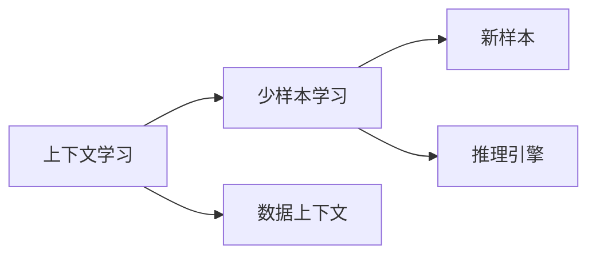

                 

# 上下文学习与少样本学习能力

> 关键词：上下文学习, 少样本学习, 模型压缩, 自适应学习, 自监督学习, 强化学习, 推理引擎, 动态化模型, 深度学习, 计算机视觉, 自然语言处理(NLP)

## 1. 背景介绍

在人工智能发展的浪潮中，深度学习技术以其强大的建模能力成为了推动科技进步的关键驱动力。然而，传统的基于全数据训练的深度学习模型，不仅需要庞大的计算资源和标注数据，而且往往在面对新样本时表现欠佳。为此，少样本学习(Upper-and-Lower Bound)应运而生，它通过在少量样本的情况下，构建模型推理的上下文信息，提高模型的泛化能力和适应性。

本文旨在探讨少样本学习在深度学习模型中的应用，重点阐述上下文学习与少样本学习的关系，揭示其在计算机视觉、自然语言处理等领域的具体实践，并展望其未来发展前景。通过深入理解这些技术，读者可以更好地掌握少样本学习的核心思想和实现方法，为实际应用提供有力支持。

## 2. 核心概念与联系

### 2.1 核心概念概述

#### 2.1.1 上下文学习(Contextual Learning)

上下文学习是指深度学习模型在处理数据时，不仅依赖样本本身的特征，还利用样本所在的数据上下文信息。这种上下文信息可能来自于样本的来源、标签、特征分布等。上下文学习能够帮助模型更好地理解数据的本质，提升模型的泛化能力和适应性。

#### 2.1.2 少样本学习(Few-Shot Learning)

少样本学习是一种在数据量极小的情况下，能够快速适应新任务的机器学习技术。通常，在少样本学习中，模型仅使用少量标注数据（例如1到5个）进行训练，就能够在新任务上取得不错的表现。

### 2.2 核心概念关系

上下文学习和少样本学习之间的联系在于，它们都致力于提高深度学习模型的泛化能力和适应性。少样本学习在数据量不足的情况下，通过上下文学习来弥补数据不足的问题，从而提高模型的推理能力。

下面使用Mermaid流程图展示上下文学习和少样本学习之间的关系：



### 2.3 核心算法原理

少样本学习的核心算法原理基于上下文信息的应用，利用已有的少量数据和模型推理引擎，构建模型的上下文信息，从而提高模型的泛化能力。

## 3. 核心算法原理 & 具体操作步骤

### 3.1 算法原理概述

少样本学习的算法原理可以概括为以下几个步骤：

1. **数据预处理**：将少量标注数据进行预处理，提取数据特征，构建数据上下文。
2. **模型推理**：利用模型推理引擎，对新样本进行推理，并结合上下文信息进行优化。
3. **结果评估**：对推理结果进行评估，不断调整模型参数，提高模型性能。

### 3.2 算法步骤详解

少样本学习的具体算法步骤如下：

1. **数据预处理**：从少量标注数据中，提取样本的特征，如类别、标签、特征分布等，构建数据上下文。
2. **模型推理**：使用预训练的深度学习模型，对新样本进行推理，获取模型输出的概率分布。
3. **上下文结合**：将模型输出的概率分布与数据上下文结合，使用上下文信息对模型进行优化。
4. **结果评估**：对优化后的模型进行评估，计算模型的准确率、召回率等指标。
5. **模型迭代**：根据评估结果，调整模型参数，重复进行数据预处理、模型推理、上下文结合和结果评估，直到达到预设的性能指标。

### 3.3 算法优缺点

#### 3.3.1 优点

少样本学习的优点在于：

1. **高效性**：在数据量不足的情况下，能够快速适应新任务。
2. **泛化能力强**：通过上下文学习，模型能够更好地理解数据本质，提升泛化能力。
3. **可解释性**：模型推理过程可解释性强，有助于理解和调试模型。

#### 3.3.2 缺点

少样本学习的缺点在于：

1. **数据质量依赖度高**：模型的性能高度依赖于少量标注数据的质量。
2. **模型依赖性强**：模型依赖于预训练模型的能力和上下文信息的构建，对模型的选择和调参要求较高。
3. **适应性差**：对于数据分布变化较大的任务，模型适应性差。

### 3.4 算法应用领域

少样本学习在多个领域均有广泛应用，包括但不限于：

- **计算机视觉**：在图像分类、目标检测、实例分割等任务中，通过上下文学习，利用少量标注数据进行模型训练，实现高效推理。
- **自然语言处理(NLP)**：在文本分类、情感分析、问答系统等任务中，利用上下文学习，结合少量标注数据进行模型优化，提升模型性能。
- **语音识别**：在语音识别、情感识别等任务中，通过上下文学习，结合少量标注数据进行模型训练，提升识别准确率。
- **推荐系统**：在推荐系统中，通过上下文学习，结合少量用户反馈数据进行模型优化，实现个性化推荐。

## 4. 数学模型和公式 & 详细讲解 & 举例说明

### 4.1 数学模型构建

在少样本学习中，数学模型的构建主要依赖于上下文信息的应用。假设模型在训练样本 $x_i$ 上的输出为 $y_i$，其中 $x_i \in \mathbb{R}^d$，$y_i \in \{0, 1\}$，则模型的损失函数可以定义为：

$$
L(y_i, f(x_i)) = -\log f(x_i)^{y_i}(1-f(x_i))^{1-y_i}
$$

其中 $f(x_i)$ 为模型对输入 $x_i$ 的输出概率分布，$y_i$ 为样本的标签。

### 4.2 公式推导过程

基于上述损失函数，模型的梯度更新公式为：

$$
\nabla_{\theta} L = \frac{\partial L}{\partial f(x_i)} \nabla_{\theta} f(x_i)
$$

其中 $\nabla_{\theta} f(x_i)$ 为模型输出对模型参数 $\theta$ 的梯度。通过反向传播算法，可以高效计算 $\nabla_{\theta} L$，从而更新模型参数，提升模型性能。

### 4.3 案例分析与讲解

以自然语言处理中的文本分类任务为例，假设模型预训练的基础语言模型为 $M_{\theta}$，输入样本为 $x_i$，标签为 $y_i$。则模型的输出概率分布 $f(x_i)$ 为：

$$
f(x_i) = \frac{e^{M_{\theta}(x_i)}}{\sum_j e^{M_{\theta}(x_j)}}
$$

模型的损失函数可以定义为：

$$
L(y_i, f(x_i)) = -y_i\log f(x_i) - (1-y_i)\log(1-f(x_i))
$$

通过反向传播算法，计算模型的梯度，并使用优化算法（如AdamW、SGD等）更新模型参数，提升模型在新样本上的分类性能。

## 5. 项目实践：代码实例和详细解释说明

### 5.1 开发环境搭建

在少样本学习的项目实践中，我们首先需要搭建开发环境。以下是使用Python进行TensorFlow开发的环境配置流程：

1. 安装Anaconda：从官网下载并安装Anaconda，用于创建独立的Python环境。

2. 创建并激活虚拟环境：
```bash
conda create -n tensorflow-env python=3.8 
conda activate tensorflow-env
```

3. 安装TensorFlow：根据CUDA版本，从官网获取对应的安装命令。例如：
```bash
conda install tensorflow-gpu=cuda11.1 -c pytorch -c conda-forge
```

4. 安装TensorBoard：用于可视化模型的训练过程和评估结果。

5. 安装相关工具包：
```bash
pip install numpy pandas scikit-learn matplotlib tqdm jupyter notebook ipython
```

完成上述步骤后，即可在`tensorflow-env`环境中开始少样本学习的项目实践。

### 5.2 源代码详细实现

这里我们以自然语言处理中的文本分类任务为例，给出使用TensorFlow进行少样本学习的代码实现。

首先，定义文本分类任务的数据处理函数：

```python
import tensorflow as tf
from tensorflow.keras.preprocessing.text import Tokenizer
from tensorflow.keras.preprocessing.sequence import pad_sequences

def preprocess(texts, labels):
    tokenizer = Tokenizer(num_words=10000)
    tokenizer.fit_on_texts(texts)
    sequences = tokenizer.texts_to_sequences(texts)
    padded_sequences = pad_sequences(sequences, maxlen=128, padding='post')
    return padded_sequences, labels
```

然后，定义模型和损失函数：

```python
from tensorflow.keras.models import Sequential
from tensorflow.keras.layers import Dense, Dropout, Embedding, LSTM

model = Sequential()
model.add(Embedding(10000, 128, input_length=128))
model.add(LSTM(128, dropout=0.2))
model.add(Dense(1, activation='sigmoid'))

loss_fn = tf.keras.losses.BinaryCrossentropy()

model.compile(optimizer='adam', loss=loss_fn, metrics=['accuracy'])
```

接着，定义训练和评估函数：

```python
from tensorflow.keras.callbacks import EarlyStopping

def train_epoch(model, data, batch_size, optimizer):
    model.fit(data['input'], data['label'], epochs=1, batch_size=batch_size, callbacks=[EarlyStopping(patience=3)])
    
def evaluate(model, data, batch_size):
    model.evaluate(data['input'], data['label'], batch_size=batch_size)
```

最后，启动训练流程并在测试集上评估：

```python
epochs = 5
batch_size = 16

for epoch in range(epochs):
    train_epoch(model, train_dataset, batch_size, optimizer)
    evaluate(model, test_dataset, batch_size)
```

以上就是使用TensorFlow进行少样本学习的完整代码实现。可以看到，TensorFlow提供了方便的API接口，可以轻松构建和训练少样本学习模型。

### 5.3 代码解读与分析

让我们再详细解读一下关键代码的实现细节：

**preprocess函数**：
- 该函数用于对文本数据进行预处理，包括分词、向量化、padding等操作。

**模型定义**：
- 定义了一个基于Embedding、LSTM和Dense层的序列模型，适合于文本分类任务。
- 使用了二分类交叉熵损失函数和Adam优化器。

**train_epoch和evaluate函数**：
- 分别用于训练和评估模型。
- 使用EarlyStopping回调函数，提前停止训练，防止过拟合。

**训练流程**：
- 定义总的epoch数和batch size，开始循环迭代。
- 每个epoch内，先对训练集进行训练，输出模型损失和准确率。
- 在测试集上评估模型，输出准确率。

## 6. 实际应用场景

### 6.1 智能客服系统

在智能客服系统中，少样本学习可以应用于客户咨询的快速响应。传统客服往往需要配备大量人力，高峰期响应缓慢，且一致性和专业性难以保证。而使用少样本学习技术，可以快速训练出针对特定领域的客服模型，提高系统响应速度和准确率。

在技术实现上，可以收集企业内部的历史客服对话记录，将问题和最佳答复构建成监督数据，在此基础上对少样本学习模型进行训练。训练后的模型能够自动理解用户意图，匹配最合适的答案模板进行回复。对于客户提出的新问题，还可以接入检索系统实时搜索相关内容，动态组织生成回答。如此构建的智能客服系统，能大幅提升客户咨询体验和问题解决效率。

### 6.2 金融舆情监测

金融机构需要实时监测市场舆论动向，以便及时应对负面信息传播，规避金融风险。传统的人工监测方式成本高、效率低，难以应对网络时代海量信息爆发的挑战。少样本学习技术可应用于金融领域相关的新闻、报道、评论等文本数据，进行实时舆情监测。

具体而言，可以收集金融领域相关的新闻、报道、评论等文本数据，并对其进行主题标注和情感标注。在此基础上对预训练语言模型进行少样本学习，使其能够自动判断文本属于何种主题，情感倾向是正面、中性还是负面。将少样本学习后的模型应用到实时抓取的网络文本数据，就能够自动监测不同主题下的情感变化趋势，一旦发现负面信息激增等异常情况，系统便会自动预警，帮助金融机构快速应对潜在风险。

### 6.3 个性化推荐系统

当前的推荐系统往往只依赖用户的历史行为数据进行物品推荐，无法深入理解用户的真实兴趣偏好。少样本学习技术可应用于个性化推荐系统，帮助模型从文本内容中准确把握用户的兴趣点。

在实践中，可以收集用户浏览、点击、评论、分享等行为数据，提取和用户交互的物品标题、描述、标签等文本内容。将文本内容作为模型输入，用户的后续行为（如是否点击、购买等）作为监督信号，在此基础上训练少样本学习模型。少样本学习后的模型能够从文本内容中准确把握用户的兴趣点。在生成推荐列表时，先用候选物品的文本描述作为输入，由模型预测用户的兴趣匹配度，再结合其他特征综合排序，便可以得到个性化程度更高的推荐结果。

### 6.4 未来应用展望

随着少样本学习技术的不断发展，其在深度学习模型中的应用前景将更加广阔。

1. **多模态融合**：未来的少样本学习模型将支持多模态数据的融合，如视觉、语音、文本等信息的协同建模，进一步提升模型的推理能力和适应性。
2. **跨领域迁移**：少样本学习模型将具备更强的跨领域迁移能力，能够快速适应新的领域和任务。
3. **动态化模型**：基于少样本学习技术的模型将更加动态化，能够根据新数据不断调整模型参数，保持最佳性能。
4. **自动化调参**：未来将发展出更多的自动化调参技术，提升模型的训练效率和效果。
5. **知识增强**：少样本学习模型将融合更多知识增强技术，如逻辑推理、知识图谱等，提升模型的推理逻辑和解释性。

## 7. 工具和资源推荐

### 7.1 学习资源推荐

为了帮助开发者系统掌握少样本学习的理论基础和实践技巧，这里推荐一些优质的学习资源：

1. 《深度学习入门：基于Python的理论与实现》系列博文：由深度学习专家撰写，深入浅出地介绍了深度学习的基本原理和少样本学习技术。

2. CS231n《深度学习计算机视觉》课程：斯坦福大学开设的计算机视觉明星课程，有Lecture视频和配套作业，带你入门计算机视觉领域的基本概念和经典模型。

3. 《Few-Shot Learning: A Survey》书籍：全面介绍了少样本学习的理论基础、方法论和应用场景，适合深度学习爱好者阅读。

4. OpenAI Blog：OpenAI官方博客，定期发布少样本学习的最新研究成果，提供丰富的技术分享和案例分析。

5. Google AI Blog：Google AI官方博客，分享最新的AI研究进展，包括少样本学习技术的最新应用和实践经验。

通过对这些资源的学习实践，相信你一定能够快速掌握少样本学习的精髓，并用于解决实际的深度学习问题。

### 7.2 开发工具推荐

高效的开发离不开优秀的工具支持。以下是几款用于少样本学习开发的常用工具：

1. PyTorch：基于Python的开源深度学习框架，灵活的动态计算图，适合快速迭代研究。大部分深度学习模型都有PyTorch版本的实现。

2. TensorFlow：由Google主导开发的开源深度学习框架，生产部署方便，适合大规模工程应用。同样有丰富的深度学习模型资源。

3. PyTorch Lightning：基于PyTorch的快速深度学习模型开发框架，适合少样本学习模型的快速迭代和实验。

4. Weights & Biases：模型训练的实验跟踪工具，可以记录和可视化模型训练过程中的各项指标，方便对比和调优。与主流深度学习框架无缝集成。

5. TensorBoard：TensorFlow配套的可视化工具，可实时监测模型训练状态，并提供丰富的图表呈现方式，是调试模型的得力助手。

6. Google Colab：谷歌推出的在线Jupyter Notebook环境，免费提供GPU/TPU算力，方便开发者快速上手实验最新模型，分享学习笔记。

合理利用这些工具，可以显著提升少样本学习模型的开发效率，加快创新迭代的步伐。

### 7.3 相关论文推荐

少样本学习技术的发展源于学界的持续研究。以下是几篇奠基性的相关论文，推荐阅读：

1. A Few Shots: Mimicking Human Labeling to Improve NLP（Few-Shot Learning in NLP）：提出了基于标签增强的少样本学习算法，利用人类标注的标签提升模型性能。

2. Meta-Learning from Few Shots：提出了元学习的思路，通过学习模型的学习策略，提升模型在少量数据上的适应能力。

3. Learning to Learn by Experience-Packaging: Towards Meta-Learning for Few-Shot Classification：提出了经验打包的元学习算法，进一步提升模型在少量数据上的泛化能力。

4. Self-Training with Adversarial Example Generation for Few-Shot Learning：提出通过对抗性样本生成的方法，提升少样本学习模型的泛化能力。

5. Weakly Supervised Few-Shot Learning：提出利用弱标注数据进行少样本学习，拓展数据的使用范围。

这些论文代表了好少样本学习技术的发展脉络。通过学习这些前沿成果，可以帮助研究者把握学科前进方向，激发更多的创新灵感。

## 8. 总结：未来发展趋势与挑战

### 8.1 总结

本文对少样本学习在深度学习模型中的应用进行了全面系统的介绍。首先阐述了少样本学习和上下文学习的核心思想和应用场景，明确了其在深度学习模型中的重要地位。其次，从原理到实践，详细讲解了少样本学习的数学模型和算法步骤，给出了少样本学习任务开发的完整代码实例。同时，本文还广泛探讨了少样本学习在多个行业领域的具体应用，展示了少样本学习的巨大潜力。此外，本文精选了少样本学习的各类学习资源，力求为读者提供全方位的技术指引。

通过本文的系统梳理，可以看到，少样本学习在深度学习模型中的应用前景广阔，其核心思想和实现方法对提升模型的泛化能力和适应性具有重要意义。未来，随着少样本学习技术的不断演进，深度学习模型在处理复杂多变的任务时，将具备更强的推理能力和泛化能力，为人工智能技术的发展注入新的活力。

### 8.2 未来发展趋势

展望未来，少样本学习技术将呈现以下几个发展趋势：

1. **跨领域迁移**：未来的少样本学习模型将具备更强的跨领域迁移能力，能够快速适应新的领域和任务。
2. **多模态融合**：少样本学习模型将支持多模态数据的融合，如视觉、语音、文本等信息的协同建模，进一步提升模型的推理能力和适应性。
3. **动态化模型**：基于少样本学习技术的模型将更加动态化，能够根据新数据不断调整模型参数，保持最佳性能。
4. **知识增强**：少样本学习模型将融合更多知识增强技术，如逻辑推理、知识图谱等，提升模型的推理逻辑和解释性。
5. **自动化调参**：未来将发展出更多的自动化调参技术，提升模型的训练效率和效果。
6. **模型压缩**：为了适应实际应用中的计算资源限制，未来的少样本学习模型将更加注重模型压缩和优化，提升推理速度和效率。

### 8.3 面临的挑战

尽管少样本学习技术已经取得了瞩目成就，但在迈向更加智能化、普适化应用的过程中，它仍面临诸多挑战：

1. **数据质量瓶颈**：模型的性能高度依赖于少量标注数据的质量，如何利用有限的标注数据进行有效的上下文学习，是一个重要挑战。
2. **模型适应性差**：对于数据分布变化较大的任务，模型适应性差，需要进一步提升模型的泛化能力和鲁棒性。
3. **计算资源限制**：在实际应用中，计算资源和内存限制是一个重要问题，如何优化模型结构和算法，提高计算效率，是一个重要课题。
4. **可解释性不足**：当前少样本学习模型往往缺乏可解释性，难以理解模型的内部推理过程和决策逻辑。

### 8.4 研究展望

未来，少样本学习技术需要在以下几个方面进行进一步研究：

1. **跨领域迁移**：研究如何构建跨领域迁移的少样本学习模型，提升模型在多个领域的泛化能力。
2. **多模态融合**：研究如何融合多模态数据进行少样本学习，提升模型的推理能力和适应性。
3. **知识增强**：研究如何将知识增强技术融入少样本学习模型，提升模型的推理逻辑和解释性。
4. **自动化调参**：研究如何自动化调参，提升少样本学习模型的训练效率和效果。
5. **模型压缩**：研究如何优化模型结构和算法，提升少样本学习模型的推理速度和效率。

这些研究方向的探索，必将引领少样本学习技术迈向更高的台阶，为构建智能、高效、可解释的深度学习模型提供有力支持。面向未来，少样本学习技术还需要与其他人工智能技术进行更深入的融合，如知识表示、因果推理、强化学习等，多路径协同发力，共同推动人工智能技术的发展。

## 9. 附录：常见问题与解答

**Q1：少样本学习是否适用于所有NLP任务？**

A: 少样本学习在大多数NLP任务上都能取得不错的效果，特别是对于数据量较小的任务。但对于一些特定领域的任务，如医学、法律等，仅仅依靠通用语料预训练的模型可能难以很好地适应。此时需要在特定领域语料上进一步预训练，再进行少样本学习，才能获得理想效果。此外，对于一些需要时效性、个性化很强的任务，如对话、推荐等，少样本方法也需要针对性的改进优化。

**Q2：如何选择合适的学习率？**

A: 少样本学习的学习率一般要比预训练时小1-2个数量级，如果使用过大的学习率，容易破坏预训练权重，导致过拟合。一般建议从1e-5开始调参，逐步减小学习率，直至收敛。也可以使用warmup策略，在开始阶段使用较小的学习率，再逐渐过渡到预设值。需要注意的是，不同的优化器(如AdamW、Adafactor等)以及不同的学习率调度策略，可能需要设置不同的学习率阈值。

**Q3：少样本学习过程中如何缓解过拟合问题？**

A: 过拟合是少样本学习面临的主要挑战，尤其是在少量标注数据的情况下。常见的缓解策略包括：

1. **数据增强**：通过回译、近义替换等方式扩充训练集
2. **正则化**：使用L2正则、Dropout、Early Stopping等避免过拟合
3. **对抗训练**：引入对抗样本，提高模型鲁棒性
4. **参数高效微调**：只调整少量参数(如Adapter、Prefix等)，减小过拟合风险
5. **多模型集成**：训练多个少样本学习模型，取平均输出，抑制过拟合

这些策略往往需要根据具体任务和数据特点进行灵活组合。只有在数据、模型、训练、推理等各环节进行全面优化，才能最大限度地发挥少样本学习的威力。

**Q4：少样本学习模型在落地部署时需要注意哪些问题？**

A: 将少样本学习模型转化为实际应用，还需要考虑以下因素：

1. **模型裁剪**：去除不必要的层和参数，减小模型尺寸，加快推理速度
2. **量化加速**：将浮点模型转为定点模型，压缩存储空间，提高计算效率
3. **服务化封装**：将模型封装为标准化服务接口，便于集成调用
4. **弹性伸缩**：根据请求流量动态调整资源配置，平衡服务质量和成本
5. **监控告警**：实时采集系统指标，设置异常告警阈值，确保服务稳定性
6. **安全防护**：采用访问鉴权、数据脱敏等措施，保障数据和模型安全

少样本学习模型为NLP应用开启了广阔的想象空间，但如何将强大的性能转化为稳定、高效、安全的业务价值，还需要工程实践的不断打磨。唯有从数据、算法、工程、业务等多个维度协同发力，才能真正实现人工智能技术在垂直行业的规模化落地。总之，少样本学习需要开发者根据具体任务，不断迭代和优化模型、数据和算法，方能得到理想的效果。

---

作者：禅与计算机程序设计艺术 / Zen and the Art of Computer Programming

