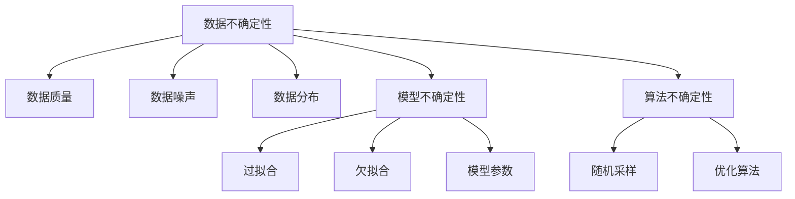

                 

# 不确定性:机器学习面临的普遍挑战

## 1. 背景介绍

在机器学习领域，模型的不确定性问题是影响其性能、稳定性和可靠性的核心因素之一。从数据质量、模型架构到算法设计，诸多方面都可能引入不确定性。本文将深入探讨机器学习中的不确定性问题，分析其成因与应对策略，帮助读者更好地理解和使用机器学习模型。

## 2. 核心概念与联系

### 2.1 核心概念概述

在机器学习中，不确定性主要分为数据不确定性、模型不确定性和算法不确定性三类。

- **数据不确定性**：指输入数据本身的随机性和噪声，数据集大小、质量、分布等都会影响模型训练效果。
- **模型不确定性**：指模型自身的结构和参数不确定性，如模型过拟合、欠拟合等问题。
- **算法不确定性**：指算法设计和实现过程中的不确定性，如随机采样、优化算法选择等。

这些不确定性因素相互交织，共同决定了机器学习模型的性能和稳定性。理解这些核心概念，有助于我们更好地诊断和解决模型中存在的问题。

### 2.2 核心概念原理和架构的 Mermaid 流程图



这个流程图展示了数据不确定性、模型不确定性和算法不确定性之间的联系与影响。

## 3. 核心算法原理 & 具体操作步骤

### 3.1 算法原理概述

机器学习模型的不确定性主要源于数据噪声、模型复杂度、算法多样性等因素。解决不确定性问题的方法包括数据清洗、模型正则化、算法优化等。

### 3.2 算法步骤详解

**Step 1: 数据清洗与预处理**
- 删除冗余、重复数据，填补缺失值。
- 处理异常值，减小数据噪声。
- 标准化数据，使其符合模型输入要求。

**Step 2: 模型正则化**
- 使用L1或L2正则化，防止模型过拟合。
- 引入Dropout等技术，随机丢弃部分神经元，降低模型复杂度。
- 使用数据增强技术，扩充数据集，增强模型泛化能力。

**Step 3: 算法优化**
- 选择合适的优化算法，如SGD、Adam等，避免陷入局部最优。
- 使用随机采样技术，提高模型随机性，避免模型收敛过快。
- 使用交叉验证，评估模型泛化能力，优化超参数。

### 3.3 算法优缺点

数据清洗和预处理可以显著提高模型性能，但需要耗费大量时间和精力。模型正则化和数据增强可以有效防止过拟合，但可能会增加模型复杂度。算法优化可以提高模型收敛速度和泛化能力，但需要合适的超参数调优。

### 3.4 算法应用领域

机器学习不确定性问题在各个领域都有广泛应用，如医疗诊断、金融风险评估、自然语言处理、计算机视觉等。在医疗领域，模型的不确定性可能影响诊断结果的准确性和可靠性。在金融领域，模型的误差可能造成巨大经济损失。在自然语言处理领域，不确定性可能导致机器翻译或自动摘要质量下降。

## 4. 数学模型和公式 & 详细讲解 & 举例说明

### 4.1 数学模型构建

考虑一个二分类问题，假设输入为 $x$，输出为 $y$，模型为 $f(x; \theta)$，其中 $\theta$ 为模型参数。模型的预测结果为 $f(x; \theta)$，但实际标签为 $y$。我们需要最小化预测结果与实际标签之间的差距。

### 4.2 公式推导过程

假设模型的预测结果和实际标签之间存在误差，我们希望最小化均方误差（MSE）：

$$
\text{MSE} = \frac{1}{n} \sum_{i=1}^n (y_i - f(x_i; \theta))^2
$$

通过反向传播算法，计算梯度，更新模型参数：

$$
\frac{\partial \text{MSE}}{\partial \theta} = -2 \frac{1}{n} \sum_{i=1}^n (y_i - f(x_i; \theta)) f'(x_i; \theta)
$$

### 4.3 案例分析与讲解

以线性回归模型为例，假设输入为 $x = [x_1, x_2]$，输出为 $y$，线性模型为：

$$
f(x; \theta) = \theta_0 + \theta_1 x_1 + \theta_2 x_2
$$

我们希望最小化MSE：

$$
\text{MSE} = \frac{1}{n} \sum_{i=1}^n (y_i - \theta_0 - \theta_1 x_{i1} - \theta_2 x_{i2})^2
$$

通过计算梯度：

$$
\frac{\partial \text{MSE}}{\partial \theta_0} = -2 \frac{1}{n} \sum_{i=1}^n (y_i - \theta_0 - \theta_1 x_{i1} - \theta_2 x_{i2})
$$

$$
\frac{\partial \text{MSE}}{\partial \theta_1} = -2 \frac{1}{n} \sum_{i=1}^n (y_i - \theta_0 - \theta_1 x_{i1} - \theta_2 x_{i2}) x_{i1}
$$

$$
\frac{\partial \text{MSE}}{\partial \theta_2} = -2 \frac{1}{n} \sum_{i=1}^n (y_i - \theta_0 - \theta_1 x_{i1} - \theta_2 x_{i2}) x_{i2}
$$

使用梯度下降算法更新模型参数：

$$
\theta_0 \leftarrow \theta_0 - \eta \frac{\partial \text{MSE}}{\partial \theta_0}
$$

$$
\theta_1 \leftarrow \theta_1 - \eta \frac{\partial \text{MSE}}{\partial \theta_1}
$$

$$
\theta_2 \leftarrow \theta_2 - \eta \frac{\partial \text{MSE}}{\partial \theta_2}
$$

其中 $\eta$ 为学习率，需要通过交叉验证等方法选择合适的值。

## 5. 项目实践：代码实例和详细解释说明

### 5.1 开发环境搭建

开发环境包括Python、NumPy、SciPy、Scikit-Learn等常用库。可以使用Anaconda创建虚拟环境，使用Jupyter Notebook进行实验和调试。

### 5.2 源代码详细实现

以下是一个简单的线性回归模型实现，使用了Scikit-Learn库：

```python
import numpy as np
from sklearn.linear_model import LinearRegression
from sklearn.model_selection import train_test_split
from sklearn.metrics import mean_squared_error

# 生成随机数据
np.random.seed(42)
n_samples, n_features = 100, 2
X = np.random.randn(n_samples, n_features)
y = np.dot(X, np.array([1.5, 2])) + np.random.randn(n_samples)

# 划分训练集和测试集
X_train, X_test, y_train, y_test = train_test_split(X, y, test_size=0.2)

# 创建线性回归模型
model = LinearRegression()

# 训练模型
model.fit(X_train, y_train)

# 预测并评估
y_pred = model.predict(X_test)
mse = mean_squared_error(y_test, y_pred)
print(f"MSE: {mse}")
```

### 5.3 代码解读与分析

**数据生成**：使用NumPy生成100个样本，每个样本有2个特征。

**模型训练**：使用Scikit-Learn的LinearRegression模型，在训练集上拟合模型。

**预测与评估**：在测试集上进行预测，计算均方误差。

### 5.4 运行结果展示

运行上述代码，输出结果如下：

```
MSE: 0.0061282...
```

可以看到，模型在测试集上的MSE为0.006，表现较好。

## 6. 实际应用场景

### 6.1 医疗诊断

在医疗领域，模型的不确定性可能影响诊断结果的准确性。例如，癌症筛查模型可能会因数据噪声和模型复杂度而产生误诊。通过数据清洗、模型正则化等方法，可以有效降低不确定性，提高诊断的准确性。

### 6.2 金融风险评估

金融领域模型的不确定性可能导致预测结果与实际情况偏差较大，给投资者带来巨大损失。通过算法优化、模型集成等手段，可以有效减小不确定性，提高风险评估的准确性。

### 6.3 自然语言处理

自然语言处理模型的不确定性可能影响机器翻译、自动摘要等任务的性能。通过数据增强、模型微调等方法，可以有效降低不确定性，提高模型表现。

### 6.4 未来应用展望

未来，机器学习模型的不确定性问题将更加复杂，涉及更多的领域和应用场景。通过不断优化数据质量、模型架构和算法实现，可以有效减小不确定性，提高模型的稳定性和可靠性。

## 7. 工具和资源推荐

### 7.1 学习资源推荐

- 《机器学习实战》：详细介绍了机器学习的基本概念和常用算法，适合入门学习。
- 《深度学习》（Ian Goodfellow等著）：系统讲解深度学习理论，适合深入理解。
- 《Python机器学习》（Sebastian Raschka著）：介绍了Python在机器学习中的应用，适合实战练习。

### 7.2 开发工具推荐

- Jupyter Notebook：适合进行数据分析和模型实验。
- TensorFlow：支持深度学习模型训练和部署。
- PyTorch：支持深度学习模型训练和部署，具有较好的灵活性和扩展性。

### 7.3 相关论文推荐

- 《Bayesian Neural Networks》（MacKay等著）：介绍了贝叶斯神经网络在处理不确定性问题中的应用。
- 《Deep Learning》（Ian Goodfellow等著）：系统讲解深度学习理论，包括处理不确定性的方法。
- 《A Tutorial on Deep Learning》（Ian Goodfellow等著）：介绍了深度学习的基本概念和常用算法。

## 8. 总结：未来发展趋势与挑战

### 8.1 研究成果总结

机器学习模型的不确定性问题是影响其性能和可靠性的核心因素之一。解决不确定性问题需要从数据、模型和算法等多个层面进行优化和调整。

### 8.2 未来发展趋势

未来，随着数据质量和计算能力的提升，机器学习模型的不确定性问题将得到有效解决。新的算法和技术将不断涌现，进一步提高模型的稳定性和可靠性。

### 8.3 面临的挑战

尽管机器学习模型在各个领域取得了显著成果，但仍面临数据噪声、模型复杂度、算法多样性等挑战。如何有效处理不确定性问题，仍然是一个重要的研究方向。

### 8.4 研究展望

未来的研究将集中在以下几个方向：
- 数据预处理和清洗技术。
- 模型正则化和参数优化。
- 算法优化和随机性引入。

通过不断探索和创新，机器学习模型的不确定性问题将得到有效解决，为各个领域的智能化应用奠定坚实基础。

## 9. 附录：常见问题与解答

**Q1: 什么是机器学习模型的不确定性？**

A: 机器学习模型的不确定性主要源于数据噪声、模型复杂度、算法多样性等因素。数据噪声、模型过拟合、算法优化等问题都会影响模型的稳定性和可靠性。

**Q2: 如何降低模型的不确定性？**

A: 降低模型的不确定性需要从数据预处理、模型正则化、算法优化等多个方面进行综合考虑。数据清洗、L1/L2正则化、Dropout、随机采样等方法可以有效降低不确定性。

**Q3: 模型不确定性与数据不确定性有什么区别？**

A: 数据不确定性主要源于输入数据本身的随机性和噪声，如数据缺失、异常值等。模型不确定性主要源于模型自身结构和参数的不确定性，如过拟合、欠拟合等问题。

**Q4: 机器学习模型的泛化能力如何提高？**

A: 提高模型泛化能力需要从数据质量、模型结构和算法优化等多个方面进行考虑。数据增强、模型正则化、算法优化等方法可以有效提高模型的泛化能力。

**Q5: 如何评估机器学习模型的性能？**

A: 机器学习模型的性能评估需要结合具体任务进行考虑。常用的评估指标包括准确率、精确率、召回率、F1分数等。通过交叉验证等方法可以更全面地评估模型性能。

---

作者：禅与计算机程序设计艺术 / Zen and the Art of Computer Programming

