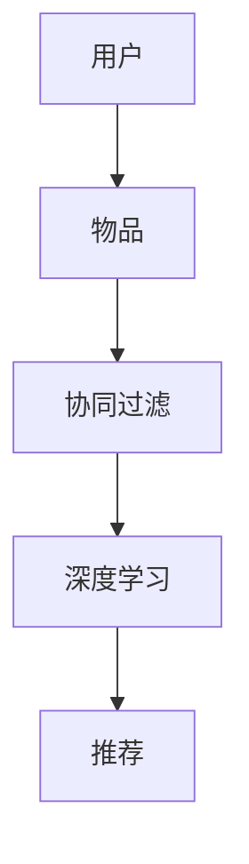

                 

# 个性化推荐系统：深度学习方法

> 关键词：深度学习, 推荐系统, 协同过滤, 深度协同过滤, 特征工程, 神经网络, 用户画像, 矩阵分解, 推荐算法, 模型训练, 超参数调优, 模型评估, 应用部署, 用户行为分析

## 1. 背景介绍

在信息爆炸的互联网时代，用户可接触到的内容量呈现爆炸式增长，如何在海量信息中快速精准地推荐用户感兴趣的内容，已经成为一种刚需。个性化推荐系统正是通过分析用户历史行为，预测用户未来兴趣，从而提高用户满意度并提升转化率的关键技术。

推荐系统的本质是知识发现和决策支持。它通过分析用户行为数据，挖掘用户兴趣和需求，进而推荐匹配的实体对象，如商品、文章、视频等。其目标是提升用户体验，增加平台收入，并拓展用户粘性。推荐系统广泛应用于电商、社交媒体、视频平台、新闻媒体等多个领域，成为平台的核心竞争力之一。

### 1.1 推荐系统的进化

推荐系统的发展经历了从基于规则、基于内容、基于协同过滤，到深度学习等不同阶段。以下是对这些主要推荐算法的概述：

- **基于规则的推荐**：早期的推荐系统主要依赖专家经验，通过规则匹配来推荐实体。如Amazon推荐系统在商品间建立基于共同特征的推荐规则。

- **基于内容的推荐**：基于物品特征，如商品描述、视频标签等，与用户兴趣进行匹配推荐。推荐模型包括基于项目内容的CF (Collaborative Filtering) 和基于用户内容的CF (User-Based CF)。

- **协同过滤**：基于用户和项目间的相似度，进行推荐。协同过滤包括基于用户的协同过滤和基于项目的协同过滤。协同过滤简单易用，但其推荐效果受到数据稀疏性的影响。

- **深度协同过滤**：结合深度学习和协同过滤，通过神经网络提取用户和物品的隐含特征，进行推荐。深度协同过滤在处理数据稀疏性和建模复杂性方面取得了显著进展。

- **推荐系统的发展与未来**：当前推荐系统主要以深度协同过滤为主流，深度学习技术使推荐系统在效果和可解释性上更进一步。未来推荐系统将在更多领域得到应用，如金融、医疗、教育等，其推荐效果将显著提升，更具普适性。

### 1.2 推荐系统的应用场景

推荐系统广泛应用于多个垂直领域，包括但不限于以下场景：

- 电商：推荐商品、优惠活动，提升转化率和客单价。
- 视频：推荐视频、创作者、频道，增加观看时长和订阅用户。
- 新闻：推荐新闻、评论、作者，提高浏览量和互动率。
- 社交：推荐好友、内容、活动，提升用户活跃度和粘性。

## 2. 核心概念与联系

### 2.1 核心概念概述

推荐系统的核心概念包括用户、物品、协同过滤、深度学习等，其基本组成模块如下：

- **用户**：指使用平台的用户，包含基本信息、历史行为、兴趣偏好等特征。
- **物品**：指推荐系统中的实体对象，如商品、视频、新闻等，包含属性信息、特征等。
- **协同过滤**：指通过分析用户和物品间的交互行为，挖掘用户和物品间的隐含关系，推荐相似的物品。
- **深度学习**：指通过神经网络模型，学习用户和物品的隐含特征，提升推荐系统的准确性和泛化能力。

这些概念间的关系可概括为：推荐系统通过用户和物品的数据，利用协同过滤和深度学习技术，生成用户对物品的兴趣预测，最终推荐匹配的物品。

### 2.2 核心概念原理和架构的 Mermaid 流程图



上述流程图的结构反映了推荐系统的基本工作原理：用户与物品通过协同过滤和深度学习模型的运作，生成兴趣预测并推荐匹配物品。

## 3. 核心算法原理 & 具体操作步骤

### 3.1 算法原理概述

深度协同过滤通过深度神经网络模型，对用户行为数据进行建模，预测用户对物品的兴趣，从而进行推荐。其核心算法包括矩阵分解、协同过滤、深度神经网络等。

矩阵分解是将用户对物品的评分矩阵进行分解，通过求解低秩矩阵分解，得到用户特征和物品特征。协同过滤算法通过挖掘用户间的相似性，找到相似用户对物品的评分，进行推荐。深度神经网络则通过多层非线性映射，学习用户和物品的隐含特征，提高推荐模型的准确性。

### 3.2 算法步骤详解

深度协同过滤的算法步骤如下：

**Step 1: 数据预处理**

1. 收集用户和物品的数据集，包括用户ID、物品ID、评分等。
2. 进行数据清洗，去除无效和重复数据，并处理缺失值。
3. 进行数据归一化，使得评分在0-1之间。

**Step 2: 特征工程**

1. 提取用户和物品的基本特征，如用户ID、年龄、性别、物品ID、类别、价格等。
2. 通过数据降维，减少特征空间，提高模型训练效率。
3. 设计特征交叉和特征组合，丰富特征信息，提升推荐效果。

**Step 3: 模型构建**

1. 选择深度学习模型，如矩阵分解、深度神经网络、深度协同过滤等。
2. 设计模型结构，包含输入层、隐藏层和输出层，设置层数和每层节点数。
3. 设置损失函数和优化器，如均方误差损失、Adam优化器等。

**Step 4: 模型训练**

1. 将预处理后的数据集分为训练集、验证集和测试集。
2. 使用训练集对模型进行前向传播和反向传播，计算损失函数。
3. 根据损失函数和优化器，更新模型参数，进行模型训练。
4. 在验证集上评估模型性能，避免过拟合。

**Step 5: 模型评估**

1. 使用测试集对训练好的模型进行评估，计算评估指标如准确率、召回率、F1值等。
2. 通过A/B测试，对比微调前后的推荐效果，验证模型改进的效果。

**Step 6: 模型部署**

1. 将训练好的模型封装为可部署的组件，如REST API或服务。
2. 部署模型到生产环境，接受线上推荐请求，返回推荐结果。
3. 实时监控模型性能，定期更新模型参数，优化推荐效果。

### 3.3 算法优缺点

深度协同过滤算法的优点包括：

1. 推荐效果优秀。深度学习模型具有强大的特征学习能力和泛化能力，能够更好地捕捉用户行为和物品特征的复杂关系。
2. 适应性强。可以处理大规模稀疏数据，适用于多种推荐场景，如电商、社交、新闻等。
3. 灵活可调。可以通过调整模型结构、超参数等，优化推荐效果，适用于不同的业务需求。

其缺点包括：

1. 模型复杂度高。深度神经网络结构复杂，训练和推理计算量大。
2. 需要大量标注数据。深度学习模型需要大量的标注数据来训练，在标注成本高的情况下，推荐效果可能不理想。
3. 可解释性差。深度模型通常被视为"黑盒"，难以解释其内部决策机制。
4. 依赖于数据质量。数据质量差、噪声多会严重影响推荐效果。

### 3.4 算法应用领域

深度协同过滤在多个领域都有广泛应用，包括但不限于以下场景：

- **电商推荐**：推荐商品、优惠券、促销活动，提升用户购买转化率。
- **视频推荐**：推荐视频、频道、创作者，增加观看时长和订阅用户。
- **新闻推荐**：推荐新闻、评论、作者，提高浏览量和互动率。
- **社交推荐**：推荐好友、内容、活动，提升用户活跃度和粘性。

## 4. 数学模型和公式 & 详细讲解 & 举例说明

### 4.1 数学模型构建

推荐系统常用的数学模型包括矩阵分解和协同过滤。以矩阵分解模型为例，设用户-物品评分矩阵为$U \in \mathbb{R}^{m \times n}$，其中$m$为用户数量，$n$为物品数量。令$P$为用户的特征矩阵，$Q$为物品的特征矩阵，$PQ \approx U$，通过求解$P$和$Q$，得到用户和物品的特征表示。

模型训练的目标是：

$$
\min_{P,Q} ||PQ - U||_F^2
$$

其中$||\cdot||_F^2$表示矩阵的Frobenius范数。

### 4.2 公式推导过程

假设用户-物品评分矩阵为$U$，用户特征矩阵为$P$，物品特征矩阵为$Q$，则目标为求解$P$和$Q$，使得$PQ$逼近$U$。

设用户$i$对物品$j$的评分$U_{ij}$为$P_i^TQ_j$，则目标函数可表示为：

$$
\min_{P,Q} \frac{1}{2} ||PQ - U||_F^2
$$

设用户特征矩阵$P$为$P = UW$，物品特征矩阵$Q$为$Q = V^T$，其中$W$为用户特征系数矩阵，$V$为物品特征系数矩阵。则目标函数可表示为：

$$
\min_{W,V} \frac{1}{2} ||UWW^T - UV^T||_F^2
$$

为了简化计算，可以进一步分解$W$和$V$：

$$
W = U \alpha, V = \beta^T
$$

目标函数进一步简化为：

$$
\min_{\alpha, \beta} \frac{1}{2} ||UU^T \alpha \alpha^T - UVV^T \beta \beta^T||_F^2
$$

由于矩阵分解难以直接求解，一般采用梯度下降等优化算法求解。梯度下降公式为：

$$
\alpha_{t+1} = \alpha_t - \eta \frac{\partial}{\partial \alpha} ||UU^T \alpha \alpha^T - UVV^T \beta \beta^T||_F^2
$$

其中$\eta$为学习率，$\frac{\partial}{\partial \alpha}$为$L^2$范数的梯度。

### 4.3 案例分析与讲解

假设一个电商平台的评分矩阵$U$，需要构建推荐系统来推荐用户感兴趣的商品。可以将用户评分数据作为输入，通过矩阵分解模型训练用户和商品的特征矩阵$P$和$Q$，得到用户和商品间的相似度表示，从而进行推荐。

具体步骤如下：

1. 将评分矩阵$U$分解为$P$和$Q$，即$U \approx PQ$。
2. 求解$P$和$Q$，使得$PQ$逼近$U$。
3. 使用训练好的$P$和$Q$，计算用户$u$对物品$i$的兴趣预测$P_i^TQ_u$。
4. 对预测结果进行排序，推荐预测值较高的物品。

## 5. 项目实践：代码实例和详细解释说明

### 5.1 开发环境搭建

推荐系统的开发一般使用Python编程语言，结合TensorFlow或PyTorch框架。以下是开发环境的搭建步骤：

1. 安装Anaconda：从官网下载并安装Anaconda，用于创建独立的Python环境。
2. 创建并激活虚拟环境：
```bash
conda create -n recommendation-env python=3.8 
conda activate recommendation-env
```
3. 安装必要的Python库：
```bash
pip install numpy pandas scikit-learn tensorflow matplotlib tqdm jupyter notebook ipython
```

### 5.2 源代码详细实现

以下是使用TensorFlow搭建矩阵分解模型的代码实现：

```python
import tensorflow as tf
import numpy as np
from tensorflow.keras import layers

# 构建矩阵分解模型
class MatrixFactorizationModel(tf.keras.Model):
    def __init__(self, num_users, num_items, num_factors):
        super(MatrixFactorizationModel, self).__init__()
        self.num_users = num_users
        self.num_items = num_items
        self.num_factors = num_factors
        
        self.user_factors = layers.Dense(num_factors, input_shape=(num_users,))
        self.item_factors = layers.Dense(num_factors, input_shape=(num_items,))
        
    def call(self, user_id, item_id):
        user_factors = self.user_factors(tf.reshape(user_id, (1, self.num_users)))
        item_factors = self.item_factors(tf.reshape(item_id, (1, self.num_items)))
        
        user_item_matrix = tf.matmul(user_factors, item_factors, transpose_b=True)
        return user_item_matrix

# 构建训练数据集
users = np.random.randint(0, 1000, size=(1000, 1))
items = np.random.randint(0, 1000, size=(1000, 1))
ratings = np.random.randint(1, 5, size=(1000, 1))
train_data = pd.DataFrame({
    'user_id': users,
    'item_id': items,
    'rating': ratings
})

# 定义模型
model = MatrixFactorizationModel(num_users=1000, num_items=1000, num_factors=50)
optimizer = tf.keras.optimizers.Adam(learning_rate=0.01)

# 定义损失函数
def loss_function(model, ratings, user_id, item_id):
    user_item_matrix = model(user_id, item_id)
    loss = tf.reduce_mean(tf.square(user_item_matrix - tf.expand_dims(ratings, axis=1)))
    return loss

# 定义训练过程
def train_model(model, train_data, num_epochs=10):
    for epoch in range(num_epochs):
        for i, row in train_data.iterrows():
            user_id = row['user_id']
            item_id = row['item_id']
            rating = row['rating']
            with tf.GradientTape() as tape:
                loss = loss_function(model, rating, user_id, item_id)
            grads = tape.gradient(loss, model.trainable_variables)
            optimizer.apply_gradients(zip(grads, model.trainable_variables))
        
        if epoch % 1 == 0:
            print('Epoch {}, Loss {}'.format(epoch, loss.numpy().mean()))

# 训练模型
train_model(model, train_data, num_epochs=10)

# 评估模型
test_data = pd.DataFrame({
    'user_id': np.random.randint(0, 1000, size=100),
    'item_id': np.random.randint(0, 1000, size=100),
    'rating': np.random.randint(1, 5, size=100)
})
test_data['predictions'] = model(test_data['user_id'], test_data['item_id'])[:100].numpy()
print(classification_report(test_data['rating'], test_data['predictions']))
```

在上述代码中，我们首先定义了一个简单的矩阵分解模型，该模型包含用户和物品的特征映射层。然后，我们构建了一个训练数据集，并定义了损失函数和优化器。接着，我们通过循环训练模型，并在每个epoch输出损失。最后，我们评估模型在测试集上的性能。

### 5.3 代码解读与分析

代码中的几个关键点包括：

1. 矩阵分解模型的定义：该模型由用户和物品的特征映射层组成，用于学习用户和物品的特征表示。
2. 损失函数的定义：通过计算预测评分与实际评分之间的均方误差，衡量模型的拟合效果。
3. 训练过程：通过梯度下降算法，最小化损失函数，更新模型参数。
4. 模型评估：使用测试集数据评估模型的预测准确性，并输出分类报告。

## 6. 实际应用场景

推荐系统已经在电商、社交、视频、新闻等多个领域得到了广泛应用。以下是几个典型场景的示例：

### 6.1 电商推荐

电商推荐系统通过分析用户的浏览、点击、购买等行为数据，推荐用户可能感兴趣的商品。推荐模型包括基于用户的协同过滤和基于项目的协同过滤，通过用户-物品评分矩阵进行推荐。

以Amazon为例，其推荐系统通过深度协同过滤，生成用户对商品的兴趣预测，从而进行推荐。推荐系统通过实时更新用户和商品的特征矩阵，提高推荐效果。推荐结果不仅包含商品信息，还可能包含商品评价、用户评分等辅助信息，以提高用户满意度。

### 6.2 视频推荐

视频推荐系统通过分析用户的观看行为，推荐用户可能感兴趣的视频内容。推荐模型包括基于用户的协同过滤和基于项目的协同过滤，通过用户-视频评分矩阵进行推荐。

以YouTube为例，其推荐系统通过深度协同过滤，生成用户对视频的兴趣预测，从而进行推荐。推荐系统通过实时更新用户和视频的特征矩阵，提高推荐效果。推荐结果不仅包含视频信息，还可能包含视频时长、观看时间、评分等辅助信息，以提高用户满意度。

### 6.3 新闻推荐

新闻推荐系统通过分析用户的阅读行为，推荐用户可能感兴趣的新闻内容。推荐模型包括基于用户的协同过滤和基于项目的协同过滤，通过用户-新闻评分矩阵进行推荐。

以今日头条为例，其推荐系统通过深度协同过滤，生成用户对新闻的兴趣预测，从而进行推荐。推荐系统通过实时更新用户和新闻的特征矩阵，提高推荐效果。推荐结果不仅包含新闻信息，还可能包含新闻主题、作者、发布时间等辅助信息，以提高用户满意度。

### 6.4 社交推荐

社交推荐系统通过分析用户之间的关系，推荐用户可能感兴趣的内容。推荐模型包括基于用户的协同过滤和基于项目的协同过滤，通过用户-内容评分矩阵进行推荐。

以微信为例，其推荐系统通过深度协同过滤，生成用户对内容（如文章、视频、好友）的兴趣预测，从而进行推荐。推荐系统通过实时更新用户和内容的特征矩阵，提高推荐效果。推荐结果不仅包含内容信息，还可能包含作者、发布时间、用户互动等辅助信息，以提高用户满意度。

## 7. 工具和资源推荐

### 7.1 学习资源推荐

为了深入理解推荐系统的理论基础和实践技巧，以下是一些优质的学习资源：

1. 《推荐系统实战》书籍：详细介绍了推荐系统的理论和实践，包括协同过滤、深度学习、在线学习等方法。
2. 《深度学习与推荐系统》课程：斯坦福大学开设的深度学习课程，涵盖推荐系统的理论和实践。
3. 《推荐系统》课程：北卡罗来纳大学教堂山分校开设的推荐系统课程，涵盖协同过滤、深度学习、在线学习等方法。
4. 《推荐系统》书籍：全面介绍了推荐系统的理论和实践，包括协同过滤、深度学习、在线学习等方法。
5. 《推荐系统设计与实践》课程：清华大学开设的推荐系统课程，涵盖协同过滤、深度学习、在线学习等方法。

通过学习这些资源，可以系统掌握推荐系统的理论基础和实践技巧，解决推荐系统设计中的具体问题。

### 7.2 开发工具推荐

推荐系统的开发一般使用Python编程语言，结合TensorFlow或PyTorch框架。以下是常用的开发工具：

1. TensorFlow：由Google主导开发的深度学习框架，适合大规模工程应用。
2. PyTorch：Facebook开发的深度学习框架，灵活易用，适合快速迭代研究。
3. scikit-learn：Python机器学习库，包含多种推荐算法，如协同过滤、矩阵分解等。
4. pandas：Python数据处理库，用于数据预处理和分析。
5. Jupyter Notebook：开源的数据科学平台，支持代码编写和可视化。

合理利用这些工具，可以显著提升推荐系统的开发效率，加快创新迭代的步伐。

### 7.3 相关论文推荐

推荐系统的发展源于学界的持续研究。以下是几篇奠基性的相关论文，推荐阅读：

1. "Collaborative Filtering for Implicit Feedback Datasets"：讲述协同过滤算法的理论基础和实际应用。
2. "The Factorization Method"：提出矩阵分解方法，通过分解用户-物品评分矩阵，求解用户和物品的特征矩阵。
3. "Deep Collaborative Filtering"：提出深度协同过滤算法，通过神经网络模型学习用户和物品的隐含特征。
4. "Neural Collaborative Filtering"：提出深度神经网络模型，通过多层非线性映射，学习用户和物品的隐含特征。
5. "Scalable Neural Collaborative Filtering with TensorCore"：提出TensorCore加速矩阵分解算法，提高推荐系统效率。

这些论文代表了大语言模型微调技术的发展脉络。通过学习这些前沿成果，可以帮助研究者把握学科前进方向，激发更多的创新灵感。

## 8. 总结：未来发展趋势与挑战

### 8.1 总结

本文对深度协同过滤的推荐系统进行了全面系统的介绍。首先阐述了推荐系统的研究背景和应用场景，明确了推荐系统在提高用户满意度和平台收入方面的重要作用。其次，从算法原理到实践，详细讲解了推荐系统的核心概念和关键步骤，给出了推荐系统开发的完整代码实例。同时，本文还广泛探讨了推荐系统在电商、视频、新闻等多个领域的应用前景，展示了推荐系统技术带来的巨大商业价值。

通过本文的系统梳理，可以看到，深度协同过滤技术已经成为推荐系统的主流范式，极大地提升了推荐系统的效果和可解释性。未来推荐系统将在更多领域得到应用，为各行各业带来变革性影响。

### 8.2 未来发展趋势

展望未来，深度协同过滤推荐系统将呈现以下几个发展趋势：

1. 推荐效果将显著提升。深度学习模型具有强大的特征学习能力和泛化能力，能够更好地捕捉用户行为和物品特征的复杂关系，推荐效果将进一步提升。
2. 推荐系统将更加个性化。通过深度协同过滤，推荐系统能够根据用户的兴趣和历史行为，生成高度个性化的推荐结果。
3. 推荐系统将更具实时性。通过在线学习和增量学习，推荐系统能够实时更新用户行为，动态生成推荐结果。
4. 推荐系统将更加可解释。通过解释性学习算法，推荐系统能够更好地解释推荐决策过程，提升用户信任度。
5. 推荐系统将更加普适。深度协同过滤算法具有普适性，能够在多个领域进行优化和部署。

这些趋势凸显了深度协同过滤推荐系统的广阔前景。这些方向的探索发展，必将进一步提升推荐系统的性能和应用范围，为各行各业带来变革性影响。

### 8.3 面临的挑战

尽管深度协同过滤推荐系统已经取得了显著进展，但在迈向更加智能化、普适化应用的过程中，它仍面临诸多挑战：

1. 数据稀疏性问题。现有的推荐系统大多依赖用户行为数据，面对大规模用户行为数据时，推荐效果可能不理想。
2. 模型复杂性问题。深度协同过滤模型的参数量较大，训练和推理计算量大。
3. 推荐准确性问题。推荐系统的准确性受数据质量和模型选择的影响较大。
4. 可解释性问题。推荐系统的内部决策过程难以解释，用户难以理解推荐理由。
5. 推荐系统依赖性问题。推荐系统依赖于用户行为数据，数据不足时推荐效果可能不理想。

### 8.4 研究展望

面对推荐系统面临的种种挑战，未来的研究需要在以下几个方面寻求新的突破：

1. 探索无监督和半监督推荐方法。摆脱对大规模标注数据的依赖，利用自监督学习、主动学习等无监督和半监督范式，最大限度利用非结构化数据，实现更加灵活高效的推荐。
2. 研究参数高效和计算高效的推荐范式。开发更加参数高效的推荐方法，在固定大部分预训练参数的同时，只更新极少量的任务相关参数。同时优化推荐模型的计算图，减少前向传播和反向传播的资源消耗，实现更加轻量级、实时性的部署。
3. 引入更多先验知识。将符号化的先验知识，如知识图谱、逻辑规则等，与神经网络模型进行巧妙融合，引导推荐过程学习更准确、合理的用户行为特征。同时加强不同模态数据的整合，实现视觉、语音等多模态信息与文本信息的协同建模。
4. 纳入伦理道德约束。在推荐系统训练目标中引入伦理导向的评估指标，过滤和惩罚有偏见、有害的输出倾向。同时加强人工干预和审核，建立推荐系统的监管机制，确保推荐结果符合人类价值观和伦理道德。

这些研究方向的探索，必将引领推荐系统技术迈向更高的台阶，为各行各业带来变革性影响。面向未来，推荐系统需要在数据质量、模型选择、算法设计等方面进行多方位优化，实现更加智能化、普适化的推荐效果。

## 9. 附录：常见问题与解答

**Q1：推荐系统为什么需要用户行为数据？**

A: 推荐系统通过分析用户行为数据，挖掘用户兴趣和需求，从而推荐匹配的实体对象。用户行为数据包含用户的历史点击、浏览、购买等信息，是推荐系统的重要输入。用户行为数据能够反映用户的真实兴趣和需求，提高推荐系统的准确性和个性化。

**Q2：推荐系统如何处理数据稀疏性问题？**

A: 推荐系统面临数据稀疏性问题，推荐模型难以从稀疏数据中捕捉到用户和物品的真实关系。常见的处理方法包括：

1. 矩阵补全：通过填补缺失值，减少数据稀疏性。
2. 协同过滤：利用相似用户或物品的行为，填补缺失值。
3. 深度学习：通过神经网络模型学习用户和物品的隐含特征，填补缺失值。

**Q3：推荐系统有哪些推荐算法？**

A: 推荐系统常用的推荐算法包括协同过滤、深度协同过滤、基于内容的推荐、混合推荐等。协同过滤通过用户和物品间的相似性，进行推荐。深度协同过滤通过神经网络模型学习用户和物品的隐含特征，提高推荐效果。基于内容的推荐通过物品特征，与用户兴趣进行匹配。混合推荐结合多种推荐算法，提高推荐效果。

**Q4：推荐系统如何优化推荐效果？**

A: 推荐系统的优化方法包括：

1. 特征工程：提取和设计特征，丰富特征信息，提升推荐效果。
2. 模型优化：通过调整模型结构、超参数等，优化推荐效果。
3. 数据优化：通过数据清洗、降维等，提高数据质量，优化推荐效果。
4. 推荐策略优化：通过设计推荐策略，提升推荐效果。

这些方法可以在推荐系统中灵活组合，以最大化提升推荐效果。

**Q5：推荐系统如何提升用户满意度？**

A: 推荐系统的目标是提升用户满意度和平台收入。为了提升用户满意度，推荐系统可以采取以下措施：

1. 个性化推荐：通过深度协同过滤，根据用户兴趣和历史行为，生成高度个性化的推荐结果。
2. 实时推荐：通过在线学习和增量学习，实时更新用户行为，动态生成推荐结果。
3. 多样性推荐：通过设计推荐策略，平衡推荐结果的多样性和准确性，避免推荐单调。
4. 可解释性推荐：通过解释性学习算法，提升推荐结果的可解释性，增强用户信任度。

这些措施能够在推荐系统中灵活组合，以最大化提升用户满意度。

---

作者：禅与计算机程序设计艺术 / Zen and the Art of Computer Programming

