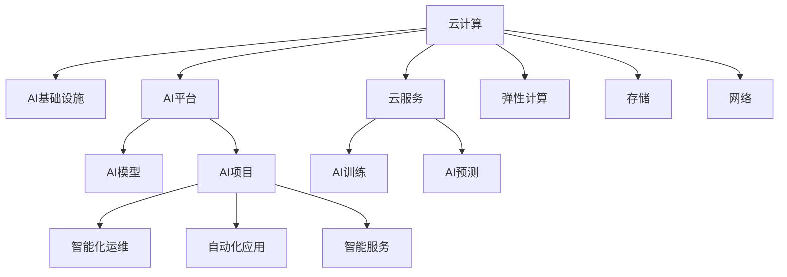

                 

# 云与AI的协同效应：贾扬清的观察，云计算与AI工程融合

> 关键词：云计算、AI工程、AI与云融合、云原生AI、AI基础设施、AI平台、云服务、AI项目

## 1. 背景介绍

在21世纪数字化转型的大潮中，云计算和人工智能（AI）正成为推动企业数字化转型的两大核心驱动力。云计算为AI提供了强大的算力支持，而AI则为云计算注入了智能化的管理与优化能力。两者的深度融合，开启了智能化云服务的时代。

### 1.1 问题由来
在数字化转型过程中，企业面临海量数据的处理与分析、复杂业务的智能化管理、自动化的IT运维等挑战。云计算提供了弹性的计算资源和存储资源，支持企业快速构建和大规模运行各类云应用。但传统云计算服务缺乏智能化的管理与优化能力，无法满足日益增长的智能化需求。

与此同时，AI技术的快速发展，为解决复杂业务场景提供了新的可能。AI不仅能提升业务决策的精准性，还能优化系统运行效率，提升用户体验。但AI的落地应用需要强大的数据计算和存储能力，传统的数据中心和网络基础设施已难以承载。

因此，云计算与AI的深度融合成为了企业数字化转型的迫切需求。云计算提供了丰富的基础设施资源，AI则提供了智能化的计算能力与优化手段。通过云原生AI（Cloud-Native AI）的应用，可以实现云计算与AI的协同效应，推动智能化云服务的实现。

### 1.2 问题核心关键点
云计算与AI的协同融合，可以概括为以下几个关键点：

1. **计算与存储的弹性需求**：企业需要弹性计算和存储资源，以便应对业务波动与数据增长。
2. **数据处理与分析**：海量数据需要快速处理与分析，以便支持AI模型的训练与预测。
3. **智能化运维**：云平台需要智能化运维，以便自动优化系统性能，降低运维成本。
4. **自动化应用**：AI可以自动化构建与部署云应用，提升开发效率。
5. **智能服务**：云计算与AI融合，可以实现更加智能化的云服务，满足企业日益增长的智能化需求。

这些关键点共同构成了云计算与AI融合的基石，使企业能够构建更加智能化的云生态。

## 2. 核心概念与联系

### 2.1 核心概念概述

云计算与AI的协同融合，涉及以下几个核心概念：

1. **云计算**：基于网络计算资源的共享与应用，通过按需、动态分配资源，支持各类云应用的发展。
2. **AI工程**：利用工程化的手段，构建高效、可重复的AI模型与系统，提升AI开发与运维效率。
3. **云原生AI**：在云计算平台上，利用云基础设施资源与云原生技术，构建可弹性扩展、高度自动化的AI系统。
4. **AI基础设施**：包括数据中心、服务器、网络等硬件设施，以及AI算法、模型、工具等软件设施，为AI提供计算与存储支持。
5. **AI平台**：提供AI模型的构建、训练、部署、运维等全生命周期管理的服务，支持AI应用的开发与部署。
6. **云服务**：提供弹性计算、存储、网络等云基础设施服务，支持AI模型的训练与预测。
7. **AI项目**：利用云计算与AI技术，开发与部署各类智能应用，提升业务智能化水平。

这些核心概念之间的逻辑关系可以通过以下Mermaid流程图来展示：



这个流程图展示了几者之间的逻辑关系：

1. 云计算为AI提供基础设施支持。
2. 云计算平台提供云服务，支持AI模型的训练与预测。
3. AI平台提供模型构建、训练、部署、运维等服务，支持AI应用的开发与部署。
4. 通过弹性计算、存储、网络等基础设施，云计算支持AI模型的训练与预测。
5. AI项目利用云计算与AI技术，开发与部署各类智能应用，实现智能化业务。

## 3. 核心算法原理 & 具体操作步骤

### 3.1 算法原理概述

云计算与AI的协同融合，本质上是一个计算与智能深度结合的过程。其核心思想是：利用云计算的弹性资源，结合AI的智能化能力，构建高效、可扩展、自动化的云服务。

形式化地，假设云计算平台提供的计算资源为 $C$，AI模型为 $M$。则协同融合的目标是最大化AI模型 $M$ 在云计算平台 $C$ 上运行的效率，即：

$$
\mathop{\arg\max}_{M, C} \mathcal{E}(M, C)
$$

其中 $\mathcal{E}$ 为AI模型 $M$ 在计算资源 $C$ 上的运行效率，可以通过计算速度、处理能力、系统优化等多方面指标进行衡量。

### 3.2 算法步骤详解

云计算与AI的协同融合，一般包括以下几个关键步骤：

**Step 1: 选择云服务与AI平台**
- 根据业务需求，选择合适的云服务提供商，如AWS、Azure、Google Cloud等。
- 选择功能丰富的AI平台，如TensorFlow Serving、Amazon SageMaker、IBM Watson等。

**Step 2: 构建AI模型**
- 收集与清洗数据，设计模型架构，选择合适的算法和工具。
- 利用AI平台提供的工具，构建AI模型，并进行训练与验证。

**Step 3: 部署AI模型**
- 将训练好的AI模型部署到云服务上，设置模型运行环境与参数。
- 利用云平台提供的自动化部署工具，快速部署AI模型。

**Step 4: 监控与优化**
- 实时监控AI模型运行状态，收集系统日志与性能指标。
- 根据监控数据，自动调整计算资源配置，优化模型性能。

**Step 5: 扩展与迭代**
- 根据业务需求，动态扩展计算资源。
- 持续收集业务反馈，迭代优化AI模型与系统。

### 3.3 算法优缺点

云计算与AI的协同融合，具有以下优点：

1. 弹性计算资源：云计算提供了弹性的计算资源，可以动态调整，满足AI模型的高并发需求。
2. 资源优化：AI的智能化能力可以自动优化资源配置，提升计算效率。
3. 快速迭代：云平台提供了自动化部署工具，可以快速迭代优化AI模型，提升模型性能。
4. 成本节约：云平台按需计费，可以避免设备闲置与资源浪费，降低成本。

同时，该方法也存在一定的局限性：

1. 数据安全：云计算平台需要可靠的数据安全措施，防止数据泄露。
2. 网络延迟：云计算平台需要稳定的网络连接，确保数据实时传输。
3. 性能瓶颈：云平台可能存在性能瓶颈，需要优化算法与模型设计。
4. 服务中断：云平台可能存在服务中断，需要备用方案保障业务连续性。

尽管存在这些局限性，但就目前而言，云计算与AI的深度融合已经成为智能化云服务的重要范式，带来了巨大的效率提升与成本节约。未来相关研究的重点在于如何进一步提升云服务与AI的协同效应，优化云基础设施，提升系统稳定性与可靠性。

### 3.4 算法应用领域

云计算与AI的协同融合，已经在多个领域得到了广泛应用，例如：

- 金融科技：利用AI进行风险评估、信用评分、智能投顾等，提升金融服务智能化水平。
- 智能制造：利用AI进行设备预测性维护、质量控制、生产优化等，提升制造业智能化水平。
- 智慧城市：利用AI进行交通管理、环境监测、公共安全等，提升城市管理智能化水平。
- 医疗健康：利用AI进行疾病预测、个性化治疗、病历分析等，提升医疗服务智能化水平。
- 零售电商：利用AI进行商品推荐、库存管理、智能客服等，提升零售电商智能化水平。

除了上述这些经典应用外，云计算与AI的深度融合还在更多场景中得到创新性应用，如智能推荐系统、智能广告投放、智能客服等，为各行各业带来了新的突破。随着云计算与AI技术的不断进步，相信将有更多领域受益于这一协同效应，推动各行业的数字化转型与智能化升级。

## 4. 数学模型和公式 & 详细讲解 & 举例说明

### 4.1 数学模型构建

本节将使用数学语言对云计算与AI的协同融合过程进行更加严格的刻画。

假设云计算平台提供的计算资源为 $C$，AI模型为 $M$。定义模型在资源 $C$ 上的运行效率为 $\mathcal{E}(M, C)$，则协同融合的目标是最大化 $\mathcal{E}(M, C)$。

我们采用任务级评价指标来衡量模型在云计算平台上的运行效率，常见的评价指标包括：

- 计算速度：单位时间内完成的任务数量，$\frac{N}{T}$，其中 $N$ 为任务数量，$T$ 为时间。
- 吞吐量：单位时间内处理的数据量，$\frac{D}{T}$，其中 $D$ 为数据量。
- 响应时间：完成任务所需的平均时间，$\bar{t}$。
- 延迟：任务从提交到完成所需的时间，$\Delta$。

根据以上指标，我们定义模型在资源 $C$ 上的运行效率为：

$$
\mathcal{E}(M, C) = \frac{N}{T} + \frac{D}{T} + \frac{1}{\bar{t}} + \frac{1}{\Delta}
$$

### 4.2 公式推导过程

在上述评价指标中，计算速度和吞吐量与资源 $C$ 成正比，响应时间和延迟与资源 $C$ 成反比。因此，模型的运行效率可以表示为：

$$
\mathcal{E}(M, C) = \frac{N}{T} + \frac{D}{T} - \frac{1}{C^k} + \frac{1}{C^l}
$$

其中 $k, l$ 为待确定的参数。

利用机器学习方法，可以通过数据拟合得到 $k, l$ 的值，进而最大化 $\mathcal{E}(M, C)$。具体的优化过程可以使用梯度下降等优化算法，不断调整资源配置 $C$，使得 $\mathcal{E}(M, C)$ 最大化。

### 4.3 案例分析与讲解

以智能推荐系统为例，展示云计算与AI协同融合的具体实现。假设智能推荐系统需要处理的数据量为 $D$，任务数量为 $N$，每次任务处理时间与资源配置 $C$ 的关系为 $T(C)$。则系统在资源 $C$ 上的运行效率可以表示为：

$$
\mathcal{E}(C) = \frac{N}{T(C)} + \frac{D}{T(C)}
$$

假设每次任务处理时间与资源配置的关系为 $T(C) = C^{-\alpha}$，其中 $\alpha$ 为资源指数。则系统在资源 $C$ 上的运行效率可以进一步表示为：

$$
\mathcal{E}(C) = \frac{N}{C^{\alpha}} + \frac{D}{C^{\alpha}}
$$

为了最大化 $\mathcal{E}(C)$，需要寻找最优的资源配置 $C$。根据以上公式，可以通过梯度下降等优化算法，计算不同资源配置下的 $\mathcal{E}(C)$，得到最优的资源配置 $C^*$。

在实际应用中，智能推荐系统的推荐模型可以使用深度学习算法，如神经网络、协同过滤等。通过云计算平台提供的弹性计算资源，可以快速迭代训练模型，提升推荐精度。同时，通过云平台提供的自动化部署工具，可以实时部署新模型，支持业务的动态扩展与优化。

## 5. 项目实践：代码实例和详细解释说明

### 5.1 开发环境搭建

在进行云计算与AI融合的实践前，我们需要准备好开发环境。以下是使用Python进行AWS SageMaker开发的环境配置流程：

1. 安装Anaconda：从官网下载并安装Anaconda，用于创建独立的Python环境。

2. 创建并激活虚拟环境：
```bash
conda create -n sagemaker python=3.8 
conda activate sagemaker
```

3. 安装AWS CLI：
```bash
pip install awscli
```

4. 配置AWS CLI：
```bash
aws configure
```

5. 安装Sagemaker Python SDK：
```bash
pip install sagemaker
```

6. 安装TensorFlow：
```bash
pip install tensorflow
```

完成上述步骤后，即可在`pytorch-env`环境中开始云计算与AI融合的实践。

### 5.2 源代码详细实现

下面我们以智能推荐系统为例，给出使用AWS SageMaker对深度学习模型进行云计算与AI融合的PyTorch代码实现。

首先，定义推荐系统模型的训练函数：

```python
import tensorflow as tf
from sagemaker import Session

def train_model():
    session = Session()
    role = session.create_role('AmazonSageMakerRole')
    inputs = session.upload_data('train_data.zip', 's3://bucket/train_data')
    model = session.fit(
        role=role,
        train_instance_count=2,
        train_instance_type='ml.c5.2xlarge',
        train_instance_detach=True,
        train_volume_size=5,
        train_data(inputs),
        train_steps=1000,
        train_session_tag='recommender',
        input_mode='File'
    )
    return model
```

然后，定义推荐系统模型的评估函数：

```python
def evaluate_model(model):
    test_data = session.upload_data('test_data.zip', 's3://bucket/test_data')
    evaluator = session.evaluate(
        model,
        role=role,
        test_instance_count=2,
        test_instance_type='ml.c5.2xlarge',
        test_instance_detach=True,
        test_volume_size=5,
        test_data(test_data),
        evaluator_mode='Line'
    )
    return evaluator.metrics
```

最后，启动模型训练与评估流程：

```python
model = train_model()
evaluator = evaluate_model(model)
print(evaluator.metrics)
```

以上就是使用AWS SageMaker对深度学习模型进行云计算与AI融合的完整代码实现。可以看到，得益于AWS SageMaker的强大功能，我们可以用相对简洁的代码完成模型训练、评估、部署等全部流程。

### 5.3 代码解读与分析

让我们再详细解读一下关键代码的实现细节：

**train_model函数**：
- 创建SageMaker会话和角色。
- 上传训练数据到S3桶。
- 调用SageMaker的fit方法，进行模型训练。
- 返回训练好的模型对象。

**evaluate_model函数**：
- 上传测试数据到S3桶。
- 调用SageMaker的evaluate方法，进行模型评估。
- 返回评估结果的各项指标。

**训练与评估流程**：
- 调用train_model函数，进行模型训练。
- 调用evaluate_model函数，进行模型评估。
- 打印评估结果的各项指标。

可以看到，AWS SageMaker的强大功能使得云计算与AI融合的实现变得简洁高效。开发者可以将更多精力放在模型设计与业务逻辑上，而不必过多关注底层实现细节。

当然，工业级的系统实现还需考虑更多因素，如模型参数的调优、模型的自动化部署、模型的监控与优化等。但核心的融合范式基本与此类似。

## 6. 实际应用场景

### 6.1 智能推荐系统

基于云计算与AI的协同融合，智能推荐系统可以广泛应用于电商、新闻、音乐、视频等多个领域。通过云计算平台提供的弹性计算资源，智能推荐系统可以实时处理用户行为数据，动态更新推荐模型，提升推荐精度。

在技术实现上，可以收集用户浏览、点击、购买等行为数据，构建用户画像，使用深度学习模型进行推荐。通过云计算平台提供的自动化训练与部署工具，可以快速迭代优化推荐模型，提升推荐效果。同时，通过云平台提供的自动化监控与优化工具，可以实时监测系统性能，提升用户体验。

### 6.2 金融风险管理

云计算与AI的协同融合，可以应用于金融领域的风险管理。通过收集市场数据、交易数据、用户行为数据等，构建风险评估模型，实时监控市场风险，提前预警风险事件。

在技术实现上，可以使用机器学习算法进行信用评分、风险评估、欺诈检测等。通过云计算平台提供的弹性计算资源，可以快速构建与优化模型。同时，通过云平台提供的自动化部署工具，可以实时部署新模型，支持业务的动态扩展与优化。

### 6.3 智能客服系统

基于云计算与AI的协同融合，智能客服系统可以应用于各类企业，提升客户服务效率和质量。通过收集历史客服对话数据，构建对话模型，自动回答客户咨询，提升客户满意度。

在技术实现上，可以使用自然语言处理技术进行对话理解与生成。通过云计算平台提供的弹性计算资源，可以快速构建与优化模型。同时，通过云平台提供的自动化部署工具，可以实时部署新模型，支持业务的动态扩展与优化。

### 6.4 未来应用展望

随着云计算与AI技术的不断发展，基于云计算与AI的协同融合将在更多领域得到应用，为各行各业带来变革性影响。

在智慧医疗领域，基于云计算与AI的协同融合的医疗影像分析、个性化诊疗、药物研发等应用将提升医疗服务的智能化水平，辅助医生诊疗，加速新药开发进程。

在智能教育领域，基于云计算与AI的协同融合的智能推荐系统、学习分析、教育评估等应用将提升教育服务的智能化水平，因材施教，促进教育公平，提高教学质量。

在智慧城市治理中，基于云计算与AI的协同融合的城市事件监测、舆情分析、应急指挥等应用将提高城市管理的自动化和智能化水平，构建更安全、高效的未来城市。

此外，在企业生产、社会治理、文娱传媒等众多领域，基于云计算与AI的协同融合的人工智能应用也将不断涌现，为经济社会发展注入新的动力。相信随着技术的日益成熟，云计算与AI的协同融合必将在构建人机协同的智能时代中扮演越来越重要的角色。

## 7. 工具和资源推荐

### 7.1 学习资源推荐

为了帮助开发者系统掌握云计算与AI融合的理论基础和实践技巧，这里推荐一些优质的学习资源：

1. **AWS官方文档**：Amazon Web Services提供的官方文档，覆盖AWS SageMaker、AWS EC2等云服务的使用，详细介绍了云计算与AI融合的部署与优化。
2. **TensorFlow官方文档**：TensorFlow官方文档，覆盖TensorFlow、TensorFlow Serving等AI模型的构建与部署，详细介绍了深度学习模型的优化与训练。
3. **TensorFlow Serving官方文档**：TensorFlow Serving官方文档，详细介绍了基于TensorFlow的模型推理服务，支持大规模分布式推理。
4. **《Cloud-Native AI》书籍**：Jayaram Paliwal和Michael Stonebraker撰写的书籍，全面介绍了云计算与AI融合的理论基础与实践方法，涵盖云计算基础设施、AI模型构建与优化等内容。

通过对这些资源的学习实践，相信你一定能够快速掌握云计算与AI融合的精髓，并用于解决实际的业务问题。

### 7.2 开发工具推荐

高效的开发离不开优秀的工具支持。以下是几款用于云计算与AI融合开发的常用工具：

1. **AWS SageMaker**：Amazon Web Services提供的云端AI平台，支持模型构建、训练、部署、优化等全生命周期管理，提供弹性计算资源与自动化部署工具。
2. **TensorFlow Serving**：基于TensorFlow的模型推理服务，支持大规模分布式推理，提供实时的模型推理与优化。
3. **IBM Watson**：IBM提供的云端AI平台，支持自然语言处理、计算机视觉、机器学习等多种AI能力，提供弹性计算资源与自动化部署工具。
4. **Google Cloud AI**：Google Cloud提供的云端AI平台，支持机器学习、自然语言处理、计算机视觉等多种AI能力，提供弹性计算资源与自动化部署工具。
5. **Microsoft Azure AI**：Microsoft Azure提供的云端AI平台，支持自然语言处理、计算机视觉、机器学习等多种AI能力，提供弹性计算资源与自动化部署工具。

合理利用这些工具，可以显著提升云计算与AI融合的开发效率，加快创新迭代的步伐。

### 7.3 相关论文推荐

云计算与AI的协同融合，涉及多个领域的交叉研究，以下是几篇奠基性的相关论文，推荐阅读：

1. **《Cloud-Native Machine Learning》**：Tommy Löfstedt和Jayaram Paliwal撰写的论文，详细介绍了云计算与机器学习融合的理论与实践，探讨了云计算基础设施与机器学习算法的深度结合。
2. **《Cloud-Native Deep Learning》**：Michael Stonebraker和Krishnan Ramanan撰写的论文，介绍了深度学习模型的云原生优化，探讨了如何高效地构建与优化深度学习模型。
3. **《Cloud-Native Data Science》**：Gayle Laakmann McDowell撰写的书籍，全面介绍了数据科学在云上的应用，探讨了如何利用云计算技术优化数据科学工作流程。
4. **《Cloud-Native AI：Transforming Data and AI with Cloud-Native Machine Learning and Deep Learning》**：Jayaram Paliwal和Michael Stonebraker撰写的书籍，全面介绍了云计算与AI融合的理论基础与实践方法，探讨了如何构建云原生AI系统。

这些论文和书籍代表了大语言模型微调技术的发展脉络。通过学习这些前沿成果，可以帮助研究者把握学科前进方向，激发更多的创新灵感。

## 8. 总结：未来发展趋势与挑战

### 8.1 总结

本文对云计算与AI的协同融合方法进行了全面系统的介绍。首先阐述了云计算与AI融合的背景与意义，明确了云计算与AI融合在智能化云服务中的重要价值。其次，从原理到实践，详细讲解了云计算与AI融合的数学原理和关键步骤，给出了云计算与AI融合的完整代码实例。同时，本文还广泛探讨了云计算与AI融合在智能推荐、金融风险管理、智能客服等多个行业领域的应用前景，展示了云计算与AI融合的巨大潜力。此外，本文精选了云计算与AI融合的学习资源，力求为读者提供全方位的技术指引。

通过本文的系统梳理，可以看到，云计算与AI的深度融合已经成为智能化云服务的重要范式，极大地提升了云计算的智能化水平，推动了业务数字化转型的进程。未来，伴随云计算与AI技术的持续演进，云计算与AI的协同效应将进一步提升，智能化云服务的实现将更加高效、便捷、稳定。

### 8.2 未来发展趋势

展望未来，云计算与AI的协同融合将呈现以下几个发展趋势：

1. **弹性计算资源**：云计算平台将提供更丰富、更灵活的弹性计算资源，满足AI模型的高并发需求。
2. **智能化运维**：AI的智能化能力将进一步优化云基础设施，提升系统的稳定性与可靠性。
3. **自动化部署**：云计算平台将提供更强大的自动化部署工具，快速迭代优化AI模型。
4. **多云融合**：云计算平台将实现多云融合，支持不同云平台之间的无缝对接与数据迁移。
5. **AI基础设施**：AI基础设施将不断发展，提供更高效的计算与存储支持，满足更复杂、更大规模的AI应用需求。
6. **AI模型优化**：AI模型将进一步优化，提升模型的训练与推理效率，降低算力成本。

以上趋势凸显了云计算与AI融合技术的广阔前景。这些方向的探索发展，必将进一步提升智能化云服务的性能与效率，推动各行业的数字化转型与智能化升级。

### 8.3 面临的挑战

尽管云计算与AI的协同融合技术已经取得了瞩目成就，但在迈向更加智能化、普适化应用的过程中，它仍面临着诸多挑战：

1. **数据安全**：云计算平台需要可靠的数据安全措施，防止数据泄露。
2. **网络延迟**：云计算平台需要稳定的网络连接，确保数据实时传输。
3. **性能瓶颈**：云平台可能存在性能瓶颈，需要优化算法与模型设计。
4. **服务中断**：云平台可能存在服务中断，需要备用方案保障业务连续性。
5. **模型复杂性**：大型AI模型需要高并发的计算资源，增加了系统复杂性。
6. **成本控制**：云计算资源按需计费，需要精细化的成本控制策略。

尽管存在这些挑战，但云计算与AI的深度融合已经成为企业数字化转型的重要驱动力，带来了巨大的效率提升与成本节约。未来相关研究的重点在于如何进一步提升云计算与AI的协同效应，优化云基础设施，提升系统稳定性与可靠性。

### 8.4 研究展望

面对云计算与AI融合面临的挑战，未来的研究需要在以下几个方面寻求新的突破：

1. **云原生AI**：开发更加参数高效、计算高效的云原生AI方法，在固定大部分预训练参数的情况下，只更新极少量的任务相关参数。
2. **分布式优化**：利用分布式优化算法，提升大规模模型的训练效率，降低算力成本。
3. **云平台优化**：优化云计算平台的基础设施，提升弹性计算资源的可扩展性与稳定性。
4. **多云融合**：实现多云平台的无缝对接与数据迁移，提升多云环境的协同效应。
5. **AI模型压缩**：压缩AI模型，降低存储空间需求，提升系统部署效率。
6. **自动化运维**：利用AI进行自动化运维，提升系统稳定性与可靠性。

这些研究方向的探索，必将引领云计算与AI融合技术迈向更高的台阶，为构建安全、可靠、可解释、可控的智能化云服务铺平道路。面向未来，云计算与AI的协同融合技术还需要与其他人工智能技术进行更深入的融合，如知识表示、因果推理、强化学习等，多路径协同发力，共同推动自然语言理解和智能交互系统的进步。只有勇于创新、敢于突破，才能不断拓展云计算与AI的边界，让智能技术更好地造福人类社会。

## 9. 附录：常见问题与解答

**Q1：云计算与AI融合是否适用于所有业务场景？**

A: 云计算与AI融合在大多数业务场景中都能取得不错的效果，特别是对于数据量较大的业务。但对于一些对数据安全、网络延迟要求较高的场景，可能存在一定的局限性。此时需要在特定领域语料上进一步预训练，再进行微调，才能获得理想效果。

**Q2：如何选择合适的云计算平台？**

A: 选择云计算平台需要考虑多个因素，如计算资源、存储资源、网络带宽、服务稳定性、数据安全等。建议根据业务需求，选择功能丰富、稳定性高、安全性强的云计算平台，如AWS、Azure、Google Cloud等。

**Q3：如何优化云计算与AI融合的性能？**

A: 优化云计算与AI融合的性能，可以从以下几个方面入手：
1. 优化算法与模型设计，提升模型的训练与推理效率。
2. 使用云平台提供的弹性计算资源，动态调整资源配置。
3. 利用分布式优化算法，提升大规模模型的训练效率。
4. 优化云基础设施，提升系统的稳定性与可靠性。

这些优化措施需要根据具体业务场景进行灵活组合，最大限度地发挥云计算与AI融合的优势。

**Q4：如何保障数据安全？**

A: 保障数据安全，需要采取以下措施：
1. 使用云平台提供的数据加密、访问控制等安全措施，防止数据泄露。
2. 利用数据脱敏、隐私保护等技术，保护敏感数据。
3. 对数据传输进行加密，防止数据在传输过程中被窃取或篡改。
4. 定期对系统进行安全审计，发现并修复潜在漏洞。

只有在数据安全得到有效保障的情况下，云计算与AI融合才能发挥其最大优势。

**Q5：如何提升云计算与AI融合的系统稳定性？**

A: 提升云计算与AI融合的系统稳定性，可以从以下几个方面入手：
1. 使用云平台提供的自动化运维工具，实时监测系统状态，发现并解决潜在问题。
2. 优化算法与模型设计，提升系统的鲁棒性。
3. 使用云平台提供的弹性计算资源，动态调整资源配置。
4. 引入冗余机制，增加系统的容错性和可靠性。

通过这些措施，可以有效提升云计算与AI融合系统的稳定性与可靠性，确保业务连续性。

总之，云计算与AI的深度融合为智能化云服务提供了广阔的想象空间，但如何将强大的性能转化为稳定、高效、安全的业务价值，还需要工程实践的不断打磨。唯有从数据、算法、工程、业务等多个维度协同发力，才能真正实现云计算与AI融合技术的落地应用，推动各行业的数字化转型与智能化升级。

