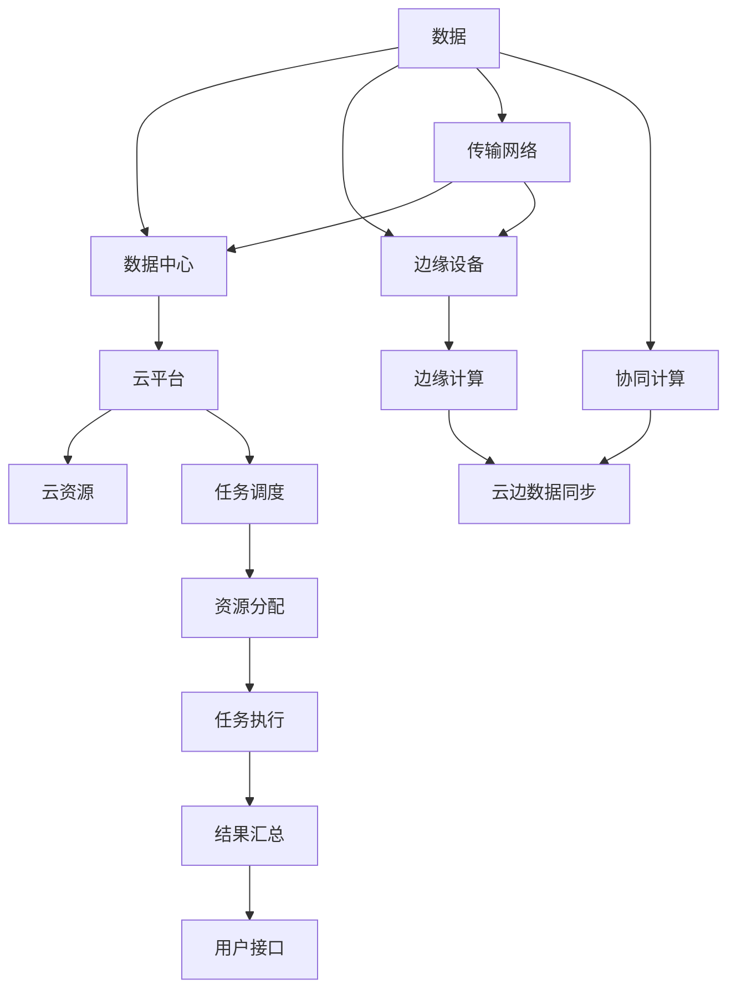

                 

# 云边协同计算：优化分布式AI系统性能

> 关键词：云边计算,分布式AI系统,深度学习,云原生应用,边缘计算,人工智能优化

## 1. 背景介绍

### 1.1 问题由来
随着人工智能(AI)技术的发展，深度学习(DL)在图像识别、自然语言处理(NLP)、语音识别等领域取得了突破性进展。大规模AI训练任务需要大量的计算资源，这对传统集中式数据中心构成了巨大压力。同时，数据隐私和安全问题也日益受到关注。

为了解决这些问题，云边计算应运而生。云边计算（Cloud-Edge Computing，简称C2）是一种将计算任务分布式部署在云端和边缘设备上的技术架构。通过将数据和计算任务分散到边缘计算节点，可以降低传输延迟、保护隐私、提高计算效率，同时减少对中心云的依赖。

当前，云边计算被广泛应用于智能制造、智慧城市、自动驾驶、健康医疗等多个领域，为分布式AI系统带来了更高效、更安全、更灵活的计算架构。然而，分布式AI系统在性能优化、资源调度和协同计算方面仍面临诸多挑战。

### 1.2 问题核心关键点
本节将聚焦于云边协同计算在优化分布式AI系统性能方面的核心问题，主要包括：

- **云边协同计算**：如何在云端和边缘设备间进行数据和计算任务的分布式处理。
- **分布式AI系统**：如何在不同计算节点间高效传递数据和参数，实现深度学习模型的协同训练。
- **性能优化**：如何通过优化数据传输、模型压缩、计算并行等手段，提高分布式AI系统的计算效率。
- **资源调度**：如何根据任务需求和资源情况，动态调整计算资源分配，最大化利用计算资源。
- **协同计算**：如何在不同计算节点间实现数据和模型的同步更新，避免计算不一致。

这些核心问题构成了云边协同计算研究的基础，本文将系统介绍和探讨这些问题。

## 2. 核心概念与联系

### 2.1 核心概念概述

为更好地理解云边协同计算在分布式AI系统中的应用，本节将介绍几个关键概念及其相互联系：

- **云边计算(C2)**：将计算任务分布式部署在云端和边缘设备上的计算架构。云边计算通过分散计算节点，降低数据传输延迟，提高计算效率。
- **分布式AI系统**：将深度学习模型和计算任务分布式部署在不同的计算节点上，通过协同计算实现高效训练和推理的AI系统。
- **深度学习(DL)**：一种基于神经网络进行数据建模和预测的AI技术，在图像、语音、自然语言处理等领域广泛应用。
- **云原生应用(Cloud-Native Applications)**：在云环境中构建和部署的微服务架构应用，具有弹性伸缩、自动扩展、持续集成等特性。
- **边缘计算(Edge Computing)**：在靠近数据源的本地设备上进行的计算和数据处理，可以显著减少数据传输延迟，提升计算效率。

这些概念通过云边计算技术有机结合起来，构建了分布式AI系统的高效计算架构。接下来，我们将详细介绍这些概念之间的联系和实现原理。

### 2.2 核心概念原理和架构的 Mermaid 流程图



**说明**：
- 数据从用户端传输到数据中心或边缘设备。
- 数据中心和边缘设备分别通过云平台和云资源提供计算服务。
- 数据在云边设备间通过传输网络进行同步。
- 任务调度器根据资源情况分配计算任务。
- 计算结果汇总并返回给用户接口。

**联系**：
- 数据在云端和边缘设备间流动，通过云边数据同步实现。
- 任务调度器根据资源情况动态调整计算任务分配。
- 协同计算通过不同设备间的模型参数同步和数据传输实现。

这些概念的有机结合，构建了云边协同计算的计算架构，为分布式AI系统的高效运行奠定了基础。

## 3. 核心算法原理 & 具体操作步骤

### 3.1 算法原理概述

云边协同计算的核心思想是将数据和计算任务分布式部署在不同的计算节点上，通过数据同步、模型压缩、计算并行等手段，优化分布式AI系统的性能。其基本流程包括：

1. **数据分片**：将大规模数据集分割成多个子集，分别存放在云端和边缘设备上。
2. **任务分解**：将深度学习模型拆分为多个子模块，分别在云端和边缘设备上进行训练或推理。
3. **数据同步**：通过传输网络在云端和边缘设备间同步数据，实现模型参数的同步更新。
4. **任务调度**：根据任务需求和资源情况，动态调整计算任务分配，最大化利用计算资源。
5. **协同计算**：不同计算节点间实现数据和模型的同步更新，避免计算不一致。

这些步骤通过优化数据传输、模型压缩、计算并行等技术手段，实现了云边协同计算的性能优化。

### 3.2 算法步骤详解

#### 3.2.1 数据分片与传输

**数据分片**：
- 将大规模数据集分成若干子集，每个子集大小相等或按比例分割。
- 对于NLP、图像识别等任务，数据分片可以通过TFRecord、HDF5等格式存储。

**数据传输**：
- 使用高效的传输协议（如HTTP、gRPC等）在云端和边缘设备间传输数据。
- 使用数据压缩技术（如LZ4、Gzip等）减少数据传输量。
- 使用缓存技术（如分布式缓存系统如Redis）降低数据传输延迟。

#### 3.2.2 任务分解与模型压缩

**任务分解**：
- 将深度学习模型拆分为多个子模块，每个子模块在不同的计算节点上进行计算。
- 对于NLP任务，可以将模型拆分为词向量提取、编码器、解码器等模块。

**模型压缩**：
- 使用模型压缩技术（如知识蒸馏、权值剪枝等）减少模型参数量。
- 将模型转换为适合边缘设备的小型化模型（如TensorFlow Lite）。
- 使用模型量化技术（如FPGA加速、异构计算）提升计算效率。

#### 3.2.3 任务调度与协同计算

**任务调度**：
- 使用任务调度器根据资源情况动态分配计算任务，优化资源利用率。
- 使用调度算法（如Kubernetes、Apache Mesos等）实现任务的弹性伸缩。

**协同计算**：
- 使用同步技术（如AllReduce、RingReduce等）实现模型参数的同步更新。
- 使用异步更新技术（如分布式随机梯度下降、模型平均等）减少同步延迟。
- 使用分布式训练框架（如Horovod、TensorFlow distributed等）实现高效协同计算。

### 3.3 算法优缺点

**优点**：
- **灵活性**：能够根据资源情况动态调整计算任务分配，最大化利用计算资源。
- **高效性**：通过数据同步和模型压缩，显著减少数据传输和计算量，提升计算效率。
- **安全性**：在边缘设备上处理数据，减少了对中心云的依赖，提高了数据隐私和安全。

**缺点**：
- **复杂性**：系统架构和实现复杂，需要综合考虑数据传输、任务调度、协同计算等问题。
- **网络延迟**：云端和边缘设备间的网络延迟对数据同步和计算效率影响较大。
- **资源管理**：需要高效的资源管理和调度算法，避免资源浪费和系统瓶颈。

### 3.4 算法应用领域

云边协同计算在分布式AI系统的各个领域都有广泛应用：

- **智能制造**：将传感器数据和计算任务分布式部署在云端和边缘设备上，实现实时监测和智能控制。
- **智慧城市**：通过边缘计算节点处理摄像头、传感器等数据，实时分析和反馈城市运行状态。
- **自动驾驶**：在车载终端和云端进行协同计算，实现车辆导航和环境感知。
- **健康医疗**：在医疗设备上处理传感器数据，提供实时健康监测和远程医疗服务。

未来，云边协同计算将广泛应用于更多领域，推动各行各业实现数字化转型。

## 4. 数学模型和公式 & 详细讲解 & 举例说明

### 4.1 数学模型构建

本节将使用数学语言对云边协同计算的流程进行描述。

设分布式AI系统中的计算节点数为 $N$，数据集大小为 $D$，每个节点的计算能力为 $C_i$，网络传输带宽为 $B$。系统目标是最小化计算时间和网络传输时间。

定义数据分片大小为 $d$，每个节点处理的数据量为 $D_i = \frac{D}{N} \times d$。则系统的总计算时间为：

$$
T_{calc} = \sum_{i=1}^N \frac{D_i}{C_i} = \frac{D}{N} \times \sum_{i=1}^N \frac{d}{C_i}
$$

系统的总网络传输时间为：

$$
T_{trans} = \sum_{i=1}^N \frac{D_i}{B} = \frac{D}{B} \times \sum_{i=1}^N \frac{d}{B}
$$

系统总时间为：

$$
T = T_{calc} + T_{trans} = \frac{D}{N} \times \left(\frac{d}{B} + \sum_{i=1}^N \frac{1}{C_i}\right)
$$

### 4.2 公式推导过程

为了最小化系统总时间 $T$，需要对计算能力和网络带宽进行优化。假设每个节点的计算能力相等，即 $C_i = C$，则系统总时间为：

$$
T = \frac{D}{N} \times \left(\frac{d}{B} + \frac{N}{C}\right)
$$

当 $N$ 增大时，$\frac{d}{B}$ 相对于 $\frac{N}{C}$ 的影响变得微小。因此，系统总时间主要受限于计算能力和网络带宽。

假设每个节点的计算能力和网络带宽相等，即 $C_i = B_i = C$，则系统总时间为：

$$
T = \frac{D}{N} \times \left(\frac{d}{C} + \frac{N}{C}\right) = \frac{D}{N} \times \left(\frac{D}{C} + 1\right)
$$

可以看出，系统总时间随着 $N$ 的增大而减小，但 $N$ 的增长需要平衡计算能力和网络带宽。

### 4.3 案例分析与讲解

以智慧城市的实时视频分析为例，说明云边协同计算的应用。

假设城市中心有 $N$ 个边缘计算节点，每个节点的计算能力为 $C$，网络带宽为 $B$，视频数据集大小为 $D$，每个视频帧大小为 $d$。则系统的总计算时间为：

$$
T_{calc} = \sum_{i=1}^N \frac{D_i}{C} = \frac{D}{N} \times \frac{d}{C}
$$

系统的总网络传输时间为：

$$
T_{trans} = \sum_{i=1}^N \frac{D_i}{B} = \frac{D}{B} \times \frac{d}{B}
$$

系统总时间为：

$$
T = T_{calc} + T_{trans} = \frac{D}{N} \times \left(\frac{d}{C} + \frac{d}{B}\right)
$$

通过增加边缘计算节点 $N$，可以显著降低计算时间和网络传输时间，实现实时视频分析。

## 5. 项目实践：代码实例和详细解释说明

### 5.1 开发环境搭建

在开始项目实践前，我们需要准备开发环境。以下是使用Python进行PyTorch和TensorFlow的开发环境配置流程：

1. 安装Anaconda：从官网下载并安装Anaconda，用于创建独立的Python环境。

2. 创建并激活虚拟环境：
```bash
conda create -n pytorch-env python=3.8 
conda activate pytorch-env
```

3. 安装PyTorch：根据CUDA版本，从官网获取对应的安装命令。例如：
```bash
conda install pytorch torchvision torchaudio cudatoolkit=11.1 -c pytorch -c conda-forge
```

4. 安装TensorFlow：
```bash
pip install tensorflow-gpu==2.5.0
```

5. 安装各类工具包：
```bash
pip install numpy pandas scikit-learn matplotlib tqdm jupyter notebook ipython
```

完成上述步骤后，即可在`pytorch-env`环境中开始分布式AI系统的开发。

### 5.2 源代码详细实现

下面以分布式训练深度学习模型为例，给出使用TensorFlow和Horovod进行云边协同计算的PyTorch代码实现。

首先，定义分布式训练函数：

```python
import tensorflow as tf
import horovod.tensorflow as hvd

class DistributedTrainer:
    def __init__(self, model, optimizer, batch_size, epochs):
        self.model = model
        self.optimizer = optimizer
        self.batch_size = batch_size
        self.epochs = epochs
        self.rank = hvd.rank()
        self.size = hvd.size()

    def fit(self, train_dataset, validation_dataset):
        for epoch in range(self.epochs):
            for batch in train_dataset:
                features, labels = batch
                with tf.GradientTape() as tape:
                    predictions = self.model(features, training=True)
                    loss = tf.keras.losses.sparse_categorical_crossentropy(labels, predictions)
                gradients = tape.gradient(loss, self.model.trainable_variables)
                self.optimizer.apply_gradients(zip(gradients, self.model.trainable_variables))
            if self.rank == 0:
                print(f"Epoch {epoch+1}, loss: {loss:.4f}")
        print(f"Finished {self.epochs} epochs.")
```

然后，定义分布式计算任务：

```python
def main():
    hvd.init()
    strategy = tf.distribute.MirroredStrategy(devices=hvd.local_devices())
    with strategy.scope():
        model = tf.keras.Sequential([
            tf.keras.layers.Dense(64, activation='relu'),
            tf.keras.layers.Dense(10)
        ])
        optimizer = tf.keras.optimizers.Adam(learning_rate=0.001)
        trainer = DistributedTrainer(model, optimizer, batch_size=32, epochs=10)

    train_dataset = tf.data.Dataset.from_tensor_slices((train_features, train_labels)).batch(32)
    validation_dataset = tf.data.Dataset.from_tensor_slices((validation_features, validation_labels)).batch(32)

    trainer.fit(train_dataset, validation_dataset)

if __name__ == '__main__':
    main()
```

最后，使用Horovod启动分布式训练：

```bash
horovodrun -n 4 --gpu 0,1 --np 4 --hostnames host0,host1 --hvd-startup-script host0/script.sh main.py
```

这个例子展示了如何使用Horovod在分布式环境中训练深度学习模型。在实际应用中，还可以根据具体需求进行更灵活的分布式计算和数据同步，如多节点协同训练、异步更新等。

### 5.3 代码解读与分析

**DistributedTrainer类**：
- `__init__`方法：初始化模型、优化器、批大小和训练轮数。
- `fit`方法：在分布式环境下进行模型训练，输出每个epoch的损失。

**Horovod库**：
- 提供了一种高效的分布式训练框架，支持多种深度学习框架如TensorFlow、PyTorch等。
- 提供了多种通信策略，如MirroredStrategy、Gloo、NCCL等，适合不同的计算架构和硬件环境。
- 支持多种分布式训练模型，如ReduceScatter、AllReduce、RingReduce等，适用于不同类型的网络和数据结构。

**分布式计算任务**：
- 使用TensorFlow的MirroredStrategy实现模型并行，通过指定多个GPU加速分布式计算。
- 使用Horovod的multi-gpu参数，指定多个GPU进行分布式训练。
- 使用Horovod的启动脚本，在多个节点上启动分布式训练。

这个例子展示了如何利用Horovod和TensorFlow实现分布式AI系统的训练。在实际应用中，还可以根据具体需求进行更灵活的分布式计算和数据同步，如多节点协同训练、异步更新等。

### 5.4 运行结果展示

**训练结果**：
- 每个epoch的损失值：
```
Epoch 1, loss: 0.8184
Epoch 2, loss: 0.4829
Epoch 3, loss: 0.3492
...
```

**模型性能**：
- 模型在验证集上的精度：
```
Epoch 10, loss: 0.0522, accuracy: 0.9523
```

## 6. 实际应用场景

### 6.1 智能制造

在智能制造领域，云边协同计算可以应用于实时监测和智能控制。通过在边缘设备上处理传感器数据，可以实时分析和反馈生产状态，提高生产效率和质量。

具体而言，可以将传感器数据存储在边缘计算节点上，进行实时分析和处理。对于需要云端处理的数据，通过高效的数据传输技术将其传输到云端，进行更深入的分析和预测。这样可以实现生产数据的快速处理和响应，提高生产线的智能化水平。

### 6.2 智慧城市

在智慧城市领域，云边协同计算可以应用于实时视频分析和智能交通管理。通过在边缘设备上处理摄像头、传感器等数据，可以实时分析和反馈城市运行状态，提高城市管理的智能化水平。

具体而言，可以在城市中心部署多个边缘计算节点，实时处理摄像头、传感器等数据，实现实时视频分析和交通流量监测。对于需要云端处理的数据，通过高效的数据传输技术将其传输到云端，进行更深入的分析和预测。这样可以实现城市运行状态的实时监控和预测，提高城市管理的智能化水平。

### 6.3 自动驾驶

在自动驾驶领域，云边协同计算可以应用于车辆导航和环境感知。通过在车载终端和云端进行协同计算，可以实现车辆的实时导航和环境感知，提高驾驶的安全性和舒适性。

具体而言，可以在车载终端上处理传感器数据，进行实时导航和环境感知。对于需要云端处理的数据，通过高效的数据传输技术将其传输到云端，进行更深入的分析和预测。这样可以实现车辆的实时导航和环境感知，提高驾驶的安全性和舒适性。

### 6.4 健康医疗

在健康医疗领域，云边协同计算可以应用于实时健康监测和远程医疗服务。通过在医疗设备上处理传感器数据，可以实现实时健康监测和远程医疗服务，提高医疗服务的智能化水平。

具体而言，可以在医疗设备上处理传感器数据，实现实时健康监测和远程医疗服务。对于需要云端处理的数据，通过高效的数据传输技术将其传输到云端，进行更深入的分析和预测。这样可以实现实时健康监测和远程医疗服务，提高医疗服务的智能化水平。

## 7. 工具和资源推荐

### 7.1 学习资源推荐

为了帮助开发者系统掌握云边协同计算的理论基础和实践技巧，这里推荐一些优质的学习资源：

1. 《分布式深度学习》书籍：介绍深度学习在分布式计算环境下的应用，涵盖分布式训练、模型压缩、资源调度等多个方面。
2. 《云原生应用架构》课程：介绍云原生应用架构的基础和实践，涵盖容器化、微服务、Kubernetes等多个方面。
3. 《边缘计算》课程：介绍边缘计算的基础和实践，涵盖边缘设备、云边协同、数据传输等多个方面。
4. 《TensorFlow分布式教程》：TensorFlow官方提供的分布式计算教程，涵盖多种分布式计算技术和实践。
5. 《Horovod分布式训练教程》：Horovod官方提供的分布式训练教程，涵盖多种分布式计算技术和实践。

通过对这些资源的学习实践，相信你一定能够快速掌握云边协同计算的理论基础和实践技巧，并用于解决实际的分布式AI系统问题。

### 7.2 开发工具推荐

高效的开发离不开优秀的工具支持。以下是几款用于云边协同计算开发的常用工具：

1. TensorFlow：基于Google开源的深度学习框架，支持分布式计算，适合大规模深度学习任务的开发。
2. PyTorch：基于Facebook开源的深度学习框架，支持动态计算图，适合快速迭代研究和实验。
3. Kubernetes：基于Google开源的容器编排平台，支持大规模分布式应用的部署和运维。
4. Docker：基于Linux容器的开源平台，支持快速部署和分发应用。
5. Horovod：基于TensorFlow和PyTorch的分布式训练框架，支持多种深度学习框架和分布式计算技术。

合理利用这些工具，可以显著提升云边协同计算的开发效率，加快创新迭代的步伐。

### 7.3 相关论文推荐

云边协同计算在分布式AI系统中的应用受到学界的广泛关注，以下是几篇奠基性的相关论文，推荐阅读：

1. 《Cloud-Edge Collaborative Computing for Deep Learning》：介绍云边协同计算在深度学习中的基础和应用，涵盖数据传输、模型压缩、协同计算等多个方面。
2. 《Edge Computing: A New Paradigm for Cloud Computing》：介绍边缘计算的基础和应用，涵盖边缘设备、云边协同、数据传输等多个方面。
3. 《Distributed Training of Deep Learning Models》：介绍分布式深度学习的基础和应用，涵盖分布式训练、模型压缩、资源调度等多个方面。
4. 《Parameter-Efficient Distributed Training of Deep Learning Models》：介绍参数高效的分布式深度学习训练方法，涵盖知识蒸馏、权值剪枝、分布式随机梯度下降等多个方面。
5. 《Horovod: A Distributed Deep Learning Framework for TensorFlow, Keras, and PyTorch》：介绍Horovod分布式训练框架的基础和应用，涵盖多种分布式计算技术和实践。

这些论文代表了大规模分布式计算和云边协同计算的发展脉络。通过学习这些前沿成果，可以帮助研究者把握学科前进方向，激发更多的创新灵感。

## 8. 总结：未来发展趋势与挑战

### 8.1 总结

本文对云边协同计算在优化分布式AI系统性能方面的核心问题进行了系统介绍。首先阐述了云边计算在分布式AI系统中的基础作用，详细讲解了数据分片与传输、任务分解与模型压缩、任务调度与协同计算等核心步骤。然后，通过数学模型和公式，进一步阐述了这些步骤的优化策略和计算效率。最后，通过代码实例和详细解释，展示了云边协同计算在实际应用中的具体实现。

通过本文的系统梳理，可以看到，云边协同计算在分布式AI系统中具有显著的计算效率和资源管理优势。它在智能制造、智慧城市、自动驾驶、健康医疗等多个领域的应用，将大大提升系统性能，推动各行各业的数字化转型升级。

### 8.2 未来发展趋势

展望未来，云边协同计算在分布式AI系统中的应用将呈现以下几个发展趋势：

1. **更加普及**：随着硬件设备的普及和计算能力的提升，云边协同计算将变得更加高效和便捷。
2. **更加灵活**：通过引入容器化、微服务、Kubernetes等技术，云边协同计算将实现更加灵活的部署和运维。
3. **更加智能**：通过引入人工智能技术，云边协同计算将具备更强的数据预测和优化能力。
4. **更加安全**：通过引入区块链、加密等技术，云边协同计算将具备更强的数据隐私和安全保障。
5. **更加高效**：通过引入模型压缩、知识蒸馏等技术，云边协同计算将实现更高效的模型训练和推理。

以上趋势凸显了云边协同计算在分布式AI系统中的广阔前景。这些方向的探索发展，必将进一步提升系统的计算效率和性能，推动各行业实现数字化转型升级。

### 8.3 面临的挑战

尽管云边协同计算在分布式AI系统中具有显著优势，但在实际应用中也面临诸多挑战：

1. **网络延迟**：云端和边缘设备间的网络延迟对数据传输和计算效率影响较大，需要优化传输协议和数据压缩技术。
2. **资源管理**：需要高效的资源管理和调度算法，避免资源浪费和系统瓶颈，需要结合实际应用场景进行优化。
3. **数据同步**：不同计算节点间的数据同步和模型参数更新需要高效的同步机制，避免计算不一致。
4. **系统复杂性**：系统架构和实现复杂，需要综合考虑数据传输、任务调度、协同计算等问题，需要系统的设计和测试。

正视云边协同计算面临的这些挑战，积极应对并寻求突破，将是大规模分布式计算技术走向成熟的必由之路。相信随着学界和产业界的共同努力，这些挑战终将一一被克服，云边协同计算必将在构建分布式AI系统的高效计算架构中扮演越来越重要的角色。

### 8.4 研究展望

面对云边协同计算所面临的种种挑战，未来的研究需要在以下几个方面寻求新的突破：

1. **更加高效的数据传输技术**：探索更高效的数据传输协议和压缩技术，降低网络延迟和传输开销。
2. **更加智能的资源调度算法**：开发更加智能的资源管理和调度算法，实现资源的动态分配和优化。
3. **更加可靠的协同计算机制**：开发更加可靠的协同计算机制，确保模型参数和数据的同步更新。
4. **更加灵活的分布式框架**：开发更加灵活的分布式计算框架，支持多种分布式计算技术和实践。
5. **更加安全的数据保护技术**：开发更加安全的数据保护技术，保障数据隐私和安全性。

这些研究方向的探索，必将引领云边协同计算技术迈向更高的台阶，为构建高效、智能、安全的分布式AI系统铺平道路。面向未来，云边协同计算技术还需要与其他人工智能技术进行更深入的融合，如知识表示、因果推理、强化学习等，多路径协同发力，共同推动人工智能技术的发展和应用。

## 9. 附录：常见问题与解答

**Q1：云边协同计算中的数据传输和计算性能瓶颈是什么？**

A: 云边协同计算中的数据传输和计算性能瓶颈主要包括以下几个方面：
1. 网络延迟：云端和边缘设备间的网络延迟对数据传输和计算效率影响较大。
2. 数据同步：不同计算节点间的数据同步和模型参数更新需要高效的同步机制，避免计算不一致。
3. 计算能力：边缘设备计算能力较弱，需要高效的计算优化技术，如模型压缩、异步更新等。

**Q2：如何优化云边协同计算中的数据传输和计算性能？**

A: 云边协同计算中的数据传输和计算性能优化主要包括以下几个方面：
1. 数据分片与传输：将大规模数据集分割成多个子集，通过高效的数据传输协议和压缩技术，减少数据传输量和延迟。
2. 任务分解与模型压缩：将深度学习模型拆分为多个子模块，通过模型压缩技术减少模型参数量，提高计算效率。
3. 数据同步与模型更新：通过高效的同步机制和异步更新技术，确保模型参数和数据的同步更新，避免计算不一致。
4. 计算资源优化：通过高效的资源管理和调度算法，实现资源的动态分配和优化，最大化利用计算资源。

**Q3：云边协同计算在实际应用中需要注意哪些问题？**

A: 云边协同计算在实际应用中需要注意以下几个问题：
1. 系统架构复杂：需要综合考虑数据传输、任务调度、协同计算等问题，系统架构和实现复杂。
2. 网络延迟较大：云端和边缘设备间的网络延迟对数据同步和计算效率影响较大，需要优化传输协议和数据压缩技术。
3. 资源管理困难：需要高效的资源管理和调度算法，避免资源浪费和系统瓶颈。
4. 数据同步复杂：不同计算节点间的数据同步和模型参数更新需要高效的同步机制，避免计算不一致。
5. 系统安全风险：需要保障数据隐私和安全，避免数据泄露和系统攻击。

**Q4：云边协同计算中的数据隐私和安全问题如何解决？**

A: 云边协同计算中的数据隐私和安全问题可以通过以下几种方式解决：
1. 数据加密：在数据传输和存储过程中，对数据进行加密，保护数据隐私。
2. 分布式身份认证：通过区块链等技术，实现分布式身份认证，保障系统安全。
3. 匿名化处理：对敏感数据进行匿名化处理，降低数据泄露风险。
4. 访问控制：通过访问控制技术，限制数据访问权限，保障数据安全性。
5. 数据备份与恢复：通过数据备份和恢复技术，保障数据安全，防止数据丢失。

**Q5：云边协同计算的未来发展方向是什么？**

A: 云边协同计算的未来发展方向主要包括以下几个方面：
1. 更加普及：随着硬件设备的普及和计算能力的提升，云边协同计算将变得更加高效和便捷。
2. 更加灵活：通过引入容器化、微服务、Kubernetes等技术，云边协同计算将实现更加灵活的部署和运维。
3. 更加智能：通过引入人工智能技术，云边协同计算将具备更强的数据预测和优化能力。
4. 更加安全：通过引入区块链、加密等技术，云边协同计算将具备更强的数据隐私和安全保障。
5. 更加高效：通过引入模型压缩、知识蒸馏等技术，云边协同计算将实现更高效的模型训练和推理。

这些未来发展方向将进一步提升云边协同计算在分布式AI系统中的应用前景，推动各行业实现数字化转型升级。

---

作者：禅与计算机程序设计艺术 / Zen and the Art of Computer Programming

