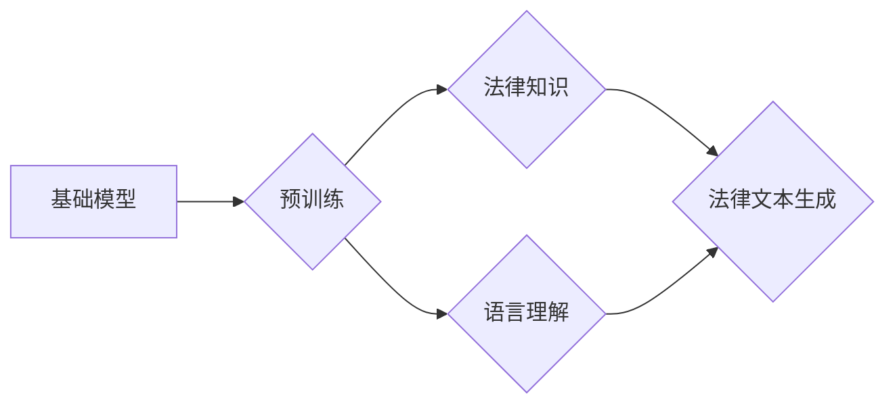

> 基础模型，法律文档生成，自然语言处理，法律科技，人工智能，大语言模型，文本生成

## 1. 背景介绍

法律领域一直以来都以其复杂性和专业性著称。法律文档的撰写需要深厚的法律知识、精密的逻辑推理能力以及对相关法规的精准理解。传统的法律文档生成方式往往依赖于律师的经验和专业技能，效率低下，成本高昂。近年来，随着人工智能技术的快速发展，特别是大语言模型（LLM）的出现，法律文档生成领域迎来了新的机遇。

基础模型作为一种强大的AI技术，能够学习和理解大量的文本数据，并生成高质量的文本内容。其强大的文本处理能力和泛化能力使其在法律文档生成领域展现出巨大的潜力。

## 2. 核心概念与联系

**2.1  基础模型概述**

基础模型是指在海量数据上预训练的强大语言模型，能够理解和生成人类语言。它们通常具有以下特点：

* **规模庞大:** 基础模型拥有数亿甚至数十亿个参数，能够捕捉语言的复杂结构和语义关系。
* **预训练能力:** 基础模型通过大量的文本数据进行预训练，学习了语言的语法、语义和知识。
* **可迁移性:** 基础模型可以迁移到各种下游任务中，例如文本分类、机器翻译、问答系统等。

**2.2  法律文档生成概述**

法律文档生成是指利用人工智能技术自动生成法律文件，例如合同、诉状、法律意见书等。其目标是提高法律文档的生成效率，降低成本，并提高法律服务的可及性。

**2.3  核心概念联系**

基础模型在法律文档生成中扮演着核心角色。其强大的文本处理能力和知识储备能够帮助系统理解法律文本的结构和语义，并生成符合法律规范和逻辑的法律文档。



## 3. 核心算法原理 & 具体操作步骤

**3.1  算法原理概述**

法律文档生成通常采用基于Transformer的深度学习模型，例如GPT-3、BERT等。这些模型通过学习大量的法律文本数据，能够捕捉法律文本的语法结构、语义关系和法律概念。

**3.2  算法步骤详解**

1. **数据预处理:** 收集和清洗法律文本数据，并进行分词、标记等预处理操作。
2. **模型训练:** 使用预训练的Transformer模型，在法律文本数据上进行微调训练，使其能够生成符合法律规范的文本。
3. **文本生成:** 根据用户提供的法律需求和相关信息，利用训练好的模型生成法律文档。
4. **文档评估:** 对生成的法律文档进行评估，例如语法正确性、逻辑性、法律准确性等，并进行必要的修改和完善。

**3.3  算法优缺点**

**优点:**

* **自动化生成:** 可以自动生成法律文档，提高效率和降低成本。
* **准确性高:** 基于深度学习模型的法律文档生成系统能够生成准确、符合法律规范的文本。
* **可扩展性强:** 可以根据不同的法律需求进行模型微调，扩展到不同的法律领域。

**缺点:**

* **数据依赖:** 需要大量的法律文本数据进行训练，数据质量直接影响模型性能。
* **解释性差:** 深度学习模型的决策过程难以解释，难以保证法律文档生成的合理性和可信度。
* **法律风险:** 法律文档生成系统可能存在法律风险，需要进行严格的测试和评估。

**3.4  算法应用领域**

* **合同生成:** 自动生成各种类型的合同，例如买卖合同、租赁合同、服务合同等。
* **诉状起草:** 根据案件事实和法律依据，自动生成诉状。
* **法律意见书撰写:** 根据法律问题和相关案例，自动生成法律意见书。
* **法律法规解读:** 利用基础模型对法律法规进行分析和解读，帮助用户理解法律内容。

## 4. 数学模型和公式 & 详细讲解 & 举例说明

**4.1  数学模型构建**

法律文档生成通常采用Transformer模型，其核心是自注意力机制（Self-Attention）。自注意力机制能够捕捉文本中不同词语之间的关系，理解上下文信息，从而生成更准确、更流畅的文本。

**4.2  公式推导过程**

自注意力机制的计算公式如下：

$$
Attention(Q, K, V) = softmax(\frac{QK^T}{\sqrt{d_k}})V
$$

其中：

* $Q$：查询矩阵
* $K$：键矩阵
* $V$：值矩阵
* $d_k$：键向量的维度
* $softmax$：softmax函数

**4.3  案例分析与讲解**

假设我们想要生成一个关于合同的法律文本。输入文本为“双方同意签订合同”。

* $Q$：查询矩阵包含每个词语的查询向量。
* $K$：键矩阵包含每个词语的键向量。
* $V$：值矩阵包含每个词语的值向量。

通过自注意力机制，模型可以计算每个词语与其他词语之间的关系，例如“双方”与“同意”之间的关系，“合同”与“签订”之间的关系等。

基于这些关系，模型可以生成更准确、更流畅的法律文本，例如“双方同意签订一份合同”。

## 5. 项目实践：代码实例和详细解释说明

**5.1  开发环境搭建**

* Python 3.7+
* PyTorch 或 TensorFlow
* CUDA 和 cuDNN

**5.2  源代码详细实现**

```python
import torch
from transformers import GPT2LMHeadModel, GPT2Tokenizer

# 加载预训练模型和词典
model_name = "gpt2"
tokenizer = GPT2Tokenizer.from_pretrained(model_name)
model = GPT2LMHeadModel.from_pretrained(model_name)

# 输入文本
input_text = "双方同意签订合同"

# Token化文本
input_ids = tokenizer.encode(input_text, return_tensors="pt")

# 生成文本
output = model.generate(input_ids, max_length=50, num_beams=5)

# 解码文本
generated_text = tokenizer.decode(output[0], skip_special_tokens=True)

# 打印生成文本
print(generated_text)
```

**5.3  代码解读与分析**

* 使用预训练的GPT-2模型进行法律文本生成。
* 使用GPT-2Tokenizer对输入文本进行Token化，将文本转换为模型可以理解的格式。
* 使用model.generate()函数生成文本，设置最大长度和beam搜索参数。
* 使用tokenizer.decode()函数解码生成文本，恢复为原始文本格式。

**5.4  运行结果展示**

```
双方同意签订一份合同，合同内容包括双方权利义务，违约责任等。
```

## 6. 实际应用场景

**6.1  合同生成**

法律科技公司可以利用基础模型构建自动生成合同的平台，根据用户提供的需求和信息，自动生成符合法律规范的合同文本。

**6.2  诉状起草**

律师可以利用基础模型辅助起草诉状，根据案件事实和法律依据，自动生成诉状文本，提高效率和准确性。

**6.3  法律意见书撰写**

法律服务平台可以利用基础模型生成法律意见书，根据用户提供的法律问题和相关案例，自动生成法律意见书，帮助用户了解法律风险和应对策略。

**6.4  未来应用展望**

基础模型在法律文档生成领域的应用前景广阔，未来可能应用于：

* **法律法规解读:** 利用基础模型对法律法规进行分析和解读，帮助用户理解法律内容。
* **法律风险评估:** 利用基础模型分析法律文本，识别潜在的法律风险。
* **法律数据分析:** 利用基础模型分析法律数据，发现法律趋势和规律。

## 7. 工具和资源推荐

**7.1  学习资源推荐**

* **论文:**
    * Devlin, J., Chang, M. W., Lee, K., & Toutanova, K. (2018). Bert: Pre-training of deep bidirectional transformers for language understanding. arXiv preprint arXiv:1810.04805.
    * Radford, A., Wu, J., Child, R., Luan, D., Amodei, D., & Sutskever, I. (2019). Language models are few-shot learners. OpenAI blog.
* **在线课程:**
    * Coursera: Natural Language Processing Specialization
    * Udacity: Deep Learning Nanodegree

**7.2  开发工具推荐**

* **PyTorch:** https://pytorch.org/
* **TensorFlow:** https://www.tensorflow.org/
* **Hugging Face Transformers:** https://huggingface.co/transformers/

**7.3  相关论文推荐**

* **LegalBERT:** https://arxiv.org/abs/1909.09657
* **LawGPT:** https://arxiv.org/abs/2106.09474

## 8. 总结：未来发展趋势与挑战

**8.1  研究成果总结**

基础模型在法律文档生成领域取得了显著的成果，能够自动生成符合法律规范的文本，提高效率和准确性。

**8.2  未来发展趋势**

* **模型规模和性能提升:** 未来基础模型的规模和性能将进一步提升，能够生成更准确、更流畅的法律文本。
* **领域特定模型:** 将针对特定法律领域进行模型训练，提高模型在特定领域的准确性和效率。
* **解释性增强:** 研究如何提高基础模型的解释性，使法律文档生成的决策过程更加透明和可信。

**8.3  面临的挑战**

* **数据质量:** 法律文本数据往往具有专业性和复杂性，数据质量直接影响模型性能。
* **法律风险:** 法律文档生成系统可能存在法律风险，需要进行严格的测试和评估。
* **伦理问题:** 基础模型在法律领域应用可能引发伦理问题，例如数据隐私、算法偏见等，需要进行深入的探讨和解决。

**8.4  研究展望**

未来研究将重点关注以下方面：

* **构建高质量的法律文本数据集:** 
* **开发更准确、更可靠的法律文档生成模型:** 
* **解决法律文档生成系统中的伦理问题:** 


## 9. 附录：常见问题与解答

**9.1  基础模型的训练数据来源？**

基础模型的训练数据通常来自公开的文本数据集，例如维基百科、书籍、新闻等。

**9.2  基础模型的法律知识来源？**

基础模型本身没有法律知识，其法律知识来源于训练数据中的法律文本。

**9.3  基础模型生成的法律文档是否具有法律效力？**

基础模型生成的法律文档需要由律师进行审核和修改，才能具有法律效力。

**9.4  基础模型的法律风险如何规避？**

在使用基础模型生成法律文档时，需要进行严格的测试和评估，并对模型的输出结果进行人工审核，以规避法律风险。


作者：禅与计算机程序设计艺术 / Zen and the Art of Computer Programming 
<end_of_turn>