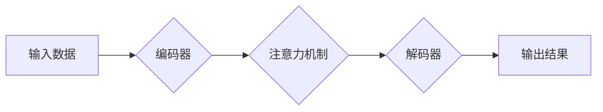

> 基础模型、深度学习、迁移学习、泛化能力、应用场景

## 1. 背景介绍

近年来，深度学习技术取得了飞速发展，在计算机视觉、自然语言处理、语音识别等领域取得了突破性进展。其中，基础模型（Foundation Models）作为深度学习领域的新兴研究方向，引起了广泛关注。基础模型是指在海量数据上预训练的大规模深度学习模型，具有强大的泛化能力和可迁移性，能够应用于多种下游任务。

传统的深度学习模型通常针对特定任务进行训练，需要大量的标注数据和专门的模型架构设计。而基础模型则通过在海量通用数据上进行预训练，学习到更底层的语义表示和知识，从而能够适应多种不同的下游任务，并减少对特定任务数据和模型架构的依赖。

## 2. 核心概念与联系

基础模型的核心概念是**预训练**和**微调**。

* **预训练**: 在海量通用数据上训练深度学习模型，学习到通用的语义表示和知识。
* **微调**: 将预训练模型应用于特定任务，通过在少量标注数据上进行微调，使其能够更好地完成特定任务。

**基础模型的架构通常包括以下几个部分:**

* **编码器**: 用于提取输入数据的特征表示。
* **解码器**: 用于根据编码器的输出生成目标输出。
* **注意力机制**: 用于学习输入数据之间的关系，提高模型的理解能力。

**基础模型与其他相关概念的联系:**

* **迁移学习**: 基础模型的预训练过程本质上是一种迁移学习，将预先学习到的知识迁移到新的任务中。
* **知识蒸馏**: 基于基础模型的知识蒸馏技术可以将大型模型的知识迁移到小型模型中，提高小型模型的性能。
* **联邦学习**: 基于基础模型的联邦学习技术可以将多个设备上的数据进行联合训练，保护数据隐私。

**基础模型的架构示意图:**



## 3. 核心算法原理 & 具体操作步骤

### 3.1  算法原理概述

基础模型的训练主要基于**自监督学习**和**无监督学习**的原理。

* **自监督学习**: 通过设计特殊的预训练任务，例如语言建模、图像分类等，在未标记数据上训练模型，学习到通用的语义表示。
* **无监督学习**: 通过分析数据的结构和模式，例如聚类、降维等，学习到数据的潜在特征。

### 3.2  算法步骤详解

1. **数据预处理**: 将原始数据进行清洗、格式化和转换，使其适合模型训练。
2. **模型选择**: 选择合适的深度学习模型架构，例如Transformer、CNN等。
3. **预训练**: 在海量通用数据上训练模型，学习到通用的语义表示。
4. **微调**: 将预训练模型应用于特定任务，通过在少量标注数据上进行微调，使其能够更好地完成特定任务。
5. **评估**: 使用测试数据评估模型的性能，并根据需要进行模型调整和优化。

### 3.3  算法优缺点

**优点:**

* **强大的泛化能力**: 基于海量数据的预训练，基础模型能够更好地泛化到新的任务和数据。
* **可迁移性**: 预训练模型可以应用于多种不同的下游任务，减少对特定任务数据的依赖。
* **效率提升**: 基于预训练模型的微调，可以显著减少训练时间和资源消耗。

**缺点:**

* **训练成本高**: 预训练大型模型需要大量的计算资源和时间。
* **数据依赖性**: 基础模型的性能依赖于预训练数据的质量和规模。
* **可解释性差**: 深度学习模型的内部机制复杂，难以解释其决策过程。

### 3.4  算法应用领域

基础模型在多个领域都有广泛的应用，例如:

* **自然语言处理**: 文本分类、情感分析、机器翻译、对话系统等。
* **计算机视觉**: 图像识别、物体检测、图像分割、视频分析等。
* **语音识别**: 语音转文本、语音合成、语音助手等。
* **推荐系统**: 商品推荐、内容推荐、用户画像等。

## 4. 数学模型和公式 & 详细讲解 & 举例说明

### 4.1  数学模型构建

基础模型的训练通常基于**最大似然估计** (Maximum Likelihood Estimation,MLE) 和**交叉熵损失函数** (Cross-Entropy Loss Function)。

* **最大似然估计**: 旨在找到模型参数，使得模型在训练数据上的概率最大化。
* **交叉熵损失函数**: 用于衡量模型预测结果与真实标签之间的差异。

### 4.2  公式推导过程

假设模型输出为 $p(y|x)$，真实标签为 $y$，则交叉熵损失函数可以表示为:

$$
L = -\sum_{i=1}^{N} y_i \log p(y_i|x_i)
$$

其中，$N$ 为样本数量。

### 4.3  案例分析与讲解

例如，在语言建模任务中，模型需要预测下一个词的概率。假设模型输出下一个词为 "hello" 的概率为 0.8，真实标签为 "hello"，则交叉熵损失函数为:

$$
L = -1 \log 0.8 = -0.223
$$

## 5. 项目实践：代码实例和详细解释说明

### 5.1  开发环境搭建

* Python 3.7+
* PyTorch 1.7+
* CUDA 10.2+

### 5.2  源代码详细实现

```python
import torch
import torch.nn as nn

class Transformer(nn.Module):
    def __init__(self, vocab_size, embedding_dim, num_heads, num_layers):
        super(Transformer, self).__init__()
        self.embedding = nn.Embedding(vocab_size, embedding_dim)
        self.transformer_encoder = nn.TransformerEncoder(nn.TransformerEncoderLayer(embedding_dim, num_heads), num_layers)

    def forward(self, x):
        x = self.embedding(x)
        x = self.transformer_encoder(x)
        return x
```

### 5.3  代码解读与分析

* `Transformer` 类定义了一个基于 Transformer 架构的模型。
* `embedding` 层将输入词转换为词向量。
* `transformer_encoder` 层是一个 Transformer 编码器，用于学习输入序列的语义表示。

### 5.4  运行结果展示

训练模型后，可以将其应用于下游任务，例如文本分类、机器翻译等。

## 6. 实际应用场景

基础模型在多个实际应用场景中取得了显著的成果，例如:

* **ChatGPT**: 基于 GPT-3 的对话生成模型，能够进行自然流畅的对话。
* **DALL-E 2**: 基于 CLIP 和 GPT-3 的文本到图像生成模型，能够根据文本描述生成逼真的图像。
* **LaMDA**: 基于 Transformer 的对话生成模型，能够进行更自然、更人性化的对话。

### 6.4  未来应用展望

基础模型的应用前景广阔，未来将应用于更多领域，例如:

* **个性化教育**: 根据学生的学习情况提供个性化的学习内容和辅导。
* **医疗诊断**: 基于患者的病史和症状进行疾病诊断。
* **科学研究**: 辅助科学家进行数据分析和模型构建。

## 7. 工具和资源推荐

### 7.1  学习资源推荐

* **论文**:
    * "BERT: Pre-training of Deep Bidirectional Transformers for Language Understanding"
    * "GPT-3: Language Models are Few-Shot Learners"
    * "DALL-E 2: Hierarchical Text-Conditional Image Generation with CLIP Latents"
* **博客**:
    * OpenAI Blog
    * Google AI Blog
    * Hugging Face Blog

### 7.2  开发工具推荐

* **PyTorch**: 深度学习框架
* **TensorFlow**: 深度学习框架
* **Hugging Face Transformers**: 基于 Transformer 的预训练模型库

### 7.3  相关论文推荐

* "Attention Is All You Need"
* "BERT: Pre-training of Deep Bidirectional Transformers for Language Understanding"
* "GPT-3: Language Models are Few-Shot Learners"

## 8. 总结：未来发展趋势与挑战

### 8.1  研究成果总结

基础模型在深度学习领域取得了显著的进展，展现出强大的泛化能力和可迁移性，为人工智能的未来发展提供了重要的基础。

### 8.2  未来发展趋势

* **模型规模的进一步扩大**: 预训练更大规模的模型，学习更丰富的知识和表示。
* **多模态学习**: 将文本、图像、音频等多种模态数据融合在一起，学习更全面的知识。
* **可解释性研究**: 研究基础模型的内部机制，提高模型的可解释性和可信任性。

### 8.3  面临的挑战

* **训练成本**: 预训练大型模型需要大量的计算资源和时间。
* **数据安全**: 基础模型的训练依赖于海量数据，需要解决数据安全和隐私保护问题。
* **伦理问题**: 基础模型的应用可能带来伦理问题，例如偏见、歧视等，需要进行伦理规范和风险评估。

### 8.4  研究展望

未来，基础模型的研究将继续深入，探索更强大的模型架构、更有效的训练方法和更广泛的应用场景，推动人工智能技术的发展和应用。

## 9. 附录：常见问题与解答

* **什么是基础模型？**

基础模型是指在海量数据上预训练的大规模深度学习模型，具有强大的泛化能力和可迁移性。

* **基础模型的优势是什么？**

基础模型具有强大的泛化能力、可迁移性和效率提升等优势。

* **基础模型有哪些应用场景？**

基础模型应用于自然语言处理、计算机视觉、语音识别等多个领域。

* **如何训练基础模型？**

基础模型的训练主要基于自监督学习和无监督学习的原理。

* **基础模型有哪些挑战？**

基础模型面临训练成本高、数据安全和伦理问题等挑战。


作者：禅与计算机程序设计艺术 / Zen and the Art of Computer Programming 
<end_of_turn>