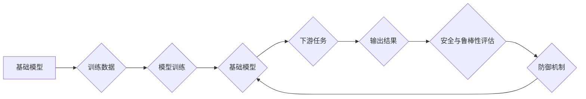

> 基础模型、安全、鲁棒性、对抗攻击、数据中毒、模型可解释性、防御机制

## 1. 背景介绍

近年来，基础模型（Foundation Models）在人工智能领域取得了令人瞩目的成就。这些模型通常拥有庞大的参数规模和广泛的知识储备，能够在各种下游任务中表现出色，例如自然语言处理、计算机视觉和代码生成。然而，基础模型的强大能力也带来了新的安全和鲁棒性挑战。

基础模型的训练数据通常来自互联网，可能包含噪声、偏见和恶意数据。这些问题可能会导致模型产生不准确、不公平甚至有害的输出。此外，攻击者可以利用模型的结构和训练数据设计对抗攻击，以欺骗模型并使其产生错误的预测。

## 2. 核心概念与联系

**2.1 基础模型**

基础模型是指具有广泛适用性的深度学习模型，其训练数据量大、参数规模庞大，能够在多个下游任务中进行微调。例如，GPT-3、BERT、DALL-E 等都是基础模型的代表。

**2.2 安全与鲁棒性**

* **安全**是指模型能够抵抗恶意攻击，并确保其输出符合预期。
* **鲁棒性**是指模型能够在面对噪声、异常数据或环境变化时仍然保持稳定和准确的性能。

**2.3 攻击类型**

* **对抗攻击:** 攻击者通过对输入数据进行微小的扰动，以欺骗模型产生错误的预测。
* **数据中毒:** 攻击者在训练数据中注入恶意数据，以影响模型的训练过程和最终性能。

**2.4 防御机制**

* **对抗训练:** 通过在训练过程中加入对抗样本，增强模型对对抗攻击的抵抗能力。
* **数据增强:** 通过对训练数据进行各种变换，提高模型的鲁棒性。
* **模型剪枝:** 通过移除模型中的冗余参数，降低模型的复杂度和攻击面。

**2.5 模型可解释性**

模型可解释性是指能够理解模型的决策过程，并解释其输出结果。提高模型可解释性可以帮助我们更好地理解模型的缺陷，并设计更有效的防御机制。

**Mermaid 流程图**



## 3. 核心算法原理 & 具体操作步骤

### 3.1 算法原理概述

对抗训练是一种常用的防御机制，其原理是通过在训练过程中加入对抗样本，增强模型对对抗攻击的抵抗能力。对抗样本是指通过对输入数据进行微小的扰动，以欺骗模型产生错误的预测。

### 3.2 算法步骤详解

1. **生成对抗样本:** 使用梯度上升攻击方法生成对抗样本，即对输入数据进行微小的扰动，使得模型的预测结果发生改变。
2. **训练模型:** 将对抗样本和原始数据一起用于训练模型。
3. **评估模型:** 使用测试集评估模型的性能，包括准确率、召回率和F1-score等指标。

### 3.3 算法优缺点

**优点:**

* 能够有效提高模型对对抗攻击的抵抗能力。
* 相对简单易实现。

**缺点:**

* 需要额外的计算资源和时间。
* 可能导致模型在处理真实数据时性能下降。

### 3.4 算法应用领域

对抗训练广泛应用于各种安全敏感的领域，例如：

* **图像识别:** 提高图像识别模型对对抗攻击的抵抗能力。
* **自然语言处理:** 增强文本分类、情感分析等模型的鲁棒性。
* **语音识别:** 提高语音识别模型对噪声和干扰的抵抗能力。

## 4. 数学模型和公式 & 详细讲解 & 举例说明

### 4.1 数学模型构建

假设模型的输出为 $f(x)$，其中 $x$ 为输入数据。对抗样本 $x'$ 可以表示为：

$$x' = x + \epsilon$$

其中 $\epsilon$ 为微小的扰动向量。目标是找到 $\epsilon$，使得模型的输出发生改变，即：

$$f(x') \neq f(x)$$

### 4.2 公式推导过程

对抗训练的目标是最小化以下损失函数：

$$L = f(x') - y$$

其中 $y$ 为真实标签。使用梯度下降法更新模型参数，以最小化损失函数。

### 4.3 案例分析与讲解

例如，在图像识别任务中，攻击者可以利用梯度上升攻击方法生成对抗样本，使得模型将一只猫误识别为一只狗。

## 5. 项目实践：代码实例和详细解释说明

### 5.1 开发环境搭建

* Python 3.7+
* TensorFlow 2.0+
* PyTorch 1.0+

### 5.2 源代码详细实现

```python
import tensorflow as tf

# 定义模型
model = tf.keras.models.Sequential([
    tf.keras.layers.Conv2D(32, (3, 3), activation='relu', input_shape=(28, 28, 1)),
    tf.keras.layers.MaxPooling2D((2, 2)),
    tf.keras.layers.Flatten(),
    tf.keras.layers.Dense(10, activation='softmax')
])

# 定义损失函数和优化器
loss_fn = tf.keras.losses.SparseCategoricalCrossentropy()
optimizer = tf.keras.optimizers.Adam()

# 定义对抗训练的步骤
def adversarial_training_step(images, labels):
    with tf.GradientTape() as tape:
        predictions = model(images)
        loss = loss_fn(labels, predictions)
    gradients = tape.gradient(loss, model.trainable_variables)
    optimizer.apply_gradients(zip(gradients, model.trainable_variables))

# 训练模型
for epoch in range(10):
    for images, labels in train_dataset:
        adversarial_training_step(images, labels)

```

### 5.3 代码解读与分析

* 代码首先定义了模型、损失函数和优化器。
* 然后定义了对抗训练的步骤，包括计算损失函数和更新模型参数。
* 最后，使用训练数据进行对抗训练。

### 5.4 运行结果展示

通过对抗训练，模型的性能在对抗攻击下会得到提升。

## 6. 实际应用场景

基础模型的安全与鲁棒性在许多实际应用场景中至关重要，例如：

* **医疗诊断:** 基于基础模型的医疗诊断系统需要能够抵抗对抗攻击，以确保患者的安全。
* **金融欺诈检测:** 基于基础模型的金融欺诈检测系统需要能够识别恶意数据，并防止金融损失。
* **自动驾驶:** 基于基础模型的自动驾驶系统需要能够应对各种环境变化，并确保驾驶安全。

### 6.4 未来应用展望

随着基础模型的不断发展，其安全与鲁棒性将成为更加重要的研究方向。未来，我们可能会看到以下方面的进展：

* **更有效的防御机制:** 开发更有效的防御机制，以抵抗更复杂的对抗攻击。
* **自适应鲁棒性:** 基于模型自身学习能力，实现自适应鲁棒性，能够动态调整对不同攻击的抵抗能力。
* **可解释的鲁棒性:** 提高模型的可解释性，以便更好地理解模型的鲁棒性，并设计更有效的防御机制。

## 7. 工具和资源推荐

### 7.1 学习资源推荐

* **论文:**
    * Goodfellow et al. (2014). Explaining and Harnessing Adversarial Examples.
    * Szegedy et al. (2013). Intriguing Properties of Neural Networks.
* **书籍:**
    * "Deep Learning" by Ian Goodfellow, Yoshua Bengio, and Aaron Courville.
    * "Adversarial Machine Learning" by Nicholas Carlini and David Wagner.

### 7.2 开发工具推荐

* **TensorFlow:** https://www.tensorflow.org/
* **PyTorch:** https://pytorch.org/

### 7.3 相关论文推荐

* **Adversarial Examples in the Physical World**
* **Robustness of Deep Learning Models to Adversarial Attacks**
* **Towards Deep Learning Models Resistant to Adversarial Attacks**

## 8. 总结：未来发展趋势与挑战

### 8.1 研究成果总结

近年来，在基础模型的安全与鲁棒性方面取得了显著进展。对抗训练、数据增强和模型剪枝等方法有效提高了模型的抵抗能力。

### 8.2 未来发展趋势

未来，基础模型的安全与鲁棒性研究将朝着以下方向发展：

* **更有效的防御机制:** 开发更有效的防御机制，以抵抗更复杂的对抗攻击。
* **自适应鲁棒性:** 基于模型自身学习能力，实现自适应鲁棒性，能够动态调整对不同攻击的抵抗能力。
* **可解释的鲁棒性:** 提高模型的可解释性，以便更好地理解模型的鲁棒性，并设计更有效的防御机制。

### 8.3 面临的挑战

基础模型的安全与鲁棒性研究仍然面临着许多挑战：

* **对抗攻击的复杂性:** 攻击者不断开发新的、更复杂的对抗攻击方法。
* **数据有限:** 训练鲁棒模型需要大量的对抗样本，但获取这些样本非常困难。
* **可解释性问题:** 许多安全与鲁棒性方法难以解释，这使得它们难以被广泛应用。

### 8.4 研究展望

未来，基础模型的安全与鲁棒性研究将继续是一个重要的研究方向。通过不断探索新的方法和技术，我们相信能够开发出更安全、更可靠的基础模型，为人工智能的广泛应用奠定坚实的基础。

## 9. 附录：常见问题与解答

**Q1: 什么是对抗样本？**

**A1:** 对抗样本是指通过对输入数据进行微小的扰动，以欺骗模型产生错误的预测。

**Q2: 如何生成对抗样本？**

**A2:** 常用的方法是梯度上升攻击方法，即利用模型的梯度信息，不断调整输入数据，使得模型的预测结果发生改变。

**Q3: 如何防御对抗攻击？**

**A3:** 一些常用的防御机制包括对抗训练、数据增强和模型剪枝。

**Q4: 模型可解释性与安全有什么关系？**

**A4:** 模型可解释性可以帮助我们更好地理解模型的缺陷，并设计更有效的防御机制。


作者：禅与计算机程序设计艺术 / Zen and the Art of Computer Programming 
<end_of_turn>