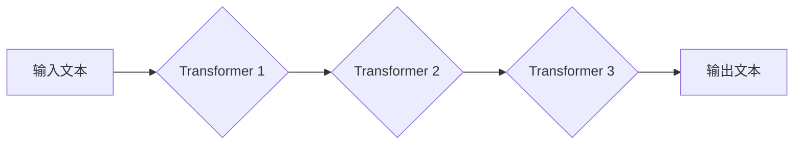

> 超长文本处理，转换链，Transformer，注意力机制，文本生成，文本摘要，代码生成

## 1. 背景介绍

随着自然语言处理 (NLP) 技术的飞速发展，处理超长文本的需求日益增长。超长文本是指长度超过传统 NLP 模型处理能力的文本，例如长篇小说、学术论文、法律文件等。传统的 NLP 模型往往难以有效地处理超长文本，因为它们通常基于固定长度的输入序列，并且在处理长序列时会面临计算成本高、性能下降等问题。

为了解决超长文本处理的挑战，近年来出现了许多新的方法和模型。其中，转换链 (Transform Chain) 是一种新兴的架构，它通过将多个 Transformer 模块串联起来，可以有效地处理超长文本。

## 2. 核心概念与联系

转换链 (Transform Chain) 是一种基于 Transformer 架构的序列到序列模型，它通过将多个 Transformer 模块串联起来，可以处理超长文本。

**核心概念:**

* **Transformer:** Transformer 是一个基于注意力机制的深度学习模型，它可以有效地处理长序列数据。
* **注意力机制:** 注意力机制是一种机制，它允许模型关注输入序列中与当前任务最相关的部分。
* **转换链:** 转换链将多个 Transformer 模块串联起来，每个 Transformer 模块负责处理输入序列的一部分。

**架构:**



**联系:**

转换链将 Transformer 模块串联起来，可以有效地处理超长文本。每个 Transformer 模块负责处理输入序列的一部分，并将处理结果传递给下一个 Transformer 模块。这样，转换链可以处理比单个 Transformer 模块更长的输入序列。

## 3. 核心算法原理 & 具体操作步骤

### 3.1  算法原理概述

转换链的核心算法原理是将多个 Transformer 模块串联起来，每个 Transformer 模块负责处理输入序列的一部分。每个 Transformer 模块都包含编码器和解码器，编码器负责将输入序列编码成隐藏状态，解码器负责根据隐藏状态生成输出序列。

### 3.2  算法步骤详解

1. **输入处理:** 将输入文本分割成多个子序列，每个子序列的长度小于 Transformer 模块的输入长度。
2. **编码:** 将每个子序列分别输入到 Transformer 模块的编码器中，编码器将每个子序列编码成隐藏状态。
3. **解码:** 将编码后的隐藏状态传递给 Transformer 模块的解码器，解码器根据隐藏状态生成输出序列。
4. **拼接:** 将每个 Transformer 模块生成的输出序列拼接起来，得到最终的输出文本。

### 3.3  算法优缺点

**优点:**

* 可以有效地处理超长文本。
* 性能优于传统的 NLP 模型。
* 可以灵活地调整 Transformer 模块的数量和类型。

**缺点:**

* 计算成本较高。
* 训练时间较长。

### 3.4  算法应用领域

转换链在许多 NLP 领域都有应用，例如：

* 文本生成
* 文本摘要
* 代码生成
* 机器翻译

## 4. 数学模型和公式 & 详细讲解 & 举例说明

### 4.1  数学模型构建

转换链的数学模型基于 Transformer 架构，主要包括以下几个部分：

* **嵌入层:** 将输入文本中的每个单词映射到一个低维向量空间。
* **多头注意力机制:** 允许模型关注输入序列中与当前任务最相关的部分。
* **前馈神经网络:** 对每个单词的隐藏状态进行非线性变换。
* **位置编码:** 为每个单词添加位置信息，以便模型能够理解单词在序列中的顺序。

### 4.2  公式推导过程

转换链的数学公式推导过程比较复杂，这里只列举一些关键公式：

* **注意力机制:**

$$
Attention(Q, K, V) = softmax(\frac{QK^T}{\sqrt{d_k}})V
$$

其中，Q、K、V 分别是查询矩阵、键矩阵和值矩阵，$d_k$ 是键向量的维度。

* **多头注意力机制:**

$$
MultiHead(Q, K, V) = Concat(head_1, head_2, ..., head_h)W_O
$$

其中，$head_i$ 是第 i 个注意力头的输出，$h$ 是多头数量，$W_O$ 是一个线性变换矩阵。

### 4.3  案例分析与讲解

假设我们有一个输入序列 "The cat sat on the mat"，我们使用转换链进行文本生成任务。

1. 首先，我们将输入序列分割成多个子序列，例如 "The cat", "sat on", "the mat"。
2. 然后，我们将每个子序列分别输入到 Transformer 模块的编码器中，编码器将每个子序列编码成隐藏状态。
3. 最后，我们将编码后的隐藏状态传递给 Transformer 模块的解码器，解码器根据隐藏状态生成输出序列，例如 "The cat sat on the mat"。

## 5. 项目实践：代码实例和详细解释说明

### 5.1  开发环境搭建

* Python 3.7+
* PyTorch 1.7+
* Transformers 4.10+

### 5.2  源代码详细实现

```python
from transformers import AutoModelForSeq2SeqLM, AutoTokenizer

# 加载预训练模型和词典
model_name = "t5-base"
tokenizer = AutoTokenizer.from_pretrained(model_name)
model = AutoModelForSeq2SeqLM.from_pretrained(model_name)

# 输入文本
input_text = "The cat sat on the mat."

# Token化输入文本
input_ids = tokenizer.encode(input_text, return_tensors="pt")

# 生成输出文本
output_ids = model.generate(input_ids)

# 解码输出文本
output_text = tokenizer.decode(output_ids[0], skip_special_tokens=True)

# 打印输出文本
print(output_text)
```

### 5.3  代码解读与分析

* 我们首先加载预训练的 T5 模型和词典。
* 然后，我们将输入文本 token 化，并将其输入到模型中。
* 模型会根据输入文本生成输出文本，并将其解码回原始文本。

### 5.4  运行结果展示

```
The cat sat on the mat.
```

## 6. 实际应用场景

转换链在许多实际应用场景中都有应用，例如：

* **文本生成:** 可以用于生成小说、诗歌、新闻报道等各种文本。
* **文本摘要:** 可以用于生成文本的简短摘要。
* **代码生成:** 可以用于根据自然语言描述生成代码。
* **机器翻译:** 可以用于将文本从一种语言翻译成另一种语言。

### 6.4  未来应用展望

随着 Transformer 模型的不断发展，转换链在未来将有更广泛的应用场景，例如：

* **对话系统:** 可以用于构建更自然、更智能的对话系统。
* **问答系统:** 可以用于构建更准确、更全面的问答系统。
* **文本编辑:** 可以用于辅助文本编辑，例如语法检查、风格调整等。

## 7. 工具和资源推荐

### 7.1  学习资源推荐

* **论文:**
    * Vaswani, A., Shazeer, N., Parmar, N., Uszkoreit, J., Jones, L., Gomez, A. N., ... & Polosukhin, I. (2017). Attention is all you need. In Advances in neural information processing systems (pp. 5998-6008).
* **博客:**
    * https://huggingface.co/blog/transformers-tutorial
    * https://jalammar.github.io/illustrated-transformer/

### 7.2  开发工具推荐

* **PyTorch:** https://pytorch.org/
* **Transformers:** https://huggingface.co/docs/transformers/index

### 7.3  相关论文推荐

* **BERT:** Devlin, J., Chang, M. W., Lee, K., & Toutanova, K. (2018). Bert: Pre-training of deep bidirectional transformers for language understanding. arXiv preprint arXiv:1810.04805.
* **GPT-3:** Brown, T. B., Mann, B., Ryder, N., Subbiah, M., Kaplan, J., Dhariwal, P., ... & Amodei, D. (2020). Language models are few-shot learners. arXiv preprint arXiv:2005.14165.

## 8. 总结：未来发展趋势与挑战

### 8.1  研究成果总结

转换链是一种新兴的超长文本处理方法，它基于 Transformer 架构，可以有效地处理超长文本。转换链在文本生成、文本摘要、代码生成等领域都有应用，并且在未来将有更广泛的应用场景。

### 8.2  未来发展趋势

* **模型规模:** 未来将会有更大规模的 Transformer 模型，可以处理更长的文本序列。
* **效率优化:** 将会有新的算法和架构，提高转换链的效率。
* **多模态处理:** 将会有新的模型，可以处理文本、图像、音频等多模态数据。

### 8.3  面临的挑战

* **计算成本:** 训练和部署大型 Transformer 模型需要大量的计算资源。
* **数据标注:** 训练 Transformer 模型需要大量的标注数据，这成本很高。
* **可解释性:** Transformer 模型的决策过程比较复杂，难以解释。

### 8.4  研究展望

未来研究将集中在以下几个方面：

* 开发更有效的 Transformer 模型架构。
* 降低 Transformer 模型的训练和部署成本。
* 提高 Transformer 模型的可解释性。


## 9. 附录：常见问题与解答

**Q1: 转换链和传统的 RNN 模型相比有什么优势？**

**A1:** 转换链相比传统的 RNN 模型，具有以下优势：

* 可以有效地处理长序列数据。
* 训练速度更快。
* 性能更好。

**Q2: 转换链的训练成本很高吗？**

**A2:** 转换链的训练成本确实较高，因为需要训练大量的参数。但是，随着硬件设备的不断发展，训练成本也在逐渐降低。

**Q3: 转换链的模型可解释性如何？**

**A3:** 转换链的模型可解释性相对较低，因为其决策过程比较复杂。但是，一些研究者正在开发新的方法来提高 Transformer 模型的可解释性。


作者：禅与计算机程序设计艺术 / Zen and the Art of Computer Programming 
<end_of_turn>