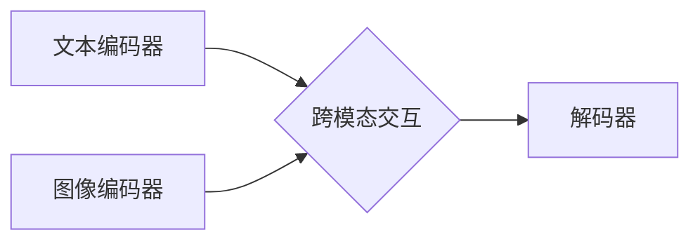

> 多模态学习，自然语言处理，计算机视觉，语音识别，多媒体融合，深度学习，Transformer，BERT，GPT，图像生成，文本摘要，机器翻译

## 1. 背景介绍

人工智能（AI）技术近年来取得了飞速发展，特别是深度学习的兴起，为多模态学习提供了强大的工具。多模态学习是指机器学习模型能够从多个模态数据（如文本、图像、音频、视频等）中学习，并进行跨模态理解和推理。

传统的人工智能系统通常只处理单一模态数据，例如文本或图像。然而，现实世界中信息往往是多模态的，例如一篇新闻文章包含文本和图像，一段视频包含音频、图像和文本等。单一模态的处理方式无法充分利用这些信息，导致理解和推理能力有限。

多模态学习能够克服这一局限性，通过融合不同模态数据，构建更完整、更准确的知识表示，从而提升机器学习模型的理解和推理能力。

## 2. 核心概念与联系

多模态学习的核心是将不同模态的数据融合起来，形成一个统一的表示空间。

**2.1 多模态数据融合**

多模态数据融合是指将来自不同模态的数据进行整合，形成一个综合的表示。常用的融合方法包括：

* **早期融合:** 将不同模态数据在特征提取阶段进行融合，例如将文本和图像的特征进行拼接。
* **晚期融合:** 将不同模态数据分别进行特征提取，然后在分类或预测阶段进行融合。
* **跨模态注意力机制:** 利用注意力机制学习不同模态数据之间的关系，并赋予不同模态数据不同的权重。

**2.2 多模态模型架构**

多模态模型通常由以下几个部分组成：

* **模态编码器:** 负责将不同模态数据编码成特征向量。
* **跨模态交互模块:** 负责学习不同模态数据之间的关系。
* **解码器:** 负责根据融合后的特征向量进行预测或分类。

**2.3 Mermaid 流程图**



## 3. 核心算法原理 & 具体操作步骤

### 3.1  算法原理概述

多模态学习算法的核心是学习不同模态数据之间的关系，并构建一个统一的表示空间。常用的算法包括：

* **多任务学习:** 将多个模态数据作为输入，训练一个共享的模型进行多任务学习。
* **对抗性训练:** 使用对抗性样本训练模型，提高模型的鲁棒性。
* **生成对抗网络 (GAN):** 使用生成器和判别器进行对抗训练，生成逼真的多模态数据。

### 3.2  算法步骤详解

以多任务学习为例，其具体操作步骤如下：

1. **数据预处理:** 将不同模态数据进行预处理，例如文本分词、图像裁剪等。
2. **特征提取:** 使用不同的编码器提取不同模态数据的特征向量。
3. **多任务损失函数:** 定义一个多任务损失函数，将不同模态任务的损失进行加权求和。
4. **模型训练:** 使用梯度下降算法训练模型，最小化多任务损失函数。
5. **模型评估:** 使用测试集评估模型的性能，例如准确率、召回率等。

### 3.3  算法优缺点

**优点:**

* 能够充分利用不同模态数据的互补性，提升模型的理解和推理能力。
* 可以应用于多种任务，例如图像字幕、文本摘要、机器翻译等。

**缺点:**

* 需要大量的多模态数据进行训练。
* 模型训练复杂度较高，需要强大的计算资源。

### 3.4  算法应用领域

多模态学习算法在以下领域有广泛的应用：

* **计算机视觉:** 图像字幕、目标检测、图像分类等。
* **自然语言处理:** 文本摘要、机器翻译、情感分析等。
* **语音识别:** 语音识别、语音合成等。
* **医疗保健:** 病理诊断、医学图像分析等。
* **教育:** 智能辅导、个性化学习等。

## 4. 数学模型和公式 & 详细讲解 & 举例说明

### 4.1  数学模型构建

多模态学习模型通常使用深度神经网络进行构建，例如 Transformer、BERT、GPT 等。这些模型能够学习不同模态数据之间的复杂关系。

**4.1.1 Transformer 模型**

Transformer 模型是一种基于注意力机制的深度神经网络，能够有效地处理序列数据，例如文本和音频。

**4.1.2 BERT 模型**

BERT 模型是一种基于 Transformer 的预训练语言模型，能够理解上下文信息，并用于各种自然语言处理任务。

**4.1.3 GPT 模型**

GPT 模型是一种基于 Transformer 的文本生成模型，能够生成流畅、连贯的文本。

### 4.2  公式推导过程

Transformer 模型的注意力机制公式如下：

$$
Attention(Q, K, V) = softmax(\frac{QK^T}{\sqrt{d_k}})V
$$

其中：

* $Q$：查询矩阵
* $K$：键矩阵
* $V$：值矩阵
* $d_k$：键向量的维度
* $softmax$：softmax 函数

### 4.3  案例分析与讲解

BERT 模型在文本分类任务上的应用案例：

BERT 模型可以将文本序列编码成一个固定长度的向量，然后将该向量输入到分类器中进行分类。例如，在情感分析任务中，BERT 模型可以将文本句子编码成一个向量，然后将该向量输入到一个二分类器中，判断该句子是正面的还是负面的。

## 5. 项目实践：代码实例和详细解释说明

### 5.1  开发环境搭建

* Python 3.7+
* TensorFlow 2.0+
* PyTorch 1.0+
* CUDA 10.0+

### 5.2  源代码详细实现

```python
# 导入必要的库
import tensorflow as tf

# 定义一个简单的多模态模型
class MultimodalModel(tf.keras.Model):
    def __init__(self, text_embedding_dim, image_embedding_dim, output_dim):
        super(MultimodalModel, self).__init__()
        self.text_encoder = tf.keras.layers.Embedding(input_dim=vocab_size, output_dim=text_embedding_dim)
        self.image_encoder = tf.keras.layers.Conv2D(filters=image_embedding_dim, kernel_size=3, activation='relu')
        self.fusion_layer = tf.keras.layers.Concatenate()
        self.output_layer = tf.keras.layers.Dense(units=output_dim, activation='softmax')

    def call(self, text, image):
        text_embedding = self.text_encoder(text)
        image_embedding = self.image_encoder(image)
        fused_embedding = self.fusion_layer([text_embedding, image_embedding])
        output = self.output_layer(fused_embedding)
        return output

# 实例化模型
model = MultimodalModel(text_embedding_dim=128, image_embedding_dim=64, output_dim=10)

# 编译模型
model.compile(optimizer='adam', loss='sparse_categorical_crossentropy', metrics=['accuracy'])

# 训练模型
model.fit(x_train, y_train, epochs=10)
```

### 5.3  代码解读与分析

* 代码首先定义了一个多模态模型类 `MultimodalModel`，该类包含文本编码器、图像编码器、融合层和输出层。
* 文本编码器使用 Embedding 层将文本序列编码成向量。
* 图像编码器使用 Conv2D 层提取图像特征。
* 融合层将文本和图像的特征向量进行拼接。
* 输出层使用 Dense 层进行分类。
* 代码然后实例化模型，并使用 Adam 优化器、交叉熵损失函数和准确率指标进行训练。

### 5.4  运行结果展示

训练完成后，可以使用测试集评估模型的性能。

## 6. 实际应用场景

### 6.1  图像字幕生成

多模态学习可以用于生成图像的字幕，例如将一张图片描述为“一只小狗在公园里玩耍”。

### 6.2  文本摘要

多模态学习可以用于生成文本的摘要，例如将一篇长篇文章总结为几句话。

### 6.3  机器翻译

多模态学习可以用于机器翻译，例如将英文文本翻译成中文。

### 6.4  未来应用展望

多模态学习在未来将有更广泛的应用，例如：

* **虚拟助手:** 能够理解语音、文本和图像输入，并提供更智能的交互体验。
* **自动驾驶:** 能够理解道路场景、交通规则和行人行为，提高自动驾驶的安全性和可靠性。
* **医疗诊断:** 能够辅助医生进行诊断，提高诊断的准确性和效率。

## 7. 工具和资源推荐

### 7.1  学习资源推荐

* **书籍:**
    * Deep Learning with Python
    * Hands-On Machine Learning with Scikit-Learn, Keras & TensorFlow
* **在线课程:**
    * Coursera: Deep Learning Specialization
    * Udacity: Deep Learning Nanodegree

### 7.2  开发工具推荐

* **TensorFlow:** 开源深度学习框架
* **PyTorch:** 开源深度学习框架
* **Keras:** 高级深度学习API

### 7.3  相关论文推荐

* Attention Is All You Need
* BERT: Pre-training of Deep Bidirectional Transformers for Language Understanding
* GPT-3: Language Models are Few-Shot Learners

## 8. 总结：未来发展趋势与挑战

### 8.1  研究成果总结

多模态学习取得了显著的进展，在多个领域取得了优异的性能。

### 8.2  未来发展趋势

* **更强大的模型:** 研究更强大的多模态模型，例如能够处理更多模态数据、更复杂的关系。
* **更有效的训练方法:** 研究更有效的训练方法，例如自监督学习、迁移学习。
* **更广泛的应用:** 将多模态学习应用到更多领域，例如医疗保健、教育、娱乐等。

### 8.3  面临的挑战

* **数据稀缺:** 多模态数据往往稀缺，难以收集和标注。
* **模态间关系复杂:** 不同模态数据之间的关系复杂，难以建模。
* **模型解释性差:** 多模态模型的解释性差，难以理解模型的决策过程。

### 8.4  研究展望

未来，多模态学习将继续是一个重要的研究方向，需要进一步探索更强大的模型、更有效的训练方法和更广泛的应用场景。


## 9. 附录：常见问题与解答

**Q1: 多模态学习和多任务学习有什么区别？**

**A1:** 多模态学习是指学习不同模态数据之间的关系，而多任务学习是指训练一个模型同时完成多个任务。

**Q2: 多模态学习有哪些应用场景？**

**A2:** 多模态学习的应用场景非常广泛，例如图像字幕生成、文本摘要、机器翻译、虚拟助手、自动驾驶等。

**Q3: 如何评估多模态学习模型的性能？**

**A3:** 多模态学习模型的性能评估方法取决于具体的应用场景，例如可以使用准确率、召回率、F1-score等指标。


作者：禅与计算机程序设计艺术 / Zen and the Art of Computer Programming 
<end_of_turn>