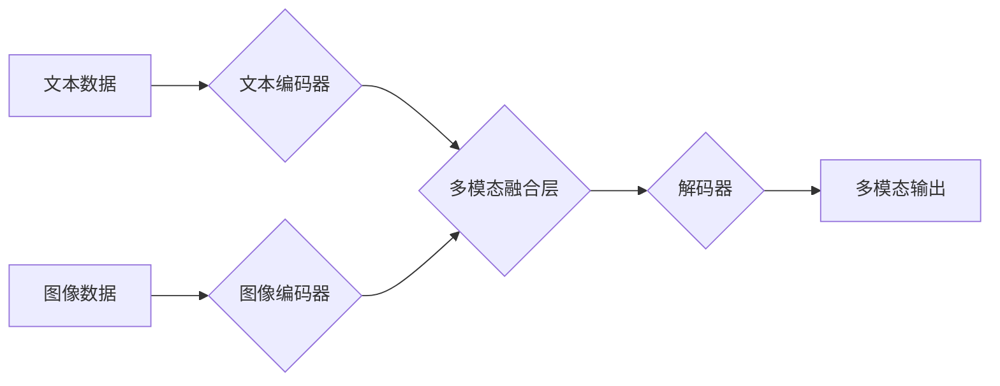

> 多模态大模型，ChatGPT，自然语言处理，计算机视觉，深度学习，Transformer，多任务学习

## 1. 背景介绍

近年来，人工智能（AI）技术取得了飞速发展，其中大模型在自然语言处理（NLP）、计算机视觉（CV）等领域展现出强大的能力。传统的单模态大模型主要专注于文本或图像等单一类型的数据，而多模态大模型则旨在融合多种模态信息，例如文本、图像、音频、视频等，以实现更全面、更智能的理解和生成。

ChatGPT作为一款基于Transformer架构的多模态大模型，由OpenAI开发，其强大的文本生成能力和广泛的应用场景，引发了全球科技界的广泛关注。本文将深入探讨多模态大模型的技术原理和实战应用，并以ChatGPT为例，分析其架构、训练方法和应用场景。

## 2. 核心概念与联系

多模态大模型的核心概念是融合不同模态数据，实现跨模态理解和生成。

**2.1 多模态数据**

指包含多种类型信息的集合，例如文本、图像、音频、视频等。

**2.2 多模态融合**

是指将不同模态数据进行有效整合，提取其潜在的关联性和语义信息。

**2.3 多模态学习**

是指利用多模态数据训练模型，使其能够理解和生成跨模态内容。

**2.4 Transformer架构**

是一种新型的神经网络架构，能够有效处理序列数据，并具有强大的表示能力。

**2.5 多任务学习**

是指训练模型同时完成多个任务，例如文本分类、图像识别、机器翻译等，以提高模型的泛化能力。

**2.6  Mermaid 流程图**



## 3. 核心算法原理 & 具体操作步骤

### 3.1  算法原理概述

多模态大模型的训练主要基于深度学习算法，其中Transformer架构是其核心组成部分。

Transformer模型通过自注意力机制（Self-Attention）和多头注意力机制（Multi-Head Attention）来捕捉序列数据中的长距离依赖关系，并通过编码器-解码器结构实现文本生成等任务。

在多模态大模型中，文本和图像等不同模态数据分别经过各自的编码器进行编码，然后将编码后的特征信息融合在一起，形成多模态特征表示。

解码器根据多模态特征信息生成最终的输出结果。

### 3.2  算法步骤详解

1. **数据预处理:** 将文本和图像等多模态数据进行预处理，例如文本分词、图像裁剪、数据增强等。

2. **模态编码:** 使用不同的编码器对文本和图像等数据进行编码，例如使用BERT模型对文本进行编码，使用ResNet模型对图像进行编码。

3. **多模态融合:** 将编码后的文本和图像特征信息进行融合，例如使用注意力机制对不同模态特征进行加权求和。

4. **解码:** 使用解码器根据融合后的多模态特征信息生成最终的输出结果，例如生成文本、图像或视频。

5. **模型训练:** 使用交叉熵损失函数对模型进行训练，优化模型参数，使其能够准确地生成多模态内容。

### 3.3  算法优缺点

**优点:**

* 能够融合多种模态信息，实现更全面、更智能的理解和生成。
* 具有强大的泛化能力，能够应用于多种任务场景。

**缺点:**

* 训练成本高，需要大量的计算资源和数据。
* 模型复杂度高，难以进行解释和调试。

### 3.4  算法应用领域

* **自然语言理解:** 文本摘要、问答系统、情感分析等。
* **计算机视觉:** 图像识别、目标检测、图像 Captioning 等。
* **多媒体内容生成:** 视频生成、图像编辑、文本到图像等。
* **人机交互:** 智能聊天机器人、虚拟助手等。

## 4. 数学模型和公式 & 详细讲解 & 举例说明

### 4.1  数学模型构建

多模态大模型的数学模型通常基于深度学习框架，例如TensorFlow或PyTorch。

模型结构通常包括编码器和解码器，编码器负责提取不同模态数据的特征信息，解码器负责根据特征信息生成最终的输出结果。

### 4.2  公式推导过程

Transformer模型的核心是自注意力机制，其计算公式如下：

$$
Attention(Q, K, V) = softmax(\frac{QK^T}{\sqrt{d_k}})V
$$

其中：

* $Q$：查询矩阵
* $K$：键矩阵
* $V$：值矩阵
* $d_k$：键向量的维度

### 4.3  案例分析与讲解

例如，在文本到图像生成任务中，文本编码器将文本序列编码为向量表示，图像编码器将图像编码为特征图，然后将文本向量和特征图进行融合，输入到解码器中，解码器根据融合后的信息生成图像。

## 5. 项目实践：代码实例和详细解释说明

### 5.1  开发环境搭建

使用Python语言和深度学习框架TensorFlow或PyTorch搭建开发环境。

### 5.2  源代码详细实现

```python
# 使用TensorFlow搭建多模态大模型
import tensorflow as tf

# 定义文本编码器模型
text_encoder = tf.keras.Sequential([
    tf.keras.layers.Embedding(vocab_size, embedding_dim),
    tf.keras.layers.LSTM(units),
])

# 定义图像编码器模型
image_encoder = tf.keras.Sequential([
    tf.keras.layers.Conv2D(filters, kernel_size),
    tf.keras.layers.MaxPooling2D(),
    tf.keras.layers.Flatten(),
])

# 定义多模态融合层
multimodal_fusion = tf.keras.layers.Concatenate()

# 定义解码器模型
decoder = tf.keras.Sequential([
    # ...
])

# 定义整个多模态大模型
model = tf.keras.Model(inputs=[text_input, image_input], outputs=decoder(multimodal_fusion([text_encoder(text_input), image_encoder(image_input)])))

# 训练模型
model.compile(optimizer='adam', loss='mse')
model.fit(x=[text_data, image_data], y=target_data, epochs=10)
```

### 5.3  代码解读与分析

代码示例展示了使用TensorFlow搭建多模态大模型的基本流程。

文本编码器和图像编码器分别负责提取文本和图像的特征信息，多模态融合层将特征信息进行融合，解码器根据融合后的信息生成最终的输出结果。

### 5.4  运行结果展示

训练完成后，可以将模型应用于实际场景，例如文本到图像生成、图像 Captioning 等任务，并展示模型的运行结果。

## 6. 实际应用场景

### 6.1  智能客服

多模态大模型可以理解用户文本和语音输入，并生成相应的文本或语音回复，实现智能客服系统。

### 6.2  教育辅助

多模态大模型可以辅助学生学习，例如提供个性化学习内容、解答学生疑问、进行互动练习等。

### 6.3  医疗诊断

多模态大模型可以辅助医生进行诊断，例如分析患者的医学影像、病历信息等，提供辅助诊断建议。

### 6.4  未来应用展望

多模态大模型在未来将有更广泛的应用场景，例如：

* **虚拟现实和增强现实:** 创建更沉浸式的虚拟体验。
* **自动驾驶:** 帮助车辆理解周围环境。
* **机器人交互:** 增强机器人与人类的交互能力。

## 7. 工具和资源推荐

### 7.1  学习资源推荐

* **书籍:**
    * 《深度学习》
    * 《自然语言处理》
    * 《计算机视觉》
* **在线课程:**
    * Coursera
    * edX
    * Udacity

### 7.2  开发工具推荐

* **深度学习框架:** TensorFlow, PyTorch
* **编程语言:** Python
* **数据处理工具:** Pandas, NumPy

### 7.3  相关论文推荐

* 《Attention Is All You Need》
* 《BERT: Pre-training of Deep Bidirectional Transformers for Language Understanding》
* 《DALL-E: Creating Images from Text》

## 8. 总结：未来发展趋势与挑战

### 8.1  研究成果总结

多模态大模型在自然语言处理、计算机视觉等领域取得了显著进展，展现出强大的应用潜力。

### 8.2  未来发展趋势

* **模型规模和能力提升:** 训练更大规模、更强大的多模态大模型。
* **跨模态理解和生成能力增强:** 提升模型跨模态理解和生成能力，实现更复杂的应用场景。
* **模型解释性和可解释性提升:** 研究模型的内部机制，提高模型的解释性和可解释性。

### 8.3  面临的挑战

* **数据获取和标注:** 多模态数据的获取和标注成本高。
* **模型训练和推理效率:** 训练和推理大型多模态模型需要大量的计算资源。
* **伦理和安全问题:** 多模态大模型可能存在伦理和安全问题，需要进行充分的评估和监管。

### 8.4  研究展望

未来，多模态大模型的研究将继续深入，探索更强大的模型架构、更有效的训练方法和更广泛的应用场景，为人工智能的未来发展做出更大的贡献。

## 9. 附录：常见问题与解答

**Q1: 多模态大模型与单模态大模型有什么区别？**

**A1:** 多模态大模型能够处理多种模态数据，例如文本、图像、音频等，而单模态大模型只能处理单一类型的数据。

**Q2: 多模态大模型的训练成本高吗？**

**A2:** 是的，训练大型多模态大模型需要大量的计算资源和数据，成本较高。

**Q3: 多模态大模型有哪些应用场景？**

**A3:** 多模态大模型的应用场景非常广泛，例如智能客服、教育辅助、医疗诊断、虚拟现实等。


作者：禅与计算机程序设计艺术 / Zen and the Art of Computer Programming 
<end_of_turn>