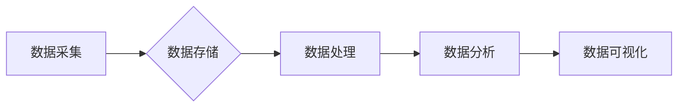

> 大数据处理框架，Hadoop，Spark，Flink，数据流处理，分布式计算，数据仓库，数据湖

## 1. 背景介绍

随着互联网和移动互联网的蓬勃发展，海量数据正在以指数级增长。如何高效地存储、处理和分析这些数据成为了当今社会面临的重大挑战。大数据处理框架应运而生，为我们提供了处理海量数据的有效解决方案。

大数据处理框架通常由多个组件组成，例如数据存储、数据处理引擎、数据分析工具等。这些组件协同工作，实现对大数据的采集、存储、处理、分析和可视化等功能。

## 2. 核心概念与联系

大数据处理框架的核心概念包括：

* **分布式存储**: 将数据分散存储在多个节点上，提高数据存储容量和容错能力。
* **分布式计算**: 将数据处理任务分解成多个子任务，并分别在不同的节点上执行，提高数据处理速度和效率。
* **数据流处理**: 实时处理不断涌入的数据流，及时获取数据洞察和做出决策。
* **数据仓库**: 将来自不同来源的数据整合到一个集中式存储系统中，用于数据分析和报表生成。
* **数据湖**: 将各种格式的数据存储在一个统一的存储系统中，方便数据探索和分析。

**核心架构流程图:**



## 3. 核心算法原理 & 具体操作步骤

### 3.1  算法原理概述

大数据处理框架中常用的算法包括：

* **MapReduce**: 分布式计算模型，将数据处理任务分解成 Map 和 Reduce 两步，并分别在不同的节点上执行。
* **Spark**: 基于内存的分布式计算框架，支持多种数据处理模式，例如批处理、流处理和机器学习。
* **Flink**: 专注于数据流处理的框架，支持实时数据处理和窗口操作。

### 3.2  算法步骤详解

**MapReduce 算法步骤:**

1. **数据分片**: 将数据划分为多个数据块，每个数据块分配到不同的节点上进行处理。
2. **Map 操作**: 对每个数据块进行 Map 操作，将数据转换为键值对。
3. **数据聚合**: 将所有节点上的键值对进行聚合，将相同键的值合并在一起。
4. **Reduce 操作**: 对聚合后的键值对进行 Reduce 操作，生成最终结果。

**Spark 算法步骤**:

1. **数据加载**: 将数据加载到 Spark 集群的内存中。
2. **数据转换**: 使用 Spark API 对数据进行转换操作，例如过滤、排序、聚合等。
3. **数据执行**: 将转换后的数据提交到 Spark 集群进行执行。
4. **结果输出**: 将执行结果输出到指定位置。

**Flink 算法步骤**:

1. **数据输入**: 将数据输入到 Flink 集群。
2. **数据处理**: 使用 Flink API 对数据进行处理操作，例如过滤、转换、窗口操作等。
3. **数据输出**: 将处理后的数据输出到指定位置。

### 3.3  算法优缺点

**MapReduce**:

* **优点**: 简单易用，易于扩展，适合处理海量数据。
* **缺点**: 性能相对较低，不适合实时数据处理。

**Spark**:

* **优点**: 性能高，支持多种数据处理模式，易于扩展。
* **缺点**: 需要较高的硬件资源要求。

**Flink**:

* **优点**: 专注于数据流处理，支持实时数据处理和窗口操作。
* **缺点**: 对于批处理任务的性能相对较低。

### 3.4  算法应用领域

* **电商**: 商品推荐、用户画像、订单分析等。
* **金融**: 风险控制、欺诈检测、投资分析等。
* **医疗**: 疾病诊断、药物研发、患者管理等。
* **社交媒体**: 内容推荐、用户行为分析、舆情监测等。

## 4. 数学模型和公式 & 详细讲解 & 举例说明

### 4.1  数学模型构建

大数据处理框架中的算法通常基于一些数学模型，例如：

* **线性回归**: 用于预测连续变量的值。
* **逻辑回归**: 用于预测分类变量的值。
* **支持向量机**: 用于分类和回归问题。

### 4.2  公式推导过程

例如，线性回归模型的公式如下：

$$
y = \beta_0 + \beta_1 x_1 + \beta_2 x_2 + ... + \beta_n x_n + \epsilon
$$

其中：

* $y$ 是预测变量。
* $x_1, x_2, ..., x_n$ 是自变量。
* $\beta_0, \beta_1, ..., \beta_n$ 是模型参数。
* $\epsilon$ 是误差项。

### 4.3  案例分析与讲解

例如，我们可以使用线性回归模型预测房价。假设我们有以下数据：

| 房屋面积 (平方米) | 房价 (万元) |
|---|---|
| 60 | 100 |
| 80 | 150 |
| 100 | 200 |
| 120 | 250 |

我们可以使用线性回归模型拟合这些数据，得到以下模型：

$$
y = 50 + 1.5x
$$

其中：

* $y$ 是房价。
* $x$ 是房屋面积。

我们可以使用这个模型预测其他房屋的价格。例如，如果一个房屋面积为 90 平方米，那么它的预测价格为：

$$
y = 50 + 1.5 * 90 = 185
$$

## 5. 项目实践：代码实例和详细解释说明

### 5.1  开发环境搭建

* **Hadoop**: 下载并安装 Hadoop 软件包。
* **Spark**: 下载并安装 Spark 软件包。
* **Flink**: 下载并安装 Flink 软件包。
* **IDE**: 选择一个适合的 IDE，例如 Eclipse 或 IntelliJ IDEA。

### 5.2  源代码详细实现

以下是一个使用 Spark 计算平均值的代码示例：

```python
from pyspark.sql import SparkSession

# 创建 SparkSession
spark = SparkSession.builder.appName("AverageCalculation").getOrCreate()

# 读取数据
data = spark.read.text("data.txt")

# 计算平均值
average = data.agg({"value": "avg"}).collect()[0][0]

# 打印结果
print("平均值:", average)

# 关闭 SparkSession
spark.stop()
```

### 5.3  代码解读与分析

* **创建 SparkSession**: 创建一个 SparkSession 对象，用于连接到 Spark 集群。
* **读取数据**: 使用 `read.text()` 方法读取数据文件。
* **计算平均值**: 使用 `agg()` 方法计算平均值，并使用 `collect()` 方法获取结果。
* **打印结果**: 打印计算出的平均值。
* **关闭 SparkSession**: 关闭 SparkSession 对象。

### 5.4  运行结果展示

运行上述代码后，将输出计算出的平均值。

## 6. 实际应用场景

### 6.1  电商领域

* **商品推荐**: 使用 Spark 或 Flink 处理用户行为数据，推荐个性化商品。
* **用户画像**: 使用机器学习算法分析用户数据，构建用户画像。
* **订单分析**: 使用 MapReduce 处理订单数据，分析销售趋势和客户行为。

### 6.2  金融领域

* **风险控制**: 使用机器学习算法识别欺诈交易和风险行为。
* **投资分析**: 使用 Spark 或 Flink 处理市场数据，进行投资分析和预测。
* **客户关系管理**: 使用 Hadoop 处理客户数据，进行客户关系管理和营销分析。

### 6.3  医疗领域

* **疾病诊断**: 使用机器学习算法分析患者数据，辅助医生诊断疾病。
* **药物研发**: 使用 Spark 或 Flink 处理生物数据，加速药物研发。
* **患者管理**: 使用 Hadoop 处理患者数据，进行患者管理和健康监测。

### 6.4  未来应用展望

随着大数据技术的不断发展，大数据处理框架将在更多领域得到应用，例如：

* **智能制造**: 使用大数据处理生产数据，实现智能制造。
* **智慧城市**: 使用大数据处理城市数据，建设智慧城市。
* **自动驾驶**: 使用大数据处理车辆数据，实现自动驾驶。

## 7. 工具和资源推荐

### 7.1  学习资源推荐

* **Hadoop 官方文档**: https://hadoop.apache.org/docs/
* **Spark 官方文档**: https://spark.apache.org/docs/
* **Flink 官方文档**: https://flink.apache.org/docs/
* **大数据技术博客**: https://www.cnblogs.com/category/bigdata/

### 7.2  开发工具推荐

* **Eclipse**: https://www.eclipse.org/
* **IntelliJ IDEA**: https://www.jetbrains.com/idea/
* **Hadoop 集群**: https://hadoop.apache.org/docs/current/hadoop-project-dist/hadoop-common/DeploymentGuide.html

### 7.3  相关论文推荐

* **MapReduce**: Dean, J., & Ghemawat, S. (2004). MapReduce: Simplified data processing on large clusters. Communications of the ACM, 51(1), 107-113.
* **Spark**: Zaharia, M., et al. (2010). Resilient distributed datasets: A fault-tolerant abstraction for in-memory cluster computing. In Proceedings of the 2nd USENIX conference on Cloud computing (pp. 10-10).
* **Flink**:  

## 8. 总结：未来发展趋势与挑战

### 8.1  研究成果总结

大数据处理框架的发展取得了显著成果，为海量数据处理提供了高效的解决方案。

### 8.2  未来发展趋势

* **更强大的计算能力**: 随着硬件技术的进步，大数据处理框架将拥有更强大的计算能力，能够处理更大的数据规模。
* **更智能的数据分析**: 大数据处理框架将更加智能化，能够自动识别数据模式和趋势，提供更深入的数据洞察。
* **更易于使用的开发工具**: 大数据处理框架的开发工具将更加易于使用，降低开发门槛，促进大数据应用的普及。

### 8.3  面临的挑战

* **数据安全**: 大数据处理框架需要解决数据安全问题，确保数据的隐私和安全。
* **数据质量**: 大数据处理框架需要保证数据的质量，避免数据错误和偏差。
* **人才短缺**: 大数据处理领域人才短缺，需要加强人才培养和引进。

### 8.4  研究展望

未来，大数据处理框架的研究将更加注重以下方面：

* **异构数据处理**: 处理不同类型和格式的数据。
* **实时数据处理**: 处理实时数据流，实现实时数据分析。
* **边缘计算**: 将数据处理能力扩展到边缘设备，实现更低延迟的数据处理。

## 9. 附录：常见问题与解答

### 9.1  常见问题

* **什么是大数据？**
* **大数据处理框架有哪些？**
* **如何选择合适的 Hadoop 集群？**
* **如何使用 Spark 进行数据分析？**
* **如何解决大数据处理中的数据安全问题？**

### 9.2  解答

* **什么是大数据？** 大数据是指规模庞大、结构复杂、速度快、多样化的数据。
* **大数据处理框架有哪些？** Hadoop、Spark、Flink 等。
* **如何选择合适的 Hadoop 集群？** 需要根据实际需求选择合适的硬件配置、软件版本和部署模式。
* **如何使用 Spark 进行数据分析？** 使用 Spark API 对数据进行转换、聚合和分析。
* **如何解决大数据处理中的数据安全问题？** 使用加密、访问控制和审计等技术保障数据安全。