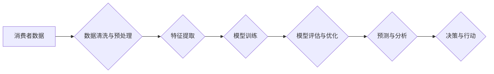

> 大数据、消费者数据、数据分析、机器学习、个性化推荐、隐私保护

## 1. 背景介绍

随着互联网和移动互联网的快速发展，消费者数据以指数级增长，蕴藏着巨大的商业价值。大数据环境下，对消费者数据的分析和应用已成为企业获取竞争优势、提升用户体验的关键。本文将深入探讨大数据环境下消费者数据应用分析与研究的现状、趋势和挑战，并提出一些可行的解决方案。

### 1.1 消费者数据的重要性

消费者数据是指与消费者行为、偏好、需求等相关的信息，包括但不限于：

* **人口信息:** 年龄、性别、职业、收入等
* **行为数据:** 购物记录、浏览历史、搜索关键词等
* **社交数据:** 朋友关系、兴趣爱好、社交媒体活动等
* **传感器数据:** 位置信息、设备使用情况等

消费者数据可以帮助企业：

* **了解消费者需求:** 通过分析消费者数据，企业可以洞察消费者需求，开发更符合市场需求的产品和服务。
* **个性化营销:** 根据消费者的兴趣和偏好，企业可以进行精准营销，提高营销效果。
* **提升用户体验:** 通过分析用户行为，企业可以优化产品和服务，提升用户体验。
* **降低运营成本:** 通过数据分析，企业可以优化运营流程，降低运营成本。

### 1.2 大数据环境下的挑战

大数据环境下，消费者数据分析也面临着一些挑战：

* **数据规模庞大:** 消费者数据量巨大，传统的分析方法难以处理。
* **数据质量参差不齐:** 消费者数据来源多样，质量参差不齐，需要进行清洗和处理。
* **数据安全和隐私保护:** 消费者数据涉及个人隐私，需要采取措施保障数据安全和隐私。
* **算法模型的复杂性:** 消费者数据分析需要使用复杂的算法模型，需要专业的技术人员进行开发和维护。

## 2. 核心概念与联系

### 2.1 消费者数据分析

消费者数据分析是指利用数据挖掘、机器学习等技术，从消费者数据中提取有价值的信息，以帮助企业了解消费者行为、需求和偏好，从而做出更明智的决策。

### 2.2 大数据平台

大数据平台是指用于存储、处理和分析海量数据的软件系统，通常由以下几个组件组成：

* **数据存储:** Hadoop、HBase等分布式存储系统
* **数据处理:** Spark、Flink等分布式计算框架
* **数据分析:** Hive、Pig等数据分析工具
* **数据可视化:** Tableau、Power BI等数据可视化工具

### 2.3 机器学习

机器学习是人工智能的一种，它通过算法学习数据中的模式，从而能够自动完成预测、分类、聚类等任务。在消费者数据分析中，机器学习可以用于：

* **个性化推荐:** 根据用户的历史行为和偏好，推荐相关的商品或服务。
* **客户画像:** 根据用户的行为数据，构建用户的画像，了解用户的兴趣和需求。
* **欺诈检测:** 通过分析用户的行为数据，识别潜在的欺诈行为。

**Mermaid 流程图**



## 3. 核心算法原理 & 具体操作步骤

### 3.1 算法原理概述

消费者数据分析常用的算法包括：

* **聚类算法:** 将消费者数据按照相似性进行分组，例如K-Means聚类算法。
* **分类算法:** 根据已知标签的数据，预测新数据的类别，例如逻辑回归算法、决策树算法。
* **回归算法:** 预测连续数值型变量，例如线性回归算法、支持向量机算法。
* **推荐算法:** 根据用户的历史行为和偏好，推荐相关的商品或服务，例如协同过滤算法、内容过滤算法。

### 3.2 算法步骤详解

以K-Means聚类算法为例，其步骤如下：

1. **初始化:** 随机选择K个数据点作为聚类中心。
2. **分配:** 将每个数据点分配到距离其最近的聚类中心所属的类别。
3. **更新:** 计算每个聚类中心的新的位置，即所有属于该聚类中心的点的平均值。
4. **重复:** 重复步骤2和步骤3，直到聚类中心不再移动或达到最大迭代次数。

### 3.3 算法优缺点

**K-Means聚类算法的优点:**

* 算法简单易懂，易于实现。
* 运行速度快，适合处理大规模数据。

**K-Means聚类算法的缺点:**

* 需要事先指定聚类数K，选择合适的K值比较困难。
* 对数据分布敏感，如果数据分布不均匀，聚类效果可能不理想。

### 3.4 算法应用领域

消费者数据分析算法广泛应用于以下领域：

* **个性化推荐:** 推荐商品、服务、内容等。
* **客户画像:** 构建用户的画像，了解用户的兴趣和需求。
* **市场营销:** 进行精准营销，提高营销效果。
* **风险控制:** 识别潜在的欺诈行为。

## 4. 数学模型和公式 & 详细讲解 & 举例说明

### 4.1 数学模型构建

在消费者数据分析中，常用的数学模型包括：

* **线性回归模型:** 用于预测连续数值型变量，例如用户购买金额。
* **逻辑回归模型:** 用于预测分类变量，例如用户是否会购买商品。
* **协同过滤模型:** 用于推荐商品或服务，例如基于用户的协同过滤和基于物品的协同过滤。

### 4.2 公式推导过程

以线性回归模型为例，其目标是找到一条直线，使得这条直线与数据点之间的距离最小。

**线性回归模型的公式:**

$$y = \beta_0 + \beta_1x + \epsilon$$

其中：

* $y$ 是预测值
* $x$ 是输入特征
* $\beta_0$ 是截距
* $\beta_1$ 是斜率
* $\epsilon$ 是误差项

**最小二乘法:**

最小二乘法是一种常用的优化方法，其目标是找到使得误差平方和最小的参数值。

$$SSE = \sum_{i=1}^{n}(y_i - \hat{y}_i)^2$$

其中：

* $SSE$ 是误差平方和
* $y_i$ 是实际值
* $\hat{y}_i$ 是预测值

**参数估计:**

通过求解最小二乘法的偏导数，可以得到参数 $\beta_0$ 和 $\beta_1$ 的估计值。

### 4.3 案例分析与讲解

假设我们想要预测用户的购买金额，根据用户的年龄和收入数据，我们可以建立一个线性回归模型。

**数据:**

| 用户ID | 年龄 | 收入 | 购买金额 |
|---|---|---|---|
| 1 | 25 | 50000 | 1000 |
| 2 | 30 | 60000 | 1500 |
| 3 | 35 | 70000 | 2000 |
| 4 | 40 | 80000 | 2500 |

**模型训练:**

我们可以使用线性回归模型训练，并得到以下参数值：

* $\beta_0 = 500$
* $\beta_1 = 20$

**预测:**

假设有一个用户，年龄为32岁，收入为65000元，我们可以使用模型预测其购买金额：

$$y = 500 + 20 * 65000 = 130500$$

## 5. 项目实践：代码实例和详细解释说明

### 5.1 开发环境搭建

* 操作系统: Ubuntu 20.04
* Python 版本: 3.8
* 必要的库: pandas, numpy, scikit-learn

### 5.2 源代码详细实现

```python
import pandas as pd
from sklearn.model_selection import train_test_split
from sklearn.linear_model import LinearRegression
from sklearn.metrics import mean_squared_error

# 加载数据
data = pd.read_csv('consumer_data.csv')

# 选择特征和目标变量
X = data[['age', 'income']]
y = data['purchase_amount']

# 将数据划分为训练集和测试集
X_train, X_test, y_train, y_test = train_test_split(X, y, test_size=0.2, random_state=42)

# 创建线性回归模型
model = LinearRegression()

# 训练模型
model.fit(X_train, y_train)

# 预测测试集数据
y_pred = model.predict(X_test)

# 计算模型性能
mse = mean_squared_error(y_test, y_pred)
print(f'Mean Squared Error: {mse}')

# 打印模型参数
print(f'Intercept: {model.intercept_}')
print(f'Coefficients: {model.coef_}')
```

### 5.3 代码解读与分析

* 首先，我们加载数据，选择特征和目标变量。
* 然后，我们将数据划分为训练集和测试集，用于训练和评估模型。
* 接下来，我们创建线性回归模型，并使用训练集数据训练模型。
* 训练完成后，我们使用测试集数据预测目标变量的值，并计算模型性能。
* 最后，我们打印模型参数，例如截距和系数。

### 5.4 运行结果展示

运行代码后，会输出模型的性能指标，例如均方误差，以及模型的参数值。

## 6. 实际应用场景

### 6.1 个性化推荐

电商平台可以利用消费者数据分析，推荐个性化的商品或服务。例如，根据用户的浏览历史和购买记录，推荐用户可能感兴趣的商品。

### 6.2 客户画像

金融机构可以利用消费者数据分析，构建用户的画像，了解用户的风险偏好、投资习惯等信息，从而提供更精准的金融服务。

### 6.3 市场营销

广告平台可以利用消费者数据分析，精准投放广告，提高广告效果。例如，根据用户的兴趣爱好和行为数据，投放相关的广告。

### 6.4 未来应用展望

随着大数据技术的不断发展，消费者数据分析将在更多领域得到应用，例如：

* **医疗保健:** 利用消费者健康数据，预测疾病风险，提供个性化的医疗服务。
* **教育:** 利用消费者学习数据，个性化推荐学习资源，提高学习效率。
* **智能家居:** 利用消费者行为数据，智能化控制家居环境，提升生活品质。

## 7. 工具和资源推荐

### 7.1 学习资源推荐

* **书籍:**
    * 《数据挖掘：概念与技术》
    * 《机器学习》
* **在线课程:**
    * Coursera: 数据科学
    * edX: 机器学习
* **博客:**
    * KDnuggets
    * Towards Data Science

### 7.2 开发工具推荐

* **数据处理:**
    * Apache Spark
    * Apache Hadoop
* **数据分析:**
    * Apache Hive
    * Apache Pig
* **机器学习:**
    * scikit-learn
    * TensorFlow
    * PyTorch

### 7.3 相关论文推荐

* **K-Means聚类算法:**
    * MacQueen, J. (1967). Some methods for classification and analysis of multivariate observations.
* **线性回归模型:**
    * Ordinary Least Squares (OLS) Regression

## 8. 总结：未来发展趋势与挑战

### 8.1 研究成果总结

消费者数据分析已取得了显著成果，在个性化推荐、客户画像、市场营销等领域发挥着重要作用。

### 8.2 未来发展趋势

* **数据量和数据类型增加:** 未来，消费者数据量将继续增长，数据类型也将更加丰富，例如传感器数据、社交媒体数据等。
* **