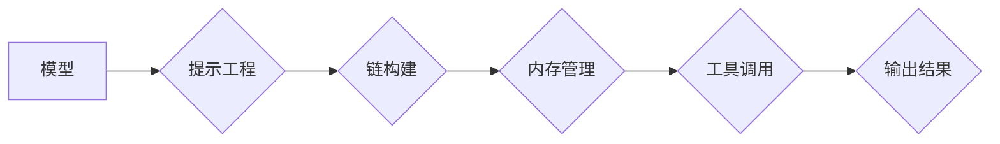

> 大模型、LangChain、应用开发框架、LLM、Prompt Engineering、Chain

## 1. 背景介绍

近年来，大语言模型（LLM）的快速发展，如GPT-3、LaMDA、BERT等，为人工智能领域带来了革命性的变革。这些模型展现出强大的文本生成、理解、翻译等能力，为各种应用场景提供了无限可能。然而，直接调用LLM模型往往需要复杂的代码编写和参数调整，难以满足实际应用的便捷性和灵活性需求。

为了解决这一问题，LangChain 应运而生。LangChain 是一款开源的应用开发框架，旨在简化大模型应用开发流程，帮助开发者更轻松地构建基于大模型的应用程序。它提供了一套丰富的工具和组件，涵盖了从提示工程到模型链构建等各个环节，使得开发者能够快速搭建、部署和迭代大模型应用。

## 2. 核心概念与联系

LangChain 的核心概念包括：

* **模型（Model）：** 各种大语言模型，如GPT-3、BLOOM等。
* **提示（Prompt）：** 用于引导模型生成特定输出的文本指令。
* **链（Chain）：** 将多个模型和工具串联起来，实现更复杂的任务。
* **内存（Memory）：** 用于存储和管理对话历史，使模型能够理解上下文。
* **工具（Tool）：** 用于扩展模型功能的外部工具，如搜索引擎、数据库等。

LangChain 将这些概念有机地结合在一起，构建了一个灵活、可扩展的应用开发框架。

**LangChain 架构流程图:**



## 3. 核心算法原理 & 具体操作步骤

### 3.1  算法原理概述

LangChain 的核心算法原理基于**提示工程**和**链式调用**。

* **提示工程:** 通过精心设计和优化提示文本，引导模型生成更准确、更有针对性的输出。
* **链式调用:** 将多个模型和工具串联起来，实现更复杂的任务，例如：

    * **问答系统:** 使用一个模型进行文本理解，另一个模型进行答案生成。
    * **对话机器人:** 使用内存管理组件存储对话历史，使模型能够理解上下文。
    * **文本摘要:** 使用多个模型进行文本分段、关键词提取和文本压缩。

### 3.2  算法步骤详解

1. **定义任务:** 明确需要实现的功能，例如问答、文本生成、对话等。
2. **选择模型:** 根据任务需求选择合适的LLM模型。
3. **设计提示:** 根据任务需求设计合适的提示文本，引导模型生成期望的输出。
4. **构建链:** 将模型、提示、工具等组件串联起来，构建完成任务的链式调用流程。
5. **测试和迭代:** 测试链的性能，根据测试结果进行调整和优化。

### 3.3  算法优缺点

**优点:**

* **简化开发流程:** 提供了丰富的工具和组件，简化了大模型应用开发流程。
* **提高开发效率:** 减少了代码编写和参数调整的工作量，提高了开发效率。
* **增强应用灵活性:** 支持多种模型和工具的组合，增强了应用的灵活性。

**缺点:**

* **依赖模型性能:** 应用性能最终取决于所选模型的性能。
* **提示工程难度:** 设计有效的提示文本仍然是一个挑战。
* **链式调用复杂度:** 构建复杂的链式调用流程可能需要较高的技术水平。

### 3.4  算法应用领域

LangChain 的应用领域非常广泛，包括：

* **聊天机器人:** 开发更智能、更自然的对话机器人。
* **问答系统:** 建立更精准、更全面的问答系统。
* **文本生成:** 自动生成各种类型的文本，例如文章、故事、代码等。
* **数据分析:** 利用大模型对文本数据进行分析和挖掘。
* **教育培训:** 开发个性化学习和辅导系统。

## 4. 数学模型和公式 & 详细讲解 & 举例说明

### 4.1  数学模型构建

LangChain 的核心算法基于概率模型，例如Transformer模型。这些模型使用神经网络结构，学习文本数据的概率分布。

**Transformer模型的数学基础:**

* **注意力机制:** 用于捕捉文本中不同词之间的关系，赋予重要词更大的权重。
* **多头注意力:** 使用多个注意力机制，从不同的角度捕捉文本信息。
* **前馈神经网络:** 用于对每个词的嵌入向量进行非线性变换。

### 4.2  公式推导过程

Transformer模型的训练过程基于最大似然估计，目标是最大化模型生成目标文本的概率。

**最大似然估计公式:**

$$
P(y|x) = \prod_{i=1}^{n} P(y_i|x_1, x_2, ..., x_{i-1})
$$

其中：

* $y$ 是目标文本序列。
* $x$ 是输入文本序列。
* $P(y_i|x_1, x_2, ..., x_{i-1})$ 是给定输入序列的前 $i-1$ 个词，预测第 $i$ 个词的概率。

### 4.3  案例分析与讲解

例如，在文本生成任务中，模型需要根据输入文本序列生成下一个词。

**输入文本序列:**

"The cat sat on the"

**模型预测下一个词:**

"mat"

模型通过注意力机制和前馈神经网络，学习了输入文本序列中 "cat" 和 "sat" 之间的语义关系，并根据这些关系预测下一个词为 "mat"。

## 5. 项目实践：代码实例和详细解释说明

### 5.1  开发环境搭建

* Python 3.7+
* pip 安装 LangChain 和所需依赖库

```bash
pip install langchain
```

### 5.2  源代码详细实现

```python
from langchain.llms import OpenAI
from langchain.prompts import PromptTemplate
from langchain.chains import ConversationChain

# 初始化 OpenAI 模型
llm = OpenAI(temperature=0.7)

# 定义提示模板
template = """
你是一个非常友好的聊天机器人。
用户: {user_input}
机器人: """

# 创建提示对象
prompt = PromptTemplate(template=template, input_variables=["user_input"])

# 创建对话链
conversation = ConversationChain(llm=llm, prompt=prompt)

# 与机器人对话
while True:
    user_input = input("你: ")
    if user_input.lower() == "exit":
        break
    response = conversation.run(user_input)
    print("机器人:", response)
```

### 5.3  代码解读与分析

* **初始化模型:** 使用 `OpenAI` 类初始化 OpenAI 的语言模型。
* **定义提示模板:** 使用 `PromptTemplate` 类定义提示模板，其中包含了机器人角色和用户输入变量。
* **创建提示对象:** 使用 `PromptTemplate` 对象创建提示对象，用于生成最终的提示文本。
* **创建对话链:** 使用 `ConversationChain` 类创建对话链，将模型和提示对象组合在一起。
* **与机器人对话:** 使用 `conversation.run()` 方法运行对话链，并根据用户输入生成机器人回复。

### 5.4  运行结果展示

```
你: 你好
机器人: 你好！很高兴认识你。
你: 你叫什么名字？
机器人: 我是一个开源的聊天机器人。
你: 你能写诗吗？
机器人: 当然可以！你想写什么样的诗？
你: 写一首关于春天的诗
机器人: 春风拂面暖洋洋，
花儿盛开香满园。
小鸟歌唱枝头俏，
万物复苏生机盎。
你: 谢谢
机器人: 不客气！
你: exit
```

## 6. 实际应用场景

### 6.1  聊天机器人

LangChain 可以用于构建更智能、更自然的聊天机器人，例如客服机器人、陪伴机器人等。

### 6.2  问答系统

LangChain 可以用于构建更精准、更全面的问答系统，例如知识问答系统、搜索引擎等。

### 6.3  文本生成

LangChain 可以用于自动生成各种类型的文本，例如文章、故事、代码等。

### 6.4  未来应用展望

LangChain 的应用场景还在不断扩展，未来可能会应用于更多领域，例如：

* **教育培训:** 开发个性化学习和辅导系统。
* **医疗保健:** 辅助医生诊断疾病、提供医疗建议。
* **法律服务:** 帮助律师进行法律研究、撰写法律文件。

## 7. 工具和资源推荐

### 7.1  学习资源推荐

* **LangChain 官方文档:** https://python.langchain.com/en/latest/
* **LangChain GitHub 仓库:** https://github.com/langchain-org/langchain

### 7.2  开发工具推荐

* **Python:** https://www.python.org/
* **Jupyter Notebook:** https://jupyter.org/

### 7.3  相关论文推荐

* **Attention Is All You Need:** https://arxiv.org/abs/1706.03762

## 8. 总结：未来发展趋势与挑战

### 8.1  研究成果总结

LangChain 作为一款开源的应用开发框架，为大模型应用开发提供了便捷、灵活的工具和组件。它简化了开发流程，提高了开发效率，并为开发者提供了丰富的应用场景。

### 8.2  未来发展趋势

未来，LangChain 将继续朝着以下方向发展：

* **更强大的模型支持:** 支持更多类型的LLM模型，例如多模态模型。
* **更丰富的工具库:** 提供更多类型的工具，例如数据库连接、图像处理等。
* **更易于使用的界面:** 提供更直观、更易于使用的界面，降低开发门槛。

### 8.3  面临的挑战

LangChain 仍然面临一些挑战，例如：

* **提示工程的复杂性:** 设计有效的提示文本仍然是一个挑战。
* **模型性能的限制:** 应用性能最终取决于所选模型的性能。
* **伦理和安全问题:** 大模型应用可能带来伦理和安全问题，需要谨慎对待。

### 8.4  研究展望

未来，LangChain 将继续推动大模型应用的发展，并与其他人工智能技术相结合，构建更智能、更强大的应用系统。

## 9. 附录：常见问题与解答

**Q1: 如何选择合适的LLM模型？**

**A1:** 选择合适的LLM模型取决于具体的应用场景和需求。例如，对于文本生成任务，可以选择GPT-3等文本生成能力强的模型；对于问答任务，可以选择BERT等理解能力强的模型。

**Q2: 如何设计有效的提示文本？**

**A2:** 设计有效的提示文本需要考虑以下因素：

* **明确任务:** 提示文本应该明确地说明任务目标。
* **提供上下文:** 如果任务需要理解上下文，提示文本应该提供足够的上下文信息。
* **使用关键词:** 使用相关的关键词可以帮助模型更好地理解任务。
* **进行测试和迭代:** 设计提示文本是一个迭代的过程，需要不断测试和优化。

**Q3: LangChain 是否支持多语言？**

**A3:** LangChain 支持多种语言，具体取决于所选模型的语言支持能力。

**Q4: 如何部署 LangChain 应用？**

**A4:** LangChain 应用可以部署到云平台、本地服务器或其他环境中。具体部署方式取决于应用的规模和需求。


作者：禅与计算机程序设计艺术 / Zen and the Art of Computer Programming 
<end_of_turn>