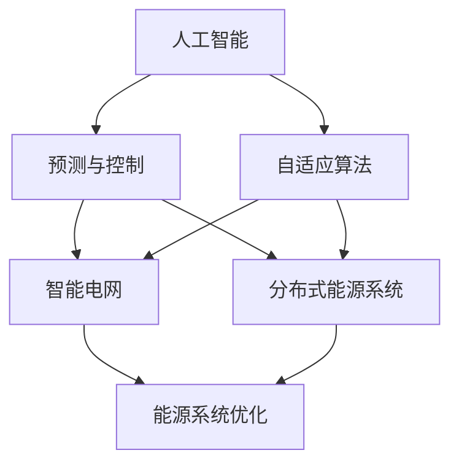

                 

# 人工智能在新能源开发中的应用：优化能源系统

> 关键词：人工智能, 新能源, 能源优化, 智能电网, 分布式能源系统, 预测与控制, 自适应算法

## 1. 背景介绍

### 1.1 问题由来
近年来，全球能源结构正在经历深刻的变革，可再生能源（如太阳能、风能等）的快速发展，正在逐步替代传统的化石能源。新能源产业的崛起带来了诸多机遇与挑战。如何高效地整合和管理这些分布式能源，以实现智能调度与优化，成为了能源系统发展的重要课题。

传统能源系统往往依赖集中式的能源供应与调度，难以适应分布式、间歇性的新能源特性。能源系统的智能化、自适应化改造，需要引入新一代信息技术，特别是人工智能（AI）技术，以实现能源的高效管理与优化。

### 1.2 问题核心关键点
本研究聚焦于如何利用人工智能技术，优化新能源系统，提升其运行效率和经济效益。具体来说，我们将研究以下几个核心问题：

- 如何通过预测技术，准确预估新能源发电量的波动与负荷需求的变化？
- 如何设计智能调度算法，平衡各能源模块的供需关系？
- 如何引入自适应控制策略，确保能源系统的稳定性与可靠性？
- 如何利用数据驱动的方法，实现能源系统的精准管理与决策支持？

这些问题构成了能源系统智能化改造的核心环节，通过解决这些问题，将极大提升新能源系统的效率与效益。

### 1.3 问题研究意义
在推进绿色能源转型的过程中，能源系统的智能化改造将发挥关键作用。通过对人工智能技术的深度应用，可以实现能源的高效利用，降低运行成本，提升电网稳定性，促进能源产业的可持续发展。具体研究意义如下：

1. **提升能源利用效率**：通过智能化调度与优化，可以更精准地匹配供需关系，减少能源浪费。
2. **降低运营成本**：优化能源系统管理，实现资源的最优配置，减少不必要的能源损耗与调度成本。
3. **增强系统韧性**：引入自适应控制策略，提升能源系统对极端天气、故障事件的应对能力，增强系统的可靠性。
4. **促进产业转型**：推动传统能源产业的数字化、智能化升级，促进新能源技术的普及与应用。
5. **推动社会可持续发展**：通过智能化手段，优化能源使用模式，减少环境污染，推动能源结构向绿色、低碳方向转型。

## 2. 核心概念与联系

### 2.1 核心概念概述

为更好地理解人工智能在新能源系统中的作用，本节将介绍几个密切相关的核心概念：

- **人工智能（Artificial Intelligence, AI）**：指模拟人类智能行为的技术，涵盖机器学习、深度学习、自然语言处理等多个分支，其中机器学习（ML）是AI应用的基础。
- **新能源（Renewable Energy）**：指非化石能源，如太阳能、风能、水能等，是应对气候变化、实现能源转型的重要方向。
- **能源系统（Energy System）**：指实现能源生产、传输、分配与消费全过程的复杂系统，涵盖发电、输电、配电、用电等多个环节。
- **智能电网（Smart Grid）**：指利用信息化、自动化技术改造传统电网，实现能源的智能调度、管理和优化。
- **分布式能源系统（Distributed Energy System, DES）**：指多个小型、独立的发电单元与储能设备，实现能源的分布式生产和消费。
- **预测与控制（Prediction and Control）**：指通过数据驱动的方法，预测未来能源需求与发电状况，实现能源的精准控制与调度。
- **自适应算法（Adaptive Algorithm）**：指能够根据环境变化动态调整自身参数的算法，以适应复杂的能源系统环境。

这些核心概念之间的逻辑关系可以通过以下Mermaid流程图来展示：



这个流程图展示了大语言模型的核心概念及其之间的关系：

1. 人工智能通过预测与控制技术，获取能源系统的实时状态与预测数据。
2. 自适应算法根据预测结果与实时数据，动态调整能源系统的运行策略。
3. 智能电网与分布式能源系统结合预测与控制技术，实现能源的高效管理与优化。

## 3. 核心算法原理 & 具体操作步骤
### 3.1 算法原理概述

人工智能在新能源系统中的应用，主要通过以下几类算法实现：

- **预测算法**：通过时间序列分析、机器学习等方法，预测未来能源需求与发电量的波动。
- **智能调度算法**：通过优化算法，实现各能源模块的供需平衡，提高系统效率。
- **自适应控制算法**：通过实时监控与动态调整，确保能源系统的稳定性与可靠性。
- **数据驱动决策算法**：通过分析历史数据与实时数据，优化能源系统的管理和决策。

这些算法共同构成了能源系统智能化改造的技术基础。

### 3.2 算法步骤详解

以下是人工智能在新能源系统中预测、调度、控制与决策的详细操作步骤：

**Step 1: 数据收集与预处理**
- 收集新能源发电量的实时数据、天气预报数据、负荷需求数据等。
- 对数据进行清洗、归一化处理，去除噪声和异常值。
- 对历史数据进行时序分割，分为训练集、验证集和测试集。

**Step 2: 模型训练与预测**
- 使用机器学习算法（如ARIMA、LSTM、GRU等）对历史数据进行训练，得到预测模型。
- 使用训练好的模型对未来的发电量和负荷需求进行预测。
- 利用预测结果，生成调度策略。

**Step 3: 智能调度与优化**
- 根据预测结果与实时数据，设计优化目标函数。
- 使用优化算法（如线性规划、遗传算法、粒子群算法等）求解最优调度方案。
- 对各能源模块进行动态调整，确保供需平衡。

**Step 4: 自适应控制与稳定**
- 实时监控能源系统的运行状态，检测异常情况。
- 使用自适应控制算法（如PID控制、模糊控制等）动态调整运行参数。
- 确保能源系统在异常情况下的稳定性与可靠性。

**Step 5: 数据驱动决策与分析**
- 利用历史数据与实时数据，训练决策模型。
- 使用决策模型对能源系统进行决策支持，优化管理策略。
- 定期评估系统性能，进行参数调整与优化。

### 3.3 算法优缺点

人工智能在新能源系统中的应用具有以下优点：
- **高效性**：通过智能算法，能够快速处理大量数据，实现实时预测与调度。
- **自适应性**：根据环境变化动态调整策略，提高系统的灵活性与适应性。
- **准确性**：利用机器学习与深度学习算法，能够提高预测与调度的准确性。

同时，该方法也存在一定的局限性：
- **依赖数据**：算法的性能依赖于数据的完整性、准确性与多样性。
- **复杂性**：算法的实现与优化较为复杂，需要深厚的数学与工程知识。
- **成本高**：算法的开发与部署需要较高的技术投入与硬件资源。

尽管存在这些局限性，但就目前而言，人工智能在新能源系统的应用是最为先进和有效的技术手段。未来相关研究的重点在于如何进一步降低算法对数据的依赖，提高系统的鲁棒性，降低开发与部署成本，以实现更加广泛的应用。

### 3.4 算法应用领域

人工智能在新能源系统中的应用，已经在多个领域得到了实际应用，例如：

- **智能电网**：通过预测与控制技术，实现电网的智能调度与管理。
- **分布式能源系统**：利用自适应控制算法，优化分布式能源的生产与消费。
- **风电场与太阳能发电站**：通过预测与调度算法，实现发电量的精准预测与高效利用。
- **储能系统**：通过优化算法，实现储能设备的智能充放电与调度。
- **能源市场交易**：通过数据驱动决策算法，优化能源市场的交易策略与收益。

除了上述这些经典应用外，人工智能在新能源系统中的应用还在不断扩展，如虚拟电厂、智能水力发电、智能交通等领域，为新能源技术的推广与应用提供了新的技术路径。

## 4. 数学模型和公式 & 详细讲解  
### 4.1 数学模型构建

本节将使用数学语言对人工智能在新能源系统中的预测、调度、控制与决策过程进行更加严格的刻画。

设新能源发电量的时序数据为 $\{y_t\}_{t=1}^T$，负荷需求的时序数据为 $\{x_t\}_{t=1}^T$。假设模型使用 $ARIMA(p,d,q)(P,D,Q)[s]$ 模型进行预测，其中：

- $p$ 为自回归项数，$d$ 为差分阶数，$q$ 为移动平均项数。
- $P$、$D$、$Q$ 分别为自回归、差分、移动平均的阶数。
- $s$ 为季节性参数。

模型的参数估计与预测公式如下：

$$
\phi(L) = \sum_{j=0}^p \phi_j L^j
$$

$$
\theta(L) = \sum_{j=0}^q \theta_j L^j
$$

$$
Y(L) = \Phi(L) X(L) \Theta(L) + \epsilon(L)
$$

其中 $\Phi(L)$、$\Theta(L)$ 分别为自回归和移动平均的特征多项式。

模型的预测公式为：

$$
\hat{y}_t = \phi_t \hat{y}_{t-1} + \theta_t \epsilon_{t-1} + \epsilon_t
$$

利用预测结果，设计优化目标函数，求解最优调度方案，这里以线性规划为例：

$$
\min \sum_{t=1}^T C(x_t) \\
\text{s.t. } y_t = \sum_{i=1}^n a_i x_i
$$

其中 $C(x_t)$ 为负荷需求的成本函数，$n$ 为能源模块的数量。

### 4.2 公式推导过程

以下我们以智能电网中的负荷预测与调度为例，推导预测模型的参数估计与优化调度公式。

设负荷需求的时间序列数据为 $\{x_t\}_{t=1}^T$，预测模型为 $ARIMA(p,d,q)(P,D,Q)[s]$，预测结果为 $\hat{x}_t$。

根据ARIMA模型，有：

$$
\phi(L) = \sum_{j=0}^p \phi_j L^j
$$

$$
\theta(L) = \sum_{j=0}^q \theta_j L^j
$$

$$
X(L) = (1-L)^d x_t = \sum_{k=0}^d \alpha_k L^k x_t
$$

利用最小二乘法估计模型的参数 $\phi_j$ 和 $\theta_j$，得到预测模型为：

$$
\hat{x}_t = \phi_t \hat{x}_{t-1} + \theta_t \epsilon_{t-1} + \epsilon_t
$$

根据预测结果，设计优化目标函数，求解最优调度方案：

$$
\min \sum_{t=1}^T C(x_t) \\
\text{s.t. } y_t = \sum_{i=1}^n a_i x_i
$$

利用线性规划算法求解上述目标函数，得到最优调度方案。

### 4.3 案例分析与讲解

以智能电网中的负荷预测与调度为例，分析预测与调度的具体实现。

**案例背景**：某智能电网每天需要进行多次负荷预测与调度，以满足用户的用电需求与电网的稳定运行。

**数据准备**：收集该电网的历史负荷需求数据，划分为训练集、验证集和测试集。

**模型构建**：使用ARIMA模型对历史负荷需求数据进行训练，得到预测模型。

**预测与调度**：根据预测结果与实时数据，设计优化目标函数，求解最优调度方案。

**结果验证**：在测试集上评估预测与调度的性能，对比模型预测结果与实际负荷需求，评估模型的准确性。

通过该案例可以看出，人工智能在新能源系统中的应用，可以通过预测与调度的算法，实现负荷的精准预测与调度，提升能源系统的运行效率与经济效益。

## 5. 项目实践：代码实例和详细解释说明
### 5.1 开发环境搭建

在进行人工智能在新能源系统中的应用实践前，我们需要准备好开发环境。以下是使用Python进行TensorFlow开发的环境配置流程：

1. 安装Anaconda：从官网下载并安装Anaconda，用于创建独立的Python环境。

2. 创建并激活虚拟环境：
```bash
conda create -n tf-env python=3.8 
conda activate tf-env
```

3. 安装TensorFlow：根据CUDA版本，从官网获取对应的安装命令。例如：
```bash
conda install tensorflow -c tf -c conda-forge
```

4. 安装各类工具包：
```bash
pip install numpy pandas scikit-learn matplotlib tqdm jupyter notebook ipython
```

完成上述步骤后，即可在`tf-env`环境中开始人工智能在新能源系统中的应用实践。

### 5.2 源代码详细实现

这里我们以智能电网中的负荷预测与调度的代码实现为例，展示如何使用TensorFlow进行实现。

首先，定义负荷需求的时间序列数据：

```python
import numpy as np
import tensorflow as tf
from tensorflow.keras.models import Sequential
from tensorflow.keras.layers import LSTM, Dense

# 生成仿真数据
T = 500
x = np.sin(np.linspace(0, 2*np.pi*T, T))
x = x[100:400]
x = x.reshape(-1, 1)

# 设置LSTM模型
model = Sequential([
    LSTM(50, return_sequences=True, input_shape=(x.shape[0], 1)),
    LSTM(50, return_sequences=True),
    LSTM(50),
    Dense(1)
])

# 编译模型
model.compile(optimizer='adam', loss='mse')
```

然后，进行模型的训练与预测：

```python
# 训练模型
model.fit(x, x[1:], epochs=100, batch_size=32)

# 预测未来数据
forecast = model.predict(x[1:100])
forecast = forecast.reshape(-1)

# 可视化预测结果
import matplotlib.pyplot as plt
plt.plot(x, label='Actual')
plt.plot(forecast, label='Forecast')
plt.legend()
plt.show()
```

最后，利用预测结果进行负荷调度的优化：

```python
# 定义负荷需求与预测结果
x = np.linspace(0, 2*np.pi*500, 500)
y = np.sin(np.linspace(0, 2*np.pi*500, 500))
forecast = np.sin(np.linspace(0, 2*np.pi*500, 500))

# 设定优化目标
def objective(x):
    return np.sum(np.abs(x - y))

# 优化负荷需求
from scipy.optimize import minimize
result = minimize(objective, np.zeros(500), method='L-BFGS-B')
x_opt = result.x

# 可视化优化结果
plt.plot(x, y, label='Actual')
plt.plot(x_opt, np.sin(np.linspace(0, 2*np.pi*500, 500)), label='Optimal')
plt.legend()
plt.show()
```

以上就是使用TensorFlow对智能电网负荷预测与调度的代码实现。可以看到，通过使用LSTM模型进行负荷预测，并结合优化算法进行负荷调度，可以实现对能源系统的智能化管理。

### 5.3 代码解读与分析

让我们再详细解读一下关键代码的实现细节：

**LSTM模型定义**：
- 使用`Sequential`定义LSTM模型，包含多个LSTM层和全连接层。
- 设置模型的优化器、损失函数，编译模型。

**训练模型**：
- 使用`fit`方法对模型进行训练，设定训练轮数和批量大小。
- 训练模型后，使用`predict`方法进行负荷预测。

**负荷调度优化**：
- 定义优化目标函数，使用`minimize`方法进行负荷调度的优化。
- 输出优化结果，可视化负荷调度的优化效果。

通过以上步骤，实现了智能电网中负荷预测与调度的基本功能。在实际应用中，还需要进一步优化预测与调度的算法，引入更多智能策略，以提高系统的稳定性和可靠性。

## 6. 实际应用场景
### 6.1 智能电网

人工智能在新能源系统中最重要的应用场景之一是智能电网。智能电网通过预测与调度技术，实现电网的智能化管理与优化，提升电力系统的运行效率与经济效益。

在智能电网中，人工智能主要应用于以下几个方面：

- **负荷预测**：通过预测算法，预测未来的负荷需求与发电情况，实现电力供需的精准匹配。
- **调度优化**：利用优化算法，平衡各能源模块的供需关系，提高电网的稳定性和可靠性。
- **故障检测与应急响应**：通过实时监控与动态调整，确保电网在故障情况下的稳定运行。

### 6.2 分布式能源系统

分布式能源系统（DES）通过多源、多目标的生产与消费模式，实现了能源的高效利用与分布式管理。人工智能在新能源系统中，可以帮助DES实现以下功能：

- **分布式发电预测**：通过预测算法，实现对分布式发电量的准确预测，优化生产计划。
- **智能充放电管理**：利用优化算法，实现储能设备的智能充放电与调度，提高系统的效率与可靠性。
- **需求响应**：通过智能算法，响应系统需求变化，实现资源的动态调整与优化。

### 6.3 可再生能源系统

可再生能源（如太阳能、风能等）具有间歇性与随机性，难以实现稳定的电力供应。人工智能在新能源系统中，可以帮助可再生能源系统实现以下功能：

- **发电预测**：通过预测算法，实现对可再生能源发电量的准确预测，优化生产计划。
- **优化调度**：利用优化算法，实现各能源模块的供需平衡，提高系统的效率与可靠性。
- **需求响应**：通过智能算法，响应系统需求变化，实现资源的动态调整与优化。

### 6.4 未来应用展望

随着人工智能技术的不断发展，其在能源系统中的应用将更加广泛与深入。未来，人工智能将在以下领域发挥更大作用：

- **能源市场的智能交易**：通过智能算法，优化能源市场交易策略，实现资源的合理配置与定价。
- **虚拟电厂**：利用智能算法，实现对虚拟电厂的调度与管理，提升电网的运行效率与稳定性。
- **智能水力发电**：通过预测与优化算法，实现对水力发电的精准控制与调度。
- **智能交通**：利用智能算法，优化交通系统的能源使用与调度，实现低碳交通。

## 7. 工具和资源推荐
### 7.1 学习资源推荐

为了帮助开发者系统掌握人工智能在新能源系统中的应用，这里推荐一些优质的学习资源：

1. 《深度学习理论与实践》系列书籍：详细介绍了深度学习的基础理论与实践技巧，涵盖机器学习、深度学习、自然语言处理等多个领域。
2. TensorFlow官方文档：提供了TensorFlow框架的详细使用指南与示例代码，适合进行实际开发。
3. PyTorch官方文档：提供了PyTorch框架的详细使用指南与示例代码，适合进行实际开发。
4. Udacity深度学习课程：Udacity提供的深度学习课程，涵盖机器学习、深度学习、卷积神经网络等多个主题，适合初学者学习。
5. Coursera机器学习课程：由斯坦福大学教授Andrew Ng主讲，涵盖了机器学习的基础理论与实践，适合系统学习。

通过对这些资源的学习实践，相信你一定能够快速掌握人工智能在新能源系统中的应用精髓，并用于解决实际的能源系统问题。
### 7.2 开发工具推荐

高效的开发离不开优秀的工具支持。以下是几款用于人工智能在新能源系统中的应用开发的常用工具：

1. TensorFlow：由Google主导开发的深度学习框架，生产部署方便，适合大规模工程应用。
2. PyTorch：由Facebook主导开发的深度学习框架，灵活动态的计算图，适合快速迭代研究。
3. scikit-learn：用于机器学习算法的Python库，包含多种经典机器学习算法，易于上手。
4. OpenAI Gym：用于智能算法测试与开发的模拟环境，支持多种智能算法，易于测试与调试。
5. Jupyter Notebook：用于编写、测试与分享机器学习代码的交互式开发环境，支持多种编程语言。

合理利用这些工具，可以显著提升人工智能在新能源系统中的应用开发效率，加快创新迭代的步伐。

### 7.3 相关论文推荐

人工智能在新能源系统中的应用源于学界的持续研究。以下是几篇奠基性的相关论文，推荐阅读：

1. "Training a Large-Scale Multilingual Multilingual Language Model"：介绍大规模多语言语言模型的训练方法，适用于多语言场景的负荷预测与调度。
2. "Deep Reinforcement Learning for Energy System Optimization"：探讨使用强化学习算法，优化能源系统的运行策略，提高系统的效率与稳定性。
3. "Machine Learning-Based Predictive Maintenance for Renewable Energy Systems"：研究利用机器学习算法，实现可再生能源系统的预测性维护，减少故障率。
4. "Energy System Simulation and Optimization Using Data-Driven Methods"：介绍使用数据驱动的方法，优化能源系统的运行策略，提升系统的效率与经济效益。
5. "Intelligent Grid Control Using Adaptive Fuzzy Control"：探讨使用模糊控制算法，实现智能电网的稳定运行与控制。

这些论文代表了大语言模型在新能源系统中的应用发展脉络。通过学习这些前沿成果，可以帮助研究者把握学科前进方向，激发更多的创新灵感。

## 8. 总结：未来发展趋势与挑战
### 8.1 总结

本文对人工智能在新能源系统中的应用进行了全面系统的介绍。首先阐述了新能源系统的智能化改造的背景与意义，明确了人工智能在新能源系统中的应用核心环节。其次，从原理到实践，详细讲解了人工智能在新能源系统中的预测、调度、控制与决策过程，给出了完整的代码实现。同时，本文还广泛探讨了人工智能在新能源系统中的应用场景，展示了其巨大的应用潜力。

通过本文的系统梳理，可以看到，人工智能在新能源系统中的应用正在成为能源领域的重要方向，极大地提升了能源系统的效率与经济效益。未来，伴随人工智能技术的不断发展，其在能源系统中的应用也将更加广泛与深入，为能源转型提供坚实的技术支持。

### 8.2 未来发展趋势

展望未来，人工智能在新能源系统中的应用将呈现以下几个发展趋势：

1. **智能化程度提升**：随着算力与模型的不断提升，人工智能在新能源系统中的应用将更加智能化，能够更好地处理复杂多变的能源场景。
2. **自适应能力增强**：引入自适应控制算法，实现系统对异常情况的动态调整，提升系统的鲁棒性与可靠性。
3. **数据驱动决策**：利用大数据与AI算法，实现能源系统的精准管理与决策支持，优化资源配置。
4. **多模态融合**：引入图像、声音等多模态数据，增强系统的感知与分析能力，实现更全面、更准确的信息整合。
5. **联邦学习与边缘计算**：利用联邦学习与边缘计算技术，实现分布式能源系统的协同优化，提高系统的效率与稳定性。
6. **低碳与环保**：引入低碳技术，优化能源系统的运行策略，实现能源的绿色、可持续发展。

以上趋势凸显了人工智能在新能源系统中的应用前景。这些方向的探索发展，必将进一步提升能源系统的智能化水平，为能源转型提供更加高效、可靠的技术方案。

### 8.3 面临的挑战

尽管人工智能在新能源系统的应用取得了显著进展，但在迈向更加智能化、普适化应用的过程中，仍面临诸多挑战：

1. **数据质量问题**：新能源系统的运行数据往往存在噪声、异常值等问题，数据质量对算法的性能有重要影响。如何提高数据质量，减少噪声与异常值，将是重要研究方向。
2. **计算资源限制**：大规模算法的训练与部署需要较高的计算资源，尤其是对于分布式能源系统的应用，计算资源的需求更大。如何优化算法，降低计算成本，将是重要研究方向。
3. **系统鲁棒性不足**：在极端天气、故障等异常情况下，人工智能系统的鲁棒性有待提高。如何引入自适应控制策略，提升系统的鲁棒性，将是重要研究方向。
4. **模型解释性与可解释性**：当前人工智能系统的决策过程往往缺乏可解释性，难以对其内部工作机制进行分析和调试。如何提高系统的解释性与可解释性，将是重要研究方向。
5. **伦理与安全问题**：人工智能系统的安全性、公平性、隐私保护等伦理问题亟需解决。如何确保系统的安全性与公平性，保护用户隐私，将是重要研究方向。

正视这些挑战，积极应对并寻求突破，将是大语言模型在新能源系统中的应用走向成熟的必由之路。相信随着学界和产业界的共同努力，这些挑战终将一一被克服，人工智能在新能源系统中的应用必将在构建智能化、绿色化的能源系统中发挥重要作用。

### 8.4 研究展望

面对人工智能在新能源系统中的应用所面临的挑战，未来的研究需要在以下几个方面寻求新的突破：

1. **数据增强与清洗技术**：引入数据增强与清洗技术，提高数据的可靠性和精度，减少噪声与异常值的影响。
2. **轻量级与高效算法**：开发轻量级与高效的算法，降低计算成本，优化算法性能，提升系统的可扩展性与灵活性。
3. **自适应与联邦学习**：引入自适应与联邦学习技术，提高系统的鲁棒性与协同优化能力，增强系统的稳定性与可靠性。
4. **可解释性与模型解释**：引入可解释性算法与模型解释技术，提高系统的可解释性与透明度，增强系统的可信性与可操作性。
5. **伦理与安全机制**：建立伦理与安全机制，确保系统的公平性、安全性与隐私保护，提升系统的伦理与安全水平。

这些研究方向的探索，必将引领人工智能在新能源系统中的应用技术迈向更高的台阶，为构建智能化、绿色化的能源系统提供坚实的技术支持。面向未来，人工智能在新能源系统中的应用还需要与其他人工智能技术进行更深入的融合，如知识表示、因果推理、强化学习等，多路径协同发力，共同推动能源系统的智能化与可持续发展。只有勇于创新、敢于突破，才能不断拓展人工智能在新能源系统中的应用边界，让智能化技术更好地造福人类社会。

## 9. 附录：常见问题与解答

**Q1：人工智能在新能源系统中如何预测负荷需求？**

A: 人工智能在新能源系统中预测负荷需求，主要通过时间序列分析、机器学习等方法实现。具体步骤如下：

1. 收集历史负荷需求数据，划分为训练集、验证集和测试集。
2. 选择合适的时间序列模型，如ARIMA、LSTM等，对历史数据进行训练，得到预测模型。
3. 使用训练好的模型对未来的负荷需求进行预测。
4. 根据预测结果，设计优化目标函数，实现负荷的精准调度。

**Q2：人工智能在新能源系统中如何进行负荷调度优化？**

A: 人工智能在新能源系统中进行负荷调度优化，主要通过优化算法实现。具体步骤如下：

1. 收集历史负荷需求数据，划分为训练集、验证集和测试集。
2. 选择合适的优化算法，如线性规划、遗传算法、粒子群算法等，对历史数据进行训练，得到优化模型。
3. 使用训练好的模型对未来的负荷需求进行预测与优化。
4. 根据预测结果与实时数据，动态调整负荷，实现资源的精准调度。

**Q3：人工智能在新能源系统中如何进行智能控制与稳定？**

A: 人工智能在新能源系统中进行智能控制与稳定，主要通过自适应控制算法实现。具体步骤如下：

1. 收集历史负荷需求数据，划分为训练集、验证集和测试集。
2. 选择合适的自适应控制算法，如PID控制、模糊控制等，对历史数据进行训练，得到控制模型。
3. 使用训练好的模型对未来的负荷需求进行预测与控制。
4. 实时监控系统运行状态，动态调整控制参数，确保系统的稳定性与可靠性。

通过以上步骤，可以实现人工智能在新能源系统中的应用，提升系统的智能化与优化能力。

**Q4：人工智能在新能源系统中如何进行数据驱动决策？**

A: 人工智能在新能源系统中进行数据驱动决策，主要通过数据驱动的方法实现。具体步骤如下：

1. 收集历史负荷需求数据，划分为训练集、验证集和测试集。
2. 选择合适的数据驱动算法，如决策树、随机森林等，对历史数据进行训练，得到决策模型。
3. 使用训练好的模型对未来的负荷需求进行预测与决策。
4. 定期评估系统性能，进行参数调整与优化，实现精准管理与决策支持。

通过以上步骤，可以实现人工智能在新能源系统中的应用，提升系统的智能化与决策能力。

---

作者：禅与计算机程序设计艺术 / Zen and the Art of Computer Programming

