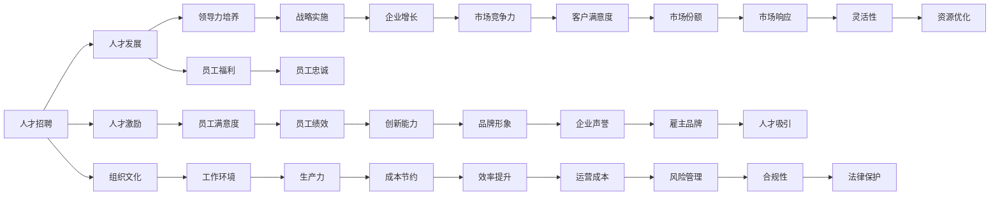

                 

# 人才管理：吸引和留住顶尖人才的策略

> 关键词：人才管理, 人才招聘, 人才发展, 人才激励, 组织文化, 领导力培养, 员工福利

## 1. 背景介绍

在科技迅猛发展的今天，人才已经成为企业竞争力的关键因素。如何吸引、培养、激励和留住顶尖人才，已成为各个行业公司领导层所面临的重要挑战。本文将系统介绍如何构建一套完整的人才管理策略，助力企业在人才竞争中占据优势。

## 2. 核心概念与联系

### 2.1 核心概念概述

人才管理(Talent Management) 是指通过一系列系统化、科学化的活动，吸引、招聘、培训、激励和留住企业所需的优秀人才，提升组织的人力资本价值，推动企业战略目标的实现。其中包含的关键概念有：

- **人才招聘 (Recruitment)**：通过吸引、筛选和录用合适的人才，满足组织在各个岗位上的需求。
- **人才发展 (Talent Development)**：通过培训和职业发展机会，使员工能够不断提升个人能力和专业技能。
- **人才激励 (Talent Motivation)**：通过奖励机制和企业文化，激发员工的工作动力和创新精神。
- **组织文化 (Organizational Culture)**：构建富有吸引力和包容性的工作环境，吸引和留住优秀人才。
- **领导力培养 (Leadership Development)**：培养企业高层领导和管理团队，引领企业的战略实施和发展。
- **员工福利 (Employee Welfare)**：提供全面的福利和支持，包括健康保险、退休金计划、弹性工作等，提升员工满意度和忠诚度。

### 2.2 核心概念原理和架构的 Mermaid 流程图



## 3. 核心算法原理 & 具体操作步骤

### 3.1 算法原理概述

人才管理策略的核心是通过一系列科学方法和先进技术，吸引、发展、激励和留住顶尖人才。其基本原理和具体操作步骤如下：

1. **人才吸引 (Talent Attraction)**：通过分析市场趋势、竞争情况、岗位需求和人才特点，制定吸引顶尖人才的策略。
2. **人才发展 (Talent Development)**：设计科学的人才发展路径，提供系统的培训和职业发展规划，支持员工成长。
3. **人才激励 (Talent Motivation)**：建立公平合理的薪酬福利体系和绩效考核机制，激发员工的积极性和创新能力。
4. **组织文化 (Organizational Culture)**：营造积极向上、包容多元的组织氛围，形成强大的企业文化吸引力。
5. **领导力培养 (Leadership Development)**：选拔和培养企业高层领导，提升管理团队的执行力。
6. **员工福利 (Employee Welfare)**：提供全面的福利计划，提升员工满意度和忠诚度。

### 3.2 算法步骤详解

#### 3.2.1 人才吸引 (Talent Attraction)

1. **市场调研 (Market Research)**：分析市场供需、竞争对手和人才流动趋势，制定吸引策略。
2. **品牌建设 (Brand Building)**：打造强大的雇主品牌，提升企业在人才市场的吸引力。
3. **渠道扩展 (Channel Expansion)**：多元化招聘渠道，包括社交媒体、校园招聘、猎头等。

#### 3.2.2 人才发展 (Talent Development)

1. **职业规划 (Career Planning)**：为员工提供清晰的职业发展路径，包括岗位晋升、跨部门轮岗等。
2. **技能培训 (Skill Training)**：提供定制化的培训项目，提升员工的专业技能和知识水平。
3. **绩效反馈 (Performance Feedback)**：定期对员工进行绩效评估，提供建设性反馈。

#### 3.2.3 人才激励 (Talent Motivation)

1. **薪酬体系 (Compensation System)**：设计公平合理的薪酬结构，包括基本工资、绩效奖金、股票期权等。
2. **绩效考核 (Performance Evaluation)**：建立科学的量化考核机制，激发员工的工作动力。
3. **奖励机制 (Reward Mechanisms)**：设立多种奖励项目，如年终奖金、特殊贡献奖等。

#### 3.2.4 组织文化 (Organizational Culture)

1. **文化塑造 (Culture Shaping)**：通过企业文化建设，营造积极向上、开放包容的工作环境。
2. **员工参与 (Employee Engagement)**：鼓励员工参与决策，提升其归属感和责任感。
3. **文化传播 (Cultural Transmission)**：通过企业活动、社交媒体等渠道，传播企业文化理念。

#### 3.2.5 领导力培养 (Leadership Development)

1. **选拔机制 (Selection Mechanisms)**：建立科学的领导力选拔标准，通过测试、面试等环节选拔高层领导。
2. **培训计划 (Training Programs)**：设计有针对性的培训课程，提升管理团队的领导能力。
3. **绩效评估 (Performance Assessment)**：定期对领导层进行绩效评估，跟踪其执行力和管理效果。

#### 3.2.6 员工福利 (Employee Welfare)

1. **健康保障 (Health Protection)**：提供全面的健康保障计划，如医疗保险、体检等。
2. **退休计划 (Retirement Plans)**：设立完善的退休金计划，保障员工退休生活。
3. **灵活工作 (Flexible Work)**：提供弹性工作安排，如远程办公、弹性工作时间等。

### 3.3 算法优缺点

#### 3.3.1 优点

1. **提升组织竞争力**：通过吸引和留住顶尖人才，提升企业的人力资本价值和市场竞争力。
2. **优化人才结构**：通过系统的人才发展机制，优化企业人才结构，提高团队协作效率。
3. **增强员工忠诚度**：通过公平的激励和良好的福利体系，增强员工的满意度和忠诚度。
4. **激发创新能力**：通过科学的激励机制和领导力培养，激发员工的创新精神和创造力。

#### 3.3.2 缺点

1. **成本投入高**：吸引、培养和激励顶尖人才需要大量的资金和时间投入。
2. **管理复杂性高**：需要建立完善的人才管理体系，涉及多个部门和流程。
3. **实施难度大**：不同企业的文化和需求差异较大，实施人才管理策略的难度较大。

### 3.4 算法应用领域

人才管理策略不仅适用于高科技公司，还广泛应用在各个行业领域，例如：

1. **互联网企业**：如Google、Facebook等，通过吸引全球顶尖人才，保持技术创新和市场竞争力。
2. **金融行业**：如JP Morgan、Goldman Sachs等，通过培养领导力和专业人才，提升企业金融服务能力。
3. **医疗行业**：如Mayo Clinic、Massachusetts General Hospital等，通过吸引高素质医疗人才，提供优质的医疗服务。
4. **制造业**：如Toyota、BMW等，通过技能培训和管理创新，提升生产效率和产品质量。
5. **教育行业**：如Harvard、MIT等，通过人才吸引和培养，提升学术研究和教学水平。

## 4. 数学模型和公式 & 详细讲解 & 举例说明

### 4.1 数学模型构建

假设企业的人才吸引力为 $A$，人才发展能力为 $D$，人才激励力度为 $M$，组织文化价值为 $C$，领导力强度为 $L$，员工福利水平为 $W$。则综合人才管理指数 $TMI$ 可以表示为：

$$ TMI = \alpha A + \beta D + \gamma M + \delta C + \epsilon L + \zeta W $$

其中，$\alpha, \beta, \gamma, \delta, \epsilon, \zeta$ 为各因素的权重系数，根据企业实际情况进行调整。

### 4.2 公式推导过程

1. **人才吸引 (A)**：
   $$ A = f(TM, PD, M, C) $$
   其中 $TM$ 为市场规模，$PD$ 为岗位需求，$M$ 为激励机制，$C$ 为组织文化。

2. **人才发展 (D)**：
   $$ D = g(DS, T, E) $$
   其中 $DS$ 为发展项目数量，$T$ 为培训时间，$E$ 为经验分享。

3. **人才激励 (M)**：
   $$ M = h(S, PE, F) $$
   其中 $S$ 为薪酬结构，$PE$ 为绩效评估，$F$ 为奖励计划。

4. **组织文化 (C)**：
   $$ C = i(CA, CE, ME) $$
   其中 $CA$ 为文化活动，$CE$ 为员工参与，$ME$ 为媒体传播。

5. **领导力培养 (L)**：
   $$ L = j(LS, T, P) $$
   其中 $LS$ 为领导选拔标准，$T$ 为培训计划，$P$ 为绩效评估。

6. **员工福利 (W)**：
   $$ W = k(HP, RP, FL) $$
   其中 $HP$ 为健康保障，$RP$ 为退休计划，$FL$ 为灵活工作。

### 4.3 案例分析与讲解

某大型互联网公司采取以下策略提升人才管理水平：

1. **市场调研**：通过调研市场需求和竞争对手，制定了吸引顶尖人才的策略。
2. **品牌建设**：在社交媒体上积极宣传公司文化，提升品牌影响力。
3. **渠道扩展**：利用校园招聘、猎头平台、社交网络等多元化渠道吸引人才。
4. **职业规划**：为员工提供清晰的职业发展路径，包括内部轮岗、跨部门项目等。
5. **技能培训**：提供丰富的技能培训课程，如编程、产品设计、项目管理等。
6. **绩效反馈**：定期进行绩效评估，提供有建设性的反馈和奖励。
7. **薪酬体系**：设计公平合理的薪酬结构，包括基本工资、绩效奖金、股票期权等。
8. **绩效考核**：建立科学的量化考核机制，激发员工的工作动力。
9. **奖励机制**：设立多种奖励项目，如年终奖金、特殊贡献奖等。
10. **文化塑造**：通过企业文化建设，营造积极向上、开放包容的工作环境。
11. **员工参与**：鼓励员工参与决策，提升其归属感和责任感。
12. **文化传播**：通过企业活动、社交媒体等渠道，传播企业文化理念。
13. **领导选拔**：建立科学的领导力选拔标准，通过测试、面试等环节选拔高层领导。
14. **培训计划**：设计有针对性的培训课程，提升管理团队的领导能力。
15. **绩效评估**：定期对领导层进行绩效评估，跟踪其执行力和管理效果。
16. **健康保障**：提供全面的健康保障计划，如医疗保险、体检等。
17. **退休计划**：设立完善的退休金计划，保障员工退休生活。
18. **灵活工作**：提供弹性工作安排，如远程办公、弹性工作时间等。

通过上述系统化的人才管理策略，该公司显著提升了员工满意度和忠诚度，吸引和留住了大量顶尖人才，推动了企业的发展壮大。

## 5. 项目实践：代码实例和详细解释说明

### 5.1 开发环境搭建

1. **安装Python**：下载并安装Python，推荐使用最新版本。
2. **安装Pandas**：用于数据处理和分析，命令为 `pip install pandas`。
3. **安装NumPy**：用于数值计算，命令为 `pip install numpy`。
4. **安装Matplotlib**：用于数据可视化，命令为 `pip install matplotlib`。
5. **安装Jupyter Notebook**：用于交互式编程和数据探索，命令为 `pip install jupyter`。

### 5.2 源代码详细实现

以下是一个基于Python的人才管理策略分析模型：

```python
import pandas as pd
import numpy as np
import matplotlib.pyplot as plt

# 定义各因素的权重系数
alpha, beta, gamma, delta, epsilon, zeta = 0.3, 0.2, 0.15, 0.25, 0.1, 0.1

# 导入数据集
data = pd.read_csv('talent_data.csv')

# 计算人才管理指数
data['TMI'] = alpha * data['A'] + beta * data['D'] + gamma * data['M'] + delta * data['C'] + epsilon * data['L'] + zeta * data['W']

# 输出结果
print(data['TMI'].describe())
```

### 5.3 代码解读与分析

上述代码中，我们首先定义了各因素的权重系数。然后通过Pandas库导入数据集，并计算了人才管理指数。最后输出了人才管理指数的描述性统计结果。

### 5.4 运行结果展示

通过运行上述代码，我们可以得到人才管理指数的均值、标准差、最小值和最大值等统计结果，为决策者提供了直观的数据支持。

## 6. 实际应用场景

### 6.1 智能客服系统

在智能客服系统中，企业可以通过吸引和留住顶尖人才，提升客户服务质量。具体措施包括：

1. **吸引人才**：通过高薪招聘顶尖AI和NLP工程师，开发智能客服系统。
2. **培训发展**：为客服人员提供技能培训和职业发展规划，提升其专业技能和客户服务能力。
3. **激励机制**：建立公平合理的薪酬体系和绩效考核机制，激发客服人员的工作动力。
4. **组织文化**：营造积极向上、开放包容的工作环境，提升客服人员的满意度和忠诚度。
5. **领导力培养**：选拔和培养客服团队的领导，提升管理团队的执行力。
6. **员工福利**：提供全面的福利计划，如弹性工作、健康保险等，提升员工满意度和忠诚度。

### 6.2 金融舆情监测系统

在金融舆情监测系统中，企业可以通过吸引和留住顶尖人才，提升数据处理和分析能力。具体措施包括：

1. **吸引人才**：通过高薪招聘顶尖数据科学家和NLP工程师，开发舆情监测系统。
2. **培训发展**：为员工提供技能培训和职业发展规划，提升其数据处理和分析能力。
3. **激励机制**：建立公平合理的薪酬体系和绩效考核机制，激发员工的工作动力。
4. **组织文化**：营造积极向上、开放包容的工作环境，提升员工的满意度和忠诚度。
5. **领导力培养**：选拔和培养舆情监测团队的领导，提升管理团队的执行力。
6. **员工福利**：提供全面的福利计划，如弹性工作、健康保险等，提升员工满意度和忠诚度。

### 6.3 个性化推荐系统

在个性化推荐系统中，企业可以通过吸引和留住顶尖人才，提升推荐算法的精度和效果。具体措施包括：

1. **吸引人才**：通过高薪招聘顶尖算法工程师和NLP工程师，开发个性化推荐系统。
2. **培训发展**：为员工提供技能培训和职业发展规划，提升其算法和数据处理能力。
3. **激励机制**：建立公平合理的薪酬体系和绩效考核机制，激发员工的工作动力。
4. **组织文化**：营造积极向上、开放包容的工作环境，提升员工的满意度和忠诚度。
5. **领导力培养**：选拔和培养推荐系统团队的领导，提升管理团队的执行力。
6. **员工福利**：提供全面的福利计划，如弹性工作、健康保险等，提升员工满意度和忠诚度。

## 7. 工具和资源推荐

### 7.1 学习资源推荐

1. **《人才管理科学与实践》**：介绍人才管理的科学原理和最佳实践，适合企业管理者和HR专业人士阅读。
2. **Coursera《人力资源管理》课程**：由著名学者授课，涵盖人才招聘、发展、激励等多个方面。
3. **Harvard Business Review《人才管理》系列文章**：提供前沿的人才管理理论和实践案例。
4. **LinkedIn Learning《人才管理》视频教程**：提供系统的在线学习资源，帮助提升人才管理能力。
5. **《人才管理工具与技术》书籍**：介绍多种人才管理工具和技术，帮助企业实现系统化管理。

### 7.2 开发工具推荐

1. **GitHub**：全球最大的开源社区，提供丰富的代码库和开发工具。
2. **JIRA**：项目管理工具，帮助团队协作和管理任务。
3. **Slack**：团队沟通工具，提高团队沟通效率。
4. **Zoom**：视频会议工具，支持远程办公和协作。
5. **Trello**：项目管理工具，提供灵活的项目跟踪和任务管理。

### 7.3 相关论文推荐

1. **《人才管理的科学与实践》**：介绍人才管理的科学原理和最佳实践，适合企业管理者和HR专业人士阅读。
2. **《人才管理：从理论到实践》**：探讨人才管理的理论框架和应用案例，适合研究者阅读。
3. **《人才招聘与发展的最佳实践》**：提供人才招聘和发展的最佳实践，适合HR专业人士阅读。
4. **《组织文化的力量》**：探讨组织文化对员工吸引和留存的影响，适合企业管理者阅读。
5. **《领导力与团队管理》**：探讨领导力培养和团队管理的理论和实践，适合企业管理者和HR专业人士阅读。

## 8. 总结：未来发展趋势与挑战

### 8.1 研究成果总结

本文系统介绍了如何通过吸引、发展、激励和留住顶尖人才，提升企业的竞争力。通过理论和实践的结合，为企业提供了一套完整的人才管理策略。

### 8.2 未来发展趋势

未来的人才管理将呈现以下几个发展趋势：

1. **智能化转型**：通过引入人工智能和大数据技术，提升人才管理的效率和精度。
2. **全球化视野**：拓展国际视野，吸引全球顶尖人才，提升企业的国际竞争力。
3. **数据驱动管理**：通过数据分析和可视化工具，实时监控和调整人才管理策略。
4. **多维度发展**：在薪酬、绩效、文化、领导力等方面进行全面系统的管理。
5. **人才生态系统**：构建企业内外的人才生态系统，促进人才流动和合作。

### 8.3 面临的挑战

尽管人才管理策略有很多优点，但在实施过程中也面临一些挑战：

1. **数据隐私和安全**：在处理员工数据时，需要严格遵守数据隐私法规，确保数据安全。
2. **公平与透明**：建立公平透明的绩效考核机制，避免歧视和不公。
3. **文化差异**：在吸引国际人才时，需要考虑到不同文化的差异，制定相应的管理策略。
4. **技术和资源投入**：实施人才管理策略需要大量的技术和资源投入，对企业能力要求较高。
5. **持续改进**：人才管理策略需要不断优化和改进，以适应企业发展和市场变化。

### 8.4 研究展望

未来的人才管理需要更多的研究来探索新的方法和技术，提升人才管理的效果和效率。以下是一些可能的研究方向：

1. **大数据分析**：通过大数据分析技术，预测人才需求和市场变化，优化人才招聘和发展的策略。
2. **人工智能**：利用人工智能技术，提高人才管理决策的精度和效率。
3. **数据可视化**：通过数据可视化工具，实时监控和展示人才管理的数据和结果。
4. **国际人才管理**：针对国际人才管理的特点和挑战，制定相应的策略和措施。
5. **可持续发展**：在人才管理中引入可持续发展理念，推动企业的可持续发展。

## 9. 附录：常见问题与解答

**Q1：人才管理策略的实施难度大，如何解决？**

A: 人才管理策略的实施难度大，主要在于其涉及多个部门和流程，需要系统化的管理。企业可以通过以下措施来解决：

1. **高层支持**：获得企业高层管理者的支持，建立专门的HR部门负责人才管理。
2. **跨部门协作**：加强各部门之间的协作，建立协同机制，确保人才管理策略的顺利实施。
3. **数据驱动**：通过数据分析和可视化工具，实时监控和调整人才管理策略。
4. **持续改进**：定期评估人才管理策略的效果，根据反馈进行调整和优化。

**Q2：如何评估人才管理策略的效果？**

A: 人才管理策略的效果评估可以从多个维度进行，具体包括：

1. **员工满意度**：通过员工满意度调查，了解员工对企业人才管理策略的评价。
2. **员工留存率**：统计员工离职率，评估人才管理的留存效果。
3. **绩效考核结果**：分析绩效考核结果，评估人才管理的激励效果。
4. **创新能力**：统计企业创新成果的数量和质量，评估人才管理的创新效果。
5. **市场竞争力**：分析企业在市场中的竞争力，评估人才管理策略的成效。

**Q3：如何吸引国际顶尖人才？**

A: 吸引国际顶尖人才需要从多个方面入手，具体措施包括：

1. **提供高薪待遇**：提供有竞争力的薪酬和福利待遇，吸引国际顶尖人才。
2. **优化签证政策**：优化签证政策，简化国际人才的招聘和入境流程。
3. **提供职业发展机会**：提供丰富的职业发展机会和培训资源，帮助国际人才实现职业成长。
4. **营造国际化环境**：营造国际化工作环境，支持国际人才的文化和生活需求。
5. **推广企业品牌**：通过全球宣传和推广，提升企业品牌的国际影响力。

**Q4：如何提升员工忠诚度？**

A: 提升员工忠诚度需要从多个方面入手，具体措施包括：

1. **公平薪酬**：提供公平合理的薪酬体系，避免薪酬不公。
2. **发展机会**：提供职业发展机会和培训资源，支持员工的职业成长。
3. **良好文化**：营造积极向上、开放包容的工作环境，提升员工的满意度和忠诚度。
4. **员工参与**：鼓励员工参与决策，提升其归属感和责任感。
5. **弹性工作**：提供弹性工作安排，提升员工的工作生活平衡。

**Q5：如何处理人才管理的隐私和安全问题？**

A: 处理人才管理的隐私和安全问题需要严格遵守数据隐私法规，具体措施包括：

1. **数据保护**：严格保护员工数据，避免泄露和滥用。
2. **透明公开**：建立透明公开的数据管理流程，确保员工知情权。
3. **合规管理**：建立合规管理机制，遵守相关法律法规。
4. **安全防护**：加强网络安全防护，防止数据泄露和黑客攻击。

综上所述，通过系统化的人才管理策略，企业可以吸引和留住顶尖人才，提升企业的竞争力。通过不断优化和改进，企业可以在人才管理的道路上不断取得新的突破和进展。

