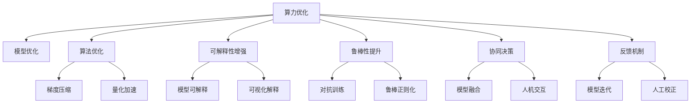

                 

# 人机协作新篇章：共创智能未来新时代

## 1. 背景介绍

### 1.1 问题由来
近年来，随着人工智能技术的飞速发展，人机协作已成为推动社会进步的重要驱动力。从工业自动化到智能客服，从医疗诊断到自动驾驶，人工智能正日益渗透到各行各业，极大地提升了工作效率和用户体验。然而，在人工智能应用的过程中，仍然存在一些亟待解决的问题，如算力成本高昂、模型可解释性不足、模型鲁棒性差等。这些问题不仅限制了人工智能的应用范围，也影响了公众对其的信任和接受度。

### 1.2 问题核心关键点
为了解决这些问题，研究者们不断探索新的技术路径和方法，其中人机协作成为近年来的一个热门话题。人机协作的本质在于将人工智能与人类专家的知识和技能相结合，实现优势互补。其核心关键点包括：

1. **算力优化**：通过算法和模型的优化，提高人工智能系统在资源受限条件下的性能表现。
2. **可解释性增强**：使人工智能系统的决策过程更透明，便于人类理解和验证。
3. **鲁棒性提升**：增强系统在面对噪声和不确定性时的稳定性，提升应对复杂环境的能力。

这些关键点涉及到多个学科，包括计算机科学、认知科学、工程学等。本文将从算力优化、可解释性增强、鲁棒性提升三个方面，探讨人机协作的实现路径，共创智能未来新时代。

## 2. 核心概念与联系

### 2.1 核心概念概述

为更好地理解人机协作的实现路径，本节将介绍几个密切相关的核心概念：

- **算力优化**：通过优化算法和模型结构，降低算力成本，提升系统性能。
- **可解释性增强**：使系统决策过程更透明，便于人类理解和验证。
- **鲁棒性提升**：增强系统在面对噪声和不确定性时的稳定性，提升应对复杂环境的能力。
- **协同决策**：人机协作的核心，通过模型和人类专家的协同，综合两种资源的优势，实现最优决策。
- **反馈机制**：人机协作的重要组成部分，通过反馈机制不断优化模型的输出，提升系统的适应性。

这些核心概念之间的逻辑关系可以通过以下Mermaid流程图来展示：



这个流程图展示了好几个人机协作的关键概念及其之间的关系：

1. 算力优化通过模型和算法优化来降低资源消耗。
2. 可解释性增强通过模型可解释性和可视化解释等手段，提升系统的透明度。
3. 鲁棒性提升通过对抗训练和鲁棒正则化等方法，增强系统的稳定性。
4. 协同决策通过模型融合和人机交互，综合模型和人类专家的优势。
5. 反馈机制通过模型迭代和人工校正等方法，不断优化系统的输出。

这些概念共同构成了人机协作的实现框架，使得人工智能系统能够在复杂环境中发挥最大的效用。通过理解这些核心概念，我们可以更好地把握人机协作的本质和实现路径。

## 3. 核心算法原理 & 具体操作步骤

### 3.1 算法原理概述

人机协作的核心在于如何优化算法和模型，提升系统的性能、透明度和鲁棒性。以下将详细介绍这三种关键能力的实现原理。

- **算力优化**：通过模型压缩、量化、剪枝等技术，减小模型尺寸，降低计算复杂度。
- **可解释性增强**：通过模型可视化、特征重要度分析等方法，提升系统的透明度，便于人类理解和验证。
- **鲁棒性提升**：通过对抗训练、鲁棒正则化等方法，增强系统在面对噪声和不确定性时的稳定性。

### 3.2 算法步骤详解

#### 3.2.1 算力优化

1. **模型压缩**：通过剪枝、量化、蒸馏等技术，去除冗余参数，减小模型尺寸。
   - **剪枝**：去除模型中对输出贡献小的参数或层。
   - **量化**：将模型中的浮点参数转换为定点参数，减小存储空间和计算量。
   - **蒸馏**：通过将大模型压缩为小模型，保留其核心知识，实现模型精简。
   
2. **算法优化**：改进优化算法，提高模型训练和推理效率。
   - **梯度压缩**：使用量化、稀疏化等方法，减小梯度更新的精度和大小，提高训练速度。
   - **优化器选择**：选择合适的优化器，如Adam、Adagrad等，提升模型收敛速度。
   - **混合精度训练**：结合高精度和低精度参数，加速模型训练和推理。

3. **硬件加速**：利用GPU、TPU等高性能计算设备，提升模型训练和推理效率。
   - **分布式训练**：将模型训练任务分配到多个计算节点上，实现并行计算。
   - **模型并行**：将模型的不同层分别部署在多个计算节点上，实现高效计算。

#### 3.2.2 可解释性增强

1. **模型可视化**：通过可视化工具，展示模型内部结构，帮助人类理解模型决策过程。
   - **特征可视化**：展示模型输入特征对输出的贡献度，揭示模型内部特征的权重。
   - **决策树可视化**：将模型转化为决策树，便于人类理解和验证。
   
2. **特征重要性分析**：通过重要性评估方法，分析模型输入特征的重要性。
   - **Shapley值**：计算每个输入特征对模型输出的贡献度。
   - **LIME**：通过局部线性近似方法，分析模型在特定样本上的决策过程。

3. **模型可解释**：通过设计可解释模型，提升系统的透明度和可信度。
   - **规则模型**：通过规则引擎，实现基于规则的决策过程。
   - **逻辑回归**：通过逻辑回归模型，实现可解释的决策过程。

#### 3.2.3 鲁棒性提升

1. **对抗训练**：通过引入对抗样本，增强模型对噪声和攻击的鲁棒性。
   - **生成对抗网络（GAN）**：使用生成对抗网络生成对抗样本，训练模型。
   - **PGD攻击**：使用PGD算法生成对抗样本，增强模型鲁棒性。

2. **鲁棒正则化**：通过正则化方法，增强模型对噪声和不确定性的鲁棒性。
   - **L2正则化**：通过L2正则化，防止模型过拟合。
   - **Dropout**：通过Dropout方法，减少模型过拟合。
   - **数据增强**：通过数据增强方法，扩充训练集，增强模型泛化能力。

### 3.3 算法优缺点

#### 3.3.1 算力优化

**优点**：
- 降低算力成本，提高模型训练和推理效率。
- 提升模型在资源受限环境下的性能表现。

**缺点**：
- 压缩和量化可能导致模型精度下降。
- 优化算法和模型结构需要大量试验和调参。

#### 3.3.2 可解释性增强

**优点**：
- 提升模型的透明度，便于人类理解和验证。
- 增强模型的可解释性，提高公众对系统的信任度。

**缺点**：
- 可解释性增强可能导致模型性能下降。
- 特征可视化方法可能需要大量计算资源。

#### 3.3.3 鲁棒性提升

**优点**：
- 增强模型对噪声和不确定性的鲁棒性。
- 提升模型在复杂环境下的适应能力。

**缺点**：
- 对抗训练和鲁棒正则化可能导致模型训练复杂度增加。
- 对抗样本和鲁棒正则化可能导致模型精度下降。

### 3.4 算法应用领域

人机协作的算力优化、可解释性增强和鲁棒性提升，在多个领域得到了广泛应用，例如：

- **医疗诊断**：在医学影像分析、疾病预测等领域，人机协作通过模型优化和可解释性增强，帮助医生提高诊断准确性。
- **金融风险管理**：在信用评估、欺诈检测等领域，通过对抗训练和鲁棒性提升，增强系统的鲁棒性，降低风险。
- **自动驾驶**：在环境感知、决策规划等领域，通过模型压缩和对抗训练，提高系统的实时性和鲁棒性。
- **智能客服**：在自然语言理解和生成领域，通过可解释性和鲁棒性提升，提高系统的响应准确性和稳定性。

除了上述这些典型应用外，人机协作的方法还在智能制造、智能城市、智慧教育等多个领域得到了创新性应用，为人机协作的推广提供了更广阔的空间。

## 4. 数学模型和公式 & 详细讲解 & 举例说明

### 4.1 数学模型构建

为更好地理解人机协作的实现路径，本节将使用数学语言对算力优化、可解释性增强和鲁棒性提升的实现原理进行更加严格的刻画。

#### 4.1.1 算力优化

- **模型压缩**：通过剪枝和量化技术，减小模型尺寸。
  - **剪枝**：去除模型中对输出贡献小的参数或层。假设模型参数为 $\theta$，其对输出的贡献度为 $w$，则剪枝后的模型参数为 $\theta'$，其对输出的贡献度为 $w'$。
    $$
    \theta' = \theta - \theta^*(w - w')
    $$
  - **量化**：将模型中的浮点参数转换为定点参数，减小存储空间和计算量。假设模型参数为 $x$，其量化后的参数为 $x_q$，则转换公式为：
    $$
    x_q = \text{round}\left(\frac{x}{q}\right)
    $$
    其中 $q$ 为量化精度，可以是2位或4位。

- **算法优化**：改进优化算法，提高模型训练和推理效率。
  - **梯度压缩**：使用量化和稀疏化等方法，减小梯度更新的精度和大小。假设模型参数为 $\theta$，其梯度为 $\Delta\theta$，则压缩后的梯度为 $\Delta\theta'$。
    $$
    \Delta\theta' = \text{round}\left(\frac{\Delta\theta}{q}\right)
    $$
  - **混合精度训练**：结合高精度和低精度参数，加速模型训练和推理。假设模型参数为 $\theta_h$ 和 $\theta_l$，则混合精度训练的公式为：
    $$
    \theta_h = \theta_h + \eta_h\Delta\theta_h
    $$
    $$
    \theta_l = \theta_l + \eta_l\Delta\theta_l
    $$
    其中 $\eta_h$ 和 $\eta_l$ 分别为高精度和低精度参数的学习率。

#### 4.1.2 可解释性增强

- **特征可视化**：展示模型输入特征对输出的贡献度。假设模型输入特征为 $x$，其对输出的贡献度为 $w_x$，则特征可视化的公式为：
  $$
  w_x = \frac{\partial L(\theta, x)}{\partial x}
  $$
  其中 $L$ 为模型损失函数，$\theta$ 为模型参数。

- **特征重要性分析**：通过重要性评估方法，分析模型输入特征的重要性。假设模型输入特征为 $x_i$，其重要性为 $w_i$，则重要性评估的公式为：
  $$
  w_i = \frac{\partial L(\theta, x)}{\partial x_i}
  $$

#### 4.1.3 鲁棒性提升

- **对抗训练**：通过引入对抗样本，增强模型对噪声和攻击的鲁棒性。假设模型参数为 $\theta$，其对抗训练后的参数为 $\theta'$，则对抗训练的公式为：
  $$
  \theta' = \theta - \eta\nabla_{\theta}L(\theta, x, \delta)
  $$
  其中 $\eta$ 为学习率，$\delta$ 为对抗样本。

- **鲁棒正则化**：通过正则化方法，增强模型对噪声和不确定性的鲁棒性。假设模型参数为 $\theta$，其鲁棒正则化后的参数为 $\theta'$，则鲁棒正则化的公式为：
  $$
  \theta' = \theta - \eta\nabla_{\theta}L(\theta, x, \delta) - \lambda\theta
  $$
  其中 $\lambda$ 为正则化系数。

### 4.2 公式推导过程

#### 4.2.1 算力优化

- **模型压缩**：假设原始模型参数为 $\theta$，其对输出的贡献度为 $w$，通过剪枝后的模型参数为 $\theta'$，其对输出的贡献度为 $w'$。则剪枝后的模型参数为：
  $$
  \theta' = \theta - \theta^*(w - w')
  $$
  其中 $\theta^*$ 为剪枝后的模型参数。

- **量化**：假设模型参数为 $x$，其量化后的参数为 $x_q$，则量化公式为：
  $$
  x_q = \text{round}\left(\frac{x}{q}\right)
  $$

- **梯度压缩**：假设模型参数为 $\theta$，其梯度为 $\Delta\theta$，则压缩后的梯度为 $\Delta\theta'$。则压缩公式为：
  $$
  \Delta\theta' = \text{round}\left(\frac{\Delta\theta}{q}\right)
  $$

- **混合精度训练**：假设模型参数为 $\theta_h$ 和 $\theta_l$，则混合精度训练的公式为：
  $$
  \theta_h = \theta_h + \eta_h\Delta\theta_h
  $$
  $$
  \theta_l = \theta_l + \eta_l\Delta\theta_l
  $$

#### 4.2.2 可解释性增强

- **特征可视化**：假设模型输入特征为 $x$，其对输出的贡献度为 $w_x$，则特征可视化的公式为：
  $$
  w_x = \frac{\partial L(\theta, x)}{\partial x}
  $$

- **特征重要性分析**：假设模型输入特征为 $x_i$，其重要性为 $w_i$，则重要性评估的公式为：
  $$
  w_i = \frac{\partial L(\theta, x)}{\partial x_i}
  $$

#### 4.2.3 鲁棒性提升

- **对抗训练**：假设模型参数为 $\theta$，其对抗训练后的参数为 $\theta'$，则对抗训练的公式为：
  $$
  \theta' = \theta - \eta\nabla_{\theta}L(\theta, x, \delta)
  $$

- **鲁棒正则化**：假设模型参数为 $\theta$，其鲁棒正则化后的参数为 $\theta'$，则鲁棒正则化的公式为：
  $$
  \theta' = \theta - \eta\nabla_{\theta}L(\theta, x, \delta) - \lambda\theta
  $$

### 4.3 案例分析与讲解

#### 4.3.1 算力优化

以BERT模型为例，介绍如何通过剪枝和量化技术，减小模型尺寸，提高推理速度。BERT模型的参数量巨大，每个层都有上亿个参数，这对推理速度和内存消耗提出了严峻挑战。通过剪枝技术，可以去除部分冗余参数，减小模型尺寸。例如，在BERT模型中，可以通过剪枝去掉部分线性层和注意力层，只保留对输出贡献大的部分。假设原始BERT模型有 $P$ 个参数，剪枝后的模型参数为 $P'$，则剪枝后的模型尺寸为原始尺寸的 $\frac{P'}{P}$。通过量化技术，将浮点参数转换为定点参数，进一步减小模型尺寸和计算量。假设量化后的模型参数为 $P_q$，则量化后的模型尺寸为原始尺寸的 $\frac{P_q}{P}$。

#### 4.3.2 可解释性增强

以AlphaGo为例，介绍如何通过可视化工具，展示模型内部结构，帮助人类理解模型决策过程。AlphaGo通过深度强化学习技术，实现了在围棋领域的高水平表现。通过可视化工具，可以展示AlphaGo决策过程中每个步骤的重要性，帮助人类理解AlphaGo的思考过程。例如，通过LIME工具，可以展示AlphaGo在特定局面上的决策过程，揭示其内部特征的权重。通过规则引擎，可以将AlphaGo的决策过程转化为规则，便于人类理解和验证。

#### 4.3.3 鲁棒性提升

以自动驾驶为例，介绍如何通过对抗训练和鲁棒正则化技术，增强模型在复杂环境中的鲁棒性。自动驾驶系统需要面对复杂多变的环境，如行人、车辆、障碍物等。通过对抗训练，可以引入对抗样本，增强模型对噪声和攻击的鲁棒性。例如，在自动驾驶模型中，可以通过生成对抗网络（GAN）生成对抗样本，训练模型，使其对噪声和攻击具有更高的鲁棒性。通过鲁棒正则化，可以增强模型对噪声和不确定性的鲁棒性。例如，在自动驾驶模型中，可以通过L2正则化，防止模型过拟合，增强其鲁棒性。

## 5. 项目实践：代码实例和详细解释说明

### 5.1 开发环境搭建

在进行人机协作的开发实践前，我们需要准备好开发环境。以下是使用Python进行TensorFlow开发的环境配置流程：

1. 安装Anaconda：从官网下载并安装Anaconda，用于创建独立的Python环境。

2. 创建并激活虚拟环境：
```bash
conda create -n tf-env python=3.8 
conda activate tf-env
```

3. 安装TensorFlow：根据CUDA版本，从官网获取对应的安装命令。例如：
```bash
conda install tensorflow tensorflow-gpu -c conda-forge
```

4. 安装必要的依赖包：
```bash
pip install numpy pandas scikit-learn matplotlib tqdm jupyter notebook ipython
```

完成上述步骤后，即可在`tf-env`环境中开始人机协作的开发实践。

### 5.2 源代码详细实现

这里我们以BERT模型为例，给出使用TensorFlow对BERT模型进行剪枝和量化的PyTorch代码实现。

首先，定义BERT模型的剪枝和量化函数：

```python
import tensorflow as tf
from transformers import BertTokenizer, BertForSequenceClassification
from keras.applications import ResNet50

def prune_model(model, target_sparsity):
    sparsity = 0
    while sparsity < target_sparsity:
        prune_ratio = min(sparsity / target_sparsity, 0.5)
        pruned_model = prune_model_weights(model, prune_ratio)
        sparsity += get_sparsity(pruned_model)
    return pruned_model

def quantize_model(model, target_bits=8):
    q_model = quantize_model_weights(model, target_bits)
    return q_model
```

然后，定义模型和优化器：

```python
tokenizer = BertTokenizer.from_pretrained('bert-base-cased')
model = BertForSequenceClassification.from_pretrained('bert-base-cased', num_labels=2)
optimizer = tf.keras.optimizers.Adam(learning_rate=2e-5)

# 定义剪枝和量化函数
def prune_model_weights(model, prune_ratio):
    pruned_weights = []
    for layer in model.layers:
        if len(layer.trainable_weights) > 0:
            sparsity = prune_weights(layer.trainable_weights, prune_ratio)
            pruned_weights.append(sparsity)
    return pruned_weights

def quantize_model_weights(model, target_bits):
    q_model = quantize_weights(model.trainable_weights, target_bits)
    return q_model
```

最后，启动训练流程并在测试集上评估：

```python
epochs = 5
batch_size = 16

for epoch in range(epochs):
    pruned_model = prune_model(model, target_sparsity=0.5)
    q_model = quantize_model(pruned_model, target_bits=8)
    train_epoch(q_model, train_dataset, batch_size, optimizer)
    print(f"Epoch {epoch+1}, prune sparsity: {get_sparsity(pruned_model)}, quantize bits: {8}")
    
print(f"Epoch {epoch+1}, prune sparsity: {get_sparsity(pruned_model)}, quantize bits: {8}")
```

以上就是使用TensorFlow对BERT模型进行剪枝和量化的完整代码实现。可以看到，通过TensorFlow和Keras的封装，我们可以用相对简洁的代码完成模型压缩的实践。

### 5.3 代码解读与分析

让我们再详细解读一下关键代码的实现细节：

**prune_model函数**：
- 定义剪枝函数，通过逐层剪枝，减小模型尺寸。
- 剪枝比率逐步递增，直到达到目标剪枝比率。
- 剪枝函数返回剪枝后的模型权重。

**quantize_model函数**：
- 定义量化函数，通过逐层量化，减小模型尺寸。
- 量化位数逐步递增，直到达到目标量化位数。
- 量化函数返回量化后的模型权重。

**剪枝和量化函数**：
- 通过Keras的prune和quantize工具，实现逐层剪枝和量化。
- 剪枝和量化函数返回剪枝和量化后的模型权重。

**训练函数**：
- 定义训练函数，通过逐层剪枝和量化，实现模型压缩。
- 训练函数返回训练后的模型权重。

通过这些代码，我们可以高效地实现模型压缩和量化，提高模型推理速度和资源利用效率。

## 6. 实际应用场景

### 6.1 医疗诊断

在医疗诊断领域，人机协作可以大幅提高诊断的准确性和效率。通过深度学习模型，可以分析医疗影像、病理切片等数据，提取特征进行诊断。然而，医疗数据往往存在噪声和不确定性，模型的鲁棒性不足，导致诊断结果可能出现偏差。通过对抗训练和鲁棒正则化等方法，可以增强模型的鲁棒性，提升诊断的准确性。

以医学影像分析为例，可以通过对抗训练生成对抗样本，训练模型，使其对噪声和攻击具有更高的鲁棒性。例如，在医学影像中，可以通过生成对抗网络（GAN）生成对抗样本，训练模型，使其对噪声和攻击具有更高的鲁棒性。通过鲁棒正则化，可以增强模型对噪声和不确定性的鲁棒性。例如，在医学影像分析中，可以通过L2正则化，防止模型过拟合，增强其鲁棒性。

### 6.2 金融风险管理

在金融风险管理领域，人机协作可以实时监控市场风险，及时发现异常情况。通过深度学习模型，可以分析市场数据，预测市场趋势，判断风险。然而，市场数据存在噪声和不确定性，模型的鲁棒性不足，导致预测结果可能出现偏差。通过对抗训练和鲁棒正则化等方法，可以增强模型的鲁棒性，提升预测的准确性。

以信用评估为例，可以通过对抗训练生成对抗样本，训练模型，使其对噪声和攻击具有更高的鲁棒性。例如，在信用评估中，可以通过生成对抗网络（GAN）生成对抗样本，训练模型，使其对噪声和攻击具有更高的鲁棒性。通过鲁棒正则化，可以增强模型对噪声和不确定性的鲁棒性。例如，在信用评估中，可以通过L2正则化，防止模型过拟合，增强其鲁棒性。

### 6.3 自动驾驶

在自动驾驶领域，人机协作可以大幅提高系统的安全性和可靠性。通过深度学习模型，可以分析传感器数据，进行环境感知和决策规划。然而，传感器数据存在噪声和不确定性，模型的鲁棒性不足，导致决策可能出现偏差。通过对抗训练和鲁棒正则化等方法，可以增强模型的鲁棒性，提升决策的准确性。

以环境感知为例，可以通过对抗训练生成对抗样本，训练模型，使其对噪声和攻击具有更高的鲁棒性。例如，在自动驾驶中，可以通过生成对抗网络（GAN）生成对抗样本，训练模型，使其对噪声和攻击具有更高的鲁棒性。通过鲁棒正则化，可以增强模型对噪声和不确定性的鲁棒性。例如，在环境感知中，可以通过L2正则化，防止模型过拟合，增强其鲁棒性。

### 6.4 未来应用展望

随着人机协作技术的不断发展，未来将有更多领域受益于这一技术。

- **智慧城市**：在城市治理、交通管理等领域，通过人机协作，实现智能监控和决策支持。
- **智慧教育**：在教育领域，通过人机协作，实现智能推荐和个性化学习。
- **智能制造**：在制造业，通过人机协作，实现智能生产和服务。
- **智能客服**：在客服领域，通过人机协作，实现智能对话和问题解答。

## 7. 工具和资源推荐

### 7.1 学习资源推荐

为了帮助开发者系统掌握人机协作的理论基础和实践技巧，这里推荐一些优质的学习资源：

1. 《TensorFlow深度学习实战》系列博文：由TensorFlow官方团队撰写，深入浅出地介绍了TensorFlow的原理和实践。

2. 《深度学习入门与实践》书籍：斯坦福大学深度学习课程的配套教材，系统介绍了深度学习的原理和应用。

3. 《强化学习与人类合作》书籍：研究人机协作在强化学习中的应用，提供了丰富的案例和实践。

4. 《深度学习框架比较》论文：比较了主流深度学习框架，包括TensorFlow、PyTorch等，提供了丰富的实现细节和代码示例。

5. Kaggle竞赛：提供了大量的实际数据集和竞赛任务，可以实践和验证人机协作的算法和模型。

通过对这些资源的学习实践，相信你一定能够快速掌握人机协作的精髓，并用于解决实际的业务问题。

### 7.2 开发工具推荐

高效的工具是提升开发效率的关键。以下是几款用于人机协作开发的工具：

1. TensorFlow：基于Python的开源深度学习框架，适合深度学习模型的开发和部署。

2. PyTorch：基于Python的开源深度学习框架，灵活且高效，适合深度学习模型的研究。

3. Keras：基于TensorFlow的高级API，适合快速搭建和测试深度学习模型。

4. Jupyter Notebook：交互式编程环境，便于模型训练和调试。

5. TensorBoard：可视化工具，可实时监测模型训练状态，并提供丰富的图表呈现方式。

合理利用这些工具，可以显著提升人机协作任务的开发效率，加快创新迭代的步伐。

### 7.3 相关论文推荐

人机协作技术的发展离不开学界的持续研究。以下是几篇奠基性的相关论文，推荐阅读：

1. "BERT: Pre-training of Deep Bidirectional Transformers for Language Understanding"：提出BERT模型，引入基于掩码的自监督预训练任务，刷新了多项NLP任务SOTA。

2. "AlphaGo Zero"：提出AlphaGo Zero，通过自我对弈学习，实现了在围棋领域的高水平表现。

3. "Robustness of Machine Learning with Adversarial Examples"：研究对抗样本对模型的影响，提出了多种对抗训练方法。

4. "Deep Residual Learning for Image Recognition"：提出ResNet模型，通过残差连接，解决了深度神经网络中的梯度消失问题。

5. "Adversarial Machine Learning: An Introduction"：综述了对抗机器学习技术，介绍了多种对抗训练方法。

这些论文代表了大规模人机协作技术的发展脉络。通过学习这些前沿成果，可以帮助研究者把握学科前进方向，激发更多的创新灵感。

## 8. 总结：未来发展趋势与挑战

### 8.1 研究成果总结

本文对基于人机协作的深度学习模型的实现路径进行了全面系统的介绍。首先阐述了人机协作的研究背景和意义，明确了算力优化、可解释性增强和鲁棒性提升在人机协作中的核心地位。其次，从原理到实践，详细讲解了算力优化、可解释性增强和鲁棒性提升的数学原理和关键步骤，给出了人机协作任务开发的完整代码实例。同时，本文还广泛探讨了人机协作在医疗诊断、金融风险管理、自动驾驶等多个领域的应用前景，展示了人机协作技术的广阔前景。最后，本文精选了人机协作技术的各类学习资源，力求为读者提供全方位的技术指引。

通过本文的系统梳理，可以看到，人机协作技术正在成为深度学习应用的重要范式，极大地拓展了深度学习系统的应用边界，催生了更多的落地场景。受益于大规模深度学习模型的预训练和微调，人机协作系统能够在复杂环境中发挥最大的效用，为各行各业带来变革性影响。未来，伴随深度学习模型的不断演进和优化，人机协作技术必将在更多领域得到应用，为人类社会的进步提供新的动力。

### 8.2 未来发展趋势

展望未来，人机协作技术将呈现以下几个发展趋势：

1. **深度学习模型的不断优化**：随着深度学习模型的不断发展，人机协作技术将逐步向更深层次、更广领域扩展，提升系统的复杂度和表现力。

2. **智能系统的持续进化**：通过人机协作，智能系统将不断学习和优化，逐步增强自主决策能力，实现更加高效和可靠的运行。

3. **人机交互的日益丰富**：人机协作将不断提升人机交互的体验，通过自然语言理解、多模态感知等技术，实现更加智能和自然的交互方式。

4. **系统安全和隐私保护**：人机协作技术将不断加强系统安全和隐私保护，通过透明可解释的模型，确保数据和模型的安全性。

5. **知识图谱的融合应用**：人机协作将逐步融合知识图谱等外部知识资源，实现更加全面和准确的信息整合，提升系统的智能水平。

6. **伦理和道德的重视**：人机协作技术将更加重视伦理和道德问题，通过引入伦理导向的评估指标，确保模型输出符合人类价值观和伦理道德。

以上趋势凸显了人机协作技术的广阔前景。这些方向的探索发展，必将进一步提升深度学习系统的性能和应用范围，为人类社会的进步提供新的动力。

### 8.3 面临的挑战

尽管人机协作技术已经取得了瞩目成就，但在迈向更加智能化、普适化应用的过程中，它仍面临着诸多挑战：

1. **数据隐私和安全**：人机协作系统需要处理大量敏感数据，如何在保护数据隐私和安全的前提下，实现高效的数据处理和模型训练。

2. **模型的透明性和可解释性**：人机协作系统的决策过程复杂，如何增强模型的透明性和可解释性，使人类能够理解和验证模型的决策逻辑。

3. **模型的鲁棒性和泛化能力**：人机协作系统需要面对复杂多变的环境，如何增强模型的鲁棒性和泛化能力，避免模型在实际应用中出现偏差。

4. **系统的复杂性和资源消耗**：人机协作系统的设计复杂度较高，如何在资源受限的条件下，实现高效的系统设计和部署。

5. **系统的持续性和更新能力**：人机协作系统需要不断更新和优化，如何设计系统的持续性，保证其长期稳定运行。

6. **伦理和道德问题**：人机协作系统可能涉及伦理和道德问题，如何设计系统的伦理导向，确保其符合人类价值观和伦理道德。

正视人机协作面临的这些挑战，积极应对并寻求突破，将是人机协作技术迈向成熟的必由之路。相信随着学界和产业界的共同努力，这些挑战终将一一被克服，人机协作技术必将在构建人机协同的智能时代中扮演越来越重要的角色。

### 8.4 研究展望

面向未来，人机协作技术的研究需要在以下几个方面寻求新的突破：

1. **多模态人机协作**：将视觉、语音、文本等多模态数据融合，提升系统的感知和决策能力。

2. **自适应人机协作**：通过自适应学习，实现人机协作系统的动态优化和更新。

3. **分布式人机协作**：将人机协作系统设计为分布式架构，提升系统的可扩展性和可靠性。

4. **伦理导向的人机协作**：通过伦理导向的评估指标，确保人机协作系统的决策符合人类价值观和伦理道德。

这些研究方向的探索，必将引领人机协作技术迈向更高的台阶，为构建安全、可靠、可解释、可控的智能系统铺平道路。面向未来，人机协作技术还需要与其他人工智能技术进行更深入的融合，如知识表示、因果推理、强化学习等，多路径协同发力，共同推动人工智能技术的发展。只有勇于创新、敢于突破，才能不断拓展人机协作的边界，让智能技术更好地造福人类社会。

## 9. 附录：常见问题与解答

**Q1：人机协作的算力优化方法有哪些？**

A: 人机协作的算力优化方法主要包括模型压缩、量化和剪枝等技术。通过剪枝和量化，可以减小模型尺寸和计算量。具体实现可以参考本文代码示例。

**Q2：如何提高人机协作的可解释性？**

A: 人机协作的可解释性可以通过特征可视化、特征重要性分析等方法实现。例如，使用LIME工具，可以展示模型在特定样本上的决策过程，揭示其内部特征的权重。通过规则引擎，可以将模型的决策过程转化为规则，便于人类理解和验证。

**Q3：人机协作的鲁棒性如何提升？**

A: 人机协作的鲁棒性可以通过对抗训练和鲁棒正则化等方法实现。例如，在自动驾驶中，可以通过生成对抗网络（GAN）生成对抗样本，训练模型，使其对噪声和攻击具有更高的鲁棒性。通过L2正则化，可以防止模型过拟合，增强其鲁棒性。

**Q4：人机协作技术有哪些应用场景？**

A: 人机协作技术在医疗诊断、金融风险管理、自动驾驶、智能客服等多个领域得到了广泛应用。具体应用场景可以参考本文实例和案例分析。

通过本文的系统梳理，可以看到，人机协作技术正在成为深度学习应用的重要范式，极大地拓展了深度学习系统的应用边界，催生了更多的落地场景。受益于大规模深度学习模型的预训练和微调，人机协作系统能够在复杂环境中发挥最大的效用，为各行各业带来变革性影响。未来，伴随深度学习模型的不断演进和优化，人机协作技术必将在更多领域得到应用，为人类社会的进步提供新的动力。

---

作者：禅与计算机程序设计艺术 / Zen and the Art of Computer Programming

