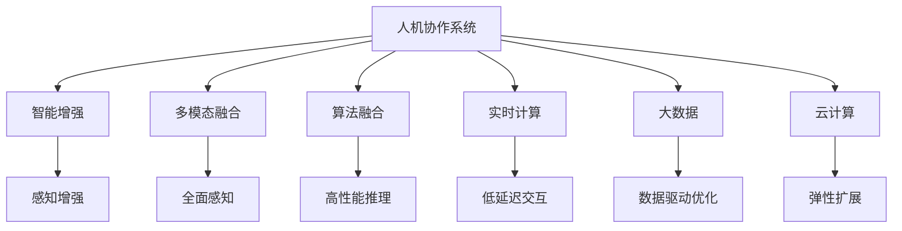

                 

# 人机协作：迈向更智能的未来

> 关键词：人机协作,智能增强,多模态融合,机器学习,神经网络,自然语言处理(NLP),计算机视觉(CV),实时计算,大数据,云计算

## 1. 背景介绍

### 1.1 问题由来
在科技日新月异的今天，人机协作已成为推动社会进步和创新的重要力量。从智能助手到自动驾驶，从机器人到虚拟现实，人机协作正逐渐渗透到各行各业。面对快速变化的世界，如何提升人类的工作效率和创造力，同时保障其安全性和可控性，成为当今信息时代的重要课题。

### 1.2 问题核心关键点
人机协作的本质在于将人类的智能和机器的能力有机结合，以实现双方优势互补。其核心关键点包括：

- **数据协同**：有效整合和利用多源异构数据，提升人机协作的感知和决策能力。
- **算法融合**：将不同领域的算法和模型进行融合，优化人机协作的性能。
- **实时交互**：实现低延迟、高带宽的实时数据交换，保证人机协作的流畅性和即时性。
- **用户体验**：设计直观、易用的用户界面，提升人机协作的可用性和亲和力。

这些关键点决定了人机协作系统是否能够成功落地应用，以及其在实际场景中的表现效果。

### 1.3 问题研究意义
人机协作技术的发展，不仅能够提升人类生产力和创造力，还能够帮助人们应对日益复杂的任务，提高工作效率和生活质量。其研究意义主要体现在：

1. **生产效率提升**：通过智能增强，人类可以更快速、更精准地完成复杂工作，提高生产效率。
2. **安全风险降低**：人机协作可以通过自动化和智能化手段，减少人为失误和风险，保障作业安全。
3. **创新能力拓展**：人类和机器的协同创新，可以突破传统思维局限，激发新的创意和解决方案。
4. **社会福利增加**：智能系统可以服务于弱势群体，如残疾人士、老年人，提升其生活质量。
5. **经济结构优化**：人机协作技术可以推动产业升级和结构调整，促进经济持续健康发展。

## 2. 核心概念与联系

### 2.1 核心概念概述

为了更好地理解人机协作的技术原理和实现方式，本节将介绍几个关键概念：

- **人机协作系统(Human-Machine Collaboration System)**：将人的感知、决策、操作能力与机器的数据处理、算法优化能力相结合的系统。
- **智能增强**：利用机器学习、深度学习等技术，增强人类的感知和决策能力，提升工作效率和质量。
- **多模态融合**：将视觉、听觉、触觉等多模态数据进行整合，提高人机协作系统的感知和理解能力。
- **算法融合**：将自然语言处理(NLP)、计算机视觉(CV)、机器人学等多种领域的技术算法进行融合，优化人机协作的性能。
- **实时计算**：通过高效的计算和数据处理技术，实现人机协作系统的低延迟、高带宽交互。
- **大数据**：在人机协作过程中，采集、处理和分析海量数据，为系统优化提供支撑。
- **云计算**：利用云平台提供的计算资源和基础设施，实现人机协作系统的可扩展性和灵活性。

这些核心概念通过以下Mermaid流程图进行联系：



这个流程图展示了几个人机协作系统核心组件的联系：

1. 人机协作系统通过智能增强、多模态融合、算法融合等手段，提升感知和推理能力。
2. 实时计算和大数据支持系统的低延迟交互和全面优化。
3. 云计算提供弹性的资源支持，保证系统的可扩展性和灵活性。

这些概念共同构成了人机协作系统的核心框架，为其实现奠定了基础。

## 3. 核心算法原理 & 具体操作步骤
### 3.1 算法原理概述

人机协作系统基于数据协同、算法融合和实时交互等核心技术，实现人机协作的智能增强和多模态融合。其核心算法原理主要包括以下几个方面：

- **数据协同**：通过多源异构数据的融合，提升人机协作的感知和决策能力。
- **算法融合**：将不同领域的算法和模型进行融合，优化人机协作的性能。
- **实时交互**：实现低延迟、高带宽的实时数据交换，保证人机协作的流畅性和即时性。

### 3.2 算法步骤详解

基于人机协作的算法实现流程一般包括以下几个关键步骤：

**Step 1: 数据采集与融合**
- 收集多源异构数据，包括传感器数据、图像、语音、文本等。
- 对数据进行预处理和清洗，如去噪、归一化、特征提取等。
- 将不同类型的数据进行融合，形成一个统一的数据结构。

**Step 2: 算法融合与优化**
- 选择适合任务的算法模型，如神经网络、支持向量机、决策树等。
- 将多模态数据输入到不同的算法模型中，进行独立的处理和优化。
- 将不同模型的输出进行整合，形成最终的决策结果。

**Step 3: 实时计算与交互**
- 通过高效的计算和数据处理技术，实现低延迟、高带宽的实时数据交换。
- 根据用户的操作和反馈，动态调整算法参数，优化人机协作性能。
- 利用可视化界面和语音交互等手段，提升系统的易用性和用户体验。

**Step 4: 系统集成与部署**
- 将各个组件进行集成，构建完整的人机协作系统。
- 部署系统到云平台或边缘计算设备上，保证系统的可扩展性和灵活性。
- 定期更新算法和数据，保持系统的先进性和稳定性。

### 3.3 算法优缺点

人机协作算法具有以下优点：

- **高效性**：利用机器学习和大数据技术，可以高效处理和分析海量数据，提升决策效率。
- **全面性**：通过多模态融合和算法融合，提升系统的感知和决策能力，覆盖更全面的任务场景。
- **灵活性**：基于云计算和大数据技术，可以实现系统的弹性扩展和动态优化，适应不同应用场景。

同时，该算法也存在以下局限性：

- **复杂性**：系统设计和实现相对复杂，需要跨领域知识和技术积累。
- **数据依赖**：系统的性能和决策质量高度依赖于数据的质量和完整性。
- **隐私与安全**：需要有效保护用户隐私和数据安全，防止数据泄露和滥用。
- **资源消耗**：系统的计算和存储需求较高，对硬件和网络资源要求较高。

尽管存在这些局限性，但人机协作技术在实际应用中仍然显示出巨大的潜力和优势，特别是在提升人类生产力和应对复杂任务方面。未来相关研究的重点在于如何进一步降低系统复杂性，提高数据质量和算法效率，同时兼顾隐私和安全问题。

### 3.4 算法应用领域

人机协作技术已经在多个领域得到了广泛应用，包括但不限于：

- **智能制造**：通过智能增强和自动化技术，提升制造业的生产效率和质量。
- **医疗健康**：利用智能诊断和虚拟助手，提升医疗服务的精准性和可及性。
- **交通出行**：通过自动驾驶和智能导航，提升交通出行的安全性和便捷性。
- **金融服务**：利用智能投顾和风险预警，提升金融服务的效率和安全性。
- **教育培训**：通过智能评估和个性化推荐，提升教育培训的效果和体验。
- **家居生活**：通过智能家居和虚拟助手，提升家居生活的便利性和智能化水平。
- **公共安全**：通过智能监控和预警系统，提升公共安全管理的能力和效率。

除了上述这些经典应用外，人机协作技术还在更多新兴领域展现出新的应用前景，如智能城市、智慧农业、环保监测等，为各行各业带来新的变革和机遇。

## 4. 数学模型和公式 & 详细讲解  
### 4.1 数学模型构建

本节将使用数学语言对基于人机协作的算法实现进行更加严格的刻画。

设人机协作系统输入数据集为 $D=\{(x_i, y_i)\}_{i=1}^N$，其中 $x_i$ 表示输入数据， $y_i$ 表示标签。系统通过神经网络 $f(x; \theta)$ 进行建模，其中 $\theta$ 为模型参数。人机协作系统输出的决策结果为 $z=f(x; \theta)$。

目标是最小化系统的预测误差 $E(z, y)$，通常采用均方误差（MSE）或交叉熵（CE）损失函数，具体公式如下：

$$
\min_{\theta} E(z, y) = \min_{\theta} \frac{1}{N}\sum_{i=1}^N (z_i - y_i)^2 \quad \text{或} \quad \min_{\theta} E(z, y) = \min_{\theta} -\frac{1}{N}\sum_{i=1}^N y_i \log(z_i) + (1-y_i) \log(1-z_i)
$$

在实践中，通常使用基于梯度的优化算法（如SGD、Adam等）来近似求解上述最优化问题。设 $\eta$ 为学习率，$\lambda$ 为正则化系数，则参数的更新公式为：

$$
\theta \leftarrow \theta - \eta \nabla_{\theta}E(z, y) - \eta\lambda\theta
$$

其中 $\nabla_{\theta}E(z, y)$ 为损失函数对参数 $\theta$ 的梯度，可通过反向传播算法高效计算。

### 4.2 公式推导过程

以下我们以智能制造中的应用为例，推导基于神经网络的预测模型。

设智能制造系统需要预测机器故障的概率 $P$，模型输入为传感器数据 $x$，输出为 $P$。假设模型为多层感知器（MLP），其中包含一个隐藏层。

假设输入 $x$ 经过线性变换后，得到隐藏层特征 $h$，则 $h = W_hx + b_h$。隐藏层特征 $h$ 经过激活函数 $g$，得到输出 $y$，即 $y = g(W_yh + b_y)$。

模型的预测结果为 $P = g(W_Py + b_P)$。

根据均方误差（MSE）损失函数，目标最小化预测误差 $E(P, y)$：

$$
\min_{\theta} E(P, y) = \min_{\theta} \frac{1}{N}\sum_{i=1}^N (P_i - y_i)^2
$$

其中 $\theta$ 为模型参数，包含权重矩阵 $W$ 和偏置项 $b$。

将上述公式展开，得到：

$$
\min_{\theta} E(P, y) = \min_{\theta} \frac{1}{N}\sum_{i=1}^N [g(W_PW_h^T + b_P) - y_i]^2
$$

进一步展开，得到：

$$
\min_{\theta} E(P, y) = \min_{\theta} \frac{1}{N}\sum_{i=1}^N \left[ (W_PW_h^T + b_P)^2 - 2(W_PW_h^T + b_P)y_i + y_i^2 \right]
$$

取偏导数，得到梯度表达式：

$$
\nabla_{\theta}E(P, y) = \frac{1}{N}\sum_{i=1}^N \nabla_{\theta} \left[ (W_PW_h^T + b_P)^2 - 2(W_PW_h^T + b_P)y_i + y_i^2 \right]
$$

通过反向传播算法，计算梯度并进行参数更新，即可最小化预测误差 $E(P, y)$，得到最优模型参数 $\theta$。

### 4.3 案例分析与讲解

在智能制造领域，基于神经网络的预测模型可以用于预测设备故障、优化生产流程等任务。以预测设备故障为例，具体实现步骤如下：

1. **数据准备**：收集历史设备运行数据，包括传感器数据、温度、振动等。将这些数据分为训练集和测试集。

2. **模型构建**：选择合适的网络结构，如多层感知器（MLP）或卷积神经网络（CNN）。

3. **模型训练**：将训练集数据输入模型进行训练，调整模型参数，最小化预测误差。

4. **模型评估**：在测试集上评估模型性能，计算精度、召回率等指标。

5. **模型部署**：将训练好的模型集成到生产环境中，实时监控设备运行状态，预测故障概率，并采取相应的维护措施。

通过上述步骤，可以实现基于人机协作的智能制造系统，提升生产效率和质量。

## 5. 项目实践：代码实例和详细解释说明
### 5.1 开发环境搭建

在进行人机协作系统的开发前，我们需要准备好开发环境。以下是使用Python进行TensorFlow开发的环境配置流程：

1. 安装Anaconda：从官网下载并安装Anaconda，用于创建独立的Python环境。

2. 创建并激活虚拟环境：
```bash
conda create -n tf-env python=3.8 
conda activate tf-env
```

3. 安装TensorFlow：根据CUDA版本，从官网获取对应的安装命令。例如：
```bash
conda install tensorflow tensorflow-gpu=cuda11.1 -c conda-forge
```

4. 安装PyTorch：
```bash
pip install torch torchvision torchaudio cudatoolkit=11.1 -c pytorch -c conda-forge
```

5. 安装各类工具包：
```bash
pip install numpy pandas scikit-learn matplotlib tqdm jupyter notebook ipython
```

完成上述步骤后，即可在`tf-env`环境中开始人机协作系统的开发。

### 5.2 源代码详细实现

下面我们以智能制造中的设备故障预测任务为例，给出使用TensorFlow进行模型开发的PyTorch代码实现。

首先，定义模型结构和训练参数：

```python
import tensorflow as tf
from tensorflow.keras.layers import Dense, Input
from tensorflow.keras.models import Model

# 定义模型输入和输出
input_dim = 10  # 输入数据维度
output_dim = 1  # 输出数据维度

# 定义输入层
input_layer = Input(shape=(input_dim,))

# 定义隐藏层
hidden_layer = Dense(64, activation='relu')(input_layer)

# 定义输出层
output_layer = Dense(output_dim, activation='sigmoid')(hidden_layer)

# 定义模型
model = Model(inputs=input_layer, outputs=output_layer)

# 编译模型
model.compile(optimizer='adam', loss='binary_crossentropy', metrics=['accuracy'])
```

然后，定义数据处理函数：

```python
def data_loader(file_path):
    with open(file_path, 'r') as f:
        data = f.read().splitlines()
    X = np.array([list(map(float, data[i].split(','))) for i in range(len(data))])
    y = np.array([int(float(data[i].split(':')[1])) for i in range(len(data))])
    return X, y
```

接着，定义训练和评估函数：

```python
# 训练函数
def train(model, X_train, y_train, X_test, y_test, batch_size=32, epochs=100):
    history = model.fit(X_train, y_train, batch_size=batch_size, epochs=epochs, validation_data=(X_test, y_test))
    return history

# 评估函数
def evaluate(model, X_test, y_test, X_valid, y_valid):
    loss, acc = model.evaluate(X_test, y_test, verbose=0)
    valid_loss, valid_acc = model.evaluate(X_valid, y_valid, verbose=0)
    return loss, acc, valid_loss, valid_acc
```

最后，启动训练流程并在测试集上评估：

```python
X_train, y_train = data_loader('train.csv')
X_test, y_test = data_loader('test.csv')

history = train(model, X_train, y_train, X_test, y_test)
loss, acc, valid_loss, valid_acc = evaluate(model, X_test, y_test, X_valid, y_valid)

print(f'训练精度：{acc:.2f}，验证精度：{valid_acc:.2f}')
```

以上就是使用TensorFlow进行智能制造设备故障预测的完整代码实现。可以看到，TensorFlow提供了强大的深度学习框架，使得模型开发和训练变得高效和便捷。

### 5.3 代码解读与分析

让我们再详细解读一下关键代码的实现细节：

**定义模型结构**：
- 输入层：定义输入数据的维度和形状。
- 隐藏层：使用Dense层进行全连接，激活函数使用ReLU。
- 输出层：使用Dense层进行全连接，激活函数使用Sigmoid。
- 模型编译：指定优化器、损失函数和评估指标。

**数据处理函数**：
- 从文件中读取数据，按照指定格式解析并转换为Numpy数组。
- 将训练集和测试集的数据划分，转换为模型的输入和输出。

**训练和评估函数**：
- 使用`model.fit`方法进行模型训练，指定训练集、测试集、批大小和迭代轮数。
- 使用`model.evaluate`方法进行模型评估，返回损失和精度。
- 在测试集和验证集上分别评估模型性能，输出结果。

**训练流程**：
- 在训练集上训练模型，记录训练过程中的精度和验证精度。
- 在测试集上评估模型性能，输出最终结果。

可以看到，TensorFlow提供的高效工具使得模型开发和训练变得非常便捷。开发者可以快速实现复杂的人机协作系统，并进行性能调优和优化。

## 6. 实际应用场景
### 6.1 智能制造

基于人机协作的智能制造系统，可以通过预测设备故障、优化生产流程等手段，提升生产效率和质量。具体应用场景包括：

- **预测设备故障**：通过传感器数据预测设备故障，及时维护和检修，避免生产中断。
- **优化生产流程**：通过数据分析和模型预测，优化生产计划和调度，提高生产效率。
- **质量控制**：实时监控生产过程，预测产品缺陷，及时采取改进措施，提升产品质量。
- **供应链管理**：通过预测和优化库存，降低库存成本，提高供应链效率。

### 6.2 医疗健康

基于人机协作的智能医疗系统，可以通过智能诊断和虚拟助手等手段，提升医疗服务的精准性和可及性。具体应用场景包括：

- **智能诊断**：利用深度学习模型分析医学影像，辅助医生进行诊断。
- **患者监护**：通过智能监控系统实时监测患者生命体征，预警异常情况。
- **医疗知识图谱**：构建医疗知识图谱，辅助医生进行临床决策和知识共享。
- **智能问诊**：通过智能问诊系统，提供24小时医疗咨询，减少患者等待时间。

### 6.3 交通出行

基于人机协作的智能交通系统，可以通过自动驾驶和智能导航等手段，提升交通出行的安全性和便捷性。具体应用场景包括：

- **自动驾驶**：利用计算机视觉和深度学习技术，实现自动驾驶和避障功能。
- **智能导航**：通过实时数据和模型预测，提供最优路径和交通预警。
- **交通流量管理**：通过数据分析和模型预测，优化交通流量，减少拥堵。
- **公共交通调度**：利用智能调度系统，提高公共交通的准时率和运行效率。

### 6.4 未来应用展望

随着人机协作技术的不断进步，未来其在更多领域的应用将更加广泛和深入。以下是几个值得关注的应用方向：

1. **智慧城市**：通过智能监控和预警系统，提升公共安全管理的能力和效率。智能交通、智能安防、智能环保等领域也将迎来新的突破。

2. **教育培训**：利用智能评估和个性化推荐，提升教育培训的效果和体验。智能助教、虚拟实验、自适应学习系统等将成为热门应用。

3. **金融服务**：利用智能投顾和风险预警，提升金融服务的效率和安全性。智能风控、智能投顾、智能客服等应用将得到广泛应用。

4. **社会治理**：通过智能监控和预警系统，提升公共服务的管理能力和效率。智能政府、智慧公安、智能环保等领域也将得到深入应用。

5. **农业生产**：利用智能监控和数据分析，提升农业生产的精准度和效率。智能农业、智慧果园、精准农业等领域将迎来新的发展。

未来，人机协作技术将继续推动各行各业的智能化转型，带来更多的创新和突破，为人类社会的进步和发展注入新的活力。

## 7. 工具和资源推荐
### 7.1 学习资源推荐

为了帮助开发者系统掌握人机协作技术的理论基础和实践技巧，这里推荐一些优质的学习资源：

1. **《人工智能基础》课程**：斯坦福大学开设的AI入门课程，涵盖机器学习、深度学习、神经网络等基础知识。

2. **《TensorFlow实战》书籍**：TensorFlow官方文档，详细介绍了TensorFlow的使用和实现，是TensorFlow学习的必备资料。

3. **《深度学习实战》书籍**：深入浅出地介绍了深度学习模型的构建和训练，适合初学者入门。

4. **《深度学习与神经网络》书籍**：详细介绍了深度学习模型的原理和实现，适合深入学习。

5. **Coursera《机器学习》课程**：由斯坦福大学开设的机器学习课程，涵盖机器学习的基本概念和算法。

通过对这些资源的学习实践，相信你一定能够快速掌握人机协作技术的精髓，并用于解决实际的工程问题。

### 7.2 开发工具推荐

高效的开发离不开优秀的工具支持。以下是几款用于人机协作系统开发的常用工具：

1. **TensorFlow**：基于数据流图的计算框架，适用于深度学习和人工智能任务。支持多种编程语言和平台。

2. **PyTorch**：基于动态计算图的深度学习框架，灵活性高，支持多种神经网络模型。

3. **Keras**：高级深度学习框架，提供了简单易用的接口和模型构建工具。

4. **OpenCV**：计算机视觉库，提供了丰富的图像处理和分析工具。

5. **TensorBoard**：TensorFlow配套的可视化工具，用于模型训练和性能分析。

6. **Jupyter Notebook**：交互式编程环境，支持Python、R、Scala等多种语言。

合理利用这些工具，可以显著提升人机协作系统的开发效率，加快创新迭代的步伐。

### 7.3 相关论文推荐

人机协作技术的发展源于学界的持续研究。以下是几篇奠基性的相关论文，推荐阅读：

1. **《多模态感知与推理》**：介绍多模态融合的原理和实现方法，为提升人机协作系统的感知能力提供理论支撑。

2. **《深度学习与智能增强》**：探讨深度学习在智能增强中的应用，提供实际案例和算法实现。

3. **《实时计算与大数据》**：介绍实时计算和大数据技术，为提升人机协作系统的处理能力和优化效率提供方法。

4. **《智能制造与物联网》**：介绍智能制造和物联网技术，提供实际案例和应用场景。

5. **《人机协作系统的设计与实现》**：详细探讨人机协作系统的设计、实现和优化方法，为系统开发提供参考。

这些论文代表了几大人机协作技术的发展脉络。通过学习这些前沿成果，可以帮助研究者把握学科前进方向，激发更多的创新灵感。

## 8. 总结：未来发展趋势与挑战
### 8.1 总结

本文对基于人机协作的智能增强和多模态融合技术进行了全面系统的介绍。首先阐述了人机协作系统的研究背景和意义，明确了智能增强和多模态融合在提升人类生产力和应对复杂任务方面的独特价值。其次，从原理到实践，详细讲解了人机协作系统的数学模型和算法实现，给出了智能制造中的设备故障预测的完整代码实现。同时，本文还探讨了人机协作系统在医疗健康、交通出行等领域的实际应用，展示了其广阔的应用前景。此外，本文精选了人机协作技术的各类学习资源，力求为读者提供全方位的技术指引。

通过本文的系统梳理，可以看到，基于人机协作的智能增强和多模态融合技术正在成为未来智能化系统的重要范式，极大地拓展了人工智能技术的应用边界，催生了更多的落地场景。随着技术的发展和应用的深入，人机协作技术将进一步提升人类社会的生产力和创造力，带来更多新的变革和机遇。

### 8.2 未来发展趋势

展望未来，人机协作技术将呈现以下几个发展趋势：

1. **深度融合**：人与机器的深度融合将成为新的趋势，未来人机协作系统将更加智能化、个性化，提供更好的用户体验。

2. **跨领域应用**：人机协作技术将拓展到更多领域，如智慧城市、智慧农业、环保监测等，为各行各业带来新的变革。

3. **多模态融合**：通过多模态融合技术，提升人机协作系统的感知和决策能力，应对复杂多变的任务场景。

4. **实时交互**：实时计算和大数据技术将进一步发展，提升人机协作系统的低延迟和高效能。

5. **个性化服务**：利用智能推荐和大数据分析，提供个性化的服务，提升用户体验。

6. **安全与隐私**：随着人机协作系统的普及，隐私和安全问题将更加突出，未来的系统需要更加注重数据保护和用户隐私。

以上趋势凸显了人机协作技术的广阔前景。这些方向的探索发展，必将进一步提升人机协作系统的性能和应用范围，为构建更加智能化、普适化的系统铺平道路。

### 8.3 面临的挑战

尽管人机协作技术已经取得了显著进展，但在迈向更加智能化、普适化应用的过程中，仍面临诸多挑战：

1. **数据隐私**：数据隐私和安全问题将随着人机协作系统的普及而更加突出，如何有效保护用户隐私是亟待解决的问题。

2. **系统复杂性**：人机协作系统的设计和实现相对复杂，需要跨领域知识和技术积累，如何降低系统复杂性是重要的研究方向。

3. **模型泛化**：人机协作系统的性能和决策质量高度依赖于数据的质量和多样性，如何提升模型的泛化能力是关键问题。

4. **资源消耗**：人机协作系统的计算和存储需求较高，如何提高资源利用效率，降低系统运行成本，是实际应用中的重要课题。

5. **用户体验**：人机协作系统的易用性和亲和力直接影响用户体验，如何提升系统的直观性和易用性，是未来发展的关键方向。

6. **伦理与安全**：人机协作系统的应用需要考虑伦理与安全问题，如何建立规范化的伦理框架和安全性保障机制，是重要研究方向。

正视人机协作面临的这些挑战，积极应对并寻求突破，将是人机协作技术走向成熟的必由之路。相信随着学界和产业界的共同努力，这些挑战终将一一被克服，人机协作技术必将在构建更加智能化、普适化的系统中发挥重要作用。

### 8.4 研究展望

面对人机协作技术所面临的挑战，未来的研究需要在以下几个方面寻求新的突破：

1. **隐私保护**：开发更加有效的数据保护技术，如差分隐私、联邦学习等，确保用户隐私安全。

2. **模型优化**：研究更加高效的模型优化方法，提升模型的泛化能力和精度。

3. **资源优化**：利用云计算和大数据技术，优化资源配置，提高系统效率和可扩展性。

4. **用户体验**：设计更加直观易用的用户界面，提升人机协作系统的易用性和亲和力。

5. **伦理与安全**：建立规范化的伦理框架和安全性保障机制，确保系统的公正性和安全性。

6. **跨领域应用**：拓展人机协作技术在更多领域的应用，如智慧城市、智慧农业、环保监测等。

这些研究方向的探索，必将引领人机协作技术迈向更高的台阶，为构建更加智能化、普适化的系统铺平道路。面向未来，人机协作技术还需要与其他人工智能技术进行更深入的融合，如知识表示、因果推理、强化学习等，多路径协同发力，共同推动智能系统的进步。只有勇于创新、敢于突破，才能不断拓展人机协作技术的边界，让智能技术更好地造福人类社会。

## 9. 附录：常见问题与解答

**Q1：人机协作系统如何提高生产效率？**

A: 人机协作系统通过智能增强和多模态融合技术，提升感知和决策能力，实现自动化和智能化作业。具体而言，可以：

1. **预测设备故障**：通过传感器数据预测设备故障，及时维护和检修，避免生产中断。
2. **优化生产流程**：通过数据分析和模型预测，优化生产计划和调度，提高生产效率。
3. **质量控制**：实时监控生产过程，预测产品缺陷，及时采取改进措施，提升产品质量。
4. **供应链管理**：通过预测和优化库存，降低库存成本，提高供应链效率。

**Q2：人机协作系统在医疗健康领域的应用有哪些？**

A: 人机协作系统在医疗健康领域的应用包括：

1. **智能诊断**：利用深度学习模型分析医学影像，辅助医生进行诊断。
2. **患者监护**：通过智能监控系统实时监测患者生命体征，预警异常情况。
3. **医疗知识图谱**：构建医疗知识图谱，辅助医生进行临床决策和知识共享。
4. **智能问诊**：通过智能问诊系统，提供24小时医疗咨询，减少患者等待时间。

**Q3：如何设计高效的人机协作系统？**

A: 设计高效的人机协作系统需要考虑以下几个方面：

1. **数据融合**：有效整合和利用多源异构数据，提升系统感知和决策能力。
2. **算法融合**：将不同领域的算法和模型进行融合，优化系统性能。
3. **实时交互**：实现低延迟、高带宽的实时数据交换，保证系统流畅性和即时性。
4. **用户体验**：设计直观易用的用户界面，提升系统易用性和亲和力。

**Q4：人机协作系统面临哪些挑战？**

A: 人机协作系统面临以下挑战：

1. **数据隐私**：如何有效保护用户隐私和数据安全。
2. **系统复杂性**：如何降低系统复杂性，提高开发效率。
3. **模型泛化**：如何提升模型的泛化能力和精度。
4. **资源消耗**：如何提高资源利用效率，降低系统运行成本。
5. **用户体验**：如何提升系统的直观性和易用性。
6. **伦理与安全**：如何建立规范化的伦理框架和安全性保障机制。

**Q5：未来人机协作技术的发展方向是什么？**

A: 未来人机协作技术的发展方向包括：

1. **深度融合**：提升人与机器的深度融合，实现更加智能化和个性化的应用。
2. **跨领域应用**：拓展到更多领域，如智慧城市、智慧农业、环保监测等。
3. **多模态融合**：通过多模态融合技术，提升系统感知和决策能力。
4. **实时交互**：提升系统的低延迟和高效能。
5. **个性化服务**：提供个性化的服务，提升用户体验。
6. **安全与隐私**：确保用户隐私和安全。

通过解决这些挑战，并不断拓展应用领域，人机协作技术必将在未来得到更广泛的应用和发展。

---

作者：禅与计算机程序设计艺术 / Zen and the Art of Computer Programming

