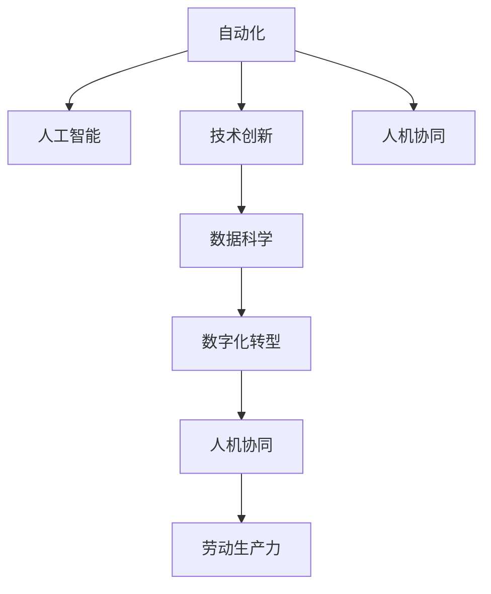

                 

# 人机协同：未来工作的关键词

> 关键词：人机协同, 未来工作, 自动化, 人工智能, 技术创新, 劳动生产力, 数据科学, 数字化转型

## 1. 背景介绍

### 1.1 问题由来

在21世纪，技术迅猛发展，尤其是人工智能（AI）技术的突破，使得机器在多个领域能够与人类协同工作。人机协同（Human-Machine Collaboration, HMC）已经成为未来工作的重要关键词。从自动化生产线的智能机器人到智能客服系统，再到智能诊断工具，人工智能正在改变人们的工作方式和生产效率。

### 1.2 问题核心关键点

人机协同的核心在于如何通过技术手段，让机器辅助或取代人类执行复杂、重复或高风险的任务，同时保留人类在创造性、决策和情感交流上的优势。随着AI技术的发展，特别是在自然语言处理（NLP）、计算机视觉、机器学习等领域，人机协同正在成为企业和行业升级转型的重要推动力。

### 1.3 问题研究意义

研究人机协同的关键技术，对于推动各行各业向智能化、自动化转型，提升劳动生产率，优化工作流程，以及促进人类与机器的和谐共处，具有深远的意义。它不仅能够减少人力成本，提高工作效率，还能够提升服务质量，创造新的商业模式和就业机会。

## 2. 核心概念与联系

### 2.1 核心概念概述

人机协同的核心概念包括以下几个方面：

- **人机协同（Human-Machine Collaboration, HMC）**：通过技术手段，使机器与人类协同工作，共同完成复杂任务。
- **自动化（Automation）**：利用机器执行重复性高、低价值的任务，释放人类劳动力，专注于更具创造性和战略性的工作。
- **人工智能（Artificial Intelligence, AI）**：包括机器学习、深度学习、自然语言处理、计算机视觉等技术，使机器能够自主决策和执行任务。
- **技术创新（Technological Innovation）**：不断推动技术边界，提升人机协同效率和质量，解锁新的应用场景。
- **劳动生产力（Productivity）**：通过自动化和AI技术，提高生产力和效率，优化资源配置。
- **数据科学（Data Science）**：利用数据分析和建模，提取有价值的信息，指导决策和优化流程。
- **数字化转型（Digital Transformation）**：通过数字化手段，实现企业转型升级，提升竞争力。

这些概念之间的联系可以通过以下Mermaid流程图来展示：



这个流程图展示了一系列关键概念及其之间的关系：

1. 自动化是基础，通过机器执行重复性任务。
2. 人工智能建立在自动化基础上，使机器具备自主决策能力。
3. 技术创新不断推动AI和自动化技术的进步。
4. 数据科学利用技术手段提取和分析数据，指导决策。
5. 数字化转型通过技术手段实现企业流程的数字化。
6. 人机协同将上述技术与劳动生产力紧密结合，提升效率。

## 3. 核心算法原理 & 具体操作步骤

### 3.1 算法原理概述

人机协同的算法原理主要是基于机器学习和自然语言处理技术，使机器能够理解和执行人类的指令，并与人类共同完成任务。具体步骤如下：

1. **数据收集与预处理**：收集与任务相关的数据，进行清洗和预处理，确保数据质量。
2. **模型训练**：使用机器学习算法训练模型，使其能够理解和执行特定任务。
3. **模型微调**：根据具体应用场景，对模型进行微调，优化其性能。
4. **协同作业**：将训练好的模型嵌入到实际应用中，与人类协同工作。

### 3.2 算法步骤详解

以下是详细的操作步骤：

**Step 1: 数据收集与预处理**

1. 定义任务需求，明确需要机器执行的具体任务。
2. 收集与任务相关的数据，包括文本、图像、语音等。
3. 对数据进行清洗和预处理，如去除噪声、归一化、分词等。
4. 将处理后的数据分为训练集、验证集和测试集。

**Step 2: 模型训练**

1. 选择合适的模型架构，如基于深度学习的卷积神经网络（CNN）、循环神经网络（RNN）或变压器（Transformer）。
2. 使用训练集数据对模型进行训练，优化模型参数。
3. 在验证集上评估模型性能，调整模型参数。
4. 在测试集上最终评估模型性能，确定模型精度和鲁棒性。

**Step 3: 模型微调**

1. 根据具体任务，对模型进行微调，优化特定任务的性能。
2. 调整模型参数，使其更加适应任务需求。
3. 在少量的标注数据上进行微调，避免过拟合。
4. 使用正则化技术如L2正则、Dropout、Early Stopping等，提高模型泛化能力。

**Step 4: 协同作业**

1. 将微调后的模型嵌入到实际应用中，与人类协同工作。
2. 设计用户界面，使人类能够方便地与机器交互。
3. 监测系统性能，及时发现和解决问题。
4. 不断迭代和优化模型和系统，提升协同效率。

### 3.3 算法优缺点

人机协同的算法具有以下优点：

1. **提高效率**：通过自动化和AI技术，显著提高生产效率和工作质量。
2. **降低成本**：减少人力成本，提升资源利用率。
3. **提升服务质量**：通过智能决策，提供更高质量的服务。
4. **创造新机会**：开辟新的商业模式和就业机会，推动经济发展。

但同时也存在一些缺点：

1. **技术门槛高**：需要专业的技术和知识，对企业技术储备要求较高。
2. **数据依赖性强**：需要高质量的数据，数据收集和处理成本较高。
3. **伦理问题**：机器决策可能引发道德和伦理问题，需慎重考虑。
4. **人机协作问题**：机器和人类协同工作时，需要解决信任、沟通和协作等问题。

### 3.4 算法应用领域

人机协同的应用领域非常广泛，包括但不限于以下几个方面：

- **制造行业**：自动化生产线、智能检测、机器人辅助装配等。
- **金融行业**：自动化交易、智能投顾、风险评估等。
- **医疗行业**：智能诊断、医疗咨询、药物研发等。
- **零售行业**：智能推荐、库存管理、客户服务等。
- **物流行业**：智能调度、路径规划、配送优化等。
- **能源行业**：智能监控、故障诊断、资源优化等。

## 4. 数学模型和公式 & 详细讲解 & 举例说明

### 4.1 数学模型构建

本节将使用数学语言对人机协同的算法进行更加严格的刻画。

假设我们有一项任务 $T$，需要机器 $M$ 和人类 $H$ 共同完成。机器的任务完成度由模型 $M$ 的输出 $y$ 表示，人类的任务完成度由指令 $x$ 表示。定义任务的协同完成度为 $z = f(x, y)$，其中 $f$ 为协同函数。

**Step 1: 定义协同函数**

协同函数 $f$ 可以表示为：

$$
f(x, y) = w_1x + w_2y
$$

其中 $w_1$ 和 $w_2$ 为权重，表示机器和人类在协同中的贡献比例。

**Step 2: 模型训练**

机器学习模型 $M$ 的输出 $y$ 可以表示为：

$$
y = M(x)
$$

其中 $M$ 为机器学习模型，$x$ 为输入数据。

模型的训练目标是最小化协同完成度 $z$ 与期望完成度 $z_0$ 的误差：

$$
\min_{M} \sum_{i=1}^N (z_i - z_0)^2
$$

其中 $z_i = w_1x_i + w_2M(x_i)$。

**Step 3: 模型微调**

微调的目标是调整机器模型的参数 $\theta$，使其在特定任务上的表现更好。假设微调后的模型输出为 $\hat{y}$，微调的目标函数为：

$$
\min_{\theta} \sum_{i=1}^N (z_i - z_0)^2
$$

其中 $z_i = w_1x_i + w_2\hat{y}_i$。

### 4.2 公式推导过程

假设机器模型为线性回归模型，输出为 $y = M(x) = \theta^T x$，其中 $\theta$ 为模型参数，$x$ 为输入数据。

**协同完成度**：

$$
z = w_1x + w_2y = w_1x + w_2\theta^T x = (w_1 + w_2\theta^T)x
$$

**协同函数误差**：

$$
\text{误差} = z - z_0 = (w_1 + w_2\theta^T)x - z_0
$$

**最小化误差**：

$$
\min_{\theta} \sum_{i=1}^N (z_i - z_0)^2
$$

对 $\theta$ 求导，得：

$$
\frac{\partial (\sum_{i=1}^N (z_i - z_0)^2)}{\partial \theta} = -2\sum_{i=1}^N (z_i - z_0)x_i^T
$$

将误差最小化，得：

$$
\theta = (\sum_{i=1}^N x_i^T x_i)^{-1}\sum_{i=1}^N x_i^T (z_i - z_0)
$$

### 4.3 案例分析与讲解

以智能客服系统为例，分析人机协同的算法过程。

**Step 1: 数据收集与预处理**

1. 收集客户咨询记录和客服回答，分开发至训练集、验证集和测试集。
2. 清洗数据，去除噪声和不相关内容。
3. 对文本进行分词，提取关键词和实体。

**Step 2: 模型训练**

1. 选择Transformer模型，使用训练集进行预训练。
2. 使用微调技术，在验证集上评估模型性能。
3. 调整模型参数，最终在测试集上测试模型精度。

**Step 3: 模型微调**

1. 根据具体任务需求，调整模型结构，优化模型参数。
2. 使用少量标注数据进行微调，避免过拟合。
3. 使用正则化技术，提高模型泛化能力。

**Step 4: 协同作业**

1. 将微调后的模型嵌入智能客服系统，与人类客服协同工作。
2. 设计用户界面，使客户能够方便地与机器交互。
3. 实时监测系统性能，及时发现和解决问题。
4. 不断迭代和优化模型和系统，提升协同效率。

## 5. 项目实践：代码实例和详细解释说明

### 5.1 开发环境搭建

在进行人机协同系统开发前，我们需要准备好开发环境。以下是使用Python进行PyTorch开发的环境配置流程：

1. 安装Anaconda：从官网下载并安装Anaconda，用于创建独立的Python环境。

2. 创建并激活虚拟环境：
```bash
conda create -n pytorch-env python=3.8 
conda activate pytorch-env
```

3. 安装PyTorch：根据CUDA版本，从官网获取对应的安装命令。例如：
```bash
conda install pytorch torchvision torchaudio cudatoolkit=11.1 -c pytorch -c conda-forge
```

4. 安装TensorFlow：
```bash
conda install tensorflow -c pytorch
```

5. 安装各类工具包：
```bash
pip install numpy pandas scikit-learn matplotlib tqdm jupyter notebook ipython
```

完成上述步骤后，即可在`pytorch-env`环境中开始开发实践。

### 5.2 源代码详细实现

以下是一个简单的智能客服系统的代码实现，详细解释各个关键部分：

```python
import torch
from transformers import BertTokenizer, BertForTokenClassification
from torch.utils.data import Dataset, DataLoader
from sklearn.metrics import accuracy_score

# 定义NER任务的数据处理函数
class NERDataset(Dataset):
    def __init__(self, texts, tags, tokenizer, max_len=128):
        self.texts = texts
        self.tags = tags
        self.tokenizer = tokenizer
        self.max_len = max_len
        
    def __len__(self):
        return len(self.texts)
    
    def __getitem__(self, item):
        text = self.texts[item]
        tags = self.tags[item]
        
        encoding = self.tokenizer(text, return_tensors='pt', max_length=self.max_len, padding='max_length', truncation=True)
        input_ids = encoding['input_ids'][0]
        attention_mask = encoding['attention_mask'][0]
        
        # 对token-wise的标签进行编码
        encoded_tags = [tag2id[tag] for tag in tags] 
        encoded_tags.extend([tag2id['O']] * (self.max_len - len(encoded_tags)))
        labels = torch.tensor(encoded_tags, dtype=torch.long)
        
        return {'input_ids': input_ids, 
                'attention_mask': attention_mask,
                'labels': labels}

# 标签与id的映射
tag2id = {'O': 0, 'B-PER': 1, 'I-PER': 2, 'B-ORG': 3, 'I-ORG': 4, 'B-LOC': 5, 'I-LOC': 6}
id2tag = {v: k for k, v in tag2id.items()}

# 创建dataset
tokenizer = BertTokenizer.from_pretrained('bert-base-cased')

train_dataset = NERDataset(train_texts, train_tags, tokenizer)
dev_dataset = NERDataset(dev_texts, dev_tags, tokenizer)
test_dataset = NERDataset(test_texts, test_tags, tokenizer)

# 定义模型和优化器
model = BertForTokenClassification.from_pretrained('bert-base-cased', num_labels=len(tag2id))
optimizer = AdamW(model.parameters(), lr=2e-5)

# 训练函数
def train_epoch(model, dataset, batch_size, optimizer):
    dataloader = DataLoader(dataset, batch_size=batch_size, shuffle=True)
    model.train()
    epoch_loss = 0
    for batch in dataloader:
        input_ids = batch['input_ids'].to(device)
        attention_mask = batch['attention_mask'].to(device)
        labels = batch['labels'].to(device)
        model.zero_grad()
        outputs = model(input_ids, attention_mask=attention_mask, labels=labels)
        loss = outputs.loss
        epoch_loss += loss.item()
        loss.backward()
        optimizer.step()
    return epoch_loss / len(dataloader)

# 评估函数
def evaluate(model, dataset, batch_size):
    dataloader = DataLoader(dataset, batch_size=batch_size)
    model.eval()
    preds, labels = [], []
    with torch.no_grad():
        for batch in dataloader:
            input_ids = batch['input_ids'].to(device)
            attention_mask = batch['attention_mask'].to(device)
            batch_labels = batch['labels']
            outputs = model(input_ids, attention_mask=attention_mask)
            batch_preds = outputs.logits.argmax(dim=2).to('cpu').tolist()
            batch_labels = batch_labels.to('cpu').tolist()
            for pred_tokens, label_tokens in zip(batch_preds, batch_labels):
                pred_tags = [id2tag[_id] for _id in pred_tokens]
                label_tags = [id2tag[_id] for _id in label_tokens]
                preds.append(pred_tags[:len(label_tags)])
                labels.append(label_tags)
                
    print(classification_report(labels, preds))

# 启动训练流程并在测试集上评估
epochs = 5
batch_size = 16

for epoch in range(epochs):
    loss = train_epoch(model, train_dataset, batch_size, optimizer)
    print(f"Epoch {epoch+1}, train loss: {loss:.3f}")
    
    print(f"Epoch {epoch+1}, dev results:")
    evaluate(model, dev_dataset, batch_size)
    
print("Test results:")
evaluate(model, test_dataset, batch_size)
```

### 5.3 代码解读与分析

让我们再详细解读一下关键代码的实现细节：

**NERDataset类**：
- `__init__`方法：初始化文本、标签、分词器等关键组件。
- `__len__`方法：返回数据集的样本数量。
- `__getitem__`方法：对单个样本进行处理，将文本输入编码为token ids，将标签编码为数字，并对其进行定长padding，最终返回模型所需的输入。

**tag2id和id2tag字典**：
- 定义了标签与数字id之间的映射关系，用于将token-wise的预测结果解码回真实的标签。

**训练和评估函数**：
- 使用PyTorch的DataLoader对数据集进行批次化加载，供模型训练和推理使用。
- 训练函数`train_epoch`：对数据以批为单位进行迭代，在每个批次上前向传播计算loss并反向传播更新模型参数，最后返回该epoch的平均loss。
- 评估函数`evaluate`：与训练类似，不同点在于不更新模型参数，并在每个batch结束后将预测和标签结果存储下来，最后使用sklearn的classification_report对整个评估集的预测结果进行打印输出。

**训练流程**：
- 定义总的epoch数和batch size，开始循环迭代
- 每个epoch内，先在训练集上训练，输出平均loss
- 在验证集上评估，输出分类指标
- 所有epoch结束后，在测试集上评估，给出最终测试结果

可以看到，PyTorch配合Transformers库使得BERT微调的代码实现变得简洁高效。开发者可以将更多精力放在数据处理、模型改进等高层逻辑上，而不必过多关注底层的实现细节。

当然，工业级的系统实现还需考虑更多因素，如模型的保存和部署、超参数的自动搜索、更灵活的任务适配层等。但核心的微调范式基本与此类似。

## 6. 实际应用场景

### 6.1 智能客服系统

基于大语言模型微调的对话技术，可以广泛应用于智能客服系统的构建。传统客服往往需要配备大量人力，高峰期响应缓慢，且一致性和专业性难以保证。而使用微调后的对话模型，可以7x24小时不间断服务，快速响应客户咨询，用自然流畅的语言解答各类常见问题。

在技术实现上，可以收集企业内部的历史客服对话记录，将问题和最佳答复构建成监督数据，在此基础上对预训练对话模型进行微调。微调后的对话模型能够自动理解用户意图，匹配最合适的答案模板进行回复。对于客户提出的新问题，还可以接入检索系统实时搜索相关内容，动态组织生成回答。如此构建的智能客服系统，能大幅提升客户咨询体验和问题解决效率。

### 6.2 金融舆情监测

金融机构需要实时监测市场舆论动向，以便及时应对负面信息传播，规避金融风险。传统的人工监测方式成本高、效率低，难以应对网络时代海量信息爆发的挑战。基于大语言模型微调的文本分类和情感分析技术，为金融舆情监测提供了新的解决方案。

具体而言，可以收集金融领域相关的新闻、报道、评论等文本数据，并对其进行主题标注和情感标注。在此基础上对预训练语言模型进行微调，使其能够自动判断文本属于何种主题，情感倾向是正面、中性还是负面。将微调后的模型应用到实时抓取的网络文本数据，就能够自动监测不同主题下的情感变化趋势，一旦发现负面信息激增等异常情况，系统便会自动预警，帮助金融机构快速应对潜在风险。

### 6.3 个性化推荐系统

当前的推荐系统往往只依赖用户的历史行为数据进行物品推荐，无法深入理解用户的真实兴趣偏好。基于大语言模型微调技术，个性化推荐系统可以更好地挖掘用户行为背后的语义信息，从而提供更精准、多样的推荐内容。

在实践中，可以收集用户浏览、点击、评论、分享等行为数据，提取和用户交互的物品标题、描述、标签等文本内容。将文本内容作为模型输入，用户的后续行为（如是否点击、购买等）作为监督信号，在此基础上微调预训练语言模型。微调后的模型能够从文本内容中准确把握用户的兴趣点。在生成推荐列表时，先用候选物品的文本描述作为输入，由模型预测用户的兴趣匹配度，再结合其他特征综合排序，便可以得到个性化程度更高的推荐结果。

### 6.4 未来应用展望

随着大语言模型微调技术的发展，其在更多领域的应用前景将会更加广阔。

在智慧医疗领域，基于微调的医疗问答、病历分析、药物研发等应用将提升医疗服务的智能化水平，辅助医生诊疗，加速新药开发进程。

在智能教育领域，微调技术可应用于作业批改、学情分析、知识推荐等方面，因材施教，促进教育公平，提高教学质量。

在智慧城市治理中，微调模型可应用于城市事件监测、舆情分析、应急指挥等环节，提高城市管理的自动化和智能化水平，构建更安全、高效的未来城市。

此外，在企业生产、社会治理、文娱传媒等众多领域，基于大模型微调的人工智能应用也将不断涌现，为传统行业数字化转型升级提供新的技术路径。相信随着技术的日益成熟，微调方法将成为人工智能落地应用的重要范式，推动人工智能技术在各行各业中大规模应用。

## 7. 工具和资源推荐
### 7.1 学习资源推荐

为了帮助开发者系统掌握人机协同的理论基础和实践技巧，这里推荐一些优质的学习资源：

1. 《深度学习》系列书籍：斯坦福大学Andrew Ng教授的深度学习课程，系统讲解了深度学习的核心概念和算法。
2. 《Human-Machine Collaboration》论文：探讨人机协同的多个方面，包括自动化、机器人、人机交互等。
3. 《人工智能：原理与实践》书籍：通过案例分析，深入浅出地介绍了人工智能在实际应用中的实现方法和原理。
4. 《数据科学导论》书籍：系统讲解数据科学的理论基础和应用方法，提供了丰富的案例和算法。
5. 《自然语言处理综论》书籍：全面介绍自然语言处理技术，涵盖语言模型、机器翻译、文本分类等多个领域。
6. 《计算机视觉：现代方法》书籍：系统讲解计算机视觉的基础理论和应用方法，提供了丰富的算法和实现案例。

通过对这些资源的学习实践，相信你一定能够快速掌握人机协同的精髓，并用于解决实际的NLP问题。
###  7.2 开发工具推荐

高效的开发离不开优秀的工具支持。以下是几款用于人机协同开发的常用工具：

1. PyTorch：基于Python的开源深度学习框架，灵活动态的计算图，适合快速迭代研究。大部分预训练语言模型都有PyTorch版本的实现。
2. TensorFlow：由Google主导开发的开源深度学习框架，生产部署方便，适合大规模工程应用。同样有丰富的预训练语言模型资源。
3. Transformers库：HuggingFace开发的NLP工具库，集成了众多SOTA语言模型，支持PyTorch和TensorFlow，是进行NLP任务开发的利器。
4. Weights & Biases：模型训练的实验跟踪工具，可以记录和可视化模型训练过程中的各项指标，方便对比和调优。与主流深度学习框架无缝集成。
5. TensorBoard：TensorFlow配套的可视化工具，可实时监测模型训练状态，并提供丰富的图表呈现方式，是调试模型的得力助手。
6. Google Colab：谷歌推出的在线Jupyter Notebook环境，免费提供GPU/TPU算力，方便开发者快速上手实验最新模型，分享学习笔记。

合理利用这些工具，可以显著提升人机协同任务的开发效率，加快创新迭代的步伐。

### 7.3 相关论文推荐

人机协同的研究源于学界的持续研究。以下是几篇奠基性的相关论文，推荐阅读：

1. "Deep Reinforcement Learning for Human-Robot Collaboration"：提出了基于强化学习的人机协同方法，使机器能够根据环境反馈自主调整行为。
2. "Human-Machine Collaboration in Manufacturing"：探讨了在制造业中人机协同的多个应用场景，如智能装配、质量检测等。
3. "Collaborative Decision Making in Multi-Agent Systems"：提出多智能体协同决策模型，模拟人类与机器在复杂环境中的合作。
4. "Collaborative Robot Learning and Adaptation in Manufacturing"：探讨了工业机器人与人类的协同学习过程，提升机器人适应复杂工作环境的能力。
5. "Human-Robot Collaboration in Complex Environments"：通过案例分析，深入讨论了机器人与人类的协作过程，以及如何提高协同效率和质量。

这些论文代表了大语言模型微调技术的发展脉络。通过学习这些前沿成果，可以帮助研究者把握学科前进方向，激发更多的创新灵感。

## 8. 总结：未来发展趋势与挑战

### 8.1 总结

本文对基于大语言模型的协同工作算法进行了全面系统的介绍。首先阐述了人机协同的概念和意义，明确了其在自动化、智能化转型中的重要作用。其次，从原理到实践，详细讲解了协同工作算法的数学原理和关键步骤，给出了协同工作任务开发的完整代码实例。同时，本文还广泛探讨了协同工作在智能客服、金融舆情、个性化推荐等多个行业领域的应用前景，展示了协同工作范式的巨大潜力。此外，本文精选了协同工作技术的各类学习资源，力求为读者提供全方位的技术指引。

通过本文的系统梳理，可以看到，基于大语言模型的协同工作算法正在成为NLP领域的重要范式，极大地拓展了预训练语言模型的应用边界，催生了更多的落地场景。受益于大规模语料的预训练，协同工作模型以更低的时间和标注成本，在小样本条件下也能取得不错的效果，有力推动了NLP技术的产业化进程。未来，伴随预训练语言模型和协同工作方法的持续演进，相信NLP技术将在更广阔的应用领域大放异彩，深刻影响人类的生产生活方式。

### 8.2 未来发展趋势

展望未来，大语言模型协同工作技术将呈现以下几个发展趋势：

1. **技术进步**：随着深度学习技术的不断进步，模型规模和精度将进一步提升，协同工作的性能和效率也将大幅提高。
2. **行业应用多样化**：协同工作技术将在更多领域得到应用，如智慧医疗、智能制造、智能教育等，推动各行各业的智能化转型。
3. **技术融合**：未来协同工作技术将与其他AI技术进行更深入的融合，如知识图谱、因果推理、强化学习等，实现更高效、更智能的协同工作。
4. **数据驱动**：数据驱动的协同工作技术将更加普遍，通过海量数据训练模型，提高协同工作的准确性和稳定性。
5. **人机协作优化**：未来将研究更多优化人机协作的算法，如分布式协同、联邦学习等，提高协同效率和效果。
6. **伦理与安全**：随着协同工作技术的发展，如何保障数据安全和隐私、避免伦理问题，将是重要的研究方向。

这些趋势凸显了大语言模型协同工作技术的广阔前景。这些方向的探索发展，必将进一步提升协同工作的性能和应用范围，为人类认知智能的进化带来深远影响。

### 8.3 面临的挑战

尽管大语言模型协同工作技术已经取得了瞩目成就，但在迈向更加智能化、普适化应用的过程中，它仍面临着诸多挑战：

1. **技术门槛高**：需要专业的技术和知识，对企业技术储备要求较高。
2. **数据依赖性强**：需要高质量的数据，数据收集和处理成本较高。
3. **伦理问题**：机器决策可能引发道德和伦理问题，需慎重考虑。
4. **人机协作问题**：机器和人类协同工作时，需要解决信任、沟通和协作等问题。
5. **资源占用大**：大语言模型协同工作需要大量的计算资源和存储空间。
6. **模型复杂性**：模型过于复杂，难以解释和维护。

### 8.4 研究展望

面对大语言模型协同工作技术面临的挑战，未来的研究需要在以下几个方面寻求新的突破：

1. **技术简化**：开发更加简洁高效的协同工作算法，降低技术门槛。
2. **数据增强**：通过数据增强技术，提高数据质量和数量，降低数据依赖。
3. **伦理保障**：在协同工作模型中引入伦理导向的评估指标，保障数据安全和隐私。
4. **协作优化**：研究更多优化人机协作的算法，提高协作效率和效果。
5. **资源优化**：优化模型结构和参数，降低资源占用。
6. **可解释性增强**：赋予协同工作模型更强的可解释性，提高模型的透明度和可信度。

这些研究方向的探索，必将引领大语言模型协同工作技术迈向更高的台阶，为构建安全、可靠、可解释、可控的智能系统铺平道路。面向未来，大语言模型协同工作技术还需要与其他人工智能技术进行更深入的融合，如知识表示、因果推理、强化学习等，多路径协同发力，共同推动自然语言理解和智能交互系统的进步。只有勇于创新、敢于突破，才能不断拓展语言模型的边界，让智能技术更好地造福人类社会。

## 9. 附录：常见问题与解答

**Q1：协同工作是否适用于所有NLP任务？**

A: 协同工作技术在大多数NLP任务上都能取得不错的效果，特别是对于数据量较小的任务。但对于一些特定领域的任务，如医学、法律等，仅仅依靠通用语料预训练的模型可能难以很好地适应。此时需要在特定领域语料上进一步预训练，再进行微调，才能获得理想效果。此外，对于一些需要时效性、个性化很强的任务，如对话、推荐等，协同工作方法也需要针对性的改进优化。

**Q2：协同工作过程中如何选择合适的学习率？**

A: 协同工作学习率一般要比预训练时小1-2个数量级，如果使用过大的学习率，容易破坏预训练权重，导致过拟合。一般建议从1e-5开始调参，逐步减小学习率，直至收敛。也可以使用warmup策略，在开始阶段使用较小的学习率，再逐渐过渡到预设值。需要注意的是，不同的优化器(如AdamW、Adafactor等)以及不同的学习率调度策略，可能需要设置不同的学习率阈值。

**Q3：协同工作过程中如何缓解过拟合问题？**

A: 过拟合是协同工作面临的主要挑战，尤其是在标注数据不足的情况下。常见的缓解策略包括：
1. 数据增强：通过回译、近义替换等方式扩充训练集。
2. 正则化：使用L2正则、Dropout、Early Stopping等避免过拟合。
3. 对抗训练：引入对抗样本，提高模型鲁棒性。
4. 参数高效微调：只调整少量参数(如Adapter、Prefix等)，减小过拟合风险。

这些策略往往需要根据具体任务和数据特点进行灵活组合。只有在数据、模型、训练、推理等各环节进行全面优化，才能最大限度地发挥协同工作的威力。

**Q4：协同工作在落地部署时需要注意哪些问题？**

A: 将协同工作模型转化为实际应用，还需要考虑以下因素：
1. 模型裁剪：去除不必要的层和参数，减小模型尺寸，加快推理速度。
2. 量化加速：将浮点模型转为定点模型，压缩存储空间，提高计算效率。
3. 服务化封装：将模型封装为标准化服务接口，便于集成调用。
4. 弹性伸缩：根据请求流量动态调整资源配置，平衡服务质量和成本。
5. 监控告警：实时采集系统指标，设置异常告警阈值，确保服务稳定性。
6. 安全防护：采用访问鉴权、数据脱敏等措施，保障数据和模型安全。

大语言模型协同工作为NLP应用开启了广阔的想象空间，但如何将强大的性能转化为稳定、高效、安全的业务价值，还需要工程实践的不断打磨。唯有从数据、算法、工程、业务等多个维度协同发力，才能真正实现人工智能技术在垂直行业的规模化落地。总之，协同工作需要开发者根据具体任务，不断迭代和优化模型、数据和算法，方能得到理想的效果。

---

作者：禅与计算机程序设计艺术 / Zen and the Art of Computer Programming

