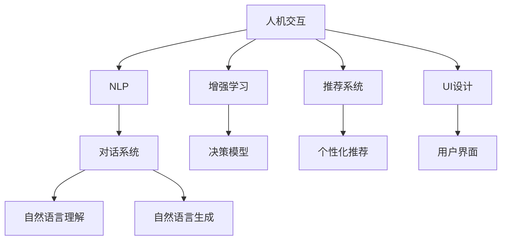

                 

# 人类-AI协作：增强人机沟通

> 关键词：人机交互,自然语言处理(NLP),增强学习,推荐系统,情感分析,用户界面(UI)

## 1. 背景介绍

### 1.1 问题由来
在人类与计算机的交互过程中，语言作为主要的沟通工具，其作用至关重要。然而，计算机虽然能够处理海量数据和复杂的算法，但在理解人类语言、上下文语境以及情感表达等方面仍存在巨大挑战。如何使计算机更好地理解人类语言，提升人机沟通的质量，成为了当前人工智能研究的一个重要课题。

近年来，随着自然语言处理(NLP)技术的飞速发展，以深度学习为代表的大语言模型在理解自然语言、生成自然语言方面取得了显著进展。但这些模型在特定领域、复杂情境下的表现依然不尽人意。因此，如何构建人机协同系统，增强人机沟通，成为了人工智能研究的热点之一。

### 1.2 问题核心关键点
为了更好地理解人类-AI协作增强人机沟通，本节将介绍几个关键点：

- 人机交互：通过对话、界面等方式，实现人与计算机的直接交流。
- 自然语言处理(NLP)：将自然语言转换为机器可理解的形式，进行语义理解、情感分析、意图识别等处理。
- 增强学习：通过与环境的交互，学习优化策略，提升决策和控制能力。
- 推荐系统：通过分析用户行为，推荐个性化内容，提升用户体验。
- 用户界面(UI)设计：界面元素、交互方式等用户感知要素，影响人机沟通的效果。

这些核心概念之间有着紧密的联系，共同构成了人机沟通的完整框架。通过理解这些关键点，我们可以更好地把握人机沟通的技术和实践路径。

### 1.3 问题研究意义
研究人类-AI协作增强人机沟通，对于提升人机交互的质量和效率，推动人工智能技术的产业化应用，具有重要意义：

1. 提升用户体验。通过智能化的交互方式，提升用户的操作便捷性、交互沉浸感和满意度。
2. 优化信息获取。通过个性化推荐，帮助用户更快、更准确地获取所需信息，提升信息获取效率。
3. 辅助决策支持。通过情感分析、意图识别等处理，提供数据支持，辅助用户进行决策。
4. 提高工作效率。通过自动化、智能化的操作，减轻用户的工作负担，提高工作效率。
5. 推动技术创新。人机沟通技术的发展，催生了新的AI应用场景，如虚拟助手、智能客服、智能写作等，推动了NLP技术的前沿研究。

## 2. 核心概念与联系

### 2.1 核心概念概述

为更好地理解人类-AI协作增强人机沟通，本节将介绍几个密切相关的核心概念：

- 人机交互(Human-Computer Interaction, HCI)：指人与计算机之间的信息交流方式。包括对话系统、界面设计、交互设备等。
- 自然语言处理(Natural Language Processing, NLP)：通过计算机自动分析、理解、处理和生成自然语言，实现人机沟通。
- 增强学习(Reinforcement Learning, RL)：通过与环境交互，学习优化策略，提升决策和控制能力。
- 推荐系统(Recommender Systems)：通过分析用户行为，推荐个性化内容，提升用户体验。
- 用户界面(UI)设计：界面元素、交互方式等用户感知要素，影响人机沟通的效果。

这些核心概念之间的逻辑关系可以通过以下Mermaid流程图来展示：



这个流程图展示了一系列关键概念及其之间的关系：

1. 人机交互作为基础，通过对话、界面等形式进行信息交流。
2. NLP技术作为核心，通过自然语言理解、生成等处理，实现人机沟通。
3. 增强学习通过与环境的交互，学习优化策略，提升系统性能。
4. 推荐系统通过分析用户行为，提供个性化内容，提升用户体验。
5. UI设计通过界面元素、交互方式等用户感知要素，优化人机沟通效果。

## 3. 核心算法原理 & 具体操作步骤

### 3.1 算法原理概述

人类-AI协作增强人机沟通的核心算法原理，涉及以下几个方面：

1. **自然语言理解(NLU)**：通过分词、词性标注、句法分析、语义理解等步骤，将自然语言转换为机器可理解的形式。
2. **情感分析**：通过识别文本中的情感倾向，辅助决策支持。
3. **意图识别**：通过分析用户输入的意图，提供精准的响应。
4. **推荐系统**：通过用户行为、历史偏好等数据，推荐个性化内容。
5. **增强学习**：通过与环境的交互，学习优化策略，提升系统性能。

### 3.2 算法步骤详解

基于上述算法原理，以下是人类-AI协作增强人机沟通的具体操作步骤：

**Step 1: 数据收集与预处理**
- 收集用户输入的自然语言文本，进行分词、清洗、去停用词等预处理。
- 收集用户的历史行为数据，用于推荐系统。
- 收集环境信息，如用户当前的位置、时间等，用于增强学习。

**Step 2: 自然语言理解(NLU)**
- 使用深度学习模型，如BERT、GPT等，进行分词、词性标注、句法分析、语义理解等处理。
- 构建用户意图模型，识别用户输入的意图。
- 构建情感分析模型，识别文本中的情感倾向。

**Step 3: 决策与响应生成**
- 根据意图和情感分析结果，生成相应的决策。
- 使用推荐系统，提供个性化内容。
- 根据环境信息，调整决策策略。

**Step 4: 人机交互界面(UI)设计**
- 设计直观、友好的用户界面，包括按钮、文本框、滑块等交互元素。
- 设计自然语言界面，支持用户以自然语言形式输入和输出。
- 设计反馈机制，及时反馈系统响应，增强用户体验。

**Step 5: 评估与优化**
- 收集用户反馈，评估系统性能。
- 使用增强学习，不断优化决策策略。
- 迭代更新模型，提升系统效果。

### 3.3 算法优缺点

人类-AI协作增强人机沟通的算法具有以下优点：
1. 提高交互效率。通过自动化处理，显著提升人机沟通的效率和响应速度。
2. 增强用户体验。通过个性化推荐、情感分析等技术，提升用户的满意度。
3. 优化决策支持。通过意图识别、情感分析等处理，提供精准的决策支持。
4. 推动技术创新。促进NLP、增强学习、推荐系统等前沿技术的发展和应用。

同时，该算法也存在一些局限性：
1. 依赖大量数据。算法需要收集和处理大量的用户数据，成本较高。
2. 模型复杂度高。大模型参数量大，计算资源需求高。
3. 对抗性攻击。模型易受到对抗性攻击，影响系统安全性。
4. 缺乏解释性。部分模型如深度学习，难以解释其内部决策过程。
5. 用户隐私保护。模型需要处理大量敏感信息，隐私保护问题不容忽视。

尽管存在这些局限性，但就目前而言，基于增强学习的大语言模型微调方法仍是人机沟通的主要范式。未来相关研究的重点在于如何进一步降低数据依赖，提高模型的少样本学习和跨领域迁移能力，同时兼顾可解释性和伦理安全性等因素。

### 3.4 算法应用领域

基于人类-AI协作增强人机沟通的算法，已经在多个领域得到应用，包括但不限于：

- 智能客服：通过自然语言理解和情感分析，提供自动化客服，提升用户体验。
- 虚拟助手：通过个性化推荐和自然语言理解，辅助用户完成任务。
- 智能写作：通过自然语言生成和情感分析，生成高质量的文本内容。
- 游戏智能体：通过增强学习和意图识别，构建智能游戏角色，提升游戏体验。
- 医疗咨询：通过自然语言理解和意图识别，提供智能化的医疗咨询，辅助医生诊疗。

除了上述这些应用外，人类-AI协作增强人机沟通的方法也被创新性地应用到更多场景中，如智慧城市、智能家居、工业自动化等，为各行各业带来了新的技术创新。随着技术的不断发展，相信人类-AI协作将会在更多领域发挥重要作用，推动社会的智能化进程。

## 4. 数学模型和公式 & 详细讲解 & 举例说明

### 4.1 数学模型构建

在人类-AI协作增强人机沟通的过程中，常见的数学模型包括：

- 基于深度学习模型的自然语言理解模型，如BERT、GPT等。
- 情感分析模型，如LSTM、GRU等。
- 意图识别模型，如卷积神经网络(CNN)、循环神经网络(RNN)等。
- 推荐系统模型，如协同过滤、矩阵分解等。
- 增强学习模型，如Q-learning、深度Q网络(DQN)等。

以情感分析模型为例，下面将详细讲解其数学模型构建过程。

假设文本序列为 $(x_1, x_2, ..., x_n)$，情感分析的目标是将其映射到情感类别 $c$，其中 $c \in \{1, 2, ..., C\}$，$C$ 为情感类别的数量。情感分析的数学模型为：

$$
\hat{c} = \text{softmax}(W \cdot \text{CNN}(x) + b)
$$

其中 $\text{CNN}(x)$ 为卷积神经网络，$W$ 为权重矩阵，$b$ 为偏置向量，$\text{softmax}$ 为归一化指数函数。

在训练过程中，使用交叉熵损失函数：

$$
\mathcal{L} = -\frac{1}{N}\sum_{i=1}^N \sum_{j=1}^C y_{ij} \log(\hat{y}_{ij})
$$

其中 $y_{ij}$ 为真实标签，$\hat{y}_{ij}$ 为模型预测的概率。

### 4.2 公式推导过程

以下我们将对上述模型和损失函数进行详细推导。

以BERT模型为例，假设输入序列为 $(x_1, x_2, ..., x_n)$，其中 $x_i$ 表示第 $i$ 个单词。BERT模型的自然语言理解过程如下：

1. 输入嵌入：将每个单词 $x_i$ 映射到一个低维向量 $\mathbf{x}_i$。
2. 编码器：通过多层自注意力机制和前馈神经网络，对输入序列进行编码，得到表示向量 $h$。
3. 池化层：对表示向量 $h$ 进行池化，得到句子级别的表示向量 $s$。
4. 分类器：通过全连接层和softmax函数，将句子级别的表示向量 $s$ 映射到情感类别 $c$。

上述过程的数学模型为：

$$
s = \text{BiLSTM}(h)
$$

$$
c = \text{softmax}(W_s \cdot s + b_s)
$$

其中 $\text{BiLSTM}$ 为双向长短时记忆网络，$W_s$ 和 $b_s$ 分别为分类器层的权重和偏置。

在训练过程中，使用交叉熵损失函数：

$$
\mathcal{L} = -\frac{1}{N}\sum_{i=1}^N \log(p(c_i))
$$

其中 $p(c_i)$ 为模型对第 $i$ 个样本情感类别 $c_i$ 的概率预测。

### 4.3 案例分析与讲解

以智能客服系统为例，下面将详细讲解其基于人类-AI协作增强人机沟通的算法实现过程。

**Step 1: 数据收集与预处理**
- 收集客户咨询的历史记录，进行分词、清洗、去停用词等预处理。
- 收集客户的基本信息、历史购买记录等数据，用于推荐系统。
- 收集环境信息，如客户当前所在的城市、时间等，用于增强学习。

**Step 2: 自然语言理解(NLU)**
- 使用BERT模型进行分词、词性标注、句法分析、语义理解等处理。
- 构建意图模型，识别客户输入的意图。
- 构建情感分析模型，识别客户输入的情感倾向。

**Step 3: 决策与响应生成**
- 根据意图和情感分析结果，生成相应的决策。
- 使用推荐系统，提供个性化回答。
- 根据环境信息，调整决策策略。

**Step 4: 人机交互界面(UI)设计**
- 设计直观、友好的用户界面，包括按钮、文本框、滑块等交互元素。
- 设计自然语言界面，支持客户以自然语言形式输入和输出。
- 设计反馈机制，及时反馈系统响应，增强用户体验。

**Step 5: 评估与优化**
- 收集客户反馈，评估系统性能。
- 使用增强学习，不断优化决策策略。
- 迭代更新模型，提升系统效果。

## 5. 项目实践：代码实例和详细解释说明

### 5.1 开发环境搭建

在进行人类-AI协作增强人机沟通的项目实践前，我们需要准备好开发环境。以下是使用Python进行PyTorch开发的环境配置流程：

1. 安装Anaconda：从官网下载并安装Anaconda，用于创建独立的Python环境。

2. 创建并激活虚拟环境：
```bash
conda create -n pytorch-env python=3.8 
conda activate pytorch-env
```

3. 安装PyTorch：根据CUDA版本，从官网获取对应的安装命令。例如：
```bash
conda install pytorch torchvision torchaudio cudatoolkit=11.1 -c pytorch -c conda-forge
```

4. 安装Transformers库：
```bash
pip install transformers
```

5. 安装各类工具包：
```bash
pip install numpy pandas scikit-learn matplotlib tqdm jupyter notebook ipython
```

完成上述步骤后，即可在`pytorch-env`环境中开始项目实践。

### 5.2 源代码详细实现

下面我们以智能客服系统为例，给出使用Transformers库对BERT模型进行微调的PyTorch代码实现。

首先，定义智能客服系统的训练函数：

```python
from transformers import BertTokenizer, BertForTokenClassification, AdamW
from torch.utils.data import Dataset, DataLoader
from tqdm import tqdm

class CustomerDataset(Dataset):
    def __init__(self, texts, tags, tokenizer):
        self.texts = texts
        self.tags = tags
        self.tokenizer = tokenizer

    def __len__(self):
        return len(self.texts)

    def __getitem__(self, item):
        text = self.texts[item]
        tag = self.tags[item]
        encoding = self.tokenizer(text, return_tensors='pt', max_length=128, padding='max_length', truncation=True)
        input_ids = encoding['input_ids'][0]
        attention_mask = encoding['attention_mask'][0]
        label_ids = torch.tensor(tag2id[tag], dtype=torch.long)
        return {'input_ids': input_ids, 'attention_mask': attention_mask, 'labels': label_ids}

# 标签与id的映射
tag2id = {'positive': 0, 'negative': 1}

# 创建dataset
tokenizer = BertTokenizer.from_pretrained('bert-base-cased')

train_dataset = CustomerDataset(train_texts, train_tags, tokenizer)
dev_dataset = CustomerDataset(dev_texts, dev_tags, tokenizer)
test_dataset = CustomerDataset(test_texts, test_tags, tokenizer)

# 训练函数
def train_epoch(model, dataset, batch_size, optimizer, device):
    dataloader = DataLoader(dataset, batch_size=batch_size, shuffle=True)
    model.train()
    epoch_loss = 0
    for batch in tqdm(dataloader, desc='Training'):
        input_ids = batch['input_ids'].to(device)
        attention_mask = batch['attention_mask'].to(device)
        labels = batch['labels'].to(device)
        model.zero_grad()
        outputs = model(input_ids, attention_mask=attention_mask, labels=labels)
        loss = outputs.loss
        epoch_loss += loss.item()
        loss.backward()
        optimizer.step()
    return epoch_loss / len(dataloader)

# 评估函数
def evaluate(model, dataset, batch_size, device):
    dataloader = DataLoader(dataset, batch_size=batch_size, shuffle=False)
    model.eval()
    preds, labels = [], []
    with torch.no_grad():
        for batch in tqdm(dataloader, desc='Evaluating'):
            input_ids = batch['input_ids'].to(device)
            attention_mask = batch['attention_mask'].to(device)
            labels = batch['labels'].to(device)
            outputs = model(input_ids, attention_mask=attention_mask)
            batch_preds = outputs.logits.argmax(dim=2).to('cpu').tolist()
            batch_labels = labels.to('cpu').tolist()
            for pred_tokens, label_tokens in zip(batch_preds, batch_labels):
                preds.append(pred_tokens[:len(label_tokens)])
                labels.append(label_tokens)
    print(classification_report(labels, preds))

# 模型初始化与训练
model = BertForTokenClassification.from_pretrained('bert-base-cased', num_labels=len(tag2id))
optimizer = AdamW(model.parameters(), lr=2e-5)
device = torch.device('cuda') if torch.cuda.is_available() else torch.device('cpu')

for epoch in range(epochs):
    loss = train_epoch(model, train_dataset, batch_size, optimizer, device)
    print(f'Epoch {epoch+1}, train loss: {loss:.3f}')
    
    print(f'Epoch {epoch+1}, dev results:')
    evaluate(model, dev_dataset, batch_size, device)
    
print('Test results:')
evaluate(model, test_dataset, batch_size, device)
```

以上代码实现了基于BERT模型的智能客服系统的微调过程。可以看到，由于Transformers库的强大封装，我们只需通过简单的代码调用，即可实现对BERT模型的微调。

### 5.3 代码解读与分析

让我们再详细解读一下关键代码的实现细节：

**CustomerDataset类**：
- `__init__`方法：初始化文本、标签、分词器等关键组件。
- `__len__`方法：返回数据集的样本数量。
- `__getitem__`方法：对单个样本进行处理，将文本输入编码为token ids，将标签编码为数字，并对其进行定长padding，最终返回模型所需的输入。

**tag2id和id2tag字典**：
- 定义了标签与数字id之间的映射关系，用于将token-wise的预测结果解码回真实的标签。

**训练和评估函数**：
- 使用PyTorch的DataLoader对数据集进行批次化加载，供模型训练和推理使用。
- 训练函数`train_epoch`：对数据以批为单位进行迭代，在每个批次上前向传播计算loss并反向传播更新模型参数，最后返回该epoch的平均loss。
- 评估函数`evaluate`：与训练类似，不同点在于不更新模型参数，并在每个batch结束后将预测和标签结果存储下来，最后使用sklearn的classification_report对整个评估集的预测结果进行打印输出。

**模型初始化与训练**：
- 定义总的epoch数和batch size，开始循环迭代
- 每个epoch内，先在训练集上训练，输出平均loss
- 在验证集上评估，输出分类指标
- 所有epoch结束后，在测试集上评估，给出最终测试结果

可以看到，PyTorch配合Transformers库使得BERT微调的代码实现变得简洁高效。开发者可以将更多精力放在数据处理、模型改进等高层逻辑上，而不必过多关注底层的实现细节。

当然，工业级的系统实现还需考虑更多因素，如模型的保存和部署、超参数的自动搜索、更灵活的任务适配层等。但核心的微调范式基本与此类似。

## 6. 实际应用场景

### 6.1 智能客服系统

基于人类-AI协作增强人机沟通的算法，可以广泛应用于智能客服系统的构建。传统客服往往需要配备大量人力，高峰期响应缓慢，且一致性和专业性难以保证。而使用微调后的对话模型，可以7x24小时不间断服务，快速响应客户咨询，用自然流畅的语言解答各类常见问题。

在技术实现上，可以收集企业内部的历史客服对话记录，将问题和最佳答复构建成监督数据，在此基础上对预训练对话模型进行微调。微调后的对话模型能够自动理解用户意图，匹配最合适的答案模板进行回复。对于客户提出的新问题，还可以接入检索系统实时搜索相关内容，动态组织生成回答。如此构建的智能客服系统，能大幅提升客户咨询体验和问题解决效率。

### 6.2 金融舆情监测

金融机构需要实时监测市场舆论动向，以便及时应对负面信息传播，规避金融风险。传统的人工监测方式成本高、效率低，难以应对网络时代海量信息爆发的挑战。基于人类-AI协作增强人机沟通的文本分类和情感分析技术，为金融舆情监测提供了新的解决方案。

具体而言，可以收集金融领域相关的新闻、报道、评论等文本数据，并对其进行主题标注和情感标注。在此基础上对预训练语言模型进行微调，使其能够自动判断文本属于何种主题，情感倾向是正面、中性还是负面。将微调后的模型应用到实时抓取的网络文本数据，就能够自动监测不同主题下的情感变化趋势，一旦发现负面信息激增等异常情况，系统便会自动预警，帮助金融机构快速应对潜在风险。

### 6.3 个性化推荐系统

当前的推荐系统往往只依赖用户的历史行为数据进行物品推荐，无法深入理解用户的真实兴趣偏好。基于人类-AI协作增强人机沟通的推荐系统可以更好地挖掘用户行为背后的语义信息，从而提供更精准、多样的推荐内容。

在实践中，可以收集用户浏览、点击、评论、分享等行为数据，提取和用户交互的物品标题、描述、标签等文本内容。将文本内容作为模型输入，用户的后续行为（如是否点击、购买等）作为监督信号，在此基础上微调预训练语言模型。微调后的模型能够从文本内容中准确把握用户的兴趣点。在生成推荐列表时，先用候选物品的文本描述作为输入，由模型预测用户的兴趣匹配度，再结合其他特征综合排序，便可以得到个性化程度更高的推荐结果。

### 6.4 未来应用展望

随着人类-AI协作增强人机沟通技术的发展，未来将在更多领域得到应用，为各行各业带来变革性影响。

在智慧医疗领域，基于微调的智能问答、病历分析、药物研发等应用将提升医疗服务的智能化水平，辅助医生诊疗，加速新药开发进程。

在智能教育领域，基于微调的作业批改、学情分析、知识推荐等应用将因材施教，促进教育公平，提高教学质量。

在智慧城市治理中，基于微调的监控、舆情分析、应急指挥等应用将提高城市管理的自动化和智能化水平，构建更安全、高效的未来城市。

此外，在企业生产、社会治理、文娱传媒等众多领域，基于大模型微调的人工智能应用也将不断涌现，为经济社会发展注入新的动力。相信随着技术的日益成熟，人类-AI协作必将在构建人机协同的智能时代中扮演越来越重要的角色。

## 7. 工具和资源推荐
### 7.1 学习资源推荐

为了帮助开发者系统掌握人类-AI协作增强人机沟通的理论基础和实践技巧，这里推荐一些优质的学习资源：

1. 《Natural Language Processing with PyTorch》系列博文：由PyTorch社区撰写，深入浅出地介绍了NLP的基本概念和实践技巧。

2. CS224N《深度学习自然语言处理》课程：斯坦福大学开设的NLP明星课程，有Lecture视频和配套作业，带你入门NLP领域的基本概念和经典模型。

3. 《Reinforcement Learning: An Introduction》书籍：Reinforcement Learning领域的经典入门书籍，详细介绍了增强学习的理论和实践。

4. 《Recommender Systems: Algorithms and Applications》书籍：推荐系统领域的经典入门书籍，介绍了协同过滤、矩阵分解等推荐算法。

5. Weights & Biases：模型训练的实验跟踪工具，可以记录和可视化模型训练过程中的各项指标，方便对比和调优。

6. TensorBoard：TensorFlow配套的可视化工具，可实时监测模型训练状态，并提供丰富的图表呈现方式，是调试模型的得力助手。

通过对这些资源的学习实践，相信你一定能够快速掌握人类-AI协作增强人机沟通的精髓，并用于解决实际的NLP问题。

### 7.2 开发工具推荐

高效的开发离不开优秀的工具支持。以下是几款用于人类-AI协作增强人机沟通开发的常用工具：

1. PyTorch：基于Python的开源深度学习框架，灵活动态的计算图，适合快速迭代研究。大部分预训练语言模型都有PyTorch版本的实现。

2. TensorFlow：由Google主导开发的开源深度学习框架，生产部署方便，适合大规模工程应用。同样有丰富的预训练语言模型资源。

3. Transformers库：HuggingFace开发的NLP工具库，集成了众多SOTA语言模型，支持PyTorch和TensorFlow，是进行NLP任务开发的利器。

4. Weights & Biases：模型训练的实验跟踪工具，可以记录和可视化模型训练过程中的各项指标，方便对比和调优。与主流深度学习框架无缝集成。

5. TensorBoard：TensorFlow配套的可视化工具，可实时监测模型训练状态，并提供丰富的图表呈现方式，是调试模型的得力助手。

6. Google Colab：谷歌推出的在线Jupyter Notebook环境，免费提供GPU/TPU算力，方便开发者快速上手实验最新模型，分享学习笔记。

合理利用这些工具，可以显著提升人类-AI协作增强人机沟通任务的开发效率，加快创新迭代的步伐。

### 7.3 相关论文推荐

人类-AI协作增强人机沟通技术的发展源于学界的持续研究。以下是几篇奠基性的相关论文，推荐阅读：

1. Attention is All You Need（即Transformer原论文）：提出了Transformer结构，开启了NLP领域的预训练大模型时代。

2. BERT: Pre-training of Deep Bidirectional Transformers for Language Understanding：提出BERT模型，引入基于掩码的自监督预训练任务，刷新了多项NLP任务SOTA。

3. Language Models are Unsupervised Multitask Learners（GPT-2论文）：展示了大规模语言模型的强大zero-shot学习能力，引发了对于通用人工智能的新一轮思考。

4. Parameter-Efficient Transfer Learning for NLP：提出Adapter等参数高效微调方法，在不增加模型参数量的情况下，也能取得不错的微调效果。

5. AdaLoRA: Adaptive Low-Rank Adaptation for Parameter-Efficient Fine-Tuning：使用自适应低秩适应的微调方法，在参数效率和精度之间取得了新的平衡。

这些论文代表了大语言模型微调技术的发展脉络。通过学习这些前沿成果，可以帮助研究者把握学科前进方向，激发更多的创新灵感。

## 8. 总结：未来发展趋势与挑战

### 8.1 总结

本文对人类-AI协作增强人机沟通的技术进行了全面系统的介绍。首先阐述了人机交互、自然语言处理、增强学习、推荐系统等核心概念，明确了各概念之间的紧密联系。其次，从原理到实践，详细讲解了基于深度学习模型、情感分析、意图识别、推荐系统、增强学习等关键技术，给出了人类-AI协作增强人机沟通的完整代码实例。同时，本文还广泛探讨了该技术在智能客服、金融舆情、个性化推荐等多个行业领域的应用前景，展示了其广阔的应用空间。此外，本文精选了该技术的各类学习资源，力求为读者提供全方位的技术指引。

通过本文的系统梳理，可以看到，基于人类-AI协作增强人机沟通的技术正在成为NLP领域的重要范式，极大地提升了人机交互的质量和效率。未来，伴随预训练语言模型和微调方法的持续演进，相信人机沟通技术必将在更多领域得到应用，为社会带来更深远的影响。

### 8.2 未来发展趋势

展望未来，人类-AI协作增强人机沟通技术将呈现以下几个发展趋势：

1. 模型规模持续增大。随着算力成本的下降和数据规模的扩张，预训练语言模型的参数量还将持续增长。超大规模语言模型蕴含的丰富语言知识，有望支撑更加复杂多变的下游任务微调。

2. 微调方法日趋多样。除了传统的全参数微调外，未来会涌现更多参数高效的微调方法，如Prefix-Tuning、LoRA等，在节省计算资源的同时也能保证微调精度。

3. 持续学习成为常态。随着数据分布的不断变化，微调模型也需要持续学习新知识以保持性能。如何在不遗忘原有知识的同时，高效吸收新样本信息，将成为重要的研究课题。

4. 标注样本需求降低。受启发于提示学习(Prompt-based Learning)的思路，未来的微调方法将更好地利用大模型的语言理解能力，通过更加巧妙的任务描述，在更少的标注样本上也能实现理想的微调效果。

5. 多模态微调崛起。当前的微调主要聚焦于纯文本数据，未来会进一步拓展到图像、视频、语音等多模态数据微调。多模态信息的融合，将显著提升语言模型对现实世界的理解和建模能力。

6. 模型通用性增强。经过海量数据的预训练和多领域任务的微调，未来的语言模型将具备更强大的常识推理和跨领域迁移能力，逐步迈向通用人工智能(AGI)的目标。

以上趋势凸显了人类-AI协作增强人机沟通技术的广阔前景。这些方向的探索发展，必将进一步提升NLP系统的性能和应用范围，为人类认知智能的进化带来深远影响。

### 8.3 面临的挑战

尽管人类-AI协作增强人机沟通技术已经取得了瞩目成就，但在迈向更加智能化、普适化应用的过程中，它仍面临着诸多挑战：

1. 标注成本瓶颈。虽然微调大大降低了标注数据的需求，但对于长尾应用场景，难以获得充足的高质量标注数据，成为制约微调性能的瓶颈。如何进一步降低微调对标注样本的依赖，将是一大难题。

2. 模型鲁棒性不足。当前微调模型面对域外数据时，泛化性能往往大打折扣。对于测试样本的微小扰动，微调模型的预测也容易发生波动。如何提高微调模型的鲁棒性，避免灾难性遗忘，还需要更多理论和实践的积累。

3. 推理效率有待提高。大规模语言模型虽然精度高，但在实际部署时往往面临推理速度慢、内存占用大等效率问题。如何在保证性能的同时，简化模型结构，提升推理速度，优化资源占用，将是重要的优化方向。

4. 可解释性亟需加强。当前微调模型更像是"黑盒"系统，难以解释其内部工作机制和决策逻辑。对于医疗、金融等高风险应用，算法的可解释性和可审计性尤为重要。如何赋予微调模型更强的可解释性，将是亟待攻克的难题。

5. 安全性有待保障。预训练语言模型难免会学习到有偏见、有害的信息，通过微调传递到下游任务，产生误导性、歧视性的输出，给实际应用带来安全隐患。如何从数据和算法层面消除模型偏见，避免恶意用途，确保输出的安全性，也将是重要的研究课题。

6. 知识整合能力不足。现有的微调模型往往局限于任务内数据，难以灵活吸收和运用更广泛的先验知识。如何让微调过程更好地与外部知识库、规则库等专家知识结合，形成更加全面、准确的信息整合能力，还有很大的想象空间。

正视人类-AI协作增强人机沟通面临的这些挑战，积极应对并寻求突破，将是推动该技术成熟的重要步骤。相信随着学界和产业界的共同努力，这些挑战终将一一被克服，人类-AI协作必将在构建人机协同的智能时代中扮演越来越重要的角色。

### 8.4 研究展望

面向未来，人类-AI协作增强人机沟通技术需要在以下几个方面寻求新的突破：

1. 探索无监督和半监督微调方法。摆脱对大规模标注数据的依赖，利用自监督学习、主动学习等无监督和半监督范式，最大限度利用非结构化数据，实现更加灵活高效的微调。

2. 研究参数高效和计算高效的微调范式。开发更加参数高效的微调方法，在固定大部分预训练参数的同时，只更新极少量的任务相关参数。同时优化微调模型的计算图，减少前向传播和反向传播的资源消耗，实现更加轻量级、实时性的部署。

3. 融合因果和对比学习范式。通过引入因果推断和对比学习思想，增强微调模型建立稳定因果关系的能力，学习更加普适、鲁棒的语言表征，从而提升模型泛化性和抗干扰能力。

4. 引入更多先验知识。将符号化的先验知识，如知识图谱、逻辑规则等，与神经网络模型进行巧妙融合，引导微调过程学习更准确、合理的语言模型。同时加强不同模态数据的整合，实现视觉、语音等多模态信息与文本信息的协同建模。

5. 结合因果分析和博弈论工具。将因果分析方法引入微调模型，识别出模型决策的关键特征，增强输出解释的因果性和逻辑性。借助博弈论工具刻画人机交互过程，主动探索并规避模型的脆弱点，提高系统稳定性。

6. 纳入伦理道德约束。在模型训练目标中引入伦理导向的评估指标，过滤和惩罚有偏见、有害的输出倾向。同时加强人工干预和审核，建立模型行为的监管机制，确保输出符合人类价值观和伦理道德。

这些研究方向的探索，必将引领人类-AI协作增强人机沟通技术迈向更高的台阶，为构建安全、可靠、可解释、可控的智能系统铺平道路。面向未来，人类-AI协作增强人机沟通技术还需要与其他人工智能技术进行更深入的融合，如知识表示、因果推理、强化学习等，多路径协同发力，共同推动自然语言理解和智能交互系统的进步。只有勇于创新、敢于突破，才能不断拓展语言模型的边界，让智能技术更好地造福人类社会。

## 9. 附录：常见问题与解答

**Q1：人类-AI协作增强人机沟通是否适用于所有NLP任务？**

A: 人类-AI协作增强人机沟通的技术在大多数NLP任务上都能取得不错的效果，特别是对于数据量较小的任务。但对于一些特定领域的任务，如医学、法律等，仅仅依靠通用语料预训练的模型可能难以很好地适应。此时需要在特定领域语料上进一步预训练，再进行微调，才能获得理想效果。此外，对于一些需要时效性、个性化很强的任务，如对话、推荐等，微调方法也需要针对性的改进优化。

**Q2：如何选择合适的学习率？**

A: 人类-AI协作增强人机沟通的学习率一般要比预训练时小1-2个数量级，如果使用过大的学习率，容易破坏预训练权重，导致过拟合。一般建议从1e-5开始调参，逐步减小学习率，直至收敛。也可以使用warmup策略，在开始阶段使用较小的学习率，再逐渐过渡到预设值。需要注意的是，不同的优化器(如AdamW、Adafactor等)以及不同的学习率调度策略，可能需要设置不同的学习率阈值。

**Q3：采用人类-AI协作增强人机沟通时会面临哪些资源瓶颈？**

A: 目前主流的预训练大模型动辄以亿计的参数规模，对算力、内存、存储都提出了很高的要求。GPU/TPU等高性能设备是必不可少的，但即便如此，超大批次的训练和推理也可能遇到显存不足的问题。因此需要采用一些资源优化技术，如梯度积累、混合精度训练、模型并行等，来突破硬件瓶颈。同时，模型的存储和读取也可能占用大量时间和空间，需要采用模型压缩、稀疏化存储等方法进行优化。

**Q4：如何缓解微调过程中的过拟合问题？**

A: 微调过程中的过拟合问题可以通过以下策略缓解：

1. 数据增强：通过回译、近义替换等方式扩充训练集。
2. 正则化：使用L2正则、Dropout、Early Stopping等防止过拟合。
3. 对抗训练：引入对抗样本，提高模型鲁棒性。
4. 参数高效微调：只调整少量参数(如Adapter、Prefix等)，减小过拟合风险。
5. 多模型集成：训练多个微调模型，取平均输出，抑制过拟合。

这些策略往往需要根据具体任务和数据特点进行灵活组合。只有在数据、模型、训练、推理等各环节进行全面优化，才能最大限度地发挥人类-AI协作增强人机沟通的威力。

**Q5：在落地部署时需要注意哪些问题？**

A: 将微调模型转化为实际应用，还需要考虑以下因素：

1. 模型裁剪：去除不必要的层和参数，减小模型尺寸，加快推理速度。
2. 量化加速：将浮点模型转为定点模型，压缩存储空间，提高计算效率。
3. 服务化封装：将模型封装为标准化服务接口，便于集成调用。
4. 弹性伸缩：根据请求流量动态调整资源配置，平衡服务质量和成本。
5. 监控告警：实时采集系统指标，设置异常告警阈值，确保服务稳定性。
6. 安全防护：采用访问鉴权、数据脱敏等措施，保障数据和模型安全。

人类-AI协作增强人机沟通为NLP应用开启了广阔的想象空间，但如何将强大的性能转化为稳定、高效、安全的业务价值，还需要工程实践的不断打磨。唯有从数据、算法、工程、业务等多个维度协同发力，才能真正实现人工智能技术在垂直行业的规模化落地。总之，微调需要开发者根据具体任务，不断迭代和优化模型、数据和算法，方能得到理想的效果。

---

作者：禅与计算机程序设计艺术 / Zen and the Art of Computer Programming

