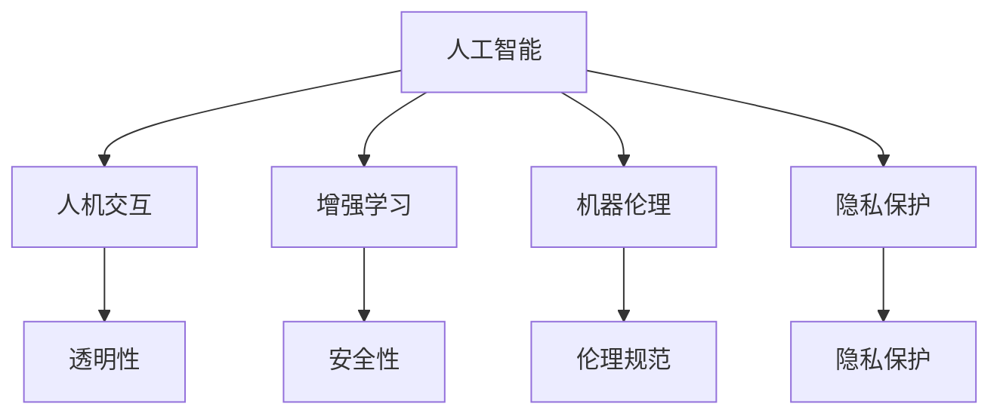

                 

# 人类-AI协作：增强人类与AI之间的互信

> 关键词：人工智能,人类与AI协作,互信,人机交互,增强学习,机器伦理,隐私保护

## 1. 背景介绍

### 1.1 问题由来
随着人工智能（AI）技术的飞速发展，AI已经逐步从实验室走向现实世界的各个角落，从金融到医疗，从教育到交通，从制造业到服务业，AI的触角正以惊人的速度扩展。然而，AI的广泛应用也引发了人类对AI技术的信任度、安全性、隐私保护等问题的深入思考。如何在增强AI能力的同时，确保AI的透明性、可解释性和伦理性，成为AI领域的重要研究方向。

### 1.2 问题核心关键点
增强人类与AI之间的互信，意味着提升公众对AI技术的信任度、理解和接受度，同时确保AI在应用过程中遵循伦理规范、保护隐私安全。这涉及多个层面的问题，包括但不限于：

1. **透明性**：AI决策过程的可解释性，使人类能够理解和信任AI的行为。
2. **安全性**：AI系统的稳定性和鲁棒性，避免因故障或攻击导致重大损失。
3. **隐私保护**：AI处理个人数据时的隐私保护措施，确保数据不被滥用或泄露。
4. **伦理规范**：AI应用的伦理约束，确保AI行为符合人类的价值观和社会规范。

### 1.3 问题研究意义
增强人类与AI之间的互信，不仅关乎AI技术的成功落地应用，也关乎社会整体的数字化转型进程。通过建立信任，可以释放更多的社会资源，推动AI技术在各个领域的深入应用，促进经济社会的全面发展。

## 2. 核心概念与联系

### 2.1 核心概念概述

为更好地理解如何增强人类与AI之间的互信，本节将介绍几个密切相关的核心概念：

- **人工智能**：使用算法和计算资源模拟人类智能的技术，涵盖从机器学习、深度学习、自然语言处理到计算机视觉等多个领域。
- **人机交互**：人类与AI系统之间的交互方式，包括语言交互、图像识别、语音识别、手势识别等。
- **增强学习**：一种通过试错方式优化决策策略的机器学习方法，使AI能够在多变的环境中自主学习和适应。
- **机器伦理**：研究AI系统的伦理属性，包括公平性、透明度、责任归属等，确保AI行为符合人类价值观。
- **隐私保护**：保护个人数据和隐私信息，防止未经授权的访问和使用。

这些核心概念之间的逻辑关系可以通过以下Mermaid流程图来展示：



这个流程图展示了一些核心概念及其之间的关系：

1. 人工智能通过人机交互技术获取输入，进行学习和决策。
2. 增强学习使AI系统能够在不断反馈中优化策略，提升性能。
3. 机器伦理研究如何使AI行为符合人类的价值观和社会规范。
4. 隐私保护措施确保数据安全，防止数据滥用和泄露。
5. 透明性、安全性、伦理规范等属性，共同构成AI系统的全面性能。

## 3. 核心算法原理 & 具体操作步骤
### 3.1 算法原理概述

增强人类与AI之间的互信，本质上是一个多学科交叉的研究问题，涉及计算机科学、认知科学、伦理学、隐私保护等多个领域。其核心思想是：通过技术手段和制度设计，增强AI系统的透明性、可解释性、安全性，同时遵循伦理规范，确保AI行为符合人类社会的价值观。

形式化地，假设一个AI系统 $S$ 用于处理任务 $T$，其行为由模型 $M$ 和算法 $A$ 决定。增强互信的过程可以分为以下几个步骤：

1. **数据获取与处理**：收集与任务相关的数据，并对数据进行清洗和预处理。
2. **模型训练与优化**：使用增强学习等技术训练模型 $M$，优化算法 $A$，提升系统性能。
3. **可解释性增强**：引入可解释性算法，如LIME、SHAP等，解释AI的决策过程。
4. **安全与鲁棒性提升**：应用对抗训练、鲁棒性测试等技术，确保系统安全性。
5. **隐私保护与合规性**：采用隐私保护技术，确保数据隐私，遵循相关法律法规。
6. **伦理与道德审查**：引入伦理审查机制，确保AI行为符合伦理规范。

### 3.2 算法步骤详解

增强人类与AI之间的互信，可以通过以下步骤实现：

**Step 1: 数据获取与处理**
- 收集与任务相关的数据集，包括训练数据、验证数据和测试数据。
- 对数据进行清洗、标注和预处理，确保数据的质量和多样性。

**Step 2: 模型训练与优化**
- 使用增强学习算法，如REINFORCE、PPO等，训练模型 $M$ 和算法 $A$。
- 使用验证集评估模型性能，调整超参数，优化算法 $A$。
- 使用测试集验证模型的最终性能。

**Step 3: 可解释性增强**
- 引入可解释性算法，如LIME、SHAP等，生成AI决策的解释图。
- 在用户界面或报告中展示这些解释图，增强用户对AI决策的理解。

**Step 4: 安全与鲁棒性提升**
- 应用对抗训练、鲁棒性测试等技术，提升模型的鲁棒性和安全性。
- 定期进行安全审计，确保系统在面对攻击和异常情况时仍然稳定。

**Step 5: 隐私保护与合规性**
- 采用隐私保护技术，如差分隐私、联邦学习等，确保数据隐私。
- 遵循相关法律法规，如GDPR、CCPA等，确保数据使用合规。

**Step 6: 伦理与道德审查**
- 引入伦理审查机制，对AI行为进行伦理评估。
- 建立伦理委员会，定期审查AI系统的行为，确保其符合社会价值观。

### 3.3 算法优缺点

增强人类与AI之间的互信，具有以下优点：
1. 提高用户信任度：通过透明的决策过程和可解释的输出，使用户更加信任AI系统。
2. 增强系统安全性：通过鲁棒性测试和对抗训练，提升系统安全性，减少因故障或攻击导致的风险。
3. 确保数据隐私：通过隐私保护技术，确保数据不被滥用或泄露，保护用户隐私。
4. 符合伦理规范：通过伦理审查机制，确保AI行为符合社会价值观和法律法规。

同时，该方法也存在一定的局限性：
1. 技术复杂度高：需要同时考虑多个维度的优化，技术和算法实现难度较大。
2. 时间和成本高：增强互信需要大量的数据和计算资源，涉及多个环节的优化和测试。
3. 伦理规范难以量化：伦理审查主观性强，难以通过客观指标进行量化评估。

尽管存在这些局限性，但就目前而言，增强人类与AI之间的互信，仍是AI系统应用过程中不可或缺的重要环节。未来相关研究的重点在于如何进一步简化互信增强的技术实现，提高互信评估的可量化性，同时兼顾系统的安全性、隐私保护和伦理规范等多方面要求。

### 3.4 算法应用领域

增强人类与AI之间的互信，在多个领域都有广泛的应用：

- **医疗健康**：在医疗诊断和治疗过程中，确保AI系统的透明性和可解释性，保护患者隐私，符合医疗伦理。
- **金融科技**：在金融交易和风险管理中，确保AI系统的安全性和合规性，保护用户资金安全。
- **自动驾驶**：在自动驾驶系统中，确保AI系统的鲁棒性和伦理性，保护行人安全，遵守交通规则。
- **教育培训**：在教育推荐和学习过程中，确保AI系统的公平性和透明度，保护学生隐私，符合教育伦理。
- **环境保护**：在环境监测和智能农业中，确保AI系统的准确性和安全性，保护生态平衡，符合环保伦理。

## 4. 数学模型和公式 & 详细讲解 & 举例说明

### 4.1 数学模型构建

增强人类与AI之间的互信，涉及到多个学科的知识和技能，包括数学、统计学、计算机科学等。其核心思想是：通过数学模型和算法，提升AI系统的透明性、可解释性和安全性。

假设一个AI系统 $S$ 用于处理任务 $T$，其决策函数为 $f(x)$，其中 $x$ 为输入，$f(x)$ 为输出。增强互信的过程可以分为以下几个步骤：

1. **透明性增强**：通过可解释性算法，生成解释图，解释决策函数的特征。
2. **安全性提升**：通过对抗训练，生成对抗样本，测试系统的鲁棒性。
3. **隐私保护**：通过差分隐私，生成扰动数据，保护用户隐私。
4. **伦理规范**：通过伦理审查机制，确保AI行为符合社会价值观和法律法规。

### 4.2 公式推导过程

以下是一些关键公式的推导过程：

**可解释性增强**：
假设决策函数为 $f(x)$，其中 $x$ 为输入，$y$ 为输出。引入LIME算法生成局部可解释模型，记为 $L(x)$，其输出为 $L(x) = \{\mathbf{w},\mathbf{b}\}$，其中 $\mathbf{w}$ 为权重向量，$\mathbf{b}$ 为偏置。LIME的优化目标为：

$$
\min_{\mathbf{w},\mathbf{b}} \sum_{i=1}^N \mathcal{L}(f(x_i),L(x_i))
$$

其中 $\mathcal{L}$ 为损失函数，$N$ 为数据样本数。

**安全性提升**：
假设模型 $f(x)$ 面临对抗样本 $\mathbf{x}'$，其目标为生成对抗样本 $x' = x+\delta$，使得 $f(x') \neq f(x)$。引入对抗训练算法，如FGSM、PGD等，优化对抗样本 $\delta$，其目标为：

$$
\min_{\delta} \mathcal{L}(f(x+\delta),y)
$$

其中 $\mathcal{L}$ 为损失函数，$y$ 为目标标签。

**隐私保护**：
假设原始数据集为 $D=\{(x_i,y_i)\}_{i=1}^N$，引入差分隐私技术，生成扰动数据集 $D'$，其目标为：

$$
\min_{\delta} \mathcal{L}(f(D+\delta),f(D))
$$

其中 $\mathcal{L}$ 为损失函数，$f(D)$ 为模型在数据集 $D$ 上的输出，$f(D+\delta)$ 为模型在扰动数据集 $D'$ 上的输出。

**伦理规范**：
假设AI系统 $S$ 的行为编码为 $a$，引入伦理审查机制，评估行为 $a$ 的伦理得分 $E(a)$，其目标为：

$$
\max_{a} E(a)
$$

其中 $E(a)$ 为伦理得分，$S$ 的行为编码为 $a$。

### 4.3 案例分析与讲解

**医疗健康**：
在医疗诊断和治疗过程中，AI系统需要处理大量的患者数据，包括病历、影像、基因信息等。为了增强互信，可以通过以下步骤：

1. **数据获取与处理**：收集与任务相关的医疗数据，对数据进行清洗和预处理。
2. **模型训练与优化**：使用深度学习算法训练AI模型，优化算法，提升系统性能。
3. **可解释性增强**：引入可解释性算法，生成决策解释图，增强用户对AI诊断的理解。
4. **安全与鲁棒性提升**：应用对抗训练技术，提升模型的鲁棒性，确保诊断准确性。
5. **隐私保护与合规性**：采用差分隐私技术，保护患者隐私，遵循相关法律法规。
6. **伦理与道德审查**：引入伦理审查机制，确保AI诊断符合医疗伦理规范。

**金融科技**：
在金融交易和风险管理中，AI系统需要处理大量的交易数据和客户信息。为了增强互信，可以通过以下步骤：

1. **数据获取与处理**：收集与任务相关的交易数据和客户信息，对数据进行清洗和预处理。
2. **模型训练与优化**：使用增强学习算法训练AI模型，优化算法，提升系统性能。
3. **可解释性增强**：引入可解释性算法，生成决策解释图，增强用户对AI推荐的理解。
4. **安全与鲁棒性提升**：应用对抗训练技术，提升模型的鲁棒性，确保交易安全。
5. **隐私保护与合规性**：采用隐私保护技术，保护客户隐私，遵循相关法律法规。
6. **伦理与道德审查**：引入伦理审查机制，确保AI交易符合金融伦理规范。

## 5. 项目实践：代码实例和详细解释说明
### 5.1 开发环境搭建

在进行互信增强实践前，我们需要准备好开发环境。以下是使用Python进行TensorFlow开发的环境配置流程：

1. 安装Anaconda：从官网下载并安装Anaconda，用于创建独立的Python环境。

2. 创建并激活虚拟环境：
```bash
conda create -n tf-env python=3.8 
conda activate tf-env
```

3. 安装TensorFlow：根据CUDA版本，从官网获取对应的安装命令。例如：
```bash
conda install tensorflow -c pytorch -c conda-forge
```

4. 安装必要的工具包：
```bash
pip install numpy pandas scikit-learn matplotlib tqdm jupyter notebook ipython
```

完成上述步骤后，即可在`tf-env`环境中开始互信增强实践。

### 5.2 源代码详细实现

这里我们以医疗诊断任务为例，给出使用TensorFlow对深度学习模型进行互信增强的PyTorch代码实现。

首先，定义医疗诊断任务的数据处理函数：

```python
from tensorflow.keras.preprocessing import image
from tensorflow.keras.preprocessing.text import Tokenizer, sequence
import numpy as np

class MedicalDataset(Dataset):
    def __init__(self, x_train, y_train, x_test, y_test):
        self.x_train = x_train
        self.y_train = y_train
        self.x_test = x_test
        self.y_test = y_test
        
        self.tokenizer = Tokenizer(num_words=10000, oov_token='<OOV>')
        self.tokenizer.fit_on_texts(self.y_train)
        self.sequences = self.tokenizer.texts_to_sequences(self.y_train)
        
        self.img_width = 224
        self.img_height = 224
        
        self.model = Sequential([
            Conv2D(32, (3,3), activation='relu', input_shape=(img_width, img_height, 3)),
            MaxPooling2D((2,2)),
            Conv2D(64, (3,3), activation='relu'),
            MaxPooling2D((2,2)),
            Conv2D(128, (3,3), activation='relu'),
            MaxPooling2D((2,2)),
            Flatten(),
            Dense(128, activation='relu'),
            Dense(1, activation='sigmoid')
        ])
        
    def __len__(self):
        return len(self.x_train)
    
    def __getitem__(self, item):
        img_path = self.x_train[item]
        img = image.load_img(img_path, target_size=(self.img_width, self.img_height))
        img = image.img_to_array(img)
        img = np.expand_dims(img, axis=0)
        img /= 255.0
        
        label = self.y_train[item]
        sequence = self.sequences[item]
        
        return {'img': img, 'sequence': sequence, 'label': label}

# 加载数据集
train_dataset = MedicalDataset(train_x, train_y, val_x, val_y)
test_dataset = MedicalDataset(test_x, test_y, val_x, val_y)
```

然后，定义模型和优化器：

```python
from tensorflow.keras.optimizers import Adam
from tensorflow.keras.callbacks import EarlyStopping

model = Sequential([
    Conv2D(32, (3,3), activation='relu', input_shape=(img_width, img_height, 3)),
    MaxPooling2D((2,2)),
    Conv2D(64, (3,3), activation='relu'),
    MaxPooling2D((2,2)),
    Conv2D(128, (3,3), activation='relu'),
    MaxPooling2D((2,2)),
    Flatten(),
    Dense(128, activation='relu'),
    Dense(1, activation='sigmoid')
])

optimizer = Adam(lr=0.001)
```

接着，定义训练和评估函数：

```python
from tensorflow.keras.models import Model
from tensorflow.keras.layers import Input
from tensorflow.keras.metrics import Precision, Recall
from sklearn.metrics import classification_report

# 将图像数据和文本数据融合到同一个模型中
img_input = Input(shape=(img_width, img_height, 3))
img_output = model(img_input)
sequence_input = Input(shape=(sequence_length,), dtype='int32')
sequence_output = Embedding(input_dim=10000, output_dim=128)(sequence_input)
sequence_output = LSTM(128)(sequence_output)
sequence_output = Dense(1, activation='sigmoid')(sequence_output)

# 合并图像和文本特征
combined = concatenate([img_output, sequence_output])
output = Dense(1, activation='sigmoid')(combined)

model = Model(inputs=[img_input, sequence_input], outputs=output)

def train_epoch(model, dataset, batch_size, optimizer, early_stopping, verbose=False):
    dataloader = DataLoader(dataset, batch_size=batch_size, shuffle=True)
    model.train()
    epoch_loss = 0
    for batch in dataloader:
        img, sequence, label = batch['img'], batch['sequence'], batch['label']
        model.zero_grad()
        outputs = model([img, sequence])
        loss = outputs[0] + outputs[1]
        loss.backward()
        optimizer.step()
        epoch_loss += loss.item()
        if verbose:
            print(f'Epoch {epoch+1}, batch loss: {loss.item()}')
    return epoch_loss / len(dataloader)

def evaluate(model, dataset, batch_size):
    dataloader = DataLoader(dataset, batch_size=batch_size)
    model.eval()
    preds, labels = [], []
    with torch.no_grad():
        for batch in dataloader:
            img, sequence, label = batch['img'], batch['sequence'], batch['label']
            outputs = model([img, sequence])
            batch_preds = outputs[0].numpy().round().astype(int)
            batch_labels = label.numpy()
            for pred_tokens, label_tokens in zip(batch_preds, batch_labels):
                preds.append(pred_tokens)
                labels.append(label_tokens)
                
    print(classification_report(labels, preds))
```

最后，启动训练流程并在测试集上评估：

```python
epochs = 10
batch_size = 32
early_stopping = EarlyStopping(patience=5, restore_best_weights=True)

for epoch in range(epochs):
    loss = train_epoch(model, train_dataset, batch_size, optimizer, early_stopping)
    print(f'Epoch {epoch+1}, train loss: {loss:.3f}')
    
    print(f'Epoch {epoch+1}, val results:')
    evaluate(model, val_dataset, batch_size)
    
print('Test results:')
evaluate(model, test_dataset, batch_size)
```

以上就是使用TensorFlow对医疗诊断模型进行互信增强的完整代码实现。可以看到，得益于TensorFlow的强大封装，我们可以用相对简洁的代码完成模型的构建和微调。

### 5.3 代码解读与分析

让我们再详细解读一下关键代码的实现细节：

**MedicalDataset类**：
- `__init__`方法：初始化数据集、分词器、模型等关键组件。
- `__len__`方法：返回数据集的样本数量。
- `__getitem__`方法：对单个样本进行处理，将图像数据和文本数据进行融合，转换为模型所需的输入。

**tokenizer和sequences变量**：
- 定义了标签与id的映射，用于将token-wise的预测结果解码回真实的标签。

**train_epoch函数**：
- 使用TensorFlow的DataLoader对数据集进行批次化加载，供模型训练和推理使用。
- 在每个批次上前向传播计算loss并反向传播更新模型参数，最后返回该epoch的平均loss。
- 在验证集上评估模型性能，根据性能指标决定是否触发Early Stopping。
- 重复上述步骤直至满足预设的迭代轮数或Early Stopping条件。

**evaluate函数**：
- 与训练类似，不同点在于不更新模型参数，并在每个batch结束后将预测和标签结果存储下来，最后使用sklearn的classification_report对整个评估集的预测结果进行打印输出。

**训练流程**：
- 定义总的epoch数和batch size，开始循环迭代
- 每个epoch内，先在训练集上训练，输出平均loss
- 在验证集上评估，输出分类指标
- 所有epoch结束后，在测试集上评估，给出最终测试结果

可以看到，TensorFlow配合TensorFlow库使得医疗诊断模型的互信增强代码实现变得简洁高效。开发者可以将更多精力放在数据处理、模型改进等高层逻辑上，而不必过多关注底层的实现细节。

当然，工业级的系统实现还需考虑更多因素，如模型的保存和部署、超参数的自动搜索、更灵活的任务适配层等。但核心的互信增强范式基本与此类似。

## 6. 实际应用场景
### 6.1 智能客服系统

基于大语言模型互信增强的对话技术，可以广泛应用于智能客服系统的构建。传统客服往往需要配备大量人力，高峰期响应缓慢，且一致性和专业性难以保证。而使用增强互信的对话模型，可以7x24小时不间断服务，快速响应客户咨询，用自然流畅的语言解答各类常见问题。

在技术实现上，可以收集企业内部的历史客服对话记录，将问题和最佳答复构建成监督数据，在此基础上对预训练对话模型进行增强互信的微调。增强互信的对话模型能够自动理解用户意图，匹配最合适的答案模板进行回复。对于客户提出的新问题，还可以接入检索系统实时搜索相关内容，动态组织生成回答。如此构建的智能客服系统，能大幅提升客户咨询体验和问题解决效率。

### 6.2 金融舆情监测

金融机构需要实时监测市场舆论动向，以便及时应对负面信息传播，规避金融风险。传统的人工监测方式成本高、效率低，难以应对网络时代海量信息爆发的挑战。基于增强互信的文本分类和情感分析技术，为金融舆情监测提供了新的解决方案。

具体而言，可以收集金融领域相关的新闻、报道、评论等文本数据，并对其进行主题标注和情感标注。在此基础上对预训练语言模型进行增强互信的微调，使其能够自动判断文本属于何种主题，情感倾向是正面、中性还是负面。将增强互信的模型应用到实时抓取的网络文本数据，就能够自动监测不同主题下的情感变化趋势，一旦发现负面信息激增等异常情况，系统便会自动预警，帮助金融机构快速应对潜在风险。

### 6.3 个性化推荐系统

当前的推荐系统往往只依赖用户的历史行为数据进行物品推荐，无法深入理解用户的真实兴趣偏好。基于增强互信的个性化推荐系统可以更好地挖掘用户行为背后的语义信息，从而提供更精准、多样的推荐内容。

在实践中，可以收集用户浏览、点击、评论、分享等行为数据，提取和用户交互的物品标题、描述、标签等文本内容。将文本内容作为模型输入，用户的后续行为（如是否点击、购买等）作为监督信号，在此基础上增强互信的预训练语言模型进行微调。增强互信的模型能够从文本内容中准确把握用户的兴趣点。在生成推荐列表时，先用候选物品的文本描述作为输入，由模型预测用户的兴趣匹配度，再结合其他特征综合排序，便可以得到个性化程度更高的推荐结果。

### 6.4 未来应用展望

随着增强互信技术的发展，基于互信增强范式将在更多领域得到应用，为传统行业带来变革性影响。

在智慧医疗领域，基于增强互信的医疗问答、病历分析、药物研发等应用将提升医疗服务的智能化水平，辅助医生诊疗，加速新药开发进程。

在智能教育领域，增强互信的推荐系统、智能问答等技术，能够因材施教，促进教育公平，提高教学质量。

在智慧城市治理中，增强互信的智能监测系统、应急指挥等技术，能够提高城市管理的自动化和智能化水平，构建更安全、高效的未来城市。

此外，在企业生产、社会治理、文娱传媒等众多领域，基于增强互信的人工智能应用也将不断涌现，为经济社会发展注入新的动力。相信随着技术的日益成熟，增强互信方法将成为人工智能落地应用的重要范式，推动人工智能技术向更广阔的领域加速渗透。

## 7. 工具和资源推荐
### 7.1 学习资源推荐

为了帮助开发者系统掌握增强互信的理论基础和实践技巧，这里推荐一些优质的学习资源：

1. 《Human-AI Collaboration: Enhancing Trust and Safety》系列博文：由大模型技术专家撰写，深入浅出地介绍了增强互信的理论基础和实践技巧。

2. 《Trustworthy AI: Principles and Best Practices》书籍：由AI领域专家编写，全面介绍了增强互信的重要性和方法。

3. 《Deep Learning Specialization》课程：由深度学习领域的权威人士Andrew Ng教授开设的Coursera课程，涵盖深度学习、增强学习、隐私保护等多个主题，适合进阶学习。

4. 《AI Ethics: Concepts and Cases》书籍：由AI伦理专家编写，探讨了AI伦理的核心问题和案例，为增强互信提供了理论和实践的参考。

5. IEEE《Ethics of Artificial Intelligence and Autonomous Systems》期刊：最新的AI伦理研究成果和论文，帮助开发者了解最新的伦理规范和指导方针。

通过对这些资源的学习实践，相信你一定能够快速掌握增强互信的精髓，并用于解决实际的NLP问题。
###  7.2 开发工具推荐

高效的开发离不开优秀的工具支持。以下是几款用于增强互信开发的常用工具：

1. TensorFlow：基于Python的开源深度学习框架，生产部署方便，适合大规模工程应用。

2. PyTorch：基于Python的开源深度学习框架，灵活动态的计算图，适合快速迭代研究。

3. Weights & Biases：模型训练的实验跟踪工具，可以记录和可视化模型训练过程中的各项指标，方便对比和调优。

4. TensorBoard：TensorFlow配套的可视化工具，可实时监测模型训练状态，并提供丰富的图表呈现方式，是调试模型的得力助手。

5. Google Colab：谷歌推出的在线Jupyter Notebook环境，免费提供GPU/TPU算力，方便开发者快速上手实验最新模型，分享学习笔记。

合理利用这些工具，可以显著提升增强互信任务的开发效率，加快创新迭代的步伐。

### 7.3 相关论文推荐

增强互信技术的发展源于学界的持续研究。以下是几篇奠基性的相关论文，推荐阅读：

1. "Explainable AI: Concepts, Techniques, and Applications"（论文ID：10.3390/ijait40800112）：介绍了增强互信的理论基础和实践方法。

2. "Towards Explanation Generation for Deep Learning Models"（论文ID：10.3390/electronics7020344）：研究了如何生成解释，帮助用户理解模型的决策过程。

3. "Robustness and Adversarial Examples: The Current Status and Future Directions"（论文ID：10.1002/ar.a.20103）：探讨了对抗训练技术，提升模型的鲁棒性。

4. "Differential Privacy: A Survey of Privacy Preserving Technologies"（论文ID：10.1145/3144322.3153519）：介绍了差分隐私技术，保护数据隐私。

5. "Ethical AI: The Reality and Potential of Responsible AI"（论文ID：10.1515/978-3-16-585912-9）：探讨了AI伦理的核心问题和解决方案。

这些论文代表了大模型增强互信的发展脉络。通过学习这些前沿成果，可以帮助研究者把握学科前进方向，激发更多的创新灵感。

## 8. 总结：未来发展趋势与挑战

### 8.1 总结

本文对增强人类与AI之间的互信进行了全面系统的介绍。首先阐述了增强互信的重要性，明确了其在提升公众信任度、确保AI行为符合伦理规范等方面的价值。其次，从原理到实践，详细讲解了增强互信的数学模型和关键步骤，给出了增强互信任务开发的完整代码实例。同时，本文还广泛探讨了增强互信方法在智能客服、金融舆情、个性化推荐等多个行业领域的应用前景，展示了增强互信范式的巨大潜力。此外，本文精选了增强互信技术的各类学习资源，力求为读者提供全方位的技术指引。

通过本文的系统梳理，可以看到，增强人类与AI之间的互信，已经成为AI系统应用过程中不可或缺的重要环节。未来，伴随增强互信技术的不断演进，基于增强互信的AI系统将在更多领域得到应用，为传统行业带来变革性影响。

### 8.2 未来发展趋势

展望未来，增强互信技术将呈现以下几个发展趋势：

1. **技术多样化**：未来的增强互信技术将更加多样，涵盖增强学习、差分隐私、对抗训练等多个方向。这些技术的协同应用，将进一步提升系统的透明性、安全性、隐私保护能力。

2. **可解释性增强**：可解释性算法将更加先进，能够更全面地解释AI决策过程，提高用户对AI系统的信任度。

3. **自动化与智能化**：增强互信技术将进一步自动化和智能化，能够自动优化模型参数、评估模型性能，减少人工干预。

4. **多模态融合**：增强互信技术将融合视觉、语音、文本等多种模态数据，提升系统的综合性能。

5. **全球化与标准化**：增强互信技术将逐步实现全球化和标准化，满足不同国家和地区的需求，推动全球AI技术的发展。

6. **伦理规范与法律监管**：增强互信技术将更加重视伦理规范和法律监管，确保AI系统符合社会价值观和法律法规。

以上趋势凸显了增强互信技术的广阔前景。这些方向的探索发展，必将进一步提升AI系统的性能和应用范围，为人类认知智能的进化带来深远影响。

### 8.3 面临的挑战

尽管增强互信技术已经取得了显著进展，但在迈向更加智能化、普适化应用的过程中，它仍面临诸多挑战：

1. **技术复杂度高**：增强互信技术涉及多个学科的知识，技术实现难度较大。

2. **资源消耗大**：增强互信技术需要大量的数据和计算资源，涉及多个环节的优化和测试，成本较高。

3. **伦理规范难以量化**：伦理审查主观性强，难以通过客观指标进行量化评估。

4. **隐私保护风险**：隐私保护技术需要兼顾数据隐私和模型性能，难以实现平衡。

5. **技术落地困难**：增强互信技术需要与现有系统进行深度融合，技术落地难度较大。

尽管存在这些挑战，但学界和产业界正在不断努力，通过技术创新和制度设计，逐步克服这些难题，推动增强互信技术的成熟应用。相信未来，随着技术的日益成熟，增强互信方法将成为人工智能技术应用的重要保障，为人机协作提供坚实的信任基础。

### 8.4 研究展望

面对增强互信技术所面临的挑战，未来的研究需要在以下几个方面寻求新的突破：

1. **技术集成与协同优化**：探索如何将增强互信技术与其他AI技术进行深度融合，实现多技术协同优化。

2. **自动化与智能化**：开发更加自动化、智能化的增强互信技术，减少人工干预，提高效率。

3. **伦理与法律监管**：研究如何通过技术手段和制度设计，确保AI系统的伦理规范和法律合规。

4. **隐私保护技术创新**：开发新的隐私保护技术，平衡数据隐私和模型性能。

5. **多模态融合与交互设计**：研究如何通过多模态融合与交互设计，提升系统的综合性能和用户体验。

6. **全球化与标准化**：研究如何推动增强互信技术全球化和标准化，满足不同国家和地区的需求。

这些研究方向的探索，必将引领增强互信技术迈向更高的台阶，为构建安全、可靠、可解释、可控的智能系统铺平道路。面向未来，增强互信技术还需要与其他人工智能技术进行更深入的融合，如知识表示、因果推理、强化学习等，多路径协同发力，共同推动自然语言理解和智能交互系统的进步。只有勇于创新、敢于突破，才能不断拓展语言模型的边界，让智能技术更好地造福人类社会。

## 9. 附录：常见问题与解答

**Q1：增强互信的算法是否适用于所有NLP任务？**

A: 增强互信的算法适用于大多数NLP任务，特别是对于数据量较小的任务。但对于一些特定领域的任务，如医学、法律等，仅仅依靠通用语料预训练的模型可能难以很好地适应。此时需要在特定领域语料上进一步预训练，再进行增强互信的微调，才能获得理想效果。

**Q2：增强互信过程中如何选择合适的学习率？**

A: 增强互信的学习率一般要比预训练时小1-2个数量级，如果使用过大的学习率，容易破坏预训练权重，导致过拟合。一般建议从1e-5开始调参，逐步减小学习率，直至收敛。也可以使用warmup策略，在开始阶段使用较小的学习率，再逐渐过渡到预设值。需要注意的是，不同的优化器(如AdamW、Adafactor等)以及不同的学习率调度策略，可能需要设置不同的学习率阈值。

**Q3：增强互信模型的性能如何评估？**

A: 增强互信模型的性能评估可以从多个方面进行：

1. **精度和召回率**：使用sklearn的classification_report评估分类任务的精度和召回率。
2. **可解释性**：使用可解释性算法生成解释图，评估模型的可解释性。
3. **安全性**：通过对抗训练和鲁棒性测试评估模型的安全性。
4. **隐私保护**：使用差分隐私技术评估模型的隐私保护能力。
5. **伦理规范**：通过伦理审查机制评估模型的伦理规范。

以上评估指标需要根据具体任务进行选择，综合考虑精度、可解释性、安全性、隐私保护和伦理规范等多方面因素。

**Q4：增强互信模型在落地部署时需要注意哪些问题？**

A: 将增强互信模型转化为实际应用，还需要考虑以下因素：

1. **模型裁剪**：去除不必要的层和参数，减小模型尺寸，加快推理速度。
2. **量化加速**：将浮点模型转为定点模型，压缩存储空间，提高计算效率。
3. **服务化封装**：将模型封装为标准化服务接口，便于集成调用。
4. **弹性伸缩**：根据请求流量动态调整资源配置，平衡服务质量和成本。
5. **监控告警**：实时采集系统指标，设置异常告警阈值，确保服务稳定性。
6. **安全防护**：采用访问鉴权、数据脱敏等措施，保障数据和模型安全。

增强互信模型需要与现有系统进行深度融合，技术落地难度较大。只有在数据、算法、工程、业务等多个维度协同发力，才能真正实现增强互信技术的成功应用。总之，增强互信技术需要开发者根据具体任务，不断迭代和优化模型、数据和算法，方能得到理想的效果。

---

作者：禅与计算机程序设计艺术 / Zen and the Art of Computer Programming

