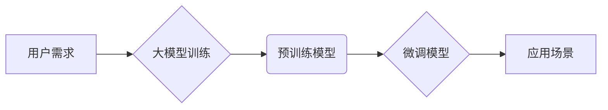

> 大模型、用户需求、市场前景、应用场景、发展趋势、挑战

## 1. 背景介绍

近年来，人工智能（AI）技术取得了飞速发展，其中大模型（Large Language Model，LLM）作为人工智能领域的重要突破，展现出强大的学习和推理能力，在自然语言处理、计算机视觉、代码生成等领域取得了令人瞩目的成果。大模型的出现，不仅推动了人工智能技术的进步，也为用户带来了全新的体验和可能性。

大模型的定义通常是指参数量在数十亿甚至数千亿级别的神经网络模型。这些模型通过海量数据进行训练，能够学习复杂的语言模式和知识结构，从而实现更精准、更自然的语言理解和生成。代表性的例子包括GPT-3、BERT、LaMDA等。

大模型的强大能力为各种应用场景提供了无限可能。例如，在聊天机器人领域，大模型可以实现更自然、更流畅的对话体验；在文本生成领域，大模型可以帮助用户创作高质量的诗歌、小说、剧本等；在代码生成领域，大模型可以辅助程序员编写代码，提高开发效率。

## 2. 核心概念与联系

大模型的构建和应用涉及多个核心概念和技术，包括：

* **深度学习:** 大模型的核心是深度神经网络，通过多层神经元网络结构，学习数据的复杂特征和模式。
* **Transformer:** Transformer是一种新型的神经网络架构，能够有效处理序列数据，是构建大模型的关键技术之一。
* **预训练:** 预训练是指在大量通用数据上训练模型，学习通用语言知识和表示，为后续特定任务的微调提供基础。
* **微调:** 微调是指在特定任务数据上对预训练模型进行调整，使其能够更好地完成特定任务。

**Mermaid 流程图:**



## 3. 核心算法原理 & 具体操作步骤

### 3.1  算法原理概述

大模型的训练主要基于深度学习算法，其中Transformer架构是目前主流的模型结构。Transformer通过自注意力机制（Self-Attention）和多头注意力机制（Multi-Head Attention）学习文本序列之间的关系，能够捕捉长距离依赖关系，提升模型的理解能力。

### 3.2  算法步骤详解

1. **数据预处理:** 将文本数据进行清洗、分词、标记等预处理操作，使其能够被模型理解。
2. **模型构建:** 根据预定的模型架构，搭建Transformer模型，包括编码器（Encoder）和解码器（Decoder）部分。
3. **模型训练:** 使用预处理后的数据训练模型，通过反向传播算法（Backpropagation）更新模型参数，使其能够更好地预测目标输出。
4. **模型评估:** 在验证集上评估模型的性能，使用指标如准确率、困惑度等衡量模型的训练效果。
5. **模型微调:** 根据任务需求，在特定任务数据上对预训练模型进行微调，提升模型在特定领域的性能。

### 3.3  算法优缺点

**优点:**

* 强大的学习能力：能够学习复杂的语言模式和知识结构。
* 泛化能力强：预训练模型在不同任务上表现良好。
* 可解释性提升：注意力机制能够帮助理解模型的决策过程。

**缺点:**

* 计算资源需求高：训练大模型需要大量的计算资源和时间。
* 数据依赖性强：模型性能受训练数据质量的影响。
* 潜在的偏见问题：模型可能继承训练数据中的偏见。

### 3.4  算法应用领域

大模型在多个领域都有广泛的应用，包括：

* **自然语言处理:** 文本分类、情感分析、机器翻译、问答系统等。
* **计算机视觉:** 图像识别、物体检测、图像生成等。
* **代码生成:** 代码补全、代码生成、代码翻译等。
* **语音识别:** 语音转文本、语音合成等。

## 4. 数学模型和公式 & 详细讲解 & 举例说明

### 4.1  数学模型构建

大模型的数学模型主要基于深度神经网络，其中Transformer架构的核心是自注意力机制和多头注意力机制。

**自注意力机制:**

自注意力机制能够学习文本序列中每个词与其他词之间的关系，并赋予每个词不同的权重，从而更好地理解上下文信息。

**公式:**

$$
Attention(Q, K, V) = softmax(\frac{QK^T}{\sqrt{d_k}})V
$$

其中：

* $Q$：查询矩阵
* $K$：键矩阵
* $V$：值矩阵
* $d_k$：键向量的维度
* $softmax$：softmax函数

**多头注意力机制:**

多头注意力机制通过并行计算多个自注意力头，学习不同角度的文本关系，从而提升模型的理解能力。

**公式:**

$$
MultiHead(Q, K, V) = Concat(head_1, head_2, ..., head_h)W^O
$$

其中：

* $head_i$：第 $i$ 个自注意力头
* $h$：注意力头的数量
* $W^O$：输出权重矩阵

### 4.2  公式推导过程

自注意力机制的公式推导过程如下：

1. 将查询矩阵 $Q$、键矩阵 $K$ 和值矩阵 $V$ 转换为相同维度。
2. 计算查询矩阵 $Q$ 与键矩阵 $K$ 的点积，并进行归一化处理，得到注意力权重矩阵。
3. 将注意力权重矩阵与值矩阵 $V$ 进行加权求和，得到最终的输出。

### 4.3  案例分析与讲解

例如，在机器翻译任务中，大模型可以利用自注意力机制学习源语言和目标语言之间的对应关系，从而实现更准确的翻译。

## 5. 项目实践：代码实例和详细解释说明

### 5.1  开发环境搭建

* Python 3.7+
* TensorFlow 或 PyTorch 深度学习框架
* CUDA 和 cuDNN (可选，用于GPU加速)

### 5.2  源代码详细实现

```python
import tensorflow as tf

# 定义Transformer模型
class Transformer(tf.keras.Model):
    def __init__(self, vocab_size, embedding_dim, num_heads, num_layers):
        super(Transformer, self).__init__()
        self.embedding = tf.keras.layers.Embedding(vocab_size, embedding_dim)
        self.transformer_layers = [
            tf.keras.layers.MultiHeadAttention(num_heads=num_heads, key_dim=embedding_dim)
            for _ in range(num_layers)
        ]
        self.dense = tf.keras.layers.Dense(vocab_size)

    def call(self, inputs):
        # ... (代码实现模型前向传播过程)

# 实例化模型
model = Transformer(vocab_size=10000, embedding_dim=512, num_heads=8, num_layers=6)

# 训练模型
model.compile(optimizer='adam', loss='sparse_categorical_crossentropy', metrics=['accuracy'])
model.fit(train_data, train_labels, epochs=10)
```

### 5.3  代码解读与分析

* 模型定义：定义了Transformer模型的结构，包括嵌入层、多头注意力层和全连接层。
* 模型训练：使用Adam优化器、交叉熵损失函数和准确率指标训练模型。

### 5.4  运行结果展示

训练完成后，可以评估模型在验证集上的性能，并使用模型进行预测。

## 6. 实际应用场景

### 6.1  聊天机器人

大模型可以构建更自然、更智能的聊天机器人，能够理解用户的意图，并提供更精准的回复。

### 6.2  文本生成

大模型可以用于生成高质量的文本内容，例如诗歌、小说、剧本等，可以辅助创作工作，提高效率。

### 6.3  代码生成

大模型可以辅助程序员编写代码，提高开发效率，并减少代码错误。

### 6.4  未来应用展望

大模型的应用场景还在不断扩展，未来可能应用于：

* **个性化教育:** 根据学生的学习情况，提供个性化的学习内容和辅导。
* **医疗诊断:** 辅助医生进行疾病诊断，提高诊断准确率。
* **科学研究:** 加速科学研究，发现新的知识和规律。

## 7. 工具和资源推荐

### 7.1  学习资源推荐

* **书籍:**
    * 《深度学习》
    * 《Transformer 详解》
* **在线课程:**
    * Coursera: 深度学习
    * fast.ai: 深度学习课程
* **博客和论坛:**
    * TensorFlow Blog
    * PyTorch Blog
    * Reddit: r/MachineLearning

### 7.2  开发工具推荐

* **TensorFlow:** 开源深度学习框架
* **PyTorch:** 开源深度学习框架
* **Hugging Face:** 提供预训练模型和工具

### 7.3  相关论文推荐

* 《Attention Is All You Need》
* 《BERT: Pre-training of Deep Bidirectional Transformers for Language Understanding》
* 《GPT-3: Language Models are Few-Shot Learners》

## 8. 总结：未来发展趋势与挑战

### 8.1  研究成果总结

大模型在自然语言处理、计算机视觉等领域取得了显著成果，展现出强大的学习和推理能力，为人工智能技术的发展提供了新的方向。

### 8.2  未来发展趋势

* **模型规模进一步扩大:** 预计未来大模型的规模将继续扩大，参数量将达到数万亿甚至数千亿级别。
* **多模态学习:** 大模型将融合文本、图像、音频等多模态数据，实现更全面的理解和生成能力。
* **可解释性提升:** 研究人员将致力于提高大模型的可解释性，使其决策过程更加透明和可理解。

### 8.3  面临的挑战

* **计算资源需求:** 训练大模型需要大量的计算资源，成本高昂。
* **数据安全和隐私:** 大模型的训练需要大量数据，如何保证数据安全和隐私是一个重要挑战。
* **伦理问题:** 大模型的应用可能带来伦理问题，例如信息操纵、偏见放大等，需要谨慎对待。

### 8.4  研究展望

未来，大模型研究将继续深入，探索更强大的模型架构、更有效的训练方法和更广泛的应用场景，推动人工智能技术向更智能、更安全、更可持续的方向发展。

## 9. 附录：常见问题与解答

* **Q: 如何选择合适的预训练模型？**
* **A:** 选择预训练模型需要考虑任务类型、模型规模、训练数据等因素。

* **Q: 如何进行大模型的微调？**
* **A:** 微调需要准备特定任务的数据，并调整模型的超参数，例如学习率、批处理大小等。

* **Q: 如何评估大模型的性能？**
* **A:** 可以使用准确率、困惑度、BLEU等指标评估大模型的性能。


作者：禅与计算机程序设计艺术 / Zen and the Art of Computer Programming 
<end_of_turn>